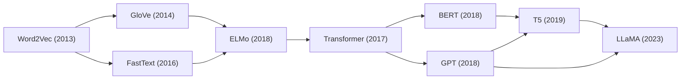
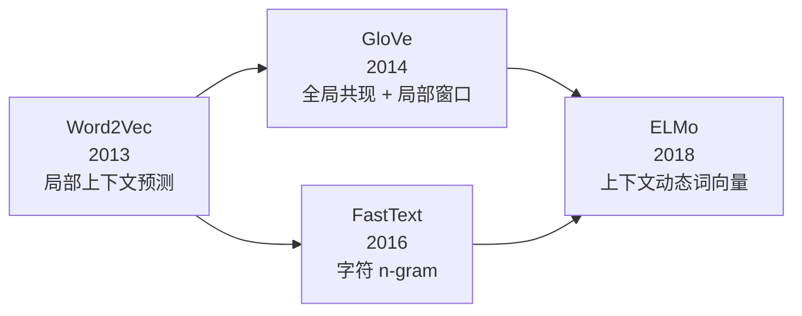
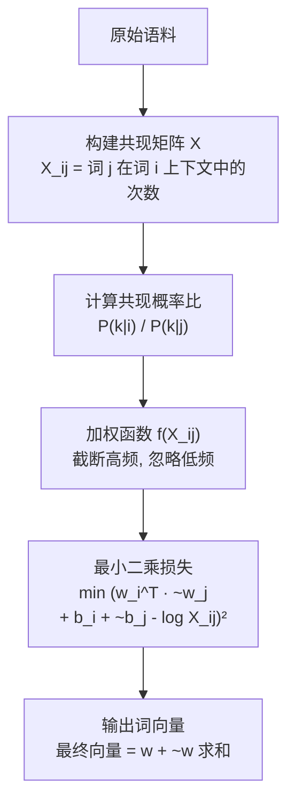
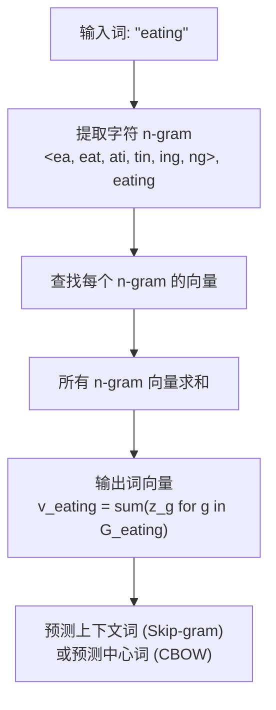

# GloVe / FastText

## 知识地图



## 前置知识

- **Word2Vec**：理解 CBOW 和 Skip-gram 的基本原理，以及负采样的动机。
- **共现矩阵 (Co-occurrence Matrix)**：一个 $V \times V$ 的矩阵，$X_{ij}$ 表示词 $j$ 出现在词 $i$ 上下文中的次数。GloVe 的核心数据结构。
- **矩阵分解 (Matrix Factorization)**：如 SVD，将大型稀疏矩阵分解为低维稠密矩阵的乘积。GloVe 的理论基础。
- **N-gram 语言模型**：理解字符 n-gram 的概念，FastText 的子词建模基础。

## 模型演化路线



| 阶段 | 模型 | 核心突破 |
|------|------|----------|
| 局部预测 | Word2Vec | 用预测任务高效学习词向量 |
| 全局+局部融合 | GloVe | 利用全局共现统计改善词向量质量 |
| 子词建模 | FastText | 字符 n-gram 解决 OOV 和形态学 |
| 动态化 | ELMo | 词向量随上下文变化 |

## 为什么会出现 (Why)

### GloVe 的动机

Word2Vec 只利用**局部上下文窗口**（通常 5-10 个词），每个训练样本只看几个词对，**无法显式利用全局共现统计**。而传统的矩阵分解方法（如 LSA）虽然使用了全局统计，但在词类比任务上表现不如预测类方法。

GloVe 提出：**一个好模型应该同时利用全局共现统计和局部上下文信息**。

### FastText 的动机

Word2Vec 和 GloVe 将每个词视为不可分割的原子单元，存在两个致命问题：
1. **OOV (Out-of-Vocabulary)**：训练时未见过的词无法获得向量（只能给一个随机向量或 <UNK>）
2. **忽略词形信息**：如 "run"、"running"、"runner" 形态学上的关联被完全忽略

FastText 通过引入**字符 n-gram** 解决这两个问题。

## 解决什么问题 (Problem)

- **GloVe**：利用全局词共现统计信息，生成比纯局部窗口方法质量更高的词向量。
- **FastText**：用子词（字符 n-gram）建模，使词向量天然支持 OOV 词，并利用词形（前缀、后缀、词根）信息。

## 核心思想 (Core Idea)

- **GloVe**：结合全局共现矩阵分解和局部上下文窗口预测两种范式的优点，基于共现概率**比值**编码语义关系。
- **FastText**：将每个词表示为字符 n-gram 向量之和，使模型能处理未见词并利用形态学信息。

---

## GloVe (Global Vectors)

### 共现概率比

GloVe 的核心洞察：**共现概率的比值**编码了语义关系：

$$\frac{P(k|\text{ice})}{P(k|\text{steam})}$$

- 当 $k=$ "solid"，比值大（>1）
- 当 $k=$ "gas"，比值小（<1）
- 当 $k=$ "water" 或 "fashion"，比值接近 1

**通俗解释：** 单个词的共现概率（如 P(solid|ice)=0.019）本身不直接反映语义关系，但两个词的共现概率**比值**能直接揭示语义。比值远大于 1 说明 k 和 ice 相关和 steam 无关，远小于 1 说明 k 和 steam 相关和 ice 无关，接近 1 说明 k 和两个都相关或都不相关。这个比值天然编码了"固体 vs 气体"的语义对立。

### 目标函数

$$J = \sum_{i,j=1}^{V} f(X_{ij}) (\mathbf{w}_i^T \tilde{\mathbf{w}}_j + b_i + \tilde{b}_j - \log X_{ij})^2$$

其中 $X_{ij}$ 是词 $j$ 在词 $i$ 的上下文中出现的次数。

**通俗解释：** 模型的目标是让两个词向量的内积加上各自的偏置，尽可能接近它们共现次数的对数。$\log X_{ij}$ 是"真实共现值"，向量内积是"模型预测值"，两者之差的平方即为损失。$f(X_{ij})$ 是加权函数，用于控制高频词的影响。

**加权函数 $f$**：
- $f(0) = 0$
- 对高频词做截断（防止"的"、"是"等词主导损失）

$$f(x) = \begin{cases} (x/x_{max})^\alpha & x < x_{max} \\ 1 & \text{otherwise} \end{cases}$$

通常 $x_{max}=100, \alpha=0.75$。

**通俗解释：** 对于出现次数极少（接近0）的词对，权重为 0，直接忽略；对于出现次数极高的词对（如超过 100 次），权重截断为 1，不让它们主导整个损失函数；中间频率的词对，权重随次数以 $\alpha=0.75$ 的次方增长，给予适当的重视。

---

## FastText

### 核心思想

FastText 将每个词表示为 **字符 n-gram** 的向量和。例如 "where" 的 tri-gram：`<wh, whe, her, ere, re>`。

### 优势

1. **处理 OOV**：未见词可由已知字符 n-gram 组成
2. **利用词形信息**：前缀、后缀、词根
3. **少资源语言**：利用形态学（如英语、法语）

### 数学表示

词 $w$ 的向量：

$$\mathbf{v}_w = \sum_{g \in G_w} \mathbf{z}_g$$

其中 $G_w$ 是词 $w$ 的字符 n-gram 集合（包括完整的词本身作为一个特殊 n-gram）。

**通俗解释：** 一个词的向量 = 组成它的所有字符片段向量的简单求和。"eating" 的向量 ≈ "<ea" + "eat" + "ati" + "tin" + "ing" + "ng>" + "eating" 这些 n-gram 片段向量的总和。因为模型见过 "eat" 和 "ing" 相关的 n-gram，即使没见过 "eating"，也能拼出它的向量。

### 子词信息

| 语言 | 利用的形态信息 |
|------|---------------|
| 英语 | 前缀 (un-, re-) 后缀 (-ing, -ed, -ly) |
| 德语 | 复合词分解 |
| 中文 | 偏旁部首/笔画 |

## 可视化展示

### GloVe 架构图



### FastText 架构图



## 最小可运行代码

### GloVe — 使用预训练向量

```python
from gensim.scripts.glove2word2vec import glove2word2vec
from gensim.models import KeyedVectors

# 将 GloVe 格式转为 Word2Vec 格式
glove2word2vec('glove.6B.100d.txt', 'glove.6B.100d.w2v.txt')

model = KeyedVectors.load_word2vec_format('glove.6B.100d.w2v.txt')
similar = model.most_similar('king', topn=5)
```

### FastText — Gensim 训练

```python
from gensim.models import FastText

model = FastText(
    sentences,
    vector_size=300,
    window=5,
    min_count=5,
    min_n=3,       # 最小 n-gram 长度
    max_n=6,       # 最大 n-gram 长度
    epochs=10,
)

# 获取词向量（即使是 OOV 词）
vec = model.wv['eating']
# 对完全未见过的词也能获取向量！
oov_vec = model.wv['unbelievableeeee']
```

## 工业界应用

| 模型 | 应用场景 | 说明 |
|------|----------|------|
| GloVe | 文本相似度计算 | 全局统计使其在语义相似度任务上表现稳定 |
| GloVe | 信息检索 | 查询-文档匹配，GloVe 对高频词的建模更鲁棒 |
| FastText | 拼写纠错 | 利用字符 n-gram 识别拼写变体 |
| FastText | 多语言 NLP | 形态学丰富的语言（芬兰语、土耳其语等）效果显著 |
| FastText | 社交媒体文本 | 处理大量 OOV（新词、网络用语、拼写错误） |
| FastText | 语言识别 | 利用子词特征对短文本做语言分类 |

## 对比表格

| | Word2Vec | GloVe | FastText |
|------|----------|-------|----------|
| 依据 | 局部上下文 | 全局共现 | 局部上下文 |
| OOV | 不支持 | 不支持 | 支持（字符 n-gram） |
| 形态学 | 不利用 | 不利用 | 利用 |
| 训练速度 | 快（负采样）| 中等 | 快 |
| 数据需求 | 可处理流式数据 | 需先构建共现矩阵 | 可处理流式数据 |
| 语义类比 | 好 | 好 | 好（且支持形态类比） |
| 何时用 | 通用 | 需全局统计 | 多形态语言 / OOV 多 |

## 学完后建议继续学习

1. **Word2Vec**（回顾）：理解 GloVe 和 FastText 是在 Word2Vec 基础上的改进
2. **ELMo**：了解从"静态词向量"到"动态上下文词向量"的范式转变
3. **BERT**：理解如何在字符 n-gram 思路上进一步升级为 subword tokenization（WordPiece / BPE）

## 高频面试题

### Q1: GloVe 相比 Word2Vec 的核心改进是什么？

**标准答案：**
- **全局统计信息**：GloVe 显式利用了全局词共现矩阵 $X$，而 Word2Vec 仅基于局部滑动窗口采样，每个训练样本只看几个词对。
- **共现概率比**：GloVe 的损失函数是直接建模 $\log X_{ij}$（共现次数的对数），而非 Word2Vec 的交叉熵。这使 GloVe 能全局地建模词与词之间的关系。
- **加权截断函数**：$f(X_{ij})$ 对高频共现进行截断，避免"的"、"是"等功能词主导损失函数。Word2Vec 用负采样从侧面控制这个问题。
- **实际效果**：在词类比和语义相似度任务上，两者性能相当，GloVe 在需要全局语义理解的场景（如信息检索）可能略优。

### Q2: FastText 是如何处理 OOV 词的？为什么 Word2Vec 做不到？

**标准答案：**
- Word2Vec 为每个完整词分配一个独立向量，训练时未见过的词在词表中不存在，只能给随机向量或 <UNK>。
- FastText 将每个词分解为字符 n-gram（如 "eating" → `<ea, eat, ati, tin, ing, ng>, eating`），词向量是这些 n-gram 向量之和。
- 当遇到 OOV 词时，模型可以用已知的字符 n-gram（如见过 "eat"、"ing" 等片段）拼出该词的向量。
- 缺点：训练和推理比 Word2Vec 更慢（一个词要查多个 n-gram 并求和）。

### Q3: GloVe 的共现概率比值为什么能编码语义关系？

**标准答案：**
- 单个词的条件概率 $P(k|i)$ 本身受词的总体频率影响，例如 $P(\text{water}|\text{ice})$ 和 $P(\text{water}|\text{fashion})$ 可能都较小。
- 但比值 $\frac{P(k|i)}{P(k|j)}$ 消去了总体频率的影响，直接反映 k 与 i/j 的**相对关联**。比值远大于 1 说明 k 与 i 相关但不与 j 相关；接近 1 说明 k 与两者相关程度相近或都不相关。
- 这个比值天然编码了词对之间的区别性特征维度，如 "solid vs gas"、"male vs female" 等语义轴。
- GloVe 的损失函数 $\log X_{ij} \approx w_i^T \tilde{w}_j + b_i + \tilde{b}_j$ 实际上是在建模日志概率比的对数线性模型。

### Q4: FastText 的 n-gram 长度是如何选择的？min_n 和 max_n 对效果有什么影响？

**标准答案：**
- **min_n**：最小 n-gram 长度，通常设为 3（太小会包含过多无意义的字符组合，太大则丢失短字符特征）。
- **max_n**：最大 n-gram 长度，通常设为 5 或 6（太大会导致 n-gram 数量爆炸且单个 n-gram 出现频率过低）。
- **影响**：min_n 过小（如 2）会引入大量噪音（如 "th"、"he" 等太高频的片段），过大会丢失前缀/后缀信息（如 "-ed" 长度为 3）。max_n 越大，每个词的 n-gram 越多，训练越慢但形态信息越丰富。
- 实践中常用 `min_n=3, max_n=6`，对英语等西方语言效果良好。中文等语言需要特殊处理（偏旁部首或单字）。
