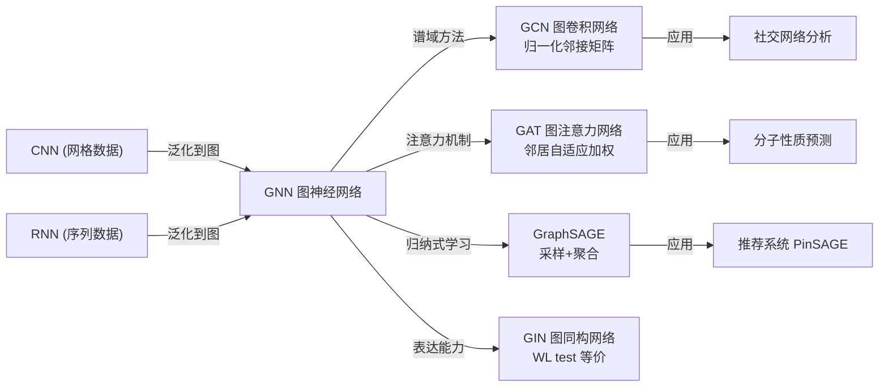
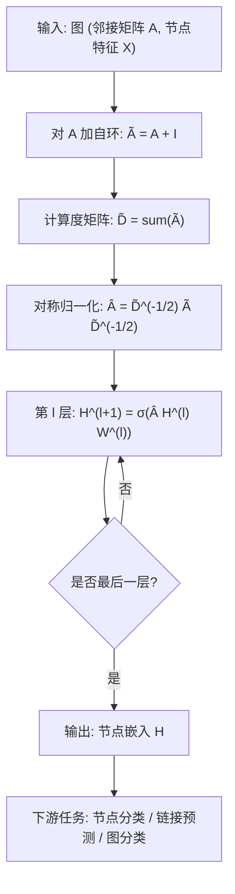
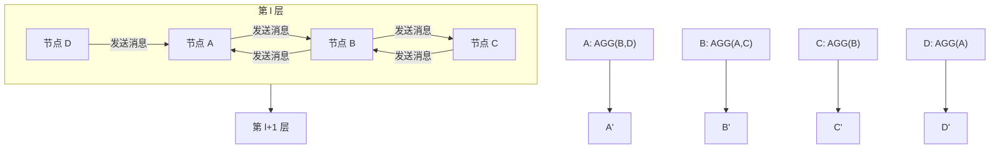

# GNN (图神经网络)

## 知识地图



## 前置知识

- 图论基础（节点、边、邻接矩阵、度矩阵）
- 消息传递 (Message Passing) 的基本概念
- CNN 中的卷积操作（局部聚合）
- 注意力机制 (Attention) 的基本原理

## 为什么会出现 (Why)

CNN 处理的是规则网格数据（图像像素排列在规则的 2D 网格上），RNN 处理的是序列数据（线性链式结构）。但现实中大量数据是**图结构**——社交网络中的人与人关系、分子中的原子与化学键、知识图谱中的实体与关系、交通路网的连通性。这些数据的拓扑结构不规则，CNN 的固定卷积核无法直接应用。

## 解决什么问题 (Problem)

在**不规则的图结构数据**上进行节点分类、边预测（链接预测）、图分类等任务。GNN 通过"消息传递"机制让每个节点从其邻居聚合信息，从而学习到包含拓扑结构的节点表示。

## 核心思想 (Core Idea)

**GNN 通过消息传递 (Message Passing) 让每个节点聚合邻居信息来更新自身表示，多层堆叠后节点能感知更大范围的图结构；GCN/GAT/GraphSAGE/GIN 的区别在于"怎么聚合"——归一化平均、注意力加权、采样聚合、还是求和。**

---

## 数学定义与原理解析

### 消息传递框架（统一形式）

对每一层 $l$：

$$
\mathbf{h}_v^{(l+1)} = \text{UPDATE}\left( \mathbf{h}_v^{(l)}, \text{AGGREGATE}\left( \{\mathbf{h}_u^{(l)} : u \in \mathcal{N}(v)\} \right) \right)
$$

**通俗解释：** 每一层做两件事——(1) 收集邻居的消息（AGGREGATE），(2) 结合自己的旧特征和邻居消息更新自己（UPDATE）。一层 GNN = 每个节点能看到 1 跳邻居；二层 = 能看到 2 跳邻居；以此类推。

### GCN (Graph Convolutional Network)

使用对称归一化的邻接矩阵：

$$
\mathbf{H}^{(l+1)} = \sigma\left( \tilde{\mathbf{D}}^{-\frac12} \tilde{\mathbf{A}} \tilde{\mathbf{D}}^{-\frac12} \mathbf{H}^{(l)} \mathbf{W}^{(l)} \right)
$$

其中 $\tilde{\mathbf{A}} = \mathbf{A} + \mathbf{I}$（加自环），$\tilde{D}_{ii} = \sum_j \tilde{A}_{ij}$。

**通俗解释：** 首先 $\mathbf{H}^{(l)} \mathbf{W}^{(l)}$ 是所有节点的特征变换（普通全连接层）。然后 $\tilde{\mathbf{D}}^{-\frac12} \tilde{\mathbf{A}} \tilde{\mathbf{D}}^{-\frac12}$ 做邻居聚合——用度的平方根做对称归一化，确保度大的节点（如社交网络中的"网红"）不会主导聚合结果。$\tilde{\mathbf{A}} = \mathbf{A} + \mathbf{I}$ 加了自环，让节点在聚合邻居时也保留自身信息。GCN 本质是"对每个节点的邻居做加权平均"。

### GAT (Graph Attention Network)

邻居聚合时的权重由注意力机制自动学习：

$$
\alpha_{vu} = \frac{\exp(\text{LeakyReLU}(\mathbf{a}^T [\mathbf{W}\mathbf{h}_v \| \mathbf{W}\mathbf{h}_u]))}{\sum_{k \in \mathcal{N}(v)} \exp(\text{LeakyReLU}(\mathbf{a}^T [\mathbf{W}\mathbf{h}_v \| \mathbf{W}\mathbf{h}_k]))}
$$

$$
\mathbf{h}_v' = \sigma\left( \sum_{u \in \mathcal{N}(v)} \alpha_{vu} \mathbf{W} \mathbf{h}_u \right)
$$

**通俗解释：** GCN 对每个邻居一视同仁（权重只取决于图的拓扑结构——度）。GAT 引入了"注意力"机制——每个邻居的重要性由数据驱动学习。给定中心节点 $v$ 和邻居 $u$，注意力系数 $\alpha_{vu}$ 通过一个小的神经网络（$\mathbf{a}^T$ 是可学习参数）来计算两者特征的"匹配度"。最终聚合是邻居特征的加权求和，权重由注意力系数决定。多头注意力：$K$ 个头并行计算，结果拼接（或平均），类似 Transformer 的多头注意力。

### GraphSAGE

不再依赖全图的邻接矩阵，而是对邻居**采样**+**聚合**：

$$
\mathbf{h}_v^{(l+1)} = \sigma\left( \mathbf{W}^{(l)} \cdot \text{CONCAT}\left( \mathbf{h}_v^{(l)}, \text{AGG}\left( \{\mathbf{h}_u^{(l)} : u \in \mathcal{N}(v)\} \right) \right) \right)
$$

AGG 可以是 Mean/Max/LSTM pooling。

**通俗解释：** GCN 和 GAT 都需要完整的邻接矩阵（转导式学习，transductive），训练时见到所有节点。GraphSAGE 的核心创新是"采样"——不存完整的邻接矩阵，而是在每一层随机抽取固定数量的邻居，只对这些采样邻居做聚合。好处：可以泛化到训练时没见过的节点（归纳式学习，inductive），而且内存占用可控（不管图多大，每个节点的邻居数固定）。

---

## 算法流程图



---

## 可视化展示

### 消息传递范式



### GNN 变体对比

```echarts
return {
  tooltip: { trigger: "axis", confine: true },
  title: { top: 5,  text: 'GNN 变体对比', left: 'center', textStyle: { fontSize: 12 } },
  xAxis: { type: 'category', data: ['GCN', 'GAT', 'GraphSAGE', 'GIN'] },
  yAxis: { type: 'value', min: 0, max: 1, name: '相对得分' },
  legend: { top: 28,  data: ['表达能力', '计算效率', 'Inductive'] },
  series: [
    { name: '表达能力', type: 'bar', data: [0.65, 0.85, 0.75, 0.95], itemStyle: { color: '#2c3e50' } },
    { name: '计算效率', type: 'bar', data: [0.9, 0.7, 0.8, 0.75], itemStyle: { color: '#16a085' } },
    { name: 'Inductive', type: 'bar', data: [0.0, 0.3, 1.0, 0.0], itemStyle: { color: '#2980b9' } }
  ],
  grid: { left: 60, right: 20, top: 55, bottom: 55 }
}
```

GIN 表达力最强（理论上和 WL test 一样强），GCN 最简单高效，GraphSAGE 支持 inductive 推理（可泛化到新节点）。

---

## 最小可运行代码

### PyTorch -- GCN Layer

```python
import torch
import torch.nn as nn
import torch.nn.functional as F

class GCNLayer(nn.Module):
    def __init__(self, in_dim, out_dim):
        super().__init__()
        self.W = nn.Linear(in_dim, out_dim)

    def forward(self, x, adj):
        """
        x: [N, in_dim]  节点特征
        adj: [N, N]      邻接矩阵（含自环）
        """
        # 对称归一化: D^(-1/2) * A * D^(-1/2)
        deg = adj.sum(dim=1)  # [N]
        deg_inv_sqrt = torch.pow(deg, -0.5)
        deg_inv_sqrt[torch.isinf(deg_inv_sqrt)] = 0
        norm = deg_inv_sqrt.unsqueeze(1) * deg_inv_sqrt.unsqueeze(0)
        adj_norm = adj * norm

        return F.relu(self.W(adj_norm @ x))
```

### PyTorch -- GAT Layer

```python
class GATLayer(nn.Module):
    def __init__(self, in_dim, out_dim, n_heads=4, dropout=0.2):
        super().__init__()
        self.n_heads = n_heads
        self.out_dim = out_dim
        self.W = nn.Linear(in_dim, out_dim * n_heads, bias=False)
        self.a = nn.Parameter(torch.randn(1, n_heads, 2 * out_dim))
        self.dropout = dropout

    def forward(self, x, adj):
        # x: [N, in_dim]
        N = x.shape[0]
        h = self.W(x).view(N, self.n_heads, self.out_dim)  # [N, H, D]

        # 计算注意力系数
        h_i = h.unsqueeze(1).repeat(1, N, 1, 1)  # [N, N, H, D]
        h_j = h.unsqueeze(0).repeat(N, 1, 1, 1)  # [N, N, H, D]
        cat = torch.cat([h_i, h_j], dim=-1)  # [N, N, H, 2D]
        e = torch.sum(self.a * cat, dim=-1)  # [N, N, H]
        e = F.leaky_relu(e, 0.2)

        # Mask 非邻居
        e = e.masked_fill(adj.unsqueeze(-1) == 0, float('-inf'))
        alpha = F.softmax(e, dim=1)  # [N, N, H]
        alpha = F.dropout(alpha, p=self.dropout, training=self.training)

        out = torch.einsum('ijh,jhd->ihd', alpha, h)  # [N, H, D]
        return out.flatten(1)  # [N, H*D]
```

### PyTorch -- GraphSAGE

```python
class GraphSAGELayer(nn.Module):
    def __init__(self, in_dim, out_dim, aggr='mean'):
        super().__init__()
        self.aggr = aggr
        self.W = nn.Linear(2 * in_dim, out_dim)

    def forward(self, x, adj):
        # 邻居聚合
        if self.aggr == 'mean':
            neighbor_msg = adj @ x / adj.sum(dim=1, keepdim=True).clamp(min=1)
        elif self.aggr == 'max':
            neighbor_msg = torch.max(x.unsqueeze(0) * adj.unsqueeze(-1), dim=1)[0]
        # Concat + transform
        combined = torch.cat([x, neighbor_msg], dim=-1)
        return F.relu(self.W(combined))
```

---

## 工业界应用

| 方法 | 应用场景 | 代表系统/产品 |
|------|----------|-------------|
| GCN | 引文网络分类、交通预测 | 学术引用分析 |
| GAT | 分子性质预测、药物发现 | AlphaFold 相关、分子筛选 |
| GraphSAGE | 大规模推荐系统 | Pinterest PinSAGE |
| GIN | 图分类、化学分子图分析 | 药物毒性预测 |
| GNN + RL | 芯片布局优化 | Google TPU 芯片设计 |

---

## 对比表格

| | GCN | GAT | GraphSAGE | GIN |
|------|-----|-----|-----------|-----|
| 聚合方式 | 归一化平均 (度归一化) | 注意力加权 (数据驱动) | 采样 + Mean/Max/LSTM | 求和 (理论最优) |
| 权重来源 | 图拓扑 (邻接矩阵) | 节点特征 (学习得到) | 固定采样策略 | 固定 (求和) |
| 是否需要全图 | 是 (Transductive) | 是 | 否 (Inductive) | 是 |
| 表达能力 | 中 | 高 | 中-高 | 最高 (等同 WL test) |
| 内存复杂度 | $O(N^2)$ | $O(N^2)$ | $O(N \cdot S)$ (采样) | $O(N^2)$ |
| 多头机制 | 无 | 有 (Multi-head) | 无 | 无 |
| 适用场景 | 小/中规模图 | 异质图/关系重要 | 大规模图/新节点 | 图分类任务 |

---

## 学完后建议继续学习

1. **PyG (PyTorch Geometric) / DGL** -- GNN 的主流深度学习框架
2. **GNN 的过平滑问题 (Over-Smoothing)** -- 层数加深后所有节点表示趋同，以及解决方案 (DropEdge, PairNorm)
3. **异质图神经网络 (Heterogeneous GNN)** -- 处理多种节点类型和边类型（如学术图：论文-作者-会议）
4. **GNN 的可扩展性 (GraphSAINT, Cluster-GCN)** -- 如何在大规模图（十亿节点级）上训练 GNN

---

## 高频面试题

### Q1: GCN 的归一化 $\tilde{\mathbf{D}}^{-\frac12} \tilde{\mathbf{A}} \tilde{\mathbf{D}}^{-\frac12}$ 为什么设计成这样？

**答：** 对称归一化有两个目的：(1) **防止邻居聚合时度大节点主导**：如果不归一化，度大的节点（如 100 个邻居）聚合后的特征幅值远大于度小的节点（如 2 个邻居），导致训练不稳定。除以度的平方根（$1/\sqrt{d_i d_j}$）使聚合后的特征幅值合理；(2) **对称归一化的谱意义**：$\tilde{\mathbf{D}}^{-\frac12} \tilde{\mathbf{A}} \tilde{\mathbf{D}}^{-\frac12}$ 的最大特征值被限制在 [-1, 1]，保证多层堆叠时数值稳定。自环 $\tilde{\mathbf{A}} = \mathbf{A} + \mathbf{I}$ 确保节点在聚合邻居时也保留自身信息。

### Q2: GCN 和 GAT 的核心区别是什么？各自适合什么场景？

**答：** GCN 的邻居权重是固定的（只取决于节点度），GAT 的邻居权重是动态学习的（取决于节点特征）。GCN 适合结构信息比特征信息更重要的场景（所有邻居等权），GAT 适合邻居重要性不同的异质图场景（有些邻居比另一些更重要）。GCN 计算更快（不需要注意力计算），GAT 表达能力更强但计算开销大。一个常见实践经验：如果节点特征本身就很有区分力（如分子图中原子的化学性质），GAT 通常更好；如果图结构高度规则（如网格），GCN 足够。

### Q3: 什么是 Transductive 和 Inductive 学习？GraphSAGE 为什么是 Inductive？

**答：** Transductive 学习在训练时需要看到所有节点（包括测试节点）的特征和图结构，只是训练时不使用测试节点的标签。GCN 和 GAT 都是 Transductive——它们依赖完整的邻接矩阵进行归一化，新节点加入后需要重新训练。Inductive 学习在训练时完全不看到测试节点，测试时模型可以直接处理新节点。GraphSAGE 的核心创新：不依赖全图邻接矩阵，而是学习一个"邻居聚合函数"，测试时对新节点的邻居采样后直接使用学到的聚合函数。这在推荐系统中极其重要——每天都有新用户注册，不能每次都重新训练整个图。

### Q4: 为什么 GNN 通常只堆 2-4 层？加深会发生什么？

**答：** 过平滑问题 (Over-Smoothing)：随着层数增加，节点的表示通过邻居聚合逐渐趋同。直观上，每个节点每层多吸收一跳邻居的信息，3 层后很多节点可能已经"看"到了图的大部分——节点的感受野高度重叠，导致它们的表示几乎无法区分（所有节点的表示趋近于同一个向量）。这就像在社交网络中，你朋友的朋友的朋友……最终覆盖了几乎所有人。解决方案：使用残差连接、DropEdge（随机丢弃边）、PairNorm、或者限制为浅层 + 更大隐藏维度。

### Q5: GNN 和 CNN 有什么本质联系？

**答：** GCN 可以理解为 CNN 在图上的泛化。CNN 在图像上做卷积时，每个像素聚合其固定大小的邻居区域（3x3 窗口），权重共享（同一卷积核在不同位置复用）。GCN 做的是同样的事——每个节点聚合其邻居（由邻接矩阵定义的"窗口"，形状不规则，每个节点的邻居数量不同），权重通过 $W^{(l)}$ 共享。谱域视角更深入：CNN 的卷积等价于在图的"拉普拉斯特征基"上做滤波，而 GCN 则是直接用图拉普拉斯矩阵的多项式近似这个滤波操作。
