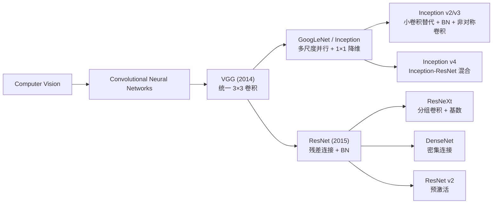
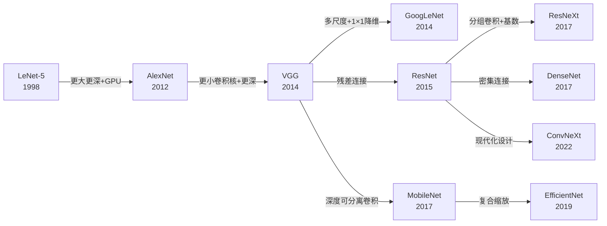
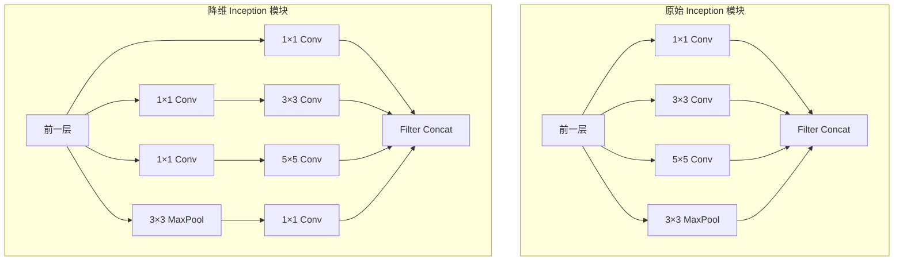
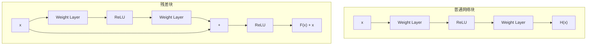
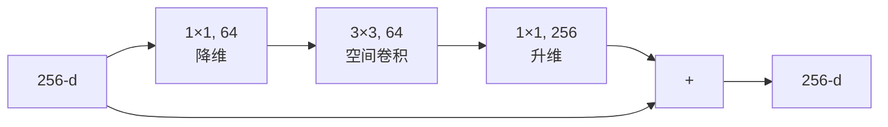

# GoogLeNet / ResNet

## 知识地图



## 前置知识

- 卷积操作的基本概念（卷积核、步长、填充、感受野）
- VGG 的结构和 3×3 堆叠设计哲学
- 梯度消失/爆炸问题的原理
- Batch Normalization 的原理和作用
- 激活函数（ReLU、Sigmoid）的特性和优缺点
- ImageNet 分类任务和 top-1/top-5 评估指标
- Flops（浮点运算次数）与 Params（参数量）的区别

## 模型演化路线



| 模型 | 年份 | 关键创新 | 解决的问题 |
|------|------|---------|-----------|
| GoogLeNet | 2014 | Inception 模块（多尺度并行） | 不同图片中物体尺度差异大，单一卷积核尺寸无法最优 |
| ResNet | 2015 | 残差连接 (Skip Connection) | 深层网络难以训练，梯度消失/网络退化 |
| DenseNet | 2017 | 密集连接（所有前层输出拼接） | 特征复用和梯度传播效率 |

---

## GoogLeNet / Inception (2014)

### 为什么会出现

VGG 证明了"深就是好"——但直接在 VGG 框架下继续加深遇到了两个问题：

1. **计算量爆炸**：VGG16 已有 138M 参数，如果继续加深到 30 层，计算量和内存消耗难以承受。
2. **物体尺度多样性**：同一张图片中的物体大小差异巨大（狗 vs 草地），固定大小的卷积核（如 3×3）不一定是最优选择——大物体需要大感受野，小物体需要小感受野。

Google 团队的 Christian Szegedy 等人提出了 Inception 架构：不是"选"一个最好的卷积核大小，而是**让网络并行使用多种卷积核，让梯度自己决定哪条路径更重要**。

### 解决什么问题

解决两个核心矛盾：
- **深度 vs 计算量的矛盾**——用 1×1 卷积降维，大幅减少计算量
- **单一感受野 vs 多尺度物体的矛盾**——并行使用 1×1、3×3、5×5 卷积和池化

### 核心思想

**让网络在同一层并行使用多种尺度的卷积核，然后把结果拼起来——不是选择最好的尺度，而是让网络自己学会为每个位置选择最适合的尺度。**

### Inception 模块

并行使用多种卷积核大小，让网络自己"选择"合适的尺度：

```
前一层 ──→ 1×1 Conv ──→ 3×3 Conv ──→ 5×5 Conv ──→ 3×3 MaxPool ──→ Concat
```

**1×1 卷积（Bottleneck）** 用于降维，减少计算量。

### 可视化展示



### 数学模型

1×1 卷积降维：

$$\mathbf{y} = \mathbf{W}_{1\times1} * \mathbf{x}, \quad \mathbf{W}_{1\times1} \in \mathbb{R}^{d_{out} \times d_{in} \times 1 \times 1}$$

**通俗解释：** 想象你在整理文件柜，每个文件柜（通道）里有很多文件（空间位置）。1×1 卷积不看相邻文件柜，只是把当前的多个文件柜"合并/压缩"成更少的几个文件柜——减少数量但保留每个文件柜内的信息量。这样后面 3×3 和 5×5 大卷积操作的对象就少了，省了大量计算。

Inception 模块输出：

$$\mathbf{y} = [\text{Conv}_{1\times1} \| \text{Conv}_{3\times3} \| \text{Conv}_{5\times5} \| \text{MaxPool}_{3\times3}]$$

**通俗解释：** 同一个位置，同时用"放大镜"（1×1 看细节）、"正常视野"（3×3 看局部）、"广角镜"（5×5 看全局）各看一遍，所有视角的结果拼在一起作为这个位置的最终理解。

### Inception v2/v3 改进

- 用两个 $3 \times 3$ 卷积替代 $5 \times 5$
- 引入 Batch Normalization
- 非对称卷积：$n \times 1 + 1 \times n$ 替代 $n \times n$

**通俗解释（非对称卷积）：** 把一个 3×3 的正方形卷积拆成 3×1（水平条）然后 1×3（垂直条），两步的效果跟 3×3 一样，但参数从 9 个降到了 6 个——就像把正方形裁成了两条边，先看横再看竖。

### 辅助分类器

网络中间层添加额外的分类头，帮助梯度传播（类似于深度监督）。

**通俗解释：** 在网络的"半山腰"也放一个分类器，让中间层也能接收来自 loss 的梯度信号，防止深层网络前面的层"被遗忘"（梯度传不到）。

---

## ResNet (2015)

### 为什么会出现

到 2014 年底，VGG 和 GoogLeNet 证明了"深就是好"。但是当研究人员试图继续加深网络时，遇到了一个反直觉的现象：

**56 层的网络在训练集和测试集上的表现都比 20 层的更差。** 这不是过拟合（过拟合应该是训练误差低但测试误差高），而是**网络退化（Degradation Problem）**——深层网络连训练误差都降不下来。

原因并非梯度消失（有 BN 和 ReLU），而是：**深层网络的优化空间更复杂，SGD 难以找到比浅层网络更好的解。** 理论上，深层网络至少可以不比浅层差（多出来的层可以学恒等映射），但实际上优化器做不到。

### 解决什么问题

解决**网络退化**问题——让深层网络"至少不差于浅层网络"。核心思路：**让网络学习残差（输入和期望输出之间的差异），而不是直接学习期望输出。**

### 核心思想

**添加一个"高速公路"（Skip Connection），让输入绕过卷积层直接加到输出上——如果多出来的层学不到有用的东西，就让它们输出 0（恒等映射），至少不比原来差。**

### 残差学习

$$\mathbf{y} = \mathcal{F}(\mathbf{x}, \{W_i\}) + \mathbf{x}$$

学习残差 $\mathcal{F}(\mathbf{x})$ 而非直接学习映射 $\mathcal{H}(\mathbf{x})$。

**通俗解释：** 假设你搭积木，已经搭了 20 层（输入 x），现在再加 2 层。你不需要从零开始重新设计整个 22 层的塔（学习完整映射 H(x)），你只需要调整新增的 2 层来"修修补补"已有的 20 层（学习残差 F(x)）。如果新增的层没用，就让它什么也不做（F(x)=0），输出直接等于输入。

### 为什么有效？

如果最优映射是恒等映射，残差块只需将 $\mathcal{F}(\mathbf{x})$ 推到 0（远比学习恒等映射容易）。

**梯度高速公路**：

$$\frac{\partial L}{\partial \mathbf{x}} = \frac{\partial L}{\partial \mathbf{y}} \left(1 + \frac{\partial \mathcal{F}}{\partial \mathbf{x}}\right)$$

加法使得梯度可以不经变换地传播到浅层。

**通俗解释：** 求导时，skip connection 贡献了一个常量 1 的梯度。即使 $\frac{\partial \mathcal{F}}{\partial \mathbf{x}}$ 非常小（梯度衰减），也至少还有 1 的梯度能传到前面。这就像一个"最低保障"——无论网络多深，梯度都不会降到 0。

### 可视化展示



### Bottleneck 残差块

用 $1 \times 1 \to 3 \times 3 \to 1 \times 1$ 代替两个 $3 \times 3$：



**通俗解释：** 先收缩通道（256→64，省钱），然后做空间卷积（3×3，感知邻域），再膨胀回来（64→256）。比两个 3×3 各 256 通道省了大量参数——就像先把水挤到细管子里加压，处理完再放回粗管子里。

### ResNet 经典配置

| 层数 | 架构 | 参数量 |
|------|------|--------|
| 18 | BasicBlock [2,2,2,2] | 11M |
| 34 | BasicBlock [3,4,6,3] | 21M |
| 50 | Bottleneck [3,4,6,3] | 25M |
| 101 | Bottleneck [3,4,23,3] | 44M |
| 152 | Bottleneck [3,8,36,3] | 60M |

---

## 最小可运行代码

```python
import torch
import torch.nn as nn
import torch.nn.functional as F

# ---------- GoogLeNet 简化 Inception 模块 ----------
class InceptionModule(nn.Module):
    def __init__(self, in_channels, out_1x1, red_3x3, out_3x3, red_5x5, out_5x5, out_pool):
        super().__init__()
        # 1×1 分支
        self.branch1 = nn.Conv2d(in_channels, out_1x1, kernel_size=1)

        # 1×1 → 3×3 分支
        self.branch2 = nn.Sequential(
            nn.Conv2d(in_channels, red_3x3, kernel_size=1),
            nn.Conv2d(red_3x3, out_3x3, kernel_size=3, padding=1),
        )

        # 1×1 → 5×5 分支
        self.branch3 = nn.Sequential(
            nn.Conv2d(in_channels, red_5x5, kernel_size=1),
            nn.Conv2d(red_5x5, out_5x5, kernel_size=5, padding=2),
        )

        # MaxPool → 1×1 分支
        self.branch4 = nn.Sequential(
            nn.MaxPool2d(kernel_size=3, stride=1, padding=1),
            nn.Conv2d(in_channels, out_pool, kernel_size=1),
        )

    def forward(self, x):
        return torch.cat([
            self.branch1(x),
            self.branch2(x),
            self.branch3(x),
            self.branch4(x),
        ], dim=1)


# ---------- ResNet Bottleneck ----------
class Bottleneck(nn.Module):
    expansion = 4

    def __init__(self, in_ch, mid_ch, out_ch, stride=1):
        super().__init__()
        self.conv1 = nn.Conv2d(in_ch, mid_ch, 1, bias=False)
        self.bn1 = nn.BatchNorm2d(mid_ch)
        self.conv2 = nn.Conv2d(mid_ch, mid_ch, 3, stride, 1, bias=False)
        self.bn2 = nn.BatchNorm2d(mid_ch)
        self.conv3 = nn.Conv2d(mid_ch, out_ch, 1, bias=False)
        self.bn3 = nn.BatchNorm2d(out_ch)
        self.shortcut = nn.Sequential()
        if stride != 1 or in_ch != out_ch:
            self.shortcut = nn.Sequential(
                nn.Conv2d(in_ch, out_ch, 1, stride, bias=False),
                nn.BatchNorm2d(out_ch),
            )

    def forward(self, x):
        out = F.relu(self.bn1(self.conv1(x)))
        out = F.relu(self.bn2(self.conv2(out)))
        out = self.bn3(self.conv3(out))
        out += self.shortcut(x)
        return F.relu(out)


# ---------- torchvision 内置 ----------
import torchvision.models as models

googlenet = models.googlenet(weights=None)
resnet18  = models.resnet18(weights=None)
resnet50  = models.resnet50(weights=models.ResNet50_Weights.IMAGENET1K_V1)

print(f"ResNet-50 parameters: {sum(p.numel() for p in resnet50.parameters()) / 1e6:.1f}M")
```

---

## 工业界应用

| 模型 | 应用场景 | 原因 |
|------|---------|------|
| GoogLeNet (Inception v3) | 移动端图像分类 | FLOPs 比 VGG 低，精度更高 |
| Inception v4 | 医学影像分析 | 多尺度特征适合检测不同尺寸的病变 |
| ResNet-50 | 目标检测 backbone (Faster R-CNN) | 残差连接保证深层特征质量，计算量与精度平衡 |
| ResNet-101 | 图像分割 (DeepLab) | 更深的网络提供更丰富的语义特征 |
| ResNet-152 | 大规模图像检索 | 深层特征表达能力强，适合细粒度检索 |

---

## 对比表格

| 维度 | VGG16 | GoogLeNet (v1) | ResNet-50 |
|------|-------|---------------|-----------|
| 年份 | 2014 | 2014 | 2015 |
| 层数 | 16 | 22 | 50 |
| 参数量 | 138M | 6.8M | 25M |
| ImageNet Top-5 错误率 | 7.3% | 6.7% | 5.3% (ensemble) |
| 核心思想 | 深度 + 小卷积核 | 多尺度并行 + 1×1 降维 | 残差连接 |
| 全连接层 | 3 层巨量 FC | 1 层（GAP 后） | 1 层（GAP 后） |
| 是否用 BN | 否 | 否（v2 才引入） | 是 |
| 训练难度 | 中等 | 较高（需辅助分类器） | 低（BN + 残差） |

---

## 学完后建议继续学习

- [ResNeXt / DenseNet](/learn/resnext-densenet) — 了解如何从 ResNet 的残差连接扩展到分组卷积和密集连接
- [MobileNet / EfficientNet](/learn/mobilenet-efficientnet) — 了解如何将 ResNet 思想应用到移动端轻量模型
- [ConvNeXt / GhostNet](/learn/convnext-ghostnet) — 了解如何用 Swin Transformer 的现代化设计理念重构 ResNet

---

## 高频面试题

### Q1: 残差连接（Skip Connection）为什么可以解决深层网络退化问题？

**答案：** 网络退化是指随着深度增加，训练误差和测试误差都上升——这不是过拟合而是优化困难。残差连接通过两个机制解决：

1. **恒等映射的捷径**：如果最优解接近恒等映射，残差分支只需将 F(x) 学到接近 0，比直接学习恒等映射容易得多。
2. **梯度高速公路**：反向传播时 $\frac{\partial L}{\partial x} = \frac{\partial L}{\partial y}(1 + \frac{\partial F}{\partial x})$，常数项 1 确保梯度不会在传播到浅层时衰减到 0，保证了至少有一个单位梯度直接回传。

### Q2: GoogLeNet 的 Inception 模块为什么用 1×1 卷积？它做了什么？

**答案：** 1×1 卷积有两个作用：

1. **降维（Bottleneck）**：在 3×3 或 5×5 卷积之前先用 1×1 卷积压缩通道数（如 256→64），大幅减少后续大卷积核的计算量。例如一个 3×3 卷积在 256 通道上的 FLOPs 远大于先压到 64 再 3×3 再恢复到 256。
2. **增加非线性**：每个 1×1 卷积后跟一个 ReLU，在不改变空间分辨率的前提下增加了网络的非线性表达能力。

### Q3: ResNet 的 Bottleneck 设计为什么是 1×1→3×3→1×1，而不是两个 3×3？

**答案：** 三个原因：

1. **计算效率**：对于 256 维输入/输出，两个 3×3 每步都是 256→256（计算量大），而 Bottleneck 是 256→64→64→256（窄中间层大幅减少运算）。
2. **参数效率**：1×1 卷积的参数量远小于 3×3（$1 \times 1 \times C_{in} \times C_{out}$ vs $9 \times C_{in} \times C_{out}$）。
3. **表达力**：1×1→3×3→1×1 等价于先做通道间的信息融合，再做空间上的邻域感知，最后再融合通道信息——分解了通道和空间的混合操作。

### Q4: GoogLeNet 的辅助分类器有什么作用？为什么不一直用？

**答案：** 辅助分类器在网络的中间层（约 1/3 深度的位置）加一个分类头，把中间层的特征也直接送入 loss，它的作用是：
- **缓解梯度消失**：为网络浅层提供额外的梯度信号，类似于深度监督。
- **正则化效果**：强迫中间层也提取有判别力的特征（但 Inception v3 论文后来指出这个正则化效果有限）。

现代网络不再使用辅助分类器，因为 BN + 残差连接已经充分解决了梯度传播问题，额外的分类头增加了训练复杂度但收益甚微。

### Q5: 为什么 ResNet 能在 152 层下训练而 VGG 在 20 层左右就遇到瓶颈？

**答案：** 关键区别：

1. **残差连接**：VGG 的梯度必须逐层反向传播，深度增加时梯度容易衰减。ResNet 的 skip connection 提供了一条"高速公路"，梯度可以直接跳过卷积层传播。
2. **Batch Normalization**：ResNet 每个卷积后都使用 BN，稳定了各层的输入分布，允许使用更高的学习率，减少了梯度爆炸/消失。
3. **Bottleneck 设计**：用 1×1→3×3→1×1 替代两个 3×3，152 层的 ResNet（60M 参数）甚至比 19 层的 VGG（143M）参数更少，参数效率极高。
