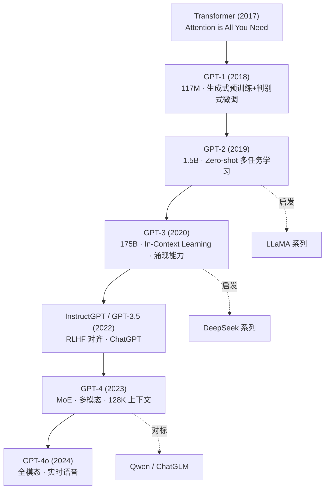
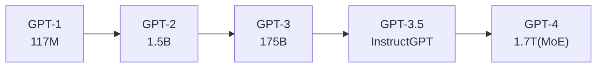
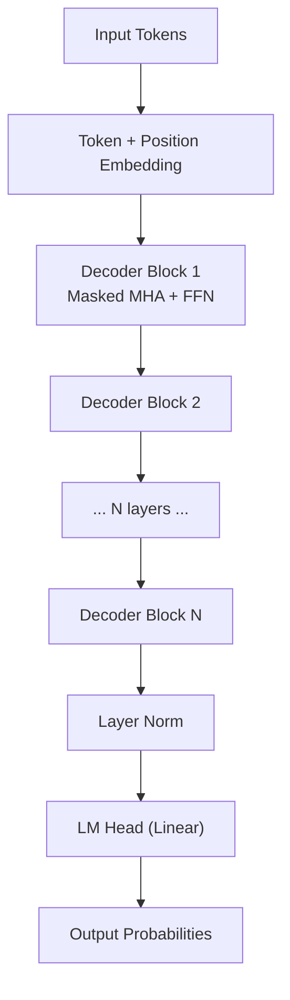
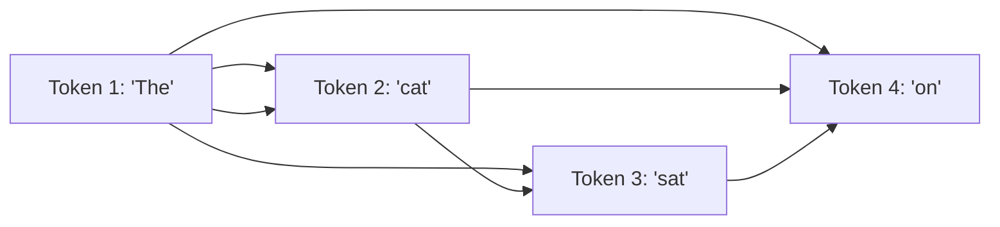

# GPT 系列

## 知识地图



## 前置知识

- **Transformer 架构**：理解 Self-Attention、Multi-Head Attention、Positional Encoding
- **语言模型基础**：自回归生成、交叉熵损失、Perplexity
- **迁移学习**：预训练 → 微调范式
- **强化学习基础**：策略梯度、PPO 算法（用于理解 RLHF）

## 模型演化路线



| Model | Year | Params | Key Innovation |
|-------|------|--------|----------------|
| GPT-1 | 2018 | 117M | 生成式预训练 + 判别式微调 |
| GPT-2 | 2019 | 1.5B | Zero-shot 多任务学习 |
| GPT-3 | 2020 | 175B | In-Context Learning, 涌现能力 |
| InstructGPT | 2022 | 175B | RLHF 对齐 (SFT + RM + PPO) |
| GPT-4 | 2023 | ~1.7T (MoE) | 多模态, MoE, 128K 上下文 |
| GPT-4o | 2024 | 未公开 | 全模态, 实时语音交互 |

## 为什么会出现 (Why)

GPT 系列的产生源于一个核心发现：**语言建模任务本身包含了丰富的世界知识**。如果能在大规模文本上训练足够大的模型，模型就能"理解"语言并完成各种下游任务，而不再需要为每个任务单独设计架构和标注数据。

传统 NLP 需要大量标注数据和任务特定模型，而 GPT 证明了大规模无监督预训练可以让模型获得通用语言能力。

## 解决什么问题 (Problem)

- **任务碎片化**：传统 NLP 为每个任务（分类、摘要、翻译）训练独立模型。GPT 用一个模型解决所有 NLP 任务。
- **标注数据瓶颈**：监督学习需要海量标注数据。GPT 通过无监督预训练大幅降低对标注的依赖。
- **泛化能力不足**：传统模型只在训练过的任务上表现好。GPT 的 In-Context Learning 使模型见过极少示例即可适应新任务。
- **对话质量**：GPT-3.5 引入 RLHF 对齐，使模型输出更符合人类偏好，推动 ChatGPT 的诞生。

## 核心思想 (Core Idea)

通过大规模自回归语言建模预训练，让模型学习通用的语言表示和世界知识，再通过对齐技术使模型输出与人类意图一致。

---

## GPT-1 (2018)

### 架构

12 层 Transformer Decoder，$d_{model}=768$，12 头，117M 参数。

### 两阶段训练

1. **无监督预训练**：标准语言模型（预测下一个 token）
2. **有监督微调**：将下游任务输入格式化为特殊 token 序列

---

## GPT-2 (2019)

### 核心理念：Zero-shot

**语言模型是无监督多任务学习器**。不需要微调，只需提供自然语言提示。

### 规模升级

| 版本 | 参数量 | 层数 |
|------|--------|------|
| GPT-2 Small | 124M | 12 |
| GPT-2 Medium | 355M | 24 |
| GPT-2 Large | 774M | 36 |
| GPT-2 XL | 1.5B | 48 |

---

## GPT-3 (2020)

### 核心理念：In-Context Learning

175B 参数。不更新模型参数，仅通过提示中的几个示例（Few-Shot）学习任务。

### 涌现能力 (Emergent Abilities)

当模型规模达到一定阈值时才出现的能力：
- 算术推理
- 代码生成
- 翻译
- 多步推理

---

## GPT-3.5 / InstructGPT

### RLHF 三步流程

1. **SFT**（监督微调）：用高质量人类回答微调
2. **RM**（奖励模型训练）：对多个回答排序，训练奖励模型
3. **PPO**（强化学习）：用 PPO 优化策略，使奖励模型打分最高

---

## GPT-4 (2023)

### 关键能力

- **多模态**：支持图像输入
- **长上下文**：32K → 128K tokens
- **指令遵循**：大幅提升
- **安全性**：对抗越狱的鲁棒性增强

### MoE 架构

GPT-4 使用 8 × 220B 的 Mixture-of-Experts 架构，每次推理仅激活部分专家。

---

## 架构对比

| 特性 | GPT-1 | GPT-2 | GPT-3 | GPT-4 |
|------|-------|-------|-------|-------|
| 架构 | Decoder-only | Decoder-only | Decoder-only | Decoder-only (MoE) |
| 参数量 | 117M | 1.5B | 175B | ~1.7T (MoE) |
| 层数 | 12 | 48 | 96 | 未公开 |
| 注意力 | MHA | MHA | MHA | 推测 GQA |
| 激活函数 | GELU | GELU | GELU | 未公开 |
| 位置编码 | Learned | Learned | Learned | 推测 RoPE |
| 预训练数据 | BooksCorpus | WebText | CommonCrawl+ | 未公开 |
| 上下文长度 | 512 | 1024 | 2048 | 128K |

## 数学模型/公式

### 自回归生成

$$P(x) = \prod_{t=1}^{T} P(x_t \mid x_{<t})$$

**通俗解释：** 整个句子的概率等于每个词在给定前面所有词的情况下出现的概率的乘积。就像一个接龙游戏——每写一个字，都只能看到前面写过的内容。

解码策略：
- **Greedy**：选概率最大的 token
- **Temperature**：调整概率分布熵
- **Top-k**：从 top-k 候选采样
- **Top-p (Nucleus)**：从累积概率 ≥ p 的候选中采样

### 注意力中的 Causal Mask

自回归遮罩确保 token $i$ 只能看到 token $0$ 到 $i$（不能看到未来）：

```python
# 自回归遮罩：token i 只能看到 0..i
mask = torch.triu(torch.ones(T, T), diagonal=1).bool()
# [[False, True,  True],
#  [False, False, True],
#  [False, False, False]]
```

**通俗解释：** 想象你在翻译一句话，翻译第 5 个词时，你只能看到前面 4 个词和你自己，不能"偷看"第 6 个词。上三角矩阵的 True 位置就是被遮住的位置。

### RLHF 奖励模型损失

$$\mathcal{L}_{RM} = -\mathbb{E}_{(x, y_w, y_l) \sim D}[\log \sigma(r_\theta(x, y_w) - r_\theta(x, y_l))]$$

其中 $y_w$ 是人类偏好的回答，$y_l$ 是不偏好的回答。

**通俗解释：** 奖励模型的目标是让"好回答"的分数明显高于"差回答"的分数。用 sigmoid 函数将分差转化为概率，最大化模型判断正确的概率。

### RLHF PPO 目标

$$\mathcal{L}_{PPO} = \mathbb{E}_{x \sim D, y \sim \pi_\phi} [r_\theta(x, y) - \beta \cdot KL(\pi_\phi(y|x) \| \pi_{ref}(y|x))]$$

**通俗解释：** 在最大化奖励的同时，加一个 KL 散度惩罚项，防止策略偏离原始模型太远。否则模型可能学会"讨好"奖励模型的高分套路，而非真正生成高质量文本。

## 可视化展示

### GPT 架构示意



### 自回归生成流程



## 最小可运行代码

### 使用 transformers 加载 GPT-2 生成文本

```python
from transformers import AutoTokenizer, AutoModelForCausalLM

model_name = "openai-community/gpt2"
tokenizer = AutoTokenizer.from_pretrained(model_name)
model = AutoModelForCausalLM.from_pretrained(model_name)

# 必须设置 pad_token，GPT-2 默认没有
tokenizer.pad_token = tokenizer.eos_token

prompt = "The future of artificial intelligence is"
inputs = tokenizer(prompt, return_tensors="pt")

outputs = model.generate(
    **inputs,
    max_new_tokens=50,
    temperature=0.7,
    top_p=0.9,
    do_sample=True,
    pad_token_id=tokenizer.eos_token_id,
)
print(tokenizer.decode(outputs[0], skip_special_tokens=True))
```

### 自回归 Causal Mask 实现

```python
import torch
import torch.nn as nn

class CausalSelfAttention(nn.Module):
    def __init__(self, d_model=768, n_heads=12):
        super().__init__()
        self.d_model = d_model
        self.n_heads = n_heads
        self.head_dim = d_model // n_heads
        self.qkv = nn.Linear(d_model, 3 * d_model)
        self.proj = nn.Linear(d_model, d_model)

    def forward(self, x):
        B, T, D = x.shape
        qkv = self.qkv(x).view(B, T, 3, self.n_heads, self.head_dim)
        q, k, v = qkv.unbind(dim=2)

        attn = (q @ k.transpose(-2, -1)) / (self.head_dim ** 0.5)

        # Causal Mask: 上三角为 -inf
        mask = torch.triu(torch.ones(T, T, device=x.device), diagonal=1).bool()
        attn = attn.masked_fill(mask, float('-inf'))

        attn = torch.softmax(attn, dim=-1)
        out = (attn @ v).transpose(1, 2).contiguous().view(B, T, D)
        return self.proj(out)
```

### 使用 OpenAI API 调用 GPT-4

```python
from openai import OpenAI

client = OpenAI()
response = client.chat.completions.create(
    model="gpt-4",
    messages=[
        {"role": "system", "content": "You are a helpful assistant."},
        {"role": "user", "content": "Explain the Transformer architecture briefly."},
    ],
    temperature=0.7,
    max_tokens=256,
)
print(response.choices[0].message.content)
```

## 工业界应用

| 产品/服务 | 底层模型 | 用途 |
|-----------|----------|------|
| ChatGPT | GPT-4o / GPT-4 | 通用对话助手 |
| GitHub Copilot | GPT-4 / Codex | 代码补全与生成 |
| Microsoft 365 Copilot | GPT-4 | 办公自动化 |
| Duolingo Max | GPT-4 | 语言学习对话 |
| Khan Academy Khanmigo | GPT-4 | AI 辅导老师 |
| Stripe | GPT-4 | 文档理解与客服 |
| Be My Eyes | GPT-4 Vision | 视障辅助 |

## 对比表格：GPT 系列 vs 主流开源模型

| 维度 | GPT-4 | LLaMA 3 | DeepSeek-V3 | Qwen2 |
|------|-------|---------|-------------|-------|
| 最大参数 | ~1.7T (MoE) | 405B | 671B (MoE) | 72B |
| 开源 | 否 | 是 | 是 | 是 |
| 多模态 | 是 (图像/语音) | 是 | 否 | 是 (Qwen-VL) |
| 上下文长度 | 128K | 128K | 128K | 128K |
| RLHF 对齐 | 是 (先驱) | 是 | 部分 | 是 |
| API 可用性 | 商业 API | 社区托管 | 商业 API + 开源 | 商业 API + 开源 |
| 训练成本 | 未公开 ($100M+) | 未公开 | ~$5M | 未公开 |

## 学完后建议继续学习

1. **LLaMA / Mistral / Mixtral** — 开源大模型的设计哲学与 GPT 的异同
2. **RLHF 深入** — DPO (Direct Preference Optimization) 等新一代对齐算法
3. **Inference 优化** — vLLM、FlashAttention、量化部署
4. **多模态模型** — CLIP、GPT-4V 的视觉语言对齐原理
5. **Prompt Engineering** — Few-shot、Chain-of-Thought、结构化提示

## 高频面试题

### Q1: GPT 系列从 GPT-1 到 GPT-4 的核心演进路径是什么？

**标准答案：** 核心演进沿着四个维度：**规模扩大**（117M → 175B → 1.7T MoE）、**训练范式升级**（预训练+微调 → Zero-shot → In-Context Learning → RLHF 对齐）、**能力泛化**（单任务 → 多任务 → 涌现能力 → 多模态）、**工程优化**（Dense → MoE 架构，512 → 128K 上下文窗口）。GPT-1 证明了预训练的有效性，GPT-2 证明了无需微调即可多任务，GPT-3 证明了规模带来的涌现能力，InstructGPT/GPT-4 通过 RLHF 和 MoE 解决了对齐与效率问题。

### Q2: 解释 RLHF 的三步流程及其各自作用。

**标准答案：** RLHF 分为三步：（1）**SFT（监督微调）**：用高质量人工标注的 {prompt, answer} 对基座模型微调，使模型学会输出格式化的、有帮助的回答；（2）**RM（奖励模型训练）**：让模型对同一 prompt 的多个回答打分排序，训练奖励模型学习人类偏好——公式为 $\mathcal{L}_{RM} = -\log \sigma(r(x, y_w) - r(x, y_l))$，本质是让好回答的分数高于差回答；（3）**PPO 强化学习**：用奖励模型的分数作为 reward 信号，通过 PPO 算法优化策略，同时加 KL 散度约束防止策略偏离 SFT 模型太远。三步从"模仿人类"到"理解偏好"再到"优化偏好"，逐步对齐人类意图。

### Q3: 什么是 In-Context Learning？它和 Fine-tuning 有什么区别？

**标准答案：** In-Context Learning (ICL) 是在推理时通过提示词中的示例（Few-Shot）引导模型完成新任务，**不更新模型参数**。而 Fine-tuning 是通过反向传播更新模型参数来适应新任务。ICL 的优势是不需要训练数据、不需要计算梯度、可以随时切换任务类型；缺点是推理时占用更多上下文窗口。ICL 是 GPT-3 首次系统验证的能力——当模型规模超过 ~100B 参数时，ICL 能力显著涌现。

### Q4: Transformer Decoder-Only 架构为什么适合生成式任务？

**标准答案：** Decoder-Only 架构使用 Causal Mask（上三角遮罩），确保每个 token 只能 attend 到它之前的 token，天然适合自回归生成（从左到右逐个预测）。相比 Encoder-Decoder 架构，Decoder-Only 的优势是：（1）参数利用率高——所有参数参与每个 token 的计算；（2）KV Cache 可复用——生成的每个 token 的 K 和 V 可以缓存给后续 token 使用；（3）更简洁——一个模型完成理解+生成。GPT 系列证明了只要规模够大，Decoder-Only 架构对所有 NLP 任务都是足够的。

### Q5: GPT-4 的 MoE 架构相比 GPT-3 的 Dense 架构有什么优势？

**标准答案：** GPT-4 使用 8 × 220B 的 Mixture-of-Experts 架构（总参数约 1.7T），每次推理仅激活约 280B 参数（约 2 个专家），实现了**总容量大但计算量小**。优势体现在：（1）**参数效率**——更多总参数意味着更强的表示能力，但激活参数有限意味着推理成本可控；（2）**多任务协同**——不同专家可以专精不同类型的任务（代码、推理、创意写作等）；（3）**扩展性**——增加专家数量可以线性扩展总参数而只小幅增加计算量。代价是训练时需引入负载均衡损失防止门控网络总是选中相同的专家。
