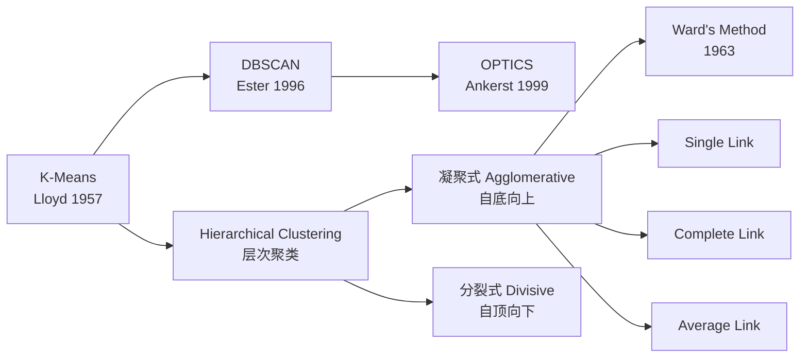

# 层次聚类 (Hierarchical Clustering)

## 知识地图



## 前置知识

- **距离度量**：欧几里得距离、曼哈顿距离、余弦相似度等，以及它们对不同类型数据（连续、类别、混合）的适用性。
- **树和图的基础概念**：二叉树的构造、合并与遍历、树的深度和高度。树状图 (Dendrogram) 本质上就是一棵二叉树。
- **贪心算法**：凝聚式层次聚类的每一步都是局部最优合并（找到当前最近的两个簇合并），不能撤销，因此也是贪心的。
- **K-Means 与 DBSCAN**：理解层次聚类与它们的核心区别——层次聚类提供的是"全谱系"的分组结构，而非单一划分。

## 为什么会出现 (Why)

K-Means 需要预设 K，DBSCAN 对密度参数敏感。在实践中，分析者往往不知道自己想要多少个簇——他们想先看到数据的"分组谱系"，再决定切在哪里。就像生物学家不知道物种应该分多少类时，先画一棵进化树（系统发生树），然后在合适的"高度"一刀切下。层次聚类的树状图 (Dendrogram) 恰好提供了这种"先看全貌、再做决策"的能力。

## 解决什么问题 (Problem)

- **无需预设 K**：不要求在运行前知道簇的数量，可以在构建完树状图后再选择切割层级。
- **簇的嵌套关系可视化**：通过树状图直观展示数据的分组层次结构——哪些样本最相似、哪些簇先合并、不同簇之间的差异有多大。
- **灵活的距离定义**：不同的 Linkage 方法（Single/Complete/Average/Ward）对应不同的簇形态偏好，比 K-Means 的单一球形假设更灵活。

## 核心思想 (Core Idea)

**层次聚类 = 构建一棵代表数据嵌套分组关系的树（Dendrogram）**——通过不断合并（凝聚式）或分裂（分裂式）来递归地构建聚类层次，在任意高度切开树即可得到相应数量的簇。

---

层次聚类构建一个**树状结构 (Dendrogram)** 来表示数据的嵌套分组，无需预设簇数 $K$。

---

## 数学模型/公式

### 两种策略

#### 凝聚式 (Agglomerative) --- 自底向上

1. 每个点自成一簇
2. 找到最近的两个簇合并
3. 重复直到只剩一个簇

复杂度 $O(n^3)$，用优先队列可降到 $O(n^2 \log n)$。

> **通俗解释：** 一开始所有人都是单独的"个体"，然后每一步把"最亲密的两个人"合并成一个"小组"，重复直到所有人都合并成一个大组。合并的顺序和距离记录在树状图中——越早合并，代表越相似。

#### 分裂式 (Divisive) --- 自顶向下

1. 所有点为一个簇
2. 选择一个簇按某种准则分裂
3. 重复直到每个点一簇

> **通俗解释：** 凝聚式的反过程。一开始所有人是一个大组，然后每一步把"内部差异最大的小组"一分为二，直到每个人单独一个组。分裂式在实践中远不如凝聚式常用，因为"怎么选一个簇去分裂"比"哪两个簇最近"更难定义。

### 簇间距离度量 (Linkage)

| 方法 | 定义 | 特点 |
|------|------|------|
| Single Link | $\min_{a \in A, b \in B} d(a,b)$ | 链式，易产生细长簇 |
| Complete Link | $\max_{a \in A, b \in B} d(a,b)$ | 倾向于紧凑簇 |
| Average Link | $\frac{1}{\|A\|\|B\|} \sum_{a \in A}\sum_{b \in B} d(a,b)$ | 折中方案 |
| Ward's Method | 最小化合并后方差增量 | 倾向于等大小簇 |

> **通俗解释 --- Single Link：** 两个簇中最近的两个点的距离就是簇间距离。这会导致"链式效应"——只要两个簇各有一个点离得近，整个簇就会被合并，即使其他点相隔甚远。所以容易形成"细长条"状的簇。

> **通俗解释 --- Complete Link：** 两个簇中最远的两个点的距离就是簇间距离。要求两个簇"整体靠近"才会合并，生成的簇比较紧凑。但可能因为一个异常点而阻碍整个合并。

> **通俗解释 --- Average Link：** 两个簇中所有点对距离的平均值。折中了 Single Link 的"太激进"和 Complete Link 的"太保守"。

> **通俗解释 --- Ward's Method：** 合并后看"方差增加了多少"，选择增加最少的一对合并。等价于每一步最小化信息损失。倾向于产生大小均衡的簇。

### Ward's 方法详解

合并簇 $A$ 和 $B$ 后的方差增量：

$$\Delta(A, B) = \frac{|A||B|}{|A| + |B|} \|\mu_A - \mu_B\|^2$$

每次合并选择使 $\Delta$ 最小的两个簇。

> **通俗解释：** 这个公式非常直观——$\frac{|A||B|}{|A|+|B|}$ 是 $A$ 和 $B$ 的"调和大小"（如果两个簇都很大，合并会影响很多点，惩罚就重）；$\|\mu_A - \mu_B\|^2$ 是两个簇中心的距离平方（中心越远，合并后的方差增长越大）。Ward 方法是实践中使用最多的 Linkage 方法。

---

## 算法流程图 (凝聚式)

```mermaid
graph TD
    Start[🎯 开始: 每个点自成一簇<br/>共 n 个簇] --> CalcDist[📐 计算所有簇两两之间的距离矩阵<br/>大小为 n×n]
    CalcDist --> FindMin[🔍 找到距离最近的两个簇 A 和 B]
    FindMin --> Merge[🔗 合并 A 和 B 为新簇 C]
    Merge --> UpdateDist[🔄 更新距离矩阵:<br/>删除 A 和 B 的行列<br/>加入 C 与所有其他簇的距离]
    UpdateDist --> Record[📝 记录本次合并:<br/>{A, B} → C 及合并距离]
    Record --> Check{只剩 1 个簇?}
    Check -->|否| FindMin
    Check -->|是| Dendro[🌳 输出: 树状图 Dendrogram<br/>可在任意高度切出 K 个簇]
```

---

## 可视化展示

### 树状图 (Dendrogram) 的读取方法

树状图的横轴是样本（或簇），纵轴是合并距离。读取规则：
- **越早合并的样本越相似**：在树状图底部就合并的样本（合并距离小）是高度相似的
- **切割高度决定簇数量**：在纵轴上某一高度画一条水平线，与树的垂直枝相交的次数就是簇的数量
- **枝的长度**：长的垂直枝代表合并的距离大——意味着两个簇之间的差异大，不宜合并

### 不同 Linkage 的效果示意

- **Single Link**：树状图的合并距离增长缓慢，容易形成"阶梯状"的长链
- **Complete Link**：合并距离增长快速，簇之间分离明显
- **Ward's Method**：合并距离均匀增长，簇大小均衡

---

## 最小可运行代码

```python
from scipy.cluster.hierarchy import linkage, dendrogram, fcluster
import matplotlib.pyplot as plt

# 凝聚聚类
Z = linkage(X, method='ward')

# 从树状图中切出 K 个簇
labels = fcluster(Z, t=3, criterion='maxclust')

# 绘制树状图
dendrogram(Z)
plt.show()
```

### Scikit-learn 版本

```python
from sklearn.cluster import AgglomerativeClustering

# 凝聚式聚类，设定 linkage 和簇数
hc = AgglomerativeClustering(n_clusters=3, linkage='ward')
labels = hc.fit_predict(X)
```

---

## 工业界应用

| 场景 | 说明 | 为什么用层次聚类 |
|------|------|------------------|
| **生物信息学** | 基因表达聚类、构建系统发生树 | 树状图天然对应进化关系 |
| **文档层次分类** | 新闻主题的层次化归并 | 可提供"大主题→子主题"的层级结构 |
| **用户分群** | 按行为数据构建用户层级 | 可灵活选择"粗分"和"细分"粒度 |
| **异常检测** | 树状图中最后单独合并的样本（大合并距离） | 异常样本与其他样本的合并距离远大于正常 |
| **市场研究** | 消费者偏好层级分析 | 树状图可视化消费群体的嵌套关系 |

---

## 对比表格

### K-Means vs DBSCAN vs Hierarchical

| 维度 | K-Means | DBSCAN | Hierarchical |
|------|---------|--------|--------------|
| **簇形状** | 仅球形 | 任意形状 | 取决于 Linkage |
| **是否需要预设 K** | 是 | 否（需 eps + MinPts） | 否（可从树状图后切） |
| **噪声处理** | 强制分配 | 自动标记为噪声 | 取决于后切策略 |
| **时间复杂度** | $O(nKd \cdot t)$ | $O(n \log n)$ (KD树) | $O(n^2 \log n) \sim O(n^3)$ |
| **可扩展性** | 极好 (百万级) | 中等 | 差 (最多数千样本) |
| **可解释性** | 中等 | 中等 | 极强（树状图） |
| **贪心不可逆** | 否（可多次运行） | 否（确定性算法） | 是（合并后不能撤销） |

---

## 优缺点

- **优点**：无需预设簇数，树状图提供丰富可视化，链接方式灵活
- **缺点**：$O(n^3)$ 或 $O(n^2 \log n)$ 的复杂度不适合大规模数据，一旦合并/分裂不能撤销

---

## 学完后建议继续学习

1. **BIRCH (Balanced Iterative Reducing and Clustering using Hierarchies)**——专为大数据设计的层次聚类，通过 CF 树（聚类特征树）将复杂度降到 $O(n)$
2. **HDBSCAN**——融合了 DBSCAN 的密度思想和层次聚类的树状结构，自动发现不同密度的簇
3. **谱聚类 (Spectral Clustering)**——通过图的拉普拉斯矩阵的谱分解进行聚类，可处理极复杂的簇拓扑，模型上等价于数据的图拉普拉斯的最小割
4. **Gaussian Mixture Model + BIC 选 K**——从概率模型视角替代层次聚类的 K 选择问题
5. **共识聚类 (Consensus Clustering)**——对同一数据多次聚类，取共识结果，提高稳定性

---

## 高频面试题

### Q1: Single Link 和 Complete Link 的区别是什么？各适合什么场景？

**标准答案：**
- **Single Link（单链）**：以两个簇中最近的两个点的距离作为簇间距离。特点是"链式效应"——不要求簇的整体紧凑度，只要链上每一步都近就可以。适合发现**细长条状**或**连通型**的簇结构。缺点是对噪声和异常点极敏感——一个桥接点就可以让两个本应分开的簇错误合并。
- **Complete Link（全链）**：以两个簇中最远的两个点的距离作为簇间距离。要求簇在"最远的维度"上也靠近才能合并，倾向于产生**紧凑、球形**的簇。优点是对噪声相对鲁棒，缺点是容易违背数据的自然几何结构——一个离群点就可能阻止两个大簇的合并。
- 实践中，Average Link（所有点对距离的平均值）和 Ward's Method（最小化方差增量）是使用最多的，它们比 Single 和 Complete 在两个极端之间做了更好的折中。

### Q2: 树状图 (Dendrogram) 怎么读？如何从树状图中确定 K？

**标准答案：** 树状图的纵轴是合并距离。读取规则：
1. 从下往上看，样本越早合并（合并距离越小）越相似。
2. 在某个高度画一条水平线，与垂直枝相交的次数即为该高度对应的簇数量。
3. 确定 K 的方法：观察纵轴上**合并距离突然跃升**的位置——如果某次合并的距离远大于前几次，说明再合下去会把差异巨大的簇强行合并。在那个"跳跃"处切一刀，此时的簇数量就是合理的 K。例如：合并距离依次为 0.5, 0.8, 1.2, 1.5, **5.0**, 8.0——在 4 到 5 之间切，K=4 或 5 是合理的。

### Q3: 层次聚类的时间复杂度很高，大数据上怎么办？

**标准答案：** 凝聚式层次聚类的标准实现是 $O(n^3)$，优化后可达 $O(n^2 \log n)$。大数据上的解决方案：
1. **BIRCH 算法**：用 CF 树做增量聚类，复杂度 $O(n)$，适合流数据和超大数据集。
2. **先抽样再聚类**：从大数据集中随机抽样（如抽取 10,000 个样本）做层次聚类，然后用 K-Means 或最近邻将剩余样本分配到最近的簇。
3. **分治策略**：将数据分成多个块，每块内部做层次聚类，然后再对每块的"代表点"做一次全局层次聚类。
4. **替代算法**：如果主要需要树状图结构，可以考虑 HDBSCAN（复杂度更优且自带密度感知）。

### Q4: Ward's Method 为什么在实践中最常用？它的目标函数和 K-Means 有什么关系？

**标准答案：** Ward's Method 在每一步合并时，选择使得**合并后方差增量最小**的两个簇——这在某种程度上等价于"每一步以最小信息损失的方式合并"。它倾向于产生大小均衡、形状近似球形的簇。与 K-Means 的关系：Ward's Method 的目标函数也是最小化簇内方差（WCSS），这和 K-Means 一致。区别在于 K-Means 是全局优化（给定 K 后一步到位），而 Ward 是"贪心地"逐步构建层次。在一些聚类分析中，可以用 K-Means 的结果初始化 Ward 的某一层。
