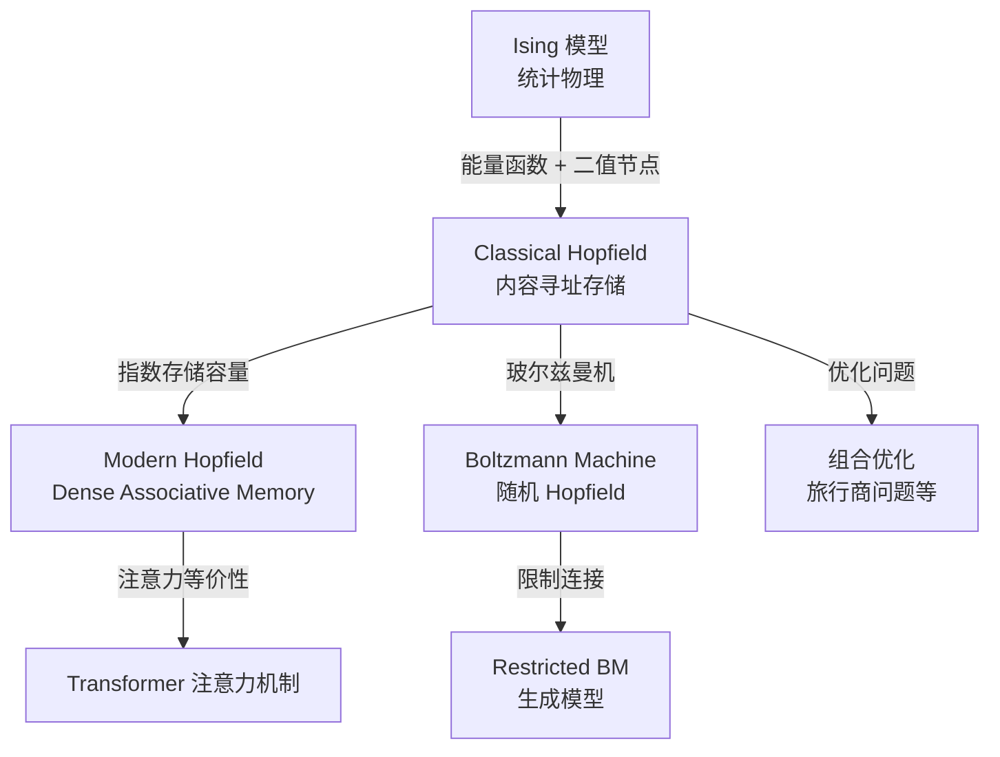
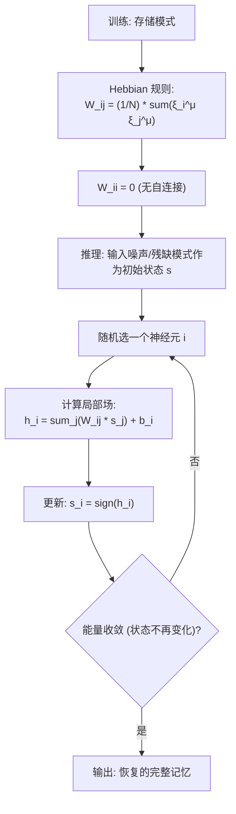
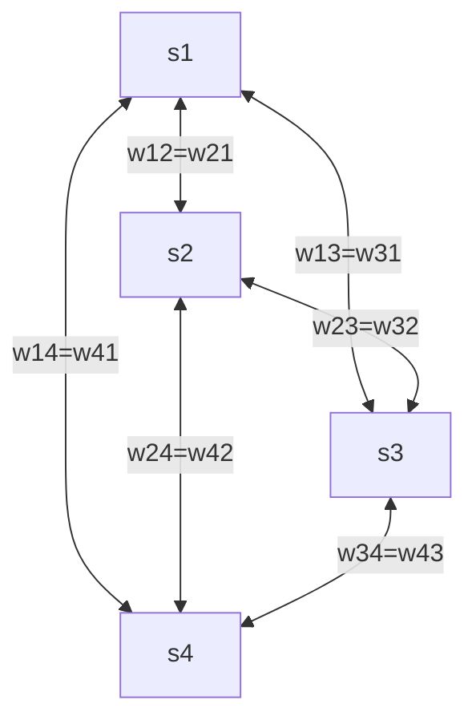
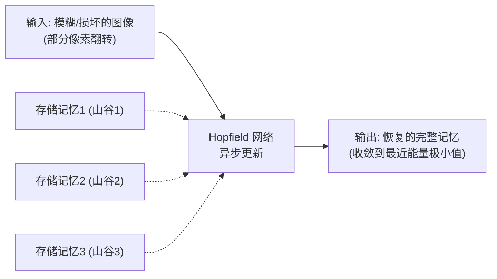

# Hopfield Network (霍普菲尔德网络)

## 知识地图



## 前置知识

- 二元变量和向量运算
- 矩阵乘法和外积
- 能量函数和梯度下降的直觉
- Hebbian 学习的基本概念（"同时激活的神经元加强连接"）
- Softmax 函数

## 为什么会出现 (Why)

1982 年，Hopfield 受到统计物理中 Ising 模型（描述磁性材料中自旋相互作用的模型）的启发，设计了一种具有**内容寻址记忆**能力的神经网络。这与传统的"按地址存取"（RAM：给定内存地址 0x1234 读取数据）完全不同——Hopfield 网络是"按内容存取"：你给它一个模糊的、部分损坏的记忆片段，它会自动收敛到最接近的完整存储记忆。

## 解决什么问题 (Problem)

实现内容可寻址的联想记忆 (Associative Memory)。给定一个被部分损坏或不完整的输入模式，网络能自动恢复到最相似的完整存储模式。同时，Hopfield 网络的能量函数设计使其可以用于求解组合优化问题（如旅行商问题 TSP）。

## 核心思想 (Core Idea)

**Hopfield 网络将记忆模式编码为能量函数的局部极小值——输入一个不完整的模式后，网络沿能量下降方向自动"滚动"到最接近的记忆态；现代 Hopfield 网络将这一框架泛化到指数级存储容量，直接催生了 Transformer 的注意力机制。**

---

## 数学定义与原理解析

### 能量函数

对于 $N$ 个二元神经元 $\mathbf{s} \in \{-1, +1\}^N$：

$$
E(\mathbf{s}) = -\frac12 \sum_{i,j} w_{ij} s_i s_j - \sum_i b_i s_i
$$

**通俗解释：** 可以把能量函数想象成一个"地形图"——存储的记忆在地形的各个山谷底部（局部极小值）。网络的状态更新就像在这地形上放一个球，球会沿着坡度往下滚，最终停在山谷（最接近的记忆）。每次更新保证能量只降不升（Lyapunov 函数性质），所以球只会往下走，不会往上爬。

无自连接：$w_{ii} = 0$。权重对称：$w_{ij} = w_{ji}$，保证能量单调下降（Lyapunov 函数）。

### Hebbian 学习规则

存储 $P$ 个模式 $\{\xi^\mu\}_{\mu=1}^{P}$：

$$
w_{ij} = \frac{1}{N} \sum_{\mu=1}^{P} \xi_i^\mu \xi_j^\mu, \quad w_{ii} = 0
$$

**通俗解释：** 这是著名的 Hebbian 学习——"同时发放的神经元,连接增强"。如果神经元 $i$ 和 $j$ 在存储的模式 $\mu$ 中同时为 +1 或同时为 -1，它们的乘积 $\xi_i^\mu \xi_j^\mu = +1$，连接权重 $w_{ij}$ 增加（正相关）。如果一正一负，乘积为 -1，权重减小（负相关）。对所有存储模式做外积求和取平均——最终的权重矩阵编码了所有记忆模式的"统计学关联"。

### 异步更新

每次随机选一个神经元 $i$，计算局部场：

$$
h_i = \sum_j w_{ij} s_j + b_i
$$

更新：$s_i \leftarrow \text{sign}(h_i)$。能量必定下降或不变：

$$
\Delta E_i = -2 s_i h_i \leq 0
$$

**通俗解释：** 每次只更新一个神经元（随机选择），更新依据是"邻居们集体投票"——$\sum_j w_{ij} s_j$ 是所有与 $i$ 相连的神经元对 $i$ 的"拉票"，如果总票数为正就选 +1，为负就选 -1。每次只改一个神经元保证能量一定下降（或不变），最终收敛到局部极小值。

### 存储容量

Hebbian 学习下的理论容量约为 $P_{\max} \approx 0.14N$（$N$ 为神经元数量）。超过此值，记忆之间产生串扰，能量曲面出现虚假的"混合态"极小值。

**通俗解释：** 100 个神经元，最多可靠存储约 14 个模式。存太多会"串台"——网络可能会收敛到一个"混合物"（比如把两个人的记忆混成了一张平均脸），而不是任何真实的存储模式。这就像书架上放太多书会互相挤压变形。

### 现代 Hopfield 网络（连续状态）

$$
E(\mathbf{x}) = -\frac{1}{\beta} \log \sum_{\mu=1}^{P} \exp(\beta \mathbf{x}^T \xi^\mu) + \frac12 \mathbf{x}^T \mathbf{x}
$$

**通俗解释：** 经典 Hopfield 用二次能量 + Hebbian 规则，存储容量有限（$0.14N$）。现代版本用了一个巧妙的能量函数改造——把 $\beta \mathbf{x}^T \xi^\mu$（查询与记忆的相似度）通过 Softmax 聚合，存储容量可以指数级增长（$P \propto e^{N}$）。代价是每次更新需要计算查询与所有存储模式的相似度（$O(PN)$）。

更新规则与 Transformer 注意力惊人相似：

$$
\mathbf{x}^{\text{new}} = \sum_{\mu} \text{softmax}(\beta \mathbf{x}^T \Xi)_{\mu} \cdot \xi^\mu
$$

**通俗解释：** 更新公式 = Softmax(查询与所有 key 的相似度) 对各记忆模式的加权求和——这正是 Transformer 中注意力机制的数学形式！查询 $\mathbf{x}$ 是 $Q$，存储模式 $\xi^\mu$ 是 $V$（也是 $K$），$\beta$ 是温度参数的倒数。这篇论文（Krotov & Hopfield, 2016）是连接经典 Hopfield 网络与现代 Transformer 注意力的关键桥梁。

---

## 算法流程图



---

## 可视化展示

### Hopfield 网络结构（全连接 + 对称权重）



### 能量下降过程

```echarts
return {
  tooltip: { trigger: "axis", confine: true },
  title: { top: 5,  text: '异步更新中能量单调下降', left: 'center', textStyle: { fontSize: 12 } },
  xAxis: { type: 'value', name: '更新步数' },
  yAxis: { type: 'value', name: '能量 E(s)', min: -60, max: -20 },
  series: [{
    type: 'line', smooth: true,
    data: (function() {
      const d = [];
      for (let i = 0; i <= 20; i++) d.push([i, -55 + 35 * Math.exp(-i/4)]);
      return d;
    })(),
    lineStyle: { color: '#2c3e50', width: 2.5 },
    areaStyle: { color: 'rgba(44, 62, 80, 0.1)' }
  }],
  grid: { left: 60, right: 20, top: 55, bottom: 60 }
}
```

每一步异步更新保证 $\Delta E \leq 0$——网络在能量景观中"滚动"到最近的局部极小值。

### 内容寻址记忆示意



---

## 最小可运行代码

### NumPy -- Hopfield 网络

```python
import numpy as np

class HopfieldNetwork:
    def __init__(self, n_neurons):
        self.n = n_neurons
        self.W = np.zeros((n_neurons, n_neurons))

    def store(self, patterns):
        """用 Hebbian 规则存储模式"""
        for p in patterns:
            self.W += np.outer(p, p)
        self.W /= self.n
        np.fill_diagonal(self.W, 0)

    def energy(self, s):
        return -0.5 * s @ self.W @ s

    def recall(self, query, steps=100):
        """异步更新恢复记忆"""
        s = query.copy()
        for _ in range(steps):
            i = np.random.randint(self.n)
            h = self.W[i] @ s
            s[i] = np.sign(h)
        return s

    def capacity_check(self, patterns):
        """测试存储容量：存储后能否正确检索"""
        self.store(patterns)
        success = 0
        for p in patterns:
            retrieved = self.recall(p.copy())
            if np.array_equal(retrieved, p):
                success += 1
        return success / len(patterns)
```

---

## 工业界应用

| 应用场景 | 说明 | 时代 |
|----------|------|------|
| 联想记忆/内容寻址 | 从噪声/损坏输入恢复完整模式 | 1980s 至今 |
| 组合优化 (TSP) | 能量函数编码优化目标 → 收敛到近似最优解 | 1980s-1990s |
| 现代 Hopfield | Transformer 注意力机制的理论基础 | 2016 至今 |
| Hopfield 层 | 替代 Transformer 注意力层的记忆增强模块 | 2020s 研究前沿 |
| 免疫系统模型 | Hopfield 网络用于建模抗体-抗原识别 | 理论免疫学 |

---

## 对比表格

| | 经典 Hopfield | 现代 Hopfield (Dense) | Transformer 注意力 |
|------|-------------|---------------------|-------------------|
| 神经元类型 | 二元 $\{-1,+1\}$ | 连续 $\mathbb{R}^d$ | 连续 $\mathbb{R}^d$ |
| 存储容量 | $0.14N$ | $\propto e^{N}$ (指数) | 无固定存储概念 |
| 学习规则 | Hebbian (外积) | 能量函数定义 | 反向传播学习 |
| 检索方式 | 异步更新至收敛 | 一步检索 (或迭代) | 一步计算 |
| 权重对称 | 必须 $w_{ij} = w_{ji}$ | 不要求 | 不要求 |
| 记忆存储 | 权重矩阵隐含编码 | 显式存储模式集 | K, V 矩阵 |
| 数学形式 | 二次型能量 | Log-Sum-Exp 能量 | Softmax(QK^T)V |
| 核心局限 | 容量小、二元限制 | 每次检索需算所有模式 | 需要训练数据学习 |

---

## 学完后建议继续学习

1. **Boltzmann Machine / RBM** -- Hopfield 网络的随机扩展版本，引入概率和隐变量
2. **Transformer 注意力机制的 Hopfield 视角** -- Krotov & Hopfield (2016) / Ramsauer et al. (2021) 的论文
3. **组合优化中的 Hopfield 应用** -- 神经网络求解 TSP、图着色等问题
4. **Dense Associative Memory** -- 从经典 Hopfield 到现代 Hopfield 的数学推导路径

---

## 高频面试题

### Q1: Hopfield 网络为什么能保证收敛？什么是 Lyapunov 函数？

**答：** Hopfield 网络定义了能量函数 $E(\mathbf{s}) = -\frac12 \sum_{i,j} w_{ij} s_i s_j - \sum_i b_i s_i$。这个函数是一个 Lyapunov 函数——每次异步更新一个神经元后，能量必定下降或不变（$\Delta E \leq 0$）。证明：当一个神经元 $i$ 从 $s_i$ 更新为 $s_i' = \text{sign}(\sum_j w_{ij} s_j) = \text{sign}(h_i)$，如果 $s_i' \neq s_i$，则新的 $s_i'$ 与 $h_i$ 同号，因此 $s_i' h_i > 0$，而旧的 $s_i h_i < 0$（否则不会变）。能量的变化 $\Delta E_i = -2 s_i h_i \leq 0$（当 $s_i$ 改变时严格小于 0）。由于能量有下界（权重有限、状态有限），网络不可能无限下降，必然收敛到局部极小值。

必要条件：权重对称（$w_{ij} = w_{ji}$）和无自连接（$w_{ii} = 0$），这保证了能量函数被正确定义且单调下降。

### Q2: 经典 Hopfield 网络的存储容量为什么是 $0.14N$？存多了会发生什么？

**答：** 容量 $P_{\max} \approx 0.14N$ 来自统计物理分析——当存储模式数 $P$ 超过 $0.14N$ 时，由串扰（cross-talk）引起的"噪声"项突然压倒信号，记忆变为不稳定。数学上，检索一个模式时，除了目标模式本身的信号外，其他 $P-1$ 个模式会贡献一个"串扰噪声"项。当 $P$ 增大，噪声标准差 $\sim \sqrt{P/N}$ 超过信号强度时，忆状态突然从正确模式跳变为虚假态（spurious states，多个真实记忆的混合体）。这种"相变"行为类似于 Ising 模型的铁磁-顺磁相变。

### Q3: 现代 Hopfield 网络如何做到指数级的存储容量？与 Transformer 的注意力机制有什么联系？

**答：** 现代 Hopfield 网络（Dense Associative Memory）通过改造能量函数实现指数容量：将经典版本的二次型能量 $-\frac12 \sum w_{ij} s_i s_j$ 替换为 $-\frac{1}{\beta} \log \sum_\mu \exp(\beta \mathbf{x}^T \xi^\mu)$。关键差异：(1) Hebbian 规则用外积求和编码模式，各模式之间通过噪声项相互干扰；现代版本显式存储所有模式，检索时通过 Softmax 明确计算查询与每个记忆的相似度；(2) Softmax 的非线性使"最相似的记忆"被指数级放大，其他模式的干扰被指数级抑制。

与 Transformer 注意力的联系：现代 Hopfield 的更新规则 $\mathbf{x}^{\text{new}} = \sum_\mu \text{softmax}(\beta \mathbf{x}^T \Xi)_\mu \cdot \xi^\mu$ 在数学形式上完全等同于 Transformer 的注意力 $\text{Attention}(Q, K, V) = \text{softmax}(QK^T)V$——查询 $\mathbf{x}$ 是 $Q$，存储模式是 $K$ 和 $V$。这意味着 Transformer 的每一层注意力实际上在做"现代 Hopfield 记忆检索"。

### Q4: Hopfield 网络有哪些实际局限？

**答：** (1) **存储容量有限**（经典版本）：$0.14N$ 意味着存储 100 个 1000 维模式需要约 700 个神经元，对大规模应用不实用；(2) **假记忆问题（Spurious States）**：除了存储的模式外，能量地形上会出现"虚假的"局部极小值——多个真实记忆的线性组合，导致检索到不存在的东西；(3) **二元限制**：只能处理 $\{-1, +1\}$ 二值状态，不适合连续值数据；(4) **全连接结构**：$N$ 个神经元需要 $N^2$ 个权重，扩展到大规模不可行；(5) **无层次结构**：只支持单层联想记忆，不能像深度网络那样学习层级化特征。

### Q5: 为什么说 Hopfield 网络在现代深度学习中以另一种形式"复活"了？

**答：** Hopfield 网络通过两个路径在现代深度学习中"复活"：(1) 现代 Hopfield 网络（2016）证明了改进的能量函数可以实现指数容量，并使检索公式等价于 Softmax 注意力。2021 年 Ramsauer 等人进一步证明 Transformer 的自注意力层可以严格理解为在 Hopfield 能量上的梯度更新——这意味着每一个 Transformer 层都在做"Hopfield 式的内容寻址记忆检索"，Hopfield 思想已经"无声地"嵌入了所有现代 Transformer 架构中；(2) 在 Transformer 之外，Hopfield 层被提出作为 Transformer 层的替代或增强模块，用于长程记忆和检索增强生成（RAG）。从 1982 年的简洁理论到 2020s 大规模模型的工程实践，Hopfield 的核心思想（能量函数 + 内容寻址 + 模式收敛）今天仍然活跃。
