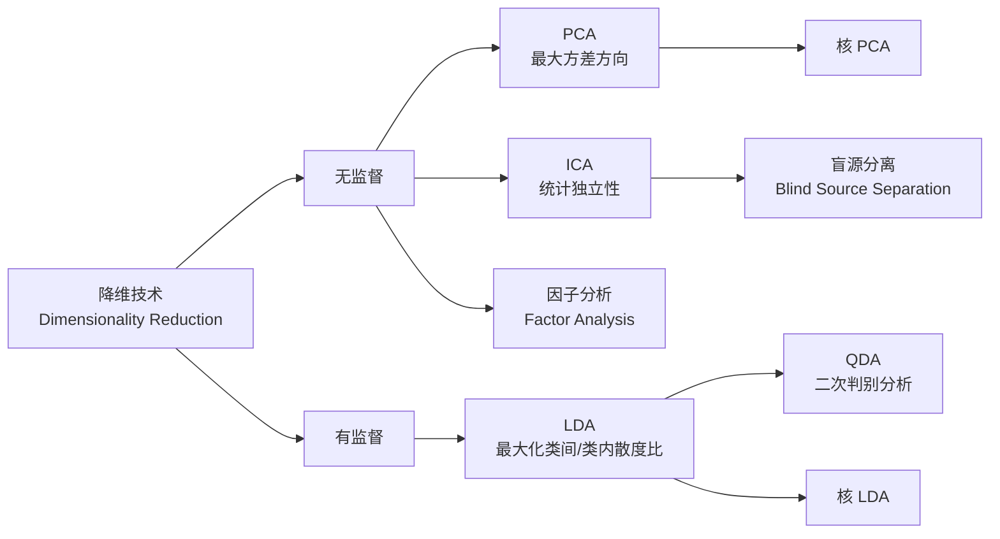
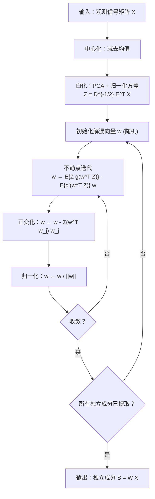
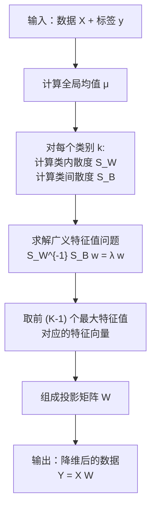
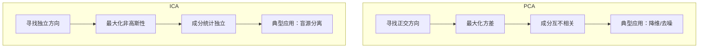

# ICA / LDA (独立成分分析 / 线性判别分析)

## 知识地图



## 前置知识

- **PCA (主成分分析)**：理解方差最大化、正交投影、特征值分解
- **概率论与统计**：协方差矩阵、高斯分布、中心极限定理、统计独立性 vs 不相关性
- **线性代数**：特征值分解、矩阵求逆、Rayleigh 商
- **信息论基础**：熵 (Entropy)、负熵 (Negentropy)、互信息 (Mutual Information)

## 为什么会出现 (Why)

PCA 只能找到互不相关的方向（仅保证二阶统计量为零），但"不相关"不等于"独立"。在鸡尾酒会问题中，多个说话者的声音被多个麦克风混合记录——PCA 无法分离出独立的声音源，因为它只关心方差最大化，不关心源信号的统计独立性。ICA 由此诞生：寻找使得输出成分尽可能统计独立的方向，实现盲源分离。另一方面，PCA 是无监督的，完全不考虑类别标签——当任务目标是分类时，PCA 找到的"方差最大方向"未必是最利于区分类别的方向。LDA 填补了这个空白：利用标签信息，找到最大化类间区分度的投影方向。

## 解决什么问题 (Problem)

- **ICA**：从混合信号中恢复出统计独立的源信号（盲源分离），如从多麦克风录音中分离出每个人的声音
- **LDA**：在已知类别标签的场景下，找到最优投影方向使得投影后不同类别的数据尽可能分开、同类数据尽可能聚集（有监督降维）

## 核心思想 (Core Idea)

**ICA 通过最大化输出的非高斯性来寻找统计独立的成分（中心极限定理：独立源混合后更接近高斯分布）；LDA 通过最大化类间散度与类内散度之比来寻找最具判别力的投影方向。**

---

## 数学模型/公式

## 独立成分分析 (ICA)

### 数学模型

假设观测信号 $\mathbf{X} \in \mathbb{R}^{n \times d}$ 由独立源信号 $\mathbf{S}$ 线性混合而成：

$$\mathbf{X} = \mathbf{A} \mathbf{S}$$

目标是找到解混矩阵 $\mathbf{W} = \mathbf{A}^{-1}$，使得：

$$\hat{\mathbf{S}} = \mathbf{W} \mathbf{X}$$

**通俗解释：** 你在一个房间放了 3 个麦克风，3 个人同时在说话。每个麦克风录到的是 3 个人声音的混合（不同的混合比例）。ICA 的目标就是找到一个"解混"矩阵，把录音还原成每个人独立的声音。注意，ICA 无法确定分离后信号的顺序和幅度（符号歧义），但分量的波形是正确的。

### FastICA 算法

基于**非高斯最大化**原则（中心极限定理：独立源混合后更接近高斯分布）：

1. 白化数据（PCA + 归一化方差）
2. 寻找投影方向 $\mathbf{w}$ 最大化投影的非高斯性

负熵近似（非高斯度量）：

$$J(y) \propto [E\{G(y)\} - E\{G(\nu)\}]^2$$

其中 $\nu \sim \mathcal{N}(0, 1)$，$G$ 是非二次函数（如 $\log\cosh$）。

**通俗解释：** 中心极限定理告诉我们：多个独立随机变量之和趋向于高斯分布。反过来说，混合信号比单个源信号更接近高斯分布。所以 ICA 的优化目标就是：找到一个投影方向，使投影结果的分布尽可能"不高斯"——越不高斯，就越可能是纯净的源信号。

---

## 线性判别分析 (LDA)

### 数学推导

**类内散度矩阵** $\mathbf{S}_W$：

$$\mathbf{S}_W = \sum_{k=1}^{K} \sum_{x_i \in C_k} (x_i - \mu_k)(x_i - \mu_k)^T$$

**通俗解释：** 衡量每个类别内部的数据点离自己类中心有多远。数值越小，说明同类数据越聚集。

**类间散度矩阵** $\mathbf{S}_B$：

$$\mathbf{S}_B = \sum_{k=1}^{K} n_k (\mu_k - \mu)(\mu_k - \mu)^T$$

**通俗解释：** 衡量每个类别的中心离全局中心有多远。数值越大，说明不同类之间分得越开。

目标（广义 Rayleigh 商）：

$$\max_{\mathbf{W}} \frac{\mathbf{W}^T \mathbf{S}_B \mathbf{W}}{\mathbf{W}^T \mathbf{S}_W \mathbf{W}}$$

**通俗解释：** 这个分数的分子是"类间离散程度"，分母是"类内离散程度"。我们要找一个投影方向 W，使得投影后不同类别的数据点尽量分散（分子大），同时同类的数据点尽量聚拢（分母小）。这就是为什么 LDA 比 PCA 更适合分类任务。

解是 $\mathbf{S}_W^{-1} \mathbf{S}_B$ 的前 $K-1$ 个特征向量（LDA 最多降到 $K-1$ 维，因为类间散度矩阵的秩最多为 $K-1$）。

**通俗解释：** $K$ 个类别的中心点最多张成一个 $(K-1)$ 维的超平面，所以 LDA 最多只能降到 $K-1$ 维。例如 3 个类，最多降到 2 维。

---

## 算法流程图

### ICA (FastICA) 流程



### LDA 流程



---

## 可视化展示

### PCA vs ICA 对比



### PCA vs ICA vs LDA

| | PCA | ICA | LDA |
|------|------|------|------|
| 监督方式 | 无监督 | 无监督 | 有监督 |
| 优化准则 | 最大方差 | 统计独立 | 类间/类内散度比 |
| 约束 | 成分正交 | 成分独立 | 成分正交 |
| 分布假设 | 仅用二阶矩 | 非高斯性 | 各类服从高斯同协方差 |
| 最大输出维度 | min(n, d) | 可等于输入维度 | K-1（类别数-1） |
| 典型应用 | 降维/去噪/可视化 | 盲源分离/信号分离 | 分类任务的特征提取 |

---

## 最小可运行代码

### LDA 实现

```python
import numpy as np

class LDA:
    def __init__(self, n_components):
        self.n_components = n_components

    def fit_transform(self, X, y):
        n, d = X.shape
        classes = np.unique(y)
        mean_overall = X.mean(axis=0)

        S_W = np.zeros((d, d))
        S_B = np.zeros((d, d))
        for c in classes:
            X_c = X[y == c]
            mean_c = X_c.mean(axis=0)
            S_W += (X_c - mean_c).T @ (X_c - mean_c)
            n_c = len(X_c)
            mean_diff = (mean_c - mean_overall).reshape(-1, 1)
            S_B += n_c * mean_diff @ mean_diff.T

        eigvals, eigvecs = np.linalg.eig(np.linalg.pinv(S_W) @ S_B)
        idx = np.argsort(-np.abs(eigvals))
        self.components_ = eigvecs[:, idx[:self.n_components]].real
        return X @ self.components_
```

### ICA (FastICA 简化版) 实现

```python
import numpy as np

def fastica_simple(X, n_components=None, max_iter=200, tol=1e-4):
    """
    简化版 FastICA 实现（基于负熵的非高斯最大化）。
    X: [n_samples, n_features] — 观测信号
    n_components: 要提取的独立成分数
    """
    n, d = X.shape
    if n_components is None:
        n_components = d

    # 1. 中心化
    X = X - X.mean(axis=0)

    # 2. 白化
    cov = X.T @ X / n
    eigvals, eigvecs = np.linalg.eigh(cov)
    # 只保留前 n_components 个
    eigvals = eigvals[-n_components:]
    eigvecs = eigvecs[:, -n_components:]
    D_inv_sqrt = np.diag(1.0 / np.sqrt(eigvals + 1e-10))
    Z = X @ eigvecs @ D_inv_sqrt  # [n, n_components]

    # 3. 逐成分提取
    W = np.zeros((n_components, n_components))
    for p in range(n_components):
        w = np.random.randn(n_components)
        w = w / np.linalg.norm(w)

        for _ in range(max_iter):
            w_old = w.copy()
            # 负熵的梯度：E{Z g(w^T Z)} - E{g'(w^T Z)} w
            # 使用 logcosh: g(y) = tanh(y), g'(y) = 1 - tanh^2(y)
            wtx = Z @ w
            g = np.tanh(wtx)
            g_prime = 1 - g ** 2
            w = (Z.T @ g) / n - g_prime.mean() * w

            # 正交化（去相关）
            if p > 0:
                w = w - W[:p].T @ (W[:p] @ w)

            # 归一化
            w = w / (np.linalg.norm(w) + 1e-10)

            # 收敛检查
            if np.abs(np.abs(w @ w_old) - 1) < tol:
                break

        W[p] = w

    # 4. 解混
    S = Z @ W.T  # 独立成分
    return S, W


# ===== 使用示例 =====
if __name__ == '__main__':
    np.random.seed(42)

    # LDA 示例
    from sklearn.datasets import make_classification
    X, y = make_classification(n_samples=300, n_features=10, n_classes=3, n_informative=5)
    lda = LDA(n_components=2)
    X_lda = lda.fit_transform(X, y)
    print(f'LDA: {X.shape} -> {X_lda.shape}')

    # ICA 示例：混合正弦波和方波
    t = np.linspace(0, 10, 1000)
    s1 = np.sin(2 * t)          # 源信号 1：正弦波
    s2 = np.sign(np.sin(3 * t)) # 源信号 2：方波
    S_true = np.c_[s1, s2]      # [1000, 2]

    # 随机混合矩阵
    A = np.array([[0.6, 0.4], [0.3, 0.8]])
    X_mixed = S_true @ A.T      # 观测信号

    S_recovered, _ = fastica_simple(X_mixed, n_components=2)
    print(f'ICA: recovered shape = {S_recovered.shape}')
    print(f'Note: order and sign may differ from original sources.')
```

---

## 工业界应用

| 领域 | ICA 应用 | LDA 应用 |
| --- | --- | --- |
| **生物医学信号** | EEG/MEG 脑电信号分离，去除眼动/心跳伪迹 | 基于脑电信号的疾病分类 |
| **音频处理** | 鸡尾酒会问题——分离多个说话人声音 | 说话人识别 (Speaker Identification) |
| **金融** | 从混合经济指标中分离独立的经济因子 | 信用风险评估、客户分类 |
| **图像处理** | 图像去噪、特征提取（如人脸图像的独立成分） | 人脸识别 (Fisherfaces) |
| **通信** | CDMA 多用户检测、信号分离 | 调制模式识别 |
| **工业检测** | 多传感器信号分离，故障特征提取 | 缺陷分类、质量等级判定 |

---

## 对比表格

| 维度 | PCA | ICA | LDA |
| --- | --- | --- | --- |
| **监督方式** | 无监督 | 无监督 | 有监督 |
| **优化准则** | 最大方差 | 统计独立（非高斯最大化） | 类间散度 / 类内散度 |
| **数学基础** | 协方差矩阵特征分解 | 负熵/互信息最小化 | 广义特征值问题 |
| **输出维度限制** | min(n_samples, n_features) | 可等于输入维度 | 最多 K-1 维 |
| **成分关系** | 互不相关（二阶） | 统计独立（高阶） | 互不相关 |
| **对标签的依赖** | 不需要 | 不需要 | 需要 |
| **对分布的要求** | 无特殊要求 | 源信号必须是非高斯分布 | 各类近似高斯 + 同协方差 |
| **典型应用** | 降维、去噪、可视化 | 盲源分离、信号分离 | 分类任务的特征提取 |

---

## 学完后建议继续学习

1. **核方法**：核 PCA (KPCA)、核 LDA (KLDA)——处理非线性可分数据
2. **QDA (二次判别分析)**：放松 LDA 中各类协方差矩阵相同的假设，允许每个类有自己的协方差矩阵
3. **t-SNE / UMAP**：非线性降维方法，适合高维数据的可视化
4. **独立向量分析 (IVA)**：ICA 在多数据集/多模态场景的推广
5. **稀疏编码 (Sparse Coding)**：另一种信号分解方法，基向量稀疏而非独立

---

## 高频面试题

### Q1: PCA 和 ICA 的本质区别是什么？为什么 PCA 不能解决鸡尾酒会问题？

**标准答案：** PCA 优化的是方差最大化，保证输出成分互不相关（仅使用二阶统计量——协方差）。ICA 优化的是统计独立性，使用高阶统计量（如负熵、峰度），保证输出成分之间不仅不相关，而且在所有阶上独立。PCA 不能解决鸡尾酒会问题是因为：混合信号的方差最大方向不一定对应独立源的方向——PCA 找到的是正交方差最大方向，而真实的源信号方向通常不正交。ICA 依靠中心极限定理的逆命题（混合信号比源信号更接近高斯分布），通过最大化非高斯性来找到独立源。

### Q2: LDA 为什么最多只能降到 (K-1) 维？如果 K=2 会怎样？

**标准答案：** 因为类间散度矩阵 $\mathbf{S}_B$ 的秩最多为 $K-1$。$\mathbf{S}_B$ 由 $K$ 个类中心与全局中心的差值外积加权求和构成，但 $K$ 个类中心的加权均值为零（$\sum_k n_k(\mu_k - \mu) = 0$），因此这 $K$ 个向量中存在一个线性关系，秩最多为 $K-1$。当 K=2 时（二分类），$\mathbf{S}_B$ 的秩为 1，LDA 最多降到 1 维——即找到一条最优分割线，将数据投影到这条线上即可实现二分类。此时的 LDA 等价于 Fisher 线性判别。

### Q3: FastICA 为什么要先做"白化"？白化后的数据有什么性质？

**标准答案：** 白化（Whitening）将数据变换为均值为 0、协方差为单位矩阵的形式。白化后的数据具有两个重要性质：(1) 各维度方差均为 1 且互不相关；(2) 解混矩阵 $\mathbf{W}$ 变为正交矩阵，搜索空间从一般的 $d \times d$ 矩阵缩小到正交矩阵群，大幅降低优化难度。白化实际上完成了 ICA 的"一半"工作——消除二阶相关性，ICA 只需在此基础上消除高阶依赖。数学上：白化后 $E[ZZ^T] = I$，解混矩阵只需是正交矩阵即可。

### Q4: LDA 在"小样本问题"(Small Sample Size) 下会遇到什么困难？如何解决？

**标准答案：** 当特征维度 $d$ 大于样本数 $n$ 时（如图像识别中像素数远大于图片数），类内散度矩阵 $\mathbf{S}_W$ 可能是奇异的（不可逆），导致无法求解 $\mathbf{S}_W^{-1}\mathbf{S}_B$。解决方案包括：(1) PCA+LDA (Fisherfaces)——先用 PCA 降维使 $\mathbf{S}_W$ 满秩，再应用 LDA；(2) 正则化 LDA——$\mathbf{S}_W + \lambda \mathbf{I}$ 保证可逆；(3) 使用伪逆代替逆矩阵；(4) 直接 LDA (Direct LDA)——先对角化 $\mathbf{S}_B$ 再处理 $\mathbf{S}_W$，避免直接求逆。

### Q5: LDA 假设各类数据服从高斯分布且协方差矩阵相同。如果这个假设不成立会怎样？

**标准答案：** LDA 的最优性依赖于两个假设：(1) 各类服从多元高斯分布；(2) 各类协方差矩阵相同。当这些假设不成立时，LDA 找到的投影方向在最小错误率意义上不再是最优的，但实践中 LDA 对假设偏离仍有较好的鲁棒性——只要类间散度足够大，LDA 通常仍能找到有判别力的方向。如果各类协方差差异很大，应使用 QDA (二次判别分析)，它为每个类单独估计协方差矩阵，决策边界是二次曲面而非超平面。如果分布严重偏离高斯（如多模态分布），可考虑非参数判别分析方法或基于深度学习的特征提取。
