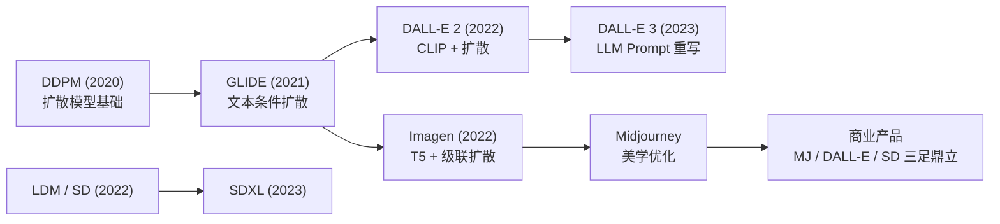
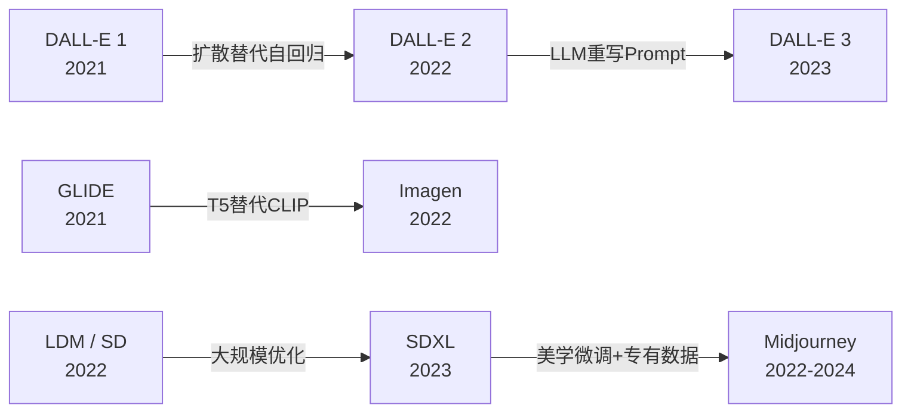
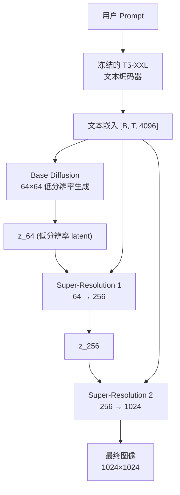
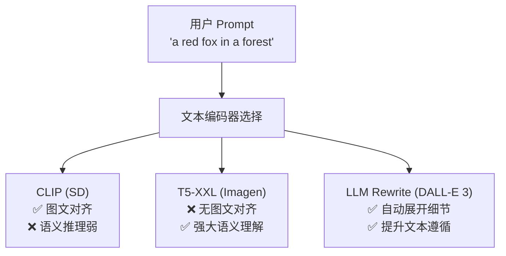

# Image Generation Models (Midjourney / DALL-E / Imagen)

## 知识地图



## 前置知识

- **扩散模型基础 (DDPM/LDM)**：前向加噪、反向去噪、噪声预测
- **Stable Diffusion**：VAE + CLIP + U-Net 架构
- **文本编码器**：CLIP（图文对齐）、T5（纯文本语义理解）
- **级联生成**：从低分辨率到高分辨率的多阶段 super-resolution

## 模型演化路线



| Model | Year | Key Innovation |
|-------|------|---------------|
| DALL-E 1 | 2021 | VQ-VAE + 自回归 Transformer |
| GLIDE | 2021 | 文本条件扩散 + 无分类器引导 |
| DALL-E 2 | 2022 | CLIP 隐空间 + 扩散解码器 |
| Imagen | 2022 | T5-XXL 文本编码 + 级联超分 |
| Stable Diffusion | 2022 | 隐空间扩散，开源生态 |
| DALL-E 3 | 2023 | LLM 自动重写 Prompt + 强文本遵循 |
| SDXL | 2023 | 更大 UNet + 双文本编码器 |
| Midjourney v6 | 2023 | 美学品质领先，偏好数据优化 |

## 为什么会出现 (Why)

Stable Diffusion 开源了扩散模型的技术路线，但闭源模型在**图像美学质量**和**文本遵循度**上仍有显著领先。这三个闭源模型的共同特征揭示了品质提升的关键路径：更好的文本编码器（T5 vs CLIP）、更高质量的训练数据（美学筛选）、以及更智能的 prompt 处理（LLM 重写）。

## 解决什么问题 (Problem)

1. **文本理解不足**：CLIP 文本编码器语义理解弱，难以精准遵循复杂 prompt
2. **美学品质差距**：开源模型输出"看起来像 AI 生成"，闭源模型的输出更接近专业摄影/艺术
3. **用户 prompt 简短**：普通用户只写几个词，但模型训练时长 caption 数据造成分布偏移

## 核心思想 (Core Idea)

**更强的文本编码器（T5 替代 CLIP） + 美学数据筛选与偏好微调 + 多阶段级联生成 + LLM Prompt 重写，四项策略共同推动闭源图像生成模型超越开源 SD。**

---

## 模型结构图

### Imagen 级联架构



### 文本编码器选择对生成的影响



## 数学模型/公式

### Imagen — 级联扩散 + T5 编码

两级级联：

1. **Base model**：$64 \times 64$ 低分辨率生成，以**冻结的 T5-XXL** 文本编码为条件
2. **Super-Resolution model**：$64 \to 256 \to 1024$，两个级联的 SR 扩散模型

关键发现：CLIP 文本编码器在文本-图像对齐任务上训练，但**语义理解和推理能力远不如 T5**（T5 是纯文本模型，无图像侧监督）。

**通俗解释：** CLIP 擅长"把文字和图片对到同一个空间"，但理解不了"那只坐在椅子上的猫看起来很悲伤因为它的碗是空的"这种需要推理的句子。T5 作为纯文本模型，在文本推理上的能力远超 CLIP。Imagen 证明了"无条件绑定图像侧的纯文本编码器"可以更好地指导图像生成——这推翻了"文本编码器必须做图文对齐"的直觉。

### DALL-E 3 — Prompt 重写

DALL-E 3 的核心创新不在于扩散模型本身，而在于训练了一个**caption rewriter**——将用户的简短 prompt 展开为详细的视觉描述。这解决了扩散模型的一个根本问题：用户写的 prompt 通常很短，而模型训练时的 caption 很长。

```
User: "a cat sitting on a chair"
Rewriter: "A photograph of an orange tabby cat with green eyes, sitting gracefully
_on a wooden kitchen chair with spindle back, soft afternoon light streaming through
_a window to the left, creating warm highlights on the cat's fur..."
```

**通俗解释：** 扩散模型训练时使用的 caption 是专业标注员写的详细描述（平均 50-100 词），但用户输入的 prompt 通常只有 5-10 个词。这造成了训练和推理的数据分布不匹配（distribution shift）。DALL-E 3 用一个 LLM 自动把短 prompt 展开为描述性长 caption，弥合了这个 gap。本质上是让模型在"训练分布"上而非"用户分布"上进行推理。

### Midjourney — 美学微调

Midjourney 的技术细节未公开，但普遍认为其卓越的美学品质来自：
- **偏好优化**：用大量人类美学偏好数据微调（类似 RLHF）
- **多阶段变分自编码器**：比 SD 的 VAE 更高分辨率的 latent space
- **数据策展**：精心挑选的高美学训练数据（ArtStation、专业摄影等）

**通俗解释：** Midjourney 的秘密武器不是架构创新，而是"数据 + 偏好"的极致优化。就像一个摄影师——相机（模型架构）可能和别人一样，但训练的数据集都是大师作品，加上人类反馈反复调教，最终呈现出众的美学品味。

---

## 可视化展示

### 文本遵循度对比

```echarts
return {
  tooltip: { trigger: "axis", confine: true },
  title: { top: 5,  text: '图像生成模型 DrawBench 文本遵循度', left: 'center', textStyle: { fontSize: 12 } },
  xAxis: { type: 'category', data: ['SDXL', 'DALL-E 2', 'Midjourney 5', 'Imagen', 'DALL-E 3'] },
  yAxis: { type: 'value', min: 60, max: 95, name: '文本-图像对齐率 (%)' },
  series: [{
    type: 'bar',
    data: [65, 71, 75, 82, 90],
    itemStyle: { color: '#2c3e50' },
    label: { show: true, position: 'top', formatter: '{c}%' }
  }],
  grid: { left: 60, right: 20, top: 55, bottom: 60 }
}
```

---

## 最小可运行代码

### Imagen 风格的级联流水线（概念）

```python
class ImagenPipeline:
    def __init__(self, t5_encoder, base_unet, sr_unet_256, sr_unet_1024):
        self.t5 = t5_encoder       # 冻结的 T5-XXL
        self.base = base_unet      # 64×64 → 64×64
        self.sr_256 = sr_unet_256  # 64→256
        self.sr_1024 = sr_unet_1024  # 256→1024

    def generate(self, prompt, steps=256):
        # 1. 文本编码 (T5, 幂等)
        text_emb = self.t5.encode(prompt)  # [B, T, 4096]

        # 2. 基础生成: 64×64
        z_64 = self._diffusion_sample(self.base, text_emb, (64, 64), steps)

        # 3. 超分阶段 1: 64→256
        z_256 = self._diffusion_sample(self.sr_256, text_emb, (256, 256), steps,
                                        low_res=z_64)

        # 4. 超分阶段 2: 256→1024
        z_1024 = self._diffusion_sample(self.sr_1024, text_emb, (1024, 1024), steps,
                                         low_res=z_256)
        return z_1024

    def _diffusion_sample(self, model, cond, size, steps, low_res=None):
        """DDIM 采样"""
        z = torch.randn(size)
        for t in self._timesteps(steps):
            noise_pred = model(z, t, cond, low_res=low_res)
            z = self._ddim_step(z, noise_pred, t)
        return z
```

### DALL-E 3 风格的 Prompt 重写

```python
def rewrite_prompt(user_prompt, llm):
    """用 LLM 将简短 prompt 展开为详细描述"""
    system_prompt = """You are a visual description expert. Given a brief image
description, expand it into a detailed caption covering: subject, action,
setting, lighting, colors, composition, style, and mood. Be specific and vivid."""

    response = llm.chat([
        {"role": "system", "content": system_prompt},
        {"role": "user", "content": f"Expand: {user_prompt}"}
    ])
    return response
```

---

## 工业界应用

| 产品/项目 | 说明 | 为什么领先 | 优势 | 劣势 |
|-----------|------|-----------|------|------|
| **Midjourney** | 订阅制图像生成服务，Discord 集成 | 偏好优化 + 美学数据策展 | 美学品质最高，开箱即用效果最好 | 控制精度有限，闭源 |
| **DALL-E 3** | OpenAI 产品，集成于 ChatGPT | LLM Prompt 重写消除分布偏移 | 文本遵循度最高，用户体验最好 | 定制性弱，仅 API |
| **Adobe Firefly** | Adobe 的商用安全图像生成 | 版权安全数据 + Photoshop 集成 | 商用安全，与设计工作流无缝集成 | 生成多样性较低 |
| **Imagen** | Google 的图像生成模型 | T5-XXL 强大的纯文本语义理解 | 复杂 prompt 理解能力强 | 推理成本高 (T5-XXL 11B) |
| **Canva AI** | Canva 设计平台集成 AI 功能 | AI + 模板化设计 | 非设计师友好，模板丰富 | 风格同质化 |
| **Leonardo AI** | 面向游戏/设计工作流 | SD 微调 + 专业工作流优化 | 游戏资产生成专业 | 社区生态不如 SD 原生

---

## 对比表格

| | Stable Diffusion (SDXL) | DALL-E 3 | Midjourney v6 | Imagen |
|------|--------------|----------|---------------|--------|
| 开源 | 是 | 否 | 否 | 否 |
| 文本编码器 | CLIP + OpenCLIP | LLM (GPT) | 未公开 (推测 T5 系) | T5-XXL |
| 核心创新 | 开源生态 + LoRA | Prompt 重写 | 美学偏好数据 | 级联 + 纯文本编码 |
| 文本遵循度 | 中 | 最高 | 高 | 高 |
| 美学品质 | 中 | 中高 | 最高 | 中高 |
| 分辨率策略 | 直接输出 + 超分 | 多阶段 | 多阶段 | 级联超分 (64→256→1024) |
| 推理成本 | 低 (开源本地) | 中 (API) | 中 (订阅) | 高 (T5-XXL) |

---

## 学完后建议继续学习

1. **[Stable Diffusion](stable-diffusion.md)** — 开源扩散模型的完整技术解析，理解 VAE 潜空间、U-Net Cross-Attention、CFG 等核心机制。
2. **[ControlNet](controlnet.md)** — 给图像生成加上精确的空间控制（线稿、骨架、深度图），让文生图从"开盲盒"变成"精确作画"。
3. **[Video Generation](video-generation.md)** — 将图像生成扩展到时间维度的技术挑战和解决方案。
4. **Prompt Engineering** — 学习如何写出高质量 prompt，以及 DALL-E 3 的 LLM 自动重写机制。
5. **SD3 / Flux / DiT** — 了解扩散模型从 U-Net 到 Transformer 的架构演进趋势。

---

## 高频面试题

### Q1: Imagen 为什么选用 T5-XXL 作为文本编码器而非 CLIP？T5 是纯文本模型，如何与图像生成桥接？

**标准答案：**
Imagen 的核心发现是：文本编码器的**语义理解和推理能力**比**图文对齐能力**更重要。CLIP 虽然图文对齐好，但其语义推理有限——CLIP 在对比学习中主要任务是将匹配的图文对拉近，不匹配的拉远，这种"匹配"不需要深层理解。T5 在纯文本语料上预训练，编码器拥有强大的语义理解能力（能处理否定句、计数、空间关系、因果关系等 CLIP 难以处理的内容）。

"桥接"的方式简单直接：Imagen 直接将 T5 的文本嵌入作为条件输入到扩散 U-Net 的 cross-attention 层。虽然 T5 嵌入和图像 latent 不在同一向量空间，但扩散模型通过 cross-attention 的可训练投影矩阵（$W_Q, W_K, W_V$）学习映射关系。实验证明这种映射是有效的——即使 T5 从未见过图像，其丰富的语义表示足以指导图像生成。

### Q2: DALL-E 3 的 Prompt 重写机制如何工作？为什么能有效提升文本遵循度？

**标准答案：**
DALL-E 3 训练了一个专门的 LLM-based caption rewriter，将用户的简短 prompt（如"a cat"）展开为详细的视觉描述（包含主体、动作、场景、光线、颜色、构图等）。

工作原理：(1) 训练阶段，使用 GPT 为图像生成详细的视觉描述 caption；(2) 推理阶段，将用户的 prompt 输入 LLM，输出相同风格的详细描述；(3) 扩散模型实际上接收的是 LLM 重写后的详细描述而非原始 prompt。

有效的核心原因：这解决了训练-推理的**分布偏移 (distribution shift)**——扩散模型训练时用的是详细的长 caption（平均 50-100 词），但用户实际输入的是短 prompt（5-10 词）。重写后的 prompt 在模型"最熟悉的分布"上进行推理，自然提升了生成质量和文本遵循度。这本质上是一个"把测试分布拉回训练分布"的工程技巧。

### Q3: Midjourney 的美学品质为什么被认为是业界最佳？可能的技术路线是什么？

**标准答案：**
虽然 Midjourney 未公开技术细节，但根据公开信息和行业分析，其美学优势可能来自：

1. **美学数据策展 (Data Curation)**：精选高质量的图像数据（ArtStation、Behance、专业摄影），而非从互联网随意爬取。数据质量直接影响模型的美学品味。
2. **偏好优化 (Preference Optimization)**：用大量人类美学偏好标注数据微调（类似 RLHF/Direct Preference Optimization），直接优化"人类觉得好看的图片"。
3. **多阶段流水线优化**：在生成的不同阶段（构图、色彩、纹理）分别做精细优化。
4. **更高质量的 VAE**：比 SD 的 VAE 压缩质量更高，保留更多高频细节。
5. **风格指令的精细控制**：允许用户通过参数控制风格化程度（stylize 参数）。

### Q4: 级联扩散 (Cascaded Diffusion) 相比直接生成高分辨率图像有什么优势？

**标准答案：**
级联扩散将生成过程分为多阶段：(1) Base 阶段在低分辨率（64x64）生成主要内容和构图，(2) Super-Resolution 阶段逐步提升到 256 和 1024。

优势：
1. **计算效率**：低分辨率扩散计算量远小于高分辨率。64x64 的 token 数量是 1024x1024 的 1/256。
2. **分而治之**：Base 模型关注整体内容和语义，SR 模型关注纹理和细节，各司其职。
3. **更好的收敛**：高分辨率直接训练不稳定，更容易过拟合纹理而忽略内容。
4. **可组合性**：不同分辨率阶段可以使用不同的条件和模型架构（如 Base 用大模型，SR 用小模型）。

代价：多阶段训练和推理流程更复杂，误差会在阶段间累积。

### Q5: Stable Diffusion、DALL-E、Midjourney 的产品定位和适用场景有何不同？

**标准答案：**
- **Stable Diffusion (Stability AI)**：开源生态，技术底座。适合需要定制化/本地部署/特殊工作流的场景（游戏资产生成、建筑可视化、二次元创作）。通过 LoRA/ControlNet 可高度定制，但开箱即用的美学品质较弱。
- **DALL-E 3 (OpenAI)**：集成于 ChatGPT，文本遵循度最高。适合需要精确遵循复杂指令的场景（如"画一只猫，它必须在画面的左下角，旁边放一个红色的球"）。用户体验最好（聊天式交互），但缺乏精细控制。
- **Midjourney**：美学品质最高，开箱即用效果最好。适合追求视觉冲击力的场景（概念艺术、海报设计、灵感创意）。但控制精度不如 DALL-E 3（参数调节有限），定制性不如 SD。
