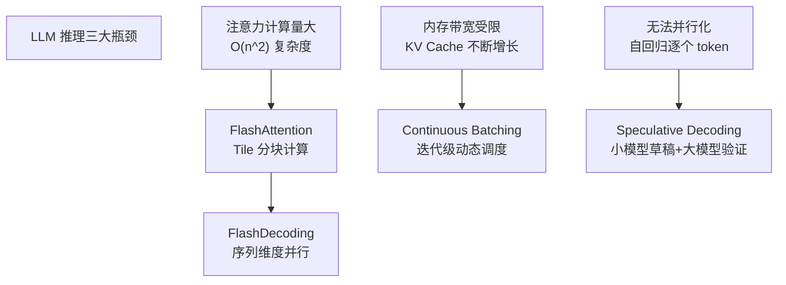
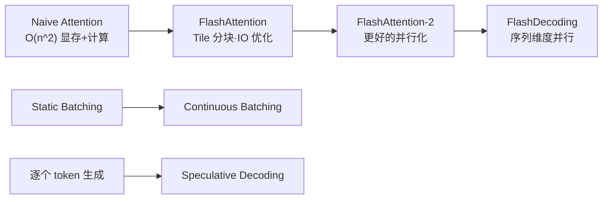
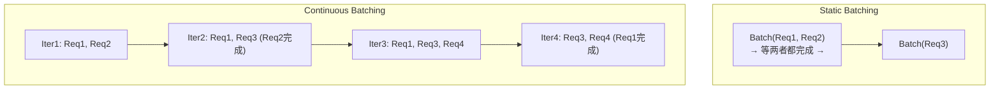
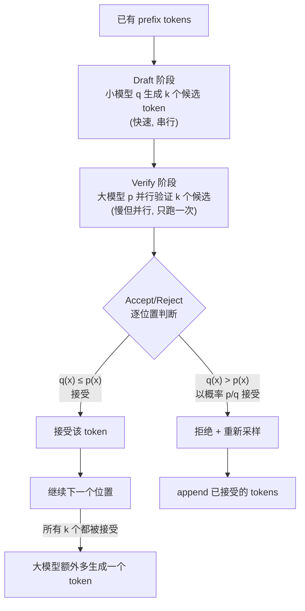

# Advanced Inference (FlashDecoding / Continuous Batching / Speculative Decoding)

## 知识地图



## 前置知识

- **自回归生成**：逐个 token 生成的过程，每次只生成一个 token
- **注意力机制**：Self-Attention、FlashAttention 的 tile 计算原理
- **推理框架基础**：vLLM、batch processing、KV Cache
- **概率论基础**：拒绝采样（Rejection Sampling）、概率分布
- **GPU 编程概念**：kernel launch、并行维度、内存层次结构

## 技术演化路线



| Technology | Year | Core Insight | Effect |
|------------|------|-------------|--------|
| FlashAttention | 2022 | Tile 分块+Online Softmax, 减少 HBM 读写 | 显存降低为 O(n), 速度提升 2-4× |
| FlashAttention-2 | 2023 | 改进并行化策略 | 进一步 2× 加速 |
| FlashDecoding | 2023 | 序列维度并行处理长上下文 | batch=1 时也能高效利用 GPU |
| Continuous Batching | 2022 | 迭代级动态调整 batch | GPU 利用率从 ~30% 提升到 80%+ |
| Speculative Decoding | 2023 | 小模型草稿 + 大模型验证 | 延迟不变, 吞吐提升 2-3× |

## 为什么会出现 (Why)

LLM 推理有三大瓶颈，每个技术针对其中一个：

1. **注意力计算 $O(n^2)$**：每个新 token 需要 attend 所有历史 token，长序列时注意力成为绝对瓶颈。FlashAttention 通过 IO 优化解决了这个问题，但当 batch=1 且序列很长时 GPU 利用率仍然很低——FlashDecoding 通过序列维度并行解决了这个死角。

2. **请求到达不对称**：真实服务中，请求随机到达、长度各异、生成速度不同。传统 static batching 必须等一批请求全部完成才能处理下一批——先完成的请求占着 GPU 资源"等人"。Continuous Batching 在每次迭代后调整 batch 组成——完成就走，新的就来。

3. **自回归不能并行**：大模型一次只能生成一个 token。Speculative Decoding 的洞察是——小模型虽然也只能生成一个 token，但它极快。让它先生成一串候选 token，大模型一次性验证——数学上等价于大模型逐 token 生成，但实际吞吐翻倍。

## 解决什么问题 (Problem)

| 瓶颈 | 具体问题 | 解决方案 |
|------|---------|---------|
| 注意力计算 | 长序列 O(n^2)，batch=1 时 GPU 闲置 | FlashDecoding |
| 显存带宽 | KV Cache 不断增长，超出显存 | KV Cache 量化 + PagedAttention |
| 串行解码 | 语义上无法并行，GPU 只能等上一个 token | Speculative Decoding |
| 请求调度 | Static batching 浪费 GPU 资源 | Continuous Batching |

## 核心思想 (Core Idea)

在保持数学等价性的前提下，通过并行化注意力计算、动态调度请求和"草稿+验证"策略，将 LLM 推理从"串行瓶颈"提升为"并行流水线"。

---

## 数学定义与原理解析

### FlashDecoding — 序列维度并行

FlashAttention 已经将注意力分解为 tile 计算。FlashDecoding 进一步将长序列的 **softmax 计算沿 token 维度并行化**。

标准 FlashAttention 在 batch 和 head 维度并行。当 batch=1 且序列很长时，GPU 利用率低。FlashDecoding 添加了序列维度的并行：

$$
\text{Attention}(Q_i, K, V) = \frac{\sum_j \exp(Q_i K_j^T) V_j}{\sum_j \exp(Q_i K_j^T)}
$$

对于每个 query token $i$，将 key/value 拆分为多个 chunk 并行计算，然后用 **online softmax** 合并各 chunk 的分子/分母（与 FlashAttention 相同的技巧，但沿序列维度拆分）。

**通俗解释：** 传统的 FlashAttention 把"多个请求"和"多个注意力头"并行处理。但当只有一个很长的请求时（比如一篇 128K 的文章），没有足够的并行度填满 GPU。FlashDecoding 的创意是——把 K 和 V 也切成块，让不同的 GPU 计算单元各自负责一部分 K/V 块，最后用 online softmax 把结果拼起来。这样即使只有一个请求，GPU 也能被充分利用。

### Continuous Batching — 迭代级调度

传统 static batching：一次传入一批请求，等所有请求完成后再传下一批。如果某条请求提前结束（已生成 EOS），其 GPU 资源被浪费。

Continuous Batching 在**每步生成后**动态调整 batch：
- 完成的请求被移除
- 新请求可以随时加入
- 每个 iteration 的 batch 可能不同

```
Time →     Step1  Step2  Step3  Step4  Step5
Request1:  [gen]  [gen]  [gen]  [gen]  [DONE] → 移除
Request2:  [gen]  [gen]  [DONE] → 移除
Request3:          [new]  [gen]  [gen]  [gen]
Batch size:  2      3      2      2      1
```

**通俗解释：** 传统的 static batching 像公交车——等满一车人再出发，到了终点站才全部下车。Continuous Batching 像出租车——有空位就接新乘客，到了目的地的乘客随时下车，车里总有人。对 GPU 来说，这意味着它几乎每一刻都在干活，不存在"等人"的闲置时间。

### Speculative Decoding — 草稿+验证

大模型一次生成 1 个 token，小模型也一次生成 1 个 token，但小模型快得多。Speculative Decoding 让小模型先生成 $k$ 个候选 token，大模型一次性验证（并行）：

1. **Draft**：小模型 $q$ 快速生成 $x_{t+1}, \ldots, x_{t+k}$ 及其概率 $q(x_i)$
2. **Verify**：大模型 $p$ 并行计算 $p(x_{t+1}), \ldots, p(x_{t+k})$
3. **Accept/Reject**：对每个位置，如果 $q(x_i) \leq p(x_i)$ 则接受，否则以概率 $p(x_i)/q(x_i)$ 接受（rejection sampling）
4. 第一个被拒绝的位置用 $p$ 重新采样，之后丢弃

数学保证了输出分布严格等价于 $p$ 的采样。

**通俗解释：** 想象一个头脑风暴+审核的场景。小模型是"快但不太准"的头脑风暴者——快速抛出 k 个想法。大模型是"慢但准"的审核者——它一次性审核所有 k 个想法（而不是一个一个想）。如果小模型猜对了（大模型也同意），就直接通过；如果猜错了，大模型当场纠正。由于大模型审核 k 个候选只需一次推理（比逐 token 生成 k 次快得多），同时大部分 token 小模型能猜对（对准率通常 80%+），总体吞吐大幅提升。数学上通过 rejection sampling 保证了输出分布和大模型逐 token 生成完全一样。

---

## 可视化展示

### Continuous Batching



### Speculative Decoding 流程



### 吞吐量对比

```echarts
return {
  tooltip: { trigger: "axis", confine: true },
  title: { top: 5,  text: '推理优化技术吞吐量提升 (LLaMA-7B)', left: 'center', textStyle: { fontSize: 12 } },
  xAxis: { type: 'category', data: ['Baseline', '+Continuous Batching', '+FlashAttention', '+Speculative Decode', '全部组合'] },
  yAxis: { type: 'value', min: 0, max: 50, name: 'Tokens/s (相对)' },
  series: [{
    type: 'bar',
    data: [1, 4, 7, 15, 45],
    itemStyle: { color: '#2c3e50' },
    label: { show: true, position: 'top', formatter: '{c}×' }
  }],
  grid: { left: 60, right: 20, top: 55, bottom: 60 }
}
```

---

## 架构对比

| 技术 | 优化方向 | 是否数学等价 | 硬件要求 | 效果 | 适用场景 |
|------|---------|-------------|---------|------|---------|
| FlashDecoding | 注意力计算 | 是 | 无特殊要求 | batch=1 时 GPU 利用率大幅提升 | 长序列推理 |
| Continuous Batching | 请求调度 | 是 | 无特殊要求 | GPU 利用率 30% → 80%+ | 多请求在线服务 |
| Speculative Decoding | 串行瓶颈 | 是 | 需额外小模型 | 吞吐 2-3× | 可接受额外显存开销 |

## 数学模型/公式

### Online Softmax (FlashDecoding 核心)

将序列分为 K 个 chunk，对每个 chunk 计算局部 softmax：

$$m_{new} = \max(m_{old}, \max(\text{chunk}))$$

$$l_{new} = \exp(m_{old} - m_{new}) \cdot l_{old} + \exp(\max(\text{chunk}) - m_{new}) \cdot \sum \exp(\text{chunk})$$

**通俗解释：** softmax 的朴素实现需要遍历所有元素——先找最大值，再求所有 exp 的和。Online Softmax 允许分块计算——第一个 chunk 算完存下当前的最大值和累加和，第二个 chunk 来的时候"修正"之前的累加和（因为新 chunk 可能有更大的值，需要重新 normalize）。这就是 FlashDecoding 能把序列切分成 chunk 并行处理的数学基础。

### Speculative Decoding 拒绝采样

对于候选 token $x_i$（概率 $q(x_i)$），接受概率为：

$$P_{accept}(x_i) = \min\left(1, \frac{p(x_i)}{q(x_i)}\right)$$

**通俗解释：** 如果大模型对这个 token 的评分更高的概率（$p(x_i) > q(x_i)$），直接接受；如果大模型评分更低（$p(x_i) < q(x_i)$），以概率 $p(x_i)/q(x_i)$ 随机接受。这个简单的规则保证了从大模型分布 $p$ 中采样和直接逐 token 生成的数学等价性。直观理解：小模型过于自信的 token（$q > p$）需要"随机纠正"，而小模型不够自信的 token（$q \leq p$）自动通过。

---

## 核心代码实现

### Speculative Decoding

```python
import torch
import torch.nn.functional as F

@torch.no_grad()
def speculative_decode(target_model, draft_model, prefix, k=5, T=1.0):
    """
    prefix: 已有 token [1, L]
    返回: 生成的 token 序列
    """
    generated = list(prefix[0].tolist())

    while True:
        draft_input = torch.tensor([generated])
        # 1. Draft: 小模型生成 k 个候选
        draft_tokens = []
        draft_probs = []
        for _ in range(k):
            logits = draft_model(draft_input)[0, -1] / T
            probs = F.softmax(logits, dim=-1)
            token = torch.multinomial(probs, 1).item()
            draft_tokens.append(token)
            draft_probs.append(probs[token].item())
            draft_input = torch.tensor([generated + draft_tokens])

        # 2. Verify: 大模型并行计算
        target_input = torch.tensor([generated + draft_tokens])
        target_logits = target_model(target_input)[0]  # [L, V]
        target_probs = F.softmax(target_logits[len(generated)-1:] / T, dim=-1)

        # 3. Accept/Reject
        for i in range(k):
            q_prob = draft_probs[i]
            p_prob = target_probs[i, draft_tokens[i]].item()

            if random.random() < min(1.0, p_prob / max(q_prob, 1e-10)):
                generated.append(draft_tokens[i])  # 接受
            else:
                # 拒绝: 从 p 重新采样 (减去 q 的贡献)
                adjusted_probs = F.relu(target_probs[i] - F.softmax(
                    torch.tensor(draft_probs[i]), dim=-1))
                adjusted_probs /= adjusted_probs.sum()
                new_token = torch.multinomial(adjusted_probs, 1).item()
                generated.append(new_token)
                break
        else:
            # 所有 k 个都被接受, 额外加一个来自 p 的 token
            last_probs = F.softmax(target_logits[-1] / T, dim=-1)
            generated.append(torch.multinomial(last_probs, 1).item())
            continue

        if generated[-1] == EOS_TOKEN:
            break

    return generated[len(prefix[0]):]
```

### Continuous Batching 示意

```python
class ContinuousBatchingScheduler:
    def __init__(self, model, max_batch=32):
        self.model = model
        self.max_batch = max_batch
        self.active_requests = []

    def step(self):
        """单步推理+调度"""
        if len(self.active_requests) < self.max_batch:
            # 尝试从队列拉新请求
            while self.pending_queue and len(self.active_requests) < self.max_batch:
                self.active_requests.append(self.pending_queue.pop(0))

        # 生成一步
        inputs = torch.stack([r.current_seq for r in self.active_requests])
        logits = self.model(inputs)[:, -1]
        next_tokens = logits.argmax(dim=-1)

        # 更新序列 + 移除已完成请求
        remaining = []
        for i, req in enumerate(self.active_requests):
            req.append_token(next_tokens[i].item())
            if not req.is_done():
                remaining.append(req)
        self.active_requests = remaining
```

### FlashDecoding 简化实现

```python
def flash_decoding_attention(Q, K, V, block_size=128):
    """
    沿序列维度分块的注意力计算.
    Q: [B, H, N_q, D] - 少量 query tokens
    K, V: [B, H, N_kv, D] - 大量 key/value tokens
    """
    B, H, Nq, D = Q.shape
    _, _, Nkv, _ = K.shape

    # 为每个 query token 维护 online softmax 状态
    O = torch.zeros(B, H, Nq, D, device=Q.device, dtype=Q.dtype)
    L = torch.zeros(B, H, Nq, 1, device=Q.device, dtype=Q.dtype)
    M = torch.full((B, H, Nq, 1), float('-inf'),
                   device=Q.device, dtype=Q.dtype)

    # 将 K/V 沿序列维度分块并行处理
    for start in range(0, Nkv, block_size):
        end = min(start + block_size, Nkv)
        K_block = K[:, :, start:end]
        V_block = V[:, :, start:end]

        # 当前 block 的注意力分数
        S = (Q @ K_block.transpose(-2, -1)) / (D ** 0.5)
        m_curr = S.max(dim=-1, keepdim=True).values

        # Online softmax 更新
        m_new = torch.max(M, m_curr)
        l_curr = torch.exp(S - m_new).sum(dim=-1, keepdim=True)
        l_prev = torch.exp(M - m_new) * L
        l_new = l_prev + l_curr

        # 加权累积输出
        O = O * l_prev + (torch.exp(S - m_new) @ V_block) * l_curr
        O = O / l_new
        L = l_new
        M = m_new

    return O
```

## 工业界应用

| 产品/服务 | 使用技术 | 效果 |
|-----------|---------|------|
| vLLM | PagedAttention + Continuous Batching + FlashAttention | 10-20× HF Transformers 吞吐 |
| SGLang | FlashAttention + Continuous Batching + Speculative Decoding | 最高 5× 吞吐提升 |
| TensorRT-LLM | FlashDecoding + Speculative Decoding | 优化长上下文推理 |
| HuggingFace TGI | Continuous Batching + FlashAttention | 生产级 LLM 推理服务 |
| LMDeploy | Persistent Batching + FlashAttention + 量化 | C++ 级别推理延迟 |

## 对比表格：三项技术总结

| 维度 | FlashDecoding | Continuous Batching | Speculative Decoding |
|------|--------------|-------------------|---------------------|
| 解决瓶颈 | 注意力计算（序列维度） | 请求调度（GPU 闲置） | 串行生成（无法并行） |
| 核心技巧 | Online Softmax 分块 | 迭代级动态增减 | Draft + Verify + Rejection Sampling |
| 数学等价 | 是（数值近似） | 完全等价 | 严格等价 |
| 额外开销 | 无 | 无（纯调度） | 需要加载小模型 |
| 典型加速 | 2-4× (长序列) | 2-3× (多请求) | 2-3× |
| 实现复杂度 | 低 | 中 | 中 |

## 学完后建议继续学习

1. **Serving Frameworks** — vLLM、SGLang、TGI、LMDeploy 的完整对比与选型
2. **FlashAttention-3** — 最新的注意力 IO 优化技术
3. **Tensor Parallelism** — 多卡张量并行推理
4. **KV Cache 量化** — KIVI、CacheGen 等 KV Cache 压缩方案
5. **Structured Outputs** — SGLang 的结构化生成和约束解码

## 高频面试题

### Q1: FlashDecoding 和 FlashAttention 的核心区别是什么？为什么需要 FlashDecoding？

**标准答案：** FlashAttention 的并行策略是 batch 维度和 head 维度并行——当 batch size 大、head 多时 GPU 利用率高。但当场景是"单条长序列推理"（batch=1，比如总结一篇 100K 的文章）时，batch/head 维度的并行度不够填满 GPU。FlashDecoding 额外引入了序列维度的并行——将 K 和 V 沿序列维度切分为多个 chunk，每个 chunk 独立计算局部 attention，再用 online softmax 合并。这样即使 batch=1，序列长度 128K，也能通过切分成数百个 chunk 获得足够并行度。核心区别：并行维度的扩展（batch/head → batch/head/sequence）。

### Q2: Continuous Batching 和 Static Batching 的本质区别是什么？为什么提升这么大？

**标准答案：** Static Batching 的调度单位是"一批请求的完整生命周期"——一个 batch 内的请求必须全部完成才能释放资源。这导致"短板效应"——batch 内最长的请求决定了整个 batch 的耗时，先完成的请求空占 GPU 等待。Continuous Batching 将调度单位精细到"单次迭代"——每生成一步后重新决定 batch 组成：完成的移除、排队的加入。效果：GPU 几乎每时每刻都在满负载工作（利用率从 30% 提升到 80%+），同时减少了单个请求的排队等待时间。这是 LLM 推理服务从"能跑"到"能上线"的关键技术。

### Q3: Speculative Decoding 如何保证输出分布和原模型完全一致？

**标准答案：** 通过 rejection sampling（拒绝采样）保证：对于草稿模型提议的每个 token $x_i$，计算接受概率 $\min(1, p(x_i)/q(x_i))$。如果小模型过于自信（$q(x_i) > p(x_i)$），则随机接受或拒绝，拒绝后从大模型的"修正分布"重新采样。这个过程的数学基础是——大模型一次验证 k 个 token 的输出概率 $p(x_{t+1}), \ldots, p(x_{t+k})$ 是严格正确的（一次完整的 forward pass），而 rejection sampling 保证了最终采样到的 token 序列严格服从 $p$ 的分布。大模型的验证是并行的（k 个位置同时计算），不影响数学正确性——"验证"和"生成"在计算上是两个不同的过程。

### Q4: 三项技术能否同时使用？如何组合达到最大效果？

**标准答案：** 可以且应该同时使用，它们解决的是不同维度的问题：（1）FlashDecoding 优化注意力计算的 math 执行——无论 batch 多少，都能让注意力算得更快，特别擅长长序列场景；（2）Continuous Batching 优化请求调度——保证多个请求同时在线时 GPU 不闲置；（3）Speculative Decoding 突破自回归的串行限制——用辅助小模型"推测"未来 token。实际生产中，vLLM 使用 PagedAttention + Continuous Batching + FlashAttention，SGLang 在这之上叠加了 Speculative Decoding 和前缀缓存。组合效果是乘性的——三者叠加可比原生推理提升 20-50× 的吞吐量。

### Q5: 为什么长序列推理是 LLM 服务的最大挑战？如何应对？

**标准答案：** 长序列（100K+ tokens）带来三重挑战：（1）注意力计算 $O(n^2)$——100K 序列的注意力矩阵需要 $100K \times 100K \times 4\text{bytes} = 40\text{GB}$ 显存来存储，推理时间也剧烈增长；（2）KV Cache 线性增长——每生成一个新 token，KV Cache 增长 1 token，100K 上下文的 7B 模型 KV Cache 约 10GB+；（3）batch=1 时并行度低——通常只有一个长序列请求，GPU 利用率低。应对策略：FlashAttention/FlashDecoding 解决计算瓶颈（$O(n^2)$ 变成 $O(n)$ tiles），KV Cache 量化（INT4/INT8 存储 KV Cache 减少 4-8× 显存），前缀缓存（多条请求共享相同前缀的 KV Cache），以及多卡张量并行扩展显存容量。
