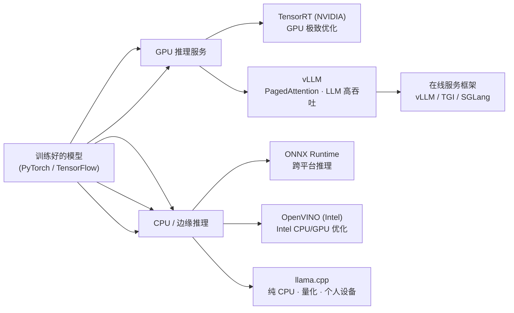
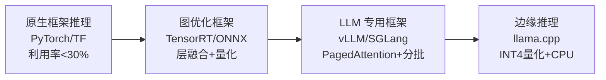
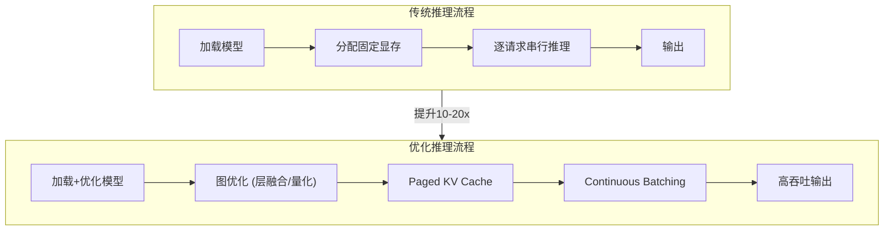
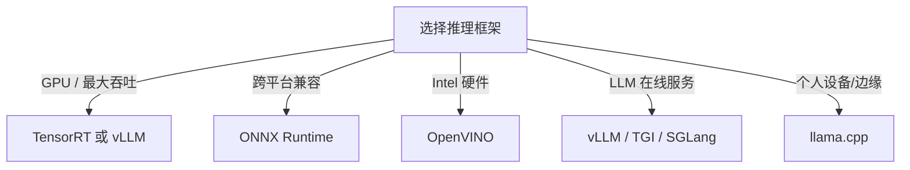

# TensorRT / ONNX / OpenVINO / vLLM / llama.cpp

## 知识地图



## 前置知识

- **模型推理基础**：前向传播（Forward Pass）、计算图（Computation Graph）
- **PyTorch / TensorFlow 基础**：模型保存与加载、ONNX 导出
- **GPU 编程基础**：CUDA Kernel、显存管理、内存带宽
- **量化基础**：INT8/FP8/INT4 量化原理、校准（Calibration）
- **LLM 推理特殊性**：自回归生成、KV Cache、显存瓶颈

## 技术演化路线



| Stage | Era | Representative | Core Innovation |
|-------|------|----------------|-----------------|
| 原生推理 | 2016-2018 | PyTorch/TF eager | 灵活但低效, GPU 利用率低 |
| 图优化 | 2018-2022 | TensorRT, ONNX, OpenVINO | 层融合、精度降级、内核调优 |
| LLM 专用 | 2022-2024 | vLLM, TGI, SGLang | PagedAttention, Continuous Batching |
| 边缘推理 | 2023-2024 | llama.cpp, MLC | 量化 + CPU 优化, 个人设备 |

## 为什么会出现 (Why)

训练好的模型直接用于推理，GPU 利用率通常不到 30%。问题出在三个方面：（1）框架本身的开销——PyTorch eager mode 有大量的 Python 解释器和显存分配开销；（2）计算图未优化——训练时为了方便，计算图中存在大量可以合并的操作；（3）内存管理低效——尤其是 LLM 的 KV Cache，传统方式预留连续显存导致大量碎片和浪费。

推理框架的出现就是为了在每个环节上榨取性能——从算子优化到显存管理再到请求调度。

## 解决什么问题 (Problem)

- **GPU 利用率低**：原生推理 GPU 利用率 < 30%，大量时间花在 Python 调度和显存操作上
- **显存浪费**：传统推理方式预留最大上下文长度，但实际请求通常短得多
- **推理延迟高**：生成式 LLM 需要逐 token 推理，每次都要重新计算注意力
- **多平台兼容**：训练用 PyTorch，部署可能是 GPU/CPU/边缘设备
- **量化精度损失**：直接量化会损失精度，需要校准数据保持良好的精度

## 核心思想 (Core Idea)

对训练好的模型进行图优化、精度降级和显存管理优化，将推理效率从"能跑"提升到"能服务"，不同框架针对不同硬件平台和场景做到极致。

---

## TensorRT (NVIDIA)

### 核心原理

对训练好的模型做**图优化**和**精度降级**，生成针对特定 GPU 架构高度优化的推理引擎。

### 优化技术

- **层融合**：Conv + BN + ReLU → 单个 kernel
- **张量内存优化**：减少显存分配/释放
- **内核自动调优**：为每层选择最优 CUDA kernel
- **INT8/FP8 量化**：结合校准数据的精度优化

### 使用流程

```
PyTorch → ONNX → TensorRT Engine → 推理
         或
PyTorch → torch2trc → TensorRT Engine
```

---

## ONNX Runtime

### 核心思想

ONNX 是模型交换格式，ONNX Runtime 是跨平台推理引擎，支持多种后端（CPU、CUDA、TensorRT、OpenVINO）。

```python
import onnxruntime as ort

session = ort.InferenceSession("model.onnx")
outputs = session.run(["output_name"], {"input_name": input_data})
```

---

## OpenVINO (Intel)

### 定位

Intel 的推理优化工具，针对 Intel CPU/GPU/VPU 深度优化。

### 关键优化

- **Post-training Optimization Tool (POT)**：INT8 量化
- **Neural Network Compression Framework (NNCF)**：QAT + 剪枝
- 针对 Xeon CPU 的向量化指令优化

---

## vLLM

### 核心创新

- **PagedAttention**：解决 KV Cache 内存碎片
- **Continuous Batching**：动态合并请求到 batch（不等整个 batch 完成）
- **高吞吐**：比 HuggingFace Transformers 提升 10-20×

```python
from vllm import LLM, SamplingParams

llm = LLM(model="meta-llama/Llama-2-7b")
outputs = llm.generate(prompts, SamplingParams(temperature=0.8))
```

---

## llama.cpp

### 核心思想

纯 C/C++ 实现的 LLaMA 推理，优化 CPU 推理速度。

### 关键优化

- **INT4/INT8 量化**：GGUF 格式
- **mmap 加载**：模型快速加载，支持部分加载
- **Apple Silicon 优化**：Accelerate + Metal
- **内存效率**：可在 RAM 有限的设备上运行

```bash
./llama-cli -m model.gguf -p "Hello, my name is"
```

---

## 架构对比

### 框架架构设计

| 框架 | 语言 | 中间表示 | 量化支持 | 后端 | 硬件目标 |
|------|------|---------|----------|------|---------|
| TensorRT | C++/CUDA | TensorRT Engine | INT8/FP8/FP16 | CUDA | NVIDIA GPU |
| ONNX Runtime | C++ | ONNX Graph | INT8/FP16 | CPU/CUDA/TensorRT/OpenVINO | 全平台 |
| OpenVINO | C++ | OpenVINO IR | INT8/FP16 | CPU/iGPU/VPU | Intel 全系列 |
| vLLM | Python/C++ | 原生 PyTorch/TensorRT | AWQ/GPTQ/FP8 | CUDA/ROCm | NVIDIA/AMD GPU |
| llama.cpp | C/C++ | GGUF | INT4/INT8/FP16 | CPU/Metal/CUDA | CPU/Apple Silicon |

### 优化技术对比

| 技术 | TensorRT | ONNX RT | OpenVINO | vLLM | llama.cpp |
|------|----------|---------|----------|------|-----------|
| 层融合 | 极致 | 好 | 好 | - | - |
| Kernel 调优 | 自动 | 手动 | 手动 | FlashAttn | 手工优化 |
| 量化 | INT8/FP8 | INT8 | INT8 | AWQ/GPTQ | INT4/INT8 |
| KV Cache 管理 | - | - | - | PagedAttn | 连续 |
| 批处理 | Static | Static | Static | Continuous | Static |
| 前缀缓存 | - | - | - | APC | - |

## 数学模型/公式

### TensorRT 层融合

将多个操作合并为一个 kernel 调用：

```
原始: Conv(x) → BN(y) → ReLU(z)
融合后: ConvBNReLU(x)  (单次 kernel launch)
```

**通俗解释：** 传统的推理中，Conv 算完把结果写到显存，BN 从显存读出来再算，ReLU 又从显存读出来再算——三进三出显存。TensorRT 发现这三步的输入输出维度相同，可以合并成一个 CUDA kernel 完成——数据只进出显存一次。对于上百层的网络，这些"读写回合"的节省累加起来就是数倍的加速。

### INT8 量化公式

量化权重：$W_{int8} = \text{round}\left(\frac{W_{fp32}}{S}\right) + Z$

其中 $S$ 是 scale（缩放因子），$Z$ 是 zero-point（零点）。

推理时：$y = S_x S_w \cdot \text{Conv}(x_{int8}, W_{int8})$

**通俗解释：** FP32 的权重范围可能是 [-1.5, 0.8]，用 32 位浮点数存储很浪费。INT8 量化找到这个范围后，将其映射到 [-128, 127] 的整数范围——$S = (0.8 - (-1.5)) / 255$ 就是缩放因子。推理时用整数矩阵乘法（比浮点快得多），最后再乘以缩放因子还原。INT8 的误差通常在 0.5% 以内，但推理速度提升 2-3×。

### PagedAttention 分块公式

将 KV Cache 切分为固定大小的 Block：

$$\text{KV Cache} = \{\text{Block}_1, \text{Block}_2, \ldots\}$$

注意力计算时拼接需要的 Block：

$$A_{ij} = \frac{\exp(Q_i K_j^T / \sqrt{d})}{\sum_{j'} \exp(Q_i K_{j'}^T / \sqrt{d})}$$

**通俗解释：** 传统方式为每个请求预留一整块连续显存（比如最多 4096 个 token 的位置），但大多数请求只需要 500 个 token——剩下的 3596 个位置全浪费了。PagedAttention 将 KV Cache 切成固定大小的小块（每块 16-64 个 token），按需分配——请求需要多少就分配多少块，块之间不需要连续。就像操作系统的虚拟内存一样——零碎片、按需增长、可以共享。

## 可视化展示

### 推理框架工作流对比



### 各框架适用场景



### 框架技术对比

```echarts
return {
  tooltip: { trigger: "axis", confine: true },
  title: { top: 5,  text: '推理框架特性雷达', left: 'center', textStyle: { fontSize: 12 } },
  radar: {
    indicator: [
      { name: '吞吐', max: 10 },
      { name: '延迟', max: 10 },
      { name: '易用性', max: 10 },
      { name: '跨平台', max: 10 },
      { name: '量化', max: 10 }
    ]
  },
  series: [{
    type: 'radar',
    data: [
      { value: [10, 9, 5, 3, 8], name: 'TensorRT' },
      { value: [5, 6, 8, 10, 6], name: 'ONNX Runtime' },
      { value: [8, 7, 4, 5, 7], name: 'OpenVINO' },
      { value: [9, 8, 8, 4, 8], name: 'vLLM' },
      { value: [3, 6, 10, 10, 9], name: 'llama.cpp' }
    ]
  }],
  grid: { left: 60, right: 20, top: 55, bottom: 60 }
}
```

## 最小可运行代码

### TensorRT (torch2trt)

```python
import torch
from torch2trt import torch2trt

model = torch.load("model.pth").eval().cuda()
x = torch.ones((1, 3, 224, 224)).cuda()

# 转换为 TensorRT
model_trt = torch2trt(model, [x], fp16_mode=True)
torch.save(model_trt.state_dict(), "model_trt.pth")

# 推理
y = model_trt(x)             # TensorRT 加速
y_ref = model(x)             # 原始 PyTorch
print("Max diff:", (y - y_ref).abs().max().item())
```

### ONNX Runtime

```python
import onnx
import onnxruntime as ort
import numpy as np

# 1. PyTorch 导出 ONNX
torch.onnx.export(model, dummy_input, "model.onnx",
                  input_names=["input"], output_names=["output"])

# 2. 验证 ONNX
onnx_model = onnx.load("model.onnx")
onnx.checker.check_model(onnx_model)

# 3. ONNX Runtime 推理
session = ort.InferenceSession("model.onnx",
                               providers=["CUDAExecutionProvider"])
input_data = np.random.randn(1, 3, 224, 224).astype(np.float32)
outputs = session.run(["output"], {"input": input_data})
```

### OpenVINO 模型转换与推理

```python
from openvino.runtime import Core
import openvino as ov

# 1. 转换模型
ov_model = ov.convert_model("model.onnx")
ov.save_model(ov_model, "model.xml")

# 2. 加载推理
core = Core()
compiled_model = core.compile_model(ov_model, "CPU")
infer_request = compiled_model.create_infer_request()

# 3. 推理
input_tensor = ov.Tensor(np.random.randn(1, 3, 224, 224).astype(np.float32))
infer_request.set_input_tensor(input_tensor)
infer_request.infer()
output = infer_request.get_output_tensor()
```

### vLLM 离线批处理

```python
from vllm import LLM, SamplingParams

llm = LLM(
    model="meta-llama/Llama-2-7b-hf",
    max_model_len=4096,
    gpu_memory_utilization=0.9,
    tensor_parallel_size=1,
)

prompts = [
    "Explain the theory of relativity:",
    "Write a Python function to sort a list:",
]
sampling_params = SamplingParams(
    temperature=0.8, top_p=0.95, max_tokens=256,
)
outputs = llm.generate(prompts, sampling_params)

for output in outputs:
    prompt = output.prompt
    generated = output.outputs[0].text
    print(f"Prompt: {prompt}\nGenerated: {generated}\n")
```

### llama.cpp Python 绑定

```python
from llama_cpp import Llama

# 加载 GGUF 量化模型
llm = Llama(
    model_path="models/llama-2-7b.Q4_K_M.gguf",
    n_ctx=4096,           # 上下文窗口
    n_threads=8,          # CPU 线程数
    n_gpu_layers=-1,      # -1 = 全部放 GPU (Metal/CUDA)
)

# 生成
output = llm(
    "Q: What is the capital of France? A:",
    max_tokens=128,
    temperature=0.7,
    top_p=0.95,
)
print(output["choices"][0]["text"])
```

## 工业界应用

| 产品/服务 | 推理框架 | 场景 |
|-----------|---------|------|
| NVIDIA Triton Inference Server | TensorRT + ONNX | 企业级多模型推理服务 |
| HuggingFace Inference Endpoints | TGI (基于 vLLM) | 托管 LLM API |
| Intel OpenVINO Model Server | OpenVINO | Intel 硬件推理服务 |
| Ollama | llama.cpp | 个人桌面 LLM |
| LM Studio | llama.cpp | 个人离线 LLM 客户端 |
| Anyscale | vLLM | 云端 LLM 服务 |
| 阿里云 PAI-EAS | vLLM + TensorRT | 企业级模型部署 |

## 对比总结

| 框架 | 适用硬件 | 量化支持 | 吞吐优化 | 易用性 | 推荐场景 |
|------|----------|----------|----------|--------|---------|
| TensorRT | NVIDIA GPU | INT8/FP8/FP16 | 极致 | 中 | GPU 单模型极致优化 |
| ONNX Runtime | 全平台 | INT8/FP16 | 中 | 高 | 跨平台部署 |
| OpenVINO | Intel CPU/GPU | INT8/FP16 | 高 | 中 | Intel 硬件集群 |
| vLLM | NVIDIA/AMD GPU | AWQ/GPTQ | 极高 | 高 | LLM 在线推理服务 |
| llama.cpp | CPU/Apple Silicon | INT4/INT8 | 中 | 极高 | 个人设备/边缘推理 |

## 选择建议

- **GPU 部署（最大吞吐）**：TensorRT 或 vLLM
- **CPU 部署**：ONNX Runtime 或 OpenVINO
- **个人设备/边缘**：llama.cpp
- **LLM 在线服务**：vLLM 或 TGI

## 学完后建议继续学习

1. **Advanced Inference** — FlashDecoding、Continuous Batching、Speculative Decoding 深入
2. **Serving Frameworks** — vLLM vs SGLang vs TGI vs LMDeploy 详细对比
3. **量化深入** — AWQ、GPTQ、GGUF 的算法原理和实现
4. **TensorRT-LLM** — NVIDIA 针对 LLM 的专项优化方案
5. **分布式推理** — Tensor Parallelism、Pipeline Parallelism

## 高频面试题

### Q1: TensorRT 的层融合（Layer Fusion）是什么？为什么能加速推理？

**标准答案：** 层融合是将多个连续的计算操作合并为单个 GPU kernel 的技术。例如将 `Conv → BatchNorm → ReLU` 三个操作融合为一个 `ConvBNReLU` kernel。加速原理：（1）减少 kernel launch 次数——原来 3 次变成 1 次，降低了 CPU-GPU 调度开销；（2）减少显存读写——中间结果不需要反复写入和读取显存，在 GPU 寄存器/共享内存中直接传递；（3）提高计算密度——单次 kernel 做更多计算，掩盖显存访问延迟。对于上百层的网络，层融合可以带来 2-5× 的加速。

### Q2: vLLM 的 PagedAttention 解决了什么问题？如何实现？

**标准答案：** 传统 KV Cache 为每个请求预留一整块连续显存（按最大上下文长度），导致两个问题：内存碎片化（不同请求的预留大小不同，释放后产生碎片）和显存浪费（大多数请求用不到最大长度）。PagedAttention 借鉴操作系统的虚拟内存/分页机制：（1）将 KV Cache 切分为固定大小的 Block（如每块存 16 个 token 的 K 和 V）；（2）按需分配——请求需要几个 Block 就分配几个，不需要预留最大值；（3）非连续存储——Block 在物理上不必连续，通过 Block Table 索引。效果：零内部碎片、内存利用率提升 2-4×、batch size 可以更大。

### Q3: INT8 量化的基本原理是什么？为什么需要校准（Calibration）？

**标准答案：** INT8 量化将 FP32 的权重和激活值映射到 INT8 范围 [-128, 127]，公式为 $W_{int8} = \text{round}(W_{fp32} / S) + Z$，其中 S 是缩放因子。**需要校准的原因：** 权重的 S 可以直接从数值范围计算（min-max），但激活值的范围因输入不同而变化——校准通过跑一批代表性数据（几百到几千张图/文本）统计激活值的分布，确定合适的 S。校准方法有：（1）MinMax——直接用最大最小值；（2）MSE——最小化量化前后的均方误差；（3）Percentile——使用 99.9% 分位值丢弃极端异常值。好的校准可以保持 INT8 精度损失在 0.5% 以内。

### Q4: llama.cpp 如何在 CPU 上高效运行 7B 以上的模型？

**标准答案：** llama.cpp 通过四个关键设计实现 CPU 高效推理：（1）**INT4/INT8 量化**——将 FP16 模型压缩至原来的 1/4-1/8 大小，配合 GGUF 格式存储，大幅降低内存带宽需求（CPU 推理的瓶颈是内存带宽，不是计算）；（2）**mmap 加载**——通过内存映射文件直接访问模型权重，避免全量加载到 RAM，支持"边用边读"；（3）**多线程矩阵乘法**——手工优化的量化矩阵乘法，充分利用 CPU 的多核 SIMD 指令（AVX2/AVX512/NEON）；（4）**Metal/CUDA 混合加速**——可以将部分层 offload 到 GPU 加速。这使得 7B INT4 模型（约 4GB）可以在 8GB RAM 的笔记本上运行，达到接近实时的生成速度。

### Q5: ONNX 和 OpenVINO 分别解决什么问题？如何选择？

**标准答案：** ONNX 是一个**模型交换标准**，解决了训练框架（PyTorch、TensorFlow、JAX）和推理框架之间的互操作问题——在 PyTorch 里训练，导出 ONNX，可以在任何支持 ONNX 的推理引擎上运行（TensorRT、OpenVINO、ONNX Runtime）。ONNX Runtime 是 Microsoft 提供的通用推理引擎，跨平台兼容性最好。OpenVINO 是 Intel 针对自家硬件（Xeon CPU、Arc GPU、VPU）的深度优化推理工具——如果需要部署在 Intel 硬件集群上，OpenVINO 的优化远好于通用 ONNX Runtime。**选择建议：** 需要跨平台 + 快速集成 → ONNX Runtime；部署在 Intel 服务器 → OpenVINO；追求 GPU 极致性能 → TensorRT。
