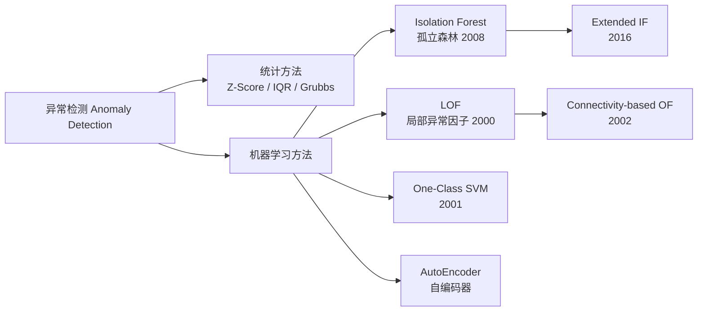

# 孤立森林 / LOF / One-Class SVM

## 知识地图



## 前置知识

- **异常的定义**：异常不是绝对的，取决于上下文。全局异常（远离所有正常数据）、局部异常（在全局看起来正常，但在局部邻域中异常）、集体异常（一组点在集体行为和整体模式上异常）。
- **决策树与集成学习**：孤立森林本质上是对随机森林思想的"逆向应用"——随机森林目标是寻找数据的"结构"（分类/回归），而孤立森林寻找的是"没有结构"的点。
- **K 近邻 (KNN)**：LOF 的核心是基于 K 近邻的局部密度估计，理解邻居数量 k 的选择对局部性的影响。
- **SVM 原理**：One-Class SVM 是 SVM 在无监督异常检测中的延伸，需要理解核技巧和软间隔的概念。
- **维度的诅咒**：理解高维空间中距离度量的退化和基于距离/密度的异常检测方法的局限性。

## 为什么会出现 (Why)

传统的异常检测方法（如 Z-Score、基于正态分布假设的方法）要求数据服从特定分布，且只能检测全局异常。但在实践中：(1) 数据分布未知且复杂；(2) 数据中存在"局部异常"——某些点在全局范围内看起来正常（比如住在富人区的低收入者），但在其局部邻域中却是异常的；(3) 异常点占比极小（通常 < 1%），正常数据建模容易，异常数据建模困难。这三个问题催生了三种不同思路的现代异常检测算法。

## 解决什么问题 (Problem)

- **Isolation Forest**：解决"快速检测大规模高维数据中的异常点"问题——不需要对正常数据建模，只需找出"容易被孤立的点"。
- **LOF**：解决"检测局部邻居密度差异导致的异常"问题——不是用全局阈值，而是和"附近的人"比。
- **One-Class SVM**：解决"只有正常样本（或正样本极少）时如何划定决策边界"问题——在特征空间中找到一个包围正常数据的边界。

## 核心思想 (Core Idea)

- **孤立森林**："异常点少且不同"——它们更容易被随机划分"孤立"出来，在一棵随机构建的二叉树中，异常点的路径长度（从根到叶）远短于正常点。
- **LOF**："和你周围的人比比"——如果一个点的局部密度明显低于其邻居的局部密度，则该点可疑。
- **One-Class SVM**："画一个圈把正常数据包起来"——在特征空间中寻找一个超球面或超平面，将绝大多数正常数据与原点/外部隔开。

---

## 孤立森林 (Isolation Forest)

### 算法原理

1. 随机选取一个特征和一个分割值
2. 递归划分直到每个点被隔离或达到深度限制
3. 点的**路径长度**越短，越可能是异常

> **通俗解释：** 想象你有 100 个人中混入 1 个外星人。如果让你设计"二分问题"来快速隔离这个外星人（如"身高大于 170 吗？""体重大于 60kg 吗？"），你会发现普通地球人需要很多问题才能相互区分，但外星人往往几个问题就被"孤立"出来了——因为它的特征值和地球人都不一样。孤立森林就是利用这个直觉：随机构造二分树，异常点的隔离路径极短。

### 异常分数的数学模型

异常分数（归一化）：

$$s(x, n) = 2^{-\frac{E[h(x)]}{c(n)}}$$

其中 $c(n) = 2H(n-1) - 2(n-1)/n$ 是二叉搜索树的平均路径长度，$H(\cdot)$ 是调和数。

- $s \approx 1$：异常
- $s \approx 0.5$：正常
- $s \ll 0.5$：太"正常"（可能）

> **通俗解释 --- $c(n)$：** $c(n)$ 是随机构建的二叉搜索树中，搜索成功时的"平均查找长度"。它的作用就像一把尺子——把实际路径长度 $E[h(x)]$ 除以这把尺子，就能消除样本量 $n$ 的影响。$c(n) \approx 2\ln(n-1) + 0.577$（欧拉常数）。

> **通俗解释 --- $s(x, n)$：** 路径越短，$s$ 越接近 1（异常）；路径越接近平均长度 $c(n)$，$s$ 越接近 0.5（正常）；路径极长，$s$ 接近 0（过于正常，可能是"正常的核心点"）。这个指数衰减公式的核心设计意图：让异常的分数"快速地"收敛到 1。

### 关键优势

- 不需要正常数据建模（无需假设数据分布）
- 线性时间复杂度 $O(n)$（仅对部分特征做随机分裂）
- 对高维数据的子采样有效（通过只选取少量特征来对抗维度灾难）

---

## 局部异常因子 (LOF)

### 核心思想

LOF 基于**局部密度**：如果一个点的密度明显低于其邻居的密度，则为异常。这使其能检测**局部异常**（在全局看来正常但在局部邻域中异常）。

> **通俗解释：** 在一个中产社区中，一个年收入 3 万美元的家庭可能是局部异常（邻居都是 8 万美元），但在全市范围内这个收入很正常。传统方法（如 Z-Score）看不到这个异常，因为它的比较对象是"全市所有人"；LOF 能看到，因为它的比较对象只是"周围的邻居"。

### 计算方法

对点 $p$，设其 $k$-距离邻域为 $N_k(p)$：

**局部可达密度**：

$$\text{lrd}_k(p) = \frac{|N_k(p)|}{\sum_{o \in N_k(p)} \text{reach-dist}_k(p, o)}$$

**局部异常因子**：

$$\text{LOF}_k(p) = \frac{\sum_{o \in N_k(p)} \frac{\text{lrd}_k(o)}{\text{lrd}_k(p)}}{|N_k(p)|}$$

> **通俗解释 --- lrd（局部可达密度）：** 分子是邻居数量，分母是到所有邻居的可达距离之和。如果分母很大（邻居很远 = 密度低），lrd 就很小——说明这个区域是"稀疏"的。

> **通俗解释 --- LOF：** 就是"我邻居的平均密度"除以"我的密度"。如果邻居密度都比我高，LOF > 1，我可能异常。如果我和邻居密度差不多，LOF 约等于 1，我正常。
> - LOF $\approx 1$：密度与邻居相当，正常
> - LOF $> 1$：密度低于邻居，可能异常

---

## One-Class SVM

### 核心思想

One-Class SVM 在特征空间中找到一个超平面（或超球面）将数据与原点（或外部）最大程度地分开。

$$\min_{\mathbf{w}, \rho, \xi} \frac{1}{2}\|\mathbf{w}\|^2 + \frac{1}{\nu n}\sum_i \xi_i - \rho$$

其中 $\nu \in (0, 1]$ 是异常比例的上界。

> **通俗解释：** 想象在空间中找一条"圈"，把绝大部分正常数据圈在里面。参数 $\nu$ 控制"允许多少数据落在圈外"——$\nu = 0.1$ 表示最多允许 10% 的点在圈外（异常）。如果数据本身不是线性可分的（圈内的数据不是球状的），可以通过 RBF 核将数据先映射到高维空间，在那里再画圈。

---

## 算法流程图 (孤立森林)

```mermaid
graph TD
    Start[🎯 开始: 输入数据集 X<br/>设定树的数量 t 和子采样大小 ψ] --> Sub[📦 对每棵树独立:<br/>随机抽取 ψ 个样本]
    Sub --> BuildTree[🌳 递归构建隔离树 iTree]
    BuildTree --> Split{当前节点满足<br/>终止条件?<br/>高度限制 or 只剩1个样本}
    Split -->|否| RandSplit[🎲 随机选一个特征<br/>随机选一个分割值]
    RandSplit --> Partition[📊 按分割值将数据<br/>分成左右两部分]
    Partition --> BuildTree
    Split -->|是| Leaf[🍃 创建叶节点]
    Leaf --> Score[📐 计算异常分数:<br/>s = 2^(-E(h(x))/c(n))]
    Score --> Rank[📊 按 s 降序排列<br/>s 越接近 1 越异常]
    Rank --> End[✅ 输出: 异常分数排序]
```

---

## 最小可运行代码

```python
from sklearn.ensemble import IsolationForest
from sklearn.neighbors import LocalOutlierFactor
from sklearn.svm import OneClassSVM

# 孤立森林
iso = IsolationForest(contamination=0.1)
iso.fit(X)

# LOF
lof = LocalOutlierFactor(n_neighbors=20, contamination=0.1)
labels = lof.fit_predict(X)

# One-Class SVM
svm = OneClassSVM(nu=0.1, kernel='rbf', gamma='auto')
svm.fit(X)
```

---

## 工业界应用

| 场景 | 说明 | 推荐方法 |
|------|------|----------|
| **金融欺诈检测** | 信用卡欺诈、保险骗保、反洗钱 | 孤立森林（速度快）+ LOF（局部欺诈） |
| **网络安全** | 入侵检测、DDoS 攻击识别、异常流量 | 孤立森林（在线实时检测） |
| **工业设备监控** | 传感器异常、设备故障预警 | 孤立森林（处理多传感器数据） |
| **电商异常行为** | 刷单检测、虚假评论、薅羊毛 | LOF + 孤立森林（结合行为特征） |
| **医疗异常检测** | 异常病历、罕见病识别、药费异常 | LOF（局部异常更适合） |

---

## 对比表格

| 方法 | 适用场景 | 核心思路 | 速度 | 高维适用性 | 局部异常 |
|------|----------|----------|------|-----------|----------|
| **Isolation Forest** | 大规模数据、高维、实时检测 | 随机划分孤立法 | 极快 $O(n)$ | 好（子采样特征空间） | 一般 |
| **LOF** | 局部异常、需要解释性 | 邻居密度比较 | 中等 $O(n^2)$ | 差（距离度量退化） | 极好 |
| **One-Class SVM** | 小样本、核方法 | 超球面包围正常数据 | 慢 | 一般（依赖核选择） | 差 |
| **AutoEncoder** | 高维非结构化数据（图像/音频） | 重构误差 | 慢（需 GPU） | 极好（神经网络天然降维） | 一般 |

---

## 对比 (三种方法)

| 方法 | 适用场景 | 速度 |
|------|----------|------|
| Isolation Forest | 大规模数据，高维 | 极快 |
| LOF | 局部异常检测 | 中等 |
| One-Class SVM | 小样本，核方法 | 慢 |

---

## 学完后建议继续学习

1. **Extended Isolation Forest (EIF)**——解决原始孤立森林的分割面总是平行于坐标轴的问题，用随机超平面分割，更准确地检测多维空间的异常。
2. **AutoEncoder 异常检测**——用神经网络的重构误差做异常检测，适合高维非结构化数据（图像、时序）。
3. **PyOD 工具库**——一个集成了 30+ 种异常检测算法的 Python 库，支持统一 API 和模型组合。
4. **时序异常检测**——LSTM-AD、Prophet + 残差分析、STL 分解等方法，针对时间序列的特殊性（趋势、季节性）。
5. **异常检测的评估指标**——在没有标签的情况下如何评估异常检测模型（如基于聚类假设的指标、基于稳定性的方法）。

---

## 高频面试题

### Q1: 孤立森林为什么能检测异常？它的时间复杂度为什么是线性的？

**标准答案：** 孤立森林基于一个关键直觉：**异常点"少且不同"**——在随机构建的二分树中，异常点的隔离路径长度远短于正常点。正常的点往往和周围点很相似，需要很多次随机划分才能被隔离开；异常点特征值与众不同，往往在最开始的几次划分中就被单独分到了叶节点。时间复杂度为线性的原因：(1) 不需要计算所有样本对的距离（避免 $O(n^2)$）；(2) 每棵树只用随机抽取的 $\psi$ 个样本（$\psi$ 通常设为 256，大幅减少计算量）；(3) 每次分裂只随机选一个特征和随机分割值，代价为 $O(1)$。

### Q2: LOF 的"局部异常"是什么意思？和全局异常检测有什么区别？

**标准答案：** 局部异常是指：**一个点的异常性是相对于其局部邻域而言的，而非相对于整个数据集**。例如，一个年收入 5 万美元的人居住在一个中产社区（邻居平均 7 万美元），他在这个局部社区中可能是异常值（密度低于邻居），但在全市范围内（全市平均 4 万美元）则完全正常。传统的全局异常检测方法（如 Z-Score、基于距离的方法）会漏掉这类异常，因为它们使用全局阈值。LOF 通过比较点 $p$ 的局部可达密度和其邻居的局部可达密度来判断局部异常程度——如果 $p$ 的密度明显低于邻居，则 LOF > 1，视为局部异常。

### Q3: One-Class SVM 中的参数 $\nu$ 是什么意思？

**标准答案：** $\nu \in (0, 1]$ 有两个含义：(1) 它是异常样本比例的上界——模型允许的训练集中被判定为"异常"的样本比例最多为 $\nu$；(2) 它是支持向量的比例下界——最终模型中至少有 $\nu$ 比例的训练样本成为支持向量。在实践中，$\nu$ 通常设置为期望的异常比例（如 0.01 代表 1%），它可以视为对异常比例的先验知识。如果不知道异常比例，可以通过交叉验证来调参。

### Q4: 孤立森林和随机森林有什么关系？

**标准答案：** 两者的构建过程非常相似——都是通过训练多棵随机二分树来做集成预测，但目标和解释完全相反：
- **随机森林**：目标是找到数据的"结构"（分类边界或回归趋势）。正常点需要被准确分类/预测，异常点会影响模型质量。
- **孤立森林**：目标是找到"没有结构"的点（异常）。异常点的隔离路径短，正常点的长。异常分数的公式 $s(x) = 2^{-E[h(x)]/c(n)}$ 是专门设计的，使得路径越短分数越接近 1（异常）。可以理解为：孤立森林利用的是"随机森林难以泛化的点就是异常点"这一反向直觉。

### Q5: 在没有标签的情况下，如何评估异常检测模型的好坏？

**标准答案：** 在纯无监督场景下（无标签），评估非常困难，但有几种方法：
1. **可视化分布检查**：画出异常分数的直方图——正常情况下应该看到大部分点分数集中在低分区域，少数点分数明显较高（双峰分布）。
2. **已知正常数据的验证**：如果有少量确认正常的样本，可以在其上计算的平均异常分数应明显低于全量数据的平均异常分数。
3. **注入合成异常**：在原始数据中随机注入一些极端异常点（如随机噪声点），检查模型能否将它们排到异常分数前列。
4. **稳定性分析**：对数据做多次随机子采样后重新训练，检查异常排序的一致性（真正异常的点应该在多次运行中都排名靠前）。
5. 在有少量标签时，使用 Precision@K、Average Precision 等指标评估 top-K 异常排名的质量。
