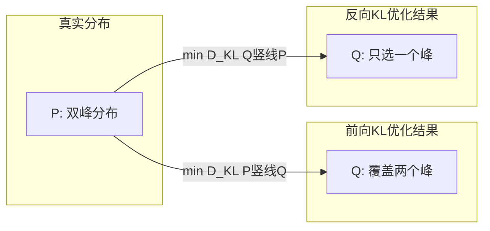

# KL 散度 (Kullback-Leibler Divergence)

## 知识地图

```mermaid
graph LR
  Prob[概率论基础] --> Entropy[信息熵 H]
  Entropy --> CE[交叉熵 H(P,Q)]
  CE --> KL[KL 散度]
  KL --> VAE[VAE 变分自编码器]
  KL --> KD[知识蒸馏]
  KL --> PPO[PPO 策略优化]
  KL --> tSNE[t-SNE 降维]
  KL --> JS[JS 散度]
  JS --> GAN[GAN 判别器]
```

## 前置知识

- [信息熵与交叉熵](cross-entropy.md)：理解 $H(P)$ 和 $H(P,Q)$ 的定义与关系
- 概率论基础：概率分布、期望 $\mathbb{E}[\cdot]$、条件概率
- [对数函数 $\log$ 的性质](https://en.wikipedia.org/wiki/Logarithm)：理解 $\log\frac{P}{Q} = \log P - \log Q$
- [VAE](vae.md)：理解 KL 散度在变分推断中的核心作用

## 为什么会出现 (Why)

在 KL 散度被提出之前，统计学家需要度量两个概率分布之间的差异。常见做法有：
- 比较均值和方差——只捕捉分布的一阶/二阶矩，忽略分布形状
- 使用 $\chi^2$ 检验——只适用于特定分布族
- 直方图可视化比较——主观且无法量化

信息论在 Shannon 1948 年之后蓬勃发展。Kullback 和 Leibler 在 1951 年提出 KL 散度，将"差异度量"与信息论中的熵概念统一起来：两个分布的 KL 散度恰好等于——用分布 $Q$ 来编码实际来自 $P$ 的数据时，平均每个样本多花的比特数。这一解释奠定了 KL 散度在机器学习中的核心地位。

## 解决什么问题 (Problem)

**量化两个概率分布之间的"距离"**：给定真实分布 $P$ 和近似分布 $Q$，KL 散度告诉我们 $Q$ 偏离 $P$ 有多远。核心应用场景包括：
- 监督学习：最小化 $D_{KL}(P_{data} \| P_{model})$ → 等价于最小化交叉熵
- VAE：最小化 $D_{KL}(q(z|x) \| p(z))$ → 让后验逼近先验，实现正则化
- 知识蒸馏：最小化 $D_{KL}(P_{teacher} \| P_{student})$ → 让学生模仿教师

## 核心思想 (Core Idea)

**KL 散度衡量"如果用近似分布 Q 代替真实分布 P，每个数据点多浪费多少比特的信息"——它不是真正的距离（不对称），而是信息论视角下的"编码代价差"。**

---

## 数学模型/公式

### 核心定义

KL 散度衡量一个概率分布 $Q$ 与另一个参考分布 $P$ 之间的差异：

$$D_{KL}(P \| Q) = \sum_x P(x) \log \frac{P(x)}{Q(x)} = \mathbb{E}_{x \sim P} \left[ \log \frac{P(x)}{Q(x)} \right]$$

**通俗解释：** 对于分布 $P$ 中的每个可能值 $x$：(1) 计算 $P(x)$ 和 $Q(x)$ 的比值；(2) 取对数（比值 > 1 时对数 > 0，< 1 时对数 < 0）；(3) 用 $P(x)$ 加权平均。如果 $P$ 和 $Q$ 完全一致，每项 $\log(1)=0$，总和为 0。如果 $Q(x)$ 在 $P$ 很大的地方很小 → $\log(P/Q)$ 很大 → KL 散度很大，惩罚"Q 忽略了 P 的峰值区域"。

### 与非对称性相关的公式

$$D_{KL}(P \| Q) \neq D_{KL}(Q \| P)$$

**通俗解释：** "用 Q 去近似 P"和"用 P 去近似 Q"的代价不同。想象 P 是双峰分布，Q 是单峰分布：(1) 前向 KL $D_{KL}(P \| Q)$——P 的两个峰都有值，Q 只有一个峰，在 P 有值但 Q 很小的地方 $\log(P/Q)$ 很大，会迫使 Q 去覆盖 P 的所有峰（mode-covering）；(2) 反向 KL $D_{KL}(Q \| P)$——Q 只要选中 P 的一个峰就可以避免 $\log(Q/P)$ 很大（因为 P 在那个峰上也有值），Q 会只关注 P 的一个峰（mode-seeking）。

- **前向 KL** $D_{KL}(P \| Q)$：$P$ 大但 $Q$ 小 → 惩罚重（mode-covering）
- **反向 KL** $D_{KL}(Q \| P)$：$Q$ 大但 $P$ 小 → 惩罚重（mode-seeking）

### 非负性

$$D_{KL}(P \| Q) \geq 0$$

**通俗解释：** 用任何分布 $Q$ 来近似 $P$，"信息浪费"永远 $\ge 0$。当且仅当 $P$ 和 $Q$ 完全相同时，浪费为 0。这是 Gibbs 不等式的结论，证明依赖 Jensen 不等式和 $\log$ 的凹性。

当且仅当 $P = Q$ 时取等号（Gibbs 不等式）。

### 与交叉熵的关系

$$D_{KL}(P \| Q) = H(P, Q) - H(P)$$

**通俗解释：** $H(P,Q)$ 是"用 Q 编码 P 的总比特数"，$H(P)$ 是"用 P 编码自身的理论最小比特数"。两者的差就是"用了不完美的编码表 Q 而多花的比特数"——这正是 KL 散度的物理含义。当 $P$ 固定时（如训练集的真实标签），$H(P)$ 是常数，最小化 KL 散度等价于最小化交叉熵。这就是分类任务中交叉熵损失的理论依据。

当 $P$ 固定时（如真实标签），最小化 $D_{KL}(P \| Q)$ 等价于最小化交叉熵 $H(P, Q)$。

### VAE 中的应用

$$\text{ELBO} = \mathbb{E}_{q(z|x)}[\log p(x|z)] - D_{KL}(q(z|x) \| p(z))$$

**通俗解释：** VAE 的损失函数由两部分组成——第一项鼓励解码器准确重建输入（重建损失），第二项（KL 项）鼓励编码器输出的后验分布 $q(z|x)$ 不要偏离标准正态先验 $p(z) \sim \mathcal{N}(0, \mathbf{I})$ 太远。这个 KL 项充当正则化器：防止后验坍塌到一点，保证隐空间有良好的连续性和插值能力。

其中 $p(z) \sim \mathcal{N}(0, \mathbf{I})$。

对两个高斯分布，KL 散度有闭式解：

$$D_{KL}(\mathcal{N}(\mu, \sigma^2) \| \mathcal{N}(0, 1)) = -\frac{1}{2} \sum_j (1 + \log \sigma_j^2 - \mu_j^2 - \sigma_j^2)$$

**通俗解释：** 这个闭式解告诉你：如果后验的均值 $\mu$ 偏离 0，KL 惩罚增大（$\mu_j^2$ 项）；如果后验的方差 $\sigma^2$ 偏离 1，KL 惩罚也增大（$\log \sigma_j^2 - \sigma_j^2$ 项在 $\sigma^2=1$ 处取最小）。所以 VAE 的编码器会自然地输出均值接近 0、方差接近 1 的分布——实现隐空间的规范化。

### 与 Jensen-Shannon 散度的对比

JS 散度是 KL 的对称化版本：

$$\text{JSD}(P \| Q) = \frac{1}{2} D_{KL}(P \| M) + \frac{1}{2} D_{KL}(Q \| M)$$

其中 $M = \frac{P + Q}{2}$。JS 散度是 GAN 中原始判别器的理论基础。

**通俗解释：** JS 散度把"P 和 Q 谁在左边谁在右边"的问题解决了——取两者的平均分布 M 为参考点，分别计算 P 到 M 和 Q 到 M 的 KL 散度，再平均。结果是：$\text{JSD}(P \| Q) = \text{JSD}(Q \| P)$，而且值域在 $[0, \log 2]$，比 KL 更好控制。

---

## 可视化展示

### 前向 KL vs 反向 KL 的行为差异



前向 KL 迫使 Q 覆盖 P 的所有模式（避免 P 大但 Q 小的情况），反向 KL 允许 Q 只选择一个模式深入拟合（避免 Q 大但 P 小的情况）。这在 VAE vs GAN 的设计哲学中有直接体现。

---

## 最小可运行代码

```python
import torch
import torch.nn.functional as F

# 方式 1：使用 PyTorch 内置（注意输入是 log 概率）
kl_div = F.kl_div(
    F.log_softmax(student_logits, dim=-1),
    F.softmax(teacher_logits, dim=-1),
    reduction='batchmean'
)

# 方式 2：手动计算
def kl_divergence(p_logits, q_logits, T=1.0):
    p = F.softmax(p_logits / T, dim=-1)
    q = F.softmax(q_logits / T, dim=-1)
    return (p * (p.log() - q.log())).sum(dim=-1).mean()

# 方式 3：两个高斯分布之间的 KL 散度（VAE 常用）
def kl_gaussian(mu, logvar):
    """
    D_KL( N(mu, sigma^2) || N(0, 1) )
    """
    return -0.5 * torch.sum(1 + logvar - mu.pow(2) - logvar.exp(), dim=-1).mean()
```

---

## 工业界应用

| 应用场景 | 为什么用它 | 优点 | 缺点 |
|----------|-----------|------|------|
| 分类模型训练 | $D_{KL}(P_{data}\|P_{model})$ 等价于交叉熵 | 理论严谨，梯度优化友好 | 当 $P_{model}(x)=0$ 且 $P_{data}(x)>0$ 时 KL → ∞ |
| VAE 隐空间正则化 | 约束后验 $q(z\|x)$ 逼近先验 $p(z)$ | 高斯分布下有闭式解，计算快 | KL 过强会导致后验坍塌（posterior collapse） |
| 知识蒸馏 | 学生分布逼近教师分布，传递"暗知识" | 温度参数灵活控制软硬程度 | 不对称性意味着需要谨慎选择"教师"为参考分布 |
| PPO 策略优化 | 限制新策略偏离旧策略的幅度 | 防止灾难性策略更新 | 需要调阈值参数 clip 范围 |
| t-SNE 降维 | 高维和低维空间相似度分布的 KL 匹配 | 保留局部结构能力出色 | 计算复杂度高，全局结构不保证 |

---

## 优缺点对比

| 优点 | 缺点 |
|------|------|
| 信息论基础坚实——有明确的"编码代价"物理含义 | 不对称：$D_{KL}(P\|Q) \neq D_{KL}(Q\|P)$，不是真正的距离度量 |
| 与交叉熵等价（P 固定时），优化方便 | 当 $Q(x)=0$ 但 $P(x)>0$ 时值为无穷大——对分布支撑集敏感 |
| 高斯分布之间有闭式解，计算高效 | 对非高斯分布无闭式解，需要采样估计（高维时方差大） |
| 非负性保证优化有下界 | 不对称性意味着不同方向的结果有本质不同的行为 |
| 可微，适合梯度下降 | 不满足三角不等式 |

---

## 对比表格

| | KL 散度 | JS 散度 | Wasserstein 距离 | 交叉熵 |
|------|---------|---------|-------------------|--------|
| 对称性 | 否 | 是 | 是 | 否 |
| 值域 | $[0, +\infty)$ | $[0, \log 2]$ | $[0, +\infty)$ | $[H(P), +\infty)$ |
| 三角不等式 | 不满足 | 不满足 | 满足（真距离） | 不满足 |
| 支撑集不交时 | $\infty$ | $\log 2$ | 有限值 | $\infty$ |
| 主要应用 | VAE、知识蒸馏、PPO | 原始 GAN | WGAN、域适应 | 分类损失 |
| 优化难度 | 中等 | 中等（有饱和问题） | 高（需要求解最优传输） | 低 |

---

## 学完后建议继续学习

- [交叉熵](cross-entropy.md)：深入理解 $H(P,Q)$ 与 KL 散度的关系
- [VAE](vae.md)：KL 散度在变分自编码器中的核心角色
- [知识蒸馏](knowledge-distillation.md)：利用 KL 散度传递教师模型的软标签
- [GAN 进阶](gan-advanced.md)：从 JS 散度到 Wasserstein 距离的演进
- [t-SNE / UMAP](tsne-umap.md)：KL 散度在降维可视化中的应用
- [PPO / RLHF](rlhf.md)：KL 散度在强化学习中的策略约束

---

## 高频面试题

**Q1: KL 散度为什么不是真正的"距离"？**

答：因为它不满足距离的三个公理中的两个：(1) 不对称性——$D_{KL}(P\|Q) \neq D_{KL}(Q\|P)$，即"用 Q 近似 P"的代价不等于"用 P 近似 Q"的代价；(2) 不满足三角不等式——$D_{KL}(P\|R) \not\le D_{KL}(P\|Q) + D_{KL}(Q\|R)$。它只满足非负性和自反性（$D_{KL}(P\|Q) = 0 \iff P = Q$ 几乎处处），因此被称为"散度"（divergence）而非"距离"（distance/metric）。

**Q2: 前向 KL 和反向 KL 的行为差异是什么？举例说明。**

答：前向 KL $D_{KL}(P\|Q)$ 是 mode-covering（覆盖模式）：$P$ 有值的位置 $Q$ 必须也有值，否则 $\log(P/Q) \to \infty$，因此 Q 倾向于覆盖 P 的全部模式。反向 KL $D_{KL}(Q\|P)$ 是 mode-seeking（寻找模式）：$Q$ 有值但 $P$ 无值的位置惩罚重（$\log(Q/P) \to \infty$），因此 Q 倾向于集中到 P 的高概率区域，忽略低概率区域。经典例子：VAE 使用反向 KL（后验逼近高斯先验——mode-seeking，可能产生模糊图像），GAN 的判别器隐含使用 JS 散度（介于两者之间）。

**Q3: 为什么分类任务中最小化交叉熵等价于最小化 KL 散度？**

答：$D_{KL}(P\|Q) = H(P,Q) - H(P)$。在分类任务中，$P$ 是训练数据的真实标签分布（固定不变），$H(P)$ 是常数。因此 $\arg\min_Q D_{KL}(P\|Q) = \arg\min_Q H(P,Q)$——最小化 KL 散度等价于最小化交叉熵。两者的最优解完全一致（都是 $Q=P$），只是最小值不同（交叉熵的最小值是 $H(P)$，KL 散度的最小值是 0）。

**Q4: VAE 中的 KL 项起什么作用？如果去掉会怎样？**

答：VAE 损失函数中的 $D_{KL}(q(z|x) \| p(z))$ 是正则化项，约束编码器输出的后验 $q(z|x)$ 不要偏离标准正态先验 $p(z) \sim \mathcal{N}(0, \mathbf{I})$。如果去掉 KL 项，VAE 退化为普通自编码器：编码器会将每个样本映射到隐空间中一个孤立的点（方差 → 0），隐空间失去连续性和可插值能力——在随机采样时无法生成有意义的样本。KL 项强制隐空间保持"光滑性"：相邻样本的隐表示相近，随机采样也能落在有意义的区域。

**Q5: 当 $P$ 和 $Q$ 的支撑集不重叠时，KL 和 JS 散度分别会怎样？**

答：KL 散度：$D_{KL}(P\|Q) \to \infty$（因为存在 $x$ 使得 $P(x)>0$ 但 $Q(x)=0$，$\log(P/Q) \to \infty$）。JS 散度：$\text{JSD}(P\|Q) = \log 2$（当支撑集完全不相交时，$M = (P+Q)/2$ 在 $P$ 的支撑集上等于 $P/2$，在 $Q$ 的支撑集上等于 $Q/2$，代入 JS 公式得出 $\log 2$）。JS 散度的这个"天花板效应"正是原始 GAN 中梯度消失的根源——当判别器完美区分真假样本时，生成器梯度消失。Wasserstein 距离（WGAN）通过提供有意义的梯度解决了这个问题。
