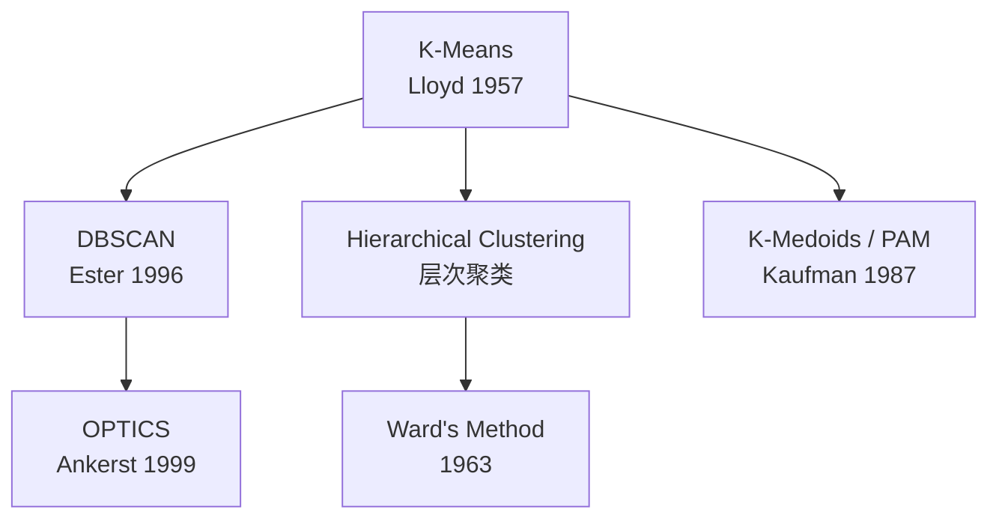
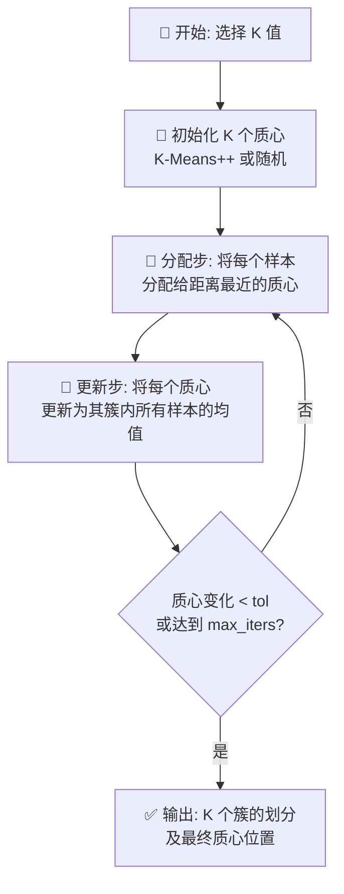

# K-Means / K-Medoids

## 知识地图



## 前置知识

- **欧几里得距离 (Euclidean Distance)**：K-Means 基于 $L_2$ 距离度量相似度。理解不同距离度量（曼哈顿、余弦）对聚类结果的影响。
- **贪心算法 (Greedy Algorithm)**：Lloyd 算法的每次迭代都是在当前分配下做局部最优选择，不能保证全局最优。
- **期望最大化 (EM) 的直觉**：K-Means 可以被视为"硬分配"版本的 Gaussian Mixture Model (GMM)——分配步对应 E 步（计算后验概率），更新步对应 M 步（最大化似然）。
- **凸优化与局部最优**：WCSS 目标函数是非凸的，算法对初始化敏感，理解为什么需要多次运行取最优结果。
- **No Free Lunch 定理**：理解 K 值需要预设这一根本局限性。

## 为什么会出现 (Why)

在数据分析的早期，人们需要一个简单高效的方法将"相似的样本分到一组、不相似的分开"。K-Means 的动机来自信号处理中的**向量量化**——如何用少数几个"代表点"（质心）来近似整个数据集。当你想把客户分群、把像素聚类成少数颜色、把文档分组时，K-Means 是最直觉的选择：找一个"中心"，靠近谁就算谁的。

## 解决什么问题 (Problem)

- **无监督分组**：在没有标签的情况下，将 $n$ 个样本划分到 $K$ 个簇中。
- **向量量化 / 数据压缩**：用 $K$ 个质心代替全部数据点，大幅减少存储和计算开销。
- **探索性数据分析 (EDA)**：在大规模数据集上快速获得数据分布的直觉，为后续分析提供方向。

## 核心思想 (Core Idea)

**最小化簇内距离平方和 (WCSS)**——将每个点分配给"最近的质心"，然后根据分配结果更新质心，反复交替直到收敛，最终得到 $K$ 个球形簇。

---

将 $n$ 个样本划分到 $K$ 个簇，使得簇内样本到簇中心（centroid）的距离平方和最小。

---

## 数学模型/公式

### 目标函数

$$\text{WCSS} = \sum_{k=1}^{K} \sum_{x_i \in C_k} \|x_i - \mu_k\|^2$$

其中 $\mu_k = \frac{1}{|C_k|} \sum_{x_i \in C_k} x_i$ 是簇 $C_k$ 的均值。

> **通俗解释：** WCSS 就是"每个点到它所属簇的质心有多少距离平方，全加起来"。K-Means 的目标就是尽量把这个总和压到最小。注意这里用的是"平方"——这意味着离群点会被放大惩罚（距离为 10 的点对 WCSS 的贡献是距离为 1 的点的 100 倍），这也是 K-Means 对异常值敏感的根本原因。

### Lloyd 算法

1. **初始化**：随机选择 $K$ 个点作为初始质心（或使用 K-Means++）
2. **分配步**：将每个点分配给最近的质心
3. **更新步**：将质心更新为所属点的均值
4. 重复 2-3 直到收敛

收敛性：算法保证每步 WCSS 不增，收敛到局部最优。

> **通俗解释 --- 为什么一定收敛：** 分配步把每个点挪到最近的质心，WCSS 只会降或不变；更新步把质心挪到簇内所有点的均值（均值是 WCSS 在欧氏距离下的最小化点），WCSS 也只会降或不变。WCSS 是非负的，有下界 0，不断下降必然收敛。但收敛到的可能是局部最优而非全局最优——这就是 K-Means++ 存在的意义。

### K-Means++ 初始化

用概率分布改善初始点选择：

$$P(x_i) = \frac{D(x_i)^2}{\sum_{x_j} D(x_j)^2}$$

其中 $D(x_i)$ 是 $x_i$ 到最近已选质心的距离。保证 $O(\log K)$ 近似比。

> **通俗解释：** 不用等概率随机选质心，而是"离已有的质心越远的点，越容易被选为新的质心"。这样做的好处理论上保证结果不会太差（在全局最优的 $O(\log K)$ 倍以内），实践中能大幅降低"运气不好"的概率。简单说：K-Means++ 就是在初始化阶段尽可能把质心"散开"。

### 选择 K 值

#### 肘部法则 (Elbow Method)

画出 WCSS 随 K 的变化曲线，选择"拐点"。

> **通俗解释：** 随着 K 增大，WCSS 一定单调递减（簇越多，每个簇越紧凑），但递减的速率会逐渐变缓。拐点（肘部）是"再增加 K 带来的收益开始明显下降"的地方，代表性价比最高的 K。但实践中很多数据没有明显的"肘部"，需要结合领域知识。

#### 轮廓系数 (Silhouette Score)

$$s(i) = \frac{b(i) - a(i)}{\max(a(i), b(i))}$$

- $a(i)$：样本 $i$ 到同簇其他点的平均距离
- $b(i)$：样本 $i$ 到最近异簇点的平均距离
- 取值范围 $[-1, 1]$，越大越好

> **通俗解释：** $a(i)$ 衡量点 $i$ 和"自己人"有多近（越小越好），$b(i)$ 衡量点 $i$ 和"最近的敌军"有多远（越大越好）。$s(i)$ 接近 1 说明点在簇内很紧、离其他簇很远（理想状态）；$s(i)$ 接近 0 说明点在两簇边界上；$s(i)$ 为负说明这个点可能分错了簇。

---

## 算法流程图



---

## 可视化展示

### K-Means 迭代过程的动态可视化概念

在 K-Means 的迭代过程中：
- **初始状态**：质心（星形）随机分散在数据空间中
- **第 1 次迭代**：每个点被分配到最近的质心，形成第一次簇划分；质心移动到各自簇的中心
- **第 5 次迭代**：簇边界已经基本稳定，质心仍在微调
- **收敛状态**：质心不再移动，簇划分确定

### 非球形数据的 K-Means 失效示意

当数据呈同心圆、月牙形等非球形分布时，K-Means 的基于距离的球状假设会完全失效——它会"切"过正确的簇边界，因为 K-Means 本质上是用 Voronoi 图对空间做"多边形切分"，无法识别弯曲的簇结构。**这是 DBSCAN 出现的核心动机。**

---

## 最小可运行代码

```python
import numpy as np

class KMeans:
    def __init__(self, n_clusters=3, max_iters=100, tol=1e-4):
        self.K = n_clusters
        self.max_iters = max_iters
        self.tol = tol

    def fit(self, X):
        n, d = X.shape
        # K-Means++ 初始化
        centroids = [X[np.random.randint(n)]]
        for _ in range(1, self.K):
            dists = np.min([np.sum((X - c) ** 2, axis=1) for c in centroids], axis=0)
            probs = dists / dists.sum()
            centroids.append(X[np.random.choice(n, p=probs)])
        centroids = np.array(centroids)

        for _ in range(self.max_iters):
            dists = np.array([np.sum((X - c) ** 2, axis=1) for c in centroids]).T
            labels = np.argmin(dists, axis=1)
            new_centroids = np.array([X[labels == k].mean(axis=0) for k in range(self.K)])
            if np.allclose(centroids, new_centroids, atol=self.tol):
                break
            centroids = new_centroids

        self.centroids_, self.labels_ = centroids, labels
```

### Scikit-learn 一行代码版本

```python
from sklearn.cluster import KMeans

kmeans = KMeans(n_clusters=3, init='k-means++', n_init=10, random_state=42)
labels = kmeans.fit_predict(X)
```

---

## K-Medoids (PAM)

用实际数据点作为簇中心（medoid），对异常值更鲁棒：

$$\text{Medoid} = \arg\min_{x \in C_k} \sum_{x_j \in C_k} \|x - x_j\|$$

> **通俗解释：** K-Means 用簇内所有点的"均值"（一个虚拟点）作为中心——如果簇内有异常值，这个均值会被拉偏。K-Medoids 改用簇内一个"真实存在"的点作为中心——选谁当代表能让簇内总的距离最小就选谁。因为必须选实际样本，所以不会被异常值"拉到无人的地方"。

---

## 工业界应用

| 场景 | 说明 | 为什么用 K-Means |
|------|------|------------------|
| **客户分群** | 按消费行为将客户分为高/中/低价值群体 | 快速计算 + 结果直观，适合大规模客户数据 |
| **图像压缩** | 用 K 种颜色代替原图的数百万颜色（颜色量化） | 质心就是"最代表性的颜色" |
| **文档聚类** | 按 TF-IDF 向量将新闻或文档分组 | 简单高效，适合大规模语料 |
| **异常检测** | 通过到最近质心的距离判断异常 | 远离所有质心的点可能是异常 |
| **初始化深度学习** | 用 K-Means 初始化 RBF 网络的中心 | 比随机初始化更快收敛 |

---

## 对比表格

### K-Means vs DBSCAN vs Hierarchical Clustering

| 维度 | K-Means | DBSCAN | Hierarchical |
|------|---------|--------|--------------|
| **簇形状** | 仅球形 | 任意形状 | 取决于 Linkage |
| **是否需要预设 K** | 是 | 否（需 eps + MinPts） | 否（可从树状图后切） |
| **噪声处理** | 强制分配（每个点都有簇） | 自动标记为噪声 | 取决于后切策略 |
| **时间复杂度** | $O(nKd \cdot t)$，接近线性 | $O(n \log n)$（KD 树） | $O(n^2 \log n) \sim O(n^3)$ |
| **可扩展性** | 极好（百万级） | 中等 | 差（最多数千样本） |
| **对初始值的敏感度** | 高（K-Means++ 缓解） | 低（确定性算法） | 低（确定性算法） |
| **高维数据** | 一般（距离度量退化） | 差（稀疏性导致密度失效） | 一般 |

---

## 优缺点

- **优点**：简单高效，$O(nKd)$ 每轮，可扩展性好
- **缺点**：需预设 K，对初始值敏感，不适合非球形簇，受异常值影响大

---

## 学完后建议继续学习

1. **GMM (Gaussian Mixture Model)**——K-Means 的"软分配"升级版：每个点以概率属于多个簇，簇的形状是椭球形而非纯球形
2. **DBSCAN / OPTICS**——基于密度的聚类，不要求预设 K，能发现任意形状的簇并自动识别噪声
3. **层次聚类 (Hierarchical Clustering)**——通过树状图理解数据的嵌套分组结构
4. **聚类评估指标**——除了轮廓系数，还有 Davies-Bouldin 指数、Calinski-Harabasz 指数、Gap Statistics
5. **K-Means 的分布式实现**——Mini-Batch K-Means（适合超大数据）和 Spark MLlib 中的实现

---

## 高频面试题

### Q1: K-Means 收敛到全局最优吗？如果不是，如何应对？

**标准答案：** K-Means 不能保证收敛到全局最优，因为 WCSS 目标函数是非凸的——不同的初始质心会导致不同的局部最优解。解决方案有三种：(1) 使用 K-Means++ 初始化，理论上保证 $O(\log K)$ 的近似比；(2) 多次运行（`n_init=10`），从不同的随机初始值出发，选择 WCSS 最小的一次结果；(3) 结合领域知识设置合理的初始质心（如已知某几类客户的特征，可以手动设定质心起始位置）。

### Q2: 如何选择 K 值？

**标准答案：** 没有唯一的"最佳 K"，需要综合多种方法：(1) **肘部法则**：观察 WCSS-K 曲线的拐点；(2) **轮廓系数**：选择平均轮廓系数最大的 K；(3) **Gap Statistics**：比较真实数据的 WCSS 和随机均匀分布数据的 WCSS 的差距，选差异最大处的 K；(4) **领域知识**：如果业务要求分 3 类（如高/中/低价值客户），K=3 就是最优的。实践中通常先通过业务需求确定大致范围，再用技术指标细化。

### Q3: K-Means 对异常值敏感的根本原因是什么？K-Medoids 如何解决？

**标准答案：** K-Means 的质心是簇内所有点的**算术均值**，而均值对异常值高度敏感——一个极端的异常点就可以显著拉偏质心位置（想象一个班的平均身高被一个 2.5 米的人拉高）。此外，WCSS 用的是**平方距离**，距离为 10 的异常点对目标函数的贡献是正常距离为 1 的点的 100 倍，算法会"不惜代价"地移动质心去迁就它。K-Medoids 的解决方案：用簇内一个**真实存在**的数据点（medoid）代替虚拟的均值作为中心。因为 medoid 必须是实际样本，不会被异常值"拉到无人地带"。

### Q4: K-Means 和 GMM 的核心区别是什么？

**标准答案：**
- **分配方式**：K-Means 是"硬分配"（每个点严格属于一个簇）；GMM 是"软分配"（每个点以概率形式属于多个簇）。
- **簇形状**：K-Means 假设簇是球形的（等方差 + 各向同性）；GMM 允许每个簇有各自的椭圆形状（通过协方差矩阵控制）。
- **理论基础**：K-Means 基于距离最小化；GMM 基于概率生成模型（数据由 K 个高斯分布的混合体生成）。
- **边界样本**：K-Means 对边界样本一刀切；GMM 给边界样本赋一个"不确定度"（不同簇的概率接近相等）。
- 实际上，当各簇的协方差矩阵都设为 $\sigma^2 I$ 且方差趋于无穷小时，GMM 退化为 K-Means。
