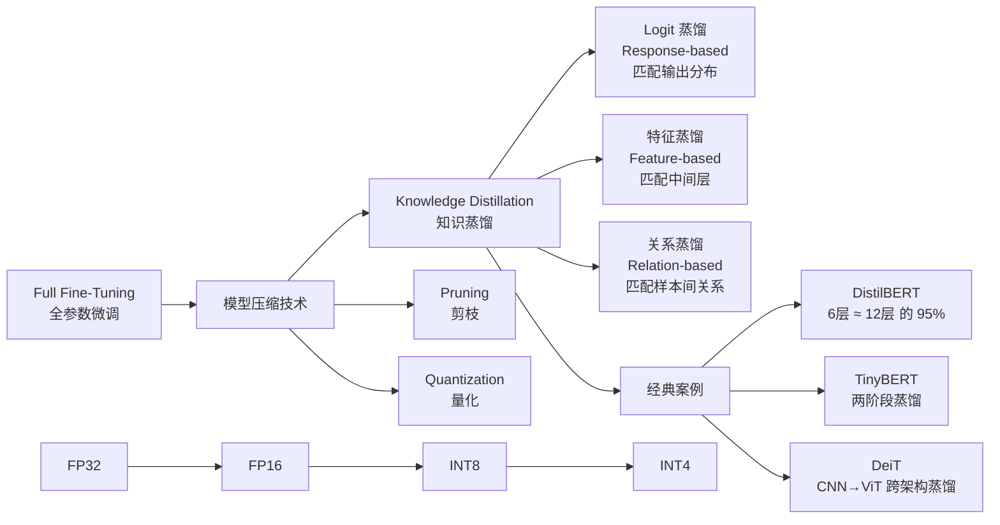
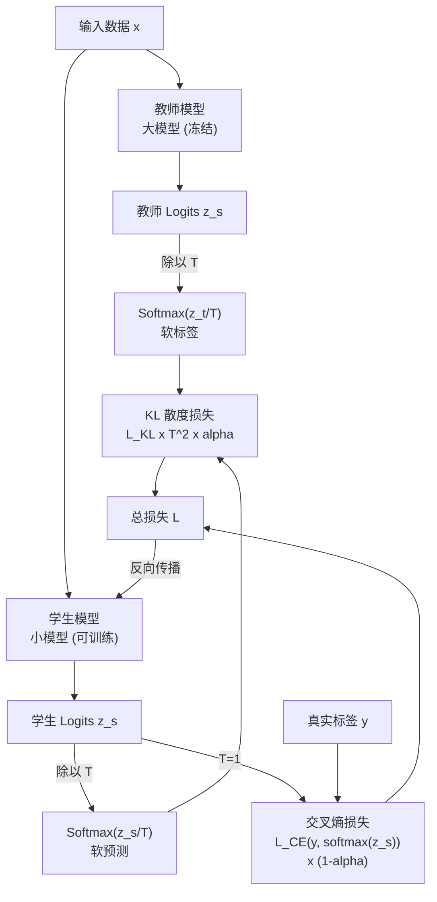
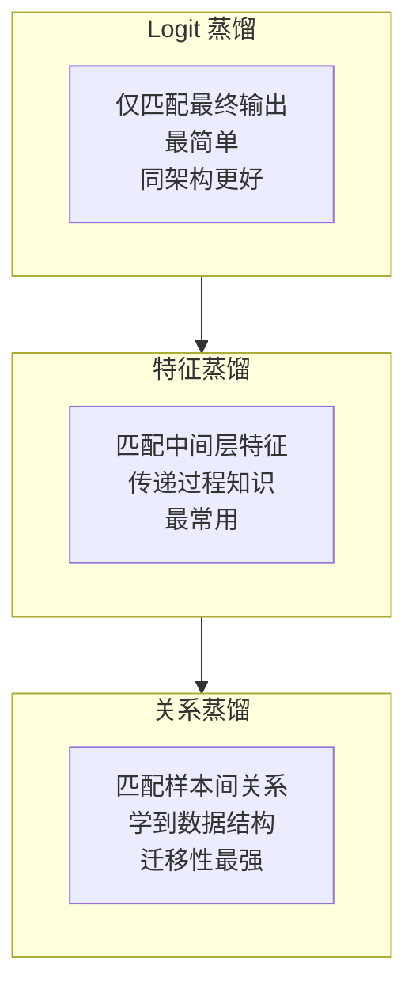

# 知识蒸馏 (Knowledge Distillation)

## 知识地图



## 前置知识

- **Softmax 与温度**：理解 $\text{softmax}(z/T)$ 中温度 $T$ 如何软化概率分布。
- **KL 散度 (Kullback-Leibler Divergence)**：衡量两个概率分布差异的指标。$D_{KL}(P\|Q) = \sum P(i) \log \frac{P(i)}{Q(i)}$，非对称。
- **交叉熵损失 (Cross-Entropy Loss)**：$L_{CE} = -\sum y_i \log \hat{y}_i$，分类任务的标准损失。
- **模型架构对比**：理解 Teacher（大模型）和 Student（小模型）的架构可以不同（如 CNN 做 Teacher、ViT 做 Student）。

## 为什么会出现 (Why)

大模型 (Teacher) 虽然效果好，但推理成本高、部署困难。知识蒸馏的核心动机：

- **BERT-base (110M 参数)** 推理延迟约 20ms/样本，在实时场景中不可接受。DistilBERT (66M) 将延迟降至 12ms（60% 提升），保留 95% 效果。
- **GPT-3 (175B)** 推理需要多张 GPU，通过蒸馏可在 7B 模型上获得大部分能力。
- **大模型中的"暗知识"**：大模型不仅知道"正确答案是什么"，还知道"错误答案之间的相对关系"——这只存在于大模型的输出概率分布中，one-hot 标签完全丢失。例如模型判断一张图是"汽车"（90%），但"卡车"也有 8% 概率——说明"汽车"和"卡车"很相似。这种类间关系就是"暗知识"。

## 解决什么问题 (Problem)

1. **模型压缩**：从大模型（Teacher）中提取知识，训练小模型（Student），使小模型获得接近大模型的效果
2. **推理加速**：Student 模型体积小、速度快，适合部署
3. **数据效率**：蒸馏可以用未标注数据（大模型提供软标签），提升数据利用效率
4. **跨架构迁移**：可以在不同架构间传递知识（CNN → ViT，Transformer → RNN）

## 核心思想 (Core Idea)

**用一个大型的、性能好的教师模型 (Teacher) 指导一个小型的学生模型 (Student) 学习。学生不仅学习真实标签（硬标签），还学习教师输出的概率分布（软标签）。软标签中蕴含了"暗知识"——类别间的相似性、错误答案的相对合理性等 one-hot 标签无法提供的信息。**

---

## 数学模型/公式

### 蒸馏损失函数

完整蒸馏损失由两部分组成：

$$L = (1 - \alpha) \cdot L_{CE}(y, \sigma(z_s)) + \alpha \cdot T^2 \cdot L_{KL}\left(\sigma\left(\frac{z_t}{T}\right), \sigma\left(\frac{z_s}{T}\right)\right)$$

其中：
- $L_{CE}$：学生预测与真实标签（硬标签）的交叉熵
- $L_{KL}$：学生与教师软标签的 KL 散度
- $z_s, z_t$：学生和教师的 logits（softmax 前的输出）
- $\sigma$：Softmax 函数
- $T$：温度参数（软化概率分布）
- $\alpha$：两个损失的平衡权重（通常 $\alpha = 0.5 \sim 0.9$）

**通俗解释：** 学生同时看两份"答案"：一份是标准答案（硬标签 one-hot——只有正确答案是 1，其他都是 0），一份是老师的答案（软标签——老师给每个选项都打了概率分）。两份答案加权组合。老师不仅说"这是汽车"，还说"这可能也是卡车（8%），但绝对不是背景（0.001%）"——这些"错误的理由"对学生帮助巨大。

### 温度的作用

**温度 Softmax：**

$$\text{softmax}(z / T)_i = \frac{e^{z_i / T}}{\sum_j e^{z_j / T}}$$

- $T = 1$：标准 Softmax（原始概率分布）
- $T > 1$：**软化分布**——压平峰值，让非目标类的概率"浮出水面"，露出暗知识
- $T \to \infty$：趋近均匀分布
- $T \to 0$：趋近 one-hot

**通俗解释：** 温度就像"放大镜的倍率"：$T=1$ 时是正常视力，只看到最高峰（正确答案）。$T=5$ 时是广角镜头，山峰被压平了，之前看不见的小山坡（非目标类的概率）都露出来了。$T=0.1$ 时是显微镜，只盯着最高峰，其他什么都看不见。蒸馏时用 $T > 1$ 揭示暗知识，推理时用 $T=1$ 做决策。

**通俗解释（$T^2$ 因子）：** 当温度升高 $T$ 倍时，softmax 的梯度会缩小约 $1/T^2$。乘以 $T^2$ 确保两个损失项的量级可比，优化不容易偏向某一边。

### 暗知识 (Dark Knowledge)

**通俗解释（经典例子）：** 分类"汽车"的图片时：
- **硬标签**（one-hot）：汽车 = 1，其他 = 0。只告诉学生"这是汽车"，不告诉"这不是什么"。
- **教师软标签**（$T=5$）：汽车 = 0.7，卡车 = 0.2，SUV = 0.08，猫 = 0.0001，背景 = 0.00001

软标签传递了三层信息：
1. 卡车比 SUV 更像汽车（类别相似性——"暗知识"的核心）
2. 猫虽然是错的，但比背景更"合理"（因为都是有物体的）
3. 背景几乎是完全错误的方向

这种"错误答案之间的排序"就是暗知识——学生不仅学到"什么是汽车"，还学到"什么和汽车最像"。

---

### 蒸馏类型

#### Logit 蒸馏 (Response-based) — 最简单

仅匹配教师和学生最终输出的概率分布（上面公式）。

**通俗解释：** 只拷问"最终答案"。学生看到老师的最终答题卡——只关注结果，不关注解题过程。简单但有效，适用于同架构蒸馏。

#### 特征蒸馏 (Feature-based) — 最常用

匹配中间层的特征图，而不仅是最终输出：

$$L_{feat} = \|F_t - \phi(F_s)\|^2$$

其中 $\phi$ 是一个适配层（因为学生对教师的特征维度可能不同，需要对齐）。

**通俗解释：** 不只抄最终答案，还学"解题步骤"。老师把每道题的草稿纸（中间层特征）也给学生看，学生模仿老师的思考过程。特征蒸馏通常比纯 Logit 蒸馏效果好——因为传递了过程知识。

#### 关系蒸馏 (Relation-based) — 最精细

匹配样本间的关系（而非单个样本的表示）：

$$L_{rel} = \left\| \psi(F_t^i, F_t^j) - \psi(F_s^i, F_s^j) \right\|^2$$

$\psi$ 可以是距离、角度、相似度或其他关系度量。

**通俗解释：** 不学"单个题怎么解"，而是学"不同题之间的关系"。老师说："这辆车和那辆车很像（特征空间中的距离近），但和这张动物图片完全不同（距离远）。"学生学到了数据空间中的相对结构——更加本质和迁移性强的知识。

---

## 可视化展示

### 知识蒸馏流程



### 蒸馏类型对比



### 经典案例

#### DistilBERT

- **Student**：6 层 Transformer（BERT-base 的一半）
- **Teacher**：BERT-base (12 层)
- **蒸馏策略**：
  - 初始化：Student 直接用 Teacher 的偶数层权重初始化（而非随机初始化）
  - 损失：MLM loss + KL divergence (logits) + Cosine Embedding Loss (hidden states)
- **效果**：保留 BERT 效果的 95%，速度提升 60%，参数量减少 40%

**通俗解释：** DistilBERT 的聪明之处是"初始化"——学生不是从零开始，而是直接取老师的一半层作为起点。这比随机初始化好得多——就像徒弟继承了师傅一半的功力再修炼，而不是从零练武。

#### TinyBERT

- **两阶段蒸馏**：
  1. **通用蒸馏（预训练阶段）**：在大规模语料上蒸馏 BERT，获得通用语言能力
  2. **任务蒸馏（微调阶段）**：在具体下游任务上蒸馏微调后的 BERT
- **多粒度蒸馏**：同时蒸馏 Embedding、Attention 矩阵、Hidden States 和 Logits

**通俗解释：** TinyBERT 是最"彻底"的蒸馏——不只是抄最终答案，连嵌入层、注意力矩阵、隐藏状态、预测概率全都要学。两阶段设计确保学生既有通用语言知识（阶段 1），又有任务特定能力（阶段 2）。

#### DeiT (Data-efficient Image Transformers)

- **Student**：ViT (Vision Transformer)
- **Teacher**：CNN (RegNet)
- **关键创新**：用 CNN 教师蒸馏训练 ViT，**大幅减少 ViT 对数据的需求**（ViT 通常需要 300M 张图片训练，DeiT 只用 1.2M 张 ImageNet 图片）
- **跨架构蒸馏**：Teacher 和 Student 是不同架构（CNN vs Transformer）

**通俗解释：** DeiT 证明蒸馏可以跨架构。CNN 老师把"如何看图像"的知识（通过 logits 传递）教给了 ViT 学生，学生虽然内部结构完全不同（没有卷积，只有 Attention），但通过模仿输出学会了"图像理解"。这就像钢琴老师（CNN）教吉他学生（ViT）——乐器不同，但音乐理论可以传递。

---

## 最小可运行代码

```python
import torch
import torch.nn as nn
import torch.nn.functional as F

class DistillationLoss(nn.Module):
    """标准知识蒸馏损失"""
    def __init__(self, temperature=4.0, alpha=0.7):
        super().__init__()
        self.temperature = temperature
        self.alpha = alpha

    def forward(self, student_logits, teacher_logits, labels):
        # 1. 硬标签损失 (学生 vs 真实标签)
        hard_loss = F.cross_entropy(student_logits, labels)

        # 2. 软标签损失 (学生 vs 教师)
        soft_student = F.log_softmax(student_logits / self.temperature, dim=1)
        soft_teacher = F.softmax(teacher_logits / self.temperature, dim=1)
        soft_loss = F.kl_div(soft_student, soft_teacher, reduction='batchmean')

        # 3. 加权组合 (注意 T^2 因子)
        total_loss = (1 - self.alpha) * hard_loss + \
                     self.alpha * (self.temperature ** 2) * soft_loss

        return total_loss


# ===== 使用示例 =====
teacher = torch.hub.load('pytorch/vision', 'resnet50', pretrained=True)
student = torch.hub.load('pytorch/vision', 'resnet18', pretrained=False)

teacher.eval()  # 冻结教师
distill_loss_fn = DistillationLoss(temperature=4.0, alpha=0.7)

optimizer = torch.optim.Adam(student.parameters(), lr=1e-4)

for images, labels in dataloader:
    with torch.no_grad():
        teacher_logits = teacher(images)

    student_logits = student(images)
    loss = distill_loss_fn(student_logits, teacher_logits, labels)

    optimizer.zero_grad()
    loss.backward()
    optimizer.step()
```

---

## 工业界应用

| 公司/组织 | 技术 | Teacher → Student | 场景 |
|-----------|------|-------------------|------|
| Hugging Face | DistilBERT | BERT-base (12层) → 6层 | 推理加速 |
| Google | 蒸馏 | T5-11B → T5-small | 多语言部署 |
| 华为 | TinyBERT | BERT-base → 4层 | 端侧 NLU |
| Facebook/Meta | DeiT | RegNet (CNN) → ViT | 数据高效训练 |
| OpenAI | 蒸馏 (推测) | GPT-4 → GPT-4o-mini | 降本增效 |
| 各 AI SaaS 公司 | 蒸馏 | 大模型 → 小模型 | 多租户成本优化 |
| Apple | 蒸馏 + 量化 | 云端模型 → CoreML | 端侧隐私推理 |

---

## 对比表格

### 三种蒸馏类型对比

| 维度 | Logit 蒸馏 | 特征蒸馏 | 关系蒸馏 |
|------|-----------|---------|----------|
| 匹配目标 | 最终输出概率 | 中间层特征图 | 样本间关系 |
| 知识粒度 | 粗 | 中 | 细 |
| 实现复杂度 | 低 | 中等（需要适配层对齐维度） | 高（需要设计关系度量） |
| 适用场景 | 同架构蒸馏 | 通用（最常用） | 跨任务迁移 |
| 性能提升 | 中等 | 较大 | 最大（但工程复杂） |
| 是否需要适配层 | 否 | 是（$\phi$ 对齐维度） | 取决于 $\psi$ 设计 |

### DistilBERT vs TinyBERT vs DeiT

| 维度 | DistilBERT | TinyBERT | DeiT |
|------|-----------|----------|------|
| Teacher | BERT-base (110M) | BERT-base (110M) | RegNet (CNN) |
| Student | 6 层 Transformer (66M) | 4 层 Transformer (14.5M) | ViT |
| 架构是否相同 | 是 | 是 | 否（CNN → ViT） |
| 蒸馏策略 | Logit + Hidden + Init | 两阶段 + 多粒度 | Logit (hard label + soft) |
| 压缩比 | 40% 参数减少 | 87% 参数减少 | N/A（跨架构） |
| 效果保持 | 95% | 96% (GLUE) | 超过从头训练的 ViT |
| 最大创新 | 用 Teacher 层初始化 | 两阶段蒸馏 | 数据高效的 ViT 训练 |

---

## 学完后建议继续学习

1. **在线蒸馏 (Online Distillation)**：Teacher 和 Student 同时训练，相互学习。
2. **自蒸馏 (Self-Distillation)**：模型自己的深层指导浅层（无需单独 Teacher），参见 distillation-advanced.md。
3. **多教师蒸馏**：从多个 Teacher 模型聚合知识，获得更强的 Student。
4. **数据无关蒸馏 (Data-Free Distillation)**：不依赖原始训练数据，仅用 Teacher 生成合成数据。
5. **LLM 蒸馏**：GPT-4 等大模型蒸馏到小模型的具体技术（如 Orca, Alpaca 等方法）。

---

## 高频面试题

### Q1: 知识蒸馏中温度 $T$ 的作用是什么？如何选择 $T$？

**标准答案：**

温度 $T$ 控制 softmax 输出的"软硬程度"：

$$\text{softmax}(z/T)_i = \frac{e^{z_i/T}}{\sum_j e^{z_j/T}}$$

- $T=1$：标准 softmax。正确答案概率接近 1，其他类别接近 0——信息最少。
- $T>1$：软化分布。非目标类的相对概率被"放大"——暗知识浮现。例如 Teacher 认为某样本 99% 是"A"，$T=5$ 后变为 A=60%, B=25%, C=10%——B 和 C 与 A 的关系被揭示。
- $T \to \infty$：趋近均匀分布——所有信息消失。

**$T$ 的选择**：
- **$T = 2 \sim 5$** 是常见范围（DistilBERT 用 $T=3$，Hinton 原论文建议 $T=2 \sim 20$）
- 太小：软标签与硬标签无差别，蒸馏退化为普通监督学习
- 太大：所有类概率趋同，噪声盖过知识
- 实践：在验证集上用网格搜索 $T \in [1, 2, 3, 4, 5, 10]$

**$T^2$ 因子的原因**：温度升高 $T$ 倍后，softmax 梯度缩小约 $1/T^2$。乘以 $T^2$ 保证蒸馏损失与硬标签损失在同一量级，优化不偏向任何一方。

### Q2: 知识蒸馏为什么有效？软标签比硬标签多提供了什么信息？

**标准答案：**

知识蒸馏有效的原因——**软标签提供了"暗知识"(Dark Knowledge)**：

1. **类别相似性 (Class Similarity)**：Teacher 对"汽车"图片可能输出：汽车 = 0.7, 卡车 = 0.2, SUV = 0.08。Student 学到："卡车"是比"SUV"更接近"汽车"的类别——这种类间关系只存在于 Teacher 的概率分布中。

2. **错误答案的合理性排序**：软标签不仅说"什么是正确的"，还说"错误答案中哪些更合理"。Student 避免了在"完全不合理的方向"上浪费容量。

3. **正则化效应**：软标签比 one-hot 更平滑（信息熵更高），减少了过拟合风险。Teacher 充当了"知识正则化器"。

4. **信息量差异**：硬标签 (one-hot) 只有 $\log_2(N)$ bits 信息（N 为类别数）；软标签 (Teacher 输出) 有 $\sum -p_i \log_2(p_i)$ bits 信息——远多于 one-hot。

本质上，蒸馏将 Teacher 学到的**决策边界形状**和**类别拓扑结构**传递给了 Student。

### Q3: 特征蒸馏和 Logit 蒸馏的区别是什么？什么情况下特征蒸馏效果好？

**标准答案：**

| | Logit 蒸馏 | 特征蒸馏 |
|------|-----------|----------|
| 匹配位置 | 最终输出层 | 中间隐藏层 |
| 传递知识 | 最终结果（What） | 中间推理过程（How） |
| 实现 | 简单（仅 KL 散度） | 复杂（需对齐维度） |

**特征蒸馏效果好于 Logit 蒸馏的场景**：

1. **跨架构蒸馏**：Teacher 和 Student 结构差异大（如 CNN → ViT），仅靠 logits 不够——中间的视觉特征更有信息量
2. **深度差异大**：Teacher 很深但 Student 很浅（如 48 层 → 6 层），logit 层信息太少，需要中间层补充
3. **特征图信息丰富**：CV 任务的中间层特征图包含丰富的空间和语义信息——定位、纹理、边缘等 logits 无法传递
4. **Multi-task 蒸馏**：特征蒸馏可以传递"通用表示"，同时服务多个下游任务

实际建议：如果条件允许（计算资源、实现复杂度），特征蒸馏 + Logit 蒸馏的组合通常效果最佳（如 TinyBERT）。

### Q4: 学生模型的初始化方式对蒸馏效果有影响吗？

**标准答案：**

有显著影响。DistilBERT 的核心创新之一就是**初始化策略**：

1. **随机初始化**：最差。Student 从零开始，需要同时学习语言知识和模仿 Teacher——两者耦合干扰。

2. **Teacher 层复制（DistilBERT 策略）**：Student 直接取 Teacher 的部分层作为初始化（如 12 层 Teacher → 6 层 Student = 取 1,3,5,7,9,11 层）。效果显著提升——因为 Student 已经具备基本语言能力，蒸馏只需要"调整"而非"重建"。

3. **预训练初始化**：用预训练任务（如 MLM）初始化 Student，再蒸馏。效果中等。

4. **Task-specific 初始化**：先在类似任务上微调，再蒸馏。适合数据稀缺场景。

实验证据：DistilBERT 中，Teacher 层复制初始化带来的提升（~3-5% GLUE）超过了蒸馏策略本身的选择。

### Q5: 如何在 LLM 时代应用知识蒸馏？

**标准答案：**

LLM 蒸馏与传统蒸馏有显著不同：

1. **数据生成式蒸馏**（更常见）：
   - Teacher 生成高质量训练数据（问答对、指令、思维链）
   - Student 用这些数据做监督学习（而非 KL 散度匹配）
   - 代表：Alpaca（GPT-3.5 → LLaMA-7B）、Orca（GPT-4 → 小模型）

2. **为什么不用 KL 散度**：
   - LLM 的词汇表巨大（50K+），直接匹配 logits 开销大
   - Teacher 和 Student 的 tokenizer 可能不同——logits 无法对齐
   - 数据生成方式更灵活——可以控制数据质量、多样性

3. **LLM 蒸馏的有效技术**：
   - **输出蒸馏**：Teacher 生成答案，Student 模仿（SFT）
   - **推理蒸馏**：Teacher 生成 CoT（思维链），Student 学习推理过程
   - **偏好蒸馏**：从 Teacher 的 Reward Model 或 preference 数据蒸馏
   - **渐进蒸馏**：逐步减小模型或增加数据难度

4. **前沿方向**：
   - **分布式蒸馏**：多个小模型各自学部分能力
   - **Speculative Decoding**：小模型快速起草，大模型验证——推理时蒸馏
