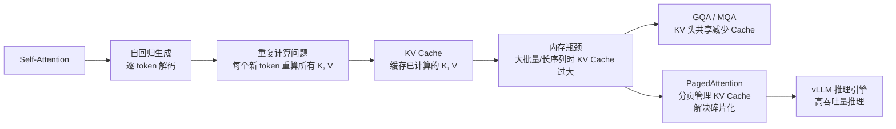
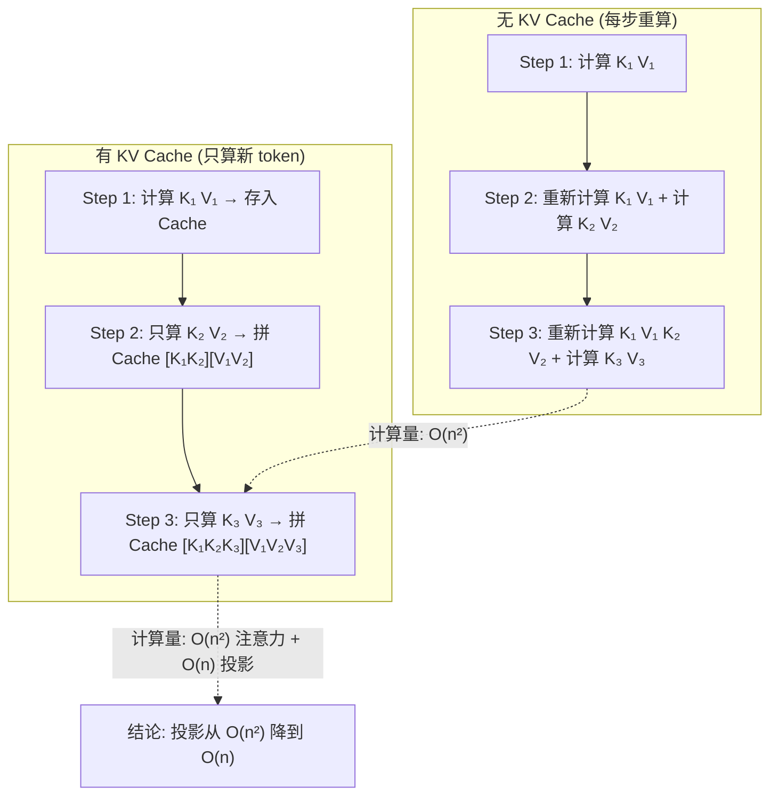

# KV Cache / PagedAttention

## 知识地图



## 前置知识

- **自回归生成过程**：理解 LLM 如何逐 token 生成，每个新 token 依赖所有之前的 token
- **Self-Attention 中 Q, K, V 的计算**：理解每个 token 需要计算 Q, K, V，注意力时 K, V 被所有位置共用
- **GPU 显存基础知识**：理解显存是 LLM 推理的主要限制因素
- **操作系统的分页/虚拟内存概念**：理解物理页、逻辑地址和页表

## 为什么会出现 (Why)

### KV Cache 为什么出现

在自回归生成中，每个新 token 的生成都需要对所有之前的 token 做注意力计算。如果没有缓存，每个新 token 都会**重新计算**整个序列的 K 和 V：

- 第 1 步：计算 token_1 的 K, V
- 第 2 步：重新计算 token_1 的 K, V + 计算 token_2 的 K, V
- 第 3 步：重新计算 token_1, token_2 的 K, V + 计算 token_3 的 K, V
- ...
- 第 n 步：重新计算前 n-1 个 token 的 K, V + 计算当前 token 的 K, V

这导致总计算量变为 $1+2+3+...+n = O(n^2)$ 次 K, V 投影，是巨大的浪费。

### PagedAttention 为什么出现

KV Cache 虽然解决了重复计算问题，但在大 batch / 长序列场景下引入了一个新问题：**显存碎片化**。传统方法预分配固定大小的 KV Cache，但：
- 分配大了：多数请求较短，浪费显存（~40%）
- 分配小了：长请求失败
- 动态分配：产生碎片，利用率依然不高

这类似于操作系统诞生之前的内存管理困境。PagedAttention 借鉴了虚拟内存分页的思想来解决这个问题。

## 解决什么问题 (Problem)

- **KV Cache**：解决自回归生成中 K, V 的**重复计算**问题——将已计算的 K, V 缓存复用
- **PagedAttention**：解决 KV Cache 的**显存碎片化**问题——通过分页管理将浪费率从 ~40% 降到 <4%

## 核心思想 (Core Idea)

**KV Cache 通过缓存已计算的 K, V 避免重复计算；PagedAttention 通过将 KV Cache 划分为固定大小的 Page（类似操作系统分页），实现近乎零浪费的显存管理和更高的推理吞吐量。**

---

## 数学公式

### KV Cache 原理

将已计算的 K、V 缓存在显存中，每步只计算新 token 的 K、V：

```python
# 第 t 步（有 Cache）
Q_t = W_Q @ x_t  # 只计算新 token 的 Q
K_t = W_K @ x_t  # 只计算新 token 的 K
V_t = W_V @ x_t  # 只计算新 token 的 V

# 拼接 Cache
K = concat(K_cache, K_t)  # [t, d_k]
V = concat(V_cache, V_t)  # [t, d_v]

# 只对 Q_t 和 K 计算注意力
attn = softmax(Q_t @ K^T / sqrt(d_k)) @ V  # O(t) 而非 O(t^2)
```

**通俗解释：** 想象你正在写一篇长文章，每写一个句子都要回顾前面所有内容。如果没有"缓存"，你每次都要从头重读一遍整篇文章——越写到后面越慢。KV Cache 相当于你在写的过程中给每个段落写了摘要（K 是"这个段落讲什么"，V 是"这个段落的详细内容"），每次只需要读新段落的摘要，再和之前的摘要比较即可。

### KV Cache 内存分析

KV Cache 的内存占用公式：

$$
\text{Memory} = 2 \times n_{layers} \times n_{heads} \times d_{head} \times \text{seq\_len} \times \text{dtype\_size} \times \text{batch\_size}
$$

例如 LLaMA-7B (32 层，32 头，$d_{head}=128$，FP16)：
- 序列长度 4096：~2GB
- 序列长度 32K：~16GB

**通俗解释：** KV Cache 的内存为什么大？因为每一层都需要缓存 K 和 V（2×），每个头各有一份，每一头的维度是 $d_{head}$，每个 token 都要保存，还要乘以 batch 大小。这些乘起来就是一个很大的数。

---

## PagedAttention (vLLM)

### 核心问题

KV Cache 像操作系统中的内存一样面临**碎片化**问题：
- 预分配固定大小 → 浪费（多数请求较短）
- 动态分配 → 碎片化

### 解决方案

将 KV Cache 划分为固定大小的 **Page**（灵感来自操作系统的虚拟内存分页）：

```
Physical KV Blocks:  [Block 0] [Block 1] [Block 2] [Block 3]
                          ↖         ↗
Request 1:    Block 0 → Block 1
Request 2:    Block 2 → Block 3
```

- **Block Table**：逻辑 token 位置 → 物理 block 映射
- **Copy-on-Write**：Beam Search 中共享 prompt 的 KV Cache

**通俗解释：** 传统 KV Cache 分配就像给每个请求预留一个固定长度的"停车位"。有的请求短（普通轿车），有的请求长（卡车），但你给每个都预留了卡车位——大部分空间浪费了。PagedAttention 把"停车场"分成统一大小的小格子（Page），每个请求用多少就分配多少个小格子，并通过 Block Table 记录"这个请求的第 3 到第 5 个小格子在哪"。这样几乎不浪费空间。

### 优势

- 内存利用率接近最优（<4% 浪费 vs 传统 ~40%）
- 支持更大 batch size → 更高吞吐

---

## 可视化展示

### KV Cache 计算流程 vs 无 Cache



### vLLM 吞吐量对比

```echarts
return {
  tooltip: { trigger: "axis", confine: true },
  title: { top: 5,  text: 'vLLM vs 传统推理框架吞吐量对比', left: 'center' },
  xAxis: { type: 'category', data: ['传统 (FasterTransformer)', 'vLLM (PagedAttention)'] },
  yAxis: { type: 'value', min: 0, max: 5, name: '相对吞吐量' },
  series: [{
    type: 'bar',
    data: [1, 3.5],
    itemStyle: { color: '#27ae60' },
    label: { show: true, position: 'top', formatter: '{c}x' }
  }],
  grid: { left: 60, right: 20, top: 55, bottom: 55 }
}
```

---

## 最小可运行代码

### KV Cache 核心逻辑

```python
import torch
import torch.nn as nn

class DecoderWithKVCache(nn.Module):
    def __init__(self, d_model, n_heads):
        super().__init__()
        self.d_model = d_model
        self.n_heads = n_heads
        self.d_k = d_model // n_heads
        self.W_q = nn.Linear(d_model, d_model)
        self.W_k = nn.Linear(d_model, d_model)
        self.W_v = nn.Linear(d_model, d_model)
        self.W_o = nn.Linear(d_model, d_model)
        self.k_cache = None
        self.v_cache = None

    def forward(self, x, use_cache=True):
        B, N, D = x.shape
        Q = self.W_q(x).view(B, N, self.n_heads, self.d_k).transpose(1, 2)
        K = self.W_k(x).view(B, N, self.n_heads, self.d_k).transpose(1, 2)
        V = self.W_v(x).view(B, N, self.n_heads, self.d_k).transpose(1, 2)

        if use_cache and self.k_cache is not None:
            K = torch.cat([self.k_cache, K], dim=2)
            V = torch.cat([self.v_cache, V], dim=2)

        if use_cache:
            self.k_cache = K
            self.v_cache = V

        scores = Q @ K.transpose(-2, -1) / (self.d_k ** 0.5)
        attn = torch.softmax(scores, dim=-1)
        out = (attn @ V).transpose(1, 2).contiguous().view(B, N, D)
        return self.W_o(out)
```

### PagedAttention Block Table 概念

```python
# PagedAttention 核心数据结构示意
class BlockTable:
    """逻辑 token 位置 → 物理 KV Block 的映射"""
    def __init__(self, block_size=16):
        self.block_size = block_size
        self.table = []  # 存储物理 block ID 列表

    def append_block(self, physical_block_id):
        self.table.append(physical_block_id)

    def logical_to_physical(self, token_pos):
        block_idx = token_pos // self.block_size
        offset = token_pos % self.block_size
        return self.table[block_idx], offset

# 使用示例
# Request A: 35 tokens → 需要 3 个 block
req_a = BlockTable(block_size=16)
req_a.append_block(0)  # tokens 0-15 → physical block 0
req_a.append_block(2)  # tokens 16-31 → physical block 2
req_a.append_block(5)  # tokens 32-34 → physical block 5
# 物理 block 不连续，但逻辑上连续
```

---

## 工业界应用

| 应用场景 | 系统/框架 | 关键技术 |
|----------|----------|---------|
| LLM 推理引擎 | vLLM | PagedAttention + Continuous Batching |
| LLM 推理引擎 | TensorRT-LLM | KV Cache + FlashAttention + 量化 |
| 本地推理 | llama.cpp | KV Cache 量化 (q4_0, q8_0) |
| 多轮对话服务 | Claude API, GPT-4 API | KV Cache 跨轮复用 (Prefix Caching) |
| 批量离线推理 | SGLang | RadixAttention (前缀树 KV Cache 共享) |
| 长序列推理 | MInference | 稀疏 KV Cache 选择 |

## 对比表格

### 传统 KV Cache vs PagedAttention

| 特性 | 传统 KV Cache | PagedAttention (vLLM) |
|------|-------------|----------------------|
| KV Cache 分配 | 预分配固定大小 | 动态分页分配 |
| 内存浪费率 | ~40% | <4% |
| 碎片化 | 严重（预分配不匹配实际长度） | 几乎无（固定 Page 大小） |
| 大 Batch 支持 | 受限（显存瓶颈） | 可根据可用显存动态扩展 |
| Beam Search | 每个 Beam 独立复制 KV Cache | Copy-on-Write 共享 |
| 吞吐量 | 基准 | 2-4× |
| 实现复杂度 | 简单 | 中等（需 Block Table 管理） |

### GQA / MQA 对 KV Cache 的影响

| 注意力类型 | KV 头数 | KV Cache 相对大小 | 代表模型 |
|-----------|---------|-------------------|---------|
| MHA | $h$ | 1× | GPT-3 |
| GQA (8 groups) | 8 | 8/$h$ × | LLaMA 2-70B ($h$=64, ~8× 减小) |
| MQA | 1 | 1/$h$ × | PaLM |

---

## 学完后建议继续学习

1. **vLLM 架构深入** — 了解 Continuous Batching、Prefix Caching 等推理优化技术
2. **GQA / MQA** — 从算法层面减少 KV Cache 大小
3. **KV Cache 量化** — 了解 KV Cache 的 INT8/INT4 量化方案（如 KIVI）
4. **FlashDecoding** — 解码阶段的长序列注意力优化，与 PagedAttention 互补
5. **SGLang / RadixAttention** — 了解前缀树共享 KV Cache 的高级技术

## 高频面试题

### Q1: 什么是 KV Cache？为什么需要它？

**标准答案：**
KV Cache 是自回归生成中的关键技术——将已生成 token 的 Key 和 Value 向量缓存在显存中，后续 token 生成时直接复用。

需要它的原因：
1. **避免重复计算**：如果没有 Cache，生成第 $t$ 个 token 时需要重新计算前 $t-1$ 个 token 的 K 和 V，总投影计算量达到 $O(n^2)$
2. **加速推理**：有 Cache 后，每步只需计算新 token 的 K、V（$O(1)$ 投影），然后与缓存的 K、V 拼接做注意力

代价是显存占用：KV Cache 大小随序列长度和 batch 大小线性增长，是长序列推理的主要内存瓶颈。

### Q2: KV Cache 的内存占用有多大？如何计算？

**标准答案：**
公式：$\text{Memory} = 2 \times n_{layers} \times n_{kv\_heads} \times d_{head} \times \text{seq\_len} \times \text{dtype\_size} \times \text{batch\_size}$

其中：
- 2：每层存 K 和 V 两份
- $n_{kv\_heads}$：KV 头数（MHA 中 $=h$，MQA 中 $=1$，GQA 中 $=g$）

以 LLaMA-7B 为例（32 层，32 头，$d_{head}=128$，FP16）：
- seq_len=4096, batch=1 → ~2GB
- seq_len=32K, batch=1 → ~16GB
- seq_len=4096, batch=32 → ~64GB（已超过单卡显存）

### Q3: PagedAttention 解决了什么问题？核心思想是什么？

**标准答案：**
PagedAttention 解决 KV Cache 的**显存碎片化**问题。传统做法为每个请求预分配固定大小的 KV Cache，由于请求长度差异大，利用率低（~60%，浪费率 ~40%）。

核心思想借鉴操作系统的虚拟内存分页：
1. 将 KV Cache 划分为固定大小的 Block（如 16 个 token/Block）
2. 通过 Block Table 维护逻辑位置到物理 Block 的映射
3. 请求按需动态分配物理 Block，无需预分配
4. Copy-on-Write 机制使 Beam Search 的不同分支共享 prompt 部分的 KV Cache

效果：显存浪费率从 ~40% 降到 <4%，支持更大的 batch size，吞吐量提升 2-4×。

### Q4: GQA 和 MQA 如何减少 KV Cache？各自的权衡是什么？

**标准答案：**
- **MHA**：每个 Query 头对应独立的 K、V 头 → KV Cache $\propto h$
- **GQA**：$h$ 个 Query 头分 $g$ 组，同组共享 K、V → KV Cache $\propto g$，减小 $h/g$ 倍
- **MQA**：所有 Query 头共享同一组 K、V → KV Cache $\propto 1$，减小 $h$ 倍

权衡：
- MHA：质量最高，KV Cache 最大
- GQA：质量接近 MHA（轻微下降），KV Cache 显著减小——是当前最主流的折中方案（LLaMA 2/3）
- MQA：推理最快，KV Cache 最小，但模型质量有可观下降——适用于极度注重推理速度的场景

### Q5: Prefix Caching 是什么？和 KV Cache 有什么关系？

**标准答案：**
Prefix Caching 是 KV Cache 的一种高级复用策略：当多个请求共享相同前缀时（如共享 system prompt 的多轮对话），前缀部分的 KV Cache 只计算一次，所有请求复用同一份物理 KV Block。

与基础 KV Cache 的关系：
- KV Cache：每个请求独立缓存自己的 K, V
- Prefix Caching：跨请求共享前缀的 KV Cache

应用场景：
- Chat 应用：所有用户共享同一个 system prompt
- 多轮对话：历史轮次的 KV Cache 在下一轮复用
- 批量推理：共享前缀的请求可以极大节省显存

SGLang 的 RadixAttention 通过前缀树（Radix Tree）进一步优化了 Prefix Caching，可以匹配最长公共前缀。
