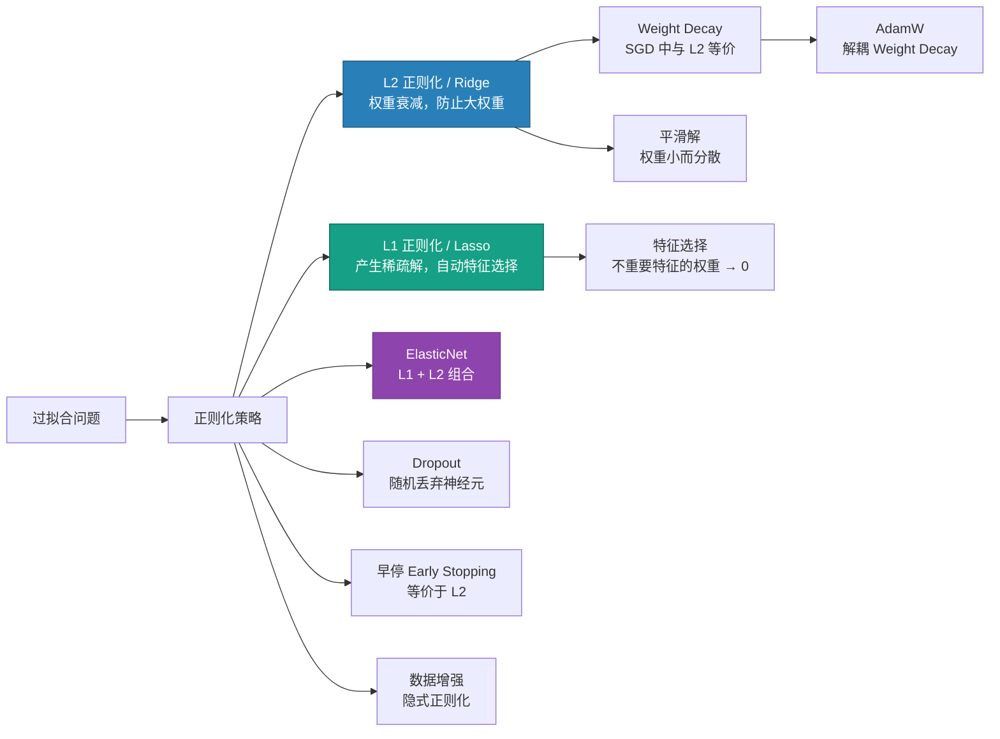

# L1 / L2 正则化

## 知识地图



## 前置知识

- **过拟合 (Overfitting)**：理解模型在训练集上表现好但测试集上表现差的现象
- **损失函数**：知道损失函数衡量模型预测与真实值的差距
- **梯度下降**：理解参数更新过程 $\mathbf{w} \leftarrow \mathbf{w} - \eta \nabla L$
- **范数 (Norm)**：理解 L1 范数（绝对值和）和 L2 范数（平方和开根号）
- **优化器**：了解 AdamW 中解耦 Weight Decay 的设计动机

## 为什么会出现 (Why)

深度学习模型参数量极大（动辄百万甚至千亿），而训练数据量相对有限。如果不加限制，模型会"记住"训练数据中的每一个噪声和偶然模式，而不是学习通用的规律——这就是过拟合。

直观理解：一个 1000 万参数的模型，如果每个参数都不受限制地增长，它足够"背下"整个训练集的 100 万张图片及其标签。但在测试集上，它背下的模式不再适用，精度崩塌。

**L2 正则化**最早从统计学中的岭回归 (Ridge Regression) 借鉴而来，通过在损失函数中加入权重平方和的惩罚，强制模型偏好"小权重"——权重越小，模型越简单，越不容易过拟合。

**L1 正则化**从 Lasso 回归借鉴，使用绝对值和惩罚。L1 的关键特性是能产生**稀疏解**（很多权重精确为 0），天然实现特征选择。

**ElasticNet** 结合两者，既有 L2 的稳定性又有 L1 的稀疏性。

**早停 (Early Stopping)** 是在训练过程中监控验证集 loss，一旦不再下降就停止训练。在二次近似下，早停等价于某个特定强度的 L2 正则化。

## 解决什么问题 (Problem)

| 方法 | 解决的问题 |
|------|-----------|
| **L2 正则化** | 权重过大导致模型对输入微小变化过度敏感 → 约束权重范数 |
| **L1 正则化** | 特征过多但只有少数有用 → 强制无用特征的权重归零 |
| **ElasticNet** | L1 在选择相关特征时不稳定（只选其一）→ L2 部分鼓励共同选择相关特征 |
| **早停** | 不知道什么时候该停止训练 → 验证集监控自动决定 |
| **Dropout** | 神经元之间形成共适应 (co-adaptation) → 随机丢弃破坏依赖 |

## 核心思想 (Core Idea)

**正则化通过在损失函数中增加惩罚项来限制模型复杂度，防止过拟合。L2 让权重均匀缩小（"分散投资"），L1 让无用权重直接归零（"只留精英"），两者都是奥卡姆剃刀原则的数学实现——简单但有效的模型优于复杂模型。**

---

## 数学模型/公式

### L2 正则化 (Weight Decay / Ridge)

$$L_{total} = L_{data} + \frac{\lambda}{2} \|\mathbf{w}\|^2$$

> **通俗解释：** 损失函数有一个新成员 $\frac{\lambda}{2}\|\mathbf{w}\|^2$——它会惩罚大权重。$\lambda$ 是惩罚强度："如果你权重太大，你的总损失就会很高，优化器就会被迫缩小你。"除以 2 是为了求导方便（$\frac{\lambda}{2} \cdot 2\mathbf{w} = \lambda\mathbf{w}$，简洁）。

梯度更新：

$$\mathbf{w} \leftarrow \mathbf{w} - \eta \frac{\partial L_{data}}{\partial \mathbf{w}} - \eta \lambda \mathbf{w} = (1 - \eta \lambda) \mathbf{w} - \eta \frac{\partial L_{data}}{\partial \mathbf{w}}$$

> **通俗解释：** 每次更新时，先做正常的梯度下降 $\mathbf{w} - \eta \frac{\partial L_{data}}{\partial \mathbf{w}}$，然后额外把权重乘以 $(1 - \eta \lambda)$——每次缩小一点点。所以也叫 Weight Decay（权重衰减）。$\eta \lambda$ 通常很小（如 1e-3 × 5e-4 = 5e-7），每步衰减量微乎其微，但累积成千上万步后效果显著。

每次更新权重会**衰减**一定比例（weight decay 名称的由来）。

### L1 正则化 (Lasso)

$$L_{total} = L_{data} + \lambda \|\mathbf{w}\|_1$$

> **通俗解释：** 惩罚项是所有权重绝对值的和。与 L2 的核心区别在于：L2 对小权重的惩罚微乎其微（0.001² ≈ 0），而 L1 对小权重的惩罚是线性的（|0.001| = 0.001）。这意味着 L1 会持续把不重要的权重推向 0，而不是让它们停留在很小的非零值。

梯度更新（注意绝对值在 0 处使用次导数 sign）：

$$\mathbf{w} \leftarrow \mathbf{w} - \eta \frac{\partial L_{data}}{\partial \mathbf{w}} - \eta \lambda \cdot \text{sign}(\mathbf{w})$$

> **通俗解释：** 与 L2 的"等比缩小"不同，L1 是"固定额度削减"——每步减去 $\eta\lambda$（与权重当前大小无关）。对于大权重（如 5），减去 0.001 无关痛痒；对于小权重（如 0.0005），减去 0.001 直接归零！这就是 L1 产生稀疏解的数学根源。

产生**稀疏解**（很多权重为 0），自动特征选择。

### ElasticNet

$$L_{total} = L_{data} + \lambda_1 \|\mathbf{w}\|_1 + \frac{\lambda_2}{2} \|\mathbf{w}\|^2$$

> **通俗解释：** 同时加上 L1 惩罚和 L2 惩罚。既能产生稀疏解（L1 的贡献），又不会在高度相关的特征之间"只选一个而丢掉其他"（L2 的贡献让相关特征可以被一起保留）。

### Adam vs AdamW 中的 Weight Decay

Adam 原始实现将 weight decay 混入了自适应学习率中，效果不如显式解耦。AdamW 将 weight decay 与梯度更新解耦：

$$\mathbf{w} \leftarrow (1 - \eta \lambda) \mathbf{w} - \eta \cdot \text{AdamUpdate}$$

> **通俗解释：** AdamW 把 Weight Decay 从自适应学习率缩放中"解救"出来——不再让 $\sqrt{\hat{v}}$ 影响正则化强度。所有参数不论梯度大小，都受到同等程度的权重衰减。这在 Transformer 大模型上带来了显著的泛化能力提升。

---

## 可视化展示

### 几何直觉：L1 vs L2 的约束区域

在二维权空间中：


- L1 约束区域是菱形（有尖角）→ 最优解常落在坐标轴上 → 稀疏
- L2 约束区域是圆形 → 最优解通常不在坐标轴上 → 非稀疏

### L1 vs L2 对权重的影响对比

```echarts
return {
  title: { top: 5,  text: 'L1 vs L2 惩罚力度对比' },
  xAxis: { type: 'value', min: -3, max: 3, name: '权重 w' },
  yAxis: { type: 'value', min: 0, max: 5, name: '惩罚值' },
  legend: { top: 28,  data: ['L2: w²', 'L1: |w|'] },
  series: [
    {
      name: 'L2: w²', type: 'line', smooth: true,
      lineStyle: { color: '#2980b9', width: 2 },
      data: (function() { const d = []; for (let i = -3; i <= 3; i += 0.02) d.push([i, i * i]); return d; })()
    },
    {
      name: 'L1: |w|', type: 'line', smooth: false,
      lineStyle: { color: '#16a085', width: 2 },
      data: (function() { const d = []; for (let i = -3; i <= 3; i += 0.02) d.push([i, Math.abs(i)]); return d; })()
    }
  ],
  tooltip: { trigger: 'axis' },
  grid: { left: 60, right: 20, top: 55, bottom: 60 }
}
```

观察 $|w|$ 在原点附近的 V 形——这就是 L1 产生稀疏性的几何原因：对小权重的惩罚相对更大。

---

## 最小可运行代码

### PyTorch 中的 Weight Decay

```python
import torch
import torch.nn as nn
import torch.optim as optim

model = nn.Sequential(
    nn.Linear(784, 256),
    nn.ReLU(),
    nn.Linear(256, 10)
)

# AdamW — 解耦 weight decay（推荐）
optimizer = optim.AdamW(
    model.parameters(),
    lr=1e-3,
    weight_decay=0.01
)

# SGD + weight decay
optimizer = optim.SGD(
    model.parameters(),
    lr=1e-3,
    weight_decay=5e-4
)
```

### 手动实现 L1 / L2 / ElasticNet 正则化 (NumPy)

```python
import numpy as np

# L2 正则化
def l2_penalty(weights, lambda_l2=0.01):
    return lambda_l2 * np.sum(np.square(weights))

# L1 正则化
def l1_penalty(weights, lambda_l1=0.01):
    return lambda_l1 * np.sum(np.abs(weights))

# ElasticNet 正则化
def elasticnet_penalty(weights, lambda_l1=0.01, lambda_l2=0.01):
    return lambda_l1 * np.sum(np.abs(weights)) + lambda_l2 * np.sum(np.square(weights))

# 训练中的使用方式
def train_step(X, y, w, b, lr=0.01, lambda_l2=0.01):
    # 前向传播
    y_pred = X @ w + b
    data_loss = np.mean((y - y_pred) ** 2)

    # 梯度
    dw = -2 * X.T @ (y - y_pred) / len(y) + 2 * lambda_l2 * w  # L2 惩罚的梯度
    db = -2 * np.mean(y - y_pred)

    # 更新
    w -= lr * dw
    b -= lr * db

    reg_loss = lambda_l2 * np.sum(w ** 2)
    return data_loss + reg_loss, w, b
```

### L1 vs L2 正则化效果对比实验

```python
import torch
import torch.nn as nn
import torch.optim as optim

# 生成高维稀疏数据（只有前3个特征有用）
torch.manual_seed(42)
X = torch.randn(200, 50)  # 200样本, 50特征
true_w = torch.zeros(50)
true_w[:3] = torch.tensor([2.0, -1.5, 1.0])  # 只有3个特征有效
y = X @ true_w + 0.3 * torch.randn(200)

def train_with_reg(reg_type, **kwargs):
    model = nn.Linear(50, 1, bias=False)
    if reg_type == 'l1':
        optimizer = optim.SGD(model.parameters(), lr=0.01)
        lambda_l1 = kwargs.get('lambda', 0.01)
    elif reg_type == 'l2':
        optimizer = optim.SGD(model.parameters(), lr=0.01, weight_decay=kwargs.get('lambda', 0.01))
    else:
        optimizer = optim.SGD(model.parameters(), lr=0.01)

    for epoch in range(500):
        optimizer.zero_grad()
        loss = nn.MSELoss()(model(X).squeeze(), y)
        if reg_type == 'l1':
            loss += lambda_l1 * model.weight.abs().sum()
        loss.backward()
        optimizer.step()

    w = model.weight.data.squeeze()
    zero_count = (w.abs() < 1e-4).sum().item()
    nonzero_indices = (w.abs() >= 1e-4).nonzero(as_tuple=True)[0].tolist()
    print(f"{reg_type.upper() if reg_type else 'None'}: "
          f"零权重数={zero_count}, 非零权重索引={nonzero_indices}")
    return w

# 无正则化
train_with_reg('none')
# L2: 所有权重都很小但非零
train_with_reg('l2', lambda=0.01)
# L1: 很多不重要的权重精确为零
train_with_reg('l1', lambda=0.01)
```

---

## 工业界应用

| 应用场景 | 使用的正则化 | 为什么 | 优点 | 缺点 |
|----------|-------------|--------|------|------|
| **Transformer (GPT/LLaMA)** | Weight Decay (AdamW) | 大模型极易过拟合 | 泛化能力显著提升 | wd 需调到 0.05~0.1 |
| **ViT 图像分类** | Weight Decay (AdamW) | 缺乏 CNN 的归纳偏置 | 补偿结构先验缺失 | wd 太大导致欠拟合 |
| **ResNet 图像分类** | Weight Decay (SGD) | 经典 CV 任务标配 | wd=1e-4 通用 | 对 wd 不敏感 |
| **线性模型 / 逻辑回归** | L1 + L2 (ElasticNet) | 特征数远大于样本数 | 自动特征选择 + 稳定性 | 两个超参数需调 |
| **基因数据 / GWAS** | L1 (Lasso) | 几十万 SNP 中只有少数与性状相关 | 自然产生稀疏模型 | 相关 SNP 组只选一个 |
| **推荐系统** | L2 | 用户和物品嵌入需要约束 | 防止嵌入范数爆炸 | 对冷启动物品可能约束过强 |
| **自动驾驶感知** | Weight Decay | 安全关键系统不能过拟合 | 稳定 | 多层正则化效果不直观 |

---

## 优缺点对比

| 方法 | 优点 | 缺点 | 产生解的特征 |
|------|------|------|-------------|
| **L2 (Ridge)** | 数学性质好（处处可导），稳定性高，实现简单 | 不产生稀疏解，所有特征都被保留 | 权重均匀缩小，无零权重 |
| **L1 (Lasso)** | 自动特征选择，产生可解释的稀疏模型 | 零点不可导（需次导数），特征数 > 样本数时最多选 n 个特征 | 多数权重为 0，只有重要特征非零 |
| **ElasticNet** | 兼具稀疏性和稳定性，能同时选择相关特征组 | 两个超参数 ($\lambda_1, \lambda_2$) 需联合调优 | 组稀疏：相关特征同被选或同被弃 |
| **Weight Decay (AdamW)** | 与自适应学习率解耦，大模型必备 | 需理解与 L2 在 Adam 中的不等价性 | 所有参数均匀衰减 |
| **早停 (Early Stopping)** | 零额外超参数（只需验证集），自动决定停止点 | 需划分验证集，减少训练数据 | 等价于特定强度的 L2 |

---

## 对比表格

### L1 vs L2 vs ElasticNet 全面对比

| 维度 | L1 (Lasso) | L2 (Ridge) | ElasticNet |
|------|-----------|------------|------------|
| **惩罚项** | $\lambda\|w\|_1$ | $\frac{\lambda}{2}\|w\|^2$ | $\lambda_1\|w\|_1 + \frac{\lambda_2}{2}\|w\|^2$ |
| **梯度贡献** | $\lambda \cdot \text{sign}(w)$（常数） | $\lambda w$（与 w 成正比） | 两者之和 |
| **对大权重的影响** | 固定削减，相对温和 | 等比削减，力度随 w 增大 | 两种效应叠加 |
| **对小权重的影响** | 固定削减 → 直接归零 | 削减极小 → 保留为非零 | L1 部分驱零 + L2 部分保留 |
| **解的稀疏性** | 强稀疏（多数权重精确为 0） | 非稀疏（权重小但不为零） | 中等稀疏 |
| **可导性** | 零点不可导 | 全局可导 | 零点不可导 |
| **特征选择** | 自动 | 不自动 | 自动（组选择） |
| **相关特征处理** | 随机选一个 | 都保留，权重相近 | 倾向于一起保留或一起丢弃 |
| **计算复杂度** | 低 | 低 | 中等 |
| **超参数数量** | 1 | 1 | 2 |
| **典型 $\lambda$ 范围** | 0.001 ~ 0.1 | 1e-4 ~ 0.1 | $\lambda_1$: 0.001~0.1, $\lambda_2$: 1e-4~0.1 |

### SGD Weight Decay vs AdamW Weight Decay

| 维度 | SGD + Weight Decay | AdamW + Weight Decay |
|------|-------------------|----------------------|
| **与 L2 等价性** | 完全等价 | 不等价（Adam 中 L2 被缩放） |
| **正则化路径** | 与梯度更新绑定在同一项中 | 独立于梯度自适应缩放 |
| **权重衰减均匀性** | 统一（所有参数同比例缩小） | AdamW 统一；Adam(L2) 不均匀 |
| **典型 wd 值** | 1e-4 ~ 5e-4 | CV: 1e-4~5e-4; Transformer: 0.05~0.1 |
| **推荐用法** | `SGD(..., weight_decay=5e-4)` | `AdamW(..., weight_decay=0.01)` |

---

## 经验法则

| 模型类型 | Weight Decay 参考值 |
|----------|---------------------|
| 一般分类 | 1e-4 ~ 5e-4 |
| Transformer (GPT/LLaMA) | 0.1 (较大!) |
| ViT | 0.05 ~ 0.1 |
| ResNet | 1e-4 ~ 5e-4 |
| 轻量级 CNN | 1e-4 ~ 1e-3 |
| 线性 + L1 特征选择 | L1 $\lambda$: 0.001 ~ 0.1 |
| ElasticNet (高维稀疏) | L1 $\lambda$: 0.01~0.1, L2 $\lambda$: 0.01~0.1 |

## 早停 (Early Stopping)

早停可以看作正则化的一种形式。其 L2 正则化等价性：在二次近似下，早停在梯度下降路径上的某个点停止 ≈ 选定一个特定 $\lambda$ 的 L2 正则化。

> **通俗解释：** 可以这样理解——不加正则化时训练越久模型越复杂（权重范数不断增长）；在某个时间点停止训练，相当于隐式地对权重范数设置了一个上限。这个上限的效果近似于 L2 正则化对权重范数的约束。

---

## 学完后建议继续学习

- [Adam 与 AdamW 优化器详解](adam-adamw.md) — 理解 AdamW 中解耦 Weight Decay 的设计和重要性
- [SGD / Momentum / Nesterov](sgd-momentum.md) — 理解 SGD 中 weight_decay 与 L2 正则化的等价性
- [MSE / MAE / Huber Loss](mse-mae-huber.md) — L1/L2 Loss 与 L1/L2 正则化的数学同构
- [Cross-Entropy Loss](cross-entropy.md) — 正则化 + Label Smoothing 联合防止过拟合

---

## 高频面试题

### Q1: L1 正则化为什么产生稀疏解而 L2 不产生？请从梯度和几何两个角度解释。

**标准回答：** 

**梯度角度：** L2 的梯度为 $\lambda w$，与权重大小成正比——当 $w$ 很小时（如 0.001），梯度也很小（$\lambda \cdot 0.001$），削减力度微乎其微，$w$ 不会进一步缩小到 0。L1 的梯度为 $\lambda \cdot \text{sign}(w)$，与权重大小无关——即使 $w = 0.001$，削减力度依然是 $\lambda$（常数）。如果 $\lambda$ 大于数据损失的梯度贡献，$w$ 就被一步推过零，变成精确的 0。

**几何角度：** L2 约束区域是圆形（等高线是同心圆），L1 约束区域是菱形（等高线是同心菱形）。损失函数的等高线与约束区域首次相交的位置即是最优解。圆的边界处处平滑，相交点大概率不在坐标轴上；菱形有四个尖角（在坐标轴上），相交点极大概率落在尖角上——对应一个参数为零。推广到高维，L1 约束区域的"尖角"对应只有一个参数非零的解，从而产生稀疏性。

### Q2: 为什么在 Adam 中 L2 正则化与 Weight Decay 不等价？

**标准回答：** 在 SGD 中，L2 正则化的梯度贡献是 $\lambda w$，直接加到数据梯度上：$\mathbf{w} \leftarrow \mathbf{w} - \eta(\nabla L_{data} + \lambda \mathbf{w}) = (1 - \eta\lambda)\mathbf{w} - \eta\nabla L_{data}$。这与 Weight Decay 的形式恰好一致，所以等价。

但在 Adam 中，带有 L2 惩罚的梯度进入的是 Adam 的自适应更新公式：
$$\mathbf{w} \leftarrow \mathbf{w} - \eta \cdot \frac{\hat{m}(\nabla L_{data} + \lambda \mathbf{w})}{\sqrt{\hat{v}(\nabla L_{data} + \lambda \mathbf{w})} + \epsilon}$$

其中 $\lambda w$ 也被 $\sqrt{\hat{v}}$ 缩放了——不同参数的 L2 惩罚被不同程度地缩小或放大，正则化不再均匀。而 AdamW 将 Weight Decay 完全拿出自适应缩放：
$$\mathbf{w} \leftarrow \mathbf{w} - \eta \cdot \frac{\hat{m}}{\sqrt{\hat{v}} + \epsilon} - \eta\lambda\mathbf{w}$$

这恢复了正则化的一致性。在 Transformer 等大模型上，Adam v.s. AdamW 的泛化差距在 1-3% (ImageNet Top-1) 不等。

### Q3: ElasticNet 相比纯 L1 有什么优势？

**标准回答：** L1 (Lasso) 在处理高度相关的特征时有一个不稳定性问题：假设两个特征 $x_1$ 和 $x_2$ 几乎完全相同（如相关系数 0.99），L1 会随机的只选取其中一个而将另一个的系数置零。这意味着模型对数据中的微小扰动极度敏感——换一批数据，L1 可能选另一个特征。

ElasticNet 通过在 L1 基础上增加 L2 惩罚来解决这个问题：L2 部分鼓励相关特征的系数接近（"分散投资"），L1 部分仍然驱动不重要的特征归零。结合效果是：相关特征组要么一起被保留（系数相近），要么一起被丢弃，不会出现"随机选一个"的不稳定行为。

数学上，ElasticNet 的严格凸性（L2 贡献）保证了唯一解，而纯 L1 在高维相关场景下可能有多解。

### Q4: 为什么 Transformer (GPT/LLaMA) 的 weight_decay 设为 0.1，而 ResNet 通常只有 5e-4？

**标准回答：** 三个层面的原因：

1. **参数量差异**：GPT 有数十亿参数而训练数据只有几千亿 token，参数/数据比远大于 ResNet，过拟合风险更高，需要更强的显式正则化。

2. **架构差异**：CNN 自带强归纳偏置（局部连接、平移等变性、权重共享），本身就是一种隐式正则化。Transformer 没有这些结构先验（自注意力是全局的），更容易记忆噪声，因此需要更强的显式正则化来弥补。

3. **优化器差异**：GPT 用 AdamW，ResNet 用 SGD+weight_decay。两者的 effective regularization strength 不可直接比较数值——AdamW 中 weight_decay 的作用路径与 SGD 不同，数值的可比性没有意义。

### Q5: 早停为什么等价于 L2 正则化？

**标准回答：** 在损失曲面是二次的假设下（最优解附近的泰勒展开），梯度下降的优化路径等价于对参数做特定的线性变换。训练步数 $t$ 与 L2 正则化强度 $\lambda$ 之间存在单调关系：训练步数越少（早停越早），等效的 $\lambda$ 越大（正则化越强）；训练到收敛对应 $\lambda \to 0$（无正则化）。

直观理解：不设正则化的情况下，训练越久，权重范数越大（模型越复杂）。如果在某个中间步数停下来，就等价于隐式地给权重范数设置了一个上限。而 L2 正则化也是通过惩罚权重范数来限制复杂度。两者在限制"模型复杂度"这个目标上是一致的。

实际意义：早停是一种"免费"的正则化——不需要额外的超参数（只需验证集），自动决定何时停止，且效果往往与精心调参的 L2/Weight Decay 相当。
