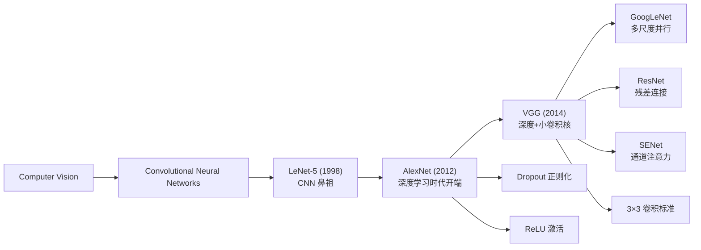
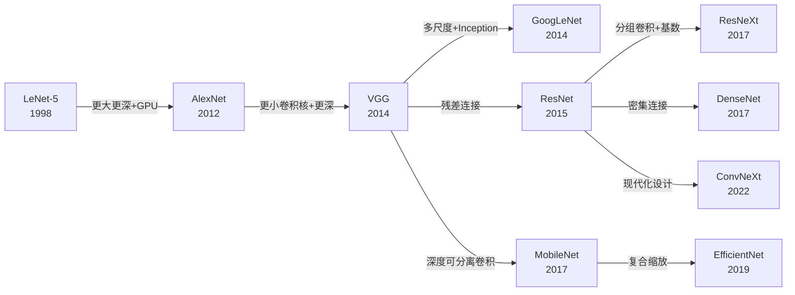
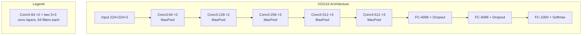
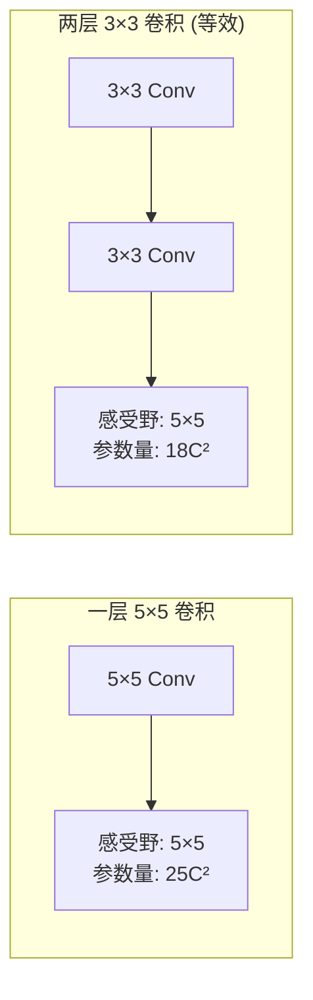

# LeNet / AlexNet / VGG

## 知识地图



## 前置知识

- 卷积操作（卷积核、步长、填充）的基本概念
- 池化操作（MaxPool、AvgPool）的作用
- 全连接层（Fully Connected Layer）的原理
- Sigmoid 和 ReLU 激活函数的区别
- 反向传播与梯度下降的基本原理
- ImageNet 数据集和图像分类任务的基本概念
- 过拟合与正则化（L1/L2、Dropout）的基本概念

## 模型演化路线



| 模型 | 年份 | 关键创新 | 解决的问题 |
|------|------|---------|-----------|
| LeNet-5 | 1998 | Conv-Pool-FC 经典结构 | 手写数字识别的基础架构 |
| AlexNet | 2012 | ReLU + Dropout + GPU 训练 | 梯度消失 + 过拟合 + 训练速度 |
| VGG | 2014 | 仅用 3×3 卷积 + 深度堆叠 | 架构复杂度过高，用统一设计替代 |

## LeNet-5 (1998)

### 为什么会出现

在 LeNet 出现之前，手写数字识别主要依赖手工特征提取（如 SIFT、HOG）加传统分类器。这种方法对字体变化、书写风格差异的泛化能力很差。Yann LeCun 等人提出用卷积神经网络自动学习特征，避免了手工设计特征的局限性。

### 解决什么问题

通过卷积层自动提取空间层级特征（边缘→纹理→部件→物体），配合池化层逐步降低分辨率、增加平移不变性，最终用全连接层做分类。这是第一个成功商业部署的 CNN（用于美国银行支票的手写数字识别）。

### 核心思想

**通过卷积+下采样+全连接的端到端可训练结构，让网络自己学会提取特征，而不是人工设计特征。**

### 架构

```
Input(32×32) → Conv(6,5×5) → Pool(2×2) → Conv(16,5×5)
→ Pool(2×2) → FC(120) → FC(84) → FC(10)
```

- 参数量约 60K
- 使用 Sigmoid 激活
- 奠定了 Conv → Pool → FC 的经典模式

### 数学模型

LeNet 的卷积层输出：

$$h_{i,j}^k = \sigma\left(\sum_{c}\sum_{m=0}^{4}\sum_{n=0}^{4} W_{m,n}^{k,c} \cdot x_{i+m,j+n}^c + b^k\right)$$

**通俗解释：** 就像一个滑动窗口在图片上扫描，每个位置计算一个小区域的加权和，然后用 Sigmoid 压缩到 0-1 之间，决定这个区域的"激活程度"。

---

## AlexNet (2012)

### 为什么会出现

LeNet 虽然在 MNIST 上表现良好，但面对 ImageNet（120 万张图片、1000 类）这种规模的数据集时：
- Sigmoid 激活导致深层网络梯度消失严重
- 60K 的参数容量远远不足以学习复杂的自然图像特征
- CPU 训练速度太慢，无法在可接受的时间内完成实验

2012 年，Alex Krizhevsky 等人利用 GPU 并行计算能力和一系列新技巧，将 ImageNet top-5 错误率从 26% 降到 15%，一举夺冠，开启了深度学习时代。

### 解决什么问题

解决深层 CNN 训练中的三大障碍：**梯度消失**（ReLU）、**过拟合**（Dropout + 数据增强）、**训练速度**（双 GPU）。

### 核心思想

**用更深的网络 + ReLU 激活 + GPU 训练，让 CNN 从"玩具级"跃升到"工业级"。**

### 关键创新

1. **ReLU 激活**：首次在 CNN 中使用（替代 Sigmoid/Tanh）
2. **Dropout**：全连接层使用 p=0.5 的 Dropout 防过拟合
3. **双 GPU 训练**：模型分两半各跑一个 GPU（当时显存限制）
4. **Local Response Normalization (LRN)**：被后来的 BN 取代
5. **数据增强**：随机裁剪 + 水平翻转

### 架构

```
Input(227×227×3) → Conv(96,11×11,S=4) → MaxPool
→ Conv(256,5×5,S=1,P=2) → MaxPool
→ Conv(384,3×3) → Conv(384,3×3) → Conv(256,3×3) → MaxPool
→ FC(4096) → Dropout → FC(4096) → Dropout → FC(1000)
```

参数量约 60M。

### 数学模型

ReLU 激活函数：

$$f(x) = \max(0, x)$$

**通俗解释：** 相比 Sigmoid 在输入很大或很小时导数为 0（梯度消失），ReLU 只在负数时导数为 0，正数时导数是 1，梯度能顺畅传递。就像打开了一个单向阀门，正向信号畅通无阻。

Dropout 正则化：

$$y = \frac{1}{1-p} \cdot d \odot x, \quad d_i \sim \text{Bernoulli}(1-p)$$

**通俗解释：** 训练时随机关闭一部分神经元（像考试时随机禁用一部分知识），强迫网络学习冗余表示，防止它过度依赖某些特定神经元（过拟合）。测试时所有神经元都工作，相当于多个"残缺网络"的集成。

---

## VGG (2014)

### 为什么会出现

AlexNet 虽然效果好，但架构设计比较"随意"——第一层用 11×11 的大卷积核、第二层用 5×5、后面用 3×3，设计逻辑不统一。不同的卷积核大小导致工程实现复杂、难以分析和复现。

Karen Simonyan 和 Andrew Zisserman 提出一个极简的设计哲学：**全部使用 3×3 卷积核**，通过堆叠层数来达到不同大小的感受野。这个简单的设计在 2014 年 ImageNet 上取得了 7.3% top-5 错误率的成绩。

### 解决什么问题

解决 CNN 架构设计**缺乏统一规范**的问题——VGG 证明了"小卷积核 + 深网络"是一种通用、有效、可复现的设计范式。

### 核心思想：简单即美

**只用最小的 3×3 卷积核，通过堆叠深度来获得大感受野——两个 3×3 的感受野等于一个 5×5，三个等于一个 7×7，但参数量更少、非线性更多。**

### 感受野分析

两个 $3 \times 3$ 卷积的感受野 = 一个 $5 \times 5$ 卷积。
三个 $3 \times 3$ 卷积的感受野 = 一个 $7 \times 7$ 卷积。

但参数量更少、非线性更多。

### VGG16 vs VGG19

| 版本 | 层数 | 参数量 |
|------|------|--------|
| VGG16 | 13 Conv + 3 FC | 138M |
| VGG19 | 16 Conv + 3 FC | 143M |

### 问题

FC 层参数量巨大（VGG16 中 $7 \times 7 \times 512 \times 4096 \approx 102M$，占总参数 74%），后来被 GAP + 1×1 Conv 替代。

### 可视化展示



### 感受野直观对比



---

## 最小可运行代码

```python
import torch
import torch.nn as nn
import torchvision.models as models

# LeNet-5 (自定义实现)
class LeNet5(nn.Module):
    def __init__(self, num_classes=10):
        super().__init__()
        self.features = nn.Sequential(
            nn.Conv2d(1, 6, kernel_size=5),   # 32×32 → 28×28
            nn.Tanh(),
            nn.AvgPool2d(kernel_size=2),       # 28×28 → 14×14
            nn.Conv2d(6, 16, kernel_size=5),   # 14×14 → 10×10
            nn.Tanh(),
            nn.AvgPool2d(kernel_size=2),       # 10×10 → 5×5
        )
        self.classifier = nn.Sequential(
            nn.Linear(16 * 5 * 5, 120),
            nn.Tanh(),
            nn.Linear(120, 84),
            nn.Tanh(),
            nn.Linear(84, num_classes),
        )

    def forward(self, x):
        x = self.features(x)
        x = torch.flatten(x, 1)
        x = self.classifier(x)
        return x

# torchvision 内置模型
alexnet = models.alexnet(weights=None)          # AlexNet
vgg16   = models.vgg16(weights=None)            # VGG16
vgg19   = models.vgg19(weights=None)            # VGG19

# 使用预训练权重
alexnet_pretrained = models.alexnet(weights=models.AlexNet_Weights.IMAGENET1K_V1)
vgg16_pretrained   = models.vgg16(weights=models.VGG16_Weights.IMAGENET1K_V1)

# 快速推理示例
from torchvision import transforms
preprocess = transforms.Compose([
    transforms.Resize(256),
    transforms.CenterCrop(224),
    transforms.ToTensor(),
    transforms.Normalize(mean=[0.485, 0.456, 0.406], std=[0.229, 0.224, 0.225]),
])

# input_tensor = preprocess(image).unsqueeze(0)
# output = vgg16_pretrained(input_tensor)
```

---

## 工业界应用

| 模型 | 应用场景 | 原因 |
|------|---------|------|
| LeNet-5 | 手写数字/字符 OCR | 轻量，对简单模式足够，适合嵌入式 |
| AlexNet | 图像分类入门 baseline | 结构简单、易于理解，教学和研究常用 |
| VGG16 | 图像风格迁移、特征提取 | 特征图语义清晰，预训练模型泛化性好 |
| VGG16 | 图像检索（Content-Based Image Retrieval） | 全连接层输出作为图像嵌入向量质量高 |
| VGG19 | 超分辨率重建（SRCNN 基础） | 深层特征提取能力强 |

---

## 对比表格

| 维度 | LeNet-5 | AlexNet | VGG16 |
|------|---------|---------|-------|
| 年份 | 1998 | 2012 | 2014 |
| 层数 | 5 | 8 | 16 |
| 参数量 | 60K | 60M | 138M |
| 卷积核大小 | 5×5 | 11×11 / 5×5 / 3×3 | 仅 3×3 |
| 激活函数 | Sigmoid/Tanh | ReLU | ReLU |
| 正则化 | 无 | Dropout | Dropout |
| 归一化 | 无 | LRN | 无（后被 BN 替代） |
| ImageNet Top-5 错误率 | N/A | 15.3% | 7.3% |
| 训练硬件 | CPU | 2× GTX 580 | 4× Titan Black |

---

## 学完后建议继续学习

- [GoogLeNet / ResNet](/learn/googlenet-resnet) — 了解 Inception 多尺度架构和残差连接如何让网络突破 100 层
- [SENet / ShuffleNet / GhostNet](/learn/senet-shufflenet) — 了解通道注意力机制和轻量网络设计
- [MobileNet / EfficientNet / ConvNeXt](/learn/mobilenet-efficientnet) — 了解移动端部署和现代化卷积设计

---

## 高频面试题

### Q1: 为什么 VGG 全部使用 3×3 卷积核，而不是更大的卷积核？

**答案：** 三个原因：

1. **感受野等价**：两个 3×3 卷积堆叠的感受野等于一个 5×5 卷积，三个等于一个 7×7，但参数量更少（两个 3×3 的参数量是 $2 \times 3 \times 3 \times C^2 = 18C^2$，一个 5×5 是 $25C^2$）。
2. **更多非线性**：每层 3×3 卷积后都有一个 ReLU 激活，堆叠两个就有两次非线性变换，比单层 5×5 后一次 ReLU 的决策边界更复杂。
3. **工程统一性**：所有卷积核尺寸相同，硬件实现更高效，代码更简洁。

### Q2: AlexNet 为什么用 11×11 的大卷积核而 VGG 不这么做？

**答案：** AlexNet 的设计是 2012 年的早期探索，当时认为第一层需要大卷积核来捕捉大范围的图像结构。VGG 证明了堆叠小卷积核可以达到同样的效果并且更优。11×11 的参数量是 $11 \times 11 \times 3 \times 96$（约 35K），而堆叠 5 个 3×3 卷积可以达到同样的感受野并且参数量更少、非线性更多。这是深度学习从工程直觉走向系统化设计的一个标志性转变。

### Q3: 为什么 VGG 的全连接层参数量那么大？后来怎么改进的？

**答案：** VGG16 的第一个 FC 层输入是 $7 \times 7 \times 512 = 25088$ 维，输出 4096 维，仅这一层参数量就是 $25088 \times 4096 \approx 102M$，占总参数的 74%。改进方法：用 **Global Average Pooling (GAP)** 将 $7 \times 7 \times 512$ 的特征图直接池化为 $1 \times 1 \times 512$（每个通道取平均值），然后接一个 1×1 卷积或一个小 FC 直接输出分类。这个方法由 Network in Network (2013) 提出，被 ResNet 和后续几乎所有模型采用。

### Q4: Dropout 在训练和测试时的行为有什么区别？

**答案：** 训练时，每个神经元以概率 p 被随机置零（失活），保留下来的神经元输出乘以 $1/(1-p)$ 进行缩放，以保持输出的期望值不变。测试时，所有神经元都参与计算，不进行丢弃。这等价于训练时生成了 $2^n$ 个子网络的集成，测试时对它们取平均——这是一种极低成本的模型集成技术。

### Q5: 从 LeNet 到 VGG，CNN 的设计经历了怎样的演化，背后的驱动力是什么？

**答案：** 演化脉络：
- **LeNet (1998)**：奠定 Conv-Pool-FC 基础模式，受限于当时的数据和算力，只能用 5 层网络处理简单任务。
- **AlexNet (2012)**：ImageNet 大数据集 + GPU 算力爆发，允许 8 层网络。引入 ReLU 解决梯度消失，Dropout 防止过拟合。
- **VGG (2014)**：算力进一步提升，可以训练 16-19 层网络。设计哲学从"各种卷积核大小混合"走向"统一 3×3"，证明了深度本身就是一种有效的特征提取工具。

驱动力核心是：**数据规模增长 → 要求更大模型 → 算力（GPU）增长 → 允许更大模型 → 更深网络出现退化问题 → 催生 BN 和 ResNet。**
