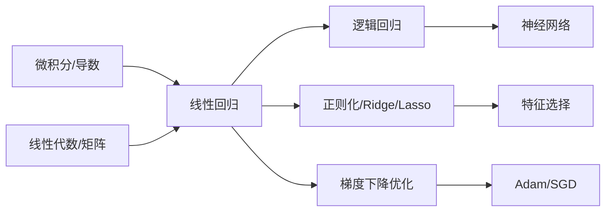
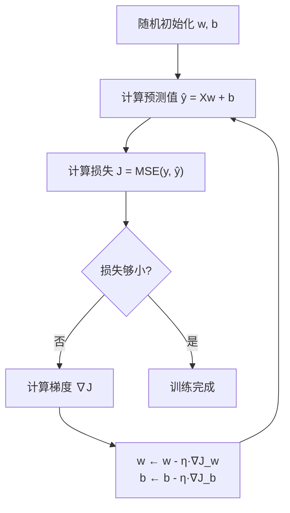

# 线性回归 (Linear Regression)

## 知识地图



## 前置知识

- 导数与偏导数
- 矩阵乘法与转置
- 均方误差 (MSE) 的基本概念
- 梯度下降的直观理解

---

## 为什么会出现 (Why)

**在"机器学习"这个词出现之前，人类已经在做预测了。**

最早的需求极其朴素：给定一批数据点，能否画一条直线来描述趋势？比如：

- 房价和面积的关系
- 身高和体重的关系
- 广告投入和销售额的关系

**传统做法**：人工画线，凭经验估参数。问题在于：
- 不可复现（不同人画不同线）
- 不可量化（无法评估哪条线"最好"）
- 不可扩展（特征多了无法画）

**前一代方案的缺陷**：根本没有"算法化"的拟合方法。最小二乘法（1805 年由 Legendre/Gauss 提出）提供了数学基础，但大规模计算需要等到计算机时代。

因此，线性回归成为**机器学习的第一课**——它是将"数据拟合"问题形式化为"优化问题"的最简原型。

---

## 解决什么问题 (Problem)

给定 $n$ 个样本，每个样本有 $d$ 个特征 $\mathbf{x}_i \in \mathbb{R}^d$ 和连续值目标 $y_i \in \mathbb{R}$，学习一个函数 $f(\mathbf{x}) = \hat{y}$ 使得 $\hat{y} \approx y$。

**一句话：用直线（或超平面）拟合数据，使预测误差最小。**

---

## 核心思想 (Core Idea)

> **一句话理解：找到一条直线，使得所有数据点到这条直线的"竖直距离平方和"最小。**

不学习任何非线性变换。模型就是 $\mathbf{w}^T\mathbf{x} + b$，训练就是找到最好的 $\mathbf{w}$ 和 $b$。

---

## 数学模型

### 假设函数

$$y = \mathbf{w}^T \mathbf{x} + b = \sum_{i=1}^{d} w_i x_i + b$$

**通俗解释：**

- 把 $w_i$ 理解成**每个特征的重要程度**（特征 $i$ 每变化 1 单位，预测值变化 $w_i$ 单位）
- 把 $b$ 理解成**基准值**（所有特征都为 0 时的预测值）
- 模型做的事：加权求和 + 偏移

### 损失函数 (MSE)

$$J(\mathbf{w}, b) = \frac{1}{2n} \sum_{i=1}^{n} (y_i - \hat{y}_i)^2 = \frac{1}{2n} \|\mathbf{y} - \mathbf{X}\mathbf{w} - b\|^2$$

**通俗解释：**

- $(y_i - \hat{y}_i)$ 是"预测差了多少"
- 平方让正负误差都变成惩罚（不平方的话正负会抵消）
- $\frac{1}{2}$ 是为了求导后消掉平方的 2，纯属数学便利
- 本质：**让"预测线"尽可能穿过"数据中心"**

### 损失函数曲面可视化



---

## 求解方法

### 1. 正规方程 (Normal Equation)

当 $\mathbf{X}^T \mathbf{X}$ 可逆时，有闭式解：

$$\hat{\mathbf{w}} = (\mathbf{X}^T \mathbf{X})^{-1} \mathbf{X}^T \mathbf{y}$$

**通俗解释：** 数学上"一步到位"求出最优解。不需要迭代，不需要学习率。但矩阵求逆的复杂度是 $O(d^3)$，特征数 $d$ 很大时直接爆炸。

**复杂度**：$O(d^3 + nd^2)$，特征数 $d$ 很大时不可行。

### 2. 梯度下降 (Gradient Descent)

$$\mathbf{w} \leftarrow \mathbf{w} - \eta \cdot \frac{1}{n} \mathbf{X}^T (\mathbf{X}\mathbf{w} - \mathbf{y})$$

**通俗解释：** 每次看一小步，沿着"下山最快的方向"走一步。迭代多次后到达谷底。

| 方法 | 优点 | 缺点 | 适用场景 |
|------|------|------|---------|
| 正规方程 | 一步到位，无需调参 | $O(d^3)$，大数据不适用 | $d < 10^4$ |
| 梯度下降 | 可处理大数据 | 需调学习率，需多轮迭代 | $d > 10^4$，深度学习 |

---

## 关键假设

| 假设 | 说明 | 违反后果 |
|------|------|---------|
| 线性 | 因变量与自变量线性相关 | 模型欠拟合，偏差大 |
| 独立性 | 观测值相互独立 | 标准误估计错误 |
| 同方差性 | 误差项方差恒定 | 预测区间不可靠 |
| 正态性 | 误差项服从正态分布 | 假设检验失效 |
| 无多重共线性 | 特征间不高度相关 | $\mathbf{w}$ 估计不稳定 |

---

## 最小可运行代码

```python
import numpy as np

class LinearRegression:
    def __init__(self, lr=0.01, epochs=1000):
        self.lr = lr
        self.epochs = epochs

    def fit(self, X, y):
        n, d = X.shape
        self.w = np.zeros(d)
        self.b = 0
        for _ in range(self.epochs):
            y_pred = X @ self.w + self.b
            dw = (1 / n) * X.T @ (y_pred - y)
            db = (1 / n) * np.sum(y_pred - y)
            self.w -= self.lr * dw
            self.b -= self.lr * db

    def predict(self, X):
        return X @ self.w + self.b

# 使用示例
# model = LinearRegression(lr=0.01, epochs=1000)
# model.fit(X_train, y_train)
# y_pred = model.predict(X_test)
```

```python
# Scikit-Learn 一行搞定
from sklearn.linear_model import LinearRegression
model = LinearRegression()
model.fit(X_train, y_train)
print(f"权重: {model.coef_}, 截距: {model.intercept_:.4f}")
```

---

## 工业界应用

| 场景 | 说明 | 为什么用线性回归 |
|------|------|-----------------|
| 房价预测 | 面积/地段/房龄 → 价格 | 可解释性强，银行需要知道每个因素影响多大 |
| 销量预测 | 广告投入/季节/价格 → 销量 | 快速 baseline，比复杂模型更稳定 |
| 金融风控 | 收入/负债/征信 → 信用评分 | 监管要求模型可解释（拒绝贷款必须给出理由） |
| A/B 测试 | 实验组 vs 对照组效果评估 | 线性回归 = 统计检验的工程化版本 |

---

## 优缺点

| 优点 | 缺点 |
|------|------|
| 可解释性强（权重 = 特征重要性） | 无法拟合非线性关系 |
| 计算简单，训练快 | 对异常值敏感（一个离群点拉偏整条线） |
| 有闭式解，无需调参 | 需要人工特征工程 |
| 无需大量数据 | 多重共线性导致系数不稳定 |

---

## 学完后建议继续学习

- [正则化 (Ridge/Lasso/ElasticNet)](ridge-lasso-elasticnet.md) — 解决过拟合和特征选择
- [逻辑回归](logistic-regression.md) — 从回归到分类的第一步
- [梯度下降详解](sgd-momentum.md) — 深度理解优化过程
- [MSE/MAE/Huber 损失函数](mse-mae-huber.md) — 损失函数的选择策略

---

## 高频面试题

**Q1: 线性回归为什么用 MSE 而不是绝对误差？**

MSE 可导且梯度连续，有闭式解；MSE 对大误差惩罚更重（平方），模型更关注离群点。MAE 在零点不可导，且无闭式解。但从鲁棒性角度，MAE 对异常值更鲁棒——实际中选择取决于数据特性。

**Q2: 正规方程什么时候不能用？**

当 $\mathbf{X}^T\mathbf{X}$ 不可逆时（特征数 > 样本数，或特征间完全线性相关）。解决方案：用伪逆 (np.linalg.pinv) 或改用梯度下降，或加 L2 正则化使矩阵可逆。

**Q3: 线性回归和神经网络的关系？**

线性回归 = 单层神经网络（无激活函数）。$y = \mathbf{w}^T\mathbf{x} + b$ 就是一个没有隐藏层、没有激活函数的"神经网络"。这是理解深度学习的最佳起点——神经网络就是堆叠多个线性变换 + 非线性激活。

**Q4: $R^2$ 是 0.95，说明模型很好吗？**

不一定。$R^2$ 高可能因为特征多（过拟合），也可能因为数据本身简单。需要结合残差图、调整 $R^2$、交叉验证综合判断。$R^2 = 0.95$ 但残差呈 U 形 → 模型有系统性偏差。
