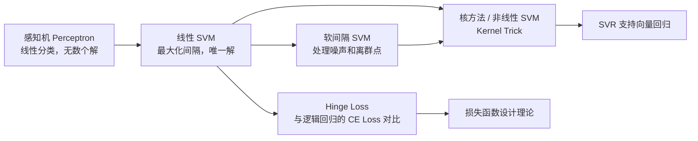
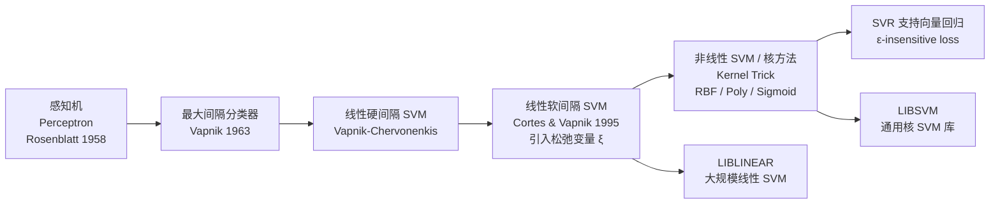

# Linear SVM (线性支持向量机)

## 知识地图



## 前置知识

- [感知机](linear-regression.md) 的基本概念——SVM 是感知机的"最优间隔"升级版
- [线性代数基础：内积、范数](linear-regression.md)
- [凸优化与拉格朗日乘子法](sgd-momentum.md)（了解即可）
- [逻辑回归](logistic-regression.md) 与分类损失函数
- [L1/L2 正则化](l1-l2-regularization.md) 的基本思想

## 为什么会出现 (Why)

1960 年代的感知机 (Perceptron) 能在线性可分数据上找到分割超平面，但存在两个致命问题：(1) 解不唯一——只要所有点分对就行，无数个解；(2) 对数据噪声和接近边界的点极其敏感。1970-1990 年代，Vapnik 和 Chervonenkis 提出了 SVM 的核心思想：不是"分对就行"，而是找到**离最近样本最远**的那个超平面。这个看似简单的"最大化间隔"策略背后有深刻的统计学习理论支撑——最大化间隔等价于最小化 VC 维的上界，因此 SVM 的泛化能力远超感知机。1995 年软间隔 SVM 和核方法的完善，奠定了 SVM 在 1990-2000 年代作为最强分类器之一的地位。

## 解决什么问题 (Problem)

线性 SVM 解决的是**二分类问题**，核心目标是在线性可（近似）分的数据上找到泛化能力最强的决策边界。它不追求"训练集上全对"，而追求"对未见数据最鲁棒"。

## 核心思想 (Core Idea)

SVM 不关心"所有样本都分对"，而是追求"离最近样本尽可能远"——它在各类样本之间画一条"最宽的高速公路"，路的两侧边界由少数关键样本点（**支持向量**）撑起。这种最大化间隔的策略赋予了 SVM 极强的泛化能力。

---

## 数学模型/公式

### 硬间隔 SVM（线性可分）

$$
\min_{\mathbf{w}, b} \frac{1}{2} \|\mathbf{w}\|^2
$$

$$
\text{s.t.} \quad y_i (\mathbf{w}^T \mathbf{x}_i + b) \geq 1, \quad \forall i
$$

**通俗解释：** 想象你要在两类点之间修一条高速公路。$\|\mathbf{w}\|^2$ 的倒数决定了路有多宽——路越宽（$\|\mathbf{w}\|$ 越小），新来的车越不容易撞上边界。约束条件 $y_i(\mathbf{w}^T \mathbf{x}_i + b) \geq 1$ 的意思是：每辆车至少离路中间 1 个单位的距离。如果有一辆车紧贴路边（等式成立），它就是"支持向量"——路的宽度完全由这几辆车决定，其他离得远的车拆掉路也不会变。

**几何间隔**：$\gamma = \frac{2}{\|\mathbf{w}\|}$——两个类之间"路"的宽度。最小化 $\|\mathbf{w}\|^2$ 等价于最大化间隔。

### 软间隔 SVM（线性不可分）

引入松弛变量 $\xi_i \geq 0$，允许部分样本越过边界：

$$
\min_{\mathbf{w}, b, \xi} \frac{1}{2} \|\mathbf{w}\|^2 + C \sum_{i=1}^{n} \xi_i
$$

$$
\text{s.t.} \quad y_i (\mathbf{w}^T \mathbf{x}_i + b) \geq 1 - \xi_i, \quad \xi_i \geq 0
$$

**通俗解释：** 现实数据总有噪声和离群点，硬要求所有点都完美分开反而有害。软间隔允许一些点"踩线"甚至"跨过边界到对面"，但每犯一次错就要交一笔罚款 $\xi_i$。参数 $C$ 就是罚款的"力度"——$C$ 很大时宁可用窄路也不准犯规（硬间隔），$C$ 很小时宁可让几辆车跨线也要把路修宽（更关注整体泛化）。这就像交警执法：严格执法（大 C）vs 灵活执法（小 C）。

- $C \to \infty$：硬间隔，零容忍错误
- $C \to 0$：软间隔，允许更多错误，间隔更大
- $C$ 是偏差-方差权衡的核心旋钮

### 对偶问题与核技巧的入口

通过拉格朗日对偶性转换：

$$
\max_{\alpha} \sum_{i=1}^{n} \alpha_i - \frac{1}{2} \sum_{i=1}^{n} \sum_{j=1}^{n} \alpha_i \alpha_j y_i y_j (\mathbf{x}_i^T \mathbf{x}_j)
$$

$$
\text{s.t.} \quad 0 \leq \alpha_i \leq C, \quad \sum_{i=1}^{n} \alpha_i y_i = 0
$$

**通俗解释：** 拉格朗日对偶就像把一个问题从"正面进攻"变成"侧面迂回"。原始问题求解 $\mathbf{w}$（d 维向量，d 是特征数），对偶问题求解 $\alpha$（n 维向量，n 是样本数）。在高维特征空间中，对偶形式更高效。更重要的是，对偶问题中特征只以内积 $\mathbf{x}_i^T \mathbf{x}_j$ 出现——这意味着只要我们能算两个样本的"相似度"，根本不需要知道它们的具体坐标。这就是**核技巧**的入口：把内积替换成核函数 $K(\mathbf{x}_i, \mathbf{x}_j)$，SVM 就能在隐式高维空间中工作。

**关键观察**：
- 只有 $\alpha_i > 0$ 的点才是**支持向量**（通常仅占训练集的 10%-20%）
- 内积 $\mathbf{x}_i^T \mathbf{x}_j$ 的位置可以直接替换为核函数 $K(\mathbf{x}_i, \mathbf{x}_j)$——这是非线性 SVM 的核心技巧

### Hinge Loss 视角（SVM 的现代理解）

SVM 等价于 Hinge Loss + L2 正则化：

$$
J(\mathbf{w}) = \frac{1}{2} \|\mathbf{w}\|^2 + C \sum_{i=1}^{n} \max(0, 1 - y_i(\mathbf{w}^T \mathbf{x}_i + b))
$$

$$
\ell_{\text{hinge}}(y, \hat{y}) = \max(0, 1 - y\hat{y})
$$

**通俗解释：** Hinge Loss 的"脾气"是：正确分类且置信度足够高（$y\hat{y} \geq 1$）时，一分钱不罚；一旦不够确信（$0 < y\hat{y} < 1$）或干脆分错了（$y\hat{y} < 0$），就线性罚款。这和交叉熵不同——交叉熵即使分对了也还有微小的惩罚，会一直"挑剔"下去。Hinge Loss 这种"过关就行"的特性导致 SVM 的解是稀疏的（只有少数支持向量影响边界），而逻辑回归的解依赖所有样本。

当 $y\hat{y} \geq 1$（样本在间隔外）时，loss = 0；当 $y\hat{y} < 1$ 时产生惩罚。

---

## 可视化展示

### Hinge Loss vs 其他分类损失

```echarts
return {
  xAxis: { type: 'value', min: -2, max: 3, name: 'y·ŷ (margin)' },
  yAxis: { type: 'value', min: 0, max: 5, name: 'Loss' },
  legend: { top: 28,  data: ['Hinge Loss', 'Logistic (CE)', '0-1 Loss'] },
  series: [
    {
      name: 'Hinge Loss', type: 'line',
      lineStyle: { color: '#2c3e50', width: 2.5 },
      data: (function() { const d = []; for (let i = -2; i <= 3; i += 0.02) d.push([i, Math.max(0, 1 - i)]); return d; })()
    },
    {
      name: 'Logistic (CE)', type: 'line', smooth: true,
      lineStyle: { color: '#2980b9', width: 2 },
      data: (function() { const d = []; for (let i = -2; i <= 3; i += 0.02) d.push([i, Math.log(1 + Math.exp(-i))]); return d; })()
    },
    {
      name: '0-1 Loss', type: 'line',
      lineStyle: { color: '#c0392b', width: 1.5, type: 'dashed' },
      data: (function() { const d = []; for (let i = -2; i <= 3; i += 0.02) d.push([i, i >= 0 ? 0 : 1]); return d; })()
    }
  ],
  tooltip: { trigger: 'axis' },
  grid: { left: 60, right: 20, top: 40, bottom: 60 }
}
```

Hinge Loss 在 $y\hat{y} \geq 1$ 后直接归零——SVM 只关心"是否正确且足够确信"，不追求完美概率校准。

### 参数 $C$ 对决策边界的影响

$C$ 越小 → 间隔越大 → 允许更多误分类 → 模型越简单（偏差增大）。

```echarts
return {
  xAxis: { type: 'value', min: 0.01, max: 100, name: 'C (log scale)' },
  yAxis: { type: 'value', min: 0, max: 1, name: '正则化强度' },
  series: [{
    type: 'line', smooth: true,
    data: (function() { const d = []; for (let c = 0.01; c <= 100; c *= 1.1) d.push([Math.log10(c), 1 / (1 + c)]); return d; })(),
    lineStyle: { color: '#2c3e50', width: 2 },
    areaStyle: { color: 'rgba(44, 62, 80, 0.1)' }
  }],
  tooltip: { trigger: 'axis', formatter: 'C = {b}<br/>正则化强度 ≈ {c}' },
  grid: { left: 60, right: 20, top: 20, bottom: 60 }
}
```

---

## 最小可运行代码

### Scikit-learn

```python
from sklearn.svm import LinearSVC, SVC

# 线性 SVM（快速，基于 LIBLINEAR）
clf = LinearSVC(C=1.0, loss='hinge', max_iter=5000)

# 通用 SVM（支持核函数，基于 LIBSVM）
clf = SVC(C=1.0, kernel='linear')
clf.fit(X_train, y_train)
```

### NumPy 手写（Hinge Loss 梯度下降版）

```python
import numpy as np

class LinearSVM:
    def __init__(self, C=1.0, lr=0.001, epochs=1000):
        self.C = C
        self.lr = lr
        self.epochs = epochs

    def fit(self, X, y):
        n, d = X.shape
        self.w = np.zeros(d)
        self.b = 0
        for _ in range(self.epochs):
            margins = y * (X @ self.w + self.b)
            mask = margins < 1                    # 仅更新 margin < 1 的样本
            dw = self.w - self.C * (X[mask].T @ y[mask])
            db = -self.C * np.sum(y[mask])
            self.w -= self.lr * dw
            self.b -= self.lr * db

    def predict(self, X):
        return np.sign(X @ self.w + self.b)
```

---

## 工业界应用

| 应用场景 | 为什么使用 SVM | 优点 | 缺点 |
|----------|---------------|------|------|
| 文本分类 / 情感分析 | 高维稀疏特征空间中 SVM 表现优异，线性核即可 | 训练快，对稀疏数据天然友好 | 概率校准需额外处理（Platt Scaling） |
| 图像识别（传统方法） | 结合 HOG/SIFT 特征 + 线性 SVM 曾是行人检测标配 | 小样本下泛化能力强 | 深度学习兴起后逐渐被替代 |
| 生物信息学（基因表达分类） | 样本少（n < 100）、特征多（d > 10000）的典型场景 | 最大化间隔策略在 n << d 时极其有效 | 超参数 C 需谨慎调优 |
| 异常检测 (One-Class SVM) | 只有正常样本时训练边界 | 无需异常样本即可学习"正常范围" | 对核参数敏感 |
| 手写数字识别 | 结合 RBF 核可达 99%+ 准确率 | 小样本表现优于早期神经网络 | 大样本下训练时间不可行 |

---

## 优缺点对比

| 优点 | 缺点 |
|------|------|
| 数学理论坚实（凸优化，全局最优解） | 不直接输出概率（需额外步骤如 Platt Scaling） |
| 仅依赖支持向量，稀疏解，内存高效 | 非线性核时训练 O(n^2)-O(n^3)，不适合大样本 |
| 最大化间隔 → 强泛化能力 | 对超参数 C 和核参数敏感 |
| 通过核函数隐式处理高维映射 | 原始形式不直接处理多分类（需 OVR/OVO） |
| Hinge Loss 在 margin >= 1 时梯度为 0，训练稳定 | 特征维度极高时线性 SVM 不如带正则化的逻辑回归灵活 |

---

## 对比表格

| 维度 | 感知机 | 线性 SVM (硬间隔) | 线性 SVM (软间隔) | 逻辑回归 |
|------|--------|-------------------|-------------------|----------|
| 目标 | 找一个可行解 | 最大化间隔（唯一解） | 平衡间隔与错误 | 最大化似然概率 |
| 输出 | 离散标签 | 离散标签 | 离散标签 | 概率值 |
| 损失函数 | 0-1 Loss (不可导) | 约束优化 | Hinge Loss | Cross-Entropy |
| 能否处理线性不可分 | 否（无限振荡） | 否 | 部分（用软间隔容忍） | 否（除非多项式特征） |
| 支持向量 | 无概念 | 有（边界上） | 有（边界内/上/错分） | 无——所有点都影响决策 |
| 概率校准 | 无 | 无 | 无（或 Platt Scaling 后处理） | 天然输出 |
| 对离群点 | 极度敏感 | 敏感（硬约束） | 鲁棒（C 控制） | 中等鲁棒 |

---

## 模型演化路线



---

## 学完后建议继续学习

- [非线性 SVM / 核方法](nonlinear-svm.md) —— 理解 Kernel Trick 如何让 SVM 处理非线性数据
- [逻辑回归](logistic-regression.md) —— 与 SVM 形成概率输出 vs 间隔最大化的对比
- [L1/L2 正则化](l1-l2-regularization.md) —— 理解 L2 正则化在 SVM 目标函数中的作用
- [交叉熵](cross-entropy.md) —— 对比 Hinge Loss 和 Cross-Entropy 的设计哲学
- [SGD / Momentum](sgd-momentum.md) —— 理解梯度下降优化 SVM 的实践

---

## 高频面试题

**Q1: SVM 为什么要最大化间隔？不最大化会怎样？**

标准答案：最大化间隔来自于统计学习理论中的 VC 维分析。间隔越大，模型 VC 维的上界越小，泛化误差的上界也越小。直观理解：如果边界很窄，测试数据稍微偏离训练分布就可能被错分。感知机能找到无数个分离超平面，但选择离数据最近的边界最远的那个，是对未见数据最"安全"的选择。这也是 SVM 在小样本场景下泛化能力强于很多复杂模型的根本原因。

**Q2: 什么是支持向量？为什么 SVM 的解是稀疏的？**

标准答案：支持向量是那些落在大间隔边界上或边界内的训练样本——具体说，是对应拉格朗日乘子 $\alpha_i > 0$ 的点。从 Hinge Loss 视角理解：Hinge Loss 在 $y\hat{y} \geq 1$ 时 loss 为 0、梯度为 0，这些"已经足够好"的样本对训练没有贡献。只有 margin < 1 的样本（支持向量）产生非零梯度，驱动参数更新。实际中支持向量只占总样本的 10%-20%，这意味着训练好的 SVM 预测时只需存储和计算支持向量，而不是全部训练数据。

**Q3: 参数 C 的作用是什么？过大或过小会怎样？**

标准答案：$C$ 是软间隔 SVM 中权衡"间隔大小"与"错误容忍度"的超参数。$C$ 大 → 惩罚重，不允许犯错 → 间隔窄，偏向过拟合（高方差）；$C$ 小 → 惩罚轻，允许更多点跨边界 → 间隔宽，偏向欠拟合（高偏差）。$C$ 控制的是正则化强度的倒数：目标函数 $\frac{1}{2}\|\mathbf{w}\|^2 + C\sum\xi_i$ 中，$C$ 越大正则化越弱。调参时通常在对数尺度上搜索：`[0.001, 0.01, 0.1, 1, 10, 100, 1000]`。

**Q4: SVM 和逻辑回归的核心区别是什么？什么时候选哪个？**

标准答案：(1) 目标不同：SVM 追求最大化分类间隔（几何视角），逻辑回归追求最大化似然概率（概率视角）。(2) 损失函数不同：SVM 用 Hinge Loss (过关即止)，逻辑回归用 Cross-Entropy (持续优化)。(3) 输出不同：SVM 输出距离/标签，逻辑回归输出概率。(4) 解的稀疏性不同：SVM 的解仅依赖支持向量（稀疏），逻辑回归的解依赖所有样本（稠密）。选择建议：需要概率输出时选逻辑回归；高维稀疏数据（如文本）且样本量中等时选 SVM；特征数远大于样本数时（如基因表达数据）选线性 SVM。

**Q5: 为什么 SVM 的对偶问题引入了核技巧的可能性？**

标准答案：原始问题中，$\mathbf{w}$ 是 d 维向量（d = 特征数），需要显式表示特征映射 $\phi(\mathbf{x})$。如果映射到无限维，$\mathbf{w}$ 无法表示。对偶问题中，优化变量变为 $\alpha$（n 维），且特征仅以内积形式 $\mathbf{x}_i^T \mathbf{x}_j$ 出现。核函数 $K(\mathbf{x}_i, \mathbf{x}_j) = \langle \phi(\mathbf{x}_i), \phi(\mathbf{x}_j) \rangle$ 直接计算高维空间的内积，不需要显式计算 $\phi(\mathbf{x})$。RBF 核对应的是一个无限维特征空间的内积——这在原始问题中无法表示，但在对偶问题中只需 $O(d)$ 的核函数计算即可。
