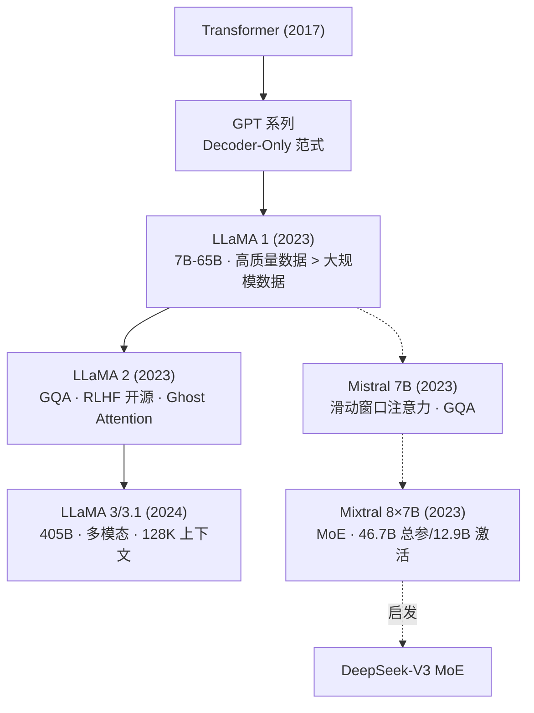
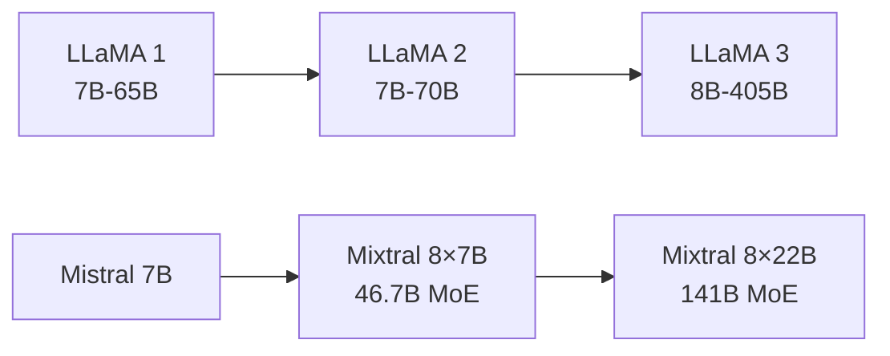
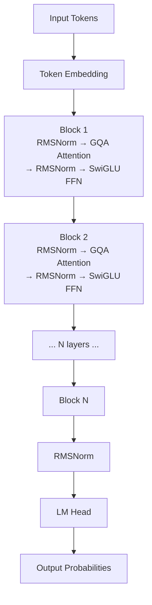
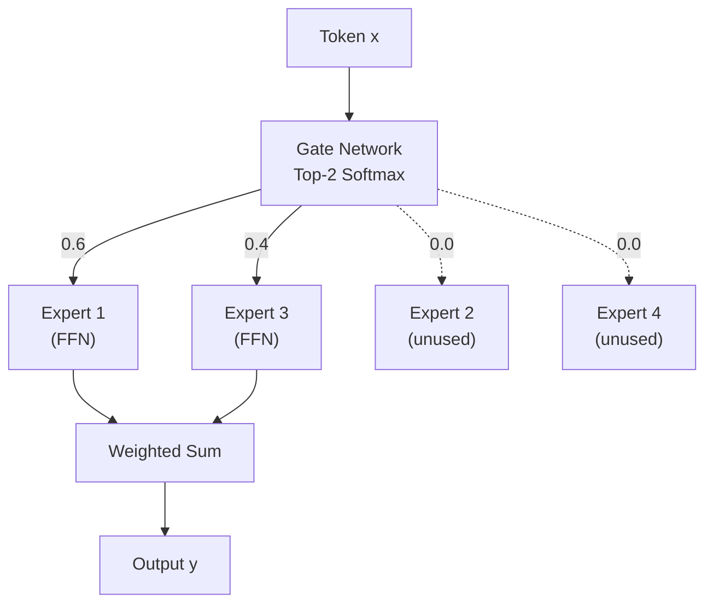

# LLaMA / Mistral / Mixtral (MoE)

## 知识地图



## 前置知识

- **Transformer Decoder-Only 架构**：自回归生成、Causal Mask
- **GPT 系列设计哲学**：预训练 → 微调/对齐
- **注意力机制变体**：MHA、MQA、GQA 的区别与演进
- **位置编码**：Absolute Position、RoPE 旋转位置编码
- **MoE 基础概念**：门控网络、稀疏激活、负载均衡

## 模型演化路线



| Model | Year | Params | Key Innovation |
|-------|------|--------|----------------|
| LLaMA 1 | 2023 | 7B-65B | 高质量小数据 > 低质量大数据; Pre-Norm + SwiGLU + RoPE |
| LLaMA 2 | 2023 | 7B-70B | GQA 减少 KV Cache; 开源 RLHF 完整流程; Ghost Attention |
| LLaMA 3/3.1 | 2024 | 8B-405B | 多模态; 128K 上下文; 训练数据扩充至 15T tokens |
| Mistral 7B | 2023 | 7B | Sliding Window Attention; GQA; Rolling Buffer Cache |
| Mixtral 8×7B | 2023 | 46.7B (12.9B active) | 开源 MoE; Top-2 门控; 7B 推理成本达 70B 级别效果 |

## 为什么会出现 (Why)

GPT 系列虽然强大，但一直闭源。学术界和工业界对"模型+数据+算力的配方"缺乏可复现的研究。Meta 开源 LLaMA 的初衷是推动开放研究——暴露模型架构、训练数据配比、超参数的选择。Mistral AI 则进一步证明：**不需要大公司级别的资源，也能设计和训练出世界级模型**。Mistral 7B 仅用 LLaMA 2 7B 规模的参数就达到了 LLaMA 2 13B 的效果。

开源大模型的出现打破了"不开源 = 性能好"的旧有认知，推动整个生态从封闭走向开放。

## 解决什么问题 (Problem)

- **开放性不足**：GPT 系列闭源，研究者无法深入了解模型行为、无法微调部署
- **成本壁垒**：训练 175B+ 模型需要数千万美元。LLaMA 证明高质量数据配合"小"模型也能接近大模型效果
- **推理效率**：大模型推理慢、显存占用大。GQA、滑动窗口等技术大幅降低 KV Cache
- **规模-性能平衡**：MoE 架构在几乎不增加推理成本的前提下大幅提升模型容量和性能

## 核心思想 (Core Idea)

开源证明"数据质量远大于数据量"，通过架构创新（GQA、RoPE、SwiGLU、MoE）在有限参数下实现最大性能和推理效率。

---

## LLaMA 系列

### LLaMA 1 (2023)

Meta 推出的开源大模型，证明了**高质量小数据 > 低质量大数据**。

| 版本 | 参数量 | $d_{model}$ | 头数 | 层数 |
|------|--------|-------------|------|------|
| 7B | 6.7B | 4096 | 32 | 32 |
| 13B | 13.0B | 5120 | 40 | 40 |
| 33B | 32.5B | 6656 | 52 | 60 |
| 65B | 65.2B | 8192 | 64 | 80 |

### 架构改进

1. **Pre-Norm**：用 RMSNorm 替代 LayerNorm
2. **SwiGLU**：替代 ReLU 激活
3. **RoPE**：旋转位置编码

### LLaMA 2

#### 关键改进

- **GQA (Grouped-Query Attention)**：减少 KV Cache
- **更长上下文**：4096 tokens
- **RLHF 对齐**：开源 SFT + RM + PPO 流程
- **Ghost Attention**：多轮对话的指令遵循

### LLaMA 3 / 3.1

- 支持多模态
- 128K 上下文窗口
- 显著提升推理和代码能力

---

## Mistral 7B

### 核心创新

1. **滑动窗口注意力** (Window=4096)
2. **分组查询注意力 (GQA)**
3. **滚动缓冲区缓存 (Rolling Buffer Cache)**

7B 参数达到超越 LLaMA 2 13B 的效果。

---

## Mixtral 8×7B (MoE)

### Mixture of Experts (MoE)

$$\mathbf{y} = \sum_{i=1}^{E} g_i(\mathbf{x}) \cdot \text{Expert}_i(\mathbf{x})$$

**通俗解释：** 输入 $\mathbf{x}$ 不经过所有专家，而是由门控网络 $g(\mathbf{x})$ 选择最相关的几个专家（这里是 Top-2）来处理，输出是专家输出的加权和。相当于不是所有人都参与决策，而是"谁懂谁说话"。

- 8 个专家，每次选择 Top-2
- 总参数量：46.7B（但推理时仅激活 12.9B）
- 门控网络：$\text{softmax}(\text{TopK}(\mathbf{x} \cdot \mathbf{W}_g, k=2))$

### MoE 的优势

| | Dense | MoE |
|------|-------|-----|
| 总参数 | 大 | 更大 |
| 每 token 激活参数 | 全部 | 部分 |
| 推理速度 | 固定 | 更快（激活更少） |
| 训练难度 | 简单 | 需负载均衡 |

### 负载均衡损失

防止门控网络总是选同样的几个专家：

$$L_{aux} = \alpha \cdot E \cdot \sum_{i=1}^{E} f_i \cdot P_i$$

其中 $f_i$ 是分配给专家 $i$ 的 token 比例，$P_i$ 是路由概率均值。

**通俗解释：** 如果门控网络总是选专家 1 和 2，其他 6 个专家就浪费了。负载均衡损失惩罚这种"偏心"行为——当某个专家被分配的比例 $f_i$ 越高，同时它的平均路由概率 $P_i$ 越高时，惩罚越大。$\alpha$ 通常设为 0.01，太小无效，太大会伤害模型质量。

---

## 架构对比

### 各模型架构细节

| 特性 | LLaMA 1 | LLaMA 2 | LLaMA 3 | Mistral 7B | Mixtral 8×7B |
|------|---------|---------|---------|------------|--------------|
| 注意力 | MHA | GQA | GQA | GQA + Sliding Window | GQA + Sliding Window |
| 激活函数 | SwiGLU | SwiGLU | SwiGLU | SiLU | SiLU |
| 归一化 | RMSNorm (Pre) | RMSNorm (Pre) | RMSNorm (Pre) | RMSNorm (Pre) | RMSNorm (Pre) |
| 位置编码 | RoPE | RoPE | RoPE | RoPE | RoPE |
| MoE | 否 | 否 | 否 | 否 | 是 (Top-2, 8 experts) |
| 最大上下文 | 2048 | 4096 | 128K | 32K (sliding) | 32K |
| 词表大小 | 32K | 32K | 128K | 32K | 32K |

### 注意力机制对比

| 类型 | K/V 头数 | KV Cache 大小 | 推理速度 | 表现力 |
|------|----------|--------------|---------|--------|
| MHA | = Q 头数 (n) | n × 2d_k | 慢 | 最强 |
| GQA | m < n (如 n=8, m=2) | m × 2d_k | 中 | 接近 MHA |
| MQA | 1 | 2d_k | 快 | 稍弱 |

## 数学模型/公式

### RMSNorm

$$\text{RMSNorm}(x) = \frac{x}{\sqrt{\frac{1}{d}\sum_{i=1}^d x_i^2 + \epsilon}} \cdot \gamma$$

**通俗解释：** 传统的 LayerNorm 同时减均值再除标准差（两步）。RMSNorm 只除标准差（RMS），去掉了减均值的步骤。计算更简单，训练速度更快，而且实验证明去掉均值中心化几乎不影响效果。

### RoPE (旋转位置编码)

$$\text{RoPE}(q, k, pos_m, pos_n) = (R^m q) \cdot (R^n k)^T = q^T R^{n-m} k$$

其中 $R$ 是旋转矩阵，使注意力分数仅依赖于相对位置 $n-m$。

**通俗解释：** 绝对位置编码在位置 100 和 101 学到的东西不能直接迁移到位置 200 和 201。RoPE 通过旋转向量来编码位置——两个 token 的注意力权重只取决于它们的相对距离，而非绝对位置。就像两个人合作，重要的是"我们离得多远"而不是"我们在哪排"。

### SwiGLU 激活函数

$$\text{SwiGLU}(x) = (x \cdot W_1 \odot \text{SiLU}(x \cdot W_2)) \cdot W_3$$

其中 $\text{SiLU}(x) = x \cdot \sigma(x)$。

**通俗解释：** 传统的 FFN 是两层线性+ReLU。SwiGLU 用了一个"门控"机制——一路是线性变换，另一路是带 SiLU 激活的线性变换，两路逐元素相乘。这给 FFN 层增加了选择性，表现力更强，已被几乎所有新模型采用。

### MoE 门控

$$g(\mathbf{x}) = \text{softmax}(\text{TopK}(\mathbf{x} \cdot \mathbf{W}_g, k=2))$$

其中 TopK 保留最大的 k 个值，其余设为 $-\infty$（softmax 后为 0）。

**通俗解释：** 输入乘以门控矩阵得到一个分数向量（长度=专家数），只保留 Top-2 最高分，其他归零，再 softmax 归一化。结果就是只有两个非零权重，分别给两个专家——实现了"稀疏激活"。

## 可视化展示

### LLaMA/Mistral 架构



### MoE 路由示意



## 最小可运行代码

### 使用 transformers 加载 LLaMA

```python
from transformers import AutoTokenizer, AutoModelForCausalLM
import torch

# LLaMA 3 (需要 HuggingFace 授权或使用社区版本)
model_name = "meta-llama/Meta-Llama-3-8B-Instruct"
tokenizer = AutoTokenizer.from_pretrained(model_name)
model = AutoModelForCausalLM.from_pretrained(
    model_name,
    torch_dtype=torch.bfloat16,
    device_map="auto",
)

messages = [
    {"role": "system", "content": "You are a helpful assistant."},
    {"role": "user", "content": "Explain what RoPE is in one sentence."},
]
inputs = tokenizer.apply_chat_template(
    messages, return_tensors="pt", add_generation_prompt=True
).to(model.device)

outputs = model.generate(inputs, max_new_tokens=128, temperature=0.7)
print(tokenizer.decode(outputs[0], skip_special_tokens=True))
```

### 使用 transformers 加载 Mistral

```python
from transformers import AutoTokenizer, AutoModelForCausalLM

model_name = "mistralai/Mistral-7B-Instruct-v0.3"
tokenizer = AutoTokenizer.from_pretrained(model_name)
model = AutoModelForCausalLM.from_pretrained(
    model_name,
    torch_dtype="auto",
    device_map="auto",
)

prompt = "Write a Python function to compute Fibonacci numbers efficiently:"
inputs = tokenizer(prompt, return_tensors="pt").to(model.device)
outputs = model.generate(**inputs, max_new_tokens=256, temperature=0.7)
print(tokenizer.decode(outputs[0], skip_special_tokens=True))
```

### 使用 transformers 加载 Mixtral MoE

```python
from transformers import AutoTokenizer, AutoModelForCausalLM

model_name = "mistralai/Mixtral-8x7B-Instruct-v0.1"
tokenizer = AutoTokenizer.from_pretrained(model_name)
model = AutoModelForCausalLM.from_pretrained(
    model_name,
    torch_dtype="auto",
    device_map="auto",  # 自动分片到多卡
)

messages = [
    {"role": "user", "content": "Compare MoE and Dense architectures."},
]
inputs = tokenizer.apply_chat_template(
    messages, return_tensors="pt", add_generation_prompt=True
).to(model.device)
outputs = model.generate(inputs, max_new_tokens=256)
print(tokenizer.decode(outputs[0], skip_special_tokens=True))
```

### GQA 简化实现

```python
import torch
import torch.nn as nn

class GroupedQueryAttention(nn.Module):
    """GQA: Q heads 分组共享 K/V heads"""
    def __init__(self, dim=4096, n_q_heads=32, n_kv_heads=8):
        super().__init__()
        self.n_q_heads = n_q_heads
        self.n_kv_heads = n_kv_heads
        self.head_dim = dim // n_q_heads
        self.n_groups = n_q_heads // n_kv_heads  # 每组 Q heads 共享一对 K/V

        self.W_q = nn.Linear(dim, dim, bias=False)
        self.W_k = nn.Linear(dim, n_kv_heads * self.head_dim, bias=False)
        self.W_v = nn.Linear(dim, n_kv_heads * self.head_dim, bias=False)
        self.W_o = nn.Linear(dim, dim, bias=False)

    def forward(self, x):
        B, N, D = x.shape
        Q = self.W_q(x).view(B, N, self.n_q_heads, self.head_dim).transpose(1, 2)
        K = self.W_k(x).view(B, N, self.n_kv_heads, self.head_dim).transpose(1, 2)
        V = self.W_v(x).view(B, N, self.n_kv_heads, self.head_dim).transpose(1, 2)

        # 每个 KV head 被 n_groups 个 Q head 共享
        K = K.repeat_interleave(self.n_groups, dim=1)  # [B, n_q_heads, N, d]
        V = V.repeat_interleave(self.n_groups, dim=1)

        attn = torch.softmax(Q @ K.transpose(-2, -1) / (self.head_dim ** 0.5), dim=-1)
        out = (attn @ V).transpose(1, 2).contiguous().view(B, N, D)
        return self.W_o(out)
```

## 工业界应用

| 产品/服务 | 底层模型 | 用途 |
|-----------|----------|------|
| Meta AI (WhatsApp/Instagram) | LLaMA 3 | 社交通讯 AI 助手 |
| Perplexity AI | LLaMA 3 (部分) | AI 搜索引擎 |
| Mistral Le Chat | Mistral Large / Mixtral | 在线对话助手 |
| Together AI | LLaMA / Mistral 全系列 | 模型托管推理服务 |
| Groq | LLaMA 3 / Mixtral | 极速推理 API |
| HuggingChat | Mixtral 8×7B | 开源 ChatGPT 替代 |
| Snowflake Arctic | LLaMA 系列微调 | 企业级 SQL + 文本推理 |

## 对比表格：开源模型系列

| 维度 | LLaMA 3 405B | Mistral 7B | Mixtral 8×7B | DeepSeek-V3 |
|------|-------------|------------|--------------|-------------|
| 总参数 | 405B | 7B | 46.7B | 671B |
| 激活参数 | 405B | 7B | 12.9B | 37B |
| MoE | 否 | 否 | 是 | 是 |
| 开源 | 是 (需授权) | Apache 2.0 | Apache 2.0 | 是 |
| 注意力 | GQA | GQA + SWA | GQA + SWA | MLA |
| 上下文 | 128K | 32K | 32K | 128K |
| 多模态 | 是 | 否 | 否 | 否 |

## 学完后建议继续学习

1. **Qwen / DeepSeek / ChatGLM** — 国产大模型的架构创新和技术路线
2. **Gemma / Phi / Falcon** — 小型大语言模型设计与蒸馏
3. **MoE 深入** — DeepSpeed-MoE、负载均衡策略、Expert Parallelism
4. **量化部署** — AWQ、GPTQ、GGUF 格式让模型跑在消费级硬件
5. **vLLM / SGLang** — 开源模型的推理优化与在线服务

## 高频面试题

### Q1: LLaMA 相比 GPT 系列做了哪些架构创新？

**标准答案：** LLaMA 在 GPT 的 Decoder-Only 基础上引入了三个关键改进：（1）**RMSNorm** 替代 LayerNorm，移除了均值中心化操作，计算更快且效果相当；（2）**SwiGLU** 替代 ReLU 激活函数，通过门控机制增加 FFN 层的选择性，提升模型表现力；（3）**RoPE** 旋转位置编码替代绝对位置编码，使注意力分数仅依赖相对位置，支持更长的外推。这三个改进被后续几乎所有开源模型（Mistral、Qwen、DeepSeek）继承。

### Q2: MHA、MQA、GQA 的区别是什么？为什么要从 MHA 过渡到 GQA？

**标准答案：** **MHA**（Multi-Head Attention）每个 Q head 都有独立的 K、V head，KV Cache 最大，推理最慢但表现力最强；**MQA**（Multi-Query Attention）所有 Q head 共享一组 K、V，KV Cache 最小，推理最快但表现力有所下降；**GQA**（Grouped-Query Attention）是折中方案——将 Q heads 分成若干组，每组共享一对 K、V。GQA 几乎保留了 MHA 的表现力，同时将 KV Cache 减少到 1/n_groups，大幅提升长序列推理效率。LLaMA 2 采用 GQA（n_kv_heads=8, n_q_heads=32, 即每组 4 个 Q 共享一对 KV）。

### Q3: Mistral 7B 为何能用 7B 参数达到 LLaMA 2 13B 的效果？

**标准答案：** 三个关键设计：（1）**滑动窗口注意力**（Sliding Window Attention, Window=4096）——每个 token 只 attend 前 4096 个 token，而非全部历史，将注意力计算复杂度从 O(n^2) 降到 O(n*W)，支持更长序列；（2）**GQA** 减少 KV Cache，提高推理效率；（3）**滚动缓冲区缓存**（Rolling Buffer Cache）——KV Cache 只保留窗口内的 token，窗口外的自动丢弃。这类似于卷积的视野——近处看得清楚，远处的通过逐层传递间接看到。再加上精心筛选的训练数据，在同参数级别做到了更好的效果。

### Q4: MoE（Mixture of Experts）的核心问题是什么，如何解决？

**标准答案：** MoE 有两个核心问题：（1）**负载不均衡**——门控网络可能总是选择某几个"热门"专家，其他专家闲置。解决方法是引入负载均衡损失 $L_{aux} = \alpha \cdot E \cdot \sum f_i \cdot P_i$，惩罚专家使用分布的不均匀。（2）**通信开销**——专家分布在多张 GPU 上，token 路由时需要跨卡通信（All-to-All）。解决方法是使用专家并行策略，每次只路由激活的专家，并且通过 Top-2 门控保证每个 token 只访问少量专家。Mixtral 通过这两个技术成功将 46.7B 总参数压缩到 12.9B 激活参数，实现 7B 的推理成本得到接近 70B 的效果。

### Q5: LLaMA 开源对 AI 生态有什么影响？

**标准答案：** LLaMA 的开源标志着 AI 从"封闭寡头"时代进入"开源繁荣"时代：（1）**降低研究门槛**——学术界和个人开发者可以在开源模型上做微调、对齐、量化等研究，不再依赖商业 API；（2）**催生生态**——Mistral、Qwen、DeepSeek 等纷纷开源，形成良性竞争；（3）**推动工程创新**——量化（GGUF）、推理框架（vLLM、llama.cpp）因开源模型的需求而迅速发展；（4）**隐私与可控性**——企业可以在私有环境部署模型，数据不出域。LLaMA 证明了开源模型可以接近甚至在某些方面超越闭源模型。
