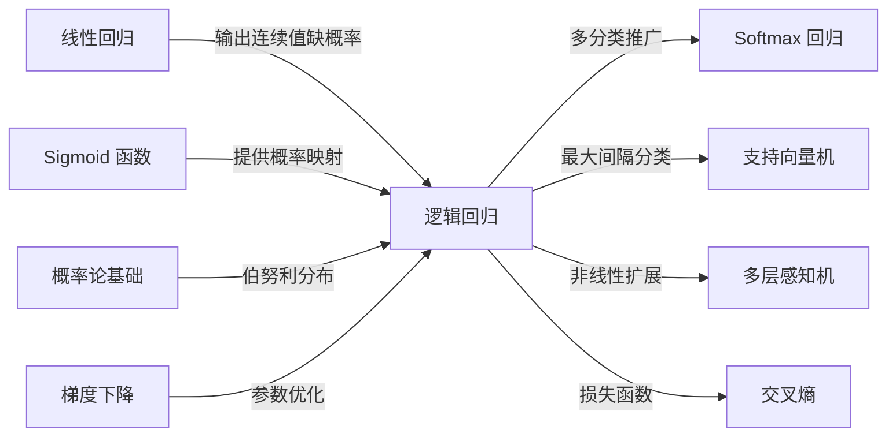

# Logistic Regression (逻辑回归)

## 知识地图



## 前置知识

- [线性回归](linear-regression.md)：理解线性组合 $\mathbf{w}^T\mathbf{x} + b$ 和梯度下降
- [Sigmoid / Tanh](sigmoid-tanh.md)：理解 Sigmoid 函数及其"将实数压缩到概率"的能力
- [交叉熵](cross-entropy.md)：理解信息论中的交叉熵概念，以及为何它适合作为分类损失
- [梯度下降](sgd-momentum.md)：理解参数通过梯度更新来最小化损失
- 概率论基础：伯努利分布、条件概率 $P(y \mid \mathbf{x})$

## 为什么会出现 (Why)

在逻辑回归提出之前，线性回归被直接用于二分类任务：设定阈值，$\mathbf{w}^T\mathbf{x} + b \geq 0$ 判为正类。但这有致命缺陷：
- 输出是无界的（可以是任意实数），无法解释为概率
- 对异常值极度敏感——一个远离决策边界的点会剧烈扭曲分类超平面
- MSE 损失在分类场景下不恰当：预测值的"绝对大小"无意义，有意义的是"属于哪一类"

统计学界需要一个模型，其输出天然在 $[0, 1]$ 范围内，可以被严格解释为"属于正类的概率"，且有良好的数学性质（凸损失、可微）。

## 解决什么问题 (Problem)

**二分类问题的概率化建模**：给定输入特征 $\mathbf{x}$，输出该样本属于正类的概率 $P(y=1 \mid \mathbf{x})$。这个概率可以：
- 直接用于二分类决策（概率 $\geq 0.5$ 判正类）
- 通过设定不同阈值来权衡精确率和召回率
- 作为更复杂模型（如推荐系统中的 CTR 预估）的基础组件

## 核心思想 (Core Idea)

**在线性回归外面套一层 Sigmoid，把无界实数输出"挤压"成概率。**

---

## 数学模型/公式

### 模型定义

$$
P(y=1 \mid \mathbf{x}) = \hat{y} = \sigma(\mathbf{w}^T \mathbf{x} + b) = \frac{1}{1 + e^{-(\mathbf{w}^T \mathbf{x} + b)}}
$$

**通俗解释：** 先像线性回归一样计算一个加权分数 $\mathbf{w}^T\mathbf{x} + b$，然后把这个分数塞进 Sigmoid 函数。Sigmoid 会把正的大分数压缩到接近 1，负的大分数压缩到接近 0——这就是"属于正类的概率"。

决策边界：当 $\hat{y} \geq 0.5$ 预测为正类，即 $\mathbf{w}^T \mathbf{x} + b \geq 0$ —— 是一个**线性超平面**。

### 为什么不用 MSE？

Sigmoid + MSE 的梯度为：

$$
\frac{\partial L}{\partial w} = 2(\hat{y} - y) \cdot \hat{y}(1-\hat{y}) \cdot x
$$

**通俗解释：** 梯度有三个因子相乘。最要命的是中间那个 $\hat{y}(1-\hat{y})$——当模型非常确信（$\hat{y}\to0$ 或 $\hat{y}\to1$）时，这个因子趋近于 0，导致整个梯度消失。更糟糕的是：即使模型完全错了（真实标签是 1 但预测接近 0），梯度依然趋近于零——模型从错误中学不到任何东西。

当 $\hat{y} \to 0$ 或 $\hat{y} \to 1$（即预测非常确信时），$\hat{y}(1-\hat{y}) \to 0$ → **梯度消失**。即使模型完全预测错误（$y=1, \hat{y}\approx0$），梯度也接近于零——模型无法从错误中学习。

### 交叉熵损失

$$
J(\mathbf{w}) = -\frac{1}{n} \sum_{i=1}^{n} \left[ y_i \log(\hat{y}_i) + (1-y_i) \log(1-\hat{y}_i) \right]
$$

**通俗解释：** 当真实标签 $y=1$ 时，损失为 $-\log(\hat{y})$——预测越接近 0，损失越大（趋于无穷）；预测越接近 1，损失越接近 0。反之 $y=0$ 时，损失为 $-\log(1-\hat{y})$——预测越接近 1，惩罚越重。交叉熵对"错误且自信"的预测施加极大惩罚。

Sigmoid + 交叉熵的梯度经化简后**消除**了 Sigmoid 的导数项：

$$
\frac{\partial J}{\partial \mathbf{w}} = \frac{1}{n} \mathbf{X}^T (\hat{\mathbf{y}} - \mathbf{y})
$$

**通俗解释：** 这条公式极其优雅——梯度 = 预测值 - 真实值。和线性回归的 MSE 梯度形式一模一样！这意味着梯度的大小正比于错误的程度：预测错得越离谱，梯度越大，更新越快。这是逻辑回归使用交叉熵的深层数学原因。

### 多分类扩展：Softmax 回归

$$
\hat{y}_k = \frac{e^{\mathbf{w}_k^T \mathbf{x}}}{\sum_{j=1}^{K} e^{\mathbf{w}_j^T \mathbf{x}}}
$$

**通俗解释：** 给每个类别分配一组独立的权重向量 $\mathbf{w}_k$，分别打分后通过 Softmax 归一化——最大的分数获得最大的概率份额。本质是"先打分，再竞争"。

训练 $K$ 组权重向量，通过 Softmax 归一化为 $K$ 类概率分布。

---

## 可视化展示

### Sigmoid 函数与决策边界

```echarts
return {
  xAxis: { type: 'value', min: -10, max: 10, name: 'z = wᵗx + b' },
  yAxis: { type: 'value', min: 0, max: 1, name: 'P(y=1|x)' },
  legend: { top: 28,  data: ['Sigmoid σ(z)', '决策边界 (z=0)'] },
  series: [
    {
      name: 'Sigmoid σ(z)', type: 'line', smooth: true,
      lineStyle: { color: '#2c3e50', width: 2.5 },
      data: (function() { const d = []; for (let i = -10; i <= 10; i += 0.05) d.push([i, 1/(1+Math.exp(-i))]); return d; })()
    },
    {
      name: '决策边界 (z=0)', type: 'line',
      markLine: { data: [{ xAxis: 0, label: { formatter: 'z=0 → p=0.5' } }], silent: true,
        lineStyle: { color: '#d35400', type: 'dashed', width: 2 } },
      data: []
    }
  ],
  tooltip: { trigger: 'axis' },
  grid: { left: 60, right: 20, top: 40, bottom: 60 }
}
```

### MSE vs 交叉熵的梯度对比

```echarts
return {
  xAxis: { type: 'value', min: 0.001, max: 0.999, name: '预测概率 p̂ (当 y=1)' },
  yAxis: { type: 'value', min: -10, max: 10, name: '∂L/∂z (梯度)' },
  legend: { top: 28,  data: ['交叉熵 (∂L/∂z = p̂ - y)', 'MSE (∂L/∂z = 2(p̂-y)·p̂(1-p̂))'] },
  series: [
    {
      name: '交叉熵 (∂L/∂z = p̂ - y)', type: 'line', smooth: true,
      lineStyle: { color: '#16a085', width: 2.5 },
      data: (function() { const d = []; for (let p = 0.001; p <= 0.999; p += 0.002) d.push([p, p - 1]); return d; })()
    },
    {
      name: 'MSE (∂L/∂z = 2(p̂-y)·p̂(1-p̂))', type: 'line', smooth: true,
      lineStyle: { color: '#c0392b', width: 2 },
      data: (function() { const d = []; for (let p = 0.001; p <= 0.999; p += 0.002) d.push([p, 2*(p-1)*p*(1-p)]); return d; })()
    }
  ],
  tooltip: { trigger: 'axis' },
  grid: { left: 60, right: 20, top: 40, bottom: 60 }
}
```

MSE 在 $p \to 0$ 时梯度趋近于零（梯度消失），而交叉熵的梯度保持线性——越错梯度越大，这是交叉熵收敛更快的原因。

---

## 最小可运行代码

### Scikit-learn

```python
from sklearn.linear_model import LogisticRegression

clf = LogisticRegression(
    penalty='l2',     # L2 正则化
    C=1.0,            # 正则化强度的倒数
    solver='lbfgs',   # 优化器
    max_iter=1000
)
clf.fit(X_train, y_train)
y_prob = clf.predict_proba(X_test)[:, 1]  # 获取正类概率
```

### NumPy 手写

```python
import numpy as np

class LogisticRegression:
    def __init__(self, lr=0.01, epochs=1000):
        self.lr = lr
        self.epochs = epochs

    def sigmoid(self, z):
        return 1 / (1 + np.exp(-np.clip(z, -500, 500)))

    def fit(self, X, y):
        n, d = X.shape
        self.w = np.zeros(d)
        self.b = 0
        for _ in range(self.epochs):
            z = X @ self.w + self.b
            y_pred = self.sigmoid(z)
            dw = (1 / n) * X.T @ (y_pred - y)
            db = (1 / n) * np.sum(y_pred - y)
            self.w -= self.lr * dw
            self.b -= self.lr * db

    def predict_proba(self, X):
        return self.sigmoid(X @ self.w + self.b)

    def predict(self, X, threshold=0.5):
        return (self.predict_proba(X) >= threshold).astype(int)
```

---

## 工业界应用

| 应用场景 | 为什么用它 | 优点 | 缺点 |
|----------|-----------|------|------|
| 广告点击率 (CTR) 预估 | 输出天然是概率，可解释性强 | 权重直接对应特征重要性，便于分析 | 无法建模高阶特征交互（需配合特征工程） |
| 信用评分 / 风控 | 需要可解释的违约概率 | 监管合规友好，每个特征的贡献可量化 | 对非线性关系捕捉能力有限 |
| 医疗诊断 | 输出疾病概率，阈值可调节 | 校准良好的概率输出，可调敏感度/特异度 | 假设特征间线性独立 |
| 垃圾邮件检测 | 简单高效，特征（词频等）呈线性关系 | 训练和推理极快，内存占用小 | 需要人工特征工程 |
| 推荐系统粗排 | 大规模数据下的快速打分 | 计算量小，可并行化 | 表达能力弱于深度模型 |

---

## 优缺点对比

| 优点 | 缺点 |
|------|------|
| 可解释性强：权重直接反映特征影响的方向和大小 | 只能处理线性可分数据（决策边界是超平面） |
| 输出天然是概率，无需额外校准 | 对特征缩放敏感，需要标准化 |
| 计算高效，内存占用小，适合大规模数据 | 无法捕捉非线性特征交互 |
| 自带 L1/L2 正则化（sklearn），能自动做特征选择 | 对多重共线性敏感，会放大系数方差 |
| 损失函数为凸函数，保证收敛到全局最优 | 类别极度不平衡时需要额外处理（class_weight） |

---

## 对比表格

| | 逻辑回归 | 线性回归 | 线性 SVM |
|------|---------|---------|---------|
| 任务类型 | 二分类（可扩展多分类） | 回归 | 二分类 |
| 输出范围 | $(0, 1)$ 概率 | $(-\infty, +\infty)$ 实数 | 离散类别标签 |
| 损失函数 | 交叉熵 | MSE | Hinge Loss |
| 决策依据 | 最大似然估计 | 最小化预测误差 | 最大化分类间隔 |
| 对异常值敏感度 | 中等（Sigmoid 压缩了极端值） | 高 | 低（仅关心支持向量） |
| 概率输出 | 天然 | 无 | 需要额外校准（Platt Scaling） |
| 可解释性 | 强（系数 = 对数几率比） | 强（系数 = 边际效应） | 中等（支持向量可解释） |

---

## 学完后建议继续学习

- [Softmax](softmax.md)：逻辑回归的多分类推广，理解 Softmax + 交叉熵的梯度形式
- [交叉熵](cross-entropy.md)：深入理解信息论视角下的损失函数
- [Sigmoid / Tanh](sigmoid-tanh.md)：Sigmoid 的详细导数性质与梯度消失问题
- [线性回归](linear-regression.md)：逻辑回归的前置模型，对比两者的异同
- [线性 SVM](linear-svm.md)：另一种线性分类器，理解 Hinge Loss 与交叉熵的区别
- [L1/L2 正则化](l1-l2-regularization.md)：逻辑回归中正则化的作用

---

## 高频面试题

**Q1: 逻辑回归名字里有"回归"，为什么却是分类模型？**

答：逻辑回归的核心是先用线性回归计算 $\mathbf{w}^T\mathbf{x}+b$，再通过 Sigmoid 函数将这个实数输出映射为 $(0, 1)$ 的概率。它本质是一个分类模型，输出的是"属于正类的概率"而非连续实数值。"回归"的命名来源于它继承线性回归的线性组合部分。

**Q2: 逻辑回归为什么用交叉熵而不用 MSE？**

答：有两个核心原因。(1) 数学上：Sigmoid + MSE 的梯度中包含 $\hat{y}(1-\hat{y})$ 因子，当预测值接近 0 或 1 时梯度消失，模型无法从错误中学习。而 Sigmoid + 交叉熵的梯度化简后为 $\hat{y}-y$，消除了 Sigmoid 导数项，梯度始终与误差成正比。(2) 信息论上：分类任务中真实分布是 one-hot 的，交叉熵天然适合衡量两个概率分布之间的差异，MSE 则假设误差服从高斯分布——这在分类场景下不成立。

**Q3: 逻辑回归是线性模型还是非线性模型？**

答：逻辑回归的决策边界是线性的（$\mathbf{w}^T\mathbf{x}+b=0$ 是一个超平面），因此本质上是一个线性分类器。Sigmoid 函数只是对线性输出做了单调非线性变换（压缩到概率区间），不改变决策边界的线性性质。要处理非线性可分数据，可以手动构造多项式特征或使用核方法，但这会使模型不再是最原始的逻辑回归。

**Q4: 逻辑回归如何处理多分类问题？**

答：有两种方式。(1) One-vs-Rest (OvR)：为每个类别训练一个二分类器（该类 vs 其他所有类），取概率最大的类别为预测结果。(2) Softmax 回归（Multinomial）：同时训练 $K$ 组权重向量，通过 Softmax 归一化输出 $K$ 类概率分布，使用多分类交叉熵损失。Softmax 回归是逻辑回归在多分类下的自然推广。

**Q5: 逻辑回归的正则化项有什么作用？L1 和 L2 的区别是什么？**

答：正则化防止过拟合，通过对权重施加惩罚来限制模型复杂度。L2 正则化（$\lambda\|\mathbf{w}\|_2^2$）将权重均匀缩小但不稀疏化，适合大多数场景。L1 正则化（$\lambda\|\mathbf{w}\|_1$）产生稀疏解——将不重要的特征权重直接置零，相当于自动特征选择。当特征数量很多但只有少数有用时，L1 正则化尤为有效。
