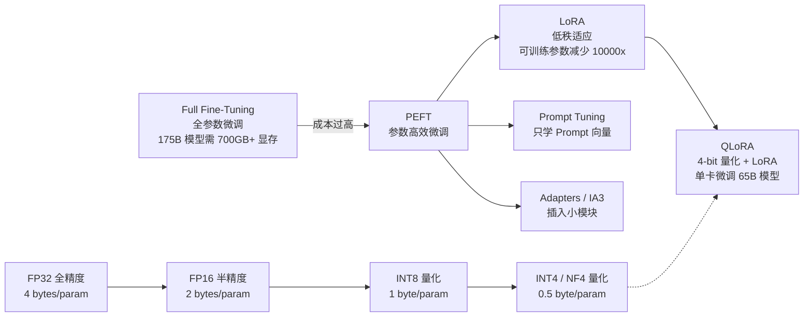
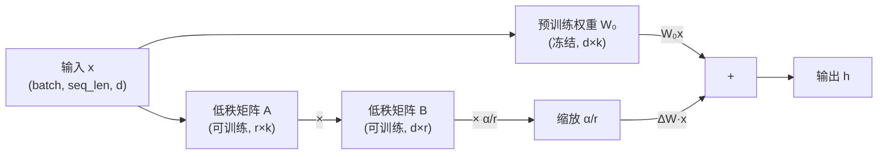
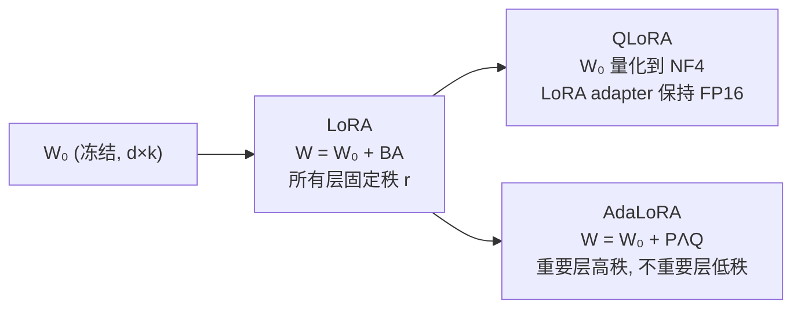

# LoRA / QLoRA / AdaLoRA

## 知识地图



## 前置知识

- **Transformer 架构**：理解 Self-Attention 中的 $W_Q, W_K, W_V, W_O$ 以及 FFN 中的线性层。
- **矩阵秩 (Rank)**：一个 $d \times k$ 矩阵的秩是线性无关的行/列数，$r \leq \min(d, k)$。秩越低，矩阵包含的信息越少。
- **低秩分解**：一个大矩阵可以被近似为两个小矩阵的乘积 $M \approx BA$，其中 $B \in \mathbb{R}^{d \times r}, A \in \mathbb{R}^{r \times k}$，$r \ll \min(d, k)$。
- **量化基础**：将浮点数表示为低位宽的整数（如 INT4/INT8），牺牲精度换取存储和速度。

## 为什么会出现

全参数微调 (Full Fine-Tuning) 面临严重的资源问题：

- **GPT-3 (175B)** 全参数微调需要存储 optimizer states (Adam 的 momentum + variance)、梯度和模型参数，总计约 **2.8TB 显存**，需要数十张 A100 (80GB) GPU。
- 每个下游任务需要保存一份完整的模型副本（175B × 2 bytes = 350GB），部署成本极高。
- **LoRA** 将 GPT-3 的可训练参数从 175B 降低到 **4.7M**（约 37,000 倍），训练显存从 TB 级降至单卡即可。
- **QLoRA** 进一步将基础模型量化到 4-bit，使得 **65B 模型在单张 48GB GPU 上微调**成为可能。

## 解决什么问题

在**保持接近全参数微调性能**的前提下，大幅降低微调大模型所需的：

1. **GPU 显存**（全参数微调 175B 需多张 A100，LoRA 单卡即可）
2. **可训练参数量**（从 ~100% 降到 <1%）
3. **任务切换成本**（只需换一个小 LoRA 权重文件，而非整模型）
4. **存储成本**（每个任务只需保存几 MB 的 adapter 权重）

## 核心思想

**预训练权重是满秩的，但微调时的权重更新是低秩的，因此可以用两个小矩阵的乘积来近似权重更新。**

---

## LoRA (Low-Rank Adaptation)

### 数学原理

LoRA 将权重更新分解为两个低秩矩阵的乘积：

$$\mathbf{W}' = \mathbf{W}_0 + \Delta\mathbf{W} = \mathbf{W}_0 + \mathbf{B}\mathbf{A}$$

其中 $\mathbf{W}_0 \in \mathbb{R}^{d \times k}$ 是冻结的预训练权重，$\mathbf{B} \in \mathbb{R}^{d \times r}$，$\mathbf{A} \in \mathbb{R}^{r \times k}$，且 $r \ll \min(d, k)$。

前向传播时增加缩放因子 $\alpha$：

$$\mathbf{h} = \mathbf{W}_0 \mathbf{x} + \frac{\alpha}{r} \cdot \mathbf{B}\mathbf{A}\mathbf{x}$$

**通俗解释：** 想象你要修改一本 1000 页的书。LoRA 不是让你重写整本书，而是让你写两张"修改说明"小卡片（矩阵 B 和 A），每张只有 16 行。这两张卡片合在一起，就能表达对原书页面的修改。因为微调时你需要修改的内容本质上是"低秩"的——大多数改动集中在少数几个方向，只有这 16 个维度就够了。

### 为什么低秩分解有效？——低秩假设

大规模预训练模型学到的参数矩阵通常是**满秩**的（每一行/列都独立有用），但**微调时的变化**又是**低秩**的。原因：

1. **预训练已经覆盖了通用知识**：下游任务只需在预训练学到的"方向"上做微调，而无需重新探索整个参数空间。
2. **内在维度假设 (Intrinsic Dimensionality)**：研究表明，大模型对下游任务的有效学习实际上发生在一个远低于参数数量的低维子空间中。
3. **经验证据**：只需 $r=1$ 或 $r=2$ 的 LoRA，在某些任务上已经能接近全参数微调的效果。这说明更新确实处于一个极低的秩。

### 参数量对比

对 $d=4096, k=4096, r=16$ 的投影矩阵：

- **原始权重**：$4096 \times 4096 = 16.8M$ 参数
- **LoRA**：$4096 \times 16 \times 2 = 131K$ 参数
- **减少比例**：约 **128 倍**

对于 GPT-3 (175B)：
- 全参数微调：175B 可训练参数
- LoRA ($r=16$)：约 **4.7M** 可训练参数

### 在哪里加 LoRA？

Transformer 中的**所有线性层**都可以加 LoRA：

- **Attention 模块**：$W_Q, W_K, W_V, W_O$（四个投影矩阵）
- **FFN 模块**：$W_1, W_2, W_3$（SwiGLU 结构有三个线性层）

一般至少加在 Attention 的 $Q$ 和 $V$ 上。QLoRA 论文建议加在**所有线性层**以获得最佳效果——虽然参数稍多，但性能提升显著。

### 合并与多任务切换

```python
# 推理时合并（零额外推理延迟）——这是 LoRA 的关键优势
merged_W = W + (alpha / r) * B @ A

# 切换任务只需切换 LoRA 权重（几 MB 大小）
model.load_lora("task_A_lora.pt")  # 基础模型不动
model.load_lora("task_B_lora.pt")  # 秒级切换
```

---

## QLoRA

### 核心思想

QLoRA (Quantized LoRA) = **NF4 量化基础模型 + LoRA 微调**。基础模型权重被量化为 4-bit 存储（不参与训练），只训练少量 LoRA adapter 参数。

**通俗解释：** LoRA 已经让训练参数很少了，但基础模型本身的 16-bit 权重仍然占满内存。QLoRA 说：既然基础模型是冻结的，不如把它压缩到 4-bit 存着，这样 65B 的大模型也能塞进单张 48GB 显卡。

### 三大创新

1. **NF4 (4-bit NormalFloat)**：信息论最优的正态分布 4-bit 量化格式。假设权重服从正态分布，按等概率分位点设计 16 个量化级别，在高概率密度区域有更细的分辨率。

2. **双重量化 (Double Quantization)**：对量化常数（scale）再量化一次——既然量化常数本身也很小，没必要用 FP32 存。

3. **分页优化器 (Paged Optimizer)**：当 GPU 显存溢出时，利用 CPU 内存作为"分页文件"处理梯度检查点（借鉴操作系统分页思想）。

### NF4 vs INT4

| | INT4 | NF4 |
|------|------|-----|
| 分布假设 | 均匀分布 | 正态分布 |
| 量化间隔 | 均匀等距 | 不等距（密度匹配） |
| 设计原理 | 简单等分 [-max, max] | 按正态 CDF 等概率分位点 |
| 适合场景 | 均匀分布数据 | 正态分布数据（神经网络权重） |
| 信息损失 | 较大（正态数据下） | 接近信息论下界 |

### 数学原理

NF4 假设 $\mathbf{w} \sim \mathcal{N}(0, \sigma^2)$，将量化区间按正态分布的**等概率分位点**设计：

$$Q_{NF4} = \left\{q_i : \Phi(q_i) = \frac{i}{16}, \; i = 0, 1, \ldots, 15\right\}$$

其中 $\Phi$ 是标准正态分布的 CDF。

**通俗解释：** 正态分布的数据，大部分值集中在均值附近（钟形曲线的中部）。均匀量化在这里浪费了——它在"边缘"（几乎没数据的地方）和"中间"（数据密集的地方）用了同样的间隔。NF4 在数据密集区（均值附近）放更多量化点，在稀疏区少放，用同样的 4-bit 得到更多有效信息。

### 实际效果

在 4-bit 量化的 65B 模型上用 QLoRA 微调，可以达到 **16-bit 全参数微调的性能**，仅需 **48GB GPU 显存（单卡）**。这使得个人研究者在消费级硬件上也能微调大模型。

---

## AdaLoRA

### 核心思想

不是所有层都一样重要。AdaLoRA 根据**参数重要性**动态分配不同的秩给不同层。

**通俗解释：** 普通 LoRA 给所有层统一的 $r=16$，就像给所有房间一样的装修预算。AdaLoRA 发现：有些层（如 Attention 的 Q/V）对任务极其敏感，需要 $r=32$；有些层无所谓，$r=4$ 就够了。它自动把钱花在刀刃上。

### 数学原理

AdaLoRA 将 $\Delta W$ 写成 SVD 形式：

$$\Delta W = P \Lambda Q, \quad \Lambda = \text{diag}(\sigma_1, \sigma_2, \ldots, \sigma_r)$$

训练时根据「损失对 $\sigma_i$ 的敏感度」衡量每个奇异值的重要性：

$$I(\sigma_i) = \left| \frac{\partial \mathcal{L}}{\partial \sigma_i} \cdot \sigma_i \right|$$

不重要的奇异值被剪掉，节省的"秩预算"重新分配给更需要的层。优化目标：

$$\min_{\mathcal{P}} \sum_{i} \|\mathbf{P}_i \odot (\mathbf{W}_i - \mathbf{W}_i^0)\|_F^2 \quad \text{s.t.} \quad \sum_i \text{rank}(\mathbf{P}_i) \leq \text{budget}$$

**通俗解释：** 想象你有 100 个"修改额度"分配给所有层。AdaLoRA 的做法是：
1. 先把修改写成"方向 × 重要性 × 方向"的形式（SVD）
2. 看梯度的变化——如果某个方向的重要性 $\sigma_i$ 稍微改一点，loss 变化很大，那它很重要
3. 把那些不重要的方向砍掉，省下的"额度"给别的层多用

在相同参数预算下，AdaLoRA 比固定秩的 LoRA 获得更好性能。

---

## 可视化展示

### LoRA 计算流程



### LoRA → AdaLoRA 演化



---

## 最小可运行代码

```python
from peft import LoraConfig, get_peft_model
from transformers import AutoModelForCausalLM, AutoTokenizer

# 加载基础模型
model = AutoModelForCausalLM.from_pretrained("meta-llama/Llama-2-7b-hf")

# LoRA 配置
lora_config = LoraConfig(
    r=16,                                     # 低秩维度
    lora_alpha=32,                            # 缩放因子
    target_modules=["q_proj", "v_proj",       # 目标模块
                    "k_proj", "o_proj"],
    lora_dropout=0.1,                         # Dropout 正则化
    bias="none",                              # 不训练 bias
    task_type="CAUSAL_LM",                    # 任务类型
)

# 注入 LoRA adapter
model = get_peft_model(model, lora_config)
model.print_trainable_parameters()
# 输出: trainable params: 8,388,608 || all params: 6,746,759,168 || trainable%: 0.1243%

# QLoRA 使用示例
from transformers import BitsAndBytesConfig

bnb_config = BitsAndBytesConfig(
    load_in_4bit=True,                        # 以 NF4 加载
    bnb_4bit_quant_type="nf4",               # 使用 NF4 格式
    bnb_4bit_use_double_quant=True,          # 双重量化
    bnb_4bit_compute_dtype="float16",        # 计算时用 FP16
)

model_4bit = AutoModelForCausalLM.from_pretrained(
    "meta-llama/Llama-2-7b-hf",
    quantization_config=bnb_config,
    device_map="auto",
)
model_4bit = get_peft_model(model_4bit, lora_config)
```

---

## 工业界应用

| 公司/组织 | 技术 | 应用模型 | 场景 |
|-----------|------|----------|------|
| Meta | LoRA | LLaMA 系列 | 社区微调、多语言适配 |
| Microsoft | LoRA | Phi 系列 | 小模型微调、边缘部署 |
| Google | QLoRA | Gemma 系列 | 消费级 GPU 微调 |
| Hugging Face | LoRA / QLoRA | PEFT 库 (通用) | 开源社区生态 |
| 各 SaaS 平台 | LoRA | Stable Diffusion | 风格/角色定制 (DreamBooth + LoRA) |
| Anthropic | LoRA 变体 | Claude 系列 | 安全性对齐微调 |
| OpenAI | LoRA (推测) | GPT 系列 | 多任务微调服务 |

---

## 对比表格

### LoRA vs QLoRA vs Full Fine-Tuning

| 维度 | Full Fine-Tuning | LoRA | QLoRA |
|------|-----------------|------|-------|
| 可训练参数 (7B 模型) | 7B (100%) | ~8M (~0.1%) | ~8M (~0.1%) |
| 基础模型精度 | FP16/BF16 | FP16/BF16 | NF4 (4-bit) |
| 训练显存 (7B) | ~60GB | ~18GB | ~10GB |
| 训练显存 (65B) | ~500GB+ | ~150GB | ~48GB |
| 推理延迟 | 基准 | 基准 (合并后) | 基准 (合并后) |
| 多任务存储 | 每任务 ~14GB | 每任务 ~16MB | 每任务 ~16MB |
| 性能 | 最优 | 接近 (差距 <1%) | 接近 (差距 <2%) |
| 适用场景 | 单一任务、资源充足 | 多任务微调 | 消费级硬件微调大模型 |

### LoRA vs AdaLoRA

| 维度 | LoRA | AdaLoRA |
|------|------|---------|
| 秩分配 | 所有层统一 r | 自动按重要性分配 |
| 参数量 | ~0.1% | ~0.1% (相同预算) |
| 性能 | 基线 | 优于 LoRA (+0.5-1%) |
| 训练复杂度 | 低 | 中 (需计算 SVD 和重要性) |
| 工程成熟度 | 极高 (PEFT 稳定支持) | 中 (实验性) |
| 选型建议 | 默认首选 | 追求极致效果 |

---

## 学完后建议继续学习

1. **DoRA (Weight-Decomposed Low-Rank Adaptation)**：将权重分解为幅值+方向，对方向部分施加 LoRA，效果优于 LoRA 和 AdaLoRA。
2. **IA3 (Infused Adapter by Inhibiting and Amplifying Inner Activations)**：极致参数效率，仅学 3 个缩放向量，<0.01% 可训练参数。
3. **Prompt Tuning / Prefix Tuning**：完全不修改模型权重，只学虚拟 token 嵌入。
4. **GPTQ / AWQ**：深度学习推理阶段的量化技术，与 QLoRA 互补。
5. **vLLM / TensorRT-LLM**：量化模型的推理部署框架，实现理论加速比到实际吞吐量。

---

## 高频面试题

### Q1: 为什么 LoRA 用低秩分解是合理的？秩 r 如何选择？

**标准答案：**

LoRA 的核心假设是「预训练模型学习到的任务通用知识已编码在满秩的大矩阵中，而针对下游任务的微调只需在低维子空间中进行」。这被称为**内在维度假设 (Intrinsic Dimensionality)**——大模型对特定任务的适应发生在一个远小于参数数量的低维流形上。

关于秩 r 的选择：
- $r=4$ 或 $r=8$ 在很多任务上已能接近全参数微调效果（尤其是简单分类任务）
- $r=16$ 是实践中的默认值，在性能和参数效率间取得平衡
- $r=64$ 用于较困难的生成任务，继续增大边际收益递减
- 实践中应该从 $r=8$ 或 $r=16$ 开始实验，用验证集选择

### Q2: LoRA 的 $\alpha$ 参数作用是什么？为什么公式中是 $\frac{\alpha}{r}$？

**标准答案：**

$\alpha$ 是 LoRA 更新的缩放因子，控制 LoRA adapter 对原始模型输出的影响强度。公式中的 $\frac{\alpha}{r}$ 形式是为了让缩放与秩 r 解耦：

- 当改变 r 时，如果不用 $\frac{\alpha}{r}$，更新幅度会随 r 变化，导致需要重新调参
- 使用 $\frac{\alpha}{r}$ 后，调 $\alpha$ 直接控制更新强度，独立于 r
- 通常 $\alpha = 16$ 或 $32$，更大的 $\alpha$ 意味着 LoRA 对模型的修改更剧烈
- 实践中通常保持 $\alpha = 2r$（如 $r=8, \alpha=16$），作为默认值

### Q3: QLoRA 的 NF4 和普通 INT4 有什么本质区别？

**标准答案：**

- **INT4** 假设数据均匀分布，将 $[-max, max]$ 区间均匀分为 16 个等距区间。对神经网络权重（通常接近正态分布）来说效率低下——高频区域（均值附近）和低频区域（尾部）获得相同精度。
- **NF4** 假设数据服从 $\mathcal{N}(0,1)$，按正态分布的等概率分位点设置 16 个量化级别。在高概率密度区域（近 0）量化点更密集，在低密度区域（远 0）更稀疏。
- 从信息论角度，NF4 对于正态分布数据是**最优的 4-bit 量化**——每个量化值被使用的频率几乎相等，最大化信息熵。
- 这是 QLoRA 能在 4-bit 精度下保持与 16-bit 相当性能的关键。

### Q4: LoRA 应该加在 Transformer 的哪些层？为什么？

**标准答案：**

LoRA 可以加在 Transformer 的所有线性层上。但不同层的重要性不同：

1. **最低配置**（参数最少）：仅 $W_Q$ 和 $W_V$
2. **标准配置**（推荐）：$W_Q, W_K, W_V, W_O$（Attention 全部四个矩阵）
3. **完整配置**（最佳效果）：所有线性层，包括 FFN 的 $W_1, W_2, W_3$

QLoRA 论文的实验表明：在 Attention 层和 FFN 层都加 LoRA 比仅 Attention 有明显提升。$W_Q$ 和 $W_V$ 是最关键的——它们直接影响 attention pattern 和 value 聚合。$W_K$ 的影响相对较小，$W_O$ 中等。

实际选择原则：追求效果选完整配置（所有层），追求参数效率选标准配置（Attention 4 矩阵），极端资源受限选 $Q+V$。

### Q5: 推理时 LoRA 如何做到零额外延迟？

**标准答案：**

LoRA 在推理前将低秩矩阵乘积合并到原始权重中：

$$W_{merged} = W_0 + \frac{\alpha}{r} \cdot BA$$

合并后 $W_{merged}$ 是一个与原始权重形状完全相同的稠密矩阵（$d \times k$），推理时的矩阵乘法与原始模型完全一样——没有额外的计算或内存开销。这就是 LoRA 相比 Adapter 层（在层间插入小网络，增加推理延迟）的关键优势。

对于多任务场景，可以热切换 LoRA 权重：只需重新计算 $W_{merged}$（一次矩阵乘法），切换耗时毫秒级，无需重新加载整个模型。
