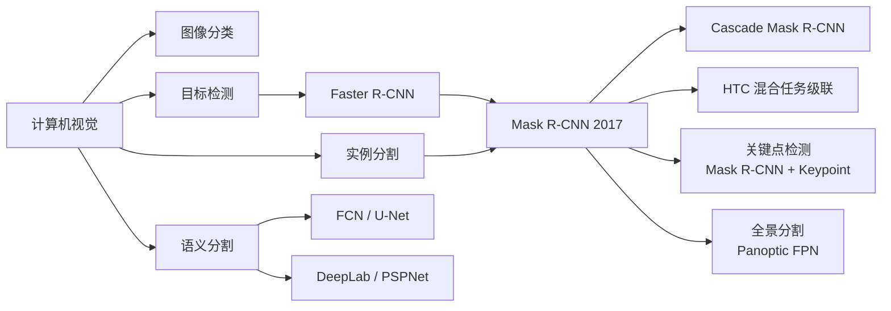
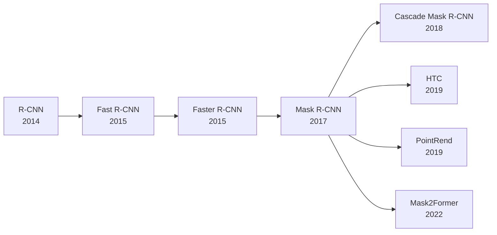
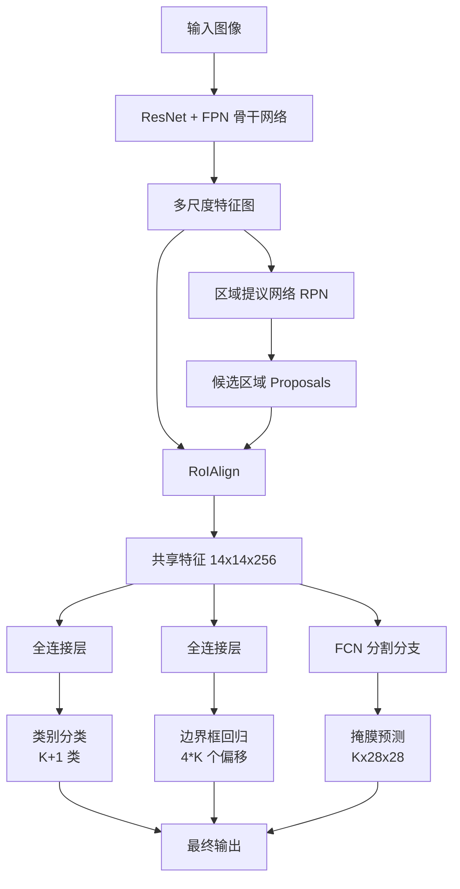

# Mask R-CNN

## 知识地图



## 前置知识

- Faster R-CNN 的完整流程：RPN、RoI Pooling、多任务损失
- FPN (特征金字塔网络) 的多尺度特征融合
- 语义分割基础：FCN、逐像素分类
- 目标检测的评估指标：IoU、mAP
- 双线性插值的数学原理

## 模型演化路线



| 模型 | 年份 | 关键创新 |
|------|------|----------|
| Faster R-CNN | 2015 | RPN 端到端检测 |
| Mask R-CNN | 2017 | RoIAlign + 分割分支，实现实例分割 |
| Cascade Mask R-CNN | 2018 | 级联 IoU 阈值，逐步提升检测和分割质量 |
| HTC | 2019 | 混合任务级联，检测和分割信息相互增强 |
| PointRend | 2019 | 在边缘区域自适应采样，提升掩膜边缘精细度 |
| Mask2Former | 2022 | Transformer 架构，统一分割任务 |

## 为什么会出现 (Why)

在 Mask R-CNN 之前，目标检测（Faster R-CNN）和语义分割（FCN）是两套独立的系统。但实际应用场景（如自动驾驶）需要同时知道：
- 图像中有哪些物体（检测）
- 它们各自在哪里（定位）
- 每个物体的精确轮廓（分割）
- 同一类的不同个体要区分开（实例级）

传统做法是跑两个独立的模型再后处理融合，效率低且两套特征无法共享。Mask R-CNN 的洞见是：**检测和分割共享底层特征，分割只是检测的自然延伸——在 RoI 的基础上，多预测一个二进制掩膜即可。**

## 解决什么问题 (Problem)

**如何在像素级别精确分割出每个物体实例，同时保持检测的效率？**

具体挑战：
- 分割需要像素级精度，但 Faster R-CNN 的 RoI Pooling 存在量化误差
- 分割和检测的特征需求不同：分割需要空间细节，检测需要语义信息
- 如何在同一个网络中高效地同时完成检测和分割两个任务

## 核心思想 (Core Idea)

**在 Faster R-CNN 的基础上增加一个并行的分割分支，为每个 RoI 预测一个二值掩膜（Mask），使用 RoIAlign 保持空间精度，实现实例分割（区分同一类别中的不同个体）。**

---

## 架构

```
图像 → CNN + FPN → RPN → RoIAlign → 三个并行分支:
  ├─ 分类: [K+1] 类概率
  ├─ 回归: 4K 个 bbox 偏移
  └─ 分割: K × m × m 的掩膜
```

**通俗解释：** Mask R-CNN = Faster R-CNN + 一个额外的分割分支。这个分割分支在 RoIAlign 之后的特征上，用一个小型全卷积网络（FCN）为每个候选区域生成一个 28x28 的二进制掩膜。相当于告诉网络："你不仅要告诉我这个框里是什么、在哪里，还要把它'画'出来。"

---

## RoIAlign — 核心创新

### RoI Pooling 的问题

两次量化导致 misalignment：
1. RoI 坐标取整（浮点 → 整数）
2. 子区域划分取整

**通俗解释：** RoI Pooling 在映射候选框时，把浮点数坐标直接截断成整数（比如 3.7 → 3），两次取整后误差可能达到 1-2 个像素。对于分类来说这点误差无所谓，但对于分割来说——每个像素都算分，错一个像素就是错。

### RoIAlign 解决方案

使用**双线性插值**在连续坐标上采样：

```python
def roi_align(feature_map, roi, output_size):
    # 在规则采样点上做双线性插值
    for y, x in sampling_points:
        value = bilinear_interpolate(feature_map, y, x)
```

**通俗解释：** RoIAlign 不做量化取整。需要采样点 (3.7, 5.2) 的值？用周围 4 个像素 (3,5), (4,5), (3,6), (4,6) 的值做双线性插值，得到一个精确的浮点值。虽然计算量稍大，但保证了亚像素级的空间精度。

这使得掩膜精度大幅提升（从 10% 到 50% mAP mask）。

---

## 数学模型/公式

### 多任务损失

$$L = L_{cls} + L_{box} + L_{mask}$$

- $L_{cls}$：分类损失（交叉熵）
- $L_{box}$：边界框回归损失（Smooth L1）
- $L_{mask}$：掩膜损失（Binary Cross-Entropy）

**通俗解释：** 三个损失对应三个任务——类别对不对、框准不准、掩膜精不精。三个损失直接相加，网络同时优化这三个目标。掩膜损失的加入不会损害检测性能（实验证明反而有轻微提升），因为分割任务提供了额外的空间监督信号。

### 掩膜分支的特殊处理

- 输出 $K$ 个掩膜（每个类一个），但只使用 Ground Truth 类的掩膜计算损失
- 每个掩膜用 Sigmoid + Binary Cross-Entropy（而非 Softmax）
- **类别解耦**：分类和分割独立，避免类间竞争

**通俗解释（类别解耦的关键性）**：
- **为什么每个类独立输出一个掩膜？** 因为分类已经告诉了我们是"猫"，分割只需要画"猫"的轮廓。如果用 Softmax（每个像素在 K 个类别中竞争），分割质量会受分类不确定性影响。
- **为什么只用 GT 类的掩膜算损失？** 其他类的掩膜不需要关心——如果这是一个"猫"的 RoI，只需要让"猫"的掩膜接近 GT，"狗"的掩膜爱怎么预测都行。
- 这个设计非常关键——如果分类和分割耦合（共享 Softmax），分割错误会反向影响分类，两者相互掣肘。解耦后各自独立优化，互不干扰。

### 掩膜输出的激活与损失

对每个 RoI，分割分支输出 $K \times m \times m$。对于 Ground Truth 类别 $k$：

$$L_{mask} = -\frac{1}{m^2} \sum_{1 \leq i,j \leq m} \left[y_{ij} \log \hat{y}_{kij} + (1 - y_{ij}) \log(1 - \hat{y}_{kij})\right]$$

其中 $\hat{y}_{kij} = \sigma(z_{kij})$（Sigmoid 激活），$y_{ij}$ 是 GT 掩膜。

**通俗解释：** 就是一个标准的二进制交叉熵——对掩膜的每个像素判断是不是属于这个物体。用 Sigmoid 而不是 Softmax 意味着每个像素是独立判断的二元分类，不同类之间不存在竞争。

---

## 关键设计细节

1. **FPN + Mask R-CNN**：多尺度特征显著提升分割质量
2. **分割分支是 FC 还是 FCN**：FCN（小型全卷积网络）效果更好
3. **掩膜分辨率**：$28 \times 28$（v1），可调整
4. **掩膜分支的输入**：从 RoIAlign 输出的 14x14 特征开始，经过 4 个 Conv + 1 个 Deconv 生成 28x28 掩膜

**通俗解释 (FCN vs FC 对于掩膜分支)**：
- 全连接方式：把 RoI 特征拉成一个向量，再reshape成掩膜——丢失了所有空间结构
- FCN 方式：保持特征的 H×W 结构，卷积层天然保留空间信息——就像 U-Net 一样，空间位置关系一直保留着

---

## 模型结构图



### RoIAlign 双线性插值示意

```mermaid
graph TD
    A[特征图上的浮点坐标<br/>x=3.7, y=5.2] --> B[4 个邻近整数像素<br/>(3,5),(4,5),(3,6),(4,6)]
    B --> C1[先做 x 方向插值<br/>top: f(3.7,5) = 0.3*f(3,5)+0.7*f(4,5)<br/>bottom: f(3.7,6) = 0.3*f(3,6)+0.7*f(4,6)]
    C1 --> D[再做 y 方向插值<br/>f(3.7,5.2) = 0.8*top + 0.2*bottom]
    D --> E[精确浮点值<br/>无量化误差]
```

## 可视化展示

### 技术演进

| 方法 | 任务 | 创新 |
|------|------|------|
| R-CNN | 检测 | CNN 特征替代手工特征 |
| Fast R-CNN | 检测 | RoI Pooling + 多任务损失 |
| Faster R-CNN | 检测 | RPN 端到端候选区域生成 |
| Mask R-CNN | 实例分割 | RoIAlign + Mask Head |
| Cascade Mask R-CNN | 实例分割 | 级联 IoU 阈值 |
| HTC | 实例分割 | 混合任务级联 |

### RoI Pooling vs RoIAlign

| 特性 | RoI Pooling | RoIAlign |
|------|-------------|----------|
| 坐标处理 | 两次取整（量化） | 保持浮点坐标 |
| 特征获取 | 取整后直接取值 | 双线性插值 |
| 空间精度 | 有误差（像素级） | 亚像素级精度 |
| 对分割的影响 | 严重（misalignment） | 精确对齐 |
| mAP mask | ~10% | ~50% |
| 计算量 | 较低 | 稍高 |

---

## 最小可运行代码

```python
import torchvision.models.detection as detection

model = detection.maskrcnn_resnet50_fpn(pretrained=True)
model.eval()
predictions = model(images)
# predictions contain: boxes, labels, scores, masks
```

## 工业界应用

| 应用场景 | 为什么选择 Mask R-CNN | 实际案例 |
|----------|----------------------|----------|
| 自动驾驶 | 需要精确分割行人/车辆轮廓 | Waymo, Cruise 的感知系统 |
| 医学影像 | 细胞/肿瘤分割需要实例级精度 | 细胞核分割、皮肤病变检测 |
| 遥感分析 | 建筑物实例分割 | 城市规划、灾害评估 |
| 视频编辑 | 人物实例分割用于背景替换 | Adobe After Effects (Roto Brush 2) |
| 机器人抓取 | 需要知道物体精确轮廓 | 仓储机器人分拣系统 |
| AR/VR | 实时人物分割用于虚拟背景 | Zoom 虚拟背景、Snapchat AR |

## 对比表格

| 维度 | Mask R-CNN | YOLACT | SOLO | Mask2Former |
|------|-----------|--------|------|-------------|
| 检测范式 | 两阶段 | 单阶段 | Anchor-Free | Transformer |
| 分割原理 | RoIAlign + FCN | 原型掩膜 + 系数 | 网格级掩膜 | Mask Attention |
| 速度 (FPS) | 5-10 | 30+ | 10-15 | 5-10 |
| COCO mask AP | 35-40% | 28-30% | 37-40% | 42-45% |
| 掩膜质量 | 好 | 一般 | 好 | 极好 |
| 对小物体 | 好（FPN） | 一般 | 好 | 好 |
| 部署难度 | 中 | 易 | 中 | 难 |

## 学完后建议继续学习

1. **Cascade Mask R-CNN**：理解级联 IoU 阈值如何逐步提升检测质量
2. **Panoptic Segmentation**：全景分割（语义分割 + 实例分割的统一）
3. **YOLACT / SOLO**：单阶段实例分割的加速方案
4. **PointRend**：通过自适应点采样提升掩膜边缘精细度
5. **DETR + Mask2Former**：Transformer 架构在分割中的最新进展

## 高频面试题

### Q1: Mask R-CNN 和 Faster R-CNN 的核心区别是什么？

**答：**
1. **RoIAlign 替代 RoI Pooling**：使用双线性插值保持空间精度，消除量化误差。这是分割任务的关键——没有 RoIAlign，掩膜精度从 50% 掉到 10%。
2. **增加分割分支**：在检测头旁边增加一个 FCN 分支，为每个 RoI 预测一个 28x28 的掩膜。
3. **多任务损失**：损失函数从两项（分类 + 回归）变为三项（分类 + 回归 + 掩膜）。
4. **训练细节**：分割分支使用 Sigmoid + BCE（而非 Softmax），实现分类与分割的解耦。

### Q2: 为什么 Mask R-CNN 的掩膜分支使用 Sigmoid 而不是 Softmax？

**答：**
- **Softmax** 对每个像素在 K 个类别间竞争：像素必须属于"猫"或"狗"中的一个。这会导致类间竞争——如果分类头不确定 RoI 是猫还是狗，Softmax 会迫使分割掩膜也摇摆不定。
- **Sigmoid** 对每个像素独立二分类：像素是否属于"猫"？像素是否属于"狗"？两个问题独立回答。关键是**只用 GT 类别的掩膜计算损失**。
- **优势**：分类和分割解耦——分类头决定"这是什么"，分割头只管"这个物体的轮廓是什么"。即使分类头有疑问，分割头依然可以产生干净的掩膜。

### Q3: RoIAlign 的双线性插值如何计算？为什么它解决了 RoI Pooling 的问题？

**答：**
- **RoI Pooling 的问题**：两步量化。第一步：RoI 坐标（如 15.7）映射到特征图时取整为 16。第二步：将 RoI 划分为 7x7 子区域时，子区域边界也取整。两次取整累计误差可达 1-2 像素。
- **RoIAlign 的解决**：不做任何取整。将 RoI 划分为 7x7 子区域，在每个子区域内采样 4 个点（共 7x7x4=196 个采样点），每个采样点的值由其周围 4 个整数像素通过双线性插值计算得到。
- **双线性插值**：先在 x 方向对上下两行分别插值，再在 y 方向对两个中间结果插值。最终值 = 4 个邻近像素的加权平均，权重基于距离。
- **为什么能解决**：保持浮点坐标的精确性，每个采样点的值都是精确计算而非取整近似，为分割保留了亚像素级精度。

### Q4: Mask R-CNN 如何同时处理检测和分割？两个任务会不会互相干扰？

**答：**
- **共享骨干网络**：检测和分割共享 CNN + FPN 提取的特征。底层特征（边缘、纹理）对两个任务都有用，高层语义对两个任务也都需要。
- **分支并行且独立**：RoIAlign 之后，三个分支（分类、回归、分割）使用各自的网络层，参数不共享。分类和回归走全连接、分割走 FCN。
- **不仅不干扰，反而相互促进**：实验表明 Mask R-CNN 的检测精度略高于 Faster R-CNN。因为分割任务提供了额外的像素级监督信号，迫使骨干网络学习更好的空间特征。
- **类别解耦保证独立性**：Sigmoid + 只监督 GT 类的设计确保分类不准不会直接影响分割质量。

### Q5: Mask R-CNN 能处理重叠的同一类物体吗？如果可以，它是如何做到的？

**答：** 可以，这是实例分割的核心需求。

- **RPN + RoIAlign 机制**：每个物体被 RPN 生成独立的 RoI，通常两个重叠物体对应两个不同的 RoI（即使它们 IoU 很高）。
- **独立的掩膜预测**：每个 RoI 独立预测掩膜，互不干扰。即使两个"猫"的 RoI 有重叠区域，它们各自预测自己的掩膜，没有像素归属的竞争。
- **训练时的处理**：每个 RoI 根据其分配的 GT 框训练。即使两个物体重叠，它们各自有独立的 GT 掩膜，分割分支学习的是什么像素属于"这个特定的猫"。
- **限制**：如果两个重叠的同一类物体被 RPN 合并成了一个 proposal（即只检测到一个），那么 Mask R-CNN 无法分割出两个实例。这种情况下需要后处理或更强的 RPN。
