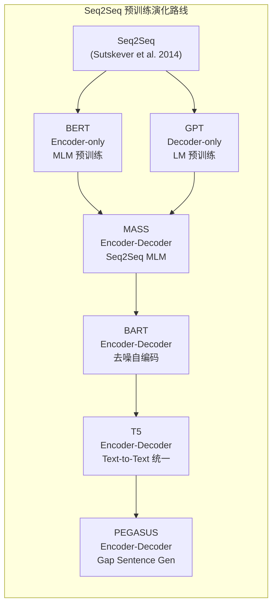
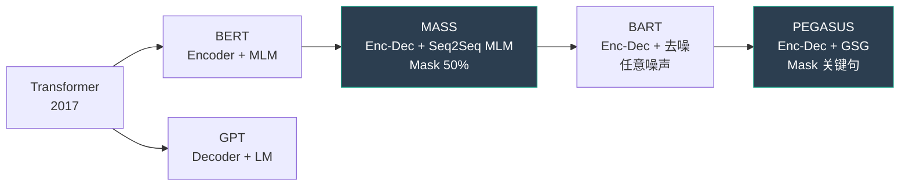
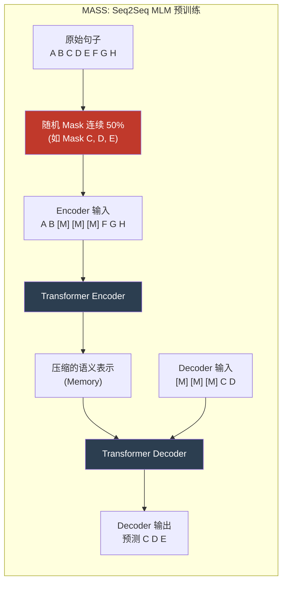
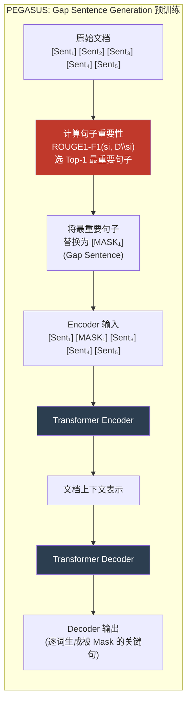

# MASS / Pegasus (序列到序列预训练)

## 知识地图



## 前置知识

- **Transformer 的 Encoder-Decoder 架构**: 理解 Cross-Attention 如何让 Decoder 从 Encoder 的压缩表示中提取信息
- **BERT 的 MLM (Masked Language Modeling)**: 随机遮住输入文本的 15%，让模型从上下文恢复被遮住的词
- **GPT 的自回归语言模型 (Autoregressive LM)**: 逐词预测下一个 Token，只能从左到右生成
- **序列到序列 (Seq2Seq) 任务**: 翻译、摘要、对话生成等输入和输出均为变长序列的任务
- **ROUGE 评测指标**: ROUGE-1/2/L 衡量生成摘要与参考摘要的 N-gram 重叠度——Pegasus 选句的核心
- **Teacher Forcing**: 训练时用真实目标 Token 而非模型预测作为 Decoder 的下一步输入

## 模型演化路线



| 方法 | 架构 | 预训练目标 | Mask/噪声策略 | 最适合下游任务 |
|------|------|-----------|-------------|--------------|
| BERT | Encoder | MLM | 随机 15% Token | 文本分类、NER、QA |
| GPT | Decoder | LM | 0% (自回归) | 文本生成、对话 |
| MASS | Enc-Dec | Seq-to-Seq MLM | 连续 50% Token | 翻译、摘要 |
| BART | Enc-Dec | 去噪自编码 | 任意 (删除/替换/乱序) | 摘要、翻译 |
| PEGASUS | Enc-Dec | Gap Sentence Gen | 1-2 个关键整句 | **文本摘要** |

## 为什么会出现 (Why)

BERT 是 encoder-only（理解文本），GPT 是 decoder-only（生成文本）。但是摘要、翻译等任务需要 **encoder-decoder** 架构——先理解输入全文，再生成输出。BERT 和 GPT 的预训练目标（MLM 和 LM）都不是为 Seq2Seq 架构设计的：如果直接把 BERT 当 Encoder、GPT 当 Decoder 拼起来（BERT2BERT），两者预训练时使用完全不同的目标，拼合后的收敛效果不好。需要专门为 Encoder-Decoder 架构设计预训练任务。

## 解决什么问题 (Problem)

1. **Seq2Seq 专用预训练**: 设计让 Encoder 学会压缩理解、Decoder 学会条件生成的一致预训练目标
2. **摘要生成的本质建模**: 摘要的核心是"识别文档中最重要的句子并压缩表达"——Pegasus 的 GSG 直接在预训练阶段模拟这个过程
3. **预训练与下游任务的一致性**: 让预训练任务的形式尽可能接近下游任务（摘要→从文档中提取关键信息）

## 核心思想 (Core Idea)

MASS 在 Encoder 端遮住句子连续 50% 的内容，让 Decoder 从 Encoder 的压缩表示中恢复被遮部分；PEGASUS 则直接遮住文档中最关键的句子，让 Decoder 生成这些"摘要式句子"——两者都证明了**为下游任务定制预训练目标远比通用 MLM/LM 有效**。

## 模型结构图

### MASS 预训练流程



### PEGASUS: Gap Sentence Generation



## 数学模型/公式

### MASS — 联合 mask encoder 和 decoder

给定句子 $x_{1:n}$，随机 mask 一个连续片段 $x_{u:v}$（长度 $k = v - u + 1$）：

- **Encoder 输入**：$x_{\setminus u:v}$（被 mask 的片段替换为 [M]，其余保留）
- **Decoder 输入**：前面 $k-1$ 个位置是 [M]，第 $k$ 个位置预测第一个被 mask 的词，依次自回归预测
- **Decoder 输出**：$x_{u:v}$（被 mask 的片段）

损失：
$$
\mathcal{L} = -\frac{1}{k} \sum_{t=u}^{v} \log P(x_t | x_{\setminus u:v}, x_{u:t-1})
$$

**通俗解释：** 这个公式的意思是——给定 Encoder 看到的"残缺版句子"（中间被挖掉一块）和 Decoder 已经生成的"部分恢复内容"，预测下一个被 mask 掉的词。$k$ 设为句子长度的约 50%——这是 MASS 最巧妙的设计：50% 介于 BERT 的 15%（偏理解）和 GPT 的 100% 偏（生成）之间，让 Encoder 被迫学会深度理解上下文来压缩语义，同时让 Decoder 有足够的生成长度来练习条件生成能力。

### Pegasus — Gap Sentence Generation (GSG)

将多句子文档中"最重要的句子"mask 掉，让模型生成这些 gap sentences。

**重要性选择**：用 ROUGE-1 F1 衡量每个句子与文档其余部分的相似度，选最相似的（作为该文档的"摘要式中心句"）。

$$
\text{Importance}(s_i) = \text{ROUGE-1}(s_i, D \setminus s_i)
$$

**通俗解释：** 给定一篇文档 $D$，对其中每个句子 $s_i$，计算它与文档其余部分（去掉 $s_i$ 后的 $D \setminus s_i$）的 ROUGE-1 F1 得分。ROUGE-1 衡量两个文本的 unigram（单个词）重叠度，得分越高说明这个句子越能代表整篇文档的内容（就像一篇文章的"主题句"）。选 Top-m 个最重要的句子（通常 $m=1$）作为 Gap，让模型根据剩余内容生成这些句子。

Mask 文档中 top-$m$ (通常 $m=1$) 个重要句子，输入剩余部分到 encoder，decoder 自回归生成被 mask 的句子。

### 与 BERT/GPT 的对比

| 方法 | 架构 | 预训练目标 | $k$ (mask比例) | Encoder 看到的 | Decoder 生成 |
|------|------|-----------|----------------|---------------|-------------|
| BERT | Encoder | MLM | ~15% | 15% 被 mask | N/A (无 Decoder) |
| GPT | Decoder | LM | 0% (自回归) | N/A (无 Encoder) | 下一个 Token |
| MASS | Enc-Dec | Seq-to-Seq MLM | ~50% | 50% 被 mask | 被 mask 的 50% |
| Pegasus | Enc-Dec | Gap Sentence Gen | 1-2 个整句 | 缺关键句的文档 | 被 mask 的关键句 |

## 可视化展示

### 预训练方法对比

```mermaid
%%{init: {'flowchart': {'nodeSpacing': 25, 'rankSpacing': 45}}}%%
graph TD
    subgraph BERT_Flow["BERT: Encoder-only MLM"]
        B1["原始: A B C D E"] --> B2["Mask: A B [M] D E"]
        B2 --> B3["Encoder"] --> B4["预测: C"]
    end

    subgraph GPT_Flow["GPT: Decoder-only LM"]
        G1["输入: A B C"] --> G2["Decoder"] --> G3["预测: D"]
    end

    subgraph MASS_Flow["MASS: Enc-Dec Seq2Seq MLM"]
        M1["Encoder 输入: A B [M] [M] [M] F G"]
        M2["Decoder 输入: [M] [M] C D"]
        M1 --> M3["Encoder"] --> M5["Memory"]
        M2 --> M4["Decoder"]
        M5 --> M4
        M4 --> M6["Decoder 输出: C D E"]
    end

    subgraph PEGASUS_Flow["PEGASUS: Gap Sentence Gen"]
        P1["Encoder 输入: [Sent₁] [MASK₁] [Sent₃] ..."]
        P2["Decoder 输入: [MASK] 关键句的开头词"]
        P1 --> P3["Encoder"] --> P5["Memory"]
        P2 --> P4["Decoder"]
        P5 --> P4
        P4 --> P6["Decoder 输出: 关键句₂ 完整内容"]
    end
```



### 预训练方法摘要性能

```echarts
return {
  tooltip: { trigger: "axis", confine: true },
  title: { top: 5,  text: 'Seq2Seq 预训练方法摘要性能 (CNN/DailyMail)', left: 'center', textStyle: { fontSize: 12 } },
  xAxis: { type: 'category', data: ['Random Init', 'BERT2BERT', 'MASS', 'Pegasus', 'BART'] },
  yAxis: { type: 'value', min: 30, max: 45, name: 'ROUGE-L' },
  series: [{
    type: 'bar',
    data: [31.2, 36.8, 39.6, 44.2, 44.2],
    itemStyle: { color: '#2c3e50' },
    label: { show: true, position: 'top' }
  }],
  grid: { left: 60, right: 20, top: 55, bottom: 55 }
}
```

## 最小可运行代码

### PyTorch — MASS 风格的前向传播

```python
import torch
import torch.nn as nn
import random

class MASSModel(nn.Module):
    def __init__(self, vocab_size, d_model=512):
        super().__init__()
        self.encoder = nn.TransformerEncoder(
            nn.TransformerEncoderLayer(d_model, 8), num_layers=6)
        self.decoder = nn.TransformerDecoder(
            nn.TransformerDecoderLayer(d_model, 8), num_layers=6)
        self.embed = nn.Embedding(vocab_size, d_model)
        self.out = nn.Linear(d_model, vocab_size)

    def forward(self, src_ids, tgt_ids):
        # src: masked encoder 输入
        # tgt: 前缀 [M] + 被 mask 的片段
        src_emb = self.embed(src_ids)          # [B, T_src, D]
        tgt_emb = self.embed(tgt_ids)          # [B, T_tgt, D]
        memory = self.encoder(src_emb)
        out = self.decoder(tgt_emb, memory)
        return self.out(out)


def create_mass_masks(tokens, mask_ratio=0.5):
    """生成 MASS 的 encoder 输入和 decoder 目标"""
    n = len(tokens)
    k = max(1, int(n * mask_ratio))
    start = random.randint(0, n - k)

    # Encoder 输入: mask 掉片段
    src = tokens.copy()
    src[start:start + k] = ['[MASK]'] * k

    # Decoder 输入: [MASK] * (k-1) + 片段[:-1]
    tgt_input = ['[MASK]'] * (k - 1) + tokens[start:start + k - 1]

    # Decoder 目标: 被 mask 的片段
    tgt_output = tokens[start:start + k]

    return src, tgt_input, tgt_output
```

### Pegasus GSG 核心逻辑

```python
from rouge_score import rouge_scorer

def select_gap_sentences(document, num_gaps=1):
    """选择最重要的句子作为 gap"""
    sentences = document.split('. ')
    scorer = rouge_scorer.RougeScorer(['rouge1'])
    scores = []

    for i, sent in enumerate(sentences):
        rest = '. '.join(sentences[:i] + sentences[i+1:])
        rouge = scorer.score(sent, rest)
        scores.append((i, rouge['rouge1'].fmeasure))

    # 选 ROUGE-1 F1 最高的作为 pseudo-summary / gap
    scores.sort(key=lambda x: x[1], reverse=True)
    return [s[0] for s in scores[:num_gaps]]
```

### MASS 的 mask 比例为什么是 50%

```python
def demonstrate_mass_masking(sentence="the quick brown fox jumps over the lazy dog"):
    """演示不同 mask 比例的含义"""
    words = sentence.split()
    n = len(words)

    results = {}
    for ratio in [0.15, 0.5, 1.0]:
        k = max(1, int(n * ratio))
        start = 2  # 假设从位置 2 开始
        src = words.copy()
        src[start:start+k] = ['[M]'] * k

        method = "BERT (15%)" if ratio == 0.15 else \
                 "MASS (50%)" if ratio == 0.5 else "GPT (100%)"
        results[method] = {
            'encoder_sees': ' '.join(src),
            'decoder_generates': ' '.join(words[start:start+k])
        }

    for method, info in results.items():
        print(f"\n{method}:")
        print(f"  Encoder 能看到: {info['encoder_sees']}")
        print(f"  Decoder 需生成: {info['decoder_generates']}")

# 输出:
# BERT (15%):  Encoder 能看到大部分内容，Decoder 只需填空 1 个词 (偏理解)
# MASS (50%):  Encoder 需理解上下文，Decoder 需生成连续片段 (理解+生成平衡)
# GPT (100%):  Encoder 看不到任何输入，Decoder 需生成所有 (纯生成)
```

## 工业界应用

| 应用场景 | 代表产品/模型 | 使用的预训练方法 |
|----------|-------------|---------------|
| **文本摘要** | Google News Summarization | PEGASUS |
| **机器翻译** | Microsoft Translator, DeepL | MASS / BART |
| **文档摘要 API** | HuggingFace `summarization` pipeline | BART / PEGASUS |
| **新闻标题生成** | 各新闻聚合平台 | PEGASUS fine-tune |
| **会议纪要** | Otter.ai, Fireflies | BART-based 变体 |
| **代码注释生成** | CodeBERT, CodeT5 | Enc-Dec + Code-specific 预训练 |

## 对比表格

### MASS vs PEGASUS 核心差异

| 维度 | MASS | PEGASUS |
|------|------|---------|
| **预训练目标** | Seq2Seq MLM | Gap Sentence Generation |
| **Mask 策略** | 随机连续 50% Token | 选最重要的 1-2 个整句 |
| **Mask 选择依据** | 随机位置 + 随机长度 | ROUGE-1 F1 (语义重要性) |
| **最适合的任务** | 翻译、摘要 | **摘要 (特化)** |
| **Encoder 训练** | 学习上下文压缩 | 学习从剩余文档推断缺失关键信息 |
| **Decoder 训练** | 学习连续文本生成 | 学习生成摘要式句子 |
| **设计哲学** | 通用 (介于 BERT 和 GPT 之间) | 专用 (模拟摘要本质) |

### 所有 Seq2Seq 预训练方法对比

| 方法 | Mask/噪声模式 | 训练目标 | 翻译 BLEU | 摘要 ROUGE-L | 设计简洁度 |
|------|-------------|----------|----------|-------------|----------|
| Random Init | N/A | 无 | 低 | 31.2 | — |
| BERT2BERT | MLM + LM (分离) | 拼合 | 中 | 36.8 | 低 (两个目标不一致) |
| **MASS** | 连续 50% Token | 统一 Seq2Seq | 高 | 39.6 | **高** |
| **BART** | 任意噪声 | 去噪重建 | **最高** | **44.2** | 中 (需调噪声类型) |
| **PEGASUS** | 关键句 Gap | Gap 句生成 | 中 | **44.2** | 中 (需 Sentence 打分) |

## 学完后建议继续学习

1. **BART** — 理解任意噪声模式（Token 删除、文本填充、句子乱序）的去噪预训练
2. **T5** — Text-to-Text 统一框架，将所有 NLP 任务统一为"文本→文本"
3. **BRIO** — 摘要排序损失，超越 MLE 的摘要训练方法
4. **Longformer-Encoder-Decoder (LED)** — 如何处理输入上万 Token 的长文档摘要
5. **GLM / GLM-130B** — 结合 MLM 和 LM 的自回归填空预训练在 LLM 中的应用

## 高频面试题

### Q1: MASS 为什么选择 mask 50%？这个数值有什么深意？

**标准答案：** MASS 的 50% mask 比例是精心设计的结果——恰好介于 BERT 的 15% 和 GPT 的 100% 之间。当 mask 比例接近 15% 时，Encoder 看到的上下文过多，Decoder 只需生成极短的片段（1-2 个词），模型倾向于变成 BERT（偏理解）；当 mask 比例接近 100% 时，Encoder 几乎看不到任何输入，Decoder 需生成整个句子，模型倾向于变成 GPT（偏生成）。50% 是一个平衡点：Encoder 被迫理解足够多的上下文来压缩语义表示，Decoder 有足够长度的生成目标来练习自回归生成能力。这种设计让 Encoder 和 Decoder 在预训练时都受到充分训练，迁移到下游 Seq2Seq 任务时效果最佳。

### Q2: PEGASUS 的 Gap Sentence Generation (GSG) 为什么特别适合摘要任务？

**标准答案：** GSG 直接在预训练阶段模拟了摘要的**本质**——从文档中识别最重要的内容并生成它的压缩版本。具体而言：(1) 用 ROUGE-1 F1 计算每个句子与文档其余部分的相似度，选出最能代表全文的"额句子"（与摘要的定义高度一致）；(2) 将这个句子从输入中移除（Gap），让 Encoder 从上下文中理解文档大意；(3) Decoder 需要根据 Encoder 的表示自回归生成被移走的句子——这本质上就是"做摘要"。这种预训练任务与下游摘要任务高度一致，使得 PEGASUS 在多个摘要基准上取得了当时 SOTA。相比 BART 的"去噪重建"，GSG 更直接地建模了提炼-生成过程。

### Q3: MASS 的 Decoder 输入为什么是 $k-1$ 个 [MASK] token 而不是全部 [MASK]？

**标准答案：** MASS 的 Decoder 输入格式是：前 $k-1$ 个位置是 [MASK]，后跟被 mask 片段的前 $k-1$ 个真实 Token。这种设计有几个考量：(1) 自回归解码的本质是"给定已生成的内容，预测下一个 Token"——[MASK] 作为占位符表示"此处需要生成"，后面的真实 Token 作为上文让模型预测下一个；(2) 全部 [MASK] 会导致 Decoder 在序列开头没有上下文，生成质量降低；(3) [MASK] 的数量 $k-1$ 保证了 Decoder 输入的序列长度与目标输出长度一致，同时每个位置都有上文信息。这种设计在 BART 中也得到了延续。

### Q4: 为什么 BERT2BERT（直接拼接预训练好的 BERT Encoder + GPT Decoder）效果不如 MASS？

**标准答案：** BERT2BERT 的 Encoder 预训练目标是 MLM（补全单个 Token），Decoder 预训练目标是 LM（从左到右自回归），两者在预训练时使用了完全不同的目标函数和上下文模式。拼接后：(1) Encoder 输出的隐表示是 MLM 风格的特征（适合填空，不适合作为 Decoder 的 cross-attention 输入）；(2) Decoder 从未见过来自另一个模型的 Encoder 输 h，cross-attention 层的参数是完全随机初始化的；(3) Encoder 和 Decoder 的表示空间不一致，需要大量下游数据来对齐。MASS 从零开始用统一的 Seq2Seq MLM 目标联合训练 Encoder 和 Decoder，两者学习的是协调一致的表示，迁移效率远高于拼合。

### Q5: MASS 和 BART 的核心区别是什么？

**标准答案：** 两者都是 Encoder-Decoder 预训练方法，关键区别在于：(1) **噪声模式不同**——MASS 只使用连续 Token Mask（挖掉一段），BART 支持任意噪声：Token 删除、文本填充（Span Masking，拉长或缩短 masking 范围）、句子乱序等；(2) **Mask 比例不同**——MASS 固定 50%，BART 更灵活，通常 30% Token 受噪声影响；(3) **灵活性不同**——BART 的多种噪声模式使其对不同下游任务（摘要、翻译、对话）的适应性更强，而 MASS 的单一噪声模式更专注于翻译/摘要；(4) **性能上**——BART 在摘要上略优于 MASS（ROUGE-L 44.2 vs 39.6），因为文本填充噪声比连续 Mask 更接近真实摘要场景（摘要往往需要重写和压缩，而不是填空）。简言之，MASS 更简洁优雅，BART 更灵活强大。
