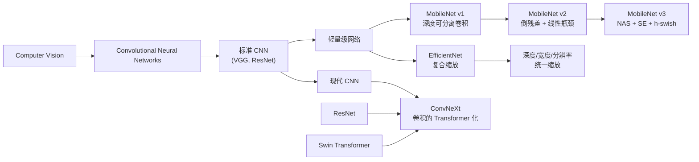
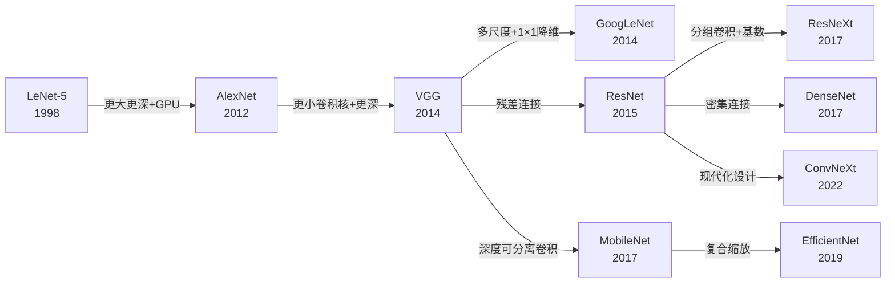
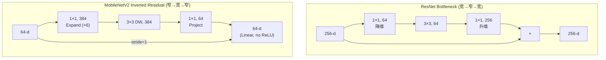
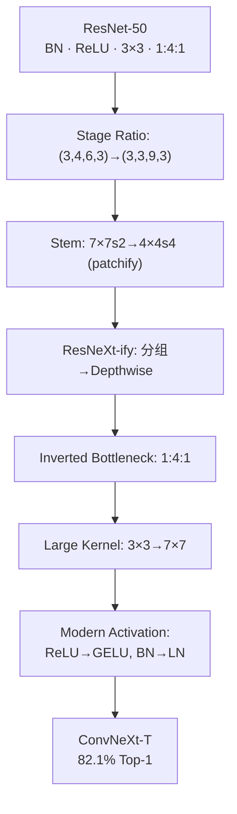

# MobileNet / EfficientNet / ConvNeXt

## 知识地图



## 前置知识

- 标准卷积（Spatial Convolution）和 Depthwise Convolution 的区别
- ResNet 的残差连接和 Bottleneck 结构
- Batch Normalization 的原理
- FLOPs 和参数量（Params）的计算
- ImageNet 图像分类基准
- 移动端部署中模型大小的约束（延迟 vs 精度权衡）

## 模型演化路线



| 模型 | 年份 | 关键创新 | 解决的问题 |
|------|------|---------|-----------|
| MobileNet v1 | 2017 | 深度可分离卷积 (Depthwise Separable Conv) | 标准卷积计算量过大，无法在手机上运行 |
| MobileNet v2 | 2018 | 倒残差 + 线性瓶颈 (Linear Bottleneck) | ReLU 在低维空间破坏信息 |
| MobileNet v3 | 2019 | NAS + SE 模块 + h-swish | 手工设计难以达到最优精度-速度平衡 |
| EfficientNet | 2019 | 复合缩放 (Compound Scaling) | 模型缩放缺乏系统性方法 |
| ConvNeXt | 2022 | 卷积的 Transformer 现代化 | 卷积 vs Transformer 架构的优劣之争 |

---

## MobileNet 系列

### MobileNet v1 — 深度可分离卷积

#### 为什么会出现

2017 年，顶尖的图像分类模型（如 ResNet-152）虽然有 80%+ 的 Top-1 精度，但需要 Giga 级别的 FLOPs，不可能在手机上实时运行（手机通常只有几百 MFLOPs 的算力预算）。Google 团队提出：**标准卷积同时做了"空间滤波"和"通道组合"两件事，能不能把它们分开，大幅降低计算量？**

#### 解决什么问题

在保持可接受精度的前提下，将模型的计算量和参数量降低 8-9 倍，使其能够在移动设备和嵌入式系统上实时运行。

#### 核心思想

**把标准卷积拆成两步：先对每个输入通道单独做空间卷积（Depthwise），再用 1×1 卷积混合通道信息（Pointwise）——计算量从 $D_K^2 \cdot M \cdot N \cdot D_F^2$ 降到 $D_K^2 \cdot M \cdot D_F^2 + M \cdot N \cdot D_F^2$。**

#### 数学定义

将标准卷积分解为 Depthwise + Pointwise：

$$\text{参数量比} = \frac{D_K^2 \cdot M + M \cdot N}{D_K^2 \cdot M \cdot N} = \frac{1}{N} + \frac{1}{D_K^2}$$

当 $N=512, D_K=3$，约减少 8-9 倍。

**通俗解释：** 标准卷积就像每个厨师（输出通道）独立查看所有食材（输入通道），在一个区域（3×3 空间）内做出自己的菜。深度可分离卷积分两步：第一步，每人只看自己的食材做一个初步处理（Depthwise）；第二步，所有厨师把各自的半成品混合调整（Pointwise）。相比每人独立做全部工序，省了大量重复工作。

两个超参数控制模型大小：
- **宽度乘数 $\alpha$**：通道数缩放（0.25, 0.5, 0.75, 1.0）
- **分辨率乘数 $\rho$**：输入分辨率缩放

**通俗解释：** $\alpha$ 控制网络"胖瘦"（通道越多越"聪明"但越慢），$\rho$ 控制输入图片"大小"（尺寸越大越清晰但越慢）。这两个简单的旋钮让开发者可以针对不同设备调整模型。

---

### MobileNet v2 — 倒残差 + 线性瓶颈

#### 为什么会出现

MobileNet v1 的深度可分离卷积很高效，但作者发现了一个关键问题：**ReLU 激活函数在低维空间会不可逆地丢失信息。** 深度可分离卷积的中间层通道数很少（只有输入通道数，如 64），ReLU 把这些低维特征中的负值全部清零，等于丢失了一半的信息。

所以 MobileNet v2 提出：**在低维空间用线性激活（不用 ReLU），在高维空间才用 ReLU——这和 ResNet（先降维再升维）正好相反，叫做"倒残差"。**

#### 解决什么问题

解决 ReLU 在低维流形中破坏信息的问题，同时进一步提升精度-效率比。

#### 核心思想

**ResNet 是"宽→窄→宽"（先压缩再恢复），MobileNet v2 反其道而行之——"窄→宽→窄"（先膨胀再压缩）。在低维输出层取消 ReLU，保留完整的流形信息。**

#### 可视化展示



### MobileNet v3

引入 SE 模块 (Squeeze-and-Excitation) 和 NAS 搜索，使用 h-swish 替代 swish。

**通俗解释：** MobileNet v3 是"自动设计（NAS）+ 小技巧（SE 注意力）+ 更便宜的激活函数（h-swish 替代 swish，省计算）"的产物——不再全靠手工设计，让算法自己搜索更好的结构。

---

## EfficientNet

### 为什么会出现

在 MobileNet 解决了轻量化之后，研究人员开始思考一个更基础的问题：**给定一个基础模型，如何系统性地放大它？** 过去人们随意地加深度（ResNet-50→152）、加宽度（Wide ResNet）、加大分辨率——都是单独调一个维度。Google 的 Mingxing Tan 等人发现，这三个维度之间存在联动关系：更大的图片需要更深的网络来处理更复杂的特征（更大感受野+更多语义层），更深（或更大）的网络需要更宽的层来捕捉更多样化的特征。

### 解决什么问题

如何**系统性地、平衡地**放大一个 CNN 模型的深度、宽度和输入分辨率，而不是凭手感只调一个维度。

### 核心思想

**用复合系数 $\phi$ 统一缩放深度、宽度和分辨率三个维度：$d = \alpha^\phi, w = \beta^\phi, r = \gamma^\phi$，并用网格搜索确定最优比例 $\alpha, \beta, \gamma$。**

### 数学模型

通过 NAS 找到基线模型 EfficientNet-B0，然后统一缩放三个维度：

$$d = \alpha^\phi, \quad w = \beta^\phi, \quad r = \gamma^\phi$$

约束：$\alpha \cdot \beta^2 \cdot \gamma^2 \approx 2$

**通俗解释：** 好比做蛋糕，如果你要做 2 倍大的蛋糕，不能只加鸡蛋（深度）不变面粉（宽度）——需要按比例一起加。$\alpha \cdot \beta^2 \cdot \gamma^2 \approx 2$ 的意思是：每次把模型的计算量翻倍（×2），深度、宽度、分辨率按固定比例同时增加。$\beta^2$ 和 $\gamma^2$ 是平方项，因为卷积的计算量与通道数的平方、分辨率的平方成正比。

| 模型 | 参数量 | Top-1 Acc |
|------|--------|-----------|
| B0 | 5.3M | 77.1% |
| B4 | 19M | 82.9% |
| B7 | 66M | 84.3% |

---

## ConvNeXt — 卷积的现代化

### 为什么会出现

2020-2021 年，Vision Transformer (ViT) 和 Swin Transformer 在 ImageNet 上超越了传统 CNN。这引发了一个问题：**CNN 真的过时了吗？还是说只是设计细节落后了？**

ConvNeXt 的作者团队（Facebook AI Research）决定做一个实验：从 ResNet-50 出发，逐步将 Swin Transformer 的设计元素"移植"到 CNN 上，纯粹用卷积组件、不做任何 attention——看看纯 CNN 能不能追上 Transformer。

答案是：**可以。** 这就是 ConvNeXt。

### 解决什么问题

挑战"Transformer 天生优于 CNN"的观点——证明经过现代化设计的纯卷积网络可以达到与 Swin Transformer 相同甚至更好的精度-效率比。

### 核心思想

**用 Swin Transformer 的设计哲学重新设计 ResNet：7×7 Depthwise 卷积 + 倒残差 + LayerNorm + GELU + 单独的降采样层——完全是卷积，但精度和 Swin Transformer 持平。**

### 从 ResNet 到 ConvNeXt 的现代化步骤

| 步骤 | ResNet-50 | → | ConvNeXt-T |
|------|-----------|---|------------|
| 训练策略 | 90 epochs | → | 300 epochs + 现代增强 |
| 阶段比 | (3,4,6,3) | → | (3,3,9,3) |
| Stem | 7×7, s=2 | → | 4×4, s=4 (patchify) |
| 卷积 | 3×3 分组 | → | 7×7 Depthwise |
| 瓶颈比 | 1:4:1 | → | 1:4:1 (inverted bottleneck) |
| 激活 | ReLU | → | GELU |
| 归一化 | BN | → | LayerNorm |
| 下采样 | 1×1, s=2 | → | 2×2, s=2 (separate) |

**通俗解释：** 传统 ResNet 像一个功能齐全的瑞士军刀——每层做很多事（大通道混合+空间卷积）。ConvNeXt 像把一个瑞士军刀拆成多个专用工具：空间卷积专门用 7×7 深度卷积（不看邻居通道），通道混合专门用 1×1 卷积，归一化用 LayerNorm（每个样本独立归一化），激活用更平滑的 GELU。每一步都更"专业化"。

### 可视化展示

#### ResNet → ConvNeXt 现代化路径



#### ConvNeXt vs Swin 对比

```echarts
return {
  tooltip: { trigger: "axis", confine: true },
  title: { top: 5,  text: 'ConvNeXt vs Swin Transformer', left: 'center', textStyle: { fontSize: 12 } },
  xAxis: { type: 'value', name: 'FLOPs (G)' },
  yAxis: { type: 'value', name: 'ImageNet Top-1 (%)', min: 81, max: 88 },
  series: [
    { name: 'ConvNeXt', type: 'line', smooth: true,
      data: [[4.5,82.1], [8.7,83.8], [15.4,84.9], [34.4,85.8]],
      lineStyle: { color: '#16a085', width: 2.5 },
      symbolSize: 8 },
    { name: 'Swin Transformer', type: 'line', smooth: true,
      data: [[4.5,81.3], [8.7,83.3], [15.4,84.5], [34.5,85.2]],
      lineStyle: { color: '#2980b9', width: 2.5 },
      symbolSize: 8 }
  ],
  grid: { left: 60, right: 20, top: 55, bottom: 60 }
}
```

---

## 最小可运行代码

### MobileNet v2 倒残差块

```python
import torch
import torch.nn as nn

class InvertedResidual(nn.Module):
    """MobileNet v2 倒残差块：Expand → Depthwise → Project"""
    def __init__(self, in_ch, out_ch, stride, expand_ratio=6):
        super().__init__()
        hidden_dim = in_ch * expand_ratio
        self.use_residual = stride == 1 and in_ch == out_ch

        layers = []
        if expand_ratio != 1:
            layers.append(nn.Conv2d(in_ch, hidden_dim, 1, bias=False))
            layers.append(nn.BatchNorm2d(hidden_dim))
            layers.append(nn.ReLU6(inplace=True))
        layers.extend([
            nn.Conv2d(hidden_dim, hidden_dim, 3, stride, 1,
                      groups=hidden_dim, bias=False),  # Depthwise
            nn.BatchNorm2d(hidden_dim),
            nn.ReLU6(inplace=True),
            nn.Conv2d(hidden_dim, out_ch, 1, bias=False),  # Pointwise (Project)
            nn.BatchNorm2d(out_ch),
        ])
        # 注意：最后的 Pointwise 后没有 ReLU（线性瓶颈）
        self.conv = nn.Sequential(*layers)

    def forward(self, x):
        if self.use_residual:
            return x + self.conv(x)
        return self.conv(x)
```

关键：最后的 Pointwise 卷积后使用**线性激活**（ReLU 会破坏低维流形信息）。

### EfficientNet MBConv 核心组件

```python
class MBConvBlock(nn.Module):
    """EfficientNet 的 Mobile Inverted Bottleneck + SE"""
    def __init__(self, in_ch, out_ch, kernel_size, stride,
                 expand_ratio, se_ratio=0.25, drop_rate=0.0):
        super().__init__()
        hidden_ch = in_ch * expand_ratio
        self.use_residual = stride == 1 and in_ch == out_ch

        # Expand
        layers = [nn.Conv2d(in_ch, hidden_ch, 1, bias=False),
                  nn.BatchNorm2d(hidden_ch), nn.SiLU(inplace=True)]
        # Depthwise
        layers += [nn.Conv2d(hidden_ch, hidden_ch, kernel_size, stride,
                             padding=kernel_size//2, groups=hidden_ch, bias=False),
                   nn.BatchNorm2d(hidden_ch), nn.SiLU(inplace=True)]
        # Squeeze-and-Excitation
        se_ch = max(1, int(in_ch * se_ratio))
        layers += [nn.AdaptiveAvgPool2d(1),
                   nn.Conv2d(hidden_ch, se_ch, 1), nn.SiLU(inplace=True),
                   nn.Conv2d(se_ch, hidden_ch, 1), nn.Sigmoid()]
        # Project
        layers += [nn.Conv2d(hidden_ch, out_ch, 1, bias=False),
                   nn.BatchNorm2d(out_ch)]
        self.conv = nn.Sequential(*layers)

    def forward(self, x):
        out = self.conv(x)
        if self.use_residual:
            out = x + out
        return out
```

### torchvision 内置使用

```python
import torchvision.models as models

# MobileNet 系列
mobilenet_v2 = models.mobilenet_v2(weights=None)
mobilenet_v3_small = models.mobilenet_v3_small(weights=None)
mobilenet_v3_large = models.mobilenet_v3_large(weights=models.MobileNet_V3_Large_Weights.IMAGENET1K_V1)

# EfficientNet 系列
efficientnet_b0 = models.efficientnet_b0(weights=None)
efficientnet_b4 = models.efficientnet_b4(weights=None)

# ConvNeXt 系列
convnext_tiny  = models.convnext_tiny(weights=None)
convnext_small = models.convnext_small(weights=None)
convnext_base  = models.convnext_base(weights=None)

# 参数量统计
for name, model in [("MobileNetV2", mobilenet_v2), ("EfficientNet-B0", efficientnet_b0),
                     ("ConvNeXt-T", convnext_tiny)]:
    params = sum(p.numel() for p in model.parameters()) / 1e6
    print(f"{name}: {params:.1f}M parameters")
```

---

## 工业界应用

| 模型 | 应用场景 | 原因 |
|------|---------|------|
| MobileNet v2 | 手机端实时图像分类 | 极低 FLOPs（~300M），推理延迟 < 10ms |
| MobileNet v3 | 移动端目标检测 (SSD-Lite) | h-swish 在移动 CPU 上速度快 |
| MobileNet v2 | 嵌入式设备人脸检测 | 极小模型（< 14MB），适合廉价芯片 |
| EfficientNet-B4 | 云端高精度图像分类 | 精度接近 ResNet-152 但参数少 3 倍 |
| EfficientNet-B7 | 竞赛级图像分类 | 84.3% Top-1，当时 SOTA |
| ConvNeXt-T | 目标检测 backbone | 卷积实现，对硬件更友好但精度匹敌 Swin |
| ConvNeXt-B | 图像分割 (Mask R-CNN) | 层级特征图质量高 |

---

## 对比表格

| 维度 | MobileNet v2 | MobileNet v3 | EfficientNet-B0 | ConvNeXt-T |
|------|-------------|-------------|-----------------|------------|
| 年份 | 2018 | 2019 | 2019 | 2022 |
| 参数量 | 3.5M | 5.4M (Large) | 5.3M | 29M |
| FLOPs | 300M | 219M | 390M | 4.5G |
| ImageNet Top-1 | 72.0% | 75.2% | 77.1% | 82.1% |
| 核心创新 | 倒残差+线性瓶颈 | NAS+SE+h-swish | 复合缩放 | 卷积现代化 |
| 设计方法 | 手工 | NAS + 手工 | NAS + 公式 | 手工（借鉴 Transformer） |
| 部署目标 | 手机 | 手机 | 手机到云端 | 云端（GPU） |

---

## 学完后建议继续学习

- [SENet / ShuffleNet / GhostNet](/learn/senet-shufflenet) — 了解通道注意力机制和更多轻量架构技巧
- [ConvNeXt / GhostNet](/learn/convnext-ghostnet) — 深入了解 ConvNeXt 的完整实现和 Ghost Module
- [ResNeXt / DenseNet](/learn/resnext-densenet) — 了解分组卷积的演变（ResNeXt 的分组卷积是深度可分离卷积的前身）

---

## 高频面试题

### Q1: 深度可分离卷积（Depthwise Separable Convolution）和标准卷积有什么区别？为什么能减少计算量？

**答案：** 标准卷积的每个输出通道需要对所有输入通道的每个空间位置做加权求和，即同时做**空间滤波**和**通道混合**。深度可分离卷积把这两步拆开：
1. **Depthwise**：每个输入通道独立做一次 3×3 空间卷积（不混合通道）。
2. **Pointwise**：用 1×1 卷积混合通道信息。

计算量对比（以输出 $D_F \times D_F$ 的特征图为例）：
- 标准卷积：$D_K^2 \times M \times N \times D_F^2$
- 深度可分离：$D_K^2 \times M \times D_F^2 + M \times N \times D_F^2$
- 比值：$\frac{1}{N} + \frac{1}{D_K^2}$，当 N=512, D_K=3 时仅约 1/8。

**通俗解释：** 洗衣服（标准卷积）需要每件衣服跟每件衣服互相搓。分开洗（Depthwise）是每件单独漂洗，然后一起甩干混合（Pointwise）——省了大量无效的互相摩擦。

### Q2: MobileNet v2 的"倒残差（Inverted Residual）"和 ResNet 的残差有什么区别？为什么叫"倒"？

**答案：** 

| 特性 | ResNet Bottleneck | MobileNet v2 Inverted Residual |
|------|------------------|-------------------------------|
| 通道变化 | 宽→窄→宽（256→64→256） | 窄→宽→窄（64→384→64） |
| 中间层激活 | ReLU | ReLU6 |
| 最后激活 | ReLU | 无（Linear Bottleneck） |
| 连接方式 | 加法 | 加法（仅 stride=1 且通道不变时） |

"倒"的含义：ResNet 先降维（节省计算）再恢复，MobileNet v2 先膨胀（6 倍）再压缩。因为 Depthwise 卷积不改变通道数，如果它在低通道数下工作，每个输出通道只看自己的一个输入通道——表达能力太弱。所以先在通道上膨胀 6 倍，让 Depthwise 在丰富的中间表示上工作，然后压缩回原来的低通道数。

### Q3: EfficientNet 的复合缩放（Compound Scaling）为什么比单独缩放一个维度更好？

**答案：** 深度、宽度、分辨率三个维度是联动的，不是独立的：
- **分辨率变大** → 需要更多的卷积层来获得足够大的感受野（更深的网络）。
- **宽度变大** → 每一层能捕捉更丰富的特征，但需要更多层来处理这些特征（更深的网络）。
- **深度增加** → 网络在后层学到的语义特征更丰富，需要更高的分辨率来保留细节。

$$\text{FLOPs} \propto d \cdot w^2 \cdot r^2$$

如果单独加大分辨率（r 翻倍），FLOPs 变为 4 倍但精度提升有限——因为网络的深度和宽度没跟上，无法处理更高分辨率带来的更复杂特征。复合缩放按最优比例同时增加三者：$d = \alpha^\phi, w = \beta^\phi, r = \gamma^\phi$，在相同的 FLOPs 预算下达到最高精度。

### Q4: ConvNeXt 和 Swin Transformer 有什么本质区别？为什么 ConvNeXt 能匹敌 Swin？

**答案：** 本质区别：
- **Swin Transformer**：基于窗口的 self-attention，每个 token（patch）通过 attention 机制动态地聚集周围 token 的信息。
- **ConvNeXt**：基于 7×7 深度卷积，每个位置的感受野是固定的 7×7 邻域，通过固定的卷积权重聚集信息。

ConvNeXt 能匹敌 Swin 的原因：
1. **大卷积核**（7×7）：接近 Swin 中 7×7 窗口 attention 的感受野。
2. **深度卷积**：每个输出通道独立计算，类似于 attention 的 head。
3. **倒残差**：先扩展→做空间操作→再压缩，类似于 Transformer 的 FFN 设计（hidden_dim 是输入维度的 4 倍）。
4. **LayerNorm + GELU**：与 Transformer 使用相同的基础组件。

这说明：不是 attention 机制本身的优越性，而是 Transformer 社区积累的**训练技巧和设计范式**在起作用。

### Q5: MobileNet v3 的 h-swish 是什么？为什么用它替代 ReLU？

**答案：** h-swish（hard swish）是 swish 激活函数的硬件友好近似：

$$\text{swish}(x) = x \cdot \sigma(x)$$
$$\text{h-swish}(x) = x \cdot \frac{\text{ReLU6}(x+3)}{6}$$

swish 函数（由 NAS 搜索发现）在深层网络中效果优于 ReLU，但 $\sigma(x)$（sigmoid）在移动设备上计算昂贵。h-swish 用分段线性的 ReLU6 近似 sigmoid 的平滑曲线，大幅降低了计算成本，同时保持了接近 swish 的精度收益。MobileNet v3 只在网络的后半段使用 h-swish（前半段用 ReLU），因为在低分辨率特征图上 h-swish 的计算开销减小。
