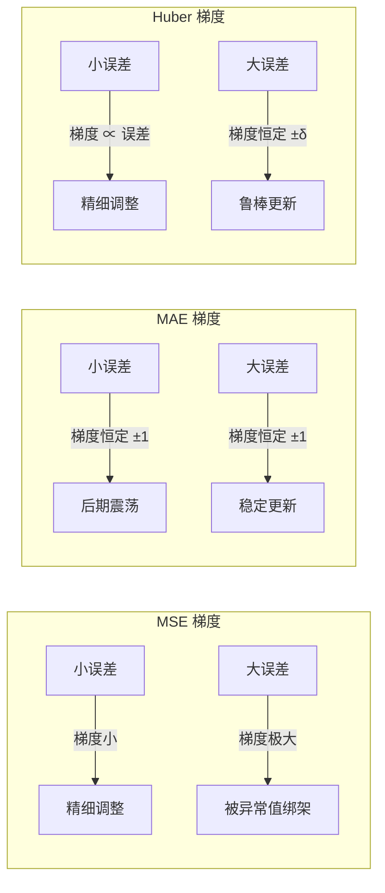

# MSE / MAE / Huber Loss

## 知识地图

```mermaid
graph LR
    Loss[损失函数家族] --> Regression[回归损失]
    Loss --> Classification[分类损失]
    Regression --> MSE[MSE / L2 Loss<br/>平方惩罚，对大误差零容忍]
    Regression --> MAE[MAE / L1 Loss<br/>线性惩罚，对异常值友好]
    Regression --> Huber[Huber Loss / Smooth L1<br/>小误差平方 + 大误差线性]
    Classification --> CE[Cross-Entropy Loss]
    MSE --> Optimizer[优化器选择<br/>梯度 ∝ 误差大小]
    MAE --> Optimizer
    Huber --> ObjectDetection[目标检测<br/>Smooth L1 / BBox 回归]
    MSE --> LinearReg[线性回归的最优解<br/>条件均值 E[Y|X]]
    MAE --> QuantileReg[分位数回归的最优解<br/>条件中位数 median(Y|X)]

    style MSE fill:#c0392b,stroke:#922b21,color:#fff
    style MAE fill:#2c3e50,stroke:#1a252f,color:#fff
    style Huber fill:#16a085,stroke:#0e6655,color:#fff
```

## 前置知识

- **损失函数基础**：理解损失函数衡量预测值与真实值之间差距的概念
- **梯度下降**：知道优化器依赖损失函数的梯度来更新参数
- **统计学基础**：理解均值、中位数、异常值 (Outlier) 的概念
- **概率视角**：MSE 等价于高斯噪声假设下的最大似然估计，MAE 等价于拉普拉斯噪声假设

## 为什么会出现 (Why)

**MSE** 是最自然的回归损失函数——平方误差，导数简单，数学性质优良（凸、可导）。但它的平方惩罚特性意味着：误差从 2 变成 10，损失从 4 暴增到 100。一个异常值就会完全主导总损失，把模型的注意力全部吸走（模型被异常值"牵着走"）。

**MAE** 的提出正是为了解决异常值问题——对所有误差一视同仁，误差翻倍损失也只翻倍。但 MAE 在零点不可导，且对所有误差的梯度都是常数（±1），这意味着训练后期，即使预测已经接近真实值，梯度也不会变小——优化器在最优解附近来回震荡，无法精细收敛。

**Huber Loss** 是一个折中方案：在误差小的时候（$|e| \leq \delta$）使用 MSE，保留平滑性和尺度敏感度；在误差大的时候（$|e| > \delta$）使用 MAE，限制异常值的影响。目标检测中的 Smooth L1 Loss 就是 Huber Loss 的特例（$\delta = 1$）。

## 解决什么问题 (Problem)

| 损失函数 | 解决的问题 |
|----------|-----------|
| **MSE** | 需要一个可导、凸、梯度随误差缩小的回归损失 |
| **MAE** | MSE 对异常值过于敏感 → 用线性惩罚替代平方惩罚 |
| **Huber** | MAE 在零点不可导且梯度恒定 → 小误差用 MSE，大误差用 MAE |

## 核心思想 (Core Idea)

**三条损失函数的核心区别在于如何惩罚预测误差——MSE 平方放大误差（对大误差零容忍），MAE 平等对待所有误差（对异常值友好），Huber 在两者之间平滑过渡：误差小用二次，误差大用线性。**

---

## 数学模型/公式

### MSE (Mean Squared Error / L2 Loss)

$$
\text{MSE} = \frac{1}{n} \sum_{i=1}^{n} (y_i - \hat{y}_i)^2
$$

> **通俗解释：** 把每个预测误差平方后求平均。误差为 2 时损失是 4，误差为 10 时损失是 100——MSE 对大误差的"罚款"是灾难级的，所以模型会拼命避免任何大误差，哪怕牺牲大多数样本的精度。

**梯度**：$\frac{\partial \text{MSE}}{\partial \hat{y}_i} = \frac{2}{n} (\hat{y}_i - y_i)$

> **通俗解释：** 梯度与误差大小成正比。预测偏离真实值 10 时，梯度是偏离 1 时的 10 倍——优化器收到非常强的"纠正信号"，大步往回拉。这就是 MSE 收敛快但易被异常值绑架的原因。

- 梯度与误差大小**成正比** → 大误差产生强梯度信号，收敛快
- 对大误差（异常值）极度敏感 → 模型会被异常值"牵着走"
- 最优预测是**条件均值** $E[Y|X]$

### MAE (Mean Absolute Error / L1 Loss)

$$
\text{MAE} = \frac{1}{n} \sum_{i=1}^{n} |y_i - \hat{y}_i|
$$

> **通俗解释：** 把每个预测误差的绝对值求平均。误差为 2 时损失是 2，误差为 10 时损失是 10——MAE 对所有误差"一视同仁"，不因误差大而加倍惩罚。相当于从"严苛的平方惩罚"变成了"公平的线性罚款"。

**梯度**：$\frac{\partial \text{MAE}}{\partial \hat{y}_i} = \frac{1}{n} \cdot \text{sign}(\hat{y}_i - y_i)$

> **通俗解释：** 梯度永远是 ±1/n（除非预测完全命中，此时不可导）。这意味着不管误差是 0.1 还是 100，优化器收到的"纠正力度"都一样。好处是异常值不会绑架模型，坏处是训练后期（误差已经很小了）优化器依然大步跳跃，无法精细收敛到最优解。

- 梯度恒为 $\pm 1/n$（除完美预测外）→ 训练后期振荡，难以精细收敛
- 对异常值**鲁棒** → 所有误差一视同仁
- 最优预测是**条件中位数** $\text{median}(Y|X)$
- 在 $\hat{y} = y$ 处**不可导**

### Huber Loss (Smooth L1)

$$
\text{Huber}(y, \hat{y}) = \begin{cases} \frac{1}{2}(y - \hat{y})^2 & |y - \hat{y}| \leq \delta \\ \delta(|y - \hat{y}| - \frac{1}{2}\delta) & |y - \hat{y}| > \delta \end{cases}
$$

> **通俗解释：** Huber Loss 就像一个"双模"罚款规则：如果误差不超过 $\delta$（好比 1 米），按平方来罚款（MSE 模式，精细）；如果误差超过 $\delta$，换用线性罚款（MAE 模式，不被绑架）。$\frac{1}{2}\delta$ 的减法是保证在分界点 $|e| = \delta$ 处两个函数的值和斜率都连续（光滑拼接）。

- $|e| \leq \delta$：二次（平滑、梯度含大小信息）
- $|e| > \delta$：线性（对异常值鲁棒）
- $\delta$ 控制切换阈值，常用 $\delta = 1.0$

---

## 可视化展示

### 三条损失函数曲线对比

```echarts
return {
  xAxis: { type: 'value', min: -4, max: 4, name: '预测误差 e = ŷ - y' },
  yAxis: { type: 'value', min: 0, max: 8, name: 'Loss' },
  legend: { top: 28,  data: ['MSE (e²)', 'MAE (|e|)', 'Huber (δ=1.0)'] },
  series: [
    {
      name: 'MSE (e²)', type: 'line', smooth: true,
      lineStyle: { color: '#c0392b', width: 2 },
      data: (function() { const d = []; for (let i = -4; i <= 4; i += 0.02) d.push([i, i * i]); return d; })()
    },
    {
      name: 'MAE (|e|)', type: 'line', smooth: false,
      lineStyle: { color: '#2c3e50', width: 2 },
      data: (function() { const d = []; for (let i = -4; i <= 4; i += 0.02) d.push([i, Math.abs(i)]); return d; })()
    },
    {
      name: 'Huber (δ=1.0)', type: 'line', smooth: true,
      lineStyle: { color: '#16a085', width: 2.5 },
      data: (function() {
        const d = [];
        const delta = 1.0;
        for (let i = -4; i <= 4; i += 0.02) {
          const abs = Math.abs(i);
          d.push([i, abs <= delta ? 0.5 * i * i : delta * (abs - 0.5 * delta)]);
        }
        return d;
      })()
    }
  ],
  tooltip: { trigger: 'axis' },
  grid: { left: 60, right: 20, top: 40, bottom: 60 }
}
```

观察 MSE 曲线在 $|e| > 2$ 后急剧上升——这正是它对异常值敏感的根源。

### 异常值对最优解的影响

```echarts
return {
  tooltip: { trigger: "axis", confine: true },
  title: { top: 5,  text: '不同损失函数的最优解位置' },
  xAxis: { type: 'value', name: 'x' },
  yAxis: { type: 'value', name: 'Loss' },
  legend: { top: 28,  data: ['数据点', 'MSE最优(均值)', 'MAE最优(中位数)'] },
  series: [
    { name: '数据点', type: 'scatter', data: [[1,0],[1.2,0],[1.1,0],[0.9,0],[1.3,0],[10,0]], symbolSize: 8, itemStyle: { color: '#2c3e50' } },
    { name: 'MSE最优(均值)', type: 'line', markLine: { data: [{ xAxis: 2.58, label: { formatter: '均值=2.58' } }], silent: true, lineStyle: { color: '#c0392b' } } },
    { name: 'MAE最优(中位数)', type: 'line', markLine: { data: [{ xAxis: 1.15, label: { formatter: '中位数=1.15' } }], silent: true, lineStyle: { color: '#16a085' } } },
  ],
  grid: { left: 60, right: 20, top: 55, bottom: 60 }
}
```

当数据中存在一个异常值（$x=10$），MSE 最优解被"拉向"异常值，而 MAE 最优解保持在中位数附近。

### 梯度行为对比



---

## 最小可运行代码

### PyTorch

```python
import torch.nn as nn

mse = nn.MSELoss()
mae = nn.L1Loss()
huber = nn.SmoothL1Loss(beta=1.0)  # beta 即 δ
```

### NumPy 手写

```python
import numpy as np

def mse(y_true, y_pred):
    return np.mean((y_true - y_pred) ** 2)

def mae(y_true, y_pred):
    return np.mean(np.abs(y_true - y_pred))

def huber(y_true, y_pred, delta=1.0):
    e = np.abs(y_true - y_pred)
    return np.mean(np.where(e <= delta, 0.5 * e**2, delta * (e - 0.5 * delta)))
```

### 训练示例：对比三种 Loss 在含异常值数据上的表现

```python
import torch
import torch.nn as nn
import torch.optim as optim

# 构造含异常值的数据
torch.manual_seed(42)
X = torch.linspace(-3, 3, 100).reshape(-1, 1)
y = 2 * X.squeeze() + 1 + 0.3 * torch.randn(100)  # y = 2x + 1 + noise
y[95:] += 15  # 加入异常值

def train_with_loss(loss_fn, name):
    model = nn.Linear(1, 1)
    optimizer = optim.SGD(model.parameters(), lr=0.01)
    for epoch in range(500):
        optimizer.zero_grad()
        loss = loss_fn(model(X).squeeze(), y)
        loss.backward()
        optimizer.step()
    w, b = model.weight.item(), model.bias.item()
    print(f"{name}: w={w:.3f}, b={b:.3f}")
    return w, b

# MSE 会被异常值拉偏
train_with_loss(nn.MSELoss(), "MSE")
# MAE 不受异常值影响
train_with_loss(nn.L1Loss(), "MAE")
# Huber 折中
train_with_loss(nn.SmoothL1Loss(beta=1.0), "Huber")
```

---

## 工业界应用

| 应用场景 | 使用的 Loss | 为什么 | 优点 | 缺点 |
|----------|------------|--------|------|------|
| **房价预测 / 金融回归** | MAE 或 Huber | 数据常含极端异常值（天价豪宅） | 不受异常值绑架 | MAE 收敛慢 |
| **图像重建 / 超分辨率** | MSE 或 Charbonnier | 像素级回归，噪声通常服从高斯分布 | 收敛快，PSNR 直接优化 | 生成图像偏模糊 |
| **目标检测 BBox 回归** | Smooth L1 (Huber δ=1) | 预测框与真值框误差分布多变 | 训练稳定，对大小框都公平 | 需要设置 δ |
| **关键点检测** | MSE | 关键点坐标通常噪声较小 | 精度高 | 离群关键点干扰 |
| **强化学习价值函数** | Huber | TD 误差分布厚尾 | 训练稳定 | 多一个 δ 超参数 |
| **天气 / 能源预测** | Huber | 极端天气是异常值但不应被忽略 | 平衡鲁棒性与精度 | δ 选择依赖领域知识 |
| **自动驾驶轨迹预测** | Huber | 传感器噪声 + 偶发野值 | 不因野值崩溃 | 需联合调参 |

---

## 优缺点对比

| 损失函数 | 对异常值 | 梯度行为 | 最优解 | 典型场景 | 关键缺点 |
|----------|----------|----------|--------|----------|----------|
| **MSE** | 敏感 | 梯度 ∝ 误差大小，大误差强梯度 | 条件均值 | 常规回归，数据干净 | 一个异常值毁全局 |
| **MAE** | 鲁棒 | 梯度 = ±1 恒定，后期震荡 | 条件中位数 | 有异常值的回归 | 零点不可导，收敛不稳定 |
| **Huber** | 鲁棒（可调） | 平滑过渡，小误差梯度大、大误差梯度恒定 | 介于均值/中位数之间 | 目标检测 BBox 回归 | 多一个超参数 δ |

---

## 对比表格

### MSE vs MAE vs Huber 全面对比

| 维度 | MSE (L2) | MAE (L1) | Huber (Smooth L1) |
|------|----------|----------|-------------------|
| **公式核心** | $(y - \hat{y})^2$ | $|y - \hat{y}|$ | $\delta$ 内平方、外线性 |
| **可导性** | 全局可导 | 零点不可导 | 全局可导 |
| **梯度尺度** | 与误差成正比 | 常数 ±1 | 平滑过渡 |
| **异常值处理** | 极度敏感（error² 爆炸） | 鲁棒（error 线性） | 鲁棒（大误差线性） |
| **收敛速度** | 快（远离最优解时梯度大） | 慢（梯度恒定） | 快（小误差区梯度含信息） |
| **最优解** | 条件均值 $E[Y\|X]$ | 条件中位数 median$(Y\|X)$ | 介于两者之间 |
| **概率解释** | 高斯噪声 MLE | 拉普拉斯噪声 MLE | 混合分布 |
| **PyTorch** | `nn.MSELoss()` | `nn.L1Loss()` | `nn.SmoothL1Loss(beta=δ)` |
| **数值稳定性** | 好 | 零点需处理 | 好（设计上连续可导） |
| **超参数** | 无 | 无 | δ（通常默认 1.0） |

### 概率视角：MSE vs MAE 的假设

| 维度 | MSE 假设 | MAE 假设 |
|------|----------|----------|
| **噪声分布** | 高斯分布 $\epsilon \sim N(0, \sigma^2)$ | 拉普拉斯分布 $\epsilon \sim \text{Laplace}(0, b)$ |
| **负对数似然** | $-\log p(y|x) \propto (y - \hat{y})^2$ | $-\log p(y|x) \propto |y - \hat{y}|$ |
| **尾部行为** | 轻尾（大误差概率指数衰减） | 重尾（大误差概率线性衰减） |
| **适合的场景** | 测量误差为主，无野值 | 存在偶发性大误差 |

---

## 学完后建议继续学习

- [Cross-Entropy Loss](cross-entropy.md) — 理解分类任务中交叉熵 + Softmax 的优雅梯度
- [L1 / L2 正则化](l1-l2-regularization.md) — L1/L2 正则化与 L1/L2 Loss 的相似数学形式与不同用途
- [SGD / Momentum / Nesterov](sgd-momentum.md) — 损失函数的梯度直接决定 SGD 的优化路径
- [Adam 与 AdamW 优化器详解](adam-adamw.md) — 自适应优化器如何处理不同尺度的梯度

---

## 高频面试题

### Q1: MSE 和 MAE 的最优解分别是条件均值和条件中位数，如何从数学上证明？

**标准回答：** 对于 MSE，最小化 $E[(Y - \hat{y})^2 | X]$，对 $\hat{y}$ 求导得 $E[2(\hat{y} - Y) | X] = 0$，解得 $\hat{y}^* = E[Y|X]$（条件均值）。

对于 MAE，最小化 $E[|Y - \hat{y}| | X]$，对 $\hat{y}$ 求导（注意绝对值在 0 处不可导，使用次导数）得 $P(Y < \hat{y}) - P(Y > \hat{y}) = 0$，即 $P(Y < \hat{y}) = P(Y > \hat{y}) = 0.5$，解得 $\hat{y}^* = \text{median}(Y|X)$（条件中位数）。

这就是为什么有异常值时 MAE 更鲁棒：中位数不受极端值影响，而均值会被极端值严重拉偏。

### Q2: Huber Loss 为什么要在 $|e| = \delta$ 处连续可导？如何保证？

**标准回答：** 不可导点在梯度下降中会导致优化不稳定（次梯度不唯一，振荡）。Huber Loss 通过分段定义保证在 $\delta$ 处：
- 函数值连续：$\frac{1}{2}\delta^2 = \delta(\delta - \frac{1}{2}\delta)$ ✓
- 导数连续：左导数 $\delta$，右导数 $\delta$ ✓

公式中 $-\frac{1}{2}\delta$ 项正是为了保证连续性而非功能性需要。"Smooth" 的命名正是源于这种连续可导的设计。

### Q3: 目标检测中为什么用 Smooth L1 Loss 而不是直接用 MSE？

**标准回答：** 边界框回归的预测误差分布极不均匀——小目标和大目标的坐标误差在像素级上差异巨大。如果用 MSE，错误预测的大偏差会产生巨大的梯度，导致训练不稳定甚至梯度爆炸。Smooth L1（Huber δ=1）在误差大于 1 时切换到线性模式，抑制了大误差的梯度，保持训练稳定。同时，在误差小于 1 时保留二次行为，保证最终的精细回归精度。

Faster R-CNN 论文中的消融实验证实：Smooth L1 的 mAP 显著高于 L2 Loss。

### Q4: 如何根据数据特征选择 MSE / MAE / Huber？

**标准回答：** 决策树：
1. 先看数据有没有异常值——如果有明确异常值且不想删除它们 → MAE 或 Huber
2. 如果数据干净或有预处理（如剔除离群点）→ MSE（收敛快、精度高）
3. 如果需要梯度尺度信息（如大误差需要大步纠正）→ MSE 或 Huber（小误差区）
4. 如果零点不可导会带来工程问题（如需要二阶优化方法）→ MSE 或 Huber
5. 如果有资源做超参数搜索 → Huber（多一个 δ 可调，更灵活）
6. 默认选择：数据干净用 MSE，有异常值用 Huber(δ=1.0)，极端异常值场景用 MAE

### Q5: 为什么回归用 MSE 而分类用交叉熵？MSE 能用于分类吗？

**标准回答：** MSE 可以用于分类（效果远不如交叉熵）。核心原因在于梯度行为：

在二分类中，当预测概率 $\hat{y} = 0.999$ 而 $y=1$ 时：
- 交叉熵的梯度 $\propto 1/\hat{y}$，仍然有非零信号继续优化
- MSE 的梯度 $\propto (\hat{y} - y) \cdot \hat{y}(1-\hat{y})$，当 $\hat{y}$ 趋近于 1 时，$\hat{y}(1-\hat{y}) \to 0$，梯度消失

另外，交叉熵 + Softmax 组合产生的梯度形式为 $\frac{\partial L}{\partial z} = \hat{y} - y$，极其简洁。而 MSE + Sigmoid 的梯度会多出一个 $\sigma'(z)$ 因子，在饱和区趋近于 0，导致"学不动"的问题。这也解释了为什么分类任务中交叉熵是不可替代的标配。
