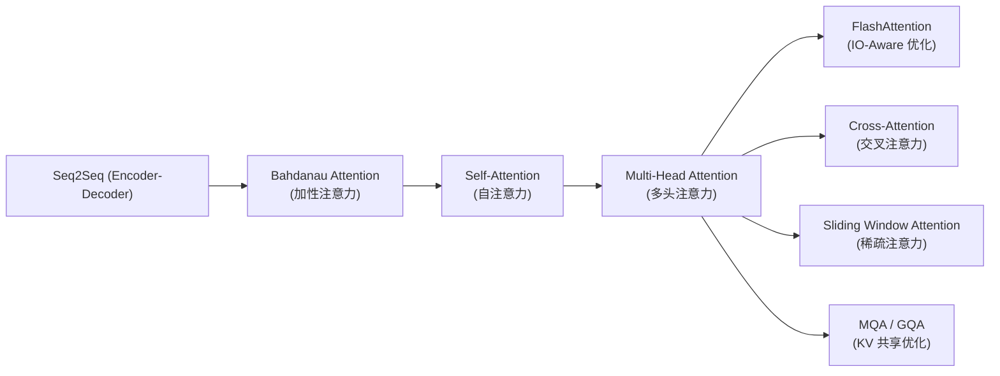
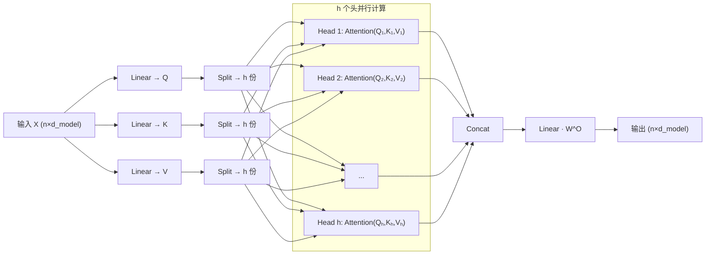

# Multi-Head Attention (多头注意力)

## 知识地图



## 前置知识

- **Self-Attention 机制**：理解 Q、K、V 投影和 Scaled Dot-Product Attention 的计算流程
- **矩阵分块与拼接**：理解 view/reshape 和 transpose 如何在张量中拆分和合并维度
- **线性代数的子空间概念**：不同投影矩阵将同一个向量映射到不同的表示子空间

## 为什么会出现 (Why)

单头 Self-Attention 有一个根本局限：**平均化效应**。一个注意力头只产生一个注意力分布，这意味着模型只能学一种"关系模式"。如果将 Q、K、V 的所有信息压缩到一个注意力分布，不同类型的语义关系（语法、共指、主题、位置）被强行混合在一起，模型无法同时捕捉多种不同的依赖模式。

举个例子：在句子 "The cat sat on the mat because it was tired" 中，"it" 需要同时关注 "cat"（共指关系）和 "tired"（因果关系），单头注意力只能产生一种折中的注意力分布，无法同时精准覆盖。

## 解决什么问题 (Problem)

Multi-Head Attention 解决的核心问题：**如何让模型同时从多个不同"视角"理解序列，在不同表示子空间中捕捉不同类型的依赖关系。**

一个头看语法结构，一个头看共指消解，一个头看长距离依赖，一个头看局部邻近——最后将这些信息汇总，形成比单头更丰富的表示。

## 核心思想 (Core Idea)

**将 Q、K、V 切成 $h$ 份，每份（一个"头"）在不同的表示子空间中独立做注意力，最后拼接——相当于让模型同时从 $h$ 个不同"视角"理解序列。**

---

## 数学公式

### 完整公式

$$
\text{MultiHead}(\mathbf{Q}, \mathbf{K}, \mathbf{V}) = \text{Concat}(\text{head}_1, \ldots, \text{head}_h) \mathbf{W}^O
$$

$$
\text{head}_i = \text{Attention}(\mathbf{Q} \mathbf{W}_i^Q, \mathbf{K} \mathbf{W}_i^K, \mathbf{V} \mathbf{W}_i^V)
$$

其中投影矩阵维度：

$$
\mathbf{W}_i^Q, \mathbf{W}_i^K \in \mathbb{R}^{d_{model} \times d_k}, \quad \mathbf{W}_i^V \in \mathbb{R}^{d_{model} \times d_v}, \quad \mathbf{W}^O \in \mathbb{R}^{h d_v \times d_{model}}
$$

通常设 $d_k = d_v = d_{model} / h$，使得**多头总计算量与单头几乎相同**（仅多了一个 $W^O$ 投影）。

**通俗解释：** 想象你有一篇文章需要分析。如果只派一个人去读，他只能从一个角度理解。如果派 8 个人同时读，一个人看语法，一个人看逻辑，一个人看情感，一个人看人物关系……最后把 8 个人的笔记拼在一起，你对这篇文章的理解就立体得多。Multi-Head Attention 就是这个思路——每个"头"有自己的 $W^Q, W^K, W^V$，相当于每个人戴不同的"眼镜"看同一段文字，捕捉不同的特征。

### 为什么需要多头？

**单头的问题**：平均化效应。如果将 Q、K、V 的所有信息压缩到一个注意力分布，不同关系被混在一起。

**多头的优势**：

- Head 1 可能关注**句法关系**（如"定语-中心词"）
- Head 2 可能关注**共指关系**（如"Trump → he"）
- Head 3 可能关注**位置邻近性**（相邻词）
- Head 4 可能关注**全局主题词**

**通俗解释：** 为什么一个头不够？因为注意力分布是概率分布——所有位置的和为 1。如果你让 "it" 同时高度关注 "cat" 和 "tired"，那它对其他位置关注就会降低。多头相当于给模型 $h$ 次"投票"机会，每次可以产生不同的注意力分布，各自关注不同的东西。

### 多头合并的张量操作

```python
# 输入: [B, N, d_model]
# 投影后: [B, N, h, d_k]
# transpose: [B, h, N, d_k]  → 每头独立做 attention
# 合并: [B, h, N, d_k] → [B, N, h·d_k] → W_o → [B, N, d_model]
```

**通俗解释：** 把一个大房间（d_model 维）隔成 $h$ 个小隔间（d_k 维），每个隔间里独立完成注意力计算，最后拆掉隔板把所有结果拼回来，再做一个总整理（$W^O$）。

---

## 可视化展示

### Multi-Head Attention 架构



### 注意力矩阵概念

在 Multi-Head Attention 中，每个头产生一个独立的 $n \times n$ 注意力矩阵。$h$ 个头意味着有 $h$ 个并行的注意力矩阵，每个矩阵刻画一种不同的依赖模式。例如：

- **Head 1 的注意力矩阵**：对角线附近权重高（关注相邻词——局部语法）
- **Head 2 的注意力矩阵**：某些特定行有远距离高权重（共指消解——"he" 关注 "John"）
- **Head 3 的注意力矩阵**：[CLS] 行对所有位置有均匀分布（全局主题聚合）

### MHA / MQA / GQA 对比

```echarts
return {
  xAxis: { type: 'category', data: ['MHA (标准)', 'GQA (LLaMA 2)', 'MQA (PaLM)'] },
  yAxis: { type: 'value', min: 0, max: 1, name: '相对得分' },
  legend: { top: 28,  data: ['推理速度', '显存占用(低=好)', '模型质量'] },
  series: [
    { name: '推理速度', type: 'bar', data: [0.5, 0.78, 0.95], itemStyle: { color: '#2c3e50' } },
    { name: '显存占用(低=好)', type: 'bar', data: [0.5, 0.75, 0.95], itemStyle: { color: '#16a085' } },
    { name: '模型质量', type: 'bar', data: [0.95, 0.92, 0.82], itemStyle: { color: '#d35400' } }
  ],
  tooltip: { trigger: 'axis' },
  grid: { left: 60, right: 20, top: 40, bottom: 60 }
}
```

- **MHA**（Multi-Head）：每头独立 K, V → 质量最高，显存大
- **MQA**（Multi-Query）：所有头共享 K, V → 推理最快，KV Cache 最小
- **GQA**（Grouped-Query）：分组共享 K, V → 折中方案（LLaMA 2/3 使用）

---

## 最小可运行代码

### PyTorch 完整实现

```python
import torch
import torch.nn as nn
import math

class MultiHeadAttention(nn.Module):
    def __init__(self, d_model=512, n_heads=8):
        super().__init__()
        assert d_model % n_heads == 0
        self.d_model = d_model
        self.n_heads = n_heads
        self.d_k = d_model // n_heads

        self.W_q = nn.Linear(d_model, d_model)
        self.W_k = nn.Linear(d_model, d_model)
        self.W_v = nn.Linear(d_model, d_model)
        self.W_o = nn.Linear(d_model, d_model)

    def forward(self, x):
        B, N, D = x.shape
        # 投影 + 拆分为多头: [B, N, D] → [B, h, N, d_k]
        Q = self.W_q(x).view(B, N, self.n_heads, self.d_k).transpose(1, 2)
        K = self.W_k(x).view(B, N, self.n_heads, self.d_k).transpose(1, 2)
        V = self.W_v(x).view(B, N, self.n_heads, self.d_k).transpose(1, 2)

        # Scaled Dot-Product Attention
        scores = Q @ K.transpose(-2, -1) / math.sqrt(self.d_k)
        attn = torch.softmax(scores, dim=-1)
        out = attn @ V  # [B, h, N, d_k]

        # 合并多头: [B, h, N, d_k] → [B, N, D]
        out = out.transpose(1, 2).contiguous().view(B, N, D)
        return self.W_o(out)
```

---

## 工业界应用

| 应用场景 | 模型 | 注意力配置 | 说明 |
|----------|------|-----------|------|
| 大规模语言模型 | GPT-3 (175B) | 96 头, $d_k$=128 | 标准 MHA |
| 开源 LLM | LLaMA 2-70B | 64 头, GQA 8 组 | KV Cache 显著减小 |
| 高效推理 LLM | PaLM | 48 头, MQA | 所有头共享 KV |
| 文本理解 | BERT-base | 12 头, $d_k$=64 | 标准 MHA |
| 多模态 | CLIP, DALL-E | MHA + Cross-Attention | 图文特征交互 |

### 主流模型配置

| 模型 | $d_{model}$ | $h$ | $d_k$ | 注意力类型 |
|------|-------------|-----|-------|-----------|
| Transformer (base) | 512 | 8 | 64 | MHA |
| BERT-base | 768 | 12 | 64 | MHA |
| GPT-3 (175B) | 12288 | 96 | 128 | MHA |
| LLaMA-7B | 4096 | 32 | 128 | MHA |
| LLaMA 2-70B | 8192 | 64 | 128 | **GQA** (8 groups) |
| PaLM | 18432 | 48 | 384 | **MQA** |

---

## 对比表格：MHA vs MQA vs GQA

| 特性 | MHA | GQA | MQA |
|------|-----|-----|-----|
| K, V 头数 | $h$ | $g$ (如 $g=8$) | 1 |
| 模型质量 | 最高 | 接近 MHA | 略低于前两者 |
| KV Cache 大小 | $2nhd_k$ (最大) | $2ngd_k$ (中等) | $2nd_k$ (最小) |
| 推理速度 | 最慢 | 中等 | 最快 |
| 代表模型 | GPT-3, BERT | LLaMA 2/3, Gemma | PaLM |

## 学完后建议继续学习

1. **MQA / GQA** — 理解 KV 缓存的优化策略，这是 LLM 推理的核心技术
2. **Cross-Attention** — 学习序列间信息融合（Encoder-Decoder 架构的关键）
3. **FlashAttention** — 理解 IO-Aware 优化如何使多头注意力在长序列上可行
4. **KV Cache** — 理解自回归生成中如何缓存和复用 K, V
5. **Transformer 完整实现** — 将 Multi-Head Attention 嵌入完整的 Block（+ FFN + LayerNorm + Residual）

## 高频面试题

### Q1: Multi-Head Attention 的计算流程？为什么要用多头而不是单头？

**标准答案：**
计算流程：
1. 将输入 $X$ 通过线性投影得到 $Q, K, V$（维度 $d_{model}$）
2. 沿 $d_{model}$ 维度拆分为 $h$ 份，每份维度 $d_k = d_{model}/h$
3. 每个头独立做 Scaled Dot-Product Attention
4. 将 $h$ 个头的输出拼接（Concat），通过 $W^O$ 投影回 $d_{model}$

**为什么要多头**：单头注意力将所有信息压缩到一个注意力分布，产生"平均化效应"——不同关系（语法、共指、语义、主题）被混合在一起。多头允许模型在 $h$ 个不同的表示子空间中各自产生独立的注意力分布，同时捕捉多种依赖模式。实验证明，即使总参数量相同，多头效果也显著优于单头。

### Q2: 为什么多头计算量没有显著增加？

**标准答案：**
当设置 $d_k = d_v = d_{model} / h$ 时，每个头的计算量为单头（维度 $d_{model}$）的 $1/h$。$h$ 个头并行计算的总计算量与单头注意力几乎相同，因为：
- 单头：$QK^T$ 维度是 $[n \times d_{model}] \times [d_{model} \times n]$，计算量 $\propto n^2 d_{model}$
- 多头：每个头 $[n \times d_k] \times [d_k \times n]$，$h$ 个头总计 $\propto h \cdot n^2 \cdot d_{model}/h = n^2 d_{model}$
唯一的额外开销是最后的 $W^O$ 线性投影。

### Q3: MHA、MQA、GQA 的区别是什么？各自适用什么场景？

**标准答案：**
- **MHA (Multi-Head Attention)**：每个头有独立的 $K, V$。模型表达力最强，但 KV Cache 内存占用最大（$\propto h$）。适用于训练和短序列推理。
- **MQA (Multi-Query Attention)**：所有头共享同一组 $K, V$。KV Cache 最小（$\propto 1$），推理速度最快，但模型质量有轻微下降。适用于对推理速度要求极高的场景（如 PaLM）。
- **GQA (Grouped-Query Attention)**：将 $h$ 个 Query 头分成 $g$ 组，每组共享一组 $K, V$。在质量和速度之间折中。当 $g=h$ 时退化为 MHA，当 $g=1$ 时退化为 MQA。LLaMA 2/3 均采用 GQA。

### Q4: Transformer 中 Multi-Head Attention 的 $W^O$ 矩阵有什么作用？

**标准答案：**
$W^O$ 矩阵的作用是将拼接后的 $h \cdot d_v$ 维向量投影回 $d_{model}$ 维。它不仅仅是维度匹配，更重要的是**跨头信息融合**——不同头捕获了不同类型的关系，$W^O$ 学习如何将这些来自不同子空间的信息最优地组合起来。如果没有 $W^O$，各头信息只是简单拼接，缺乏跨头交互的学习能力。
