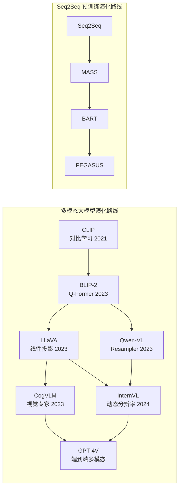
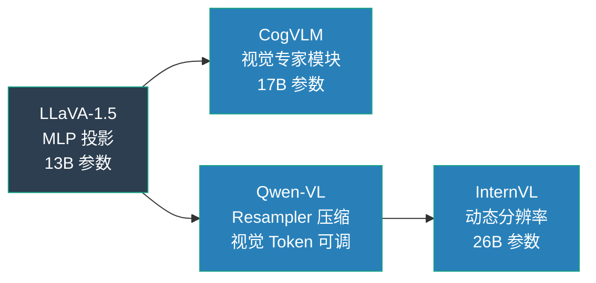
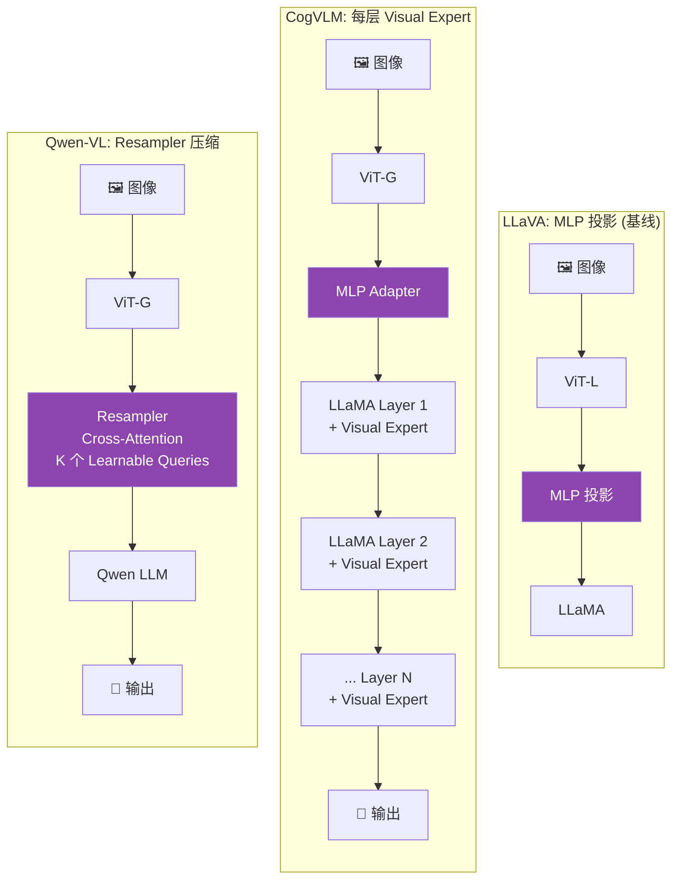
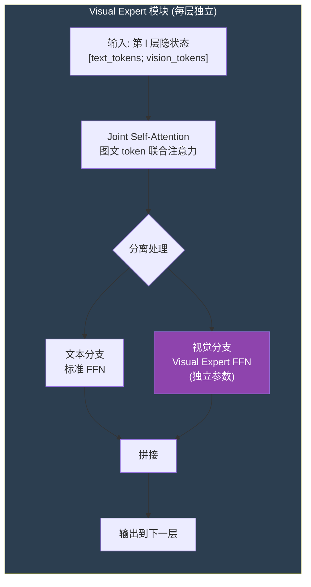
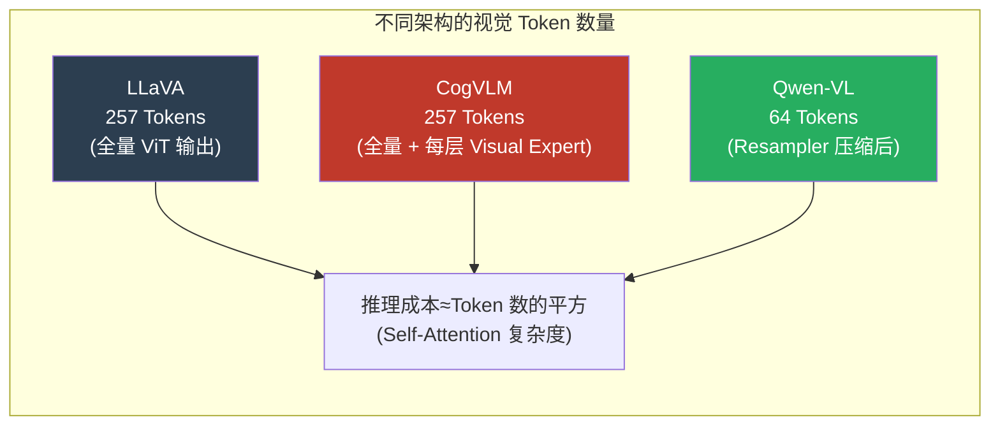

# Multimodal LLMs (Qwen-VL / CogVLM / InternVL)

## 知识地图



## 前置知识

- **LLaVA / BLIP-2 架构**: 理解视觉编码器 + 桥接层 + LLM 的基本多模态范式
- **Vision Transformer (ViT)**: 图像 Patch 化编码、不同规模 ViT 的输出特征量级
- **Cross-Attention 机制**: Query/Key/Value 交叉注意力如何在多模态融合中发挥作用
- **MoE (Mixture of Experts)**: 稀疏激活专家网络的基本思想——与 CogVLM 视觉专家的关联
- **LLaMA / Qwen 等 LLM 架构**: 理解不同 LLM 底座的嵌入维度和层结构差异
- **视觉 Token 压缩**: Q-Former、Resampler、Perceiver 等压缩方法

## 模型演化路线



| 代际 | 模型 | 核心创新 | 视觉-LLM 交互方式 |
|------|------|----------|-------------------|
| 基线 | LLaVA-1.5 | 线性投影 + 高质量数据 | 每一层共享的 MLP |
| 深层融合 | CogVLM | 每层独立 Visual Expert | 每层皆有视觉专用参 |
| 高效压缩 | Qwen-VL | Resampler 动态压缩 | Cross-Attn 可压缩 |
| 极致性能 | InternVL | 动态分辨率 + 强 ViT | 多尺度分块编码 |

## 为什么会出现 (Why)

LLaVA 虽然证明了简单 MLP 投影 + 强 LLM 即可实现多模态对话，但存在三个关键局限：(1) **视觉信息融合不足**——MLP 只在输入层投影一次，深层 LLM 难以充分理解细粒度视觉细节；(2) **视觉 Token 冗长**——整张图输出 257-576 个 Token，长上下文消耗巨大；(3) **分辨率固定**——预训练 ViT 的分辨率（如 224x224）导致高分辨率图像丢失细节。CogVLM、Qwen-VL、InternVL 分别从三个维度针对性地解决了这些问题。

## 解决什么问题 (Problem)

1. **深度视觉融合**: 如何在 LLM 的每一层都注入视觉信息，而不只是在输入端做一次投影
2. **Token 效率**: 如何将几百个视觉 Token 压缩为几十个，降低 LLM 的推理和训练成本
3. **高分辨率理解**: 如何让模型看清文档中的小字、图表细节、远景物体
4. **架构设计的权衡**: 在性能、效率、训练成本之间找到最佳平衡点

## 核心思想 (Core Idea)

Multimodal LLMs = LLM + 视觉编码器 + 对齐层；关键是**怎么把视觉信息喂给 LLM**——三种主流设计分别在融合深度（CogVLM 每层独立视觉专家）、压缩效率（Qwen-VL Resampler）、和分辨率灵活性（InternVL 动态分块）上做出创新。

## 模型结构图

### 三种多模态 LLM 架构对比



### CogVLM Visual Expert 内部结构



## 数学模型/公式

### LLaVA — MLP 投影

最简洁的设计：用一/两层 MLP 将 ViT 的特征投影到 LLM 的嵌入空间：

$$
\mathbf{H}_{vision} = \text{ViT}(I) \in \mathbb{R}^{N \times d_v}, \quad \mathbf{H}_{proj} = \text{MLP}(\mathbf{H}_{vision}) \in \mathbb{R}^{N \times d_{llm}}
$$

**通俗解释：** 图像经过 ViT 得到 $N$ 个特征向量（如 257 个），每个维度为 $d_v$（如 1024）。MLP 做一个简单的维度变换——把 1024 维的视觉特征映射到 LLM 的 4096 维词嵌入空间。投影后的视觉 Token 就像"外文翻译成中文"一样，可以与文本 Token 无缝拼接。

LLaVA-1.5 只需 13B 参数就能匹敌许多更大的模型，验证了"数据质量 > 架构复杂度"的设计哲学。

### CogVLM — 视觉专家

在每个 Transformer 层内添加一个视觉专家（Visual Expert）模块：

$$
\mathbf{x}_{text}^{(l)} = \text{FFN}(\text{SelfAttn}(\mathbf{x}^{(l-1)}))
$$

$$
\mathbf{x}_{vision}^{(l)} = \text{VisualExpert}(\text{SelfAttn}([\mathbf{x}_{text}; \mathbf{x}_{vision}]^{(l-1)}))
$$

**通俗解释：** CogVLM 在 LLM 的每一层都给视觉 Token 配了一个"私人教练"（Visual Expert）。在 Joint Self-Attention 中，文本 Token 和视觉 Token 可以相互关注——文本看到图像，图像也看到文本。但到了 FFN 阶段，文本走标准 FFN，视觉走自己独立的 Visual Expert FFN（参数是 LLM FFN 的一半）。这样视觉信息在每一层都被专门处理，而不是只在输入端投影一次就完事。相当于"深度理解"，而不是"浅浅看一眼"。

### Qwen-VL — Resampler 压缩

ViT 输出的视觉 token 数量可能很大（$14 \times 14 = 196$ 或更多）。Qwen-VL 用 **resampler**（类似于 BLIP-2 的 Q-Former）将可变数量的视觉 token 压缩为固定长度的"可学习查询向量"：

$$
\mathbf{H}_{compressed} = \text{Resampler}(\mathbf{H}_{vision}) \in \mathbb{R}^{K \times d_{llm}}
$$

**通俗解释：** Resampler 有 $K$ 个可学习的 Query 向量（通常 64-256 个），它们通过 Cross-Attention 去"审阅"全部 196+ 个 ViT 输出，从中提取最关键的 $K$ 个信息点。这样，不管原图输出多少 Token，给 LLM 的始终是固定数量的浓缩 Token。$K$ 的大小可以在性能（越多越准）和效率（越少越快）之间灵活调整，非常工程友好。

## 可视化展示

### 多模态 LLM 性能对比

```echarts
return {
  tooltip: { trigger: "axis", confine: true },
  title: { top: 5,  text: '多模态 LLM MMBench 得分', left: 'center', textStyle: { fontSize: 12 } },
  xAxis: { type: 'category', data: ['LLaVA-1.5 7B', 'LLaVA-1.5 13B', 'CogVLM 17B', 'Qwen-VL-Chat', 'InternVL 26B'] },
  yAxis: { type: 'value', min: 60, max: 85, name: 'MMBench Score' },
  series: [{
    type: 'bar',
    data: [65.4, 68.9, 77.6, 72.5, 82.3],
    itemStyle: { color: '#2c3e50' },
    label: { show: true, position: 'top' }
  }],
  grid: { left: 60, right: 20, top: 55, bottom: 60 }
}
```

### 视觉 Token 数量与推理成本的关系



## 最小可运行代码

### PyTorch — LLaVA 风格多模态前向传播

```python
import torch
import torch.nn as nn

class LLaVAForward(nn.Module):
    def __init__(self, vision_encoder, llm, projector):
        super().__init__()
        self.vision_encoder = vision_encoder  # ViT
        self.llm = llm                          # LLaMA
        self.projector = projector              # MLP: d_v → d_llm

    def forward(self, images, input_ids, attention_mask):
        # 1. 视觉编码
        with torch.no_grad():
            vision_feat = self.vision_encoder(images)  # [B, N_v, d_v]
        vision_emb = self.projector(vision_feat)        # [B, N_v, d_llm]

        # 2. 文本嵌入 (含 <image> token 占位)
        text_emb = self.llm.model.embed_tokens(input_ids)  # [B, N_t, d_llm]

        # 3. 将视觉嵌入插入 <image> token 位置
        image_positions = (input_ids == IMAGE_TOKEN_ID)
        # ... (实际实现中需要 broadcast 到对应位置)

        # 4. 拼接: [vision_tokens, text_tokens]
        inputs_embeds = torch.cat([vision_emb, text_emb], dim=1)
        outputs = self.llm(inputs_embeds=inputs_embeds)
        return outputs.logits
```

### CogVLM 视觉专家

```python
class VisualExpert(nn.Module):
    def __init__(self, hidden_size, intermediate_size):
        super().__init__()
        # 视觉专用的 QKV（只处理视觉 token）
        self.qkv_vision = nn.Linear(hidden_size, 3 * hidden_size, bias=False)
        # 视觉专用的 FFN
        self.ffn = nn.Sequential(
            nn.Linear(hidden_size, intermediate_size),
            nn.GELU(),
            nn.Linear(intermediate_size, hidden_size))

    def forward(self, text_hidden, vision_hidden):
        # vision_hidden: 经过 joint self-attention 后的视觉 token
        # 用视觉专用 QKV 投影
        qkv_v = self.qkv_vision(vision_hidden)
        # ... attention 操作
        # 视觉专用 FFN
        return vision_hidden + self.ffn(vision_hidden)
```

### Qwen-VL 风格 Resampler

```python
class Resampler(nn.Module):
    """Qwen-VL 风格 Resampler: 压缩视觉 Token"""
    def __init__(self, num_queries=64, vit_dim=1024, llm_dim=4096, num_layers=4):
        super().__init__()
        self.query_tokens = nn.Parameter(torch.randn(1, num_queries, llm_dim))
        self.cross_attn_layers = nn.ModuleList([
            nn.MultiheadAttention(llm_dim, num_heads=8, batch_first=True)
            for _ in range(num_layers)
        ])
        self.vit_proj = nn.Linear(vit_dim, llm_dim)

    def forward(self, vit_features):
        """
        vit_features: [B, N_patches, vit_dim]
        返回: [B, num_queries, llm_dim]
        """
        B = vit_features.shape[0]
        vit_feat = self.vit_proj(vit_features)          # [B, N, llm_dim]
        queries = self.query_tokens.expand(B, -1, -1)   # [B, K, llm_dim]

        for attn in self.cross_attn_layers:
            queries = attn(queries, vit_feat, vit_feat)[0]

        return queries  # [B, K, llm_dim] — 压缩后只有 K 个 Token
```

## 工业界应用

| 应用场景 | 代表产品/模型 | 核心架构 |
|----------|-------------|----------|
| **通用多模态对话** | GPT-4V, Gemini, Claude 3 Vision | 未公开（推测深层融合） |
| **文档理解与 OCR** | Qwen-VL-Max, DocOwl | Resampler + 高分辨率分块 |
| **视觉定位 (Grounding)** | CogVLM-Grounding | Visual Expert + 坐标回归头 |
| **视频理解** | Video-LLaVA, VideoChat2 | 多帧视觉编码 + 池化 |
| **GUI Agent** | CogAgent, SeeClick | CogVLM + 屏幕截图理解 |
| **开源研究平台** | LLaVA, InternVL | MLP 投影 / 动态分辨率 |

## 对比表格

### 三种多模态 LLM 架构对比

| 维度 | LLaVA-1.5 | CogVLM | Qwen-VL | InternVL |
|------|-----------|--------|---------|----------|
| **桥接机制** | 2 层 MLP 投影 | 每层 Visual Expert | Resampler (Q-Former 风格) | 多尺度 ViT + MLP |
| **视觉 Token 数** | ~257 (全量) | ~257 (全量) | 64-256 (可调) | 可变 (分块策略) |
| **额外参数量** | ~4M (投影层) | ~L×50% (每层专家) | ~20M (Resampler) | ~100M |
| **视觉-LLM 交互深度** | 仅输入端 | **每一层** | 仅输入端 | 仅输入端 |
| **高分辨率支持** | 固定 336×336 | 固定 448×448 | 动态分辨率 | **动态分块 (最强)** |
| **训练成本** | 低 | 高 | 中 | 中 |
| **MMBench 得分** | 68.9 | 77.6 | 72.5 | **82.3** |
| **核心设计哲学** | 数据 > 架构 | 深度融合 > 简单投影 | 压缩效率 > 全量保留 | 分辨率 > 一切 |

### LLaVA vs CogVLM vs Qwen-VL 设计取舍

| 维度 | LLaVA | CogVLM | Qwen-VL |
|------|-------|--------|---------|
| 视觉信息利用 | 浅层 (仅输入投影) | **深层 (每层都有)** | 浅层 (仅输入投影) |
| Token 效率 | 低 (全量 257) | 低 (全量 257) | **高 (压缩至 64)** |
| 参数效率 | **极高** | 低 (每层额外 50%) | 中 |
| 适合场景 | 通用对话、快速实验 | 精细理解、视觉定位 | 长文档、多图对话 |

## 学完后建议继续学习

1. **InternVL 2.0** — 动态分辨率技术的进一步演进
2. **LLaVA-NeXT (LLaVA-1.6)** — AnyRes 高分辨率策略的原理
3. **Video Understanding** — 如何将多模态 LLM 扩展到视频（时序建模）
4. **Embodied AI / Robotics** — 多模态 LLM 在机器人中的应用 (RT-2, Octo)
5. **MMBench / MME / SEED-Bench** — 多模态模型评估基准

## 高频面试题

### Q1: CogVLM 的 Visual Expert 与标准 LLaVA 的 MLP 投影有何本质区别？

**标准答案：** LLaVA 的 MLP 投影在输入端将视觉特征一次性映射到 LLM 的空间，之后 LLM 的每一层只对"已经投影好"的隐状态做自注意力，没有额外的视觉处理。CogVLM 在 LLM 的**每一层**都插入了一个 Visual Expert——它在 Joint Self-Attention 后，给视觉 Token 单独走一条专用的 FFN（参数量约为标准 FFN 的 50%），而文本 Token 走标准 FFN。这意味着视觉信息在 LLM 推理的每个阶段都被重新处理和融合，实现了"深度理解"而非"浅尝辄止"。代价是每层额外的 ~50% 参数，使得 17B 的 CogVLM 实际参数量远大于 13B 的 LLaVA。

### Q2: Qwen-VL 的 Resampler 解决了什么问题？为什么需要压缩视觉 Token？

**标准答案：** Resampler 解决的是视觉 Token 数量过多导致的推理效率问题。标准 ViT 对 224×224 图像输出 197 个 Token（14×14+CLS），加上文本 Token 后序列长度翻倍。由于 Transformer 的 Self-Attention 复杂度为 $O(N^2)$，Token 数翻倍意味着计算量翻 4 倍。Resampler 用 $K$ 个可学习 Query 向量（通常 64）通过 Cross-Attention 从全量视觉特征中提取关键信息，将 Token 数压缩约 3-10 倍，大幅降低 LLM 的推理成本。这对于多图对话和长文档理解场景尤其关键。

### Q3: InternVL 的动态分辨率策略是什么？为什么它能超越固定分辨率的模型？

**标准答案：** InternVL 的动态分辨率策略是：将输入图像按内容自动划分为多个子图块（Tiles），每个 Tile 独立经过 ViT 编码，然后所有 Tile 的特征在 LLM 输入层拼接。这样，一张 4K 文档照片可以被切成 4×6=24 个 Tiles 精细编码，而不会像固定分辨率模型那样被粗暴缩放到 336×336 丢失所有细节。这个策略使得 InternVL 在文档理解、OCR、图表解析等需要细粒度视觉信息的任务中表现远超固定分辨率模型。

### Q4: 多模态 LLM 的三种视觉信息注入方式各有何优劣？

**标准答案：** (1) **输入端投影**（LLaVA/Qwen-VL）：最简单高效，训练成本低，但视觉信息在深层 LLM 中逐渐稀释；(2) **每层视觉专家**（CogVLM）：融合最深，对细粒度视觉任务最优，但参数量大（每层多 ~50%），训练成本高；(3) **Cross-Attention 注入**（Flamingo 风格）：在 LLM 层间插入额外的 Cross-Attention 块，视觉信息不断被注入，但架构修改大，与标准 LLM 不兼容。实际选择取决于目标任务的视觉依赖程度和可用算力。

### Q5: 多模态 LLM 的训练通常分为几个阶段？为什么这样设计？

**标准答案：** 通常分为两到三个阶段：(1) **预训练对齐阶段**——冻结 ViT 和 LLM，只训练桥接层（投影/Resampler），使用大量图文对数据（数百万），目标是让 LLM 理解视觉 Token 的含义；(2) **指令微调阶段**——解冻 LLM（或使用 LoRA），用高质量多模态对话数据（数万至数十万）精调，目标是让模型学会多轮对话和复杂推理；(3) **可选：偏好对齐**——使用 DPO/RLHF 进一步对齐模型输出与人类偏好。这种多阶段设计在计算效率和任务效果之间取得了平衡：先用廉价数据建立基本对齐，再用昂贵数据做精准微调。
