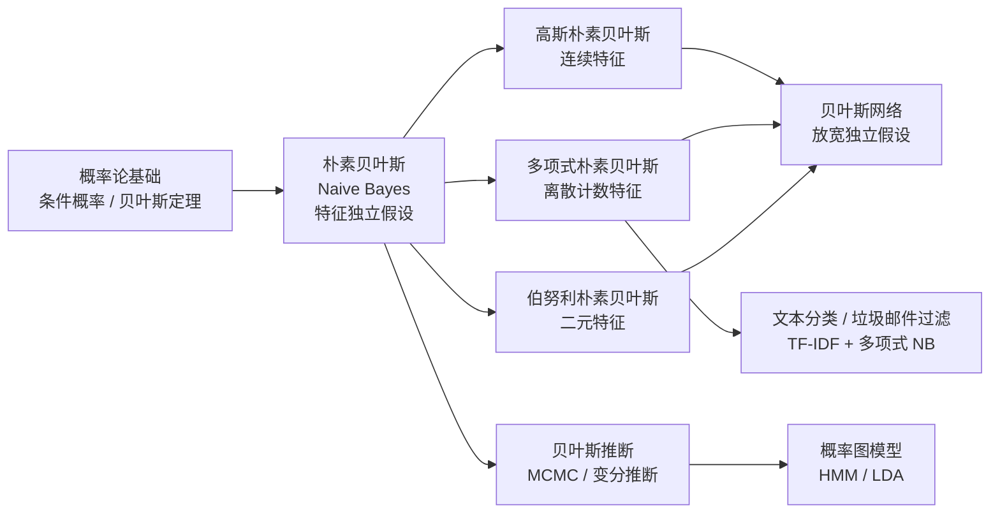
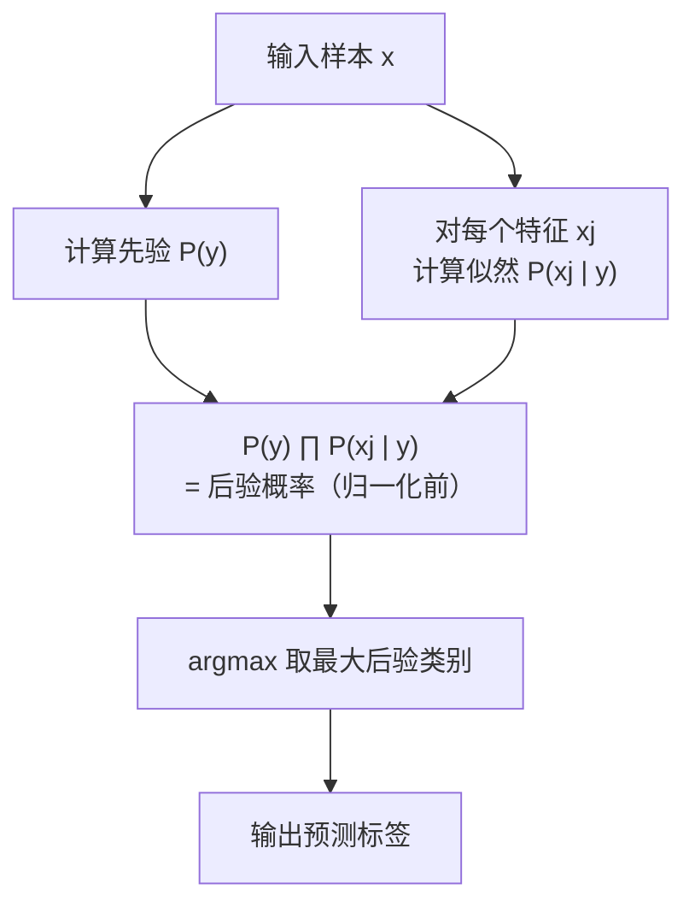
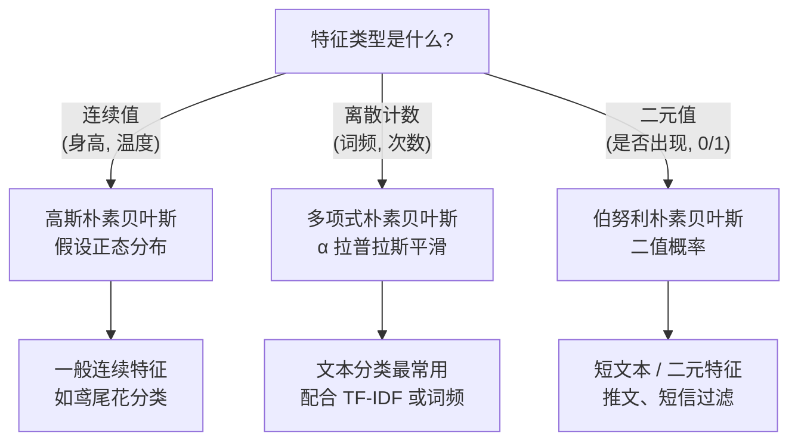

# 朴素贝叶斯 (Naive Bayes)

## 知识地图



## 前置知识

- [概率论基础：条件概率、贝叶斯定理](logistic-regression.md)
- [TF-IDF](tfidf.md) —— 理解文本特征表示
- [逻辑回归](logistic-regression.md) —— 与朴素贝叶斯形成"生成式 vs 判别式"对比
- [交叉熵](cross-entropy.md) —— 理解分类损失
- 基本离散/连续概率分布（高斯分布、多项分布、伯努利分布）

## 为什么会出现 (Why)

在朴素贝叶斯之前，分类问题的主流方法是基于规则的专家系统或需要大量参数估计的统计模型。贝叶斯定理提供了一个优雅的概率分类框架，但直接应用面临"维度灾难"——估计 $P(\mathbf{x} \mid y)$ 需要估计 $d$ 个特征的联合分布，假设每个特征是二元的，也需要估计 $2^d$ 个参数。1960 年代，Maron 和 Kuhns 提出用"属性独立"假设来简化概率估计——这就是"朴素"的由来。这个假设虽然在大自然的真实数据上几乎从未成立，但朴素贝叶斯在实践中效果出奇好（尤其文本分类），原因在于：即使概率估计不准，只要类别排序正确，分类决策就是对的。

## 解决什么问题 (Problem)

解决**基于概率的分类问题**，特别适合：(1) 高维离散数据（文本、类别特征）；(2) 小样本场景——只需估计少量参数；(3) 需要快速增量学习的场景——新样本到达时可在常数时间内更新参数。

## 核心思想 (Core Idea)

朴素贝叶斯基于贝叶斯定理，并做了一个**强假设**：所有特征在给定类别的条件下**相互独立**。这个假设虽然"朴素"，但在实践中效果出奇地好，尤其是在文本分类中。

---

## 数学模型/公式

### 贝叶斯定理

$$P(y \mid \mathbf{x}) = \frac{P(\mathbf{x} \mid y) \cdot P(y)}{P(\mathbf{x})}$$

**通俗解释：** 这就是"已知结果，找原因"的概率公式。你看到一个水果是红色的（观测 $\mathbf{x}$），想知道它是苹果还是樱桃的概率（类别 $y$）。$P(y)$ 是你的先验——果园里 80% 是苹果、20% 是樱桃。$P(\mathbf{x} \mid y)$ 是似然——已知是苹果时它是红色的概率有多高？贝叶斯定理就是结合"先验知识"和"观测证据"来更新你对世界的认知。分母 $P(\mathbf{x})$ 对所有类别都一样，比较不同类别时可以不计算。

### 朴素假设

$$P(\mathbf{x} \mid y) = \prod_{j=1}^{d} P(x_j \mid y)$$

**通俗解释：** "朴素"的意思是：假设给定类别后，每个特征独立地贡献证据。就像判断一封邮件是不是垃圾邮件，"包含'免费'"和"包含'中奖'"这两个特征在给定"是垃圾邮件"这个类别下被认为是独立的——看到"免费"不会改变你在这封垃圾邮件中看到"中奖"的概率估计。这个假设在现实中几乎总是不成立的（垃圾邮件中"免费"和"中奖"倾向于同时出现），但好处是：把需要估计的联合概率 $P(x_1, x_2, \dots, x_d \mid y)$ 拆解成了 $d$ 个简单的一维概率 $P(x_j \mid y)$——参数从 $2^d$ 级降到了 $O(d)$ 级。代价是概率估计有偏，但只要排序对就行。

### 决策规则

$$\hat{y} = \arg\max_y P(y) \prod_{j=1}^{d} P(x_j \mid y)$$

**通俗解释：** 分类时，对每个可能的类别 $y$ 算一个"得分"——先验 $\times$ 每个特征在类别 $y$ 下的概率连乘，取得分最高的类别。实际计算时，连乘容易导致数值下溢（很多小于 1 的小数相乘趋向于 0），所以工程上都用对数空间：$\hat{y} = \arg\max_y \left[\log P(y) + \sum_{j=1}^{d} \log P(x_j \mid y)\right]$。取对数后乘法变加法，计算稳定且更快。

---

### 三种常见变体

#### 1. 高斯朴素贝叶斯

适用于**连续特征**，假设每个特征在各类别下服从正态分布：

$$P(x_j \mid y) = \frac{1}{\sqrt{2\pi\sigma_{y,j}^2}} \exp\left(-\frac{(x_j - \mu_{y,j})^2}{2\sigma_{y,j}^2}\right)$$

**通俗解释：** 高斯朴素贝叶斯就像在说："我知道正常体温大约 37 度（均值），波动约 0.5 度（标准差）。现在测到 39 度，这个温度在'发烧'的分布下很常见（离发烧的均值近），在'正常'的分布下很少见（离正常的均值远），所以更有可能是发烧。"每个特征在每个类别下有一个均值和一个标准差，新样本的每个特征值都去查自己的分布表，得到概率密度。

#### 2. 多项式朴素贝叶斯

适用于**离散计数特征**（如词频）：

$$P(x_j \mid y) = \frac{N_{y,j} + \alpha}{N_y + \alpha \cdot d}$$

其中 $\alpha$ 是拉普拉斯平滑参数。

**通俗解释：** 多项式 NB 对计数数据进行建模。比如对于类别"科技新闻"，词"AI"出现了 500 次，该类别总词数 10000 次，词汇量 5000 个，那么 $P(\text{"AI"} \mid \text{科技}) = \frac{500 + \alpha}{10000 + \alpha \cdot 5000}$。分子是"该词在该类别中出现次数 + 平滑项"，分母是"该类别总词数 + 平滑项乘以词典大小"。这个公式相当于从每个词的桶里预支了 $\alpha$ 个"虚拟观测"，防止某个词在训练集中没出现过就被判定为概率为 0。

#### 3. 伯努利朴素贝叶斯

适用于**二元特征**（如词是否出现）：

$$P(x_j \mid y) = P(j \mid y)^{x_j} \cdot (1 - P(j \mid y))^{(1-x_j)}$$

**通俗解释：** 伯努利 NB 只看"词是否出现"，不管出现了多少次。适合短文本（推文、短信）或特征本身就是二元的场景（如"血型是否为 A 型"）。参数的物理含义是：在类别 $y$ 的所有样本中，特征 $j$ 出现的比例。注意：它不捕捉"出现了 5 次比出现了 1 次更强"的信息——如果你关心词频强度，选择多项式 NB；如果你只关心是否出现，选择伯努利 NB。

---

### 拉普拉斯平滑

防止零概率问题：当某个特征值在训练集中未出现时，概率为 0 会导致整个乘积为 0：

$$P(x_j \mid y) = \frac{\text{count}(x_j, y) + \alpha}{\text{count}(y) + \alpha \cdot |V|}$$

**通俗解释：** 拉普拉斯平滑（也叫加一平滑）是朴素贝叶斯中最经典的"防零"技巧。它相当于在数数时，每个可能的特征值先预给 $\alpha$ 个虚拟计数。$\alpha=1$ 时叫拉普拉斯平滑，$\alpha < 1$ 时叫 Lidstone 平滑。就像一个老师在统计班上学生的特长时，虽然没有任何同学说"我会开飞机"，但老师不会设 $P(\text{开飞机}) = 0$——万一转学来了一个飞行员同学呢？平滑让模型对未见过的特征值保持开放态度。

---

## 可视化展示

### 朴素贝叶斯分类流程



### 三种变体的适用场景



---

## 最小可运行代码

### Scikit-learn

```python
from sklearn.naive_bayes import GaussianNB, MultinomialNB, BernoulliNB

# 高斯 NB：连续特征（鸢尾花、身高体重等）
gnb = GaussianNB()
gnb.fit(X_train, y_train)

# 多项式 NB：离散计数特征（词频、事件次数等），文本分类首选
mnb = MultinomialNB(alpha=1.0)  # alpha 是拉普拉斯平滑参数
mnb.fit(X_train_counts, y_train)

# 伯努利 NB：二元特征（是否出现、二值化特征）
bnb = BernoulliNB(alpha=1.0)
bnb.fit(X_train_binary, y_train)
```

### NumPy 手写 (高斯朴素贝叶斯)

```python
import numpy as np
from scipy.stats import norm

class GaussianNaiveBayes:
    def fit(self, X, y):
        self.classes = np.unique(y)
        self.params = {}
        for c in self.classes:
            X_c = X[y == c]
            self.params[c] = {
                'mean': X_c.mean(axis=0),
                'var': X_c.var(axis=0) + 1e-9,  # 防除零
                'prior': len(X_c) / len(X),
            }

    def predict(self, X):
        log_probs = []
        for c in self.classes:
            p = self.params[c]
            # 对数空间计算避免下溢
            log_p = np.log(p['prior'])
            log_p += norm.logpdf(X, p['mean'], np.sqrt(p['var'])).sum(axis=1)
            log_probs.append(log_p)
        return self.classes[np.argmax(log_probs, axis=0)]
```

### NumPy 手写 (多项式朴素贝叶斯)

```python
import numpy as np

class MultinomialNaiveBayes:
    def __init__(self, alpha=1.0):
        self.alpha = alpha

    def fit(self, X, y):
        self.classes = np.unique(y)
        n_features = X.shape[1]
        self.feature_log_prob = {}
        self.class_log_prior = {}
        for c in self.classes:
            X_c = X[y == c]
            # 平滑后的类条件概率的对数
            self.feature_log_prob[c] = np.log(
                (X_c.sum(axis=0) + self.alpha) /
                (X_c.sum() + self.alpha * n_features)
            )
            self.class_log_prior[c] = np.log(len(X_c) / len(X))

    def predict(self, X):
        log_scores = []
        for c in self.classes:
            score = self.class_log_prior[c] + X @ self.feature_log_prob[c]
            log_scores.append(score)
        log_scores = np.column_stack(log_scores)
        return self.classes[np.argmax(log_scores, axis=1)]
```

---

## 工业界应用

| 应用场景 | 使用变体 | 为什么 | 优点 | 缺点 |
|----------|---------|--------|------|------|
| 垃圾邮件过滤 | 多项式 / 伯努利 NB | 第一代邮件过滤器的核心技术 | 极快，增量更新，可解释 | 朴素假设不成立，复杂对抗邮件漏检 |
| 新闻 / 文档分类 | 多项式 NB | 高维稀疏词频特征，NB 天然适合 | 训练秒级，参数更新容易 | 词序信息完全丢失（Bag-of-Words） |
| 实时情感分析 | 伯努利 NB | 推文/评论短，词出现与否比词频更重要 | 极低延迟 (< 1ms)，适合在线服务 | 不考虑词的上下文和否定词 |
| 医疗初筛诊断 | 高斯 NB | 症状/化验指标多为连续值 | 小数据有效，输出概率可解释 | 正态分布假设可能不成立 |
| 推荐系统冷启动 | 多项式 NB | 新用户/物品缺乏行为数据时，用文本特征 | 可从描述文字快速生成初始画像 | 仅依赖文本，无法利用交互信息 |

---

## 优缺点对比

| 优点 | 缺点 |
|------|------|
| 训练和预测极快（O(nd)，参数估计一次扫描） | 特征独立假设在现实中几乎总不成立 |
| 少量数据也有效（只需估计均值/方差或计数） | 对输入数据的分布假设敏感（高斯 NB 假设正态分布） |
| 可解释性强（每个特征对决策的贡献可直接读出） | 连乘概率值容易数值下溢（需对数空间处理） |
| 天然支持增量学习（新样本到达，更新计数即可） | 零概率问题——未出现过的特征值使整体概率归零（需平滑） |
| 多分类天然支持，无需 OVR/OVO 策略 | 无法捕捉特征交互（如"免费"和"中奖"同时出现时威力更大） |
| 对无关特征有一定鲁棒性（独立假设使其不易过拟合噪声） | 连续特征的高斯假设限制了拟合复杂分布的能力 |

---

## 对比表格

| 维度 | 高斯 NB | 多项式 NB | 伯努利 NB |
|------|---------|----------|-----------|
| 特征类型 | 连续值 | 离散计数（整数） | 二元 (0/1) |
| 分布假设 | 正态分布 | 多项分布 | 伯努利分布 |
| 使用频率 | 中（通用连续特征） | **最高（文本分类默认）** | 低 |
| 适用数据 | 身高、体重、传感器 | 词频、TF-IDF、点击次数 | 词是否出现、开关状态 |
| 核心参数 | $\hat{\mu}_{y,j}$, $\hat{\sigma}^2_{y,j}$ | $N_{y,j}$ (计数), $\alpha$ (平滑) | $P(j \mid y)$ (出现概率), $\alpha$ |
| 数值下溢处理 | 对数概率密度 | 对数概率 | 对数概率 |
| 缺失值处理 | 跳过该特征（独立假设天然支持） | 默认 0 或跳过 | 默认 0 或跳过 |
| scikit-learn 类 | `GaussianNB` | `MultinomialNB` | `BernoulliNB` |
| 与逻辑回归对比 | 生成式（建模 P(x,y)） | 生成式 | 生成式 |

---

## 学完后建议继续学习

- [逻辑回归](logistic-regression.md) —— 判别式分类器，与朴素贝叶斯形成"生成式 vs 判别式"对比
- [TF-IDF](tfidf.md) —— 文本特征工程，配合多项式 NB 构建文本分类 pipeline
- [贝叶斯网络](bayesian-network.md) —— 放宽特征独立假设，建模特征之间的依赖关系
- [交叉熵](cross-entropy.md) —— 理解分类问题的损失函数设计
- [词向量 / Word2Vec](word2vec.md) —— 对比 Bag-of-Words (NB 的常用输入) 和分布式表示
- [L1/L2 正则化](l1-l2-regularization.md) —— 逻辑回归的正则化 vs 朴素贝叶斯的拉普拉斯平滑，两种不同的"防过拟合"思路

---

## 高频面试题

**Q1: 朴素贝叶斯的"朴素"体现在哪里？这个假设为什么不合理却有效？**

标准答案："朴素"指条件独立假设：$P(\mathbf{x} \mid y) = \prod_{j=1}^{d} P(x_j \mid y)$，即给定类别后，所有特征相互独立。在现实中这几乎总不成立——比如垃圾邮件中"免费"和"中奖"倾向于同时出现，不是独立的。但 NB 仍然有效的原因：(1) NB 追求的是 $\arg\max$ 的排序正确，不需要精确的后验概率——即使概率估计有偏，只要类别之间的相对排序没被破坏，预测就是对的；(2) 独立假设带来的偏置（Bias）反而是一种正则化，降低了方差；(3) 实际分类中，很多特征组合的偏差倾向于互相抵消。Friedman 在 1997 年证明：即使条件独立假设被严重违反，NB 也可以在 0-1 loss 下逼近最优分类器。

**Q2: 生成式模型和判别式模型有什么区别？朴素贝叶斯和逻辑回归分别属于哪一类？**

标准答案：
- **生成式模型**（Generative）：建模联合分布 $P(\mathbf{x}, y)$，然后通过贝叶斯定理得到 $P(y \mid \mathbf{x})$。朴素贝叶斯属于此类——它建模"每个类别下特征长什么样"。
- **判别式模型**（Discriminative）：直接建模决策边界 $P(y \mid \mathbf{x})$ 或 $f(\mathbf{x})$。逻辑回归属于此类——它直接画一条线分开两个类。
- 实践中的对比：生成式模型在小样本下更优（利用了数据生成假设），收敛更快（$O(\log n)$ 样本足够）；判别式模型在大样本下更优（不给数据做任何分布假设），收敛到更低错误率。Ng 和 Jordan 2002 年的经典论文证明了这一点。

**Q3: 为什么多项式朴素贝叶斯要用对数空间计算？**

标准答案：直接连乘 $P(y) \prod_j P(x_j \mid y)$ 会导致数值下溢。因为每个概率 $P(x_j \mid y) \in (0, 1]$，当特征维度很高时（文本分类中 d 可达数十万），成千上万个小于 1 的数相乘，结果趋近于 0，超出 float64 的表示范围。取对数后 $\log P(y) + \sum_j \log P(x_j \mid y)$，乘法变加法，不再下溢。而且对数函数是单调递增的，$\arg\max$ 的结果不变。另外，加法在 CPU 上的计算也比乘法快。

**Q4: 拉普拉斯平滑的作用是什么？$\alpha$ 怎么选？**

标准答案：防止零概率问题——训练集中某个特征值在某个类别下未出现时，$P(x_j \mid y) = 0$，连乘导致整个后验概率为 0，完全抹杀其他特征的贡献。拉普拉斯平滑在每个计数上加 $\alpha$：$P(x_j \mid y) = \frac{\text{count}(x_j, y) + \alpha}{\text{count}(y) + \alpha \cdot |V|}$。选择 $\alpha$：(1) $\alpha = 1$ 是标准拉普拉斯平滑，最常用；(2) $\alpha < 1$（Lidstone 平滑）给未出现特征更小的权重，适合特征分布高度不均匀的场景；(3) 可以通过交叉验证调优，但实践中 $\alpha = 1$ 通常就够用了。scikit-learn 的 `MultinomialNB(alpha=1.0)` 默认使用拉普拉斯平滑。

**Q5: 朴素贝叶斯为什么特别适合文本分类？**

标准答案：(1) 文本特征是高维稀疏的（词频矩阵中大部分是 0）——NB 的独立假设在高维空间中对"零"的处理特别高效（缺失特征不影响乘积，实际上是在计算中自动跳过的）；(2) 参数估计简单——只需统计每个词在每个类别中的频率，一次扫描完成，训练复杂度 O(nd)；(3) 增量学习天然支持——来了新邮件，更新词汇计数即可，无需重新训练；(4) 可解释性强——可以直观看到哪些词对某个类别贡献最大（如"discount"的 $P(x_j \mid \text{spam})$ 远高于 $P(x_j \mid \text{ham})$）；(5) 对文档长度和词汇量变化鲁棒。事实上，多项式 NB 在 1990-2010 年代是文本分类的标准基准。
