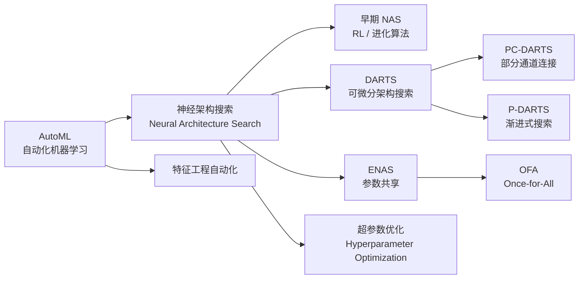
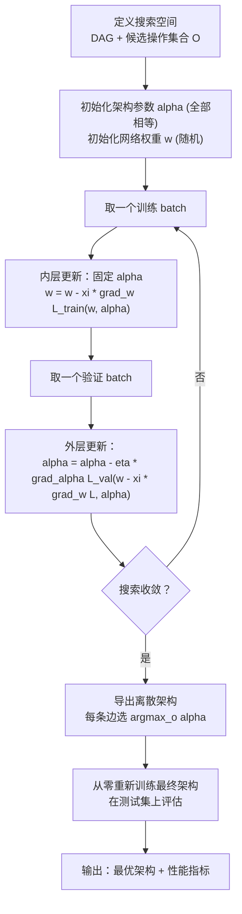
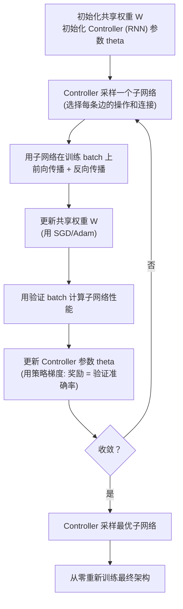
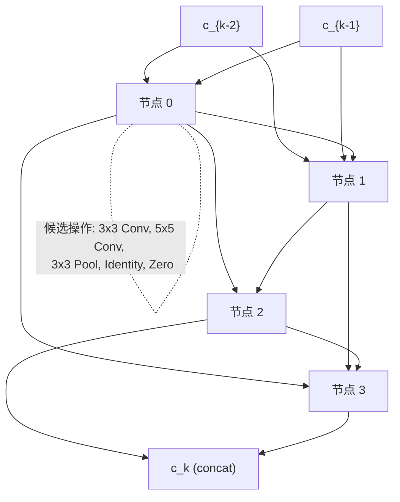

# NAS / DARTS / ENAS (神经架构搜索)

## 知识地图



## 前置知识

- **深度学习基础**：CNN 架构（卷积、池化、批归一化）、RNN/LSTM 控制器
- **强化学习基础**：策略梯度（REINFORCE）——RNN Controller 采样架构，用验证性能作为奖励
- **梯度下降**：理解双层优化 (Bilevel Optimization)——同时优化两个相互依赖的目标
- **Softmax 松弛**：将离散选择松弛为连续概率分布，实现可微分
- **权重共享**：在多个候选子网络之间复用权重参数

## 为什么会出现 (Why)

手工设计网络架构（如 ResNet-50、Inception-v3）需要大量专家经验、反复试错和计算资源验证。一个设计决策（如"这一层用 3x3 还是 5x5 卷积"）可能导致几周的等待。NAS 的目标是**让算法自动发现最优架构**。早期 NAS 用强化学习或进化算法在离散搜索空间中采样——训练成千上万个候选网络，每个从零训练，计算成本极高（如 NAS-RL 需要约 31500 GPU 小时）。DARTS 的革命性贡献：**将离散的架构选择松弛为连续权重**，使得整个搜索过程可微分——用梯度下降同时优化架构参数和网络权重，将搜索成本降至几个 GPU 天。ENAS 进一步加速：让所有候选架构**共享参数**，避免从零训练，将成本压到 0.5 GPU 小时。

## 解决什么问题 (Problem)

在给定的搜索空间（候选操作集合 + 网络连接模式）中，自动寻找在验证集上性能最优的神经网络架构，同时最小化搜索过程本身的计算开销。

## 核心思想 (Core Idea)

**DARTS 将离散的架构搜索转化为连续优化问题——每个操作选择被 Softmax 松弛为权重混合，架构参数与网络权重通过双层优化同时学习；ENAS 让所有候选子网络共享同一套权重，将搜索加速了约 60000 倍。**

---

## 搜索空间 → 搜索策略 → 评估管线

NAS 的完整流程可以拆解为三个核心组件：

### 1. 搜索空间 (Search Space) — 定义"允许什么样的网络"

DARTS 的搜索空间定义为一个**有向无环图 (DAG)**：
- 每个 Cell 包含 $N$ 个有序节点（$x_0, x_1, ..., x_{N-1}$），前两个节点是 Cell 的输入
- 每条有向边 $(i,j)$ 代表从节点 $i$ 到节点 $j$ 的数据变换
- 每条边上可选的操作集合 $\mathcal{O}$ = {conv 3x3, conv 5x5, max pool 3x3, avg pool 3x3, skip connect, zero (none)}
- Normal Cell 和 Reduction Cell 分别搜索（Reduction Cell 中的 stride=2 操作用于下采样）

**通俗解释：** 搜索空间就是"乐高积木的种类和拼接规则"。DARTS 告诉你：你可以用这些操作（3x3 卷积、5x5 卷积、池化、跳跃连接等），按照 DAG 的规则连接节点，最终所有可能的连接方式构成了搜索空间。目标是找出最好的连接组合。

### 2. 搜索策略 (Search Strategy) — 如何高效探索搜索空间

#### DARTS — 可微分架构搜索

将离散选择松弛为连续 Softmax 混合。节点 $x^{(j)}$ 是其所有前驱节点 $x^{(i)}$ 的变换的加权和：

$$
x^{(j)} = \sum_{i < j} \sum_{o \in \mathcal{O}} \frac{\exp(\alpha_{o}^{(i,j)})}{\sum_{o' \in \mathcal{O}} \exp(\alpha_{o'}^{(i,j)})} \cdot o(x^{(i)})
$$

- $\mathcal{O}$：候选操作集合
- $\alpha_{o}^{(i,j)}$：架构参数（操作 $o$ 在边 $(i,j)$ 上的权重）
- Softmax 将离散选择松弛为连续混合

**通俗解释：** 在搜索阶段，每条边不是"选一个操作"，而是"所有操作的加权混合"。比如一条边同时做了 30% 的 3x3 卷积 + 25% 的 5x5 卷积 + 20% 的跳跃连接 + 25% 的池化。$\alpha$ 参数控制这些权重。搜索结束后，再取每一条边上权重最大的操作作为最终选择。代价是搜索阶段 GPU 显存是正常训练的 $|\mathcal{O}|$ 倍（所有操作都要计算和存储）。

#### 双层优化

$$
\min_\alpha \mathcal{L}_{val}(w^*(\alpha), \alpha)
$$

$$
\text{s.t.} \quad w^*(\alpha) = \arg\min_w \mathcal{L}_{train}(w, \alpha)
$$

- **外层**：在验证集上优化架构参数 $\alpha$（决定用哪个操作）
- **内层**：在训练集上优化网络权重 $w$（给定架构下，让网络权重建好）

实际用一阶近似（交替梯度下降，不等到 $w^*$ 收敛）：

$$
\nabla_\alpha \mathcal{L}_{val}(w - \xi \nabla_w \mathcal{L}_{train}(w, \alpha), \alpha)
$$

**通俗解释：** 双层优化像是在做一个"老板-员工"游戏。内层（员工）：给定组织架构 $\alpha$，把网络权重 $w$ 训练到最优。外层（老板）：调整组织架构 $\alpha$，使得在验证集上表现最好。如果严格求解，老板每次改架构都要等员工完全训练完——代价太高。DARTS 的一阶近似相当于：老板不等员工完成全部训练，只看员工走了一步梯度方向，就据此调整架构——虽然近似但不精确，但实践中效果不错且速度快很多。

#### ENAS — 参数共享

所有候选子网络**共享同一套权重**，由 RNN controller 选择子网络。训练流程：

1. Controller 采样一个子网络（选择每个节点的操作和连接）
2. 用该子网络做前向+反向（使用共享权重）
3. 更新共享权重 + Controller 参数

相比 NAS-RL：31500 GPU 小时 → **0.5 GPU 小时**（约 60000x 加速）。

**通俗解释：** ENAS 的核心洞察是：没必要为每个候选网络从零训练。与其独立训练 10000 个网络，不如训练一个"大网络"，这个大网络包含了所有可能的子网络。Controller 每次从中"切出"一个子网络，用一批数据训练后更新这个子网络用到的权重——这些权重也同时服务于其他子网络。就像所有子网络共享一副扑克牌，每次只抽几张出来用，但抽过的牌下次状态会保留。代价是共享权重引入了噪声（权重同时服务于多个相互冲突的架构），可能导致架构排名评估不准确。

### 3. 评估管线 (Evaluation Pipeline) — 验证最终架构

搜索完成后，对每条边 $(i,j)$ 选 $\arg\max_o \alpha_{o}^{(i,j)}$ 作为最终操作，得到离散架构。然后**从零重新训练**这个架构（不再使用搜索阶段的共享权重），在测试集上报告最终性能。

**通俗解释：** 搜索阶段找到的是"架构蓝图"，评估阶段才是真正的"施工和验收"——用找到的蓝图从零搭建并训练网络，确保架构的优越性不是因为搜索阶段的权重共享或松弛技巧。

---

## 数学模型/公式

### DARTS 的 Softmax 松弛

$$
\bar{o}^{(i,j)}(x) = \sum_{o \in \mathcal{O}} \frac{\exp(\alpha_{o}^{(i,j)})}{\sum_{o' \in \mathcal{O}} \exp(\alpha_{o'}^{(i,j)})} \cdot o(x)
$$

**通俗解释：** 每个候选操作 $o$ 的权重通过 Softmax 归一化为正数且和为 1。搜索过程中梯度可以穿过 Softmax 传到 $\alpha$ 参数，实现可微分。搜索结束后，取 argmax 得到硬选择（每条边只保留权重最大的那个操作）。

### 最终架构生成

搜索完成后，对每条边 $(i,j)$ 选 $\arg\max_o \alpha_{o}^{(i,j)}$ 作为最终操作。

**通俗解释：** 松弛是搜索时的"作弊手段"——临时让每条边混合所有操作以便求梯度。搜索完成后恢复为正常的离散选择：每条边只保留权重最大的那个操作。

---

## 可视化展示

### 算法流程图

#### DARTS 搜索流程



#### ENAS 训练流程



### DARTS 搜索空间



### NAS 效率对比

```echarts
return {
  tooltip: { trigger: "axis", confine: true },
  title: { top: 5,  text: 'NAS 方法 GPU 开销对比', left: 'center', textStyle: { fontSize: 12 } },
  xAxis: { type: 'category', data: ['NAS-RL', 'NAS-EA', 'DARTS', 'ENAS', 'OFA'] },
  yAxis: { type: 'log', name: 'GPU Hours (log scale)', min: 0, max: 5 },
  series: [{
    type: 'bar',
    data: [31500, 3150, 4, 0.5, 0.08],
    itemStyle: { color: '#2c3e50' },
    label: { show: true, position: 'top',
      formatter: (p) => p.value > 100 ? (p.value/1000).toFixed(1)+'K' : p.value }
  }],
  grid: { left: 60, right: 20, top: 55, bottom: 55 }
}
```

---

## 最小可运行代码

```python
import torch
import torch.nn as nn
import torch.nn.functional as F

OPS = {
    'none': lambda C, stride: Zero(stride),
    'skip_connect': lambda C, stride: Identity(),
    'conv_3x3': lambda C, stride: nn.Sequential(
        nn.ReLU(), nn.Conv2d(C, C, 3, stride, 1, bias=False), nn.BatchNorm2d(C)),
    'conv_5x5': lambda C, stride: nn.Sequential(
        nn.ReLU(), nn.Conv2d(C, C, 5, stride, 2, bias=False), nn.BatchNorm2d(C)),
    'avg_pool_3x3': lambda C, stride: nn.AvgPool2d(3, stride, 1),
}


class Zero(nn.Module):
    """Zero 操作：输出全零。stride > 1 时用池化对齐尺寸"""
    def __init__(self, stride):
        super().__init__()
        self.stride = stride

    def forward(self, x):
        if self.stride == 1:
            return x * 0
        return F.avg_pool2d(x, 1, self.stride, 0) * 0


class Identity(nn.Module):
    def __init__(self):
        super().__init__()

    def forward(self, x):
        return x


class MixedOp(nn.Module):
    """DARTS 的混合操作——所有候选操作的加权和"""
    def __init__(self, C, stride):
        super().__init__()
        self._ops = nn.ModuleList([op_fn(C, stride) for op_fn in OPS.values()])

    def forward(self, x, weights):
        # weights: [n_ops] — softmax(alpha)
        return sum(w * op(x) for w, op in zip(weights, self._ops))


class DARTSCell(nn.Module):
    def __init__(self, C, n_nodes=4):
        super().__init__()
        self.n_nodes = n_nodes
        self.n_ops = len(OPS)
        self.edges = nn.ModuleList()
        for i in range(n_nodes):
            for j in range(i + 2):  # 输入: c_{k-2}, c_{k-1}, node_0, ..., node_{i-1}
                stride = 1
                self.edges.append(MixedOp(C, stride))

        self._edge_indices = []
        offset = 0
        for i in range(n_nodes):
            n_inputs = i + 2
            self._edge_indices.append((offset, offset + n_inputs))
            offset += n_inputs

    def forward(self, x, weights):
        # x: [c_{k-2}, c_{k-1}]
        states = [x[0], x[1]]
        offset = 0
        for i in range(self.n_nodes):
            s = 0
            n_inputs = len(states)
            for j, h in enumerate(states):
                s += self.edges[offset + j](h, weights[offset + j])
            offset += n_inputs
            states.append(s)
        return torch.cat(states[2:], dim=1)  # concat 所有中间节点


class DARTSNetwork(nn.Module):
    def __init__(self, C=16, n_layers=8, n_nodes=4):
        super().__init__()
        self.stem = nn.Sequential(
            nn.Conv2d(3, C, 3, padding=1), nn.BatchNorm2d(C))

        self.cells = nn.ModuleList()
        for _ in range(n_layers):
            self.cells.append(DARTSCell(C, n_nodes))

        # 架构参数 alpha: 每个边, 每个操作一个参数
        n_edges = sum(i + 2 for i in range(n_nodes))
        self.alpha = nn.Parameter(torch.randn(n_edges, len(OPS)) * 0.01)

    def forward(self, x):
        x = self.stem(x)
        weights = F.softmax(self.alpha, dim=-1)
        s0 = s1 = x
        for cell in self.cells:
            s0, s1 = s1, cell([s0, s1], weights)
        return s1

    def derive_architecture(self):
        """搜索完成后，导出离散架构。返回每条边的 argmax 操作索引"""
        with torch.no_grad():
            return self.alpha.argmax(dim=-1)  # [n_edges]


# ===== 使用示例 =====
if __name__ == '__main__':
    model = DARTSNetwork(C=8, n_layers=4, n_nodes=4)
    print(f"Number of edges: {model.alpha.shape[0]}")
    print(f"Operations per edge: {model.alpha.shape[1]}")

    # 双层优化模拟
    arch_optimizer = torch.optim.Adam([model.alpha], lr=3e-4)
    weight_optimizer = torch.optim.Adam(
        [p for n, p in model.named_parameters() if n != 'alpha'], lr=0.025)

    # 模拟一步搜索更新
    x_train = torch.randn(4, 3, 32, 32)
    x_val = torch.randn(4, 3, 32, 32)
    y_train = torch.randint(0, 10, (4,))
    y_val = torch.randint(0, 10, (4,))

    # 内层：更新权重
    weight_optimizer.zero_grad()
    out = model(x_train)
    loss_train = F.cross_entropy(out, y_train)
    loss_train.backward()
    weight_optimizer.step()

    # 外层：更新架构
    arch_optimizer.zero_grad()
    out_val = model(x_val)
    loss_val = F.cross_entropy(out_val, y_val)
    loss_val.backward()
    arch_optimizer.step()

    print(f"Train loss: {loss_train.item():.4f}, Val loss: {loss_val.item():.4f}")

    # 导出最终架构
    final_arch = model.derive_architecture()
    print(f"Derived architecture (argmax per edge): {final_arch.tolist()}")
```

---

## 工业界应用

| 领域 | 应用场景 | 典型用法 |
| --- | --- | --- |
| **计算机视觉** | 图像分类 / 目标检测 | 自动搜索 ImageNet/CIFAR 上的最优 CNN 架构（DARTS 在 CIFAR-10 上达到 SOTA） |
| **移动端 AI** | 轻量级模型设计 | ProxylessNAS/MnasNet 搜索满足延迟/功耗约束的手机端网络 |
| **自然语言处理** | Transformer 架构搜索 | 自动搜索最适合特定任务的 Transformer 变体（层数、注意力头数等） |
| **AutoML 平台** | 自动化建模 | Google Cloud AutoML、Amazon SageMaker Autopilot 等使用 NAS 技术 |
| **边缘计算** | 硬件感知搜索 | OFA (Once-for-All) 一次搜索产生适配不同硬件约束的多个子网络 |
| **语音识别** | 声学模型搜索 | 自动搜索 RNN/CNN 混合架构用于端到端语音识别 |

---

## 对比表格

| 维度 | NAS-RL | DARTS | ENAS | OFA |
| --- | --- | --- | --- | --- |
| **搜索策略** | 强化学习 (RNN Controller) | 梯度下降 (可微分) | 强化学习 + 参数共享 | 渐进式收缩 + 权重共享 |
| **搜索空间** | 离散（采样操作） | 连续松弛 (Softmax 混合) | 离散（Controller 采样） | 离散（弹性搜索空间） |
| **是否需要重训** | 每个候选从零训练 | 搜索后导出架构并重训 | 共享权重，最后微调 | 一次训练，多种部署 |
| **GPU 成本** | ~31500 GPU 小时 | ~4 GPU 天 | ~0.5 GPU 小时 | ~1200 GPU 小时（一次） |
| **搜索结果质量** | 高（充分搜索） | 较高（有时有偏向） | 中等（受共享权重噪声影响） | 高（覆盖多种硬件约束） |
| **适用规模** | 小搜索空间 | 中等（受 GPU 内存限制） | 大搜索空间 | 极大（支持弹性深度/宽度/核大小） |
| **主要局限** | 计算成本过高 | 离散化有 gap；倾向于 skip-connect | Controller 和共享权重耦合训练不稳定 | 训练过程复杂，调参困难 |

---

## 学完后建议继续学习

1. **PC-DARTS**：通过部分通道连接降低 DARTS 的内存占用，使搜索可在更大数据集上进行
2. **P-DARTS**：渐进式搜索——先在小网络上搜索 Cell 结构，再逐步加深网络
3. **OFA (Once-for-All)**：一次搜索产生适配不同硬件（延迟、功耗）约束的多个子网络
4. **ProxylessNAS**：直接在目标硬件上搜索（而非在 proxy 任务上），同时考虑延迟约束
5. **Hardware-aware NAS**：将硬件延迟/功耗建模到搜索目标中，搜索"最适配特定设备"的架构

---

## 高频面试题

### Q1: DARTS 如何将离散的架构搜索问题转化为可微分优化问题？这种转化有什么代价？

**标准答案：** DARTS 通过 Softmax 松弛将每个候选操作的选择转化为连续权重混合：$\bar{o} = \sum_{o \in \mathcal{O}} \frac{\exp(\alpha_o)}{\sum \exp(\alpha_{o'})} \cdot o(x)$。代价是：(1) 搜索阶段所有操作都要计算和存储，GPU 内存是离散搜索的 $|\mathcal{O}|$ 倍；(2) 搜索结束后需要从连续 $\alpha$ 离散化（取 argmax），连续最优解不一定是离散最优解，存在"离散化 gap"；(3) DARTS 倾向于选择 skip-connect 等无参操作（因为无参操作收敛快），导致最终架构退化。

### Q2: 解释 DARTS 的双层优化问题。为什么实践中使用一阶近似？

**标准答案：** 双层优化的外层优化架构参数 $\alpha$ 在验证集上的损失，内层优化网络权重 $w$ 在训练集上的损失：$\min_\alpha L_{val}(w^*(\alpha), \alpha)$ 且 $w^*(\alpha) = \arg\min_w L_{train}(w, \alpha)$。精确求解需要在每次 $\alpha$ 更新时让 $w$ 完全收敛到最优——这在深度学习中意味着每步更新 $\alpha$ 前都要完整训练一个网络，计算不可承受。一阶近似方案：假设当前 $w$ 已经接近 $w^*(\alpha)$，用 $w' = w - \xi \nabla_w L_{train}$ 做一步近似内层优化，然后直接对 $\alpha$ 求导：$\nabla_\alpha L_{val}(w', \alpha)$。实践中 $\xi=0$（即完全不更新 $w$ 内层，直接交替优化 $w$ 和 $\alpha$）已经效果不错。

### Q3: ENAS 的"参数共享"是什么意思？它为什么能加速那么多？

**标准答案：** ENAS 中所有候选子网络共享同一套权重参数。传统的 NAS 每采样一个架构候选就要从零训练一次（或从头微调），ENAS 让 Controller（RNN）每次采样一个子网络，用该子网络在数据上做一次前向+反向，更新共享权重。下一个子网络采样时，它使用的权重包含了之前所有子网络训练的积累。这避免了"为每个候选单独训练"的巨大开销。NAS-RL 需要约 31500 GPU 小时，ENAS 只需约 0.5 GPU 小时——约 60000 倍加速。代价是：共享权重引入了噪声（权重同时服务于多个相互冲突的架构），可能导致对架构排名的不准确估计。

### Q4: DARTS 最终架构为什么容易退化（倾向于 skip-connect）？如何缓解？

**标准答案：** DARTS 的退化现象表现为：搜索后期大多数操作被 skip-connect 和无参操作主导。原因：(1) 无参操作（skip-connect、pooling）收敛更快，早期就能提供较好的验证性能，梯度信号偏向它们；(2) 有参操作（卷积）需要更多训练时间才能发挥潜力，在搜索早期被低估。缓解方法：(1) PC-DARTS——只对部分通道做操作混合，降低内存并减少搜索偏向；(2) 在损失函数中加入正则化项惩罚过多 skip-connect；(3) 在搜索后期逐步降低 skip-connect 的权重；(4) 在验证阶段使用"early stopping"独立的评估，而非搜索过程中的验证性能。

### Q5: NAS 的三个核心组件（搜索空间、搜索策略、性能评估策略）分别是什么？以 DARTS 为例说明。

**标准答案：** (1) **搜索空间**：定义可搜索的网络结构范围。DARTS 的搜索空间是一个 Cell 内的 DAG——4 个中间节点，节点之间可以是 3x3/5x5 卷积、池化、跳跃连接等 8 种操作。搜索 Normal Cell 和 Reduction Cell 两种。Cell 堆叠成完整网络。(2) **搜索策略**：如何高效探索搜索空间。DARTS 使用可微分策略——将离散操作选择 Softmax 松弛为连续加权混合，用梯度下降同时优化架构参数 $\alpha$ 和网络权重 $w$，通过双层优化实现。搜索成本约 4 GPU 天。(3) **性能评估策略**：如何评估候选架构的质量。DARTS 在搜索阶段通过在验证集上计算损失来评估当前 $\alpha$ 的质量；搜索完成后，导出离散架构从零重新训练并在测试集评估最终性能。这三个组件可以独立替换——可以用进化算法替换搜索策略，用代理模型（如性能预测器）替换评估策略。
