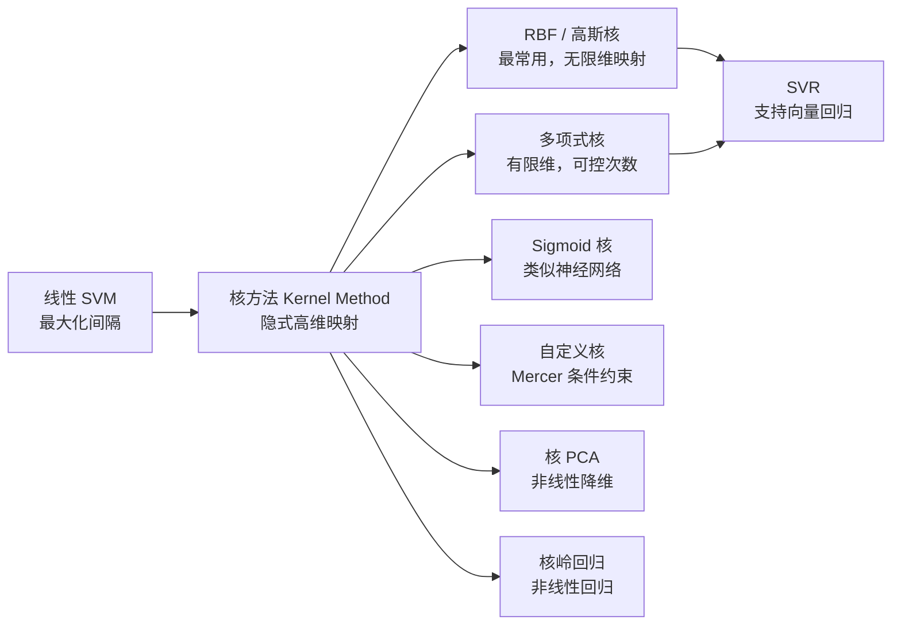
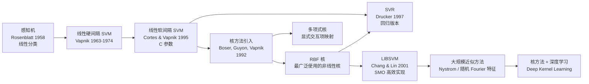

# 非线性 SVM (核方法)

## 知识地图



## 前置知识

- [线性 SVM](linear-svm.md) ——理解原始/对偶问题、支持向量、参数 $C$
- [线性代数：内积、Gram 矩阵](linear-regression.md)
- [拉格朗日对偶性](linear-svm.md) 的基本概念
- [正则化](l1-l2-regularization.md) 和过拟合的概念
- 距离度量的直觉（欧氏距离、相似度）

## 为什么会出现 (Why)

线性 SVM 在处理线性不可分数据时无能为力——硬间隔直接无解，软间隔也只是容忍错误而非真正捕捉非线性模式。直观想法是：既然低维分不开，为什么不把数据"投影"到高维空间？比如二维平面上圆环状的数据，映射到三维后用一个平面就能分开。但显式做高维映射有两个问题：(1) 计算复杂度爆炸（如映射 d 维特征到所有二阶多项式的 $O(d^2)$ 维）；(2) 某些核函数（如 RBF）隐含映射到**无限维**空间，根本没法显式计算。1995 年 Vapnik 等人将核技巧引入 SVM，实现了"在低维计算、在高维分类"的优雅方案，使 SVM 从只能画直线的模型跃升为万能分类器。

## 解决什么问题 (Problem)

非线性 SVM 解决的核心问题是：**原始特征空间中线性不可分的分类与回归问题**。通过核函数隐式映射，SVM 可以在不增加计算复杂度的情况下学习任意复杂的决策边界。

## 核心思想 (Core Idea)

当数据在原始空间中线性不可分时，SVM 通过**核函数 (Kernel Function)** 隐式地将数据映射到高维空间，在高维空间中寻找线性超平面。关键在于——我们不需要知道高维空间长什么样，只需要知道两个样本在高维空间中的"相似度"（内积）。

---

## 数学模型/公式

### 核技巧 (Kernel Trick)

在对偶问题中，特征只以内积 $\mathbf{x}_i^T \mathbf{x}_j$ 的形式出现。核函数直接计算高维空间的内积，无需显式做特征映射：

$$K(\mathbf{x}_i, \mathbf{x}_j) = \langle \phi(\mathbf{x}_i), \phi(\mathbf{x}_j) \rangle$$

**通俗解释：** 核技巧就像两个人在黑屋子里不用见面，只需要一个"握手协议"就能互相确认身份。我们不直接计算每个样本在高维空间中的坐标 $\phi(\mathbf{x})$（可能无限维），而是只计算两个样本映射后的内积 $K(\mathbf{x}_i, \mathbf{x}_j)$。比如 RBF 核 $K(\mathbf{x}_i, \mathbf{x}_j)$ 只依赖两个样本在原始空间的距离，计算复杂度是 $O(d)$，但它等价于在无限维空间中做内积——四两拨千斤。

---

### RBF (高斯核) — 最常用

$$K(\mathbf{x}_i, \mathbf{x}_j) = \exp\left(-\gamma \|\mathbf{x}_i - \mathbf{x}_j\|^2\right)$$

**通俗解释：** RBF 核就像在训练集的每个样本上放一个高斯"影响球"。测试样本离哪个训练样本越近，它们的核函数值（相似度）越接近 1；越远则越接近 0。最终决策边界由所有支持向量的影响球加权投票决定。$\gamma$ 控制每个球的影响半径——想象 $\gamma$ 是"敏感度"旋钮：调大了（大 $\gamma$），每个球的影响范围缩小，你需要更多球来覆盖空间，容易过拟合；调小了（小 $\gamma$），每个球范围很大，边界变平滑，可能欠拟合。

- $\gamma$ 控制单个样本的影响范围
- $\gamma$ 大 → 高方差（过拟合风险）——每个样本形成独立"岛屿"
- $\gamma$ 小 → 高偏差（欠拟合风险）——样本之间影响重叠、边界模糊

### 多项式核

$$K(\mathbf{x}_i, \mathbf{x}_j) = (\gamma \mathbf{x}_i^T \mathbf{x}_j + r)^d$$

**通俗解释：** 多项式核算的是特征之间 d 阶以内所有交互项的内积之和。比如 $d=2$ 时，它隐式地包含了 $x_1^2, x_1x_2, x_2^2$ 等所有二阶交互。但和显式构造多项式特征不同，核函数在原始 d 维空间中计算而无需真正展开这些项。d 越大，模型越复杂，可拟合更曲折的边界。

- $d$ 是多项式的次数
- $d=1$ 退化为线性核

### Sigmoid 核

$$K(\mathbf{x}_i, \mathbf{x}_j) = \tanh(\gamma \mathbf{x}_i^T \mathbf{x}_j + r)$$

与神经网络的激活函数有相似之处。

**通俗解释：** Sigmoid 核本质上是一个单隐层神经网络的激活函数。它计算两个样本的加权内积后经过 tanh 非线性变换。但由于 Sigmoid 核只有在特定参数下才满足 Mercer 条件（Gram 矩阵半正定），实际使用不如 RBF 和多项式核广泛。

### RBF 核的直觉

RBF 核可以理解为：在样本 $\mathbf{x}_i$ 周围放置一个高斯"影响球"，距离越近的点相似度越接近 1，越远越接近 0。

### Mercer 定理

根据 **Mercer 定理**，只要核函数对应的 Gram 矩阵是半正定的，就隐式存在某个特征空间使核函数有效。这为设计新核函数提供了理论判据。

**通俗解释：** Mercer 定理是核函数的"准入门槛"。不是随便一个函数都可以当核函数用的——它必须对应某个（可能是无限维）特征空间中的内积。验证方法：对于任意一组样本，计算出的 Gram 矩阵 $K_{ij} = K(\mathbf{x}_i, \mathbf{x}_j)$ 必须是半正定的。这保证了目标函数仍然是凸的，优化能收敛到全局最优。

---

## 可视化展示

### 核方法的核心流程


### RBF 核：$\gamma$ 参数对决策边界的影响示意


---

## 最小可运行代码

### Scikit-learn（带网格搜索）

```python
from sklearn.svm import SVC
from sklearn.model_selection import GridSearchCV

svm = SVC(kernel='rbf')
param_grid = {
    'C': [0.1, 1, 10, 100],
    'gamma': ['scale', 'auto', 0.01, 0.1, 1],
}
grid = GridSearchCV(svm, param_grid, cv=5)
grid.fit(X_train, y_train)
```

### NumPy 手写 RBF 核 SVM（简化版）

```python
import numpy as np
from scipy.optimize import minimize

class KernelSVM:
    def __init__(self, C=1.0, gamma=0.1, kernel='rbf', degree=3, coef0=0):
        self.C = C
        self.gamma = gamma
        self.kernel = kernel
        self.degree = degree
        self.coef0 = coef0

    def _kernel(self, X, Z):
        if self.kernel == 'linear':
            return X @ Z.T
        elif self.kernel == 'poly':
            return (self.gamma * X @ Z.T + self.coef0) ** self.degree
        elif self.kernel == 'rbf':
            # 高效计算 RBF: ||x-z||^2 = ||x||^2 + ||z||^2 - 2 x·z
            X_norm = np.sum(X**2, axis=1).reshape(-1, 1)
            Z_norm = np.sum(Z**2, axis=1).reshape(1, -1)
            sq_dists = X_norm + Z_norm - 2 * X @ Z.T
            return np.exp(-self.gamma * sq_dists)
        else:
            raise ValueError(f"Unknown kernel: {self.kernel}")

    def fit(self, X, y):
        n = X.shape[0]
        K = self._kernel(X, X)
        # 对偶变量 alpha 的优化...
        # （完整 SMO 算法见 LIBSVM 源码，这里略去）
        self.X = X
        self.y = y
        self.alpha = np.zeros(n)  # placeholder
        self.b = 0
        # 实际使用请调用 sklearn.svm.SVC，SMO 实现较复杂

    def predict(self, X):
        K = self._kernel(X, self.X)
        return np.sign(K @ (self.alpha * self.y) + self.b)
```

---

## 工业界应用

| 应用场景 | 核函数选择 | 为什么 | 优点 | 缺点 |
|----------|-----------|--------|------|------|
| 文本分类（长文本） | 线性核 | 高维稀疏特征本身近似线性可分 | 极快，可处理百万级样本 | 无法捕捉复杂语义交互 |
| 图像分类（传统方法） | RBF 核 | 像素/特征交互复杂，需非线性边界 | 小样本下精度极高 | 样本超过 10k 时训练极慢 |
| 生物信息学 | RBF / 多项式核 | 基因表达数据非线性关系强 | n << d 场景下泛化最好 | 需仔细调参（C + gamma） |
| 金融风控 | RBF 核 | 欺诈模式复杂、非线性 | 中小数据量下准确率高于逻辑回归 | 无法直接输出概率，需额外校准 |
| 推荐系统（用户-物品匹配） | 自定义核 | 可利用领域知识设计核函数 | 灵活，可融合多种信息源 | 设计核函数需领域专家 |

---

## 优缺点对比

| 优点 | 缺点 |
|------|------|
| 可以拟合极其复杂的决策边界 | $O(n^2)$ 空间和 $O(n^3)$ 时间的复杂度使其不适合大规模数据（n > 10^5） |
| 全局最优解（凸优化），不陷入局部极小值 | 超参数多（C、gamma、核选择），调参成本高 |
| 通过核函数灵活适配不同数据分布 | RBF 核的可解释性差——决策边界是黑箱 |
| 小样本下泛化能力极强 | 预测慢——需计算测试样本与所有支持向量的核函数值 |
| Mercer 定理提供理论保证 | 核函数选择缺乏系统化理论指导，主要靠经验 |

---

## 对比表格

| 维度 | 线性 SVM | RBF 核 SVM | 多项式核 SVM | Sigmoid 核 SVM |
|------|---------|-----------|-------------|---------------|
| 表达能力 | 仅线性边界 | 可拟合任意复杂边界 | 限定 d 阶交互 | 类似单隐层 NN |
| 映射维度 | 无需映射 | **无限维** | 有限维 (O(d^d)) | 有限维 |
| 超参数 | C | C, $\gamma$ | C, $\gamma$, d, r | C, $\gamma$, r |
| 训练速度 | 快 (LIBLINEAR) | 中等 | 较快 | 较慢（非正定风险） |
| 过拟合风险 | 低 | 中（$\gamma$ 大时高） | 中（d 大时高） | 中 |
| 使用频率 | 极高（文本、稀疏数据） | **最高（默认首选）** | 低（特定场景） | 低（历史遗留） |
| 可解释性 | 高（权重可解读） | 低 | 中 | 低 |
| Mercer 条件 | 天然满足 | 天然满足 | 天然满足 | **仅在特定参数下满足** |

---

## 模型演化路线



---

## 学完后建议继续学习

- [线性 SVM](linear-svm.md) —— 如果不理解线性 SVM，核方法是空中楼阁
- [逻辑回归](logistic-regression.md) —— 对比非线性条件下的两类模型
- [L1/L2 正则化](l1-l2-regularization.md) —— 深入理解 C 参数的正则化含义
- [决策树](decision-tree.md) —— 另一种处理非线性边界的方法，且天然可解释
- [PCA/SVD](pca-svd.md) —— 对比核 PCA 如何将核方法扩展到降维
- [MSE/MAE/Huber](mse-mae-huber.md) —— 理解 SVR 中 $\varepsilon$-insensitive loss 的设计
- [FFNN/MLP](ffnn-mlp.md) —— 神经网络 vs 核方法：两种不同的非线性建模思路

---

## 高频面试题

**Q1: 核函数的本质是什么？为什么能处理非线性数据？**

标准答案：核函数的本质是隐式计算高维特征空间中的内积，$K(\mathbf{x}_i, \mathbf{x}_j) = \langle \phi(\mathbf{x}_i), \phi(\mathbf{x}_j) \rangle$。处理和数据的核心在于 Cover 定理（Cover's Theorem）：在低维空间中线性不可分的数据，通过非线性变换映射到足够高的维度后，以高概率变得线性可分。例如 XOR 问题在二维不可分，但映射到 $[x_1, x_2, x_1x_2]$ 三维后可以用一个平面分开。核技巧让我们在不显式计算 $\phi(\mathbf{x})$ 的情况下享受高维映射的好处——只需在原始空间计算核函数即可，计算复杂度与映射维度无关。

**Q2: RBF 核的 $\gamma$ 参数如何影响模型？过大或过小会怎样？**

标准答案：$\gamma$ 控制单个训练样本的影响范围。从公式 $K(\mathbf{x}_i, \mathbf{x}_j) = \exp(-\gamma \|\mathbf{x}_i - \mathbf{x}_j\|^2)$ 可看出，$\gamma$ 越大，距离的微小增加就导致核值急剧下降——每个样本只影响极小邻域。后果：大 $\gamma$ → 决策边界极度曲折，几乎每个支持向量周围形成独立的"岛屿" → 过拟合；小 $\gamma$ → 样本影响范围大 → 决策边界平滑 → 接近线性 → 欠拟合。实践中 $\gamma$ 和 $C$ 需要联合调优：典型搜索空间 `gamma = [0.001, 0.01, 0.1, 1, 10, 100]`，`C = [0.1, 1, 10, 100, 1000]`。

**Q3: 为什么 SVM 不适合大规模数据？**

标准答案：核心瓶颈在训练复杂度。标准求解（SMO 算法 / 内点法）需要计算并维护 $n \times n$ 的核矩阵（Gram 矩阵），空间复杂度 $O(n^2)$，时间复杂度 $O(n^3)$ 或 $O(n^2)$。当 $n > 10^5$ 时，核矩阵的内存需求超过 80GB（float64）。此外，预测时需计算测试样本与所有支持向量的核函数，预测复杂度 $O(n_{sv} \cdot d)$。实用解决方案：(1) 对 n > 10^5 用线性 SVM（`sklearn.svm.LinearSVC`，复杂度 O(n)）；(2) 用近似方法如 Nystrom 近似、随机 Fourier 特征；(3) 用小批量随机梯度下降直接优化 Hinge Loss 的原始形式（`sklearn.linear_model.SGDClassifier(loss='hinge')`）。

**Q4: 如何选择核函数？什么时候用线性核、RBF、多项式？**

标准答案：选择策略——(1) 先用线性核：特征数远大于样本数时（如文本 TF-IDF），数据在高维中天然接近线性可分；而且训练快、可解释性强。(2) 线性效果不好时尝试 RBF 核：RBF 是默认首选非线性核，因为它映射到无限维、参数少（只有 $\gamma$）、适用于大多数非线性场景。(3) 多项式核：当确信特征之间的交互有明确物理意义且交互阶数不高时使用（如计算机视觉中的二阶交互），但调参困难（d, $\gamma$, r 三个参数）。经验法则：特征数多 + 样本少 → 线性核；样本适中 → RBF；特殊领域知识 → 多项式或自定义核。

**Q5: 解释 Cover 定理及其对 SVM 的指导意义。**

标准答案：Cover 定理（1965）指出：将 N 个点映射到更高维空间后，以高概率存在一个线性超平面能将它们分开。映射维度越高，线性可分的概率越接近 1。这对 SVM 的指导意义：(1) 提供了核方法的理论基础——映射到高维（甚至无限维，如 RBF 核）后数据很可能线性可分；(2) 但同时也揭示了一个陷阱：维度太高会导致"维数灾难"和过拟合。SVM 的最大间隔策略恰好对抗了这个问题——即使在高维空间中，最大化间隔也约束了模型复杂度，防止过拟合。这是 SVM 理论和实践上如此成功的核心原因。
