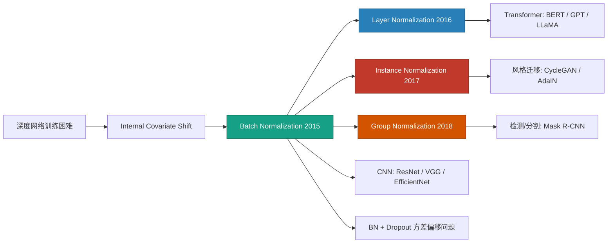
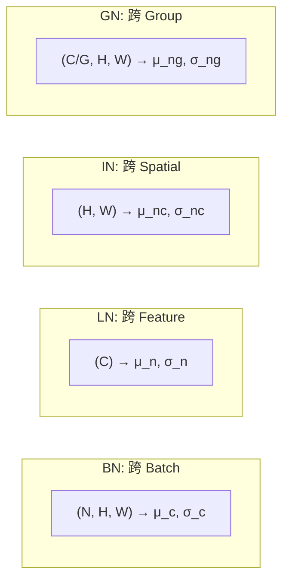

# BN / LN / IN / GN (归一化方法)

## 知识地图



## 前置知识

- 神经网络的基本训练流程（前向传播 + 反向传播）
- 均值 ($\mu$) 和方差 ($\sigma^2$) 的基本概念
- 梯度下降与学习率
- 全连接层 / 卷积层的基本结构
- 协变量偏移（Covariate Shift）的直观概念

## 为什么会出现 (Why)

训练深度网络时，每一层参数的更新会改变该层输出的分布，导致下一层接受到的输入分布不断变化——这就是 **Internal Covariate Shift（内部协变量偏移）**。这就像你在学射箭，但每次射完后靶子就自动移动了——你永远无法稳定瞄准。结果是：(1) 必须使用很小的学习率，否则训练不稳定；(2) 对参数初始化极其敏感；(3) 深层网络难以训练。

Batch Normalization (BN, 2015) 通过强制每一层输出保持零均值单位方差的分布，让"靶子"固定住——学习率可以大幅提高，初始化不那么敏感了，深层网络终于能高效训练了。后续的 LN、IN、GN 都是为了解决 BN 在不同场景下的局限性而提出的。

## 解决什么问题 (Problem)

归一化层的本质是**消除内部协变量偏移（Internal Covariate Shift）**——让每一层的输入分布保持稳定，从而允许使用更大的学习率，加速收敛。四种方法的区别仅在于 **"在哪个维度上算均值和方差"**：BN 跨 batch，LN 跨特征，IN 跨空间，GN 折中分组。

## 核心思想 (Core Idea)

把每一层的输出"标准化"到零均值单位方差，再通过可学习的缩放 ($\gamma$) 和平移 ($\beta$) 恢复网络的表达能力——稳住信号流，但不锁死容量。

---

## 数学模型/公式

所有归一化方法共享同一范式：

$$
\hat{x}_i = \frac{x_i - \mu}{\sqrt{\sigma^2 + \epsilon}}, \quad y_i = \gamma \hat{x}_i + \beta
$$

其中 $\mu, \sigma^2$ 在**不同的维度集合**上计算，$\gamma, \beta$ 是可学习的仿射参数（恢复表达能力），$\epsilon$ 是数值稳定常数（如 $10^{-5}$）。

**通俗解释：** 归一化的两步法则——第一步"去风格化"：把数据减均值除标准差，变成标准正态分布（均值 0、方差 1），消除不同 batch/样本/通道之间的尺度差异；第二步"恢复表达能力"：乘以 $\gamma$（调方差）再加 $\beta$（调均值），因为纯标准化的分布可能不适合后续层的激活函数（比如 Sigmoid 在均值 0、方差 1 时几乎线性，失去了非线性能力）。$\gamma$ 和 $\beta$ 让网络自己学"什么均值和方差对我最舒服"。

### Batch Normalization (BN)

在 **(N, H, W)** 三个维度上计算统计量（每个通道独立）：

$$
\mu_c = \frac{1}{N \cdot H \cdot W} \sum_{n, h, w} x_{nchw}
$$

**通俗解释：** 对于第 c 个通道，把当前 mini-batch 中所有样本、所有空间位置的值混在一起，算一个全局均值和方差。因为跨了 batch，所以叫 Batch Norm。这也解释了为什么 BN 依赖大 batch——样本太少时算出来的均值方差不准。

$$
\sigma_c^2 = \frac{1}{N \cdot H \cdot W} \sum_{n, h, w} (x_{nchw} - \mu_c)^2
$$

**通俗解释：** 对第 c 个通道的方差也跨 batch 和空间计算。统计量的"噪音"反而成了一种隐式正则化——每次 mini-batch 的均值和方差略有不同，相当于给网络注入了随机扰动，有一定抗过拟合效果。

**优势**：大 batch 下统计量准确，收敛快；有轻微正则化效果（batch 统计量的随机噪声）。

**致命缺陷**：
- 小 batch（$N < 8$）下统计量极不稳定
- 训练/测试行为不一致（需维护 running mean/var）
- 不适用于 RNN（序列长度变化，无法维护固定维度的 running stats）

### Layer Normalization (LN)

在 **(C, H, W)** 或 **(C)** 维度上计算——沿**特征轴**，而非 batch 轴：

$$
\mu_n = \frac{1}{C} \sum_{c=1}^{C} x_{nc}, \quad \sigma_n^2 = \frac{1}{C} \sum_{c=1}^{C} (x_{nc} - \mu_n)^2
$$

**通俗解释：** BN 是"同一个班级的学生，所有人比身高"（跨 batch），LN 是"每个学生自己的各科成绩做归一化"（跨特征）。每个样本独立计算自己所有特征的均值和方差——所以与 batch 大小完全无关，训练和测试行为完全一致。这就是为什么 Transformer 选的是 LN 不是 BN——NLP 任务中句子长度不同，batch 内的统计量没意义。

$$
\text{LN}(\mathbf{x}) = \gamma \odot \frac{\mathbf{x} - \mu}{\sqrt{\sigma^2 + \epsilon}} + \beta
$$

**通俗解释：** 对每个样本自身的所有特征维度做标准化。$\gamma$ 和 $\beta$ 是每个特征维度独立的（可学的"个性化缩放"），把标准化后的分布调整到最适合该层激活函数的均值和方差。

### Instance Normalization (IN)

在 **(H, W)** 维度上计算——每个样本、每个通道独立：

$$
\mu_{nc} = \frac{1}{HW} \sum_{h, w} x_{nchw}
$$

**通俗解释：** 对单张特征图的"画面"做归一化——只关心这幅画自己的亮度和对比度，不和其他画比（不跨 batch），也不和自己其他的特征图比（不跨通道）。这恰好抹掉了"风格"信息（亮度和对比度），保留了"内容"信息（结构）。这就是为什么 IN 是风格迁移的核心。

主要用于风格迁移：消除每个实例特有的对比度信息，保留内容结构。

### Group Normalization (GN)

BN 与 LN 的折中：将通道分成 $G$ 组，每组内做归一化：

$$
\mu_{ng} = \frac{1}{(C/G) \cdot HW} \sum_{c \in \text{group}_g,\ h, w} x_{nchw}
$$

**通俗解释：** GN 是 BN 和 LN 的"中间方案"——不跨 batch（继承 LN 的小 batch 友好），也不只归一化单个通道（比 IN 多跨几个通道）。把通道分为若干组，每组内的通道一起算均值方差。这样既保留了通道间的结构关系，又不依赖 batch 大小。$G=1$ 就是 LN，$G=C$ 就是 IN，常用 $G=32$。

- $G = 1$：退化为 LayerNorm
- $G = C$：退化为 InstanceNorm
- 常用 $G = 32$

---

## 可视化展示

### 四种归一化的计算维度示意



### BN 的 batch size 效应

不同 batch size 下 BN 统计量的准确性对比：

```echarts
return {
  xAxis: { type: 'category', data: ['BN(batch=2)', 'BN(batch=8)', 'BN(batch=32)', 'LN', 'GN(G=32)'] },
  yAxis: { type: 'value', min: 0, max: 1, name: '相对稳定性' },
  legend: { top: 28,  data: ['训练稳定性', '小batch适应性'] },
  series: [
    {
      name: '训练稳定性', type: 'bar',
      data: [0.3, 0.65, 0.95, 0.85, 0.8],
      itemStyle: { color: '#2c3e50' }
    },
    {
      name: '小batch适应性', type: 'bar',
      data: [0.1, 0.3, 0.5, 0.95, 0.9],
      itemStyle: { color: '#16a085' }
    }
  ],
  tooltip: { trigger: 'axis' },
  grid: { left: 60, right: 20, top: 40, bottom: 70 }
}
```

---

## 模型结构图

```mermaid
flowchart TD
    subgraph norm_flow["归一化层的数据流"]
        Input[输入: 上一层输出] --> CalcMean[计算均值 μ<br/>在指定维度集合上]
        CalcMean --> CalcVar[计算方差 σ²<br/>在相同维度集合上]
        CalcVar --> Normalize[标准化<br/>x̂ = (x - μ) / √(σ² + ε)]
        Normalize --> Scale[缩放 + 平移<br/>y = γ · x̂ + β]
        Scale --> Output[输出: 进入激活函数]
    end
```

---

## 最小可运行代码

```python
import torch
import torch.nn as nn

# BatchNorm — CNN 首选
bn2d = nn.BatchNorm2d(num_features=64)   # 2D 卷积
bn1d = nn.BatchNorm1d(num_features=256)  # 1D / 全连接

# LayerNorm — Transformer 标配
ln = nn.LayerNorm(normalized_shape=512)           # 对最后一维
ln_multi = nn.LayerNorm(normalized_shape=[64, 64]) # 指定归一化形状

# InstanceNorm — 风格迁移
in_norm = nn.InstanceNorm2d(num_features=64)

# GroupNorm — 小 batch 检测/分割
gn = nn.GroupNorm(num_groups=32, num_channels=128)

# 可运行测试
if __name__ == "__main__":
    # BN 测试
    x_cnn = torch.randn(4, 64, 32, 32)  # [batch=4, channels=64, H=32, W=32]
    print(f"BatchNorm2d:  {x_cnn.shape} → {bn2d(x_cnn).shape}")

    # LN 测试
    x_seq = torch.randn(4, 10, 512)     # [batch=4, seq_len=10, d_model=512]
    print(f"LayerNorm:    {x_seq.shape} → {ln(x_seq).shape}")

    # IN 测试
    x_img = torch.randn(4, 64, 32, 32)
    print(f"InstanceNorm:  {x_img.shape} → {in_norm(x_img).shape}")

    # GN 测试
    x_small = torch.randn(2, 128, 32, 32)  # batch=2 (小batch)
    print(f"GroupNorm:     {x_small.shape} → {gn(x_small).shape}")
```

### NumPy 手写 LN（Transformer 核心）

```python
import numpy as np

def layer_norm(x, gamma, beta, eps=1e-5):
    mean = np.mean(x, axis=-1, keepdims=True)
    var = np.var(x, axis=-1, keepdims=True)
    return gamma * (x - mean) / np.sqrt(var + eps) + beta

# 测试
x = np.random.randn(2, 5, 8)       # [batch=2, seq=5, d_model=8]
gamma = np.ones(8)
beta = np.zeros(8)
y = layer_norm(x, gamma, beta)
print(f"Input mean: {np.mean(x, axis=-1)[0, 0]:.6f}, std: {np.std(x, axis=-1)[0, 0]:.6f}")
print(f"Output mean: {np.mean(y, axis=-1)[0, 0]:.6f}, std: {np.std(y, axis=-1)[0, 0]:.6f}")
# 输出均值 ≈ 0, 标准差 ≈ 1
```

---

## 工业界应用

| 归一化方法 | 典型模型 | 为什么用它 |
|-----------|---------|-----------|
| BatchNorm | ResNet, VGG, EfficientNet, DenseNet | 大 batch CNN 训练收敛最快，轻微正则化 |
| LayerNorm | BERT, GPT, LLaMA, ViT | 与 batch 无关，训练推理一致，适配变长序列 |
| InstanceNorm | CycleGAN, AdaIN, Pix2Pix | 抹掉"风格"信息（对比度/亮度），保留内容结构 |
| GroupNorm | Mask R-CNN, 目标检测/分割 | 小 batch 下比 BN 更稳定，通道分组比 LN 更灵活 |
| RMSNorm | LLaMA, Mistral, Gemma | LN 的简化版，省去减均值的步骤，计算更快 |

---

## 对比表格

| 方法 | 归一化维度 | 参数量 | 小 batch 适应性 | 训练/推理一致性 | 最佳场景 | 典型模型 |
|------|-----------|--------|----------------|----------------|----------|----------|
| BN | $N \times H \times W$ | $2C$ | 差 (需 N > 8) | 不一致（需 running stats） | 大 batch CNN | ResNet, VGG |
| LN | $C$ | $2C$ | 优秀 | 完全一致 | Transformer, RNN | BERT, GPT, LLaMA |
| IN | $H \times W$ | $2C$ | 优秀 | 完全一致 | 风格迁移 | CycleGAN, AdaIN |
| GN | $\frac{C}{G} \times H \times W$ | $2C$ | 优秀 | 完全一致 | 小 batch 检测/分割 | Mask R-CNN |
| RMSNorm | $C$ | $C$（无 $\beta$） | 优秀 | 完全一致 | 大模型推理加速 | LLaMA, Mistral |

### 关键区别总结

| 维度 | BN 跨 batch | LN 跨 feature | IN 跨 spatial | GN 跨 group |
|------|------------|---------------|---------------|-------------|
| "类比" | 全班比身高 | 各科成绩归一 | 每张画自己调整 | 几个人一组内部比 |
| 依赖 batch size? | 是（致命弱点） | 否 | 否 | 否 |
| 对序列数据? | 不支持 | 完美支持 | 不适用 | 可用 |
| 对生成任务? | 差 | 可 | 最佳 | 可 |

---

## 学完后建议继续学习

- [MLP / FFNN](./ffnn-mlp.md) —— BN 在 MLP 中的应用
- [卷积层 (Conv Layer)](./conv-layer.md) —— BN 在 CNN 中的最佳实践
- [Dropout 正则化](./dropout.md) —— BN + Dropout 的方差偏移问题
- [激活函数详解](./activation-functions.md) —— BN 后该用什么激活函数
- [Transformer 架构](./transformer.md) —— LN 在 Transformer 中的核心地位

---

## 高频面试题

**Q1: BatchNorm 训练和测试时的行为有什么不同？为什么？**

标准答案：训练时，BN 用当前 mini-batch 的均值和方差做归一化；同时通过指数移动平均（momentum，默认 0.1）维护全局的 running_mean 和 running_var。测试时，BN 使用训练阶段累积的 running_mean 和 running_var，不再依赖当前 batch。这是因为测试时 batch 可能很小（甚至 batch=1），且测试不应依赖 batch 内的其他样本（需要确定性输出）。这也导致了一个陷阱——`model.train()` 和 `model.eval()` 必须正确切换。

**Q2: 为什么 Transformer 用 LayerNorm 而不是 BatchNorm？**

标准答案：主要有三个原因：(1) NLP 任务中序列长度可变，BN 跨 batch 维度需要所有样本在同一位置有对齐的语义（如所有句子的第 3 个词），这对变长序列不成立；(2) Transformer 训练时 batch 可能很小（受显存限制），BN 的统计量在小 batch 下极不稳定；(3) LN 的训练和推理行为完全一致，不需要维护 running stats，实现更简洁。LN 沿特征轴做归一化，每个 token 独立处理，天然适配自注意力机制的变长输入。

**Q3: BatchNorm 的 $\gamma$ 和 $\beta$ 参数是干什么的？为什么标准化完还要再缩放和平移？**

标准答案：$\gamma$（可学习缩放）和 $\beta$（可学习平移）被称为仿射参数（affine parameters）。标准化后数据变成均值 0、方差 1 的分布，但这可能损害网络的表达能力——例如 Sigmoid 激活函数在 0 附近近似线性，失去了非线性能力。通过 $\gamma$ 和 $\beta$，网络可以学习将标准化后的分布调整到最适合激活函数的区域。极端情况下，当 $\gamma = \sigma, \beta = \mu$ 时，BN 等价于恒等变换（即不做归一化）——让网络自己选择是否需要归一化以及归一化到什么程度。

**Q4: Group Normalization 和 LayerNorm / InstanceNorm 有什么关系？**

标准答案：三者是同一家族的连续谱——GN 将 C 个通道分成 G 组，每组内部做归一化。当 G=1 时，所有通道在一组内归一化，退化为 LN；当 G=C 时，每个通道自己归一化，退化为 IN。GN 的巧妙之处在于折中——G 取中间值（常用 32）时，既不像 LN 那样忽略通道间的差异（组间独立），也不像 IN 那样完全抹掉通道间的结构信息（组内有多个通道相互对比）。这使得 GN 在小 batch 检测/分割任务中表现优于 BN 和 LN，且 batch size 越小优势越明显。

**Q5: BN 和 Dropout 一起使用会有什么问题？（方差偏移）**

标准答案：BN 训练时用 mini-batch 统计量（有噪声），测试时用 running stats（无噪声）。Dropout 训练时将部分神经元置零，等效于改变输出的方差——具体来说，Dropout 后 neuron 的方差从 $\sigma^2$ 变为 $(1-p)\sigma^2$（inverted dropout 下缩放后恢复期望但不恢复方差）。当 BN 后接 Dropout 时，训练阶段 Dropout 改变了 BN 输出的方差分布，但测试时 Dropout 关闭，BN 用的 running stats 却没有考虑这个方差变化，导致训练和测试之间出现"方差偏移"(variance shift)。解决方案：(1) 将 Dropout 放在 BN 之前；(2) 使用 GN/LN 替代 BN；(3) 在 BN 后不直接加 Dropout。
