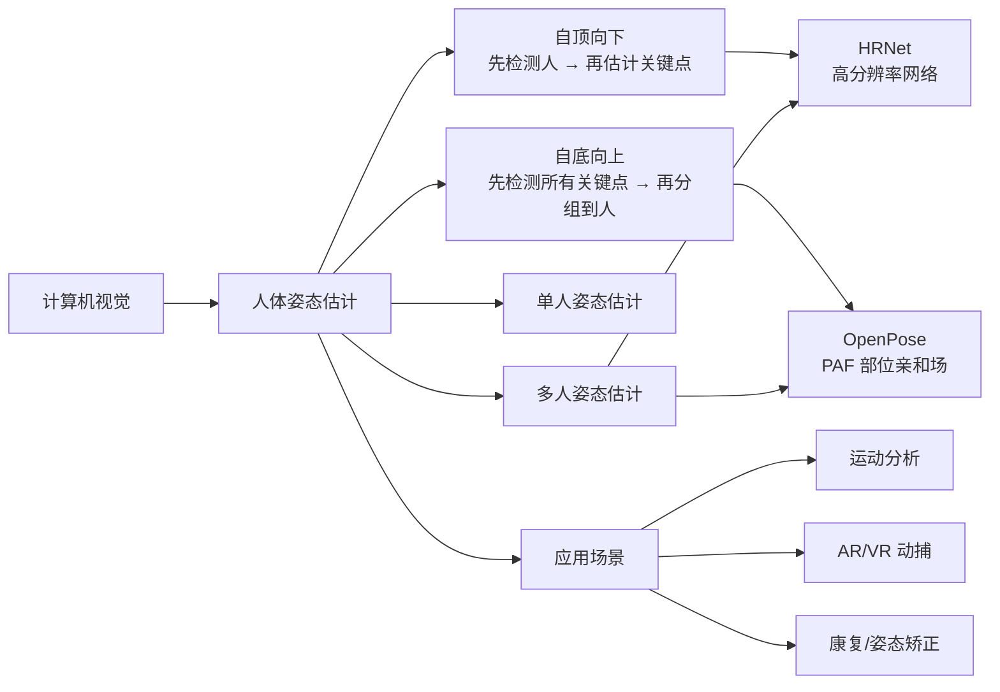
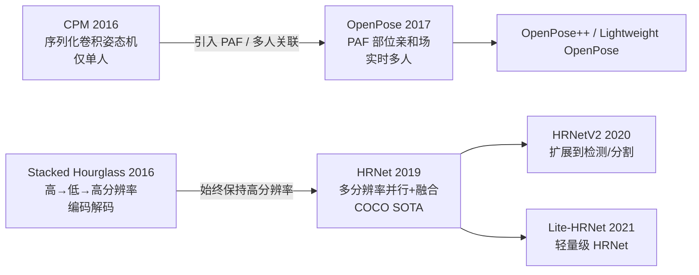
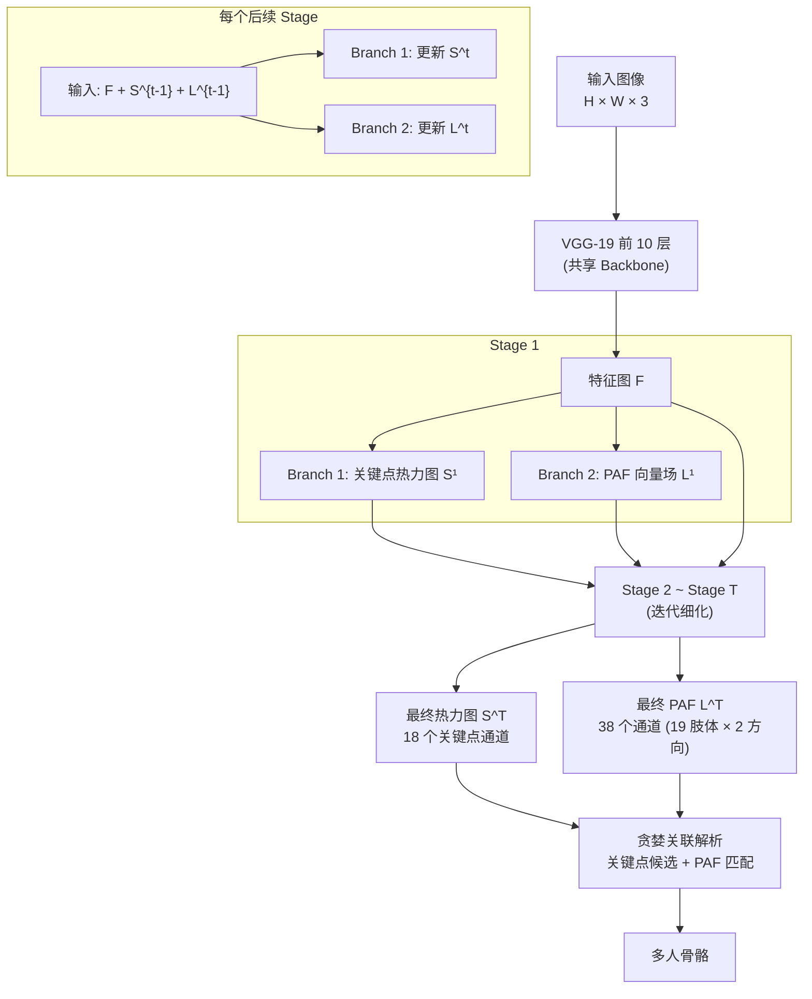
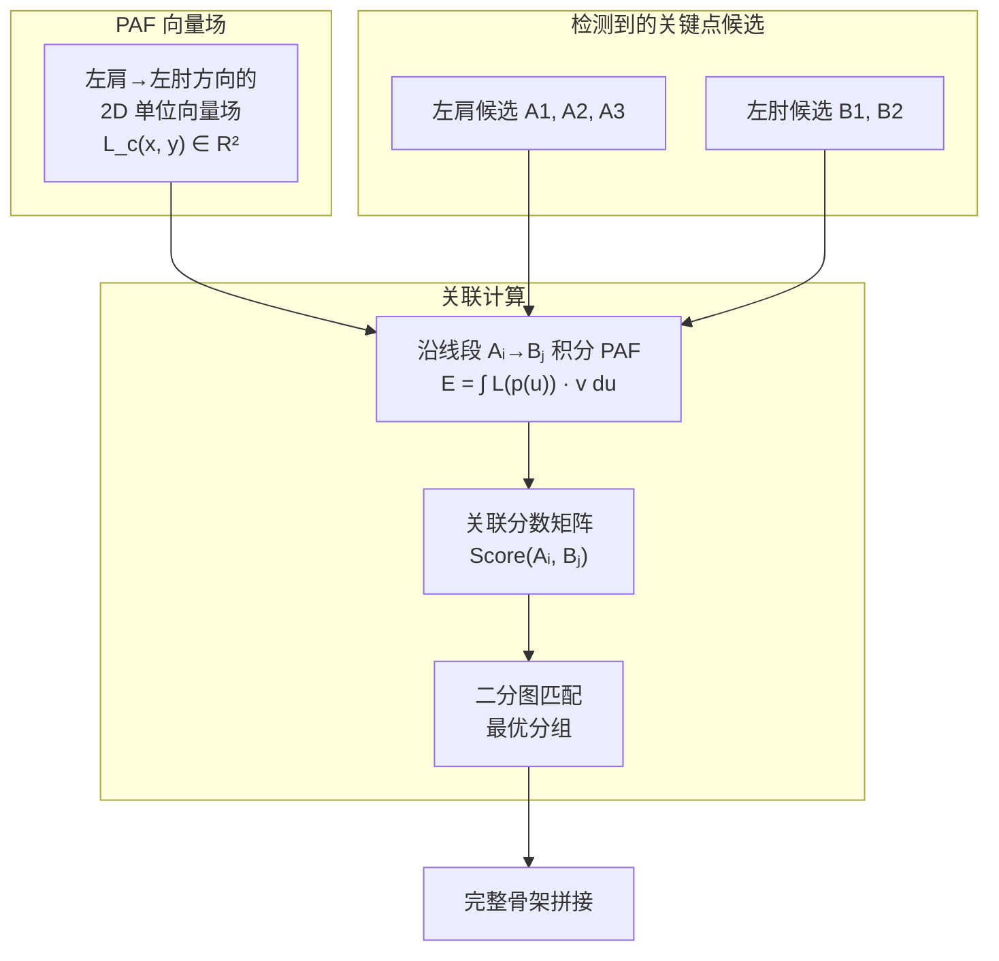
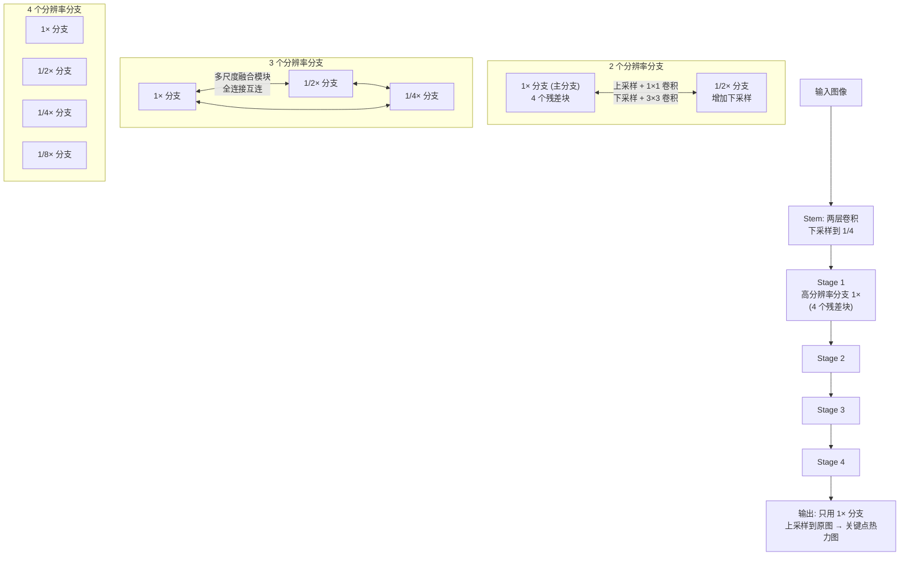
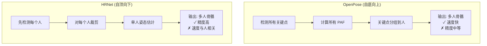
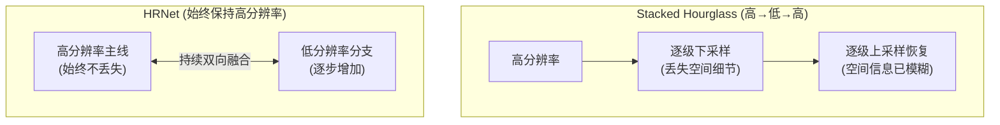

# OpenPose / HRNet

## 知识地图



## 前置知识

- **关键点检测基础**：热力图 (Heatmap)、COCO 17 关键点、MPII 16 关键点
- **CNN Backbone**：VGG-19、ResNet、特征图下采样的概念
- **堆叠沙漏网络 (Stacked Hourglass)**：高→低→高分辨率的编码解码架构
- **部位亲和场 (Part Affinity Fields)**：向量场的概念
- **二分图匹配**：将关键点分组到不同人的关联问题

## 模型演化路线



| Model | Year | Key Innovation |
|-------|------|----------------|
| CPM | 2016 | 多阶段热力图细化，中间监督 |
| Stacked Hourglass | 2016 | 高→低→高分辨率 + 跳跃连接，编码解码结构 |
| OpenPose | 2017 | Part Affinity Fields (PAFs)，第一个实时多人自底向上姿态估计 |
| HRNet | 2019 | 始终保持高分辨率主线 + 多分辨率并行融合，COCO 姿态估计 SOTA |
| Lite-HRNet | 2021 | HRNet 的轻量版本，用于移动端姿态估计 |

## 为什么会出现 (Why)

在 OpenPose 之前，多人姿态估计面临一个核心难题——**关联问题 (Association Problem)**：

1. **自顶向下方法**（先检测每个人，再对每个人做关键点检测）：精度高但速度慢，且严重依赖检测器（检测漏了人就无法估计姿态）。速度随人数线性增长。
2. **自底向上方法**（先检测所有关键点，再分组到人）：速度快（与人数无关）但精度低。核心难题是"哪个关键点属于哪个人"——如何把散落的关键点正确分组。

OpenPose 用 PAF（Part Affinity Fields，部位亲和场）优雅地解决了关联问题——在关键点之间定义一个向量场，表示"这个像素是否在某条肢体上"以及"肢体的方向是哪里"。关键点分组通过沿着 PAF 向量场积分来评估候选连接的质量。

HRNet 的出现在另一个方向——自顶向下方法的精度极限。传统 Hourglass 网络走"高→低→高"路线（先下采样获取语义，再上采样恢复分辨率），但上采样过程不可避免地丢失空间细节。HRNet 的设计哲学完全不同：**始终保持一条高分辨率流**，并与其他低分辨率分支持续融合——不再丢失空间信息。

## 解决什么问题 (Problem)

- **OpenPose**：解决多人姿态估计中的关键点关联问题（哪个关键点属于哪个人），实现实时自底向上多人姿态估计
- **HRNet**：解决自顶向下方法中高→低→高分辨率切换导致的空间信息损失，通过始终坚持高分辨率实现高精度关键点定位

## 核心思想 (Core Idea)

**OpenPose**：使用 PAF（部位亲和场）——一个 2D 向量场——来编码肢体位置和方向，通过沿 PAF 积分计算两个关键点之间的"关联置信度"，用二分图匹配将散落的关键点分组到不同人。  
**HRNet**：抛弃高→低→高的分辨率切换流程，始终保持一条高分辨率主线，并通过多分辨率并行交互（反复做上采样和下采样融合）逐步丰富语义信息。

## 模型结构图

### OpenPose 架构



### PAF 关联原理



### HRNet 架构



## 数学模型/公式

### OpenPose — 部位亲和场 (PAF) 定义

对于肢体 $c$（如"左肩到左肘"）上的点 $p$：

$$\mathbf{L}_{c,k}^*(p) = \begin{cases} \mathbf{v} & \text{if } p \text{ on limb } c \text{ of person } k \\ 0 & \text{otherwise} \end{cases}$$

**通俗解释：** PAF 是一个 2D 向量场——对于图像中的每个像素，如果它落在某人的肢体 $c$ 上（比如落在左大臂区域），就赋值为肢体方向的单位向量 $\mathbf{v}$（从肩指向肘）。如果不在任何肢体上，赋值为零向量。PAF 同时编码了"这个像素是不是在肢体上"（向量长度）和"肢体朝向哪里"（向量方向）。

### OpenPose — PAF 真值生成

$$\mathbf{v} = \frac{(\mathbf{x}_{j2, k} - \mathbf{x}_{j1, k})}{\|\mathbf{x}_{j2, k} - \mathbf{x}_{j1, k}\|_2}$$

**通俗解释：** $\mathbf{v}$ 是从关键点 $j1$（如左肩）指向关键点 $j2$（如左肘）的单位向量。对每个人 $k$ 的每对相邻关键点，计算方向向量并赋给肢体区域（定义为两个关键点连线为中心、一定宽度的矩形区域）。

### OpenPose — 关联分数

$$E = \int_{u=0}^{1} \mathbf{L}_c(p(u)) \cdot \frac{d_{j2} - d_{j1}}{\|d_{j2} - d_{j1}\|_2} du$$

**通俗解释：** 给定两个候选关键点 $d_{j1}$ 和 $d_{j2}$（如检测到的左肩候选和左肘候选），沿它们之间的连线均匀采样 $u \in [0, 1]$，在每个采样点计算 PAF 向量 $\mathbf{L}_c(p(u))$ 与肢体方向向量的点积，然后积分（实际中离散求和）。积分值越大，说明这两个关键点之间的连线与 PAF 预测的方向越一致——它们很可能属于同一个人。

### OpenPose — 损失函数

$$f_S^t = \sum_{j=1}^{J} \sum_p \mathbf{W}(p) \cdot \|\mathbf{S}_j^t(p) - \mathbf{S}_j^*(p)\|_2^2$$

$$f_L^t = \sum_{c=1}^{C} \sum_p \mathbf{W}(p) \cdot \|\mathbf{L}_c^t(p) - \mathbf{L}_c^*(p)\|_2^2$$

**通俗解释：** 两个分支分别在每个 stage $t$ 施加 L2 损失（中间监督）。$\mathbf{W}(p)$ 是权重掩膜，优先关注有标注的区域（避免大量背景像素主导梯度）。$\mathbf{S}_j^t$ 是预测的第 $j$ 个关键点的热力图，$\mathbf{L}_c^t$ 是预测的第 $c$ 个肢体的 PAF。多阶段中间监督确保每一层都收到梯度信号，避免深层训练困难。

### HRNet — 多分辨率融合

$$\mathbf{H}_r^{out} = \sum_{r' \in \{1, \frac{1}{2}, \frac{1}{4}, \frac{1}{8}\}} f_{r'r}(\mathbf{H}_{r'}^{in})$$

**通俗解释：** 对于分辨率等级 $r$（如 $1\times$ 原始分辨率），它的输出 $\mathbf{H}_r^{out}$ 是所有其他分辨率分支 $\mathbf{H}_{r'}^{in}$ 通过变换函数 $f_{r'r}$ 后的求和。$f_{r'r}$ 取决于 $r'$ 和 $r$ 的关系：
- 如果 $r' > r$（高→低）：用 stride=2 的 3×3 卷积下采样
- 如果 $r' < r$（低→高）：用 1×1 卷积 + 双线性上采样
- 如果 $r' = r$（同分辨率）：恒等映射

这个设计的精髓在于：它不是一个简单的 Concat 或 Add，而是一个**学习过的多尺度融合模块**——每个分辨率分支都收到所有其他分支变换后的信息。

### HRNet — 关键点热力图输出

$$\hat{\mathbf{H}} = \text{Conv}_{1\times1}(\mathbf{H}_{1\times}^{Stage4}, \text{upsampled}) \in \mathbb{R}^{K \times H \times W}$$

**通俗解释：** 最终只用最高分辨率分支（$1\times$）的输出，通过 1×1 卷积将通道数映射为关键点数量 $K$。因为从始至终保持了高分辨率，所以没有 Hourglass 网络中"上采样恢复分辨率"导致的模糊——关键点定位更加精确。

## 可视化展示

### OpenPose vs HRNet 方法论对比



### HRNet 多分辨率并行 vs Stacked Hourglass



## 最小可运行代码

### PyTorch — PAF 关联分数计算

```python
import numpy as np

def compute_connection_score(candidate_a, candidate_b, paf_field):
    """
    计算两个关键点候选之间的 PAF 关联分数
    candidate_a: (x, y) 第一个关键点
    candidate_b: (x, y) 第二个关键点
    paf_field: [2, H, W] PAF 向量场 (x 和 y 分量)
    """
    n_samples = 10
    x = np.linspace(candidate_a[0], candidate_b[0], n_samples)
    y = np.linspace(candidate_a[1], candidate_b[1], n_samples)

    vector_ab = np.array([candidate_b[0] - candidate_a[0],
                          candidate_b[1] - candidate_a[1]])
    vector_ab = vector_ab / (np.linalg.norm(vector_ab) + 1e-8)

    score = 0
    for i in range(n_samples):
        px, py = int(round(x[i])), int(round(y[i]))
        if 0 <= px < paf_field.shape[2] and 0 <= py < paf_field.shape[1]:
            paf_vec = paf_field[:, py, px]  # [2]
            if np.linalg.norm(paf_vec) > 0.1:  # 在肢体上
                score += np.dot(paf_vec, vector_ab)

    return score / n_samples
```

### PyTorch — HRNet 多分辨率融合模块

```python
import torch
import torch.nn as nn

class HRNetFusion(nn.Module):
    """HRNet 多分辨率特征融合模块"""

    def __init__(self, num_branches, channels_per_branch):
        super().__init__()
        self.num_branches = num_branches
        # 为每对 (source, target) 分支创建变换
        self.fuse_layers = nn.ModuleList()
        for target_idx in range(num_branches):
            fuse_row = nn.ModuleList()
            for source_idx in range(num_branches):
                if source_idx == target_idx:
                    fuse_row.append(nn.Identity())
                elif source_idx < target_idx:
                    # source 分辨率更高 → 需要下采样
                    stride = 2 ** (target_idx - source_idx)
                    fuse_row.append(nn.Sequential(
                        nn.Conv2d(channels_per_branch[source_idx],
                                  channels_per_branch[target_idx],
                                  kernel_size=3, stride=stride, padding=1),
                        nn.BatchNorm2d(channels_per_branch[target_idx]),
                    ))
                else:
                    # source 分辨率更低 → 需要上采样
                    scale = 2 ** (source_idx - target_idx)
                    fuse_row.append(nn.Sequential(
                        nn.Conv2d(channels_per_branch[source_idx],
                                  channels_per_branch[target_idx],
                                  kernel_size=1),
                        nn.BatchNorm2d(channels_per_branch[target_idx]),
                        nn.Upsample(scale_factor=scale, mode='bilinear',
                                   align_corners=False),
                    ))
            self.fuse_layers.append(fuse_row)

    def forward(self, x_list):
        """x_list: [branch_0_feat, branch_1_feat, ...]"""
        fused = []
        for target_idx in range(self.num_branches):
            target_feat = None
            for source_idx in range(self.num_branches):
                src_feat = x_list[source_idx]
                if target_feat is None:
                    target_feat = self.fuse_layers[target_idx][source_idx](src_feat)
                else:
                    # 注意：HRNet 使用 SUM 融合，不是 Concat
                    target_feat += self.fuse_layers[target_idx][source_idx](src_feat)
            target_feat = nn.functional.relu(target_feat)
            fused.append(target_feat)
        return fused
```

## 工业界应用

| 应用领域 | 使用模型 | 说明 |
|----------|---------|------|
| 运动分析 | OpenPose / HRNet | 篮球、足球等运动中运动员姿态捕捉和技术分析 |
| 体感游戏 | OpenPose (轻量版) | 实时提取玩家骨骼，驱动虚拟角色 |
| 安防监控 | OpenPose | 异常行为检测（打架、跌倒）、人群姿态分析 |
| 康复医疗 | HRNet | 运动康复中的姿态矫正评估，步态分析 |
| AR/VR | 轻量 OpenPose | 手势识别、全身动捕，虚拟试穿 |
| 影视特效 | OpenPose + 后处理 | 动作捕捉、CG 角色驱动 |
| 人机交互 | HRNet | 手势控制、体感交互界面 |
| 自动驾驶 | HRNet (微调) | 行人意图预测（通过人体姿态判断是否要过马路） |

## 对比表格

| | OpenPose | HRNet | Stacked Hourglass | CPM |
|------|----------|------|-------------------|-----|
| 方法 | 自底向上 | 自顶向下 | 自顶向下 | 单人/自顶向下 |
| 核心创新 | PAF 部位亲和场 | 始终保持高分辨率 | 高→低→高 + 跳跃连接 | 多阶段热力图细化 |
| 多人处理 | 原生支持（无需检测器） | 依赖检测器（先检测人） | 依赖检测器 | 依赖检测器 |
| 速度 | 快（与人数无关） | 较快（随人数线性增长） | 中等 | 中等 |
| 精度 | 中等 | 高（COCO SOTA） | 较高 | 较早 baseline |
| 适用场景 | 实时多人/人群场景 | 高精度单人/少人场景 | 高精度单人 | 基础方案 |

## 学完后建议继续学习

1. **HigherHRNet** — HRNet 的自底向上扩展版本，结合 HRNet 的高分辨率和自底向上的效率
2. **ViTPose** — Vision Transformer 应用于姿态估计，了解 Transformer 在关键点检测中的表现
3. **MoveNet / PoseNet** — Google 的轻量级姿态估计，移动端的实际部署方案
4. **3D 姿态估计** — VideoPose3D 等从 2D 关键点重建 3D 姿态
5. **Mesh Recovery (HMR / SPIN)** — 从 2D 姿态恢复 3D 人体网格 (SMPL)
6. **全身关键点 (DensePose)** — 从稀疏关键点到密集人体表面坐标的估计

## 高频面试题

### Q1: OpenPose 中的 PAF (Part Affinity Fields) 是怎么工作的？它怎么解决关键点关联问题？

**答案：** PAF 是一个 2D 向量场，它的设计同时编码了两个信息：
- **位置**：这个像素在不在某条肢体上？（向量长度 > 阈值 → 在肢体上）
- **方向**：如果在，肢体朝什么方向？（向量的方向）

关联算法的核心步骤：
1. **检测关键点候选**：在热力图上找峰值点（local maximum），得到每个关键点类型的候选列表（如左肩有 3 个候选位置）
2. **构建候选连接**：对每一对相邻关键点（如左肩→左肘），枚举所有候选之间的连接，生成候选边
3. **计算关联分数**：沿候选边均匀采样点，在每个采样点将 PAF 向量与边的方向单位向量做点积。如果 PAF 方向和边方向一致（平行），点积大 → 分数高。如果 PAF 为零（不在肢体上），或方向不一致，分数低
4. **二分图匹配**：将分数矩阵转化为二分图，用匈牙利算法找到最大权重匹配——确定哪些肩和哪些肘属于同一个人
5. **逐级拼接**：从树的根节点（颈部/鼻子）开始，逐步匹配相邻关键点对，构建完整的多人骨架树

PAF 的精妙之处在于它将"分组"这个离散优化问题转化为了连续的向量场学习问题。

### Q2: HRNet 为什么能比 Stacked Hourglass 精度更高？"保持高分辨率"到底带来了什么好处？

**答案：** 精度优势来自三个层面：

1. **空间信息无损**：Hourglass 网络在 bottleneck 处分辨率降到原始的 1/32 甚至 1/64，然后通过上采样恢复。虽然使用了跳跃连接（skip connection）来补充细节，但编码路径中仍然丢失了大量精确的空间位置信息。HRNet 的主分支始终保持在 1/4 分辨率，关键点的精确坐标从未被"压缩—解压"过。

2. **多分辨率并行而非串行**：Hourglass 是串行的——先下采样获取语义，再上采样恢复分辨率，语义和空间信息在不同阶段占主导。HRNet 是并行的——所有分辨率分支同时存在并持续交互。这更像一个"圆桌讨论"：高分辨率分支提供精确位置，低分辨率分支提供语义理解，每一层都在交流融合。

3. **融合是可学习的而非固定的**：HRNet 的融合模块为每对 (source, target) 分支学习了独立的变换参数（通过 1×1 或 3×3 卷积）。这不是简单的 resize 和相加，而是学习到"该从高分辨率拿多少位置信息、从低分辨率拿多少语义信息"。

定量的体现：HRNet-W48 在 COCO 关键点检测上达到 77.0 AP（使用检测器），而 Hourglass 为 73.4 AP。约 3.6 个点的提升，在姿态估计领域相当显著。

### Q3: 多人姿态估计中"自顶向下"和"自底向上"两种范式各有什么优缺点？实际项目中怎么选择？

**答案：**

**自顶向下 (Top-Down)**：
- 流程：检测器检测每个人 → 对每个人裁剪 → 单人姿态估计
- 优点：精度高（因为每个裁剪区域聚焦于一个人，分辨率高、干扰少）
- 缺点：速度随人数线性增长（N 个人需要 N 次姿态估计推理）；严重依赖检测器（检测器漏检 → 姿态估计漏人）；裁剪区域重叠时可能存在重复计算
- 代表：HRNet、SimpleBaseline、CPM

**自底向上 (Bottom-Up)**：
- 流程：检测所有关键点（全局）→ 关键点分组到不同人
- 优点：速度与人数无关（无论画面中有几人，关键点检测只做一次）；不依赖检测器
- 缺点：精度通常低于自顶向下（分组过程有误差）；在密集人群/遮挡严重时分组容易出错
- 代表：OpenPose、Associative Embedding、HigherHRNet

**实际选择**：
- 屏幕中有少量人（<5 人）且需要高精度 → 自顶向下（HRNet）
- 密集人群场景（>10 人）且需要实时处理 → 自底向上（OpenPose）
- 需要平衡 → HigherHRNet（HRNet 的底向上版本）

### Q4: OpenPose 为什么是"双分支"结构？热力图分支和 PAF 分支有什么不同？

**答案：** OpenPose 的两个分支分别回答两个不同但互补的问题：

**热力图分支 (Confidence Maps, S)**：回答"哪里有关键点？"
- 输出 $J$ 个通道（每个通道对应一个关键点类型，如左肩、右肘等）
- 每张热力图是一个高斯分布的叠加——每个关键点位置产生一个高斯峰
- 目标：找到每个关键点类型的所有候选位置（峰值点）

**PAF 分支 (Part Affinity Fields, L)**：回答"哪些关键点应该连接起来？"
- 输出 $2C$ 个通道（每个肢体 2 个通道 = x 和 y 方向）
- 每个肢体区域编码一个单位方向向量
- 目标：为关键点分组提供"连接合理性"度量

两者必须分开的原因：
- 信息类型不同：热力图是**标量场**（每个位置一个值），PAF 是**向量场**（每个位置一个方向）
- 分组需要方向信息：仅靠关键点热力图，无法判断"左肩 A 和左肘 B 属于同一个人"，因为缺少它们之间肢体方向的信息。PAF 提供了关键点之间的"空间连续性"信号
- 迭代细化中相互增强：后续 stages 接收前一个 stage 的热力图和 PAF 作为输入，模型可以学习利用"这里大概率有一整条手臂"来修正热力图

### Q5: HRNet 的多分辨率融合模块具体怎么实现？为什么用 SUM 而不是 Concat？

**答案：** HRNet 的融合模块对每对 (source 分支, target 分支) 做不同的变换：

**具体实现规则**（以从 source_idx 到 target_idx 的变换为例）：
- **同分辨率** (source_idx == target_idx)：恒等映射（Identity），直接传递
- **高→低** (source_idx < target_idx，source 分辨率更高)：用 stride=2 的 3×3 卷积逐级下采样。如果需要下采样 2×，用 1 层 stride=2 卷积；4× 用 2 层
- **低→高** (source_idx > target_idx，source 分辨率更低)：用 1×1 卷积调整通道数，然后用双线性插值上采样到目标分辨率

**为什么用 SUM 而非 Concat？**

1. **计算效率**：Concat 会让通道数随分支数增长（$C_{out} = \sum C_i$），后续层的计算量会爆炸。SUM 保持通道数不变（$C_{out} = C_{target}$），计算量可控。

2. **信息融合的质量**：SUM 要求所有分支的特征先经过 1×1 卷积统一到相同的通道维度，这本身就是一种信息的"选择压缩"。然后 SUM 操作让各分支的特征在同一空间竞争和互补。

3. **实验验证**：HRNet 原论文对比了 SUM 和 Concat 两种融合方式，SUM 在保持相同精度的情况下参数量和计算量更小。这是因为 SUM 让不同分辨率特征以"竞争"方式融合（谁的信息更重要，谁的特征值更大），而 Concat 是"堆积"方式（都保留，让后续层去选择）。
