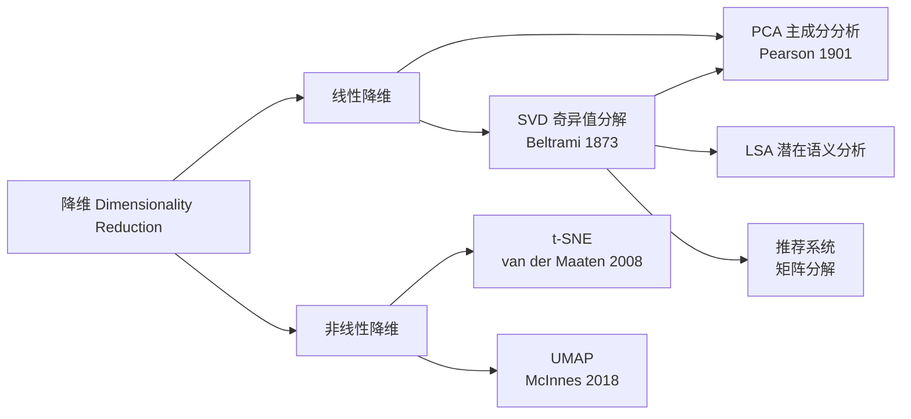

# PCA / SVD

## 知识地图



## 前置知识

- **线性代数基础**：特征值 (Eigenvalue) 与特征向量 (Eigenvector)、矩阵乘法、投影、正交基、矩阵的秩。
- **方差与协方差矩阵**：$\mathbf{C} = \frac{1}{n-1}\mathbf{X}^T\mathbf{X}$，理解其对角线元素（各特征的方差）和非对角线元素（特征间的协方差）。
- **数据标准化/中心化**：PCA 对数据的尺度敏感，通常需要先标准化（均值 0、方差 1），否则方差大的特征会主导主成分方向。
- **SVD（奇异值分解）**：$\mathbf{X} = \mathbf{U}\boldsymbol{\Sigma}\mathbf{V}^T$，理解三个矩阵的维度和含义。
- **信息论基础**：理解"方差 = 信息"这一 PCA 的核心哲学——方差越大的方向包含的信息越多。

## 为什么会出现 (Why)

在高维数据中，很多特征高度相关（冗余）或完全不重要（噪声）。直接使用原始数据会带来三个问题：(1) **维度灾难**——随着维度增加，样本密度指数级下降，距离度量失效；(2) **计算开销**——特征数 $d$ 的增加导致模型训练和预测的时间/空间复杂度急剧上升；(3) **多重共线性**——高度相关的特征会导致线性模型的不稳定。PCA 的动机就是：**把高维数据投影到一个低维空间，同时尽可能多地保留原始数据的"信息"（方差）**。

## 解决什么问题 (Problem)

- **降维去噪**：保留方差最大的方向（信息）并丢弃方差最小的方向（可能是噪声）。
- **去多重共线性**：PCA 变换后的主成分彼此正交（不相关），消除了线性模型中的共线性问题。
- **可视化**：将高维数据降到 2D/3D，使得人类可以直观观察数据的结构和聚类趋势。
- **数据压缩**：用前 $k$ 个主成分近似原始矩阵，减少存储和传输开销。

## 核心思想 (Core Idea)

**PCA = 找到数据中方差最大的方向（主成分），将高维数据投影到这些方向上**——第一主成分是数据变异最大的方向，第二主成分是在与第一主成分正交的约束下方差最大的方向，以此类推。这等价于对协方差矩阵做特征值分解（或对数据矩阵做 SVD）。

PCA 寻找数据中**方差最大**的方向（主成分），将高维数据投影到这些方向上，实现降维的同时保留尽可能多的信息。

---

## 数学模型/公式

### PCA 的数学推导

给定数据中心化后的矩阵 $\mathbf{X} \in \mathbb{R}^{n \times d}$，找到投影方向 $\mathbf{w}$ 使得投影后方差最大：

$$\max_{\|\mathbf{w}\|=1} \frac{1}{n} \sum_{i=1}^{n} (\mathbf{x}_i^T \mathbf{w})^2 = \max_{\|\mathbf{w}\|=1} \mathbf{w}^T \left(\frac{1}{n}\mathbf{X}^T \mathbf{X}\right) \mathbf{w}$$

即求解协方差矩阵 $\mathbf{C} = \frac{1}{n}\mathbf{X}^T \mathbf{X}$ 的最大特征值对应的特征向量。

> **通俗解释：** 左边的式子是说：把所有数据点投影到方向 $\mathbf{w}$ 上，看投影值的方差有多大。方差大 = 数据在这个方向上"铺得开"= 包含了更多信息。右边的式子是把这个问题重写成了一个"二次型优化"：找到一个单位向量 $\mathbf{w}$，使得 $\mathbf{w}^T\mathbf{C}\mathbf{w}$ 最大。Rayleigh 商定理告诉我们，这个最大值就是 $\mathbf{C}$ 的最大特征值，对应的 $\mathbf{w}$ 就是第一主成分。

### 算法流程

1. 数据中心化：$\mathbf{X} \leftarrow \mathbf{X} - \mathbf{\mu}$
2. 计算协方差矩阵 $\mathbf{C} = \frac{1}{n-1}\mathbf{X}^T \mathbf{X}$
3. 对 $\mathbf{C}$ 进行特征值分解
4. 取前 $k$ 大特征值对应的特征向量构成投影矩阵 $\mathbf{W}_k$
5. 降维结果：$\mathbf{Z} = \mathbf{X} \mathbf{W}_k$

> **通俗解释 --- 步骤 1 中心化：** 对每个特征减去其均值。如果不做这一步，第一主成分会指向"数据中心"而非"方差最大的方向"——物理意义完全不同。中心化保证了 PCA 是"绕着数据中心旋转坐标系"。

### 通过 SVD 实现 PCA

不仅对 $\mathbf{X}^T \mathbf{X}$ 做特征分解，还可以直接对 $\mathbf{X}$ 做 SVD：

$$\mathbf{X} = \mathbf{U} \boldsymbol{\Sigma} \mathbf{V}^T$$

- $\mathbf{U}$：左奇异向量，维度 $n \times n$
- $\boldsymbol{\Sigma}$：奇异值对角矩阵
- $\mathbf{V}$：右奇异向量（即主成分方向！），维度 $d \times d$

降维结果：$\mathbf{Z} = \mathbf{U}_k \boldsymbol{\Sigma}_k = \mathbf{X} \mathbf{V}_k$

> **通俗解释 --- SVD 与 PCA 的关系：** $\mathbf{V}$ 的列就是主成分方向（即 $\mathbf{X}^T\mathbf{X}$ 的特征向量），$\boldsymbol{\Sigma}$ 的对角线元素的平方除以 $n-1$ 就是对应主成分的方差（即特征值）。所以 SVD 提供了更稳定的计算方式——直接分解 $\mathbf{X}$ 而不是先构造 $\mathbf{X}^T\mathbf{X}$（构造过程中的数值舍入误差会放大）。

### 方差解释率

第 $j$ 个主成分的方差解释比例：

$$\frac{\lambda_j}{\sum_{i=1}^{d} \lambda_i}$$

累加前 $k$ 个即可衡量保留了多少信息。

> **通俗解释：** 如果前两个主成分的方差解释率分别是 60% 和 25%，加起来是 85%，说明用这两个方向代替原始的 $d$ 个维度，只丢失了 15% 的信息。通常目标是累计 85%-95%。

---

## 算法流程图

```mermaid
graph TD
    Start[🎯 开始: 原始数据矩阵 X<br/>n 个样本, d 个特征] --> Center[📐 数据中心化:<br/>每个特征减去其均值<br/>X ← X - μ]
    Center --> CovOrSVD{选择计算方式}
    CovOrSVD -->|协方差矩阵路径| Cov[📊 计算协方差矩阵<br/>C = XᵀX / (n-1)]
    Cov --> Eig[🔢 对 C 特征值分解<br/>得到特征值 λᵢ 和特征向量 vᵢ]
    CovOrSVD -->|SVD 路径| SVD[🔢 对 X 做奇异值分解<br/>X = UΣVᵀ]
    SVD --> GetV[📌 右奇异向量 V 即主成分方向<br/>奇异值 σᵢ 的平方 ∝ λᵢ]
    Eig --> Sort[📊 将特征值/奇异值从大到小排序]
    GetV --> Sort
    Sort --> Pick[🎯 选取前 k 个最大特征值<br/>对应的特征向量 Wₖ]
    Pick --> Project[📉 投影降维:<br/>Z = X·Wₖ]
    Project --> Explain[📊 计算方差解释率:<br/>λⱼ / Σλᵢ]
    Explain --> End[✅ 输出: 降维后的数据 Z<br/>主成分方向 Wₖ<br/>方差解释率]
```

---

## 可视化展示

### 主成分方向与数据方差

在 2D 数据上做 PCA：
- **第一主成分（PC1）**：数据点投影后方差最大的方向——通常沿着数据最"长"的方向延展
- **第二主成分（PC2）**：与 PC1 正交，投影后剩余方差中最大的方向
- 投影到 PC1 上就是将 2D 数据降为 1D——损失了 PC2 方向的信息

### 方差解释率曲线（Scree Plot）

Scree Plot 中 x 轴是主成分编号（1, 2, 3, ..., d），y 轴是该主成分的方差解释率。典型的曲线是单调递减的——第一个主成分最高，之后迅速下降，后面变成一条"碎石坡"（scree）。"肘部"之前的成分保留，"碎石"部分丢弃。

---

## 最小可运行代码

### 手写 PCA（NumPy 实现）

```python
import numpy as np

class PCA:
    def __init__(self, n_components):
        self.k = n_components

    def fit_transform(self, X):
        self.mean_ = X.mean(axis=0)
        X_centered = X - self.mean_

        # SVD 方式
        U, S, Vt = np.linalg.svd(X_centered, full_matrices=False)
        self.components_ = Vt[:self.k]
        self.explained_variance_ratio_ = (S[:self.k] ** 2) / (S ** 2).sum()
        return X_centered @ self.components_.T

    def inverse_transform(self, Z):
        return Z @ self.components_ + self.mean_
```

### Scikit-learn 一行代码版本

```python
from sklearn.decomposition import PCA
from sklearn.preprocessing import StandardScaler

# 先标准化（重要！）
X_scaled = StandardScaler().fit_transform(X)

# PCA 降维
pca = PCA(n_components=0.95)  # 保留 95% 方差
X_reduced = pca.fit_transform(X_scaled)

print(f"保留 {X_reduced.shape[1]} 个主成分")
print(f"方差解释率: {pca.explained_variance_ratio_}")

# 重建（变换回原始空间）
X_reconstructed = pca.inverse_transform(X_reduced)
```

---

## SVD 的广泛用途

| 应用 | 描述 |
|------|------|
| PCA | 右奇异向量 = 主成分方向 |
| 矩阵压缩 | 保留前 $k$ 个奇异值近似原矩阵 |
| 推荐系统 | 隐语义模型 (LFM) |
| 伪逆 | $\mathbf{X}^+ = \mathbf{V}\boldsymbol{\Sigma}^{-1}\mathbf{U}^T$ |
| 潜在语义分析 (LSA) | 词-文档矩阵分解 |

---

## 工业界应用

| 场景 | 说明 | 为什么用 PCA/SVD |
|------|------|------------------|
| **量化金融** | 利率曲线建模、投资组合风险分解 | 主成分对应"平移/斜率/曲率"等可解释的市场因子 |
| **基因组学** | 人群遗传结构分析、GWAS 协变量校正 | PCA 可分离出主成分对应的人群分层信息 |
| **图像压缩** | 特征脸 (Eigenfaces) 人脸识别 | 用少量主成分近似人脸图像，大幅降低维度 |
| **推荐系统** | Netflix 矩阵分解、协同过滤 | SVD 将用户-物品矩阵分解为隐向量，发现潜在偏好 |
| **预处理管道** | 在训练 ML 模型前先降维去噪 + 去共线性 | 提高下游模型训练速度和稳定性 |

---

## 对比表格

### PCA vs t-SNE vs UMAP

| 维度 | PCA | t-SNE | UMAP |
|------|-----|-------|------|
| **降维类型** | 线性 | 非线性 | 非线性 |
| **保什么** | 全局方差（欧氏距离） | 局部邻域关系 | 局部 + 部分全局结构 |
| **速度** | 极快 $O(d^3 + nd^2)$ | 慢 $O(n^2)$ | 快（比 t-SNE 快很多） |
| **可解释性** | 主成分有明确物理含义 | 坐标无直接物理含义 | 坐标无直接物理含义 |
| **新点嵌入** | 支持（直接投影） | 不支持 | 支持（transform 方法） |
| **确定性** | 确定（给定数据，结果唯一） | 随机（每次运行可能不同） | 随机（种子可控制） |
| **主要用途** | 预处理 + 压缩 + 探索分析 | 纯可视化 | 可视化 + 下游特征 |
| **大数据的适用性** | 极好 | 差 | 好 |

---

## 学完后建议继续学习

1. **Kernel PCA**——通过核技巧将 PCA 扩展到非线性降维场景（如将数据映射到高维空间后再降维）
2. **Sparse PCA / Robust PCA**——稀疏主成分分析（让主成分只依赖于少数几个原始特征，提高可解释性）和鲁棒 PCA（对异常值不敏感）
3. **t-SNE / UMAP**——非线性降维方法，专门用于高维数据的 2D/3D 可视化
4. **Factor Analysis**——与 PCA 密切相关的概率模型，假设观测变量由少数隐含因子 + 噪声生成
5. **Independent Component Analysis (ICA)**——将信号分解为"统计独立"的分量（而非正交分量），常用于盲源分离（如"鸡尾酒会问题"）

---

## 高频面试题

### Q1: PCA 的数学原理是什么？推导一下第一主成分的方向为什么是协方差矩阵最大特征值对应的特征向量？

**标准答案：** PCA 的目标是找到一个投影方向 $\mathbf{w}$ 使得投影后的方差最大。对中心化后的数据 $\mathbf{X}$，投影方差为 $\frac{1}{n}\|\mathbf{X}\mathbf{w}\|^2 = \mathbf{w}^T(\frac{1}{n}\mathbf{X}^T\mathbf{X})\mathbf{w} = \mathbf{w}^T\mathbf{C}\mathbf{w}$，其中 $\mathbf{C}$ 为协方差矩阵。约束条件是 $\|\mathbf{w}\| = 1$。这是一个带约束的优化问题，用拉格朗日乘子法：$\mathcal{L} = \mathbf{w}^T\mathbf{C}\mathbf{w} - \lambda(\mathbf{w}^T\mathbf{w} - 1)$，求导得 $\mathbf{C}\mathbf{w} = \lambda\mathbf{w}$——即 $\mathbf{w}$ 是 $\mathbf{C}$ 的特征向量，$\lambda$ 是对应特征值。代入目标函数得 $\mathbf{w}^T\mathbf{C}\mathbf{w} = \lambda$，要最大化方差就选最大的特征值对应的特征向量。第二主成分在与第一主成分正交的约束下求解，对应第二大的特征值，依此类推。

### Q2: PCA 和 SVD 是什么关系？为什么在实践中常用 SVD 实现 PCA？

**标准答案：** SVD 将数据矩阵分解为 $\mathbf{X} = \mathbf{U}\boldsymbol{\Sigma}\mathbf{V}^T$。代入协方差矩阵：$\mathbf{C} = \frac{1}{n-1}\mathbf{X}^T\mathbf{X} = \frac{1}{n-1}\mathbf{V}\boldsymbol{\Sigma}^2\mathbf{V}^T$，这说明 $\mathbf{V}$ 的列向量就是 $\mathbf{C}$ 的特征向量（即主成分方向），而 $\boldsymbol{\Sigma}^2/(n-1)$ 就是特征值。因此对 $\mathbf{X}$ 做 SVD 等价于对 $\mathbf{C}$ 做特征分解。实践中常用 SVD 的原因是：(1) 数值稳定性更好——直接分解 $\mathbf{X}$ 避免了构造 $\mathbf{X}^T\mathbf{X}$ 过程中的舍入误差放大；(2) 效率相似或更好——无需显式计算 $d \times d$ 的协方差矩阵。当 $n \ll d$ 时还有截断 SVD 的优化版本。

### Q3: 为什么 PCA 前通常需要标准化数据？

**标准答案：** PCA 的目标是最大化方差，而方差的大小直接取决于数据的尺度。如果特征 A 的值域是 [0, 1]，特征 B 的值域是 [0, 10000]，那么特征 B 的方差天然就比特征 A 大几个数量级。不标准化，PCA 几乎一定会将第一主成分指向"方差最大的那个特征"（即特征 B），忽略其他所有特征——这完全违背了 PCA 找出"多个特征的组合方向"的本意。标准化的作用是消除量纲差异，让每个特征在 PCA 中有平等的"起始权重"。唯一的例外：如果所有特征已经是同一量纲且差异反映真实物理含义（如图像的像素值），可不标准化。

### Q4: 如何选择保留的主成分数量 k？

**标准答案：** 没有唯一答案，常用方法：
1. **方差解释率阈值法**：设定累计方差解释率阈值（如 85%、90%、95%），选择达到该阈值所需的最小 k。
2. **Scree Plot 肘部法**：画特征值下降曲线，找到"陡降"和"平缓"的拐点（肘部），拐点之前的主成分保留。
3. **Kaiser 准则**：保留特征值 > 1（即方差大于单个原始特征方差）的主成分——适用于相关矩阵的 PCA。
4. **下游任务验证**：设置不同的 k，看下游任务（分类/回归/聚类）的性能如何变化，选最佳 k。
5. **交叉验证 + 重构误差**：对不同的 k，计算重构误差（原始数据 - 降维后重建数据的差异），选误差下降不再显著的 k。

### Q5: PCA 的局限性是什么？什么情况下不应该使用 PCA？

**标准答案：** PCA 的主要局限性：
1. **只捕获线性结构**：如果数据分布在一个弯曲的流形上（如 Swiss Roll），PCA 无法有效展开，需要 Kernel PCA 或非线性方法。
2. **方差 != 信息**：在某些任务中（如分类），方差最大的方向可能与分类最相关的方向完全正交。PCA 可能丢弃掉"方差小但对下游任务至关重要的特征"。
3. **解释性有限**：主成分是原始特征的线性组合，在实践中可能难以解释（如"PC1 = 0.3 * 年龄 + 0.1 * 收入 - 0.5 * 消费..."）。
4. **对异常值敏感**：一个极端的异常点可以严重扭曲协方差矩阵，从而改变所有主成分方向。此时应使用 Robust PCA。
5. **假设高斯分布**：PCA 的最优性建立在数据服从多元高斯分布的假设上。对于非高斯数据（多模态、长尾等），PCA 的主成分可能失去统计意义。
