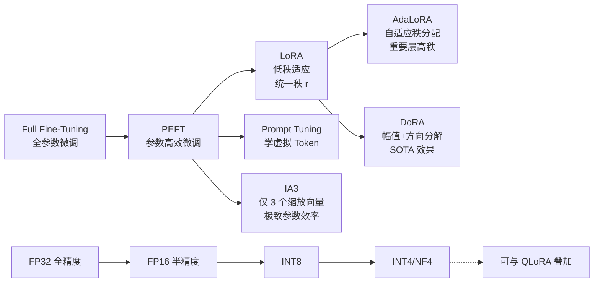
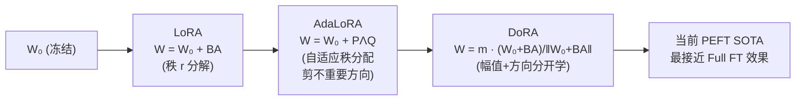
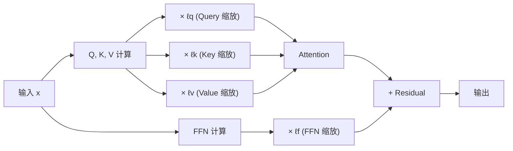

# PEFT Advanced (AdaLoRA / DoRA / IA3)

## 知识地图



## 前置知识

- **LoRA 基础**：理解低秩分解 $W = W_0 + BA$ 的原理和 $\alpha/r$ 缩放因子的含义。
- **SVD (奇异值分解)**：$M = U\Sigma V^T$，将矩阵分解为左奇异向量、奇异值、右奇异向量。AdaLoRA 直接操作这一分解形式。
- **参数范数**：L1 范数（绝对值之和）、L2 范数（欧几里得距离），用于 DoRA 的权重分解。
- **梯度敏感度**：$\partial\mathcal{L}/\partial\theta$ 衡量参数对损失的影响，AdaLoRA 用它评估奇异值重要性。

## 为什么会出现

LoRA 存在两个不足之处：

1. **所有层统一秩 r**：不同层对任务的敏感度不同，Attention 的 $Q$ 层可能需要大的修改，而 FFN 的某些层几乎不需要改动。统一 $r$ 意味着要么浪费参数在不重要的层上，要么对关键层修改不足。
2. **幅值和方向耦合**：LoRA 同时学习权重的幅值和方向变化，但研究表明这两者的学习模式不同——方向需要大幅调整，幅值可能只需微调。

这催生了两个方向的改进：**自适应秩分配**（AdaLoRA）和**幅值-方向分离**（DoRA）。同时，**IA3** 探索了极致的参数效率——不学习权重更新，只学几个缩放因子。

## 解决什么问题

在 LoRA 的基础上进一步：
1. **AdaLoRA**：在相同参数预算下，通过智能分配秩获得更好性能（+0.5-1%）
2. **DoRA**：解耦幅值和方向学习，逼近甚至超过全参数微调效果
3. **IA3**：极致减少可训练参数（<0.01%），适用于边缘设备和多任务混合

## 核心思想

**LoRA 对所有层用相同的秩 r，但不同层/矩阵对任务的重要性不同——有的需要大改动，有的只需微调。AdaLoRA 自动为重要矩阵分配更高秩（基于 SVD 奇异值大小），DoRA 将权重分解为幅值+方向分别微调，IA3 极端到每层只学 3 个缩放向量。共同方向：在不牺牲效果的前提下，进一步缩减可训练参数和显存。**

---

## 数学定义与原理解析

### AdaLoRA — 自适应秩分配

将 $\Delta W$ 写为 SVD 形式：

$$
\Delta W = P \Lambda Q, \quad \Lambda = \text{diag}(\sigma_1, \ldots, \sigma_r)
$$

其中 $P \in \mathbb{R}^{d \times r}, Q \in \mathbb{R}^{r \times k}$，$\Lambda$ 是对角矩阵存储奇异值 $\sigma_i$。

训练时根据 $\sigma_i$ 的重要性动态调整秩——不重要的奇异值被剪掉，节省的"秩预算"分配给其他层。

**重要性度量：**

$$
I(\sigma_i) = \left| \frac{\partial \mathcal{L}}{\partial \sigma_i} \cdot \sigma_i \right|
$$

**通俗解释：** 想象你要给每个层分配"修改额度"（秩预算）。在训练中，AdaLoRA 观察：改动某个方向会怎样影响最终误差？如果改一个方向的权重，loss 变化很大 → 这个方向很重要 → 保留它。如果不怎么影响 loss → 砍掉它，把省下的额度分给更需要改动的层。这就像给不同部门分配预算——哪个部门的产出对目标影响大，就多投钱。

---

### DoRA — 权重分解 (Weight-Decomposed Low-Rank Adaptation)

将预训练权重 $W_0$ 分解为**幅值 (magnitude)** $m$ 和**方向 (direction)** $V$：

$$
W = m \cdot \frac{V}{\|V\|_c}
$$

其中 $\|V\|_c$ 是逐列的 L2 范数。然后对方向部分施加 LoRA：

$$
W' = \underbrace{\|W_0\|_c \cdot (1 + \Delta m)}_{\text{幅值 Adapter}} \cdot \underbrace{\frac{W_0 + B A}{\|W_0 + B A\|_c}}_{\text{方向 LoRA}}
$$

$\Delta m$ 和 $B, A$ 都是可训练参数。

**通俗解释：** 把权重想象成一个向量——它有两个属性：指向（方向）和长短（幅值）。LoRA 把它们绑在一起学，但 DoRA 说：方向和幅值是两回事。比如，"往前走"（方向）和"走多远"（幅值）应该分开调整。DoRA 先规范化方向（变成单位向量），然后单独学习调整方向和幅值。实验证明这种分离更接近全参数微调的学习模式，效果是当前 PEFT 方法中最好的。

---

### IA3 — 极简 Adapter (Infused Adapter by Inhibiting and Amplifying Inner Activations)

只添加 3 个可学习缩放向量——Key/value 缩放 $\ell_v \in \mathbb{R}^{d_k}$、Query 缩放 $\ell_q \in \mathbb{R}^{d_k}$、FFN 缩放 $\ell_f \in \mathbb{R}^{d_{ff}}$：

$$
\text{Attention}: Q' = \ell_q \odot Q, \; K' = \ell_k \odot K, \; V' = \ell_v \odot V
$$

$$
\text{FFN}: x' = \ell_f \odot \text{FFN}(x)
$$

其中 $\odot$ 表示逐元素乘法 (Hadamard product)。

**通俗解释：** LoRA 虽然参数很少，但还是需要学习两个矩阵。IA3 问：能不能再简化？答案是不学矩阵，只学几个"开关"——每个维度一个缩放因子（1 或接近 1）。比如 Q 有 4096 个维度，就学 4096 个标量。这些标量告诉模型：这个维度的 Query 应该"放大"还是"缩小"。对 T0-3B 模型仅需 **0.24M** 可训练参数（<0.01%），比 LoRA 少了约 30 倍。

**可训练参数量**：$L \times (3d_k + d_{ff})$，对 T0-3B 仅需 0.24M 参数（<0.01%）。

---

### PEFT 方法对比

| 方法 | 可训练参数 | 额外推理开销 | 特点 |
|------|----------|------------|------|
| Full Fine-Tuning | 100% | 0 | 最优性能，最大资源需求 |
| LoRA | ~0.5% | 0 (可合并) | 低秩分解，工程成熟 |
| AdaLoRA | ~0.5% | 0 (可合并) | 自适应秩，资源利用更高效 |
| DoRA | ~0.6% | 0 (可合并) | 幅值+方向分解，SOTA 效果 |
| IA3 | <0.01% | 极低 (逐元素乘法) | 仅缩放向量，极致参数效率 |

---

## 可视化展示

### LoRA → DoRA 的演化



### IA3 工作流程



### 参数效率对比

```echarts
return {
  tooltip: { trigger: "axis", confine: true },
  title: { top: 5,  text: 'PEFT 方法可训练参数 vs 性能 (LLaMA-7B)', left: 'center', textStyle: { fontSize: 12 } },
  xAxis: { type: 'value', name: '可训练参数 (%)', min: 0, max: 1 },
  yAxis: { type: 'value', name: 'MT-Bench Score', min: 5, max: 7 },
  series: [
    { type: 'scatter', symbolSize: 16,
      data: [[0.5, 6.5], [0.6, 6.6], [0.06, 6.3], [0.01, 6.1]],
      label: { show: true, formatter: (p) => ['LoRA','DoRA','AdaLoRA','IA3'][p.dataIndex], position: 'top' }
    }
  ],
  grid: { left: 60, right: 20, top: 55, bottom: 60 }
}
```

---

## 核心代码实现

### PyTorch — IA3

```python
import torch
import torch.nn as nn

class IA3Linear(nn.Module):
    def __init__(self, linear: nn.Linear):
        super().__init__()
        self.linear = linear  # 冻结
        self.linear.weight.requires_grad = False
        # 可学习的缩放向量 (形状 = out_features)
        self.l = nn.Parameter(torch.ones(linear.out_features))

    def forward(self, x):
        # x: [batch, seq_len, in_features]
        # self.l: [out_features] -> broadcast
        return self.l * self.linear(x)


class IA3Attention(nn.Module):
    def __init__(self, dim, num_heads):
        super().__init__()
        self.dim = dim
        self.num_heads = num_heads
        self.head_dim = dim // num_heads

        self.W_q = nn.Linear(dim, dim, bias=False)
        self.W_k = nn.Linear(dim, dim, bias=False)
        self.W_v = nn.Linear(dim, dim, bias=False)

        # 冻结原始权重
        for p in [self.W_q, self.W_k, self.W_v]:
            p.weight.requires_grad = False

        # IA3 缩放向量 (每个权重矩阵一个)
        self.l_q = nn.Parameter(torch.ones(dim))
        self.l_k = nn.Parameter(torch.ones(dim))
        self.l_v = nn.Parameter(torch.ones(dim))

    def forward(self, x):
        Q = self.l_q * self.W_q(x)
        K = self.l_k * self.W_k(x)
        V = self.l_v * self.W_v(x)
        # ... 后续标准 attention 操作
        return Q, K, V
```

### PyTorch — DoRA (权重分解)

```python
class DoRALinear(nn.Module):
    def __init__(self, linear: nn.Linear, rank=8, alpha=16):
        super().__init__()
        self.linear = linear
        self.linear.weight.requires_grad = False
        in_f, out_f = linear.in_features, linear.out_features

        # LoRA 低秩矩阵 (仅在方向部分)
        self.lora_A = nn.Parameter(torch.randn(rank, in_f) * 0.01)
        self.lora_B = nn.Parameter(torch.zeros(out_f, rank))
        # 幅值适配器 (每个输出通道一个标量)
        self.magnitude = nn.Parameter(torch.ones(out_f))
        self.alpha = alpha
        self.rank = rank

    def forward(self, x):
        W0 = self.linear.weight  # [out_f, in_f]

        # 方向: W0 + LoRA 更新 → 逐行规范化
        delta = (self.lora_B @ self.lora_A) * (self.alpha / self.rank)
        W_dir = W0 + delta  # [out_f, in_f]
        W_dir_norm = W_dir / W_dir.norm(dim=1, keepdim=True)

        # 幅值: 预训练幅值 × (1 + 适配幅值)
        init_mag = W0.norm(dim=1, keepdim=True)  # [out_f, 1]
        W = init_mag * self.magnitude.unsqueeze(1) * W_dir_norm  # [out_f, in_f]

        return x @ W.T + self.linear.bias
```

---

## 工业界应用

| 公司/组织 | 技术 | 应用模型 | 场景 |
|-----------|------|----------|------|
| Meta | AdaLoRA | LLaMA 变体 | 多语言适配、RLHF 微调 |
| Google | IA3 | T0、T5 | 多任务提示微调、Few-shot |
| Microsoft | DoRA | Phi-3 微调 | 端侧部署微调 |
| NVIDIA | DoRA | Nemotron | NeMo Framework 内置支持 |
| Hugging Face | 全部 | PEFT 库 | 开源社区标准实现 |
| 学术界 | DoRA | 各种 LLM | 当前 PEFT SOTA 研究对象 |

---

## 对比表格

### AdaLoRA vs DoRA vs IA3 vs LoRA

| 维度 | LoRA | AdaLoRA | DoRA | IA3 |
|------|------|---------|------|-----|
| 可训练参数 | ~0.5% | ~0.5% | ~0.6% | <0.01% |
| 秩分配 | 固定 | 自适应 (重要层高秩) | 固定 | N/A |
| 核心机制 | 低秩分解 | SVD + 重要性剪枝 | 幅值+方向解耦 | 逐维度缩放 |
| 推理可合并 | 是 | 是 | 是 | 否 (轻量逐元素乘) |
| 性能 (vs Full FT) | -0.5~1% | -0.3~0.5% | -0.1~0.3% | -1~2% |
| 训练稳定性 | 高 | 中 (需调 SVD 相关超参) | 高 | 高 |
| 工程成熟度 | 极高 | 中 | 中高 | 高 |
| 选型建议 | 默认首选 | 同预算追求更优 | 追求最佳效果 | 极致参数效率 |

---

## 学完后建议继续学习

1. **QLoRA**：将基础模型量化为 4-bit + LoRA，单卡微调 65B 模型。
2. **VeRA (Vector-based Random Matrix Adaptation)**：进一步压缩 LoRA，共享随机矩阵仅训练缩放向量。
3. **LoRA+**：给 LoRA 的两个矩阵 A 和 B 设置不同的学习率，加速收敛。
4. **MoRA / LoRA-MoE**：将 MoE (Mixture of Experts) 思想引入 LoRA，动态选择 adapter。
5. **Model Merging (模型合并)**：多 LoRA 权重的算术合并（Task Arithmetic、TIES-Merging）。

---

## 高频面试题

### Q1: AdaLoRA 和 LoRA 的核心区别是什么？为什么自适应秩有效？

**标准答案：**

- **LoRA** 对所有层使用相同的秩 $r$，所有层的 $\Delta W$ 具有相同的"表达能力"。
- **AdaLoRA** 将 $\Delta W$ 参数化为 SVD 形式 $P\Lambda Q$，在训练中根据每个奇异值对 loss 的敏感度 $I(\sigma_i) = |\partial\mathcal{L}/\partial\sigma_i \cdot \sigma_i|$ 动态剪枝不重要的方向，节省的秩预算分配给重要层。

自适应秩有效的原因：不同 Transformer 层对任务的贡献不同。例如，底层可能学习通用特征只需少量修改，高层需要更多任务特定调整。AdaLoRA 实际上在做"结构化稀疏"，在总参数预算内最大化下游任务性能。

### Q2: DoRA 为什么能获得比 LoRA 更好的效果？

**标准答案：**

DoRA (Weight-Decomposed Low-Rank Adaptation) 将权重分解为 $W = m \cdot V/\|V\|$（幅值 + 方向），并分别学习两者的调整。这一设计的洞察来自对全参数微调学习模式的分析：

1. 全参数微调主要改变**方向**而非幅值
2. LoRA 同时改变了方向和幅值，与 Full FT 的学习模式不完全一致
3. DoRA 分离后，方向用 LoRA 更新（需要较大改变），幅值学习一个标量残差（微小调整）
4. 这种"分离 + 差异化学习"使 DoRA 的优化轨迹更接近 Full FT，因此效果更好

实验表明 DoRA 在多个基准上超过了 LoRA 和 AdaLoRA，是当前最强的 PEFT 方法之一。

### Q3: IA3 为什么参数量能做到 <0.01%？有什么局限性？

**标准答案：**

IA3 的核心设计是**不学权重矩阵，只学逐维度的缩放因子**：

- 对 Attention 的 Q/K/V：学 3 个形状为 $[d_{model}]$ 的向量，做逐元素乘法
- 对 FFN：学 1 个形状为 $[d_{ff}]$ 的向量
- 总参数量 = $L \times (3d_k + d_{ff})$，以 T0-3B 为例仅 0.24M

局限性：
1. **表达能力有限**：只能缩放已有维度，无法改变维度间的关系（不像 LoRA 的低秩矩阵能重新组合信息）
2. **不能合并到权重**：推理时需额外做逐元素乘法，虽开销小但不是零
3. **大模型才能发挥**：像 Prompt Tuning 一样，小模型下效果明显不如 LoRA
4. **难以捕获复杂变换**：对于需要改变 attention pattern 的任务表现不佳

### Q4: 如何在实际项目中选择 PEFT 方法？

**标准答案：**

选择策略按优先级排序：

1. **追求最佳效果** → DoRA（幅值+方向分解，最接近 Full FT）
2. **默认工程首选** → LoRA（稳定、成熟、生态好）
3. **同预算要更优** → AdaLoRA（自适应秩分配）
4. **极致参数效率** → IA3（<0.01% 参数，边缘设备友好）
5. **消费级 GPU 微调大模型** → QLoRA（4-bit 量化 + LoRA）

实际决策树：
- 单卡 <24GB 且模型 >7B → QLoRA + LoRA/DoRA
- 多卡 + 追求效果 → DoRA
- 多任务快速切换场景 → LoRA（合并零延迟）
- 边缘设备微调 → IA3 或 Prompt Tuning

### Q5: DoRA 的幅值学习和规范化为什么重要？

**标准答案：**

DoRA 先将权重分解为 $W = m \cdot V/\|V\|$：
- $m$（幅值）：控制权重的"长度"
- $V/\|V\|$（方向）：控制权重的"指向"（单位向量）

规范化的作用是：
1. **解除尺度的模糊性**：不规范化的话，$m$ 和 $V$ 会耦合——$V$ 变大可被 $m$ 减小抵消，两者相互干扰
2. **稳定训练**：方向始终是单位长度，梯度变化更可预测
3. **匹配 Full FT 模式**：分析显示 Full FT 中方向变化远大于幅值变化。规范化后，方向更新不受幅值约束，可以自由探索

幅值只学一个残差 $\Delta m$（接近 0），因为预训练的幅值已经不差，只需微调。这种"主攻方向、微调幅值"的策略是 DoRA 效果优于 LoRA 的关键。
