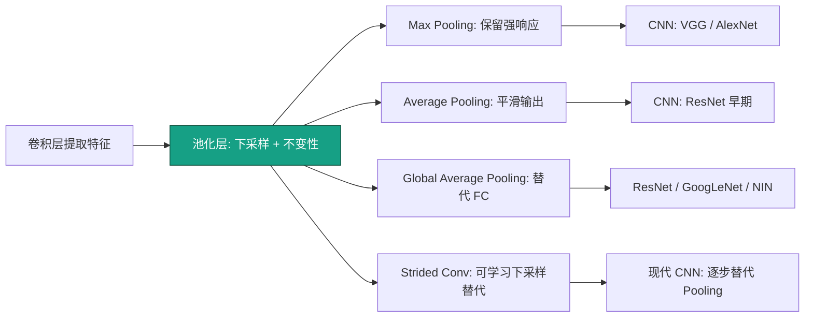
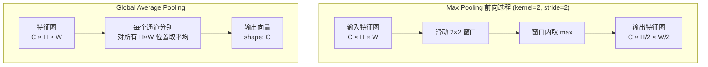

# Pooling Layers (池化层)

## 知识地图



## 前置知识

- 卷积层的基本概念（特征图、通道、空间维度 H×W）
- 下采样（降采样）的概念：减小特征图尺寸
- 平移不变性的直观理解：物体移动一点，检测结果不应剧变
- 全连接层的参数量问题（GAP 的背景）

## 为什么会出现 (Why)

卷积层提取的特征图维度很高（如 224×224 的特征图有 5 万个空间位置），如果直接传给下一层或分类器，计算量巨大且容易过拟合（每个空间位置都是特征）。同时，我们不希望网络对物体的微小位移过于敏感——猫往左移一像素，输出应该基本不变。池化层以**零参数**的简单操作同时解决了这两个问题。

## 解决什么问题 (Problem)

对特征图的每个局部窗口做聚合操作（取最大值或平均值），在降低空间维度、减小计算量的同时，赋予网络一定程度的**平移不变性**——物体稍微移动，池化后的特征依然稳定。

## 核心思想 (Core Idea)

池化层的本质是**下采样 + 局部不变性**。用一个固定窗口在特征图上滑动，每个窗口只保留最重要的信息（最大值或平均值），丢掉精确的空间位置细节，换取紧凑的特征表示和鲁棒性。

---

## 数学模型/公式

### Max Pooling（最大池化）

取窗口内最大值，保留最强响应：

$$
y_{i,j} = \max_{p,q \in [0, k-1]} x_{i \cdot s + p,\ j \cdot s + q}
$$

**通俗解释：** 拿一个 2×2 的窗口在特征图上滑动，每到一个位置只保留"喊得最大声"的那个值。如果窗口里有一个像素说"这里有猫耳朵！"（高激活值），Max Pooling 就把这个信号原封不动保留下来——"只要有人喊就好，不管是谁喊的"。这导致它非常适合保留纹理和边缘。

- 保留纹理、边缘等强信号
- 反向传播时梯度**仅通过最大值位置**回传（稀疏梯度）
- $k=2, s=2$ 实现 $2\times$ 下采样

### Average Pooling（平均池化）

取窗口内平均值，输出更平滑：

$$
y_{i,j} = \frac{1}{k^2} \sum_{p=0}^{k-1} \sum_{q=0}^{k-1} x_{i \cdot s + p,\ j \cdot s + q}
$$

**通俗解释：** 与 Max Pooling 的"只留最高分"不同，Average Pooling 是"大家都发言，最后取个平均分"。它能保留背景和整体趋势信息，但会弱化强烈的边缘信号。反向传播时梯度均匀分配给窗口内每个位置——"所有人一起承担"。

- 保留背景和全局信息
- 反向传播时梯度**均匀分配**给窗口内每个位置

### Global Average Pooling (GAP)

整个空间维度取平均，得到一个标量：

$$
y_c = \frac{1}{H \times W} \sum_{i=1}^{H} \sum_{j=1}^{W} x_{i,j,c}
$$

**通俗解释：** 把整个 H×W 的特征图压成一个数——"这个通道整体上有多活跃？"每个通道变成一个标量分数，所有通道的分数直接作为分类 logits。这完全替代了 Flatten + FC 的组合，而且每个通道的分数天然对应着"这个通道检测到的类别有多可能出现在图中"，可解释性极强。

**GAP 替代 Flatten + FC** 是 CNN 设计的重大转折：
- 参数量从 $HW \times C_{in} \times C_{out}$ 降为 **0**（无参数）
- 强制特征图与类别直接对应（可解释性强）
- 防止过拟合

### 反向传播对比

- **Max Pooling**：梯度只通过最大值位置回传——"赢者通吃"
- **Avg Pooling**：梯度均匀分配——"雨露均沾"

---

## 可视化展示

### 池化操作示意

| 3 | 1 | 2 | 5 |
|---|---|---|---|
| 4 | 8 | 1 | 3 |
| 2 | 6 | 7 | 2 |
| 1 | 3 | 4 | 9 |

$2 \times 2$ Max Pooling, stride=2 →

| 8 | 5 |
|----|----|
| 6 | 9 |

$2 \times 2$ Avg Pooling, stride=2 →

| 4.0 | 2.75 |
|------|------|
| 3.0 | 5.5  |

### Pooling vs Strided Conv 的效果对比

```echarts
return {
  xAxis: { type: 'category', data: ['MaxPool 2×2', 'AvgPool 2×2', 'Strided Conv', 'GAP'] },
  yAxis: { type: 'value', min: 0, max: 1, name: '相对得分' },
  legend: { top: 28,  data: ['可学习性', '平移不变性', '计算效率', '参数量(低=好)'] },
  series: [
    { name: '可学习性', type: 'bar', data: [0, 0, 1, 0], itemStyle: { color: '#2c3e50' } },
    { name: '平移不变性', type: 'bar', data: [0.9, 0.95, 0.6, 0.3], itemStyle: { color: '#16a085' } },
    { name: '计算效率', type: 'bar', data: [1, 1, 0.7, 1], itemStyle: { color: '#d35400' } },
    { name: '参数量(低=好)', type: 'bar', data: [1, 1, 0.3, 1], itemStyle: { color: '#2980b9' } }
  ],
  tooltip: { trigger: 'axis' },
  grid: { left: 60, right: 20, top: 40, bottom: 60 }
}
```

---

## 模型结构图



---

## 最小可运行代码

### PyTorch

```python
import torch
import torch.nn as nn

# 最大池化 — 2× 下采样（最常用）
maxpool = nn.MaxPool2d(kernel_size=2, stride=2)

# 平均池化
avgpool = nn.AvgPool2d(kernel_size=2, stride=2)

# 全局平均池化 — 将任意尺寸特征图压为 1×1
gap = nn.AdaptiveAvgPool2d((1, 1))

# 全局最大池化
gmp = nn.AdaptiveMaxPool2d((1, 1))

# 可运行测试
if __name__ == "__main__":
    x = torch.randn(4, 64, 56, 56)   # batch=4, 64 通道, 56×56
    y_max = maxpool(x)               # [4, 64, 28, 28]
    y_avg = avgpool(x)               # [4, 64, 28, 28]
    y_gap = gap(x)                   # [4, 64, 1, 1]
    print(f"Input:  {x.shape}")
    print(f"MaxPool2d (2×2): {y_max.shape}")
    print(f"AvgPool2d (2×2): {y_avg.shape}")
    print(f"GAP: {y_gap.shape}")
```

### NumPy 手写

```python
import numpy as np

def max_pool2d(x, kernel_size=2, stride=2):
    H, W = x.shape
    out_h, out_w = (H - kernel_size) // stride + 1, (W - kernel_size) // stride + 1
    out = np.zeros((out_h, out_w))
    for i in range(out_h):
        for j in range(out_w):
            ii, jj = i * stride, j * stride
            out[i, j] = np.max(x[ii:ii+kernel_size, jj:jj+kernel_size])
    return out

def avg_pool2d(x, kernel_size=2, stride=2):
    H, W = x.shape
    out_h, out_w = (H - kernel_size) // stride + 1, (W - kernel_size) // stride + 1
    out = np.zeros((out_h, out_w))
    for i in range(out_h):
        for j in range(out_w):
            ii, jj = i * stride, j * stride
            out[i, j] = np.mean(x[ii:ii+kernel_size, jj:jj+kernel_size])
    return out

def global_avg_pool(x):
    """x shape: (C, H, W) → (C,)"""
    return np.mean(x, axis=(1, 2))

# 测试
x = np.array([[3, 1, 2, 5],
              [4, 8, 1, 3],
              [2, 6, 7, 2],
              [1, 3, 4, 9]], dtype=float)
print("MaxPool:\n", max_pool2d(x))
print("AvgPool:\n", avg_pool2d(x))
```

---

## 工业界应用

| 应用领域 | 具体场景 | 为什么使用池化 |
|----------|----------|---------------|
| 图像分类 | VGG / GoogLeNet / ResNet 早期 | 逐步下采样特征图，降低全连接层参数量 |
| 目标检测 | SSD / YOLO 骨干网络 | 在多尺度特征图上检测不同大小的物体 |
| 语义分割 | FCN / U-Net | GAP 产生类别激活图（CAM），可解释性强 |
| 图像检索 | 特征聚合 | GAP 将特征图压为固定长度向量用于相似度计算 |
| 迁移学习 | 预训练模型（ImageNet） | GAP 替代 FC 使模型接受任意尺寸输入 |
| 视频分类 | 3D CNN | 3D Pooling 同时在空间和时间上下采样 |

---

## 对比表格

### 池化方法对比

| 对比维度 | Max Pooling | Average Pooling | Global Average Pooling | Strided Conv |
|----------|------------|----------------|----------------------|-------------|
| 操作 | 取最大值 | 取平均值 | 整个空间取平均 | 步长>1 的卷积 |
| 可学习参数 | 0 | 0 | 0 | $C_{in} \times C_{out} \times K^2$ |
| 平移不变性 | 强 | 最强 | 较弱（全局操作） | 弱（可学习） |
| 信息保留 | 纹理/边缘（强信号） | 背景/整体（平滑） | 通道级整体响应 | 可学习决策 |
| 计算量 | 极低 | 极低 | 极低 | 高 |
| 过拟合风险 | 低 | 低 | 最低（无参数） | 中 |
| 梯度回传 | 稀疏（仅最大值） | 均匀分配 | 均匀分配 | 常规 |
| 现代趋势 | 逐渐被替代 | 较少使用 | 广泛使用 | 成为主流下采样方式 |

### Pooling vs Strided Conv

| 对比维度 | Pooling (Max/Avg) | Strided Conv (s=2) |
|----------|------------------|-------------------|
| 可学习参数 | 0 | $C_{in} \times C_{out} \times k^2$ |
| 平移不变性 | 强 | 弱 |
| 计算量 | 低 | 高 |
| 信息损失 | 不可逆 | 可学习（保留有用信息） |
| 现代趋势 | 逐渐被替代 | 成为主流 |

现代 CNN 架构（ResNet、EfficientNet）越来越倾向于用 **stride=2 的卷积**替代池化层来下采样。

---

## 学完后建议继续学习

- [卷积层 (Conv Layer)](./conv-layer.md) —— 特征提取的核心
- [归一化方法 (BatchNorm)](./normalization.md) —— 池化前后的归一化加速收敛
- [Dropout 正则化](./dropout.md) —— GAP 后配合 Dropout 防止过拟合
- [ResNet 残差网络](./resnet.md) —— Strided Conv 替代 Pooling 的经典实践
- [CAM / Grad-CAM（类别激活图）](./cam.md) —— 利用 GAP 实现可解释性

---

## 高频面试题

**Q1: Max Pooling 的反向传播是怎么做的？梯度如何通过 Pooling 层？**

标准答案：Max Pooling 反向传播时，梯度只通过前向传播时最大值所在的位置，其他位置的梯度为 0。具体来说，前向时记录下每个窗口中最大值的位置（index），反向时将上游梯度直接放到那个位置，其他位置置零。这被称为"赢者通吃"——只有前向时最强的那个神经元获得更新的权利。Avg Pooling 反向传播则不同：上游梯度除以 $k^2$ 后均匀分配给窗口中每个位置。代码实现中 PyTorch 的 `max_pool2d_with_indices` 就是利用这个机制。

**Q2: Global Average Pooling (GAP) 为什么能替代全连接层？有什么优势？**

标准答案：GAP 将 $C \times H \times W$ 的特征图直接压成 $C$ 维向量（每通道一个标量），这个向量可以直接作为分类 logits（后接 softmax），无需 Flatten + FC。优势：(1) 参数量为 0，从根本上杜绝该层的过拟合；(2) 强制每个特征图通道与输出类别直接对应——第 k 个通道的激活图就是第 k 类的"证据热力图"，可解释性强（CAM 算法的基础）；(3) 由于没有 FC 的固定维度限制，网络可以接受任意尺寸的输入图片。最早由 NIN (Network in Network, 2013) 提出，后被 ResNet、GoogLeNet 广泛采用。

**Q3: 为什么现代 CNN 倾向于用 Strided Conv 替代 Pooling 做下采样？**

标准答案：Pooling 是无参数、无学习的固定操作——"一刀切"地丢弃信息。Strided Conv 通过步长 >1 的卷积在下采样的同时学习如何保留有用信息——"有选择地"保留。虽然增加了参数和计算量，但网络可以学习最优的下采样策略而不是硬编码的 max/avg。ResNet 中第一个 7×7 卷积 stride=2，以及后续 stage 的首个 1×1 卷积 stride=2，都是这个思路的经典实践。不过 Pooling 的平移不变性更强，某些任务中仍有价值——这里没有绝对的优劣，是 trade-off。

**Q4: Max Pooling 和 Average Pooling 分别适合什么场景？为什么？**

标准答案：Max Pooling 取局部最强响应，适合分类任务中需要保留显著特征（如边缘、纹理、物体关键点）的场景——因为分类只需要知道"有没有"某个强特征，不需要精确位置。Average Pooling 取局部平滑值，适合需要保留整体平滑信息的场景——如图像生成的 encoder、需要渐进降采样的自编码器。在最后一层，GAP（全局平均池化）比 GMP（全局最大池化）更常用于分类，因为平均值更能反映通道的整体激活水平，对噪声更鲁棒。

**Q5: 池化层的平移不变性到底是什么意思？真的是平移不变的吗？**

标准答案：池化层的"平移不变性"更准确地说是**局部平移不敏感性**——输入在小范围内（小于池化步长）移动时，输出变化很小甚至不变。例如 Max Pooling stride=2，物体移动一个像素可能不改变每个窗口内的最大值位置，输出完全不变。但这种不变性是有限度的——移动超过 stride 就会产生变化。这也是为什么现代方法（如 Capsule Networks）试图实现更强的等变性/不变性。另外，池化层也不保留精确的空间位置信息，这对分类不是问题，但对分割和检测则可能有害（因此 U-Net 用 skip connection 来弥补）。
