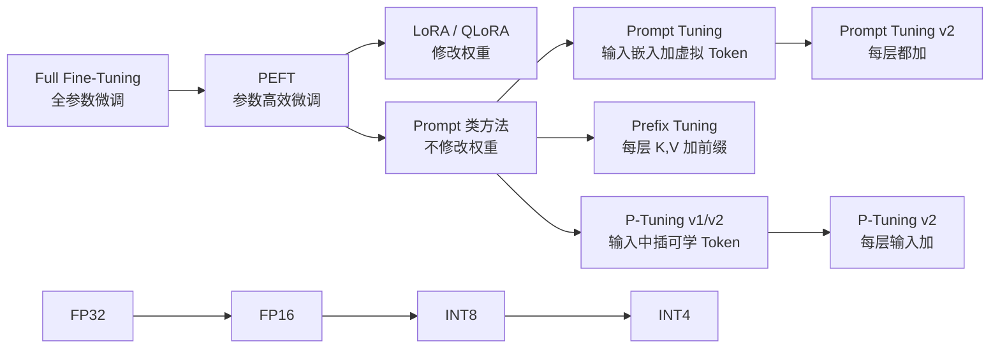
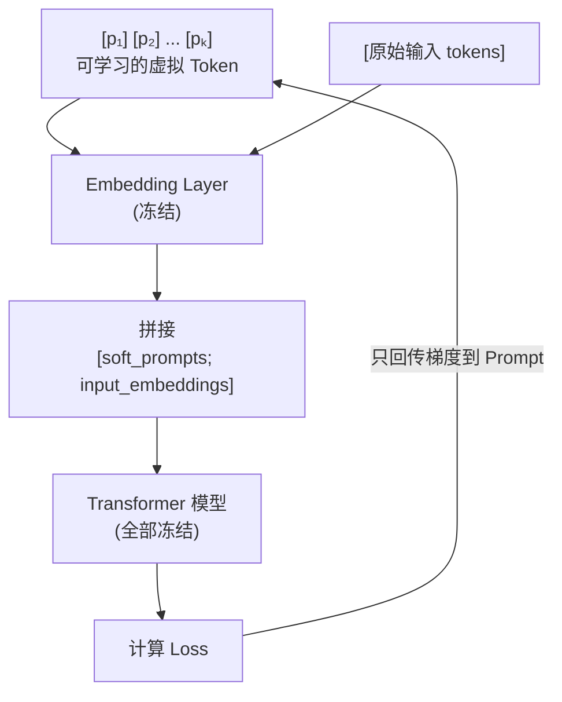
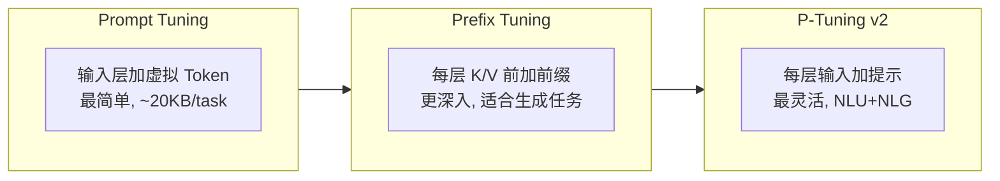

# Prompt Tuning / Prefix Tuning / P-Tuning

## 知识地图



## 前置知识

- **Tokenization 与 Embedding**：理解 token 如何通过 Embedding 层映射为向量，以及 Soft Prompt 如何作为"额外的嵌入"插入。
- **Transformer 架构**：理解 Self-Attention 中 $Q, K, V$ 的计算，以及 Prefix Tuning 在每一层拼接 Key-Value 前缀的原理。
- **Few-shot Learning**：Prompt Tuning 的灵感来自离散提示工程（如 "Translate English to French:"），将离散 token 替换为连续可学习向量。

## 为什么会出现

全参数微调和 LoRA 都需要修改模型权重。但在以下场景中存在问题：

1. **多任务服务**：为一个模型服务 1000 个任务，LoRA 需要 1000 个 adapter 文件（每个几 MB），但仍需合并权重。Prompt Tuning 只需保存 1000 个小 prompt 向量。
2. **API 黑盒场景**：使用 GPT-3 等 API 时无法修改模型权重。但可以在输入前拼接 Soft Prompt——这是唯一可行的"微调"方式。
3. **极致存储效率**：一个 Prompt 向量仅 20KB（100 tokens × 4096 dim × FP16），可以毫秒级切换任务。

## 解决什么问题

在**不修改任何模型权重**的前提下，通过添加少量可学习的"虚拟 Token"来实现任务适配：

1. 零权重修改（模型完全冻结）
2. 极致存储效率（每个任务 ~20KB）
3. 多任务毫秒级切换（只需替换 prompt 向量）
4. 适用于 API 黑盒模型（不依赖权重访问）

## 核心思想

**不修改模型权重，只在输入（或每层）添加可学习的连续向量（Soft Prompt），通过微调这些向量来引导模型的行为。**

---

## Prompt Tuning

### 数学原理

在输入 embedding 序列前拼接 $k$ 个可学习的虚拟 token 嵌入 $\mathbf{P} \in \mathbb{R}^{k \times d}$：

$$\text{input} = [\mathbf{p}_1, \mathbf{p}_2, \ldots, \mathbf{p}_k, \mathbf{x}_1, \mathbf{x}_2, \ldots, \mathbf{x}_n]$$

训练时只更新 $\mathbf{P}$，模型参数全部冻结。优化目标：

$$\min_{\mathbf{P}} \mathcal{L}(f_\theta([\mathbf{P}; \mathbf{X}]), y)$$

**通俗解释：** 传统做法是写一句提示词"请翻译成法语："。但这句提示词是离散的（人类语言），模型可能不理解。Prompt Tuning 说：不用人类语言，直接学一串"最优提示向量"。这些向量没有对应的实际单词，但它们经过训练后能最有效地引导模型输出正确结果——就像是模型的"脑机接口"，直接输入信号而非文字。

### 两个变体

- **Prompt Tuning (v1)**：只学习 Embedding 层的虚拟 token
- **Prompt Tuning v2**：每层都插入可学习向量（类似 Prefix Tuning）

### 适用场景——规模效应

- **小模型（<1B 参数）**：Prompt Tuning 效果明显不如全参数微调，甚至不如离散提示
- **大模型（>10B 参数）**：Prompt Tuning 可**接近全参数微调的效果**
- **原因**：大模型已学会足够多的通用能力，只需"触发"正确的能力方向，而不需要重新学习。小模型能力不足，仅靠触发不够。

---

## Prefix Tuning

### 数学原理

在**每一层** Transformer 的 Key 和 Value 前面拼接可学习向量：

第 $l$ 层的 Key-Value 拼接：

$$\begin{aligned}
K_l' &= [\mathbf{p}_1^K, \mathbf{p}_2^K, \ldots, \mathbf{p}_m^K, \; \text{original\_K}] \\
V_l' &= [\mathbf{p}_1^V, \mathbf{p}_2^V, \ldots, \mathbf{p}_m^V, \; \text{original\_V}]
\end{aligned}$$

其中 $\mathbf{p}_i^K, \mathbf{p}_i^V \in \mathbb{R}^{d_k}$ 是可学习的前缀向量。

**通俗解释：** 如果说 Prompt Tuning 是在"开头说一句悄悄话"，Prefix Tuning 就是在"每一层都说悄悄话"。因为 Transformer 是多层的，每层处理的信息不同——Prefix Tuning 在每一层注入 task-specific 的前缀，让浅层和深层都能接收到任务引导信号。这比只在输入层加 prompt 更强，因为影响更直接、更深层。

### 重参数化

直接优化前缀向量 $\mathbf{P}$ 不稳定（高维空间中的优化困难）。使用 MLP 重参数化：

$$\mathbf{P} = \text{MLP}_\theta(\mathbf{P}')$$

- $\mathbf{P}'$ 是更小的"潜在"前缀矩阵
- $\text{MLP}_\theta$ 是一个小型前馈网络
- 训练时优化 $\mathbf{P}'$ 和 $\theta$，训练完成后**只保存 $\mathbf{P}$**（丢弃 MLP）

**通俗解释：** 直接在 4096 维空间中优化前缀向量容易跑到奇怪的局部最优。用 MLP 当"翻译官"——先在一个更小的空间（如 512 维）中优化 $\mathbf{P}'$，然后通过 MLP 投影到 4096 维。完成后，MLP 翻译官退休，只保留最终的翻译结果 $\mathbf{P}$。

---

## P-Tuning v1 / v2

### P-Tuning v1

针对自然语言理解 (NLU) 任务，在输入嵌入中插入可学习的 prompt tokens，并增加 **LSTM 或 MLP 编码器**对 prompt 进行编码：

$$\mathbf{h}_i = \text{LSTM}(\mathbf{p}_1, \ldots, \mathbf{p}_k)_i$$

**通俗解释：** P-Tuning v1 比 Prompt Tuning 多了一个小型编码器（LSTM）。原因是直接的软提示 token 之间缺乏"关联性"——而离散的提示词之间有语法关系。LSTM 给软提示 token 建立顺序依赖，让它们更像"连续的句子"。

### P-Tuning v2

将所有层的输入中加入可学习的连续提示向量（不再限于嵌入层），深度上匹配 Prefix Tuning，但不限于 KV 位置：

$$\mathbf{h}_l' = [\mathbf{p}_l^1, \ldots, \mathbf{p}_l^m, \; \mathbf{h}_l]$$

**通俗解释：** P-Tuning v1 只在第一层加 prompt，但发现不够——深层得不到直接的任务指导。P-Tuning v2 搬到每一层都加，就像给每层"打个标签"。这比 Prefix Tuning 更灵活——不限于 Key 和 Value 位置，可以插在任何地方。

---

## 可视化展示

### Prompt Tuning 流程



### 三种方法对比



---

## 最小可运行代码

```python
from transformers import AutoModelForCausalLM, AutoTokenizer
from peft import PromptTuningConfig, PrefixTuningConfig, get_peft_model, TaskType

model_name = "bigscience/bloomz-560m"
model = AutoModelForCausalLM.from_pretrained(model_name)
tokenizer = AutoTokenizer.from_pretrained(model_name)

# ===== Prompt Tuning =====
prompt_config = PromptTuningConfig(
    task_type=TaskType.CAUSAL_LM,
    num_virtual_tokens=20,           # 虚拟 token 数量
    prompt_tuning_init="TEXT",       # 从文本初始化
    prompt_tuning_init_text="Classify if the text is positive or negative:",
    tokenizer_name_or_path=model_name,
)
model_prompt = get_peft_model(model, prompt_config)
model_prompt.print_trainable_parameters()
# trainable params: 20,480 || all params: 560,214,016 || trainable%: 0.0037%

# ===== Prefix Tuning =====
prefix_config = PrefixTuningConfig(
    task_type=TaskType.CAUSAL_LM,
    num_virtual_tokens=20,           # 每层前缀长度
    prefix_projection=True,          # 使用 MLP 重参数化
)
model_prefix = get_peft_model(model, prefix_config)
model_prefix.print_trainable_parameters()
# trainable params: ~2M || all params: 560M || trainable%: ~0.36%
```

---

## 工业界应用

| 公司/组织 | 技术 | 应用模型 | 场景 |
|-----------|------|----------|------|
| Google | Prompt Tuning | T5、PaLM | 多任务 Few-shot 推理 |
| Google | Prefix Tuning | LaMDA | 对话系统、可控生成 |
| OpenAI | 类似 Soft Prompt | GPT-3 API | 用户通过 API 的嵌入级微调（推测） |
| 字节跳动 | P-Tuning v2 | 自研 LLM | NLU 任务适配 |
| 清华大学 | P-Tuning v1/v2 | GLM 系列 | NLU 和 NLG 任务 |
| 多个 AI SaaS | Prompt Tuning | 多租户模型 | 一个模型服务数千客户，每客户仅存 ~20KB |

---

## 对比表格

### Prompt 类方法全面对比

| 方法 | 插入位置 | 参数量 | 适用模型规模 | 适用任务 |
|------|----------|--------|-------------|----------|
| Prompt Tuning | 输入嵌入 | 极低 (~20KB) | >10B 效果好 | NLU + NLG |
| Prefix Tuning | 每层的 K,V | 中等 (~2MB) | 通用 | 生成任务 (NLG) |
| P-Tuning v1 | 输入嵌入 + LSTM | 中等 | 通用 | NLU 任务 |
| P-Tuning v2 | 每层输入 | 中等 (~2MB) | 通用 | NLU + NLG |
| LoRA | 权重更新 (合并) | 中等 (~8MB) | 通用 | 通用 |

### Prompt 类方法 vs LoRA

| 维度 | Prompt Tuning | Prefix Tuning | LoRA |
|------|--------------|---------------|------|
| 修改权重 | 否 | 否 | 是（推理时可合并） |
| 存储 / 任务 | ~20KB | ~2MB | ~8MB |
| 模型规模要求 | >10B 最佳 | 通用 | 通用 |
| 适用场景 | 多任务切换、API 模型 | 生成任务 | 追求最佳效果 |
| 推理延迟 | 微小（序列稍长） | 微小（序列稍长） | 0（合并后） |
| 实现复杂度 | 极低 | 低 | 中等 |
| 性能上限 | 中大模型接近 FT | 接近 FT | 最接近 FT |

---

## 学完后建议继续学习

1. **LoRA / QLoRA**：修改权重的 PEFT 方法，效果更优，与 Prompt 类互补。
2. **In-Context Learning (上下文学习)**：不训练任何参数，仅通过 Few-shot 示例激活模型能力。
3. **Soft Prompt Transfer**：一种 prompt 在任务间迁移的技术。
4. **Multi-task Prompt Tuning**：学习一个共享 prompt + 任务特定 prompt。
5. **Adapter-based PEFT**：在层间插入小型可训练网络（比 Prompt 类更早的 PEFT 方法）。

---

## 高频面试题

### Q1: Prompt Tuning 和 Prefix Tuning 的核心区别是什么？

**标准答案：**

- **Prompt Tuning** 只在输入 Embedding 层添加虚拟 token，相当于在"输入层面"做引导。实现简单，参数量极少（~20KB/task），但只在较大模型（>10B）上效果好。
- **Prefix Tuning** 在每一层 Transformer 的 Key 和 Value 前拼接可学习向量，影响模型的"每一层计算"。参数量较多（~2MB/task），但深度影响让它在各种规模的模型上都有不错效果。

本质区别在于**影响的深度**：Prompt Tuning 是浅层引导（信号需通过多层传播），Prefix Tuning 是深层注入（每层直接接收任务信号）。

### Q2: 为什么 Prompt Tuning 在大模型上效果好，小模型上差？

**标准答案：**

这被称为 Prompt Tuning 的**规模效应 (Scale Effect)**：

1. **大模型的能力储备充裕**：10B+ 的模型在预训练阶段已学会大量通用能力。Prompt Tuning 本质上是在"触发"或"选择"正确的能力方向，而不需要教会模型新能力。几个虚拟 token 足以完成这个触发。
2. **小模型的能力不足**：<1B 的模型本身能力有限，仅靠"触发"不够——需要真正调整模型参数才能适应下游任务。
3. **容量瓶颈**：小模型的 Embedding 维度较小，虚拟 token 的表达能力受限。

实验数据：在 SuperGLUE 上，T5-Small (60M) 的 Prompt Tuning 比 Full FT 差 20%+，而 T5-11B 的差距在 1% 以内。

### Q3: Prefix Tuning 的重参数化 (reparameterization) 解决什么问题？

**标准答案：**

直接用梯度优化高维前缀向量 $\mathbf{P}$ 存在**优化不稳定性**问题：
- 前缀向量维度高（如 4096），直接优化容易陷入局部最优
- 梯度在高维空间中可能非常嘈杂

重参数化方案 $\mathbf{P} = \text{MLP}_\theta(\mathbf{P}')$ 的解决方式：
1. 在一个**更低维的潜在空间**中优化 $\mathbf{P}'$（如 512 维而不是 4096 维）
2. MLP 充当正则化器，约束前缀向量位于一个平滑的流形上
3. 训练完成后，只保留最终的前缀向量 $\mathbf{P}$，丢弃 MLP——推理时零额外开销

这类似于 LoRA 的低秩分解思想——在低维空间中学习，然后投影回高维。

### Q4: Prompt Tuning 和 In-Context Learning 有什么区别？各自适用什么场景？

**标准答案：**

- **In-Context Learning (ICL)**：在推理时提供 Few-shot 示例（离散 token），不修改任何参数。适用于 API 调用、快速实验、无训练场景。
- **Prompt Tuning**：训练可学习的连续 Soft Prompt 向量，需要反向传播但参数量极小。适用于有标注数据、需要稳定效果的生产场景。

关键对比：
| | ICL | Prompt Tuning |
|------|-----|---------------|
| 训练 | 不需要 | 需要（仅更新 prompt） |
| 效果 | 受 prompt 模板影响大 | 稳定、可复现 |
| token 消耗 | 每次推理消耗 Few-shot 示例 | 仅消耗 prompt token |
| 灵活性 | 极高（随时改 prompt） | 固定（需重新训练） |
| 存储 | 无 | ~20KB/task |

### Q5: 如果让你在一个生产系统中为 1000 个租户各自微调模型，你会选择哪种 PEFT 方法？

**标准答案：**

首选 **Prompt Tuning**，原因：

1. **存储效率**：1000 个租户，每个 20KB = 总共 20MB。LoRA 需要 8GB（每任务 8MB × 1000）。
2. **切换效率**：Prompt 向量替换是毫秒级的张量操作（concat 替换），无需修改模型权重。
3. **隔离性**：每个租户的 prompt 完全独立，不会互相干扰。
4. **服务架构简单**：单模型实例 + 按请求动态选择 prompt（一个 GPU 服务所有租户）。

如果对效果要求极高（接近 Full FT），且租户数较少（<10），可选 DoRA 或 LoRA。如果模型 <1B，Prompt Tuning 效果不佳，改用 LoRA。
