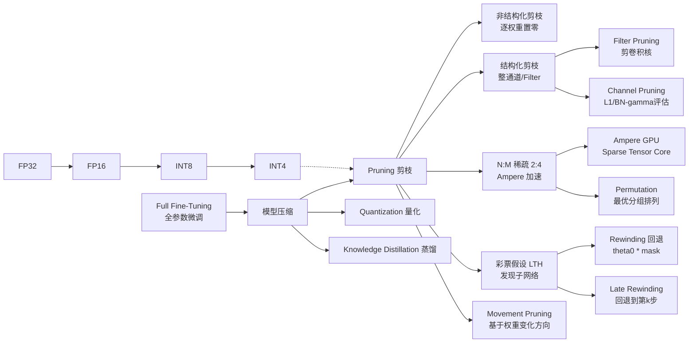
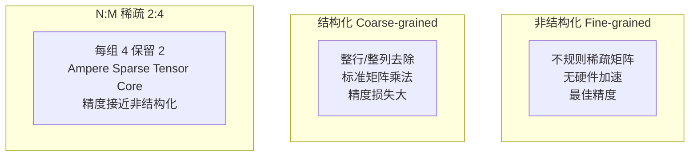
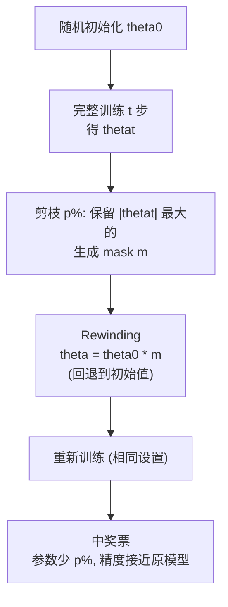
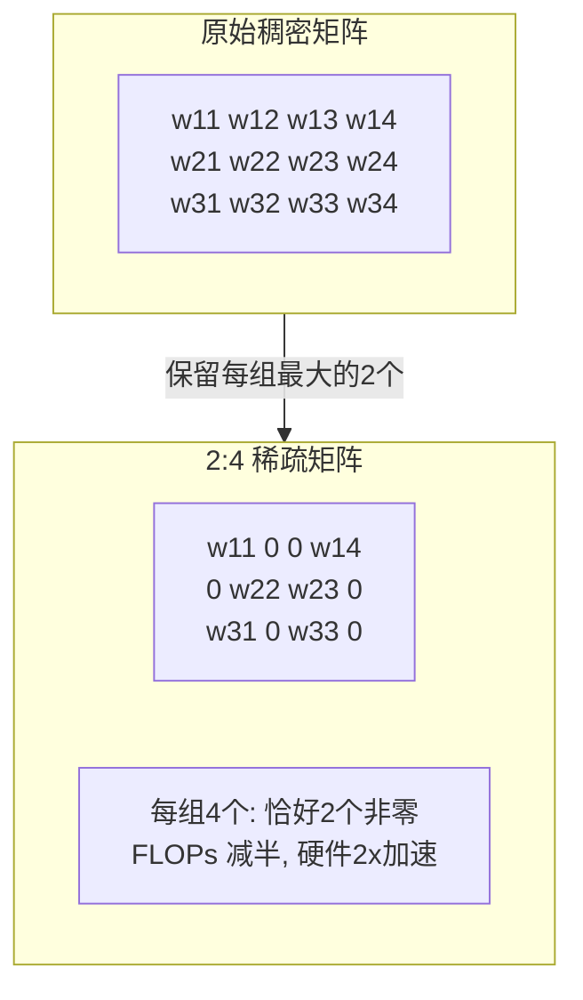

# Advanced Pruning (彩票假设 / 结构化剪枝 / N:M 稀疏)

## 知识地图



## 前置知识

- **基础剪枝概念**：理解非结构化 vs 结构化剪枝的区别，Magnitude-based pruning 的基本原理（参见 pruning.md）
- **Lottery Ticket Hypothesis 论文**：Frankle & Carbin (ICLR 2019) 的原论文核心主张
- **Batch Normalization**：BN 层的 $\gamma$ 参数与通道重要性的关系，Network Slimming 方法
- **GPU 架构基础**：理解 Tensor Core 对矩阵形状的要求（如 2:4 稀疏要求的排列约束）
- **优化理论**：理解损失函数的局部最优、Hessian 矩阵及其在重要性评估中的作用
- **梯度计算与反向传播**：理解 $\nabla_w \mathcal{L}$ 的含义

## 为什么会出现 (Why)

基础剪枝方法有三类不足：

1. **Magnitude pruning 忽略了权重动态**：一个小权重如果正在快速增长（梯度大），可能是重要的。纯幅度无法捕捉这个信号。
2. **非结构化稀疏无法硬件加速**：不规则稀疏矩阵在 GPU 上效率低，无法使用标准稠密矩阵乘法。
3. **剪枝不等于压缩**：理论 90% 稀疏率不等于 10x 加速——取决于稀疏模式是否对齐硬件能力。NVIDIA Ampere GPU 首次在硬件上原生支持 2:4 稀疏模式——每组 4 个值保留 2 个，实现确定性 2x 加速。

这催生了三个方向：**更好的重要性评估**（Movement Pruning）、**硬件对齐的稀疏模式**（N:M 稀疏）、以及 **LTH 对剪枝本质的重新理解**（从"去冗余"到"找子网络"）。

## 解决什么问题 (Problem)

1. **LTH**：解释为什么剪枝可行——不是为了去掉"无用的"，而是找到"本身就足够强的"子网络
2. **结构化剪枝 (Filter/Channel Pruning)**：使剪枝后的模型可以直接用标准硬件加速（非理论加速），直接删除整个通道/滤波器
3. **N:M 稀疏**：在非结构化精度和结构化加速之间取折中——固定 50% 稀疏，Ampere GPU 原生 2x 加速
4. **Movement Pruning**：让剪枝更适应微调场景（权重变化趋势比当前大小更重要）

## 核心思想 (Core Idea)

**标准剪枝按权重大小逐元素剪——精度不错但硬件不友好（稀疏模式不规则）。彩票假设给出了一个震撼的解释：大网络中存在一个"中奖子网络"，如果找到它并重新训练，可以恢复全部精度。结构化剪枝直接剪整个 channel/filter，不改变矩阵稠密性，硬件友好。N:M 稀疏（如 2:4）介于结构化和非结构化之间——每组 N 个连续权重只保留 M 个最大的，Ampere GPU 原生支持。**

---

## 数学模型/公式

### 彩票假设 (Lottery Ticket Hypothesis) — 完整推导

> 一个随机初始化的密集网络包含一个子网络，该子网络在**相同的初始化 + 独立训练**下，可以用更少的参数达到原网络的测试精度。

**正式定义：**

1. 随机初始化网络 $f(x; \theta_0)$
2. 训练 $t$ 步 → 得到参数 $\theta_t$
3. 剪枝 $p\%$ 的最小 $|\theta_t|$ → 生成二值 mask $m$（剪掉 → $m_j = 0$；保留 → $m_j = 1$）
4. **Rewinding（回退）**：将剩余权重复位到初始值 $\theta_0 \odot m$（而不是保留训练的 $\theta_t \odot m$）
5. 用相同优化设置重新训练

$$
\theta_{lottery} = \arg\min_\theta \mathcal{L}(f(x; \theta \odot m)), \quad \text{从 } \theta = \theta_0 \odot m \text{ 开始}
$$

**通俗解释：** 想象你有一大袋弹珠，随机撒在桌上。有些弹珠天生就在合适的位置（初始化就有利于任务）。训练过程就是发现"哪些弹珠和哪些组合"有效。LTH 说：如果你把那些天生好位置的弹珠挑出来，放回原位，重新来一次——它们照样能成功。Rewinding 就是把弹珠放回初始位置——证明这些弹珠不需要全量训练也能行。

**Rewinding 为什么关键：**
- 如果从 $\theta_t \odot m$（训练后的值）开始，子网络已经"享受过全网络的协作"，不是独立学习
- 从 $\theta_0 \odot m$（初始值）开始，证明子网络在初始化时就具备独立的"好结构"
- 不 rewinding 时（使用 Late Rewinding），中奖票需要训练更多步才能恢复——说明初始化和训练的交互很重要

---

### 结构化剪枝 — Filter / Channel Pruning

**Filter Pruning（卷积层）**：

剪掉第 $l$ 层卷积的一个 filter = 同时剪掉：
- 第 $l$ 层的一个输出通道
- 第 $l+1$ 层的对应输入通道

前后层参数**连锁减少**——一个 filter 被剪，几层参数一起减少。

**重要性评估方法：**

1. **L1-Norm**：$\text{importance}(F_i) = \sum |F_i|$（最简单）
2. **BN Scaling**：$\text{importance}(F_i) = |\gamma_i|$（利用 BatchNorm 的缩放因子）
3. **Taylor**：$\text{importance}(F_i) = \left|\frac{\partial \mathcal{L}}{\partial F_i} \cdot F_i\right|$（更精确）

**通俗解释：** 结构化剪枝就像把大楼的"整根柱子"拆除——不仅拆了这层的柱子，上下层连接这根柱子的部分也得同时剃掉。最终剩下一个更窄但结构完整的大楼。BN 的 $\gamma$ 值之所以能作为重要性指标——因为 BN 学到的是"这个通道的激活值应该放大还是缩小"，$\gamma$ 接近 0 意味着该通道几乎不贡献输出（BN 输出约等于 $\beta$，与输入无关）。Network Slimming 论文最早提出了用 $\gamma$ 做通道剪枝的方法。

---

### N:M 稀疏 (2:4 Sparsity)

NVIDIA Ampere (A100) 的 Sparse Tensor Core 要求：**每组 4 个连续值中恰好有 2 个非零**。

**实现算法：**

1. 将权重按 4 个一组分割
2. 每组保留绝对值最大的 2 个值，其余 2 个置零
3. 使用 **permutation（排列）** 技巧——重新排列权重行/列的顺序，让每组中的值尽可能"两极分化"（2 大 2 小），最小化置零带来的精度损失

**数学表达**：

对于权重矩阵的一行 $\mathbf{w} \in \mathbb{R}^{d}$，将其 reshape 为 $(d/4, 4)$，对每一组：

$$\mathbf{w}_{group}' = \text{Top}_2(|\mathbf{w}_{group}|) \odot \text{sign}(\mathbf{w}_{group})$$

**通俗解释：** 传统非结构化剪枝可以任意位置保留，N:M 给你加了"格式约束"——每 4 个位置必须恰好保留 2 个。这看起来更严格了，但恰好是 GPU Tensor Core 能直接加速的格式。就像填表格——每行 4 个格子，必须填 2 个空 2 个。排列技巧就是重新排列表头（维度顺序），让每行的"大值"和"小值"尽量配对，剪掉的小值损失最小。**关键**：FLOPs 减半（50% 计算），但必须使用特定排列——不是任意 50% 稀疏度都能被 Ampere Tensor Core 加速。PyTorch 2.0+ 通过 `torch.sparse.semi_structured` 原生支持。

---

### 移动剪枝 (Movement Pruning)

标准 magnitude pruning 只看权重的大小。Movement pruning 将重要性定义为"权重在训练中的变化趋势"：

$$\text{score}(w) = \left| w \cdot \nabla_w \mathcal{L} \right|$$

直觉：一个权重很小但正在快速增长 → 它可能是重要的。

**通俗解释：** 传统方法把权重比作"石头"（看大小决定要扔不扔）。Movement Pruning 把权重比作"移动的球"——不仅要看球的大小，还要看球的速度（梯度）。一个很小的球如果正在朝某个方向猛冲，说明它在"路上"，不应该被剪掉。这在微调场景下特别管用——因为预训练模型中的小权重可能在微调时承担重要角色。Movement Pruning 优于纯 magnitude 的场景：微调中某些权重在预训练阶段不大，但在下游任务中开始"发挥作用"——magnitude 会误伤它们，movement 会保护它们。

---

## 可视化展示

### 三种剪枝模式



### LTH 发现流程



### 2:4 稀疏模式示意



### 剪枝率 vs 精度

```echarts
return {
  tooltip: { trigger: "axis", confine: true },
  title: { top: 5,  text: 'ResNet-50 不同剪枝策略对比 (ImageNet)', left: 'center', textStyle: { fontSize: 12 } },
  xAxis: { type: 'value', name: '剪枝率 (%)' },
  yAxis: { type: 'value', name: 'Top-1 Accuracy Drop (%)', min: 0, max: 10 },
  legend: { top: 28,  data: ['Magnitude (非结构)', 'Channel Pruning', 'N:M (2:4)'] },
  series: [
    { name: 'Magnitude (非结构)', type: 'line', smooth: true,
      data: [[30,0.5],[50,1.0],[70,2.2],[90,5.0]],
      lineStyle: { color: '#16a085', width: 2.5 } },
    { name: 'Channel Pruning', type: 'line', smooth: true,
      data: [[30,1.5],[50,3.5],[70,7.0]],
      lineStyle: { color: '#c0392b', width: 2.5 } },
    { name: 'N:M (2:4)', type: 'line', smooth: true,
      data: [[50,0.8],[50,0.8]],
      itemStyle: { color: '#2980b9' }, lineStyle: { color: '#2980b9', width: 2.5, type: 'dashed' },
      markPoint: { data: [{ coord: [50, 0.8], label: { formatter: '固定 50%' } }] } }
  ],
  grid: { left: 60, right: 20, top: 55, bottom: 60 }
}
```

---

## 最小可运行代码

### PyTorch — 全局 Magnitude 剪枝

```python
import torch
import torch.nn.utils.prune as prune

# 非结构化全局剪枝
parameters_to_prune = [(model.conv1, 'weight'), (model.fc, 'weight')]
prune.global_unstructured(
    parameters_to_prune,
    pruning_method=prune.L1Unstructured,
    amount=0.5)

# 结构化剪枝: 剪掉整个通道 (基于 L2 范数)
def channel_prune(conv_layer, prune_ratio=0.3):
    weight = conv_layer.weight.data  # [out_c, in_c, k, k]
    l2_norm = weight.norm(p=2, dim=(1, 2, 3))  # [out_c]
    n_keep = int(weight.shape[0] * (1 - prune_ratio))
    keep_idx = torch.topk(l2_norm, n_keep).indices
    return keep_idx
```

### Lottery Ticket 寻找

```python
def find_lottery_ticket(model, train_fn, pruner, sparsity=0.8, rewinding_steps=500):
    """寻找中奖票"""
    # 保存初始状态
    init_state = {k: v.clone() for k, v in model.state_dict().items()}

    # 1. 训练 → 剪枝 → 回退 → 迭代
    for iteration in range(10):
        train_fn(model, steps=rewinding_steps)
        mask = pruner.prune(model, sparsity)
        # 回退到初始状态, 但保留 mask
        model.load_state_dict({
            k: init_state[k] * mask[k]
            for k in init_state
        })

    return model, mask
```

### N:M (2:4) 稀疏

```python
def apply_nm_sparsity(weight, n=2, m=4):
    """每组 m 个连续权重中保留最大的 n 个"""
    out_features = weight.shape[0]
    weight_abs = weight.abs()
    for i in range(0, weight.shape[1], m):
        if i + m > weight.shape[1]:
            break
        block = weight_abs[:, i:i+m]  # [out_f, m]
        # 每行找到第 n 大的值作为阈值
        threshold = torch.topk(block, n, dim=1).values[:, -1:]  # [out_f, 1]
        mask = block >= threshold
        weight[:, i:i+m] *= mask
    return weight

# PyTorch 2.0+ 原生 N:M 稀疏支持
# weight_sparse = torch.sparse.semi_structured.to_sparse_semi_structured(weight)
```

### Movement Pruning

```python
class MovementPruner:
    def __init__(self, model):
        self.model = model
        # 每个权重的累积"移动量"
        self.scores = {n: torch.zeros_like(p)
                       for n, p in model.named_parameters()}

    def update_scores(self):
        """用梯度更新 movement score"""
        for n, p in self.model.named_parameters():
            if p.grad is not None:
                # 累积: score += |w * grad_w|
                self.scores[n] += (p * p.grad).abs().detach()

    def prune(self, sparsity):
        """按累积 score 剪枝"""
        all_scores = torch.cat([s.flatten() for s in self.scores.values()])
        threshold = torch.quantile(all_scores, sparsity)
        mask = {}
        for n, p in self.model.named_parameters():
            mask[n] = (self.scores[n] >= threshold).float()
            p.data *= mask[n]
        return mask
```

---

## 工业界应用

| 公司/组织 | 技术 | 应用模型 | 场景 |
|-----------|------|----------|------|
| NVIDIA | 2:4 稀疏 (Ampere) | 通用 DL 模型 | GPU Sparse Tensor Core 推理加速 |
| NVIDIA Megatron-LM | 2:4 稀疏 | GPT-3 级别 | 2x 推理加速 (A100/H100) |
| Google | LTH + 结构化剪枝 | EfficientNet 系列 | 端侧轻量模型 |
| MIT/FAIR | LTH 理论研究 | 各种架构 | 理解过参数化的本质 |
| Meta | SparseGPT | LLaMA 系列 | LLM 一次性剪枝 50%+ |
| Intel | 结构化通道剪枝 | NLP/CV 模型 | CPU 推理加速 |
| Qualcomm | 结构化 + 量化 | 端侧 LLM | 骁龙平台本地推理 |
| Hugging Face | Movement Pruning | BERT 变体 | 下游任务微调剪枝 |
| Microsoft DeepSpeed | 结构化剪枝 + ZeRO | BERT/GPT | 压缩 3-5x |

---

## 对比表格

### 结构化剪枝 vs 非结构化剪枝 vs N:M 稀疏

| 维度 | 非结构化 | 结构化 (通道) | N:M 稀疏 (2:4) |
|------|----------|-------------|----------------|
| 粒度量 | 单个权重 | 完整通道/Filter | 连续 4 个中 2 个 |
| 精度 (50% 稀疏) | 最佳 (<1% drop) | 中等 (1-3% drop) | 好 (~0.8% drop) |
| 稀疏率上限 | 90-99% | 50-70% | 50% (固定) |
| 硬件加速 | 困难 (需 SPARSE BLAS) | 容易 (稠密 GEMM) | 原生 (Ampere Tensor Core) |
| 实际加速 (50% 稀疏) | 1-1.5x (无硬件) | ~2x | ~2x (有 Ampere) |
| 排列要求 | 无 | 无 | 有 (需 permutation) |
| 工程复杂度 | 低 | 高 (前后层耦合) | 中 (PyTorch 2.0+ 支持) |

### Movement Pruning vs Magnitude Pruning

| 维度 | Magnitude Pruning | Movement Pruning |
|------|------------------|------------------|
| 重要性度量 | $|w|$ | $|w \cdot \nabla_w L|$ |
| 考虑因素 | 权重当前大小 | 大小 + 变化趋势 |
| 适合场景 | 从头训练后剪枝 | 微调场景剪枝 |
| 计算开销 | 无（直接看权重） | 低（一次 backward） |
| "小但重要"识别 | 否（会误伤） | 是（梯度保护） |
| 论文 | Han et al. 2015 | Sanh et al. 2020 |

---

## 学完后建议继续学习

1. **SparseGPT / Wanda**：LLM 一次性剪枝（无需训练），可达到 50% 非结构化稀疏
2. **剪枝 + 量化协同 (SparseQuant)**：在稀疏性和低精度同时压缩模型
3. **稀疏训练 (Sparse Training)**：跳过"训练稠密模型再剪枝"，直接训练稀疏网络
4. **Dynamic Sparse Training**：训练过程中动态改变稀疏模式（SET, RigL）
5. **NAS + 剪枝**：用神经架构搜索自动找到最优剪枝策略

---

## 高频面试题

### Q1: 彩票假设对剪枝实践的核心启示是什么？Rewinding 步骤为什么不可省略？

**标准答案：**

彩票假设的核心启示：**剪枝不是"删除冗余"，而是"发现天生强大的子网络"**。这与传统的"过参数化 → 去冗余"范式有本质不同。

**Rewinding 步骤不可省略的原因：**

1. **消除训练的混淆效应**：如果剪枝后从 $\theta_t \odot m$ 继续训练，子网络已经"借助过全网络的协作"，不能证明子网络本身具备学习能力
2. **初始化的关键角色**：LTH 表明，初始化的随机性决定了哪些子网络是"中奖的"。Rewinding 保持了初始化的随机性，证明子网络从一开始就不同
3. **实验证据**：Frankle & Carbin (2019) 的实验显示：
   - With rewinding：子网络精度恢复至原模型
   - Without rewinding（仅微调）：精度显著下降
   - Random reinitialization（随机重新初始化）：完全失败
4. **Late Rewinding 退化**：如果训练太久再剪枝（如完整训练 epoch），回退后的子网络精度也下降——说明"中奖票"在训练早期就已确定

**实践意义**：如果可以预测哪些初始子网络是"中奖票"，就可以直接训练稀疏网络（省去稠密训练+剪枝步骤）。

### Q2: N:M 稀疏的 2:4 格式为什么能被 Ampere GPU 加速？原理是什么？

**标准答案：**

NVIDIA Ampere 架构的 Sparse Tensor Core 专门为 2:4 稀疏模式设计：

**硬件加速原理**：
1. **压缩存储**：权重矩阵以压缩格式存储——每 4 个值只存 2 个非零值 + 2-bit 索引（指示非零值的位置）
2. **结构化选择**：Tensor Core 在读取时只取非零值，跳过零值对应的乘法
3. **双倍吞吐**：因为每 4 个中恰好 2 个非零，且非零值的位置已知（索引编码），硬件可以同时处理两组来自不同权重行的非零值——FLOPs 精确减半

**为什么必须是 2:4：**
- 需要**固定模式**（每 4 个 2 个）而非任意稀疏，硬件才能设计专用数据路径
- 4 个一组的粒度在存储压缩效率和计算吞吐之间取得平衡

**排列 (Permutation) 的重要性**：
- 默认的权重顺序可能让非零值集中在某些组、其他组全零——导致精度损失更大
- Permutation 重新排列权重轴的顺序，尽量让每个 4 值组都有"明确的 2 大 2 小"，最小化剪除带来的信息损失
- 最终保存时需要保存排列索引，推理时还原

### Q3: Movement Pruning 相比 Magnitude Pruning 在什么场景下有明显优势？

**标准答案：**

Movement Pruning 在**微调场景**下优势最明显：

1. **预训练权重"小而不弱"**：预训练模型中，某些权重虽然绝对值小，但在特定下游任务中承担关键作用（如连接罕见但任务相关的特征）。Magnitude 会误伤它们，Movement 通过梯度保护它们。

2. **任务特定重组**：微调时模型需要"重新分配"重要性——一些预训练中的重要权重对下游任务可能无关紧要，反之亦然。Movement 跟踪的是"对当前任务的贡献变化"，而非固定的"历史大小"。

3. **量化证据**：Movement Pruning 被证明在以下场景优于 Magnitude：
   - 高稀疏率（>90%）：Movement 能保留小而关键的信息通路
   - NLU 任务微调：语义理解任务中很多关键信息由"小权重"承载
   - 小模型微调：模型越小，权重冗余越少，需要更精确的重要性判断

实验数据：在 BERT-base 的 SQuAD 微调中，90% 稀疏度下 Movement Pruning 比 Magnitude 高出 2-3 个 F1 点。

### Q4: 结构化剪枝中如何保证通道剪枝后前后层匹配？

**标准答案：**

通道剪枝中剪掉第 $l$ 层的一个输出通道，会影响两层：

1. **第 $l$ 层 (当前层)**：输出通道数减少 → 权重矩阵形状从 $[C_{out}, C_{in}, K, K]$ 变为 $[C_{out}-1, C_{in}, K, K]$

2. **第 $l+1$ 层 (下一层)**：该层的输入通道与上一层的输出通道对应。如果上一层减了一个输出通道，第二层的对应输入通道也必须删除。权重矩阵从 $[C_{next\_out}, C_{in}, K, K]$ 变为 $[C_{next\_out}, C_{in}-1, K, K]$

3. **Residual 连接**：如果存在残差连接（如 ResNet 的 skip connection），需要特别处理：
   - 如果残差两端通道数不同，可能需要插入 1x1 conv 对齐
   - 或者同时剪掉残差路径的两端

**实际实现步骤**：
1. 评估所有候选通道的重要性
2. 选出不重要的通道索引
3. 剪当前层的输出通道
4. 传播到下一层——删除对应的输入通道
5. 检查并修复残差连接、BN 层等依赖

这就是结构化剪枝工程复杂度高于非结构化剪枝的原因——需要处理跨层依赖。

### Q5: 如何在一个生产系统中选择剪枝策略？将剪枝、量化、知识蒸馏三者结合的最佳 Pipeline 顺序是什么？

**标准答案：**

**剪枝策略决策路径**：

1. **硬件检查**：NVIDIA A100+ → 优先 2:4 稀疏（Ampere 原生加速）；CPU/老 GPU → 结构化剪枝；无硬件加速 → 非结构化（仅压缩存储）
2. **模型类型**：CNN → 通道剪枝；LLM → SparseGPT/Wanda；Transformer 微调 → Movement Pruning
3. **精度优先 vs 压缩优先**：精度优先 → 低剪枝率 + 结构化；压缩优先 → 高剪枝率 + 非结构化 + 迭代
4. **默认推荐**：Ampere GPU → 2:4 稀疏；老 GPU/CPU → 结构化通道剪枝；LLM 快速压缩 → SparseGPT

**三者的最佳 Pipeline 顺序**：**蒸馏 → 结构化剪枝 → 非结构化剪枝 → 量化**

- **蒸馏在前**：蒸馏改变模型架构，应在任何压缩前完成。先剪枝可能移除教师传递知识依赖的结构。
- **结构化剪枝在非结构化剪枝前**：结构化剪枝改变网络结构（通道数），会破坏非结构化剪枝的稀疏模式。
- **剪枝在量化前**：量化对异常值敏感。剪枝可移除产生异常激活的通道/权重，使权重分布更紧凑，利于量化。且剪枝的稀疏性（0 或非 0）与量化的离散化不冲突。
- **量化在最后**：量化是精度最低的操作，应作为"最后一次压缩"。

典型效果：BERT-base (110M) → DistilBERT (66M) → 结构化剪枝 30% (46M) → 非结构化剪枝 20% (37M) → INT8 量化 (内存减半) → 最终约 1/6 大小，推理提升 5-8x。
