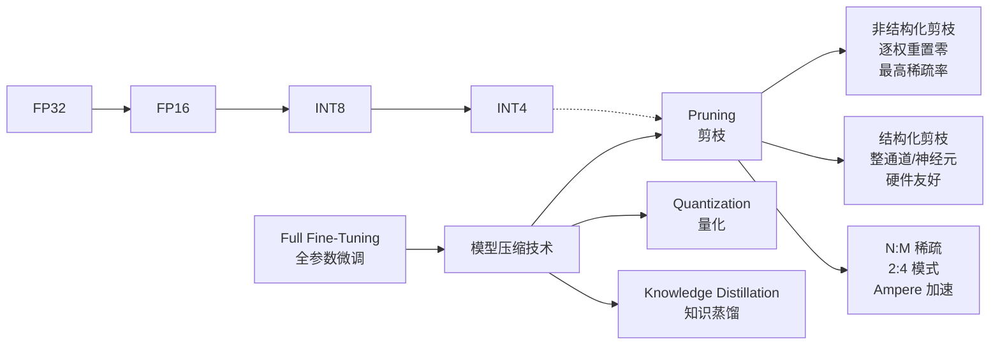
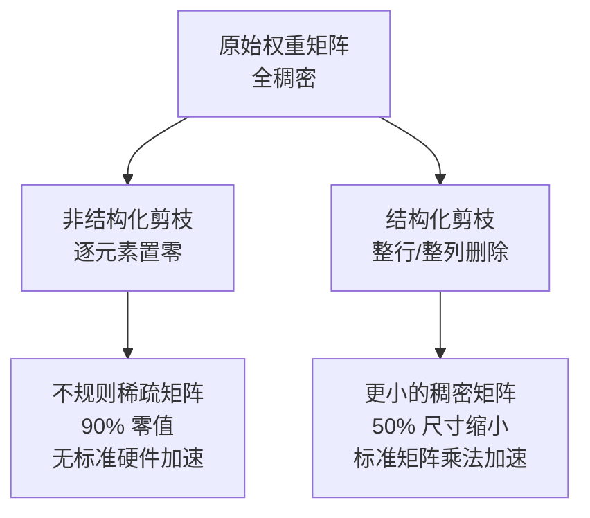
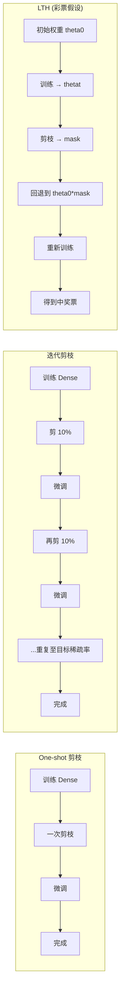
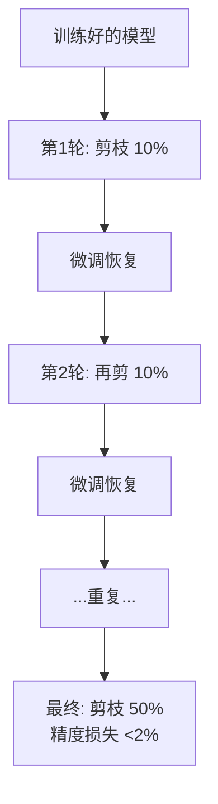

# 模型剪枝 (Pruning)

## 知识地图



## 前置知识

- **神经网络权重矩阵**：理解线性层中 $Y = XW$ 的计算，以及零值权重如何减少计算量。
- **范数 (Norm)**：L1 范数 $\sum|w_i|$（衡量总体大小）和 L2 范数 $\sqrt{\sum w_i^2}$（衡量欧几里得大小），用于评估权重重要性。
- **稀疏矩阵 (Sparse Matrix)**：大部分元素为零的矩阵。稀疏矩阵乘法可以利用跳零来加速——但需要专门的硬件/库支持（如 cuSPARSE）。
- **CNN 架构基础**：理解卷积层的 Channel/Filter/Kernel 结构，结构化剪枝主要在此场景。

## 为什么会出现 (Why)

深度学习模型普遍存在**过参数化 (Over-parameterization)** 现象：

- **ResNet-50**：25M 参数，ImageNet 分类可以剪掉 80% 参数而精度损失 <2%
- **BERT-base**：110M 参数，许多注意力头可以被移除
- **LLaMA-7B**：7B 参数，大量 FFN 神经元对大部分输入激活接近 0

训练时需要大量参数来探索解空间（避免局部最优），但推理时不需要全部——这就像盖楼时的脚手架（训练时需要）和建成后的大楼（推理时只需要结构本身）。

## 解决什么问题 (Problem)

1. **减少模型体积**：90% 稀疏率 → 10x 理论压缩（实际压缩比依赖于稀疏模式的规则性）
2. **加速推理**：减少计算量（跳零操作），但实际加速取决于硬件对稀疏性的支持
3. **降低功耗**：更少的乘法-累加操作 → 更低的能源消耗（边缘设备关键）
4. **去除冗余**：发现并移除不影响性能的神经元/通道

## 核心思想 (Core Idea)

**剪枝通过移除神经网络中不重要的权重或结构来减小模型体积和计算量，以最小的精度损失换取显著的加速和压缩。**

---

## 数学模型/公式

### 非结构化剪枝 (Unstructured Pruning)

逐权重地将"不重要"的权重置为 0，得到一个不规则稀疏矩阵：

$$M_{ij} = \begin{cases} 1 & \text{if } |W_{ij}| > \theta \\ 0 & \text{otherwise} \end{cases}, \quad W' = W \odot M$$

**通俗解释：** 非结构化剪枝就像在一本书中删掉"不重要的单词"——每个字单独判断要不要。结果是一本布满洞洞的书（稀疏矩阵）。压缩率可以极高（90%+），但阅读起来很困难——因为洞洞位置不规则，普通 GPU 无法加速这种不规则的稀疏矩阵乘法，需要专门硬件或库（cuSPARSE）。**优势**：可以达到极高稀疏率（90-99%）同时保持精度。**劣势**：需要专门的稀疏矩阵硬件/库来加速（通用 GPU 加速效果有限）。

### 结构化剪枝 (Structured Pruning)

移除整个神经元、通道或层，保持矩阵的**稠密性**（规则形状）：

**通俗解释：** 结构化剪枝就像删掉书中的"整章"——不是零散删词，而是整章整章地去掉。剩下的书虽然是更薄的书，但每一页都是完整的。因为剩下的矩阵是稠密的（没有洞），可以使用标准矩阵乘法硬件（cuBLAS）直接加速——不需要专门的稀疏硬件。**优势**：可以直接在标准硬件上加速（稠密矩阵运算）。**劣势**：稀疏率不如非结构化（粒度更粗），精度损失更大。**通道剪枝**是实际部署中最常用的方法。

```python
# 通道剪枝：删除 L1 范数小的通道
channel_importance = W.norm(dim=[1, 2, 3])  # [out_channels]
keep_idx = torch.topk(channel_importance, k=keep_channels).indices
W_pruned = W[keep_idx]  # 结果仍是稠密矩阵
```

### 基于幅度的剪枝 (Magnitude-based Pruning)

最简单有效的方法：**权重绝对值越小 → 越不重要**。

$$\text{importance}(w_i) = |w_i|$$

**通俗解释：** 如果一个权重接近 0，说明它在前向传播时几乎不贡献输出，删掉它对结果影响最小。这就像剪树枝——剪最细的枝，大树基本不受影响。

### 基于梯度的剪枝 (Gradient-based Pruning)

同时考虑权重大小和其对损失的影响：

$$\text{importance}(w_i) = \left| w_i \cdot \frac{\partial \mathcal{L}}{\partial w_i} \right|$$

**通俗解释：** 纯 magnitude 剪枝只看"当前大小"，但可能错过"小而重要"的权重。梯度信息补充了"这个权重改一点会造成多大影响"的信息。一个接近 0 但梯度很大的权重可能正在"增长中"，不应急于剪掉。这个公式本质是损失函数对权重变化的一阶泰勒近似。

### 迭代剪枝 vs 一次性剪枝

| 策略 | 方法 | 效果 | 时间成本 |
|------|------|------|----------|
| One-shot | 一次剪到位 + 微调恢复 | 较快 | 低 |
| Iterative | 剪一点 → 微调 → 重复 n 轮 | 更好 (精度更高) | 高 |

**通俗解释：** One-shot 是"一步到位"，一刀剪掉 50%，然后微调恢复。Iterative 是"温水煮青蛙"——每次剪 10%，微调恢复，重复 5 次。迭代方式的精度更高，因为模型有机会在每次小剪之后适应新的稀疏结构。

### 彩票假设 (Lottery Ticket Hypothesis)

> 一个随机初始化的稠密网络包含一个子网络（"中奖彩票"），当**使用相同的初始化权重**独立训练时，可以达到与原网络相当的测试精度。

**步骤：**
1. 随机初始化网络 $f(x; \theta_0)$
2. 正常训练 $t$ 步 → 得到 $\theta_t$
3. 剪枝 $p\%$ 的最小 $|\theta_t|$ → 生成 mask $m$
4. **关键步骤 — 回退 (Rewinding)**：将剩余权重回退到初始值 $\theta_0 \odot m$，重新训练

**通俗解释：** 大网络就像买了一大堆彩票。训练过程就像开奖——有些权重"中奖了"（对任务重要）。"彩票假设"说：中奖彩票在开奖前就已经在那里了（初始化时就注定了）。你只需要找到它们，然后用原始初始化值重新训练即可。这就是为什么步骤 4 要"回退"——用初始值重新训练，证明这个子网络本身就具备学习能力，而非训练的产物。这个假设推动了从"剪枝后微调"到"直接训练稀疏子网络"的范式转变。

### 剪枝时机

| 时机 | 方法 | 说明 |
|------|------|------|
| 训练后 | 剪枝 → 微调 | 最常用，先正常训练再压缩 |
| 训练中 | 边训练边剪枝 | 逐渐增加稀疏度，模型从零开始适应 |
| 训练前 | SNIP / GraSP | 初始化时就选好子网络，从头训练 |

### 评估指标

- **稀疏率 (Sparsity)**：零值权重占比 = zeros / total。公式：$\text{Sparsity} = \frac{\text{零权重数量}}{\text{总权重数量}}$
- **压缩比 (Compression Ratio)**：原始大小 / 压缩后大小
- **加速比 (Speedup Ratio)**：原始推理时间 / 压缩后推理时间
- **精度损失 (Accuracy Drop)**：$\text{Acc}_{original} - \text{Acc}_{pruned}$

---

## 可视化展示

### 非结构化 vs 结构化剪枝



### 剪枝流程对比



### 迭代剪枝流程



---

## 最小可运行代码

```python
import torch
import torch.nn as nn
import torch.nn.utils.prune as prune

# ===== 非结构化剪枝 =====
module = nn.Linear(512, 256)

# L1 非结构化剪枝 30%（绝对值最小的 30% 权重置零）
prune.l1_unstructured(module, name='weight', amount=0.3)

# 查看：module.weight 现在有 module.weight_mask
print(f"稀疏率: {100 * (module.weight == 0).sum().item() / module.weight.nelement():.1f}%")

# ===== 结构化剪枝 =====
# Ln 结构化: 基于 L2 范数剪掉 30% 的神经元（dim=0 是输出神经元）
module2 = nn.Linear(512, 256)
prune.ln_structured(module2, name='weight', amount=0.3, n=2, dim=0)

# ===== 通道剪枝 (手动实现) =====
def channel_prune(conv_layer, prune_ratio=0.3):
    """基于 L2 范数的通道剪枝"""
    weight = conv_layer.weight.data  # [out_c, in_c, k_h, k_w]
    l2_norm = weight.norm(p=2, dim=(1, 2, 3))  # [out_c]
    n_keep = int(weight.shape[0] * (1 - prune_ratio))
    keep_idx = torch.topk(l2_norm, n_keep).indices
    # 返回保留的通道索引
    return keep_idx

# ===== 全局非结构化剪枝 =====
parameters_to_prune = [
    (model.conv1, 'weight'),
    (model.fc, 'weight'),
]
prune.global_unstructured(
    parameters_to_prune,
    pruning_method=prune.L1Unstructured,
    amount=0.5,
)

# ===== 自定义迭代剪枝 =====
def iterative_magnitude_prune(model, prune_ratio_per_step=0.1, steps=5):
    """每次剪 10%，剪 5 轮，最终保留 (0.9)^5 ≈ 59% 的权重"""
    for step in range(steps):
        all_weights = torch.cat([
            p.data.abs().flatten()
            for n, p in model.named_parameters()
            if 'weight' in n and p.dim() > 1
        ])
        threshold = torch.quantile(all_weights, prune_ratio_per_step)
        for n, p in model.named_parameters():
            if 'weight' in n and p.dim() > 1:
                mask = p.data.abs() > threshold
                p.data *= mask
        fine_tune(model, train_loader, epochs=2)
    return model
```

---

## 工业界应用

| 公司/组织 | 技术 | 应用模型 | 场景 |
|-----------|------|----------|------|
| Google | 结构化剪枝 | MobileNet 系列 | 端侧推理 |
| NVIDIA | 2:4 稀疏 (Ampere) | 通用模型 | GPU Sparse Tensor Core |
| Apple | 结构化剪枝 + 量化 | 端侧模型 | iPhone CoreML 推理 |
| Meta | LTH + 结构化剪枝 | LLaMA 轻量变体 | 开源研究 |
| Intel | 结构化剪枝 | CV/NLP 模型 | CPU 推理加速 |
| Hugging Face | 剪枝 + 蒸馏 | 社区模型 | Transformers 轻量化 |
| 华为 | 结构化剪枝 | 盘古系列 | 端侧部署 |

---

## 对比表格

### 非结构化剪枝 vs 结构化剪枝 vs N:M 稀疏

| 维度 | 非结构化 | 结构化 (通道) | N:M 稀疏 (2:4) |
|------|----------|-------------|----------------|
| 剪枝粒度 | 单个权重 | 整个神经元/通道 | 每组 4 个保留 2 个 |
| 最大稀疏率 | 90-99% | 50-70% | 50% (固定) |
| 精度损失 (同稀疏率) | 最小 | 较大 | 中等 |
| 硬件加速 | 需专门硬件/库 (cuSPARSE) | 标准矩阵乘法 (cuBLAS) | Ampere Sparse Tensor Core |
| 实际加速比 | 低（无硬件支持时） | 高（稠密运算） | 最高 ~2x |
| 工程复杂度 | 低（仅加 mask） | 高（需处理前后层依赖） | 中（PyTorch 2.0+ 原生支持） |
| 选型建议 | 研究、极限压缩 | 实际部署首选 | NVIDIA Ampere+ GPU |

### 基于幅度 vs 基于梯度剪枝

| 维度 | Magnitude-based | Gradient-based |
|------|----------------|----------------|
| 重要性定义 | $|w|$ | $|w \cdot \nabla_w L|$ |
| 计算开销 | 极低 | 中等（需一次 backward） |
| 能发现"小而重要"的权重 | 否 | 是 |
| 适用场景 | 训练后剪枝 | 训练中/微调中剪枝 |
| 实现复杂度 | 极低 | 低 |

---

## 学完后建议继续学习

1. **彩票假设 (LTH) 深入**：理解 rewinding 步骤的重要性——为什么回退初始值才能发现"中奖彩票"。参见 pruning-advanced.md。
2. **N:M 稀疏 (2:4 Sparsity)**：NVIDIA Ampere Sparse Tensor Core 的硬件友好稀疏格式。参见 pruning-advanced.md。
3. **Movement Pruning**：为微调场景设计的剪枝——根据权重的"变化方向"而非大小决定重要性。参见 pruning-advanced.md。
4. **SparseGPT**：GPT 系列模型的一次性剪枝方法，无需微调即可剪到 50%+ 稀疏。
5. **剪枝 + 量化的协同**：稀疏性和低精度结合可以进一步压缩模型。

---

## 高频面试题

### Q1: 非结构化剪枝和结构化剪枝的核心区别？什么场景下各自适用？

**标准答案：**

| | 非结构化 | 结构化 |
|------|----------|--------|
| 操作 | 单个权重置零 | 整行/整列/整通道删除 |
| 结果 | 不规则稀疏矩阵 | 更小的稠密矩阵 |
| 稀疏率 | 可达 90-99% | 通常 50-70% |
| 硬件加速 | 需 SPARSE BLAS | 标准 GEMM (cuBLAS) |

选型决策：
- **研究/极限压缩** → 非结构化（压缩率最高）
- **生产部署** → 结构化（硬件友好，直接加速）
- **GPU Ampere+** → N:M 稀疏 2:4（折中方案，50% 稀疏 + 硬件加速）

结构化剪枝的实际加速比通常更高，因为稠密矩阵乘法是高度优化的。非结构化尽管稀疏率高，但没有硬件支持时跳零操作的开销可能抵消稀疏带来的好处。

### Q2: 为什么剪枝后需要微调 (Fine-tuning)？

**标准答案：**

剪枝操作本质上是强制将部分权重置零——这对模型是一个**扰动**。即使这些权重很小，它们的突然消失会造成：

1. **激活分布偏移**：后续层的输入分布改变（类似 Internal Covariate Shift）
2. **残差连接影响**：跳过连接中的信息流被改变
3. **梯度路径断裂**：重要的梯度传播路径可能被切断

微调的作用：
- 允许剩余权重**重新适应**新的稀疏结构
- 补偿被剪权重曾提供的微弱信号
- 调整学习到的特征表示以匹配新的容量

迭代剪枝（剪一点 → 微调 → 重复）效果更好的原因：每次给予模型时间"愈合伤口"，最终可剪掉更多参数。微调时使用比原始训练更低的学习率（1/10 到 1/100），因为剩余权重已经接近最优解。

### Q3: 彩票假设 (LTH) 的核心洞察是什么？为什么需要 rewinding？

**标准答案：**

LTH 的核心洞察：**大网络中存在一个在初始化时就已经注定成功的子网络**。这个子网络不是训练的产物，而是"天生的"——在随机初始化时就具备了独立学习的能力。

**Rewinding（回退）是关键**：剪枝后把剩余权重回退到初始值，然后从头训练。

如果不回退：
- 剪枝后的权重是在完整网络训练后的状态（已经利用了被剪参数的协作）
- 剩余权重独自从这些状态出发训练，效果可能很差——它们"不习惯"独立工作

回退的效果：
- 证明子网络**本身就具备学习能力**——用初始值也能训练出好结果
- 初始化的随机性决定了哪些子网络是"中奖彩票"
- LTH 的实践意义：如果在初始化时就能识别中奖子网络，可以直接训练稀疏网络（省去剪枝步骤）
- 实验证据：Random reinitialization（随机重新初始化剪枝后的子网络）完全失败——说明初始化的具体值很关键，不是任意初始化都能学好

### Q4: 如何衡量一个权重是否"重要"？有哪些重要性度量方法？

**标准答案：**

五种常见的权重重要性度量：

1. **Magnitude** ($|w|$)：最简单，权重绝对值越大越重要。假设小权重贡献小。
2. **Gradient × Weight** ($|w \cdot \nabla_w L|$)：同时考虑大小和梯度。小而增长中的权重会被保留。
3. **Taylor Expansion** ($|w \cdot \nabla_w L|^2$)：基于泰勒展开的二阶近似，更精确地估计"删掉这个权重造成多大损失变化"。
4. **Movement** ($|w \cdot \nabla_w L|$ during fine-tuning)：权重在微调过程中的"移动量"。即使初始很小的权重，如果微调中大幅移动，说明对任务很重要。
5. **SNIP (Single-shot Network Pruning)**：训练前，用一次梯度计算评估初始化时的连接重要性。

实践中：Magnitude 简单好用，是大多数场景的默认选择。Movement pruning 在微调场景下效果更优。

### Q5: 剪枝率、稀疏率和压缩比有什么区别？稀疏率 50% 为什么不等于推理速度提升 50%？

**标准答案：**

- **剪枝率 (Pruning Ratio)**：被移除的权重占比 = removed / total。如剪枝率 80% 表示 80% 的权重被置零。
- **稀疏率 (Sparsity Rate)**：零值权重占比 = zeros / total。如稀疏率 90% 表示 90% 的权重为零（10% 非零）。
- **压缩比 (Compression Ratio)**：原始大小 / 压缩后大小。取决于存储格式。

三者关系：剪枝率 = 稀疏率（同一件事的不同说法）。压缩比受存储格式影响，通常远小于稀疏率暗示的理论值。

**稀疏率不等于加速比的原因**：
- **非结构化剪枝**：50% 稀疏率的矩阵在 GPU 上做 GEMM 可能比稠密矩阵更慢，因为不规则的内存访问会破坏 GPU 的合并访存模式。只有在极高稀疏度（>97%）且使用专用库时才有明显加速。
- **结构化剪枝**：30% 通道剪枝确实能带来接近 30% 的 FLOPs 减少，但推理延迟减少通常小于 30%，因为一些层的开销与参数无关（如激活函数、数据搬运），且更小的矩阵不能充分填充 GPU 的 SM。
- **N:M (2:4) 稀疏**：固定 50% 稀疏度，FLOPs 精确减半，延迟减少接近 50%。这是目前软硬件协同最好的方案——NVIDIA Ampere GPU 直接在 Tensor Core 层面支持。
