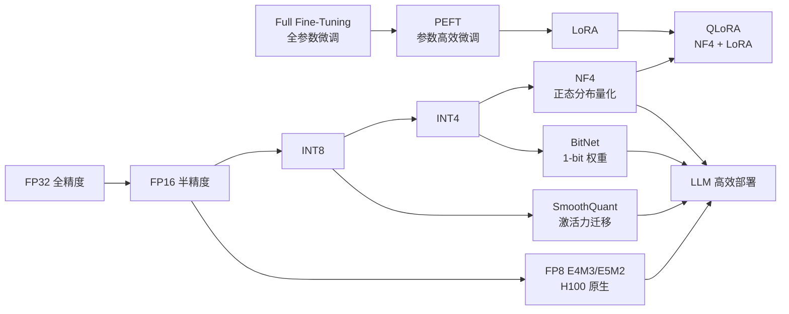
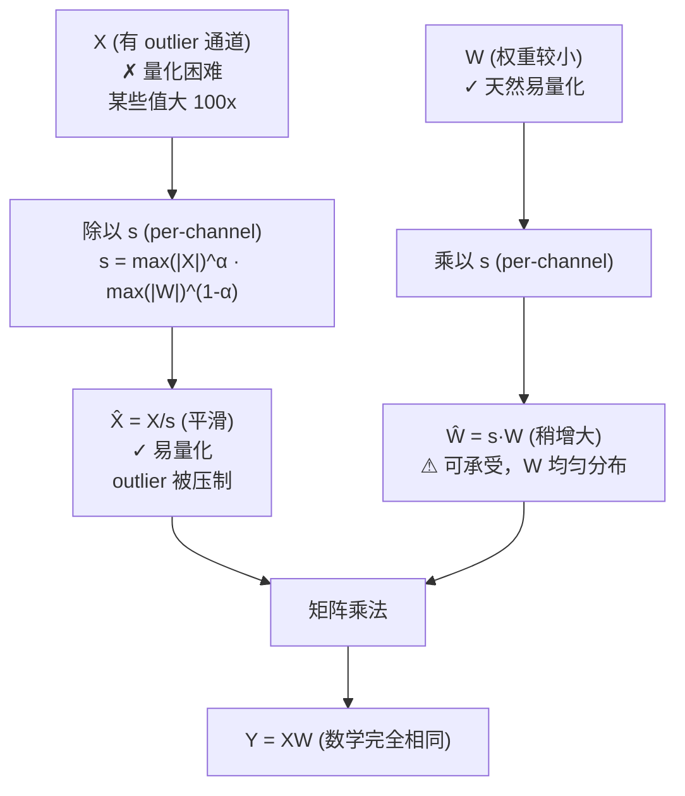

# Advanced Quantization (SmoothQuant / FP8 / NF4 / BitNet)

## 知识地图



## 前置知识

- **基础量化公式**：理解 $q = \text{round}(r/s) + z$，scale/zero point 的作用。
- **Transformer 中激活值的分布**：理解线性层中 $Y = XW$，$X$ 的某些通道可能存在极大值（outlier）。
- **正态分布与 CDF**：累计分布函数 $\Phi$ 的作用——将概率映射到分位点。
- **浮点数格式**：理解 Exponent（指数）和 Mantissa（尾数）对动态范围和精度的权衡。
- **H100 Tensor Core**：NVIDIA H100 原生支持 FP8 计算格式。

## 为什么会出现

传统量化方法（直接 INT8/INT4）在 LLM 上遇到两个严重问题：

1. **激活值 Outlier 问题**：LLM 的某些激活通道值比其他通道大 **10-100 倍**。如果用统一的 scale 量化，这些 outlier 主导了 range——大部分正常值被压缩到 1-2 个量化级别，精度完全丢失。如果逐 token 单独量化，outlier 的那几个 token 仍然质量极差。

2. **4-bit 量化信息全部丢失**：INT4 只有 16 个级别。如果数据不是均匀分布（神经网络权重近似正态分布），均匀的 16 个级别严重浪费——在数据密集区（均值附近）分辨率不够，在稀疏区（尾部）又过度分配。

这些具体问题催生了 SmoothQuant（解决 outlier）、NF4（解决正态分布量化效率）、BitNet（探索 1-bit 极限）。

## 解决什么问题

1. **SmoothQuant**：将激活 outlier 的量化难度"迁移"到权重上（权重更容易量化）
2. **NF4**：为正态分布的权重设计最优的 4-bit 量化格式
3. **FP8**：提供比 INT8 更大动态范围的硬件原生格式
4. **BitNet**：用 1-bit 权重训练 LLM，内存仅 FP16 的 1/16

## 核心思想

**传统量化方法对 LLM 不够友好——激活值中存在极端 outlier（某些通道数值比平均值大 100 倍），导致 INT8 量化直接崩溃。SmoothQuant 的洞察：将激活 outlier 的量化难度通过数学等价变换"迁移"到权重上（权重更容易量化）。FP8 是 NVIDIA H100 的硬件原生格式，比 INT8 有更大的动态范围。NF4 是 QLoRA 专门设计的 4-bit 正态分布量化。BitNet 更极端——用 1-bit 权重（±1）训练 LLM。**

---

## 数学定义与原理解析

### SmoothQuant — 激活-权重迁移

原始线性层：$\mathbf{Y} = \mathbf{X} \mathbf{W}$。

激活 $\mathbf{X}$ 的某些通道有巨大 outlier 值 → 难以量化。

SmoothQuant 引入**对角缩放矩阵** $\text{diag}(\mathbf{s})$ 进行数学等价变换：

$$
\mathbf{Y} = \mathbf{X} \mathbf{W} = \mathbf{X} \cdot \text{diag}(\mathbf{s})^{-1} \cdot \text{diag}(\mathbf{s}) \cdot \mathbf{W} = \hat{\mathbf{X}} \hat{\mathbf{W}}
$$

- $\hat{\mathbf{X}} = \mathbf{X} \cdot \text{diag}(\mathbf{s})^{-1}$：outlier 被 $\mathbf{s}$ 压制（更好量化）
- $\hat{\mathbf{W}} = \text{diag}(\mathbf{s}) \cdot \mathbf{W}$：权重吸收了缩放因子

$\mathbf{s}$ 的计算（per-channel smoothing factor）：

$$
s_j = \max(|X_j|)^\alpha \cdot \max(|W_j|)^{1-\alpha}
$$

$\alpha$ 是迁移强度（$\alpha = 0.5$ 效果最好，均衡地迁移难度）。

**通俗解释：** 激活值中的 outlier 就像一群羊里混进了几头大象。当你给所有羊称重时，秤的量程必须能容纳大象——结果大多数羊的重量只能精确到"接近大象"的粗粒度。SmoothQuant 的妙招：把大象的体重"转移"到与它对应的权重上去（数学上完全等价）。因为权重本来就像水——均匀且容易量化。迁移后，羊全是正常大小的羊（激活好量化了），水多了一点但水的总量没变（权重压力增加但可承受）。

---

### NF4 — 4-bit NormalFloat

QLoRA 发现标准 4-bit INT（均匀量化）对 LLM 权重效果不佳——因为权重近似正态分布而非均匀分布。

NF4 假设权重 $\mathbf{w} \sim \mathcal{N}(0, \sigma^2)$，将量化区间按照正态分布的**等概率分位点**设计：

$$
Q_{NF4} = \left\{q_i : \Phi(q_i) = \frac{i}{16}, \quad i = 0, 1, \ldots, 15\right\}
$$

其中 $\Phi$ 是标准正态分布的 CDF。

**通俗解释：** 正态分布的数据，大部分值扎堆在均值附近（0 附近），尾部几乎没几个值。均匀量化像均匀分布的"梯子"，每级一样宽——在 0 附近数据密集区不够精细，在尾部数据稀疏区浪费了梯级。NF4 设计一把"不等距的梯子"，在数据密集区（0 附近）梯级很密（分辨率高），在数据稀疏区梯级很宽。这 16 个梯级的位置由正态分布的等概率分位点决定——保证每个梯级被数据"踩到"的次数大致相同，从信息论角度最大化信息熵。

**信息论最优性**：对于已知分布（正态），等概率量化使每个量化值被等频率使用 → 最大化每个量化 bit 携带的信息。这就是 NF4 被称为"信息论最优"的原因。

---

### FP8 (E4M3 / E5M2)

NVIDIA H100 原生支持的两种 FP8 格式：

- **E4M3**：4 位指数 (Exponent) + 3 位尾数 (Mantissa) = 精度更高，用于前向传播
- **E5M2**：5 位指数 + 2 位尾数 = 动态范围更大，用于反向传播

| | E4M3 | E5M2 | INT8 |
|------|------|------|------|
| 动态范围 | ~2^-6 到 448 | ~2^-14 到 57344 | 固定 [-128, 127] |
| 精度 | 较高（3-bit 尾数） | 较低（2-bit 尾数） | 均匀 |
| 用途 | 前向传播 | 反向传播（梯度） | 权重存储 |

**通俗解释：** INT8 像一个固定大小的尺子——量程是确定的 [-128, 127]。FP8 像一把可以"伸缩"的尺子——指数控制尺子的"量程"（量 0.001 还是 1000），尾数控制"刻度密度"。E4M3 刻度密但量程小（适合权重和激活），E5M2 量程大但刻度粗（适合梯度，梯度可能极大或极小）。FP8 比 INT8 最大的优势是**不需要逐通道标定**——指数机制本身就提供了每个值的自适应缩放。

---

### BitNet — 1-bit 权重 + 8-bit 激活

BitNet 用 BitLinear 替代 nn.Linear，将权重二值化为 $\pm 1$：

$$
\mathbf{y} = \tilde{\mathbf{W}} \tilde{\mathbf{x}} \cdot \frac{\|\mathbf{W}\|_1}{n} \cdot \frac{\|\mathbf{x}\|_\infty}{\gamma}
$$

其中：
- $\tilde{\mathbf{W}} = \text{sign}(\mathbf{W})$：1-bit 权重（只有 ±1）
- $\tilde{\mathbf{x}}$ 被量化为 8-bit 激活
- $\frac{\|\mathbf{W}\|_1}{n}$：权重的平均绝对值，作为幅值缩放
- $\frac{\|\mathbf{x}\|_\infty}{\gamma}$：激活的无穷范数缩放

**通俗解释：** BitNet 说：与其存 16-bit 的权重值，不如只记"正"或"负"。1-bit 权重使内存为 FP16 的 **1/16**。代价是权重的幅值信息丢失——用一个标量缩放因子来补偿（所有维度的统一幅值）。就像用 +/-1 组成的旗语——信息在"符号"里，不在"大小"里。

关键优势：**权重只存储符号**，内存占用为 FP16 的 1/16（7B 模型从 14GB 降到 ~0.9GB）。

---

## 可视化展示

### SmoothQuant 核心思想



### 量化格式对比

```echarts
return {
  tooltip: { trigger: "axis", confine: true },
  title: { top: 5,  text: '量化格式对比 (LLaMA-7B)', left: 'center', textStyle: { fontSize: 12 } },
  xAxis: { type: 'category', data: ['FP16', 'INT8', 'FP8', 'INT4+NF4', 'BitNet (1.58bit)'] },
  yAxis: { type: 'value', min: 0, max: 14, name: '显存占用 (GB)' },
  series: [{
    type: 'bar',
    data: [13, 7, 7, 3.5, 1.3],
    itemStyle: { color: '#2c3e50' },
    label: { show: true, position: 'top', formatter: '{c} GB' }
  }],
  grid: { left: 60, right: 20, top: 55, bottom: 55 }
}
```

---

## 核心代码实现

### NF4 量化

```python
import torch

def create_nf4_quantization_tensor(size):
    """生成 NF4 量化级别 (16 个值, 按正态分布分位点)"""
    from scipy.stats import norm

    # 16 个等概率分位点 (offset 方法避免边界)
    offsets = torch.tensor([-0.9986, -0.9674, -0.9085, -0.8416,
                             -0.7227, -0.5557, -0.3402, -0.1200,
                             0.1200, 0.3402, 0.5557, 0.7227,
                             0.8416, 0.9085, 0.9674, 0.9986])

    # 等概率分位点 → 概率 → 正态分位点
    probs = (offsets + 1) / 2  # → [0, 1]
    levels = norm.ppf(probs.numpy())
    return torch.tensor(levels)


def nf4_quantize(weight, quant_levels):
    """将浮点权重映射到最近的 NF4 级别"""
    # 归一化到 [-1, 1]
    scale = weight.abs().max()
    w_norm = weight / scale

    # 找最近的量化级别
    w_flat = w_norm.flatten()
    distances = torch.abs(w_flat.unsqueeze(1) - quant_levels.unsqueeze(0))
    indices = distances.argmin(dim=1)
    w_quantized = quant_levels[indices].view(weight.shape) * scale
    return w_quantized, scale, indices
```

### SmoothQuant 激活尺度变换

```python
def smooth_linear(linear, x, alpha=0.5):
    """SmoothQuant: 迁移激活 outlier 难度到权重"""
    W = linear.weight.data  # [out_c, in_c]
    x_max = x.abs().max(dim=0)[0]  # [in_c]
    w_max = W.abs().max(dim=0)[0]   # [in_c]

    # 平滑因子 (α=0.5 均衡迁移)
    s = (x_max ** alpha) / (w_max ** (1 - alpha))
    s = torch.clamp(s, min=1e-5)
    s_inv = 1.0 / s

    # 应用变换 (数学等价)
    x_smoothed = x * s_inv.unsqueeze(0)   # 激活压缩 outlier
    W_smoothed = W * s.unsqueeze(0)        # 权重吸收缩放

    # 验证等价: x_smoothed @ W_smoothed.T = x @ W.T
    return x_smoothed, W_smoothed
```

### BitLinear (1-bit 权重)

```python
class BitLinear(nn.Module):
    def __init__(self, in_features, out_features, eps=1e-5):
        super().__init__()
        self.eps = eps
        self.weight = nn.Parameter(torch.empty(out_features, in_features))
        self.reset_parameters()

    def reset_parameters(self):
        nn.init.kaiming_uniform_(self.weight)

    def forward(self, x: torch.Tensor):
        # x: [B, in_f]
        # 权重二值化: ±1
        w_binarized = self.weight.sign()

        # AbsMax 量化激活到 8-bit
        gamma = x.abs().max(dim=-1, keepdim=True)[0]  # [B, 1]
        x_quantized = torch.clamp(
            x * 127 / (gamma + self.eps), -128, 127
        ).round()

        # 缩放因子: 权重 L1 均值
        beta = self.weight.abs().mean(dim=1).unsqueeze(0)  # [1, out_f]

        # BitLinear 前向
        out = (x_quantized @ w_binarized.T) * beta * gamma / 127
        return out
```

---

## 工业界应用

| 公司/组织 | 技术 | 应用模型 | 场景 |
|-----------|------|----------|------|
| NVIDIA | FP8 (H100/H200) | 通用 LLM | TensorRT-LLM 推理 |
| NVIDIA | SmoothQuant | 通用 LLM | TensorRT-LLM INT8 推理 |
| Meta / UW | QLoRA (NF4) | LLaMA 系列 | 单卡微调大模型 |
| Microsoft | BitNet | BitNet b1.58 (3B) | 极低功耗端侧推理 |
| Google | INT8 SmoothQuant | Gemma 系列 | TPU 推理优化 |
| Apple | 量化工具链 | 端侧模型 | CoreML 本地推理 |
| Mistral | GPTQ/AWQ | Mistral 系列 | 社区量化分发 |

---

## 对比表格

### SmoothQuant vs GPTQ vs AWQ

| 维度 | SmoothQuant | GPTQ | AWQ |
|------|-----------|------|-----|
| 核心问题 | 激活值 outlier | 权重量化误差累积 | 重要通道精度保护 |
| 量化对象 | 权重 + 激活 (W8A8) | 仅权重 (W4A16) | 仅权重 (W4A16) |
| 关键技术 | 数学等价变换迁移 | Hessian 逆误差补偿 | 激活感知通道缩放 |
| 是否需要校准 | 是 | 是 | 是 |
| 显存节省 | ~2x (vs FP16) | ~4x (vs FP16) | ~4x (vs FP16) |
| 工程成熟度 | 高 (TensorRT-LLM 集成) | 高 (HuggingFace 集成) | 高 (vLLM 集成) |
| 选型建议 | W8A8 推理 | W4A16 推理 | W4A16 推理（更快） |

### NF4 vs INT4 vs FP8

| 维度 | INT4 | NF4 | FP8 (E4M3) |
|------|------|-----|-------------|
| 位数 | 4 | 4 | 8 |
| 分布假设 | 均匀 | 正态 | 无需假设 |
| 量化间隔 | 均匀 | 不等距（密度匹配） | 浮点格式 |
| 动态范围 | 固定 [-8, 7] | 近似正态 [-3, 3] | 约 [-448, 448] |
| 适用场景 | 无先验时默认 | 神经网络权重（正态） | H100 推理 |
| 是否需要硬件支持 | 否 | 否 | 是 (H100+) |
| 信息效率 | 低（正态数据下） | 最高（信息论最优） | 中（尾数位有限） |

---

## 学完后建议继续学习

1. **GGUF / llama.cpp**：CPU 端 4-bit/5-bit 量化格式（K-quant），消费级硬件本地推理。
2. **AWQ / GPTQ 深入**：权重量化的具体工程实现细节。
3. **Sparsity量化**：N:M 稀疏 + 量化的协同（如 2:4 稀疏 + INT8）。
4. **MoE 量化**：Mixture of Experts 场景下的量化策略（不同 expert 不同精度）。
5. **KV Cache 量化**：LLM 推理的另一个显存瓶颈——KV cache 的量化技术。

---

## 高频面试题

### Q1: SmoothQuant 的核心思想是什么？它解决了什么问题？

**标准答案：**

SmoothQuant 解决的核心问题是 **LLM 激活值的 outlier 导致 INT8 量化失败**。

LLM 的某些激活通道值可以比平均值大 10-100 倍。如果直接 INT8 量化：
- 这些 outlier 主导了 scale（因为 $s = \max(|x|)/127$）
- 其余 90%+ 的正常值被压缩到 1-2 个量化级别，信息几乎完全丢失

SmoothQuant 的解决方案——**数学等价迁移**：
1. 引入对角矩阵 $\text{diag}(\mathbf{s})$ 做 $Y = (X \cdot \text{diag}(\mathbf{s})^{-1})(\text{diag}(\mathbf{s}) \cdot W)$
2. $\mathbf{s}$ 将激活的量化难度"迁移"到权重上（因为权重通常更易量化）
3. 数学上完全等价，不需要任何近似
4. $\alpha=0.5$ 均衡分配量化难度，实验证明效果最好

### Q2: NF4 和 INT4 在量化设计上的本质区别是什么？

**标准答案：**

| | INT4 | NF4 |
|------|------|-----|
| 设计原理 | 均匀等分范围 | 正态分布等概率分位点 |
| 间隔 | 每级等距 | 中心密、两侧疏 |
| 信息效率 | 低（正态数据下大多数级很少被用到） | 最优（每级被用到概率相等） |
| 理论依据 | 无（最简单的量化方案） | 信息论（最大化量化熵） |

NF4 的关键洞察：神经网络权重近似服从 $\mathcal{N}(0, \sigma^2)$。均匀量化在正态分布下浪费了码本——数据密集区（0 附近）不够精细，稀疏区过度分配。NF4 的等概率分位点设计保证 16 个量化级别被等频率使用，每个 bit 携带最大信息量。

这就是 QLoRA 中 4-bit 基础模型能保持与 16-bit 相当性能的关键——NF4 在 4-bit 约束下最大限度地保留了权重信息。

### Q3: FP8 和 INT8 的区别是什么？为什么 H100 选择 FP8？

**标准答案：**

FP8 由 NVIDIA 联合 ARM、Intel 在 2022 年标准化，专门为深度学习设计。与 INT8 的核心区别：

1. **动态范围**：FP8 (E4M3) 能表示约 [2^-6, 448]，而 INT8 固定 [0, 255] 或 [-128, 127]。FP8 的动态范围大得多，能同时表示很小的梯度（~10^-3）和较大的激活值（~100）。
2. **自适应缩放**：FP8 的浮点格式本身就提供"每个值各自缩放"的能力（指数控制），不需要像 INT8 那样需要逐通道标定 scale/z。
3. **硬件效率**：H100 的 FP8 Tensor Core 原生支持，无需 dequant → compute → requant 的额外步骤。

FP8 的两种变体：
- E4M3（高精度）：前向传播用，3-bit 尾数提供更高精度
- E5M2（大范围）：反向传播用，5-bit 指数覆盖梯度的大动态范围

INT8 虽然在 8-bit 约束下每个 bit 可能更高效，但需要复杂的 scale/zero point 标定。FP8 牺牲了一点 bit 效率（用了 3-5 bit 做指数），但极大简化了工程实现。

### Q4: BitNet 的 1-bit 权重训练是如何工作的？

**标准答案：**

BitNet 将权重二值化为 $\pm 1$（$W_{binary} = \text{sign}(W)$），核心机制：

1. **权重存储**：仅存储 1-bit 符号，内存为 FP16 的 1/16
2. **训练时**：权重以 FP 形式存储（用于梯度更新），但在前向传播时二值化
3. **STE (Straight-Through Estimator)**：二值化的梯度直接回传到浮点权重（$\text{sign}$ 的梯度被视为 1）
4. **幅值补偿**：用 $\|W\|_1/n$ 作为全局幅值缩放因子，补偿二值化丢失的幅值信息
5. **激活仍为 8-bit**：输入量化为 8-bit 确保前向计算仍有一定精度

BitNet b1.58 是改进版，使用三元权重 $\{-1, 0, 1\}$（1.58 来自 log2(3)），效果显著提升。

关键挑战：二值化极大地限制了模型表达能力，需要在**模型宽度**（更多维度）和**训练稳定性**上做额外工作。

### Q5: 在一个 LLM 推理系统中，你会如何选择量化策略？

**标准答案：**

决策路径：

1. **硬件检查**：
   - H100/H200 → 优先 FP8 (E4M3)（原生硬件支持，性能最佳）
   - A100 → AWQ (W4A16) 或 SmoothQuant (W8A8)
   - 消费级 GPU (<16GB) → GPTQ/AWQ (4-bit)
   - CPU → GGUF K-quant (4/5-bit)

2. **精度要求**：
   - 精度敏感任务（代码、数学） → W8A8 (SmoothQuant) 或 FP8
   - 对话/摘要等 → W4A16 (GPTQ/AWQ) 通常足够
   - 训练/微调 → NF4 (QLoRA)

3. **显存预算**：
   - 7B 模型 + >16GB GPU → W8A8 或 FP8
   - 7B 模型 + 8GB GPU → W4A16
   - 70B 模型 → W4A16 必须（否则无法单卡运行）

4. **吞吐量优先**：
   - 大 batch、高并发 → INT4/FP8（memory-bandwidth bound 场景受益最大）
   - 1 个请求、小 batch → 量化收益有限（compute-bound）

默认推荐：AWQ (W4A16) — 工程成熟度高、生态好（vLLM 原生支持）、精度损失可控。
