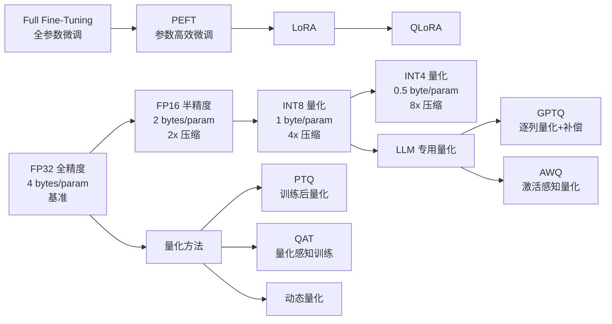
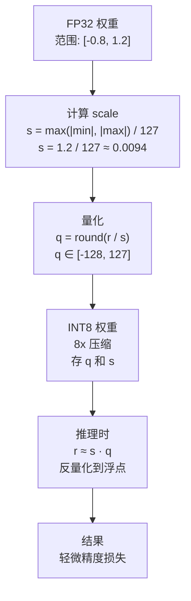
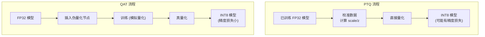

# 模型量化 (Quantization)

## 知识地图



## 前置知识

- **浮点数表示 (IEEE 754)**：理解 FP32（1 位符号 + 8 位指数 + 23 位尾数）和 FP16（1+5+10）的基本结构。
- **矩阵运算基础**：理解线性层 $Y = XW$ 的计算，以及为什么更小的数据类型能加速计算。
- **神经网络权重分布**：通常呈正态分布（钟形），大部分值集中在均值附近。
- **GPU 内存层级**：理解 HBM (高带宽显存) 容量是推理的主要瓶颈。

## 为什么会出现

大模型部署面临的核心矛盾是**显存墙 (Memory Wall)**：

- **LLaMA-2 7B**：FP32 加载需 28GB 显存（7B × 4 bytes），但消费级 GPU 通常只有 8-12GB
- **LLaMA-2 70B**：FP32 需 280GB，即便是 A100 (80GB) 也需要 4 卡
- **GPT-3 175B**：FP32 需 700GB，需要 9 张 A100 (80GB)
- 推理时，加载模型的时间远超计算时间（**Memory-bound**），压缩模型到更低精度直接减少显存占用和加载时间

量化技术的核心诉求：**用更少的 bit 表示每个参数，以最小的精度损失换取数倍的显存节省和速度提升。**

## 解决什么问题

1. **减少模型存储**：从 FP32 到 INT4，模型体积缩小 8 倍
2. **降低推理显存**：使大模型能在消费级 GPU 上运行
3. **加速推理**：更小的数据类型 → 更高的内存带宽利用率 → 更快的推理
4. **降低能耗**：低精度计算消耗更少电力

## 核心思想

**将浮点权重和激活值从高精度（FP32/FP16）映射到低精度整数（INT8/INT4），通过缩放因子 (scale) 和零点 (zero point) 建立映射关系，以可控的精度损失换取数倍的存储和计算效率。**

---

## 统一量化公式

### 数学原理

量化的两步操作——**量化 (浮点 → 整数)**和**反量化 (整数 → 浮点)**：

**量化：**
$$q = \text{round}\left(\frac{r}{s}\right) + z$$

**反量化：**
$$r = s \cdot (q - z)$$

其中：
- $r$：原始浮点值
- $q$：量化后的整数值
- $s$：缩放因子 (scale)，控制量化精度
- $z$：零点 (zero point)，$r=0$ 对应的整数值（对称量化中 $z=0$）

**通俗解释：** 把量化想象成"地图的比例尺"。浮点数就像 GPS 坐标（连续、精确但占空间大），量化后的整数就像地图上的格子编号（离散、粗粒度但紧凑）。$s$ 是比例尺（地图上 1 格 = 现实中多少米），$z$ 是"零点偏移"（原点对不对齐）。恢复时：格子编号减去零点，乘以比例尺，就还原回近似坐标。

### 对称量化 vs 非对称量化

| | 对称量化 | 非对称量化 |
|------|------|--------|
| 零点 $z$ | $z = 0$ | $z \neq 0$ |
| INT8 表示范围 | $[-127, 127]$ | $[-128, 127]$ |
| 实现复杂度 | 简单 | 略复杂 |
| 适用数据分布 | 对称分布（关于 0 对称） | 非对称分布（如 ReLU 输出的非负值） |
| 典型场景 | 权重（通常对称） | 激活值（ReLU 后 ≥ 0） |

**通俗解释：** 对称量化假设数据"正负均匀分布"（均值为 0）。非对称量化允许"歪着"映射——因为 ReLU 输出没有负数，与其把 [-128,127] 的一半浪费在负数上，不如让零点偏移到 $z=-128$（实际非对称 INT8 零点会偏移），把全部范围用在 [0,127] 上。

### 精度-准确率权衡 (Precision-Accuracy Tradeoff)

量化本质上是一种**有损压缩**。权衡关系：

- **FP32 → FP16**：精度损失几乎可以忽略（<0.1%），无损体验；通信量减半
- **FP16 → INT8**：轻微精度损失（0.1-1%），适用于模型推理；4x 压缩
- **INT8 → INT4**：中等精度损失（1-5%），大模型微调（QLoRA）可承受；8x 压缩
- **INT4 → 更低**：较大精度损失（5-10%+），需特殊技术（如 BitNet beta 的 1.58bit）

关键规律：**大模型比小模型更耐量化**——参数越多，冗余越大，量化损失越小。

---

## 量化方法

### PTQ (Post-Training Quantization) — 训练后量化

直接对训练好的模型做量化，不需要重新训练（或仅需少量校准数据计算 scale/z）：

```python
import torch.quantization as quant

# 准备
model_fp32.eval()
model_fp32.qconfig = quant.get_default_qconfig('fbgemm')
quant.prepare(model_fp32, inplace=True)

# 校准 (用少量数据计算 scale 和 zero point)
for batch in calibration_data:
    model_fp32(batch)

# 转换
model_int8 = quant.convert(model_fp32, inplace=False)
```

**通俗解释：** PTQ 就像"事后马后炮"——模型已经训练好了，拿少量数据跑一下，观察每层权重的数值范围，然后一次性决定 scale 和 zero point。优点是快（不需要训练），缺点是有量化误差累积。

### QAT (Quantization-Aware Training) — 量化感知训练

在训练过程中**模拟量化误差**（Forward 用模拟量化，Backward 用浮点梯度），让模型学会适应量化后的精度损失：

```python
model.train()
model.qconfig = quant.get_default_qat_qconfig('fbgemm')
model = quant.prepare_qat(model)

# 正常训练，但每次 Forward 都经历 "伪量化"
for epoch in range(num_epochs):
    for batch in dataloader:
        loss = model(batch)
        loss.backward()
        optimizer.step()

# 训练完成 → 转为真正 INT8
model.eval()
model = quant.convert(model)
```

**通俗解释：** QAT 就像"戴着镣铐跳舞"——训练时故意模拟量化误差（每次计算前把权重"粗糙化"再计算）。模型被迫学会在"模糊的世界"中也做对判断。训练完成后再做真量化时，模型已经习惯了这个精度，误差小得多。

### 动态量化 vs 静态量化

| | 动态量化 | 静态量化 |
|------|----------|----------|
| 量化时机 | 推理时动态计算 scale/z | 推理前用校准数据预先计算 scale/z |
| 需要校准数据 | 否 | 是 |
| 计算开销 | 推理时需动态统计（少许开销） | 推理时无额外开销 |
| 加速效果 | 中等（适合内存带宽瓶颈） | 最大（配合 INT8 kernel） |
| 常用场景 | LSTM, Transformer（权重 INT8，激活 FP16） | CNN（全部 INT8） |
| PyTorch API | `torch.quantization.quantize_dynamic` | `torch.quantization.quantize_static` |

**通俗解释：** 动态量化"边走边看"——每次推理根据实际输入算 scale；静态量化"提前量好"——用一批校准数据提前算好 scale 固定下来。静态更快但需要校准数据；动态灵活但每步有小开销。

---

## LLM 专用量化方法

### GPTQ — 逐列量化 + 误差补偿

逐列量化权重，每次量化一列后用 **Hessian 逆矩阵** 更新剩余列以补偿量化误差：

$$w_{:,j}^q = \text{quant}(w_{:,j}), \quad \delta = \frac{w_{:,j} - w_{:,j}^q}{[H^{-1}]_{jj}}$$

$$w_{:,j+1:} \leftarrow w_{:,j+1:} - \delta \cdot H_{j,j+1:}^{-1}$$

**通俗解释：** 传统量化是"一视同仁"地量化每个参数。GPTQ 的聪明之处：量化第一个参数时产生了误差 $\delta$，它不丢弃这个误差，而是把它"补偿"到剩下的还没量化的参数上。就像切蛋糕——第一刀切歪了，后面的刀调整回来，最终总量不变。$H^{-1}$ 是 Hessian 逆矩阵，编码了"所有参数之间的相互影响关系"，告诉 GPTQ 应该怎么补偿。

### AWQ (Activation-aware Weight Quantization)

观察发现：不是所有权重对结果同样重要。AWQ 根据**激活值的幅度**缩放重要通道的权重，保护关键通道的精度：

$$\mathbf{s} = \mathbf{s}_{\mathbf{x}}^\alpha, \quad \alpha \in [0, 1]$$

对重要通道使用更大的 scale（保留更多精度），对不重要的通道使用更小的 scale。

**通俗解释：** AWQ 说："激活值大的通道，权重量化要小心对待；激活值小的通道，粗糙一些也无妨。" 因为 $Y = XW$，$X$ 中数值大的列，乘法结果对 $W$ 的误差更敏感。AWQ 给这些敏感通道更高的量化精度，就像视频压缩时给"人脸区域"更多码率。

---

## 可视化展示

### 量化流程（对称量化 INT8）



### PTQ vs QAT 流程对比



---

## 精度对比

| 格式 | 位数 | 每参数字节 | 精度损失 | 推理加速 | 典型用途 |
|------|------|-----------|----------|----------|----------|
| FP32 | 32 | 4B | 0 (基准) | 1x | 训练 |
| BF16 | 16 | 2B | 极小 | 2x | 训练、大模型推理 |
| FP16 | 16 | 2B | 极小 | 2-4x | 推理 |
| INT8 | 8 | 1B | 小 (<1%) | 4-8x | CPU/GPU 推理 |
| INT4 (GPTQ) | 4 | 0.5B | 中等 (1-3%) | 8-16x | 大模型部署 |
| NF4 (QLoRA) | 4 | 0.5B | 中 (1-3%) | 8-16x | QLoRA 微调 + 推理 |

---

## 工业界应用

| 公司/组织 | 技术 | 应用模型 | 场景 |
|-----------|------|----------|------|
| NVIDIA | FP8 (H100) / INT8 TensorRT-LLM | 通用 LLM | GPU 推理加速 |
| Apple | CoreML INT8/FP16 | 端侧模型 | iPhone/Mac 本地推理 |
| Google | INT8 Edge TPU | Gemma、T5 | 边缘设备推理 |
| Meta | INT4/INT8 | LLaMA 系列 | 开源模型分发 |
| Hugging Face | GPTQ/AWQ/BitsAndBytes | 社区模型 | Transformers 量化推理 |
| Intel | INT8 (OpenVINO) | 通用模型 | CPU 推理加速 |
| Qualcomm | INT8/FP16 | 端侧 LLM | 骁龙芯片 AI 推理 |

---

## 对比表格

### PTQ vs QAT

| 维度 | PTQ | QAT |
|------|-----|-----|
| 训练需求 | 不需要（或仅少量校准数据） | 需要完整训练 |
| 精度损失 | 中等 (1-5%) | 小 (<1%) |
| 时间成本 | 分钟级 | 小时到天级 |
| 适用场景 | 快速部署、资源有限 | 精度敏感场景 |
| 代表性工具 | GPTQ, AWQ, BitsAndBytes | NVIDIA QAT Toolkit |
| 选型建议 | 默认首选 | 精度要求极高时 |

### GPTQ vs AWQ vs BitsAndBytes (NF4)

| 维度 | GPTQ | AWQ | BitsAndBytes (NF4) |
|------|------|-----|---------------------|
| 量化方式 | 逐列 + Hessian 补偿 | 激活感知通道缩放 | 正态分布分位点 |
| 精度 (4-bit) | 好 | 更好 | 好 (适合训练) |
| 量化速度 | 慢 (需 Hessian) | 快 | 快 |
| 适用场景 | 推理 | 推理 | QLoRA 微调 + 推理 |
| 硬件要求 | GPU | GPU | GPU |
| Hugging Face 集成 | 是 | 是 | 是 (transformers 内置) |

---

## 学完后建议继续学习

1. **SmoothQuant / FP8**：针对 LLM 激活 outlier 的高级量化技术。
2. **NF4 / BitNet**：QLoRA 的 NF4 设计和 1-bit 极低精度训练。
3. **TensorRT-LLM / vLLM**：量化模型的推理部署框架，实现理论加速到实际吞吐的转化。
4. **GGUF / llama.cpp**：CPU 端 4-bit/5-bit 量化格式，消费级硬件推理。
5. **QLoRA 微调**：4-bit 量化基础模型 + LoRA 微调，单卡微调 65B。

---

## 高频面试题

### Q1: 量化公式 $q = \text{round}(r/s) + z$ 中，$s$ (scale) 和 $z$ (zero point) 是如何计算出来的？

**标准答案：**

- **对称量化的 $s$**：$s = \max(|r_{min}|, |r_{max}|) / q_{max}$，其中 $q_{max} = 127$ (INT8)，$z = 0$。
- **非对称量化的 $s$ 和 $z$**：
  $$s = \frac{r_{max} - r_{min}}{q_{max} - q_{min}}$$
  $$z = q_{min} - \text{round}(r_{min}/s)$$

计算方式分两种：
- **静态量化**：用校准数据集跑一遍前向传播，统计每层的 $r_{min}$ 和 $r_{max}$，离线计算 $s, z$
- **动态量化**：每次推理时根据当前输入的统计动态计算 $s, z$

对 LLM，通常使用**逐通道 (per-channel)** 或**逐组 (per-group)** 量化——不是整个矩阵一个 $s$（精度差），而是每 128 个元素一组独立 $s$（精度更好，但 $s$ 存储开销略大）。

### Q2: 为什么大模型比小模型更耐量化？

**标准答案：**

这一现象称为"规模鲁棒性 (Scale Robustness)"：

1. **参数冗余**：大模型拥有的参数远超任务所需。量化损失了部分信息精度，但多余的参数可以弥补——就像一支 1000 人的军队，损失 5% 战斗力影响不大；但 10 人的小队损失一人就致命。
2. **过参数化的正则化效应**：大模型的过参数化使其对噪声和扰动具有天然鲁棒性。量化误差可以看作一种"注入的噪声"，过参数化网络对此容忍度高。
3. **权重分布集中**：在大模型中，权重的分布更加平滑（多数值集中在均值附近），量化误差的影响更均匀。
4. **经验数据**：LLaMA-7B 从 FP16 → INT4 损失约 3-5% perplexity，而 LLaMA-65B 同样流程仅损失 1-2%。

### Q3: PTQ 和 QAT 的核心区别？什么情况下选 QAT？

**标准答案：**

| | PTQ | QAT |
|------|-----|-----|
| 训练 | 不需要 | 需要（模拟量化） |
| 精度 | 有损 | 接近原始 |
| 时间 | 分钟级 | 小时/天级 |

选 QAT 的场景：
1. **极低精度**（如 INT4 或更低）——PTQ 通常不够
2. **精度敏感任务**——如医疗、金融场景，1% 误差不能接受
3. **小模型**——小模型参数冗余少，PTQ 损失大，需 QAT
4. **训练计算资源充裕**——有时间做额外训练

默认优先用 PTQ（GPTQ/AWQ），效果不满足再考虑 QAT。

### Q4: 量化后的模型如何做推理加速？为什么不是精确的 4x/8x 加速？

**标准答案：**

推理加速来自三个方面：
1. **内存带宽节省**：加载权重的时间减少（INT8 比 FP32 少 4x 数据传输）
2. **计算吞吐提升**：INT8 Tensor Core 比 FP16 吞吐约 2x（但比理论 4x 小，因为还有非矩阵乘运算）
3. **缓存效率**：更小的模型 → 更多参数留在 L2 cache

为什么不是精确的 4x 加速（INT8 vs FP32）：
- **瓶颈不总在矩阵乘**：Attention 的 softmax、layer norm、残差连接等操作可能保持高精度
- **反量化开销**：实际计算时经常需要"反量化→FP16 计算→再量化"的过程
- **内存带宽 vs 计算比**：如果本身是 compute-bound（计算密集），减少内存传输帮助有限
- **实际加速比**：通常 2-3x（而非理论的 4x），大 batch 下更接近理论值

### Q5: 解释 GPTQ 的误差补偿机制。

**标准答案：**

GPTQ 的误差补偿基于 OPTQ (Optimal Brain Quantization) 框架：

1. **逐列量化**：不是一次性量化整个矩阵，而是逐列进行
2. **Hessian 引导**：利用权重的 Hessian 矩阵 $H^{-1}$（衡量参数间相互影响）
3. **误差传递**：量化第 $j$ 列产生误差 $\delta_j$，通过 $H^{-1}$ 将误差**传递并补偿到第 $j+1$ 到最后一列**的未量化权重上

数学上：当量化第 $j$ 列后，最优地更新剩余列 $w_{:,j+1:}$ 来最小化整体输出误差。这个更新公式恰好用到 $H^{-1}$ 的第 $j$ 行。

效果：GPTQ 在 4-bit 下能保持较好的困惑度（perplexity），因为它**主动补偿**了量化误差而非让误差累积。代价是量化过程较慢（需要计算 Hessian 逆）。
