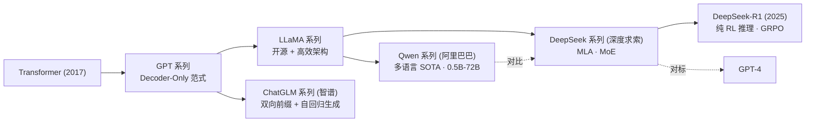
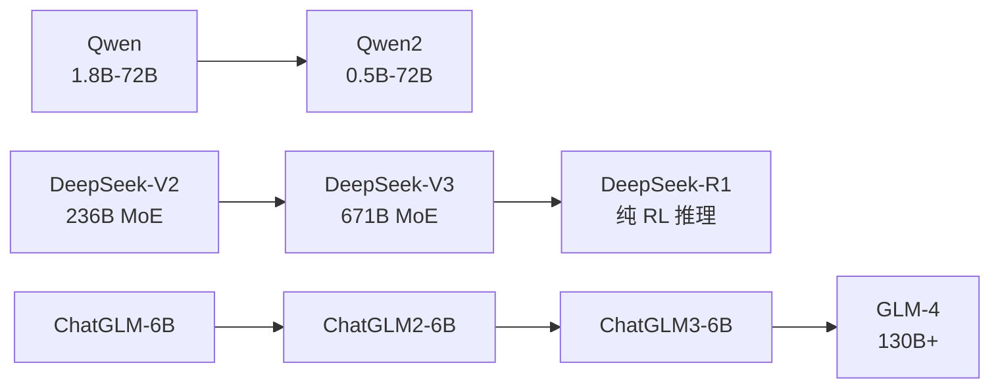
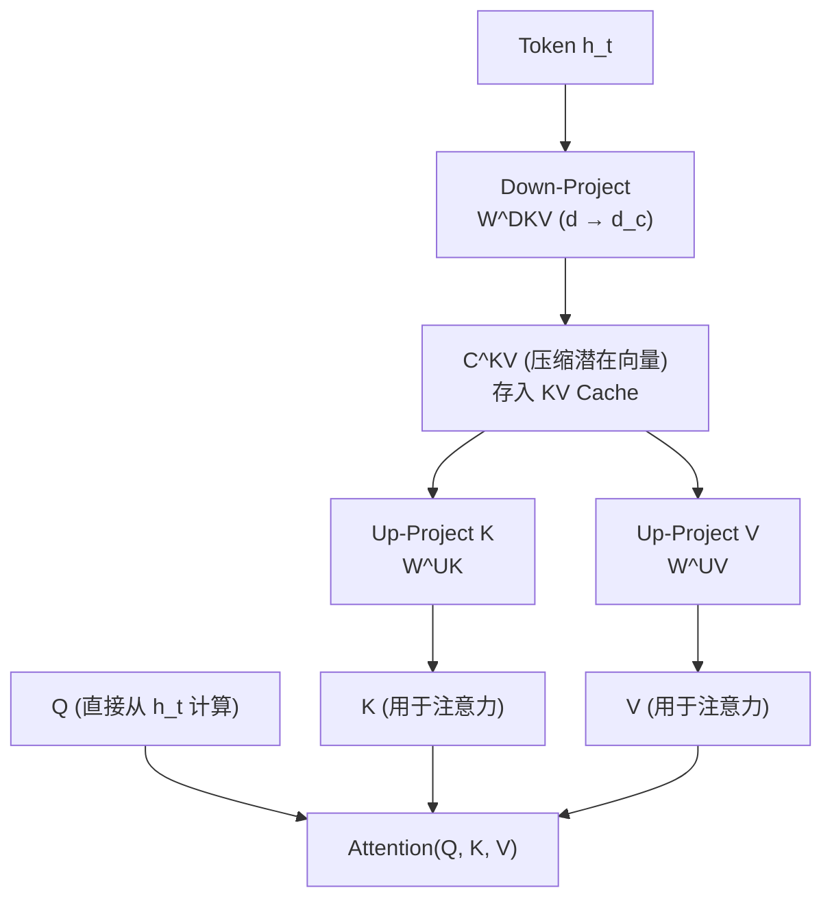
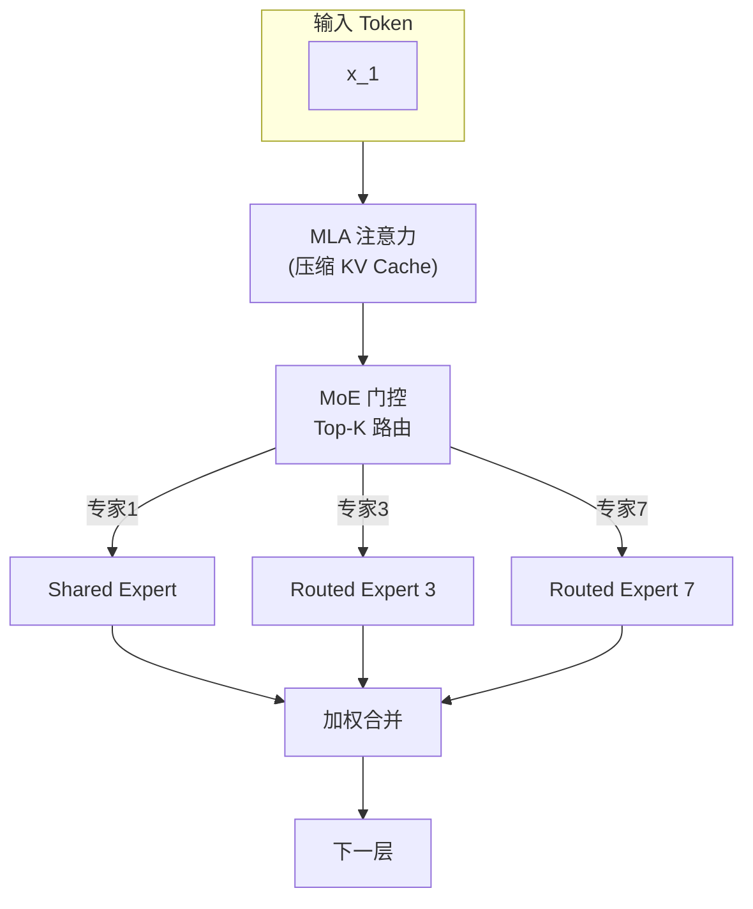
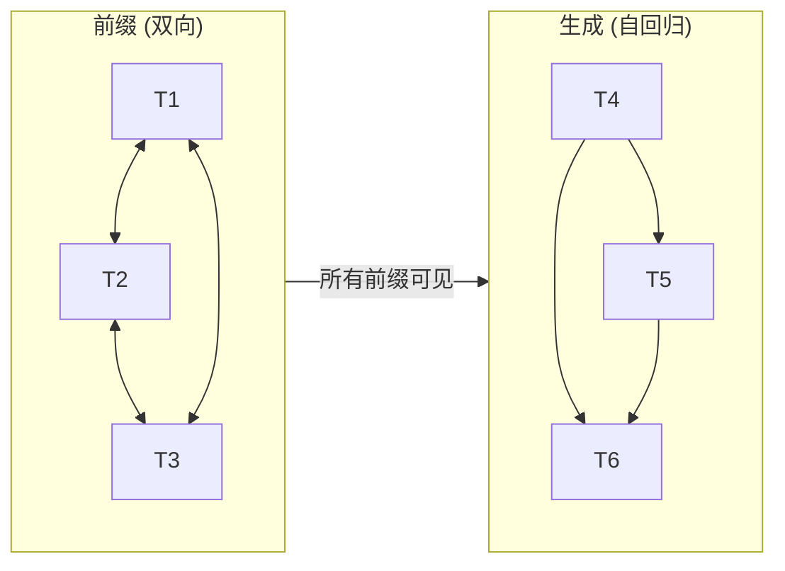

# Qwen / DeepSeek / ChatGLM (国产大模型)

## 知识地图



## 前置知识

- **LLaMA 架构**：RMSNorm、SwiGLU、RoPE、GQA
- **MoE 原理**：门控路由、负载均衡、稀疏激活
- **注意力机制变体**：MHA、MQA、GQA、MLA
- **强化学习基础**：策略梯度、PPO、RLHF 流程
- **中英双语模型特殊性**：双语词表设计、跨语言对齐

## 模型演化路线



| Model | Year | Params | Key Innovation |
|-------|------|--------|----------------|
| Qwen2 | 2024 | 0.5B-72B | 多语言 SOTA; GQA + QKV Bias + Tie Embedding |
| DeepSeek-V2 | 2024 | 236B (MoE) | MLA (Multi-head Latent Attention) 压缩 KV Cache |
| DeepSeek-V3 | 2024 | 671B (MoE) | MLA + FP8 训练 + MoE; ~$5M 训练成本达 GPT-4o 级别 |
| DeepSeek-R1 | 2025 | 671B (MoE) | 纯 RL 推理, GRPO, 无需 SFT |
| ChatGLM | 2023 | 6B | 双向注意力前缀 + 自回归生成结合 |
| GLM-4 | 2024 | 130B+ | 多模态; 128K 上下文; 工具调用 |

## 为什么会出现 (Why)

中国 AI 公司面对两大挑战：一是闭源模型（GPT-4）的API 在国内访问受限、数据出境合规难；二是开源模型（LLaMA）在中文和多语言任务上表现不足。这三家分别走了不同路径——阿里巴巴（Qwen）走通用开源路线覆盖 27+ 语言，深度求索（DeepSeek）在架构创新上极致降本，智谱（ChatGLM）走双向理解+自回归生成的混合架构。

更关键的是，DeepSeek 证明了一件事：**不需要硅谷级别的资源，通过架构创新也可以训练出世界级模型**。V3 仅用约 500 万美元就达到了需要 1 亿美元以上才能训练出的 GPT-4o 级别性能。

## 解决什么问题 (Problem)

- **中文能力不足**：GPT 和 LLaMA 训练数据以英文为主，中文理解差
- **多语言不平衡**：非英语语言模型极度匮乏
- **推理成本过高**：大模型推理需要多张 A100/H100，国内受算力限制
- **合规与私有化**：金融、政务等领域需要可本地部署的中文模型
- **推理能力不足**：现有模型在数学、代码等多步推理任务上仍有明显短板

## 核心思想 (Core Idea)

通过架构创新（MLA 压缩 KV Cache、双向+自回归混合注意力）和训练策略创新（FP8 混合精度、纯 RL 推理），在有限算力下实现世界级大模型性能。

---

## Qwen 系列 (通义千问)

阿里巴巴推出的大模型系列。

### Qwen2

开源，提供 0.5B / 1.5B / 7B / 72B 多个规模。

### 技术特点

- **GQA**：分组查询注意力
- **SwiGLU**：激活函数
- **QKV Bias**：注意力中的偏置项
- **Tie Embedding**：输入输出嵌入共享权重
- **多语言**：支持 27+ 语言

### Qwen-VL

多模态版本，支持图文理解。

---

## DeepSeek 系列

深度求索公司推出的开源大模型。

### DeepSeek-V2 / V3

#### 核心创新：MLA (Multi-head Latent Attention)

将 KV Cache 压缩到低维潜在空间：

$$\mathbf{C}^{KV} = \mathbf{h}_t \cdot \mathbf{W}^{DKV}$$

注意力计算中，K 和 V 从压缩表示 $\mathbf{C}^{KV}$ 重构：

$$\mathbf{K} = \mathbf{C}^{KV} \cdot \mathbf{W}^{UK}, \quad \mathbf{V} = \mathbf{C}^{KV} \cdot \mathbf{W}^{UV}$$

**通俗解释：** 传统 GQA 通过共享 K、V 头来压缩 KV Cache（比如 32 个 Q head 共享 8 个 KV head，压缩 4 倍）。MLA 更进一步——先把所有 token 的 K 和 V 信息压缩到一个很小的"潜在向量"中（称为 C^{KV}），注意力计算时再从潜在向量解压出 K 和 V。这就像压缩文件——存在硬盘上的是 zip 文件（潜在向量），使用时再解压。MLA 可以在几乎不损失质量的前提下将 KV Cache 压缩 10-20 倍。

→ KV Cache 大小大幅降低，长序列推理更高效。

#### DeepSeek-R1

专注推理能力。核心创新：
- **纯强化学习推理**：无需 SFT，直接用 RL 提升推理
- **GRPO (Group Relative Policy Optimization)**：组内相对优化

---

## ChatGLM 系列

智谱 AI 的对话模型。

### GLM 架构

#### 双向注意力前缀

GLM 使用特殊的注意力掩码：

- 前缀部分（上文）：双向注意力
- 生成部分：自回归注意力

结合了 BERT（双向理解）和 GPT（自回归生成）的优势。

### ChatGLM 版本演进

| 版本 | 参数量 | 特点 |
|------|--------|------|
| ChatGLM-6B | 6B | 中英双语 |
| ChatGLM2-6B | 6B | 更长上下文 (32K) |
| ChatGLM3-6B | 6B | 工具调用、代码解释 |
| GLM-4 | 130B+ | 多模态、128K 上下文 |

---

## 架构对比

### 三大系列架构细节

| 特性 | Qwen2 | DeepSeek-V3 | ChatGLM/GLM-4 |
|------|-------|-------------|---------------|
| 基座架构 | Decoder-only | Decoder-only (MoE) | Prefix-LM (Encoder-like + Decoder) |
| 注意力 | GQA | MLA | MHA (前缀双向 + 生成单向) |
| 激活函数 | SwiGLU | SwiGLU | GELU (GLM) / SwiGLU (GLM-4) |
| 归一化 | RMSNorm (Pre) | RMSNorm (Pre) | RMSNorm |
| 位置编码 | RoPE | RoPE | RoPE (GLM-4) |
| MoE | 否 | 是 (671B 总/37B 激活) | 否 |
| 上下文长度 | 128K | 128K | 128K (GLM-4) |
| 特殊设计 | QKV Bias + Tie Embedding | MLA 潜在压缩 + FP8 训练 | 双向前缀注意力 |

### 注意力机制对比

| 类型 | 模型 | KV Cache 大小 | 中文效果 | 理论压缩比 |
|------|------|--------------|---------|-----------|
| MHA | ChatGLM | 基准 | 好 | 1× |
| GQA | Qwen2 | 基准 / 4 | 好 | 4× |
| MLA | DeepSeek-V3 | 基准 / 16+ | 好 | 16×+ |

## 数学模型/公式

### MLA 压缩公式

$$\mathbf{C}^{KV} = \mathbf{h}_t \cdot \mathbf{W}^{DKV} \in \mathbb{R}^{d_c}, \quad d_c \ll d_{model}$$

从压缩表示重构 K 和 V：

$$\mathbf{K} = \mathbf{C}^{KV} \cdot \mathbf{W}^{UK}, \quad \mathbf{V} = \mathbf{C}^{KV} \cdot \mathbf{W}^{UV}$$

其中 $\mathbf{W}^{DKV} \in \mathbb{R}^{d_{model} \times d_c}$ 是降维矩阵，$\mathbf{W}^{UK}, \mathbf{W}^{UV} \in \mathbb{R}^{d_c \times d_k}$ 是升维矩阵。

**通俗解释：** 第一步把高维的隐藏状态 $\mathbf{h}_t$（比如 4096 维）压缩到低维向量 $\mathbf{C}^{KV}$（比如 512 维）；需要注意力计算时再分别解压出 K 和 V。存储 KV Cache 时只需保存 512 维的压缩向量，而非完整的 4096 维——节省了 8 倍以上的显存。

### DeepSeek GRPO 目标

GRPO 不对每个样本独立评估，而是对一组输出进行相对比较：

$$\mathcal{L}_{GRPO} = \mathbb{E}\left[\min\left(\frac{\pi_\theta}{\pi_{old}}A, \text{clip}\left(\frac{\pi_\theta}{\pi_{old}}, 1-\epsilon, 1+\epsilon\right)A\right)\right]$$

**通俗解释：** GRPO 和标准 PPO 的区别在于"跟谁比"。PPO 用一个奖励模型给绝对分数；GRPO 生成一组 k 个回答，不看绝对分数高低，而是看"在这个组里排第几"。组内相对排序比绝对打分更稳定——就像考试打分比"这个回答值 7.5 分"更可靠的是"这个回答比另外 3 个都好"。

### GLM 注意力掩码

前缀部分（0 到 s-1）：双向注意力 —— $A_{ij} = 1 \text{ for } i,j < s$
生成部分（s 到 T）：自回归 —— $A_{ij} = 1 \text{ for } j \leq i \text{ and } i \geq s$

**通俗解释：** GLM 的独到之处在于拆分了一个序列：前面的 prompt 部分（前缀）用双向注意力——每个 token 可以看到前面和后面的其他前缀 token，实现充分理解；后面的生成部分用自回归——只能看前面，保持因果性。这相当于先用 BERT 理解 prompt，再用 GPT 生成回答。

## 可视化展示

### DeepSeek MLA 架构



### DeepSeek-V3 MoE + MLA 整体架构



### GLM 前缀双向注意力



## 最小可运行代码

### 使用 transformers 加载 Qwen2

```python
from transformers import AutoTokenizer, AutoModelForCausalLM

model_name = "Qwen/Qwen2-7B-Instruct"
tokenizer = AutoTokenizer.from_pretrained(model_name)
model = AutoModelForCausalLM.from_pretrained(
    model_name,
    torch_dtype="auto",
    device_map="auto",
)

messages = [
    {"role": "system", "content": "You are a helpful assistant."},
    {"role": "user", "content": "Explain the Transformer architecture."},
]
text = tokenizer.apply_chat_template(
    messages, tokenize=False, add_generation_prompt=True
)
inputs = tokenizer([text], return_tensors="pt").to(model.device)
outputs = model.generate(**inputs, max_new_tokens=512)
print(tokenizer.decode(outputs[0], skip_special_tokens=True))
```

### 使用 transformers 加载 DeepSeek

```python
from transformers import AutoTokenizer, AutoModelForCausalLM

# DeepSeek-V3 (需要较大显存，建议多卡)
model_name = "deepseek-ai/DeepSeek-V3"
tokenizer = AutoTokenizer.from_pretrained(model_name)
model = AutoModelForCausalLM.from_pretrained(
    model_name,
    torch_dtype="auto",
    device_map="auto",
    trust_remote_code=True,
)

messages = [
    {"role": "user", "content": "用 Python 实现一个二分查找函数"},
]
inputs = tokenizer.apply_chat_template(
    messages, return_tensors="pt", add_generation_prompt=True
).to(model.device)
outputs = model.generate(inputs, max_new_tokens=512)
print(tokenizer.decode(outputs[0], skip_special_tokens=True))
```

### 使用 transformers 加载 ChatGLM

```python
from transformers import AutoTokenizer, AutoModelForCausalLM

# ChatGLM3-6B
model_name = "THUDM/chatglm3-6b"
tokenizer = AutoTokenizer.from_pretrained(model_name, trust_remote_code=True)
model = AutoModelForCausalLM.from_pretrained(
    model_name,
    trust_remote_code=True,
    torch_dtype="auto",
    device_map="auto",
).eval()

response, history = model.chat(
    tokenizer,
    "请介绍一下中国 AI 大模型的发展现状",
    history=[],
)
print(response)
```

### MLA 压缩与解压示意

```python
import torch
import torch.nn as nn

class MultiHeadLatentAttention(nn.Module):
    """MLA: 将 K/V 压缩到潜在空间再解压"""
    def __init__(self, d_model=4096, n_heads=32, d_latent=512):
        super().__init__()
        self.n_heads = n_heads
        self.head_dim = d_model // n_heads
        self.d_latent = d_latent

        self.W_q = nn.Linear(d_model, d_model, bias=False)
        # 压缩: d_model → d_latent
        self.W_dkv = nn.Linear(d_model, d_latent, bias=False)
        # 解压 K: d_latent → d_model
        self.W_uk = nn.Linear(d_latent, d_model, bias=False)
        # 解压 V: d_latent → d_model
        self.W_uv = nn.Linear(d_latent, d_model, bias=False)
        self.W_o = nn.Linear(d_model, d_model, bias=False)

    def forward(self, x):
        B, T, D = x.shape
        Q = self.W_q(x).view(B, T, self.n_heads, self.head_dim).transpose(1, 2)

        # 压缩到潜在空间 (存入 KV Cache 的是 d_latent 维!)
        c_kv = self.W_dkv(x)  # [B, T, d_latent]

        # 从潜在空间解压出 K 和 V
        K = self.W_uk(c_kv).view(B, T, self.n_heads, self.head_dim).transpose(1, 2)
        V = self.W_uv(c_kv).view(B, T, self.n_heads, self.head_dim).transpose(1, 2)

        attn = torch.softmax(Q @ K.transpose(-2, -1) / (self.head_dim ** 0.5), dim=-1)
        out = (attn @ V).transpose(1, 2).contiguous().view(B, T, D)
        return self.W_o(out)
```

## 工业界应用

| 产品/服务 | 底层模型 | 用途 |
|-----------|----------|------|
| 通义千问 | Qwen2/Qwen-Max | 阿里云 AI 助手、钉钉智能助理 |
| 通义灵码 | Qwen 微调 | 代码生成与补全 |
| 阿里云百炼 | Qwen 全系列 | 企业级 AI 平台 |
| DeepSeek Chat | DeepSeek-V3 | 免费对话助手 |
| 深度求索 API | DeepSeek-V3 | 开发者推理 API |
| 智谱清言 | GLM-4 | 对话助手 |
| 智谱开放平台 | GLM 全系列 | 企业 API + 模型微调 |

## 对比表格：国产模型 vs GPT vs LLaMA

| 维度 | GPT-4 | LLaMA 3 405B | DeepSeek-V3 | Qwen2-72B | GLM-4 |
|------|-------|-------------|-------------|-----------|-------|
| 最大参数 | ~1.7T (MoE) | 405B | 671B (MoE) | 72B | 130B+ |
| 开源 | 否 | 是 | 是 | 是 | 部分 |
| 中文能力 | 中等 | 中等 | 强 | 强 | 强 |
| 多语言 | 强 | 强 | 中等 | 强 (27+) | 中英为主 |
| MoE | 是 | 否 | 是 | 否 | 否 |
| KV Cache 优化 | GQA | GQA | MLA (最强) | GQA | MHA |
| 训练成本 | ~$100M+ | 未公开 | ~$5M | 未公开 | 未公开 |
| 独特优势 | 全模态 | 社群生态 | 极致性价比 | 多语言 SOTA | 中文理解最深 |

## 学完后建议继续学习

1. **DeepSeek-R1 深入** — 纯 RL 推理的技术细节, GRPO 算法
2. **MoE 深入** — DeepSpeed-MoE、专家并行、All-to-All 通信优化
3. **FP8 训练** — DeepSeek-V3 的低精度训练技巧
4. **Qwen2.5 / Qwen-Agent** — 多模态与 Agent 能力
5. **GLM-4 多模态** — 视觉语言对齐技术

## 高频面试题

### Q1: DeepSeek-V3 为何能以 ~$5M 的成本达到 GPT-4o 级别的性能？

**标准答案：** DeepSeek-V3 通过三个层面的极致降本实现：（1）**MLA（Multi-head Latent Attention）**——将 KV Cache 压缩到低维潜在空间（压缩比可达 16× 以上），大幅降低显存占用和计算量；（2）**MoE 架构**——671B 总参数但每次推理仅激活约 37B（约 5.5%），实现了"大容量小计算"；（3）**FP8 混合精度训练**——相比 FP16/BF16 训练，显存减半、通信量减半，且通过精细的量化策略保持了训练稳定性。三者叠加使训练成本从传统 $100M+ 级别降到 $5M 级别。

### Q2: MLA (Multi-head Latent Attention) 和 GQA 的区别是什么？MLA 为什么更高效？

**标准答案：** GQA 通过让多组 Q head 共享同一个 KV head 来压缩 KV Cache（比如 32 个 Q head 共享 8 个 KV head，压缩 4 倍），但 K 和 V 仍然在"注意力头维空间"中。MLA 更进一步——引入一个低维潜在空间 $d_c \ll d_{model}$，先将隐藏状态投影到潜在空间得到紧凑的 $\mathbf{C}^{KV}$，存入 KV Cache 的是这个小向量，需要时再解压出 K 和 V。GQA 的压缩受限于 "多少个 head 共享一组 KV"（通常 4-8 倍），MLA 的压缩比由 $d_c$ 决定，可以达到 10-20 倍以上，且通过可学习的降维/升维矩阵保持了信息完整度。

### Q3: ChatGLM 的 Prefix-LM 架构和 GPT 的 Decoder-Only 有什么区别？

**标准答案：** GPT 的 Decoder-Only 对所有 token 都使用自回归（Causal）掩码，每个 token 只能看到前面的 token。ChatGLM 的 Prefix-LM 将序列分为两部分：（1）**前缀部分**（prompt/上文）使用双向注意力——所有前缀 token 互相可见，实现充分理解；（2）**生成部分**使用自回归注意力——只能看到前面的所有内容（包括整个前缀）。这结合了 BERT（双向理解）和 GPT（自回归生成）的优势——对用户输入理解更充分，同时保持生成的一致性。代价是架构更复杂，需要特殊的掩码矩阵实现。

### Q4: 为什么国产大模型需要特别关注中文能力？技术上如何实现？

**标准答案：** GPT 和 LLaMA 的训练数据以英文为主（英文占 90%+），导致中文理解和生成质量明显低于英文。技术上提升中文能力的关键在于：（1）**词表设计**——增大中文 token 的覆盖率，降低 tokenization 损失（中文每个字通常需要 2-3 个 token，如果词表中文覆盖率低会更加碎片化）；（2）**训练数据配比**——提高高质量中文语料（新闻、百科全书、论坛、学术论文）的比例；（3）**跨语言对齐**——在训练中混合多语言数据使模型学到语言无关的概念表示。Qwen2 支持 27+ 语言，在中文基准上显著超越 LLaMA 3。

### Q5: GRPO 和 PPO 在 RLHF 中有什么区别？DeepSeek-R1 为什么使用 GRPO？

**标准答案：** PPO 依赖一个独立的奖励模型（RM）给每个输出打分，但 RM 本身可能被"欺骗"（reward hacking）。GRPO（Group Relative Policy Optimization）不依赖绝对奖励分数，而是对一组输出（group）进行相对比较——在同一组里，好的输出比差的输出获得更高的相对优势。优点：（1）不需要训练独立的奖励模型；（2）相对比较比绝对打分更鲁棒，不容易被 hack；（3）更适合推理任务——推理的正确性通常可以通过验证器（如数学答案检查）而非奖励模型来判断。DeepSeek-R1 使用 GRPO 实现了无需 SFT 的纯 RL 推理能力提升。
