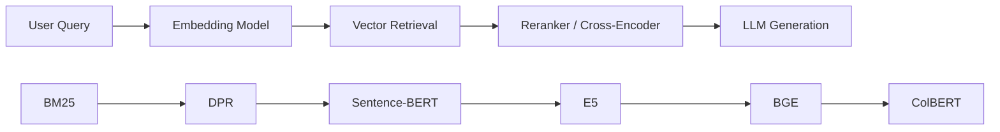
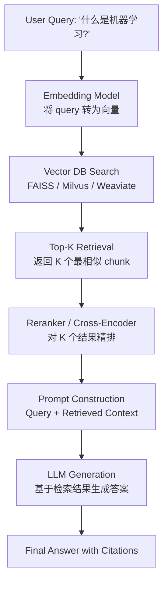
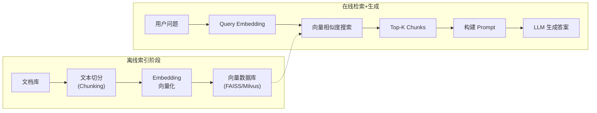

# RAG / GraphRAG (检索增强生成)

## 知识地图



## 前置知识

- **Embedding / 向量表示**：理解如何将文本映射到稠密向量空间（见 embedding-layer.md）
- **Transformer / BERT 基础**：了解自注意力机制和双编码器架构
- **向量检索与 FAISS**：掌握近似最近邻搜索的基本概念（见 faiss-vector-index.md）
- **LLM 工作原理**：了解大语言模型的自回归生成方式

## 为什么会出现 (Why)

大语言模型 (LLM) 存在三个根本性问题：

1. **幻觉 (Hallucination)**：LLM 会自信地编造不存在的事实，因为其知识完全压缩在模型参数中，无法追溯来源。
2. **知识截止 (Knowledge Cutoff)**：模型训练完成后无法获取新知识。例如 2023 年训练的模型不知道 2024 年的事件。
3. **私有知识盲区**：企业内部文档、专有数据库中的信息不在公开训练语料中，LLM 完全无法回答。

RAG 通过"检索 + 生成"的范式，让 LLM 在回答前先查阅外部知识库，从根本上缓解了这三个问题。

## 解决什么问题 (Problem)

RAG 解决的核心问题是：**如何让 LLM 利用外部、实时、可追溯的知识来生成准确答案，而不是仅依赖训练时记忆的参数化知识。**

具体包括：
- 让 LLM 回答训练数据中没有的私有/领域知识
- 为生成的答案提供引用来源（可解释性）
- 通过更新知识库而非重新训练模型来更新知识
- 减少幻觉，因为 LLM 被约束在检索到的上下文内

## 核心思想 (Core Idea)

在 LLM 生成回答之前，先从外部知识库中**检索相关文档**，将检索到的内容作为上下文拼入 prompt，让 LLM 基于检索结果生成回答。

## RAG 流程图



## 系统架构

```
Query → Embedding Model → Query Vector
                                  ↓
                    Vector Database (FAISS/Milvus/Weaviate)
                                  ↓
                    Top-K Relevant Chunks
                                  ↓
           Prompt = Query + Retrieved Context
                                  ↓
                             LLM → Answer
```

## 索引阶段 (Offline)

1. **文档解析**：提取文本（PDF/HTML/Markdown）
2. **文本切分 (Chunking)**：将文档切分为合适大小的片段
3. **向量化**：用 Embedding 模型将每个 chunk 转为向量
4. **存储**：存入向量数据库

## 检索 + 生成阶段 (Online)

1. Query → Embedding → 向量搜索 → Top-K chunks
2. 拼接 Prompt：`基于以下知识回答问题：\n{chunks}\n\n问题：{query}`
3. LLM 生成答案

## 关键设计决策

### 分块策略 (Chunking)

| 策略 | 描述 |
|------|------|
| 固定大小 | 按 token 数切（如 512 tokens, overlap 50） |
| 语义分块 | 按自然段落/句子边界 |
| 递归分块 | 尝试不同分隔符（段落 → 句子 → 词） |
| 父子分块 | 检索小块，给 LLM 大的上下文窗口 |

### 检索策略

- **Top-K 直接检索**：返回相似度最高的 K 个
- **MMR (最大边际相关性)**：平衡相关性和多样性
- **多级检索**：粗排（向量召回） → 精排（Cross-Encoder）

---

## GraphRAG

### 核心思想

RAG 只能检索碎片化的文本块，无法理解实体之间的**全局关系和层次结构**。GraphRAG 构建知识图谱来增强理解。

### 构建流程

1. **实体提取**：LLM 从文档中提取实体和关系
2. **社区发现**：用 Leiden 算法在图中发现主题社区
3. **社区总结**：LLM 为每个社区生成摘要
4. **查询时**：根据问题匹配社区/实体 → 获取结构化+非结构化上下文

### GraphRAG vs 标准 RAG

| | RAG | GraphRAG |
|------|-----|----------|
| 检索粒度 | 文本块 | 实体 + 文本块 |
| 全局理解 | 弱 | 强 |
| 构建成本 | 低 | 高 |
| 适合查询 | 事实性 | 总结/跨文档推理 |

## 数学模型/公式

### 检索相似度计算

最常见的余弦相似度：

$$
\text{sim}(q, d) = \frac{q \cdot d}{\|q\| \|d\|} = \frac{\sum_{i=1}^{n} q_i d_i}{\sqrt{\sum_{i=1}^{n} q_i^2} \sqrt{\sum_{i=1}^{n} d_i^2}}
$$

**通俗解释：** 把 query 向量和 document 向量都缩放到单位长度，算它们夹角的余弦值。值越接近 1，说明两个向量的"方向"越一致，语义越相似。

### 检索评价指标

**Recall@K**：

$$
\text{Recall@K} = \frac{|\{\text{检索到的相关文档}\} \cap \{\text{所有相关文档}\}|}{|\{\text{所有相关文档}\}|}
$$

**通俗解释：** 在返回的 K 个结果中，捞到了多少比例的相关文档。Recall@10 = 0.8 意思是：10 个结果里找回了 80% 的相关文档。

**MRR (Mean Reciprocal Rank)**：

$$
\text{MRR} = \frac{1}{|Q|} \sum_{i=1}^{|Q|} \frac{1}{\text{rank}_i}
$$

**通俗解释：** 对每个问题，看第一个相关文档排在第几位，取倒数，然后对所有问题求平均。排第 1 名得 1.0 分，排第 2 名得 0.5 分，排第 3 名得 0.33 分——和相关文档排得越靠前，分数越高。

## 评估指标

- **检索质量**：Recall@K, MRR, NDCG
- **生成质量**：Faithfulness（是否忠于检索内容）、Answer Relevance
- **端到端**：与 Ground Truth 的语义相似度

## 可视化展示



## 最小可运行代码

### ChromaDB 原生实现

```python
import chromadb
client = chromadb.Client()
collection = client.create_collection("knowledge")

# 索引
for i, chunk in enumerate(chunks):
    collection.add(ids=str(i), embeddings=embed(chunk), documents=chunk)

# 检索
results = collection.query(query_embeddings=embed(query), n_results=5)
context = "\n".join(results["documents"][0])
prompt = f"基于以下知识回答问题：\n{context}\n\n问题：{query}"
answer = llm(prompt)
```

### LangChain RAG Pipeline

```python
from langchain.text_splitter import RecursiveCharacterTextSplitter
from langchain.embeddings import OpenAIEmbeddings
from langchain.vectorstores import Chroma
from langchain.chains import RetrievalQA
from langchain.llms import OpenAI

# 1. 文档切分
splitter = RecursiveCharacterTextSplitter(chunk_size=512, chunk_overlap=50)
chunks = splitter.split_documents(documents)

# 2. 向量化 + 存储
embeddings = OpenAIEmbeddings()
vectorstore = Chroma.from_documents(chunks, embeddings)

# 3. 构建 RAG Chain
qa_chain = RetrievalQA.from_chain_type(
    llm=OpenAI(),
    retriever=vectorstore.as_retriever(search_kwargs={"k": 5})
)

# 4. 查询
answer = qa_chain.run("什么是机器学习?")
```

### LlamaIndex RAG Pipeline

```python
from llama_index import VectorStoreIndex, SimpleDirectoryReader

# 1. 加载文档
documents = SimpleDirectoryReader("./data").load_data()

# 2. 构建索引（自动完成 chunking + embedding + 存储）
index = VectorStoreIndex.from_documents(documents)

# 3. 查询
query_engine = index.as_query_engine(similarity_top_k=5)
response = query_engine.query("什么是机器学习?")

print(response)
```

## 工业界应用

| 应用 | 产品/公司 | RAG 的作用 |
|------|----------|-----------|
| ChatGPT Retrieval | OpenAI | 用户开启联网/知识库功能后，先检索再生成 |
| Bing Chat / Copilot | Microsoft | 实时检索网页，将搜索结果注入 prompt |
| 企业知识库问答 | 各家企业内部 | 将内部文档索引化，员工用自然语言查询 |
| Perplexity AI | Perplexity | 搜索 + RAG，每次回答附带引用来源 |
| 代码助手 | GitHub Copilot, Cursor | 检索代码库上下文，增强代码生成 |
| 客服系统 | 银行、电商客服 | 从产品手册/FAQ 中检索答案 |
| 法律/医疗文档分析 | 各行业 | 检索相关判例/病例文献辅助专业人员 |

## 对比表格

| 维度 | RAG | 纯 LLM | 微调 (Fine-tuning) |
|------|-----|--------|---------------------|
| 知识更新 | 实时更新知识库 | 需重新训练 | 需重新微调 |
| 可解释性 | 有引用来源 | 无 | 无 |
| 幻觉控制 | 较好（约束到上下文） | 差 | 一般 |
| 成本 | 检索+推理双成本 | 仅推理成本 | 微调成本高 |
| 私有知识支持 | 天然支持 | 不支持 | 需提供训练数据 |

## 学完后建议继续学习

1. **Embedding Layer / 嵌入层** — 理解向量化的底层原理
2. **BM25 与 DPR** — 掌握稀疏检索和稠密检索两大流派
3. **BGE / E5 模型** — 深入主流 Embedding 模型的选型与使用
4. **FAISS 向量索引** — 学习工业级向量检索的实现
5. **Sentence-BERT / ColBERT** — 句子级和 token 级检索模型
6. **Dense Retrieval Advanced** — Contriever, ANCE 等前沿检索技术

## 高频面试题

**Q1: RAG 和微调 (Fine-tuning) 的区别是什么？什么时候用哪个？**

A: RAG 通过在推理时检索外部知识库来增强 LLM，知识可以实时更新且答案可追溯来源；微调则是将领域知识直接训练进模型参数。选择标准：知识频繁更新 / 需要可解释性 → RAG；需要改变模型行为风格 / 任务格式 / 特定领域推理模式 → 微调；两者可以结合使用（微调后的模型 + RAG）。

**Q2: RAG 系统的核心组件有哪些？**

A: 核心组件包括：1) 文档解析与切分模块（Chunking）；2) Embedding 模型（将文本转为向量）；3) 向量数据库（存储和检索）；4) 检索器（Retriever）；5) 可选的 Reranker（精排）；6) Prompt 模板；7) LLM 生成器。整个 Pipeline 分为离线索引和在线检索+生成两个阶段。

**Q3: RAG 中如何选择合适的 Chunk Size？**

A: Chunk Size 需要在语义完整性和检索精度之间权衡。太小（如 128 tokens）：信息碎片化，丢失上下文；太大（如 2048 tokens）：检索精度下降，噪声增多。一般经验值 256-512 tokens 适合事实性问答，512-1024 tokens 适合摘要/推理任务。关键技巧：使用 overlap（如 10-20%）保证边界信息不丢失。

**Q4: 什么是 GraphRAG？和传统 RAG 有什么不同？**

A: GraphRAG 在传统 RAG 基础上引入知识图谱。传统 RAG 以独立文本块为检索单元，无法理解实体间的全局关系；GraphRAG 通过 LLM 提取实体和关系构建知识图谱，再通过社区发现和摘要生成结构化的全局理解。适合需要跨文档推理、总结性问答的场景，但构建成本远高于传统 RAG。

**Q5: RAG 系统常见的失败模式有哪些？如何解决？**

A: 常见失败模式：1) 检索不相关（Retrieval Failure）——换更强的 Embedding 模型或引入 Reranker；2) 被不相关内容误导——加强 Prompt 指令，要求 LLM 只基于相关上下文回答；3) Chunk 缺乏上下文——使用父子分块或文档摘要增强；4) 关键实体未命中——引入混合检索（稠密 + 稀疏），确保专有名词不被遗漏。
