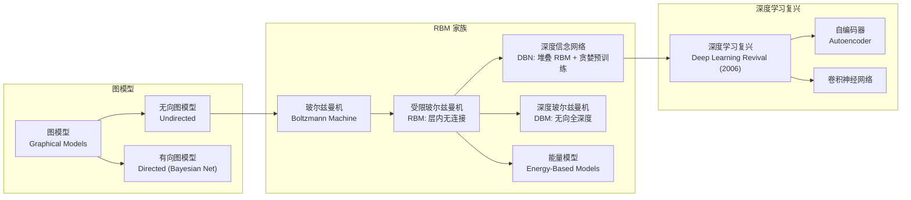
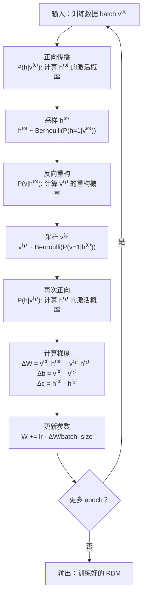
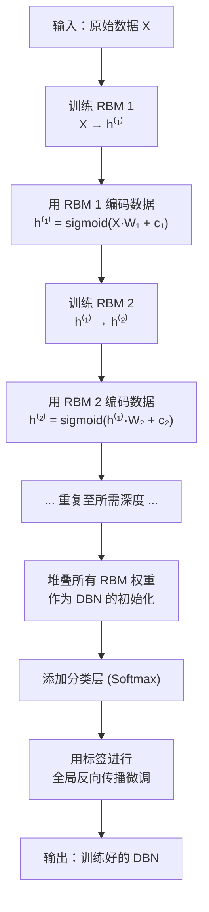
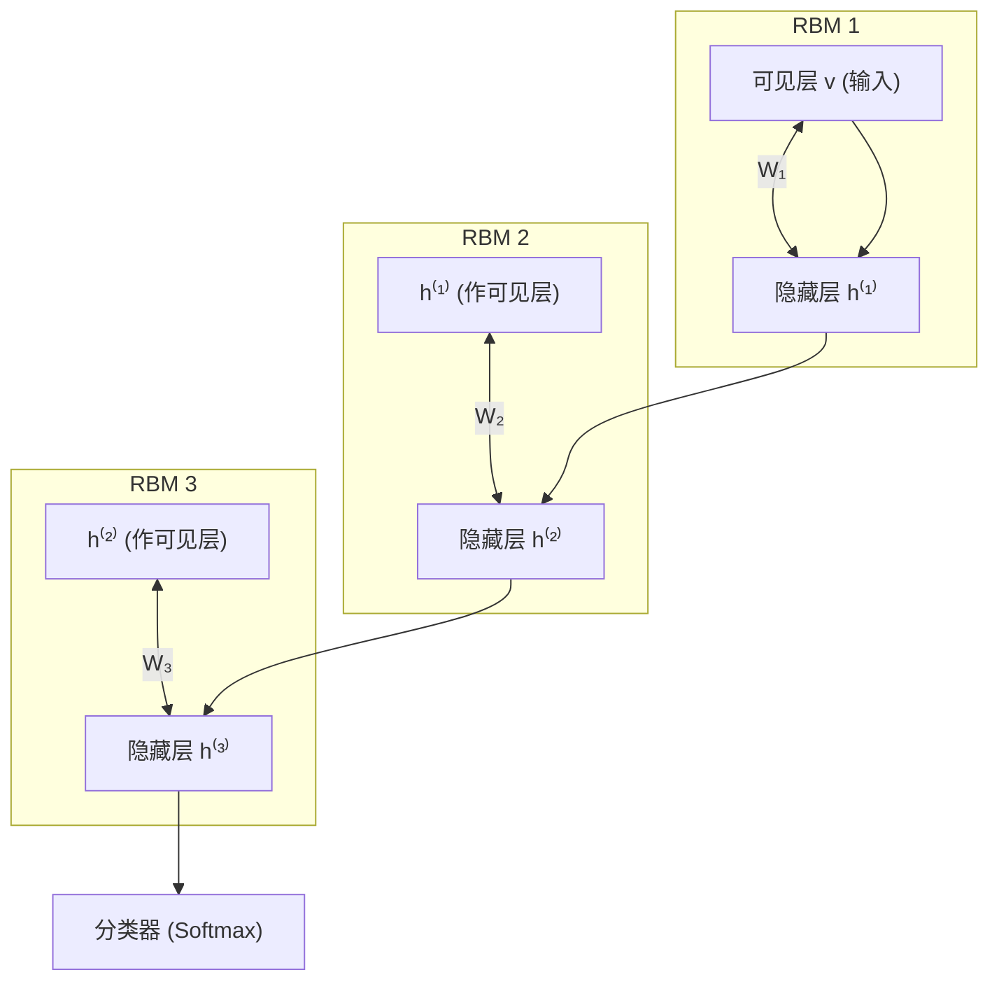
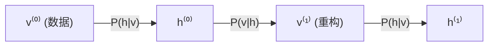

# RBM / DBN (受限玻尔兹曼机 / 深度信念网络)

## 知识地图



## 前置知识

- **概率论与统计**：联合概率分布、条件概率、贝叶斯定理
- **能量模型基础**：配分函数 (Partition Function)、Gibbs 分布——$P(x) \propto e^{-E(x)}$
- **Sigmoid 函数**：$\sigma(x) = \frac{1}{1+e^{-x}}$ 及其在二值概率建模中的应用
- **MCMC 采样**：Gibbs 采样的基本思想——交替条件采样达到稳态分布
- **神经网络基础**：梯度下降、反向传播

## 为什么会出现 (Why)

2006 年之前，深度学习面临一个核心困境：深层神经网络极难训练——随机初始化的权重在反向传播时梯度会消失或爆炸，导致底层几层学到的东西很少。Hinton 等人 (2006) 发现：如果先用"无监督预训练"逐层初始化权重，让每一层先学会对数据的有意义表示，再用有监督信号做微调，深层网络就能成功训练。这个发现引发了深度学习复兴。而实现逐层预训练的核心工具就是 RBM（受限玻尔兹曼机）——一种基于能量的无向图模型，通过对比散度（Contrastive Divergence）高效训练。多个 RBM 堆叠起来形成 DBN（深度信念网络）。

## 解决什么问题 (Problem)

- **RBM**：学习数据的概率分布，可作为特征提取器或生成模型。给定可见层数据，能推断隐藏层表示；给定隐藏层表示，能重构可见层数据。
- **DBN**：解决深层网络的训练困难问题——通过逐层贪婪预训练，为每层提供好的初始化权重，使得全局微调能够收敛到更好的解。

## 核心思想 (Core Idea)

**RBM 是能量模型最简单的形式——可见层与隐藏层之间双向连接，层内无连接（"受限"的含义），训练通过对比散度（Contrastive Divergence）近似最大似然，核心直觉是"让模型对真实数据的期望与模型自身生成的期望对齐"。DBN 将多个 RBM 堆叠起来，层层贪婪预训练，解决深层网络的初始化问题。**

---

## 数学模型/公式

### RBM 能量函数

$$
E(\mathbf{v}, \mathbf{h}) = -\mathbf{v}^T \mathbf{W} \mathbf{h} - \mathbf{b}^T \mathbf{v} - \mathbf{c}^T \mathbf{h}
$$

联合概率：$P(\mathbf{v}, \mathbf{h}) = \frac{1}{Z} e^{-E(\mathbf{v}, \mathbf{h})}$，其中 $Z = \sum_{\mathbf{v},\mathbf{h}} e^{-E(\mathbf{v},\mathbf{h})}$ 是配分函数。

**通俗解释：** 能量越低，状态越稳定、越可能出现。RBM 通过训练调整 $\mathbf{W}, \mathbf{b}, \mathbf{c}$，使得训练数据对应的 ($\mathbf{v}$) 状态拥有低能量（高概率），而随机噪声状态拥有高能量（低概率）。但在实际训练中，学生也要学会生成以假乱真的样本——这就是"对比散度"要解决的问题。

### 条件概率（推导自能量）

由于层内无连接，条件概率独立：

$$
P(h_j = 1 | \mathbf{v}) = \sigma(\mathbf{W}_{:j}^T \mathbf{v} + c_j)
$$

$$
P(v_i = 1 | \mathbf{h}) = \sigma(\mathbf{W}_{i:} \mathbf{h} + b_i)
$$

**通俗解释：** "层内无连接"是 RBM 的关键设计——它使得给定可见层时，隐藏层各神经元的激活相互独立（可以并行计算），反之亦然。这让 Gibbs 采样变得简单高效：只需要在两个方向交替采样即可。

### 对比散度 (CD-k)

直接计算 $Z$ 不可行（需要对所有可能的 v 和 h 求和），CD-k 用 Gibbs 采样近似：

1. 从数据 $\mathbf{v}^{(0)}$ 出发
2. 交替更新：$\mathbf{h}^{(t)} \sim P(\mathbf{h}|\mathbf{v}^{(t)})$，$\mathbf{v}^{(t+1)} \sim P(\mathbf{v}|\mathbf{h}^{(t)})$
3. 重复 k 步（通常 k=1 就够）

权重更新（CD-1）：

$$
\Delta \mathbf{W} = \mathbf{v}^{(0)} \mathbf{h}^{(0)T} - \mathbf{v}^{(1)} \mathbf{h}^{(1)T}
$$

$\mathbf{v}^{(0)}\mathbf{h}^{(0)T}$ 是"数据驱动"的期望，$\mathbf{v}^{(1)}\mathbf{h}^{(1)T}$ 是"模型生成"的期望。

**通俗解释：** 训练 RBM 像是在玩一个"纠正偏差"的游戏。先让模型看真实数据，计算它"认为"特征应该激活的模式（正向）。然后让模型自己生成一个"想象"的样本，再计算对应的特征激活（反向）。如果真实数据的激活模式与模型生成的激活模式不同，就调整权重以缩小差距。CD-1 只让模型"想象一步"，意外地已经足够好——因为一步重构的数据就已经偏离了原始数据，梯度信号足够强。

### DBN 贪婪预训练

1. 训练 RBM1：$(\mathbf{x})$ → $\mathbf{h}^{(1)}$
2. 冻结 RBM1，用 $\mathbf{h}^{(1)}$ 训练 RBM2：$\mathbf{h}^{(1)}$ → $\mathbf{h}^{(2)}$
3. 重复至所需深度
4. 最后加分类层，用 BP 微调全局

**通俗解释：** DBN 的训练策略是"先学会走，再学跑"。第一层 RBM 先学好数据的基础特征（如边缘、纹理），第二层在第一层输出的基础上学更抽象的特征（如形状、部件），以此类推。每层只关注自己的输入，不用考虑上面还有多少层。最后所有层都预训练好了，再用有监督信号做全局微调——这时梯度消失问题已经被解决了，因为初始化已经在合理的区域。

---

## 算法流程图

### RBM 训练 (CD-1) 流程



### DBN 逐层贪婪预训练流程



---

## 可视化展示

### RBM → DBN 堆叠



### CD-1 采样过程



**关键观察：** v⁽⁰⁾→h⁽⁰⁾ 使用数据分布，v⁽¹⁾→h⁽¹⁾ 使用模型分布。梯度 = 数据期望 - 模型期望。

---

## 最小可运行代码

```python
import numpy as np


class RBM:
    def __init__(self, n_visible, n_hidden, lr=0.01):
        self.lr = lr
        self.W = np.random.randn(n_visible, n_hidden) * 0.01
        self.b = np.zeros(n_visible)
        self.c = np.zeros(n_hidden)

    def sigmoid(self, x):
        return 1 / (1 + np.exp(-np.clip(x, -500, 500)))

    def sample_hidden(self, v):
        return self.sigmoid(v @ self.W + self.c)

    def sample_visible(self, h):
        return self.sigmoid(h @ self.W.T + self.b)

    def cd1(self, v0):
        """对比散度 CD-1"""
        # 正向：数据 → 隐藏
        p_h0 = self.sample_hidden(v0)
        h0 = (np.random.rand(*p_h0.shape) < p_h0).astype(float)

        # 反向：隐藏 → 重构
        p_v1 = self.sample_visible(h0)
        p_h1 = self.sample_hidden(p_v1)

        # 梯度 = 数据期望 - 模型期望
        dW = v0.T @ p_h0 - p_v1.T @ p_h1
        db = v0.sum(axis=0) - p_v1.sum(axis=0)
        dc = p_h0.sum(axis=0) - p_h1.sum(axis=0)

        self.W += self.lr * dW / v0.shape[0]
        self.b += self.lr * db / v0.shape[0]
        self.c += self.lr * dc / v0.shape[0]

        return np.mean((v0 - p_v1) ** 2)

    def reconstruct(self, v):
        return self.sample_visible(self.sample_hidden(v))

    def transform(self, v):
        """将可见层数据编码为隐藏层表示"""
        return self.sample_hidden(v)


def pretrain_dbn(rbm_list, X, epochs=10):
    """逐层预训练 DBN"""
    data = X.copy()
    for i, rbm in enumerate(rbm_list):
        print(f'Training RBM {i+1}: {rbm.W.shape}')
        for epoch in range(epochs):
            error = rbm.cd1(data)
            if epoch % 5 == 0:
                print(f'  epoch {epoch}: reconstruction error = {error:.4f}')
        # 下一层的输入 = 当前隐藏层的激活
        data = rbm.sample_hidden(data)
    return rbm_list


class DBN:
    """深度信念网络：堆叠 RBM + 分类层"""
    def __init__(self, layer_sizes, lr=0.01):
        """
        layer_sizes: [n_visible, n_hidden1, n_hidden2, ..., n_hiddenL]
        """
        self.rbm_list = []
        for i in range(len(layer_sizes) - 1):
            self.rbm_list.append(RBM(layer_sizes[i], layer_sizes[i + 1], lr))

    def pretrain(self, X, epochs=10):
        pretrain_dbn(self.rbm_list, X, epochs)

    def forward(self, X):
        """前向传播：逐层编码"""
        h = X
        for rbm in self.rbm_list:
            h = rbm.transform(h)
        return h

    def reconstruct(self, X):
        """重构：先编码到底层，再逐层解码回来"""
        h = X
        for rbm in self.rbm_list:
            h = rbm.sample_hidden(h)
        for rbm in reversed(self.rbm_list):
            h = rbm.sample_visible(h)
        return h


# ===== 使用示例 =====
if __name__ == '__main__':
    np.random.seed(42)

    # 示例数据：手写数字的二值化简版 (8x8 = 64 像素)
    from sklearn.datasets import load_digits
    from sklearn.preprocessing import binarize

    digits = load_digits()
    X = binarize(digits.data[:500], threshold=8.0)  # 二值化，500 个样本

    # 训练单个 RBM 作为特征提取器
    rbm = RBM(n_visible=64, n_hidden=32, lr=0.05)
    print("Training single RBM...")
    for epoch in range(50):
        error = rbm.cd1(X)
        if epoch % 10 == 0:
            print(f"  epoch {epoch}: reconstruction error = {error:.4f}")

    # 使用隐藏层表示
    H = rbm.transform(X)
    print(f"\nOriginal shape: {X.shape}")
    print(f"Hidden representation shape: {H.shape}")

    # 训练小 DBN
    print("\nTraining DBN (64 → 32 → 16)...")
    dbn = DBN(layer_sizes=[64, 32, 16], lr=0.05)
    dbn.pretrain(X, epochs=30)
    features = dbn.forward(X)
    print(f"DBN features shape: {features.shape}")
```

---

## 工业界应用

| 领域 | 应用场景 | 典型用法 |
| --- | --- | --- |
| **图像处理** | 特征学习 / 降噪 | RBM 作为无监督特征提取器，学习图像的边缘、纹理等底层特征；去噪 RBM 用于图像修复 |
| **推荐系统** | 协同过滤 | Netflix Prize 中，RBM 用于建模用户-物品评分矩阵，学习用户偏好的隐藏因子 |
| **语音识别** | 声学建模 | DBN 在深度学习早期被广泛用于语音识别的预训练（后被纯监督方法取代） |
| **自然语言处理** | 文本表示学习 | RBM 学习文档的紧凑二值编码 (semantic hashing) |
| **药物发现** | 分子生成 | RBM 作为生成模型，学习分子的概率分布，生成新的候选分子结构 |
| **异常检测** | 工业设备监控 | 训练 RBM 学习正常数据分布，通过重构误差检测异常 |

---

## 对比表格

| 维度 | RBM | 自编码器 (AE) | VAE (变分自编码器) | GAN |
| --- | --- | --- | --- | --- |
| **模型类型** | 能量模型 (无向图) | 确定性的编码-解码 | 概率生成模型 (有向图) | 对抗生成模型 |
| **训练目标** | 最大似然 (CD 近似) | 最小化重构误差 | ELBO 最大化 | 对抗博弈 (minimax) |
| **生成质量** | 一般（模糊） | 一般不用于生成 | 较好，但偏模糊 | 最好，图像清晰 |
| **隐空间属性** | 离散 (二值 h) | 连续 (无约束) | 连续 (KL 正则化) | 连续 (随机噪声) |
| **训练稳定性** | 稳定 (CD-1 近似好) | 稳定 | 较稳定 | 不稳定 (模式坍塌) |
| **可解释性** | 强 (每个隐藏节点可视觉化) | 中 | 中 | 弱 |
| **历史地位** | 深度学习复兴的"火种" (2006) | 持续使用的经典方法 | 当前主流的生成模型之一 | 生成模型的里程碑 (2014) |

---

## 学完后建议继续学习

1. **深度玻尔兹曼机 (DBM)**：与 DBN 不同，DBM 所有层之间都是无向连接——更难训练但理论上更优雅
2. **变分自编码器 (VAE)**：当前主流的概率生成模型，用变分推断替代 MCMC 训练
3. **GAN (生成对抗网络)**：完全不同的生成模型范式——通过对抗训练学习数据分布
4. **深度能量模型 (EBM)**：RBM 思想的现代化推广，直接学习能量函数
5. **自编码器 (Autoencoder)**：更简单直接的特征学习方法——去噪自编码器、稀疏自编码器等变种

---

## 高频面试题

### Q1: RBM 为什么叫"受限"玻尔兹曼机？"受限"在哪里？

**标准答案：** "受限"指的是**层内无连接**。普通的玻尔兹曼机 (Boltzmann Machine) 允许任意两个神经元之间都有连接（全连接无向图），这导致训练极其困难——Gibbs 采样需要在所有神经元之间交替进行。RBM 增加了"同层内无连接"的限制：可见层神经元之间没有边，隐藏层神经元之间也没有边，只保留层间的双向连接。这个限制带来了巨大的计算便利——给定可见层时各隐藏单元条件独立（可并行计算），反之亦然。这使得 Gibbs 采样和对比散度训练变得可行。

### Q2: 对比散度 (CD) 和最大似然估计 (MLE) 的关系是什么？为什么 CD-1 就够了？

**标准答案：** MLE 的梯度可以分解为两个期望之差：$\nabla \log P(v) = E_{data}[vh^T] - E_{model}[vh^T]$（数据期望 - 模型期望）。第一个期望容易计算（用训练数据），第二个期望需要从模型分布采样——这需要运行 MCMC 到收敛，代价极高。CD-k 的近似是：不从真正的模型分布采样，而是从数据点出发，跑 k 步 Gibbs 采样得到近似样本。CD-1 已经有效的原因：(1) 一步重构已经足以提供有意义的梯度方向；(2) 在训练初期，模型离数据分布很近，一步采样就能产生合理的对比信号；(3) Hinton 的实证发现：即使 CD-1 不是准确的 MLE 梯度，它在实践中效果很好，且计算成本极低。

### Q3: DBN 的贪婪逐层预训练为什么有效？为什么后来被"纯监督 + ReLU + BatchNorm + 更好的初始化"取代了？

**标准答案：** DBN 的预训练有效是因为：它给每层提供了"数据相关的、有意义的"初始表示，使得全局微调时梯度不会消失/爆炸——权重已经在一个合理的区域内。但后来被取代的原因：(1) ReLU 激活函数天然缓解了 sigmoid 导致的梯度消失；(2) Batch Normalization 使得每层输入分布稳定，大幅降低了初始化的敏感性；(3) Xavier/He 初始化提供了理论上合理的随机初始权重分布；(4) 更大的数据集和更强的计算力使得端到端监督训练成为可能；(5) 无监督预训练 + 微调的两阶段流程过于繁琐，端到端训练更简洁高效。

### Q4: RBM 的能量函数中，为什么没有可见层内部和隐藏层内部的交互项？

**标准答案：** 这正是"受限"的来源，也是 RBM 设计的精髓。如果有层内交互项（如 $\mathbf{v}^T\mathbf{U}\mathbf{v}$ 或 $\mathbf{h}^T\mathbf{V}\mathbf{h}$），那么给定可见层时，隐藏层神经元之间就不再条件独立——计算 $P(\mathbf{h}|\mathbf{v})$ 需要对隐藏层所有配置求和，这在指数级大小的空间中是不可能的。去掉层内交互后，$P(h_j=1|\mathbf{v}) = \sigma(\mathbf{W}_{:j}^T\mathbf{v} + c_j)$ 各维度独立，可以逐个神经元并行计算。这是模型表达能力和计算可行性之间的精妙折中。

### Q5: 如何将 RBM 从二值变量推广到连续变量（如灰度图像）？

**标准答案：** 对于连续可见层（如 [0,1] 范围的像素值），使用 Gaussian-Binary RBM——能量函数变为 $E(\mathbf{v}, \mathbf{h}) = \frac{\|\mathbf{v} - \mathbf{b}\|^2}{2\sigma^2} - \mathbf{v}^T\mathbf{W}\mathbf{h} - \mathbf{c}^T\mathbf{h}$。此时 $P(v_i|\mathbf{h}) \sim \mathcal{N}(b_i + \sigma^2\mathbf{W}_{i:}\mathbf{h}, \sigma^2)$（高斯分布），$P(h_j=1|\mathbf{v}) = \sigma(\frac{1}{\sigma^2}\mathbf{W}_{:j}^T\mathbf{v} + c_j)$ 保持不变。对于连续隐藏层，也可以让隐藏层服从高斯分布。实践中，对可见层的做法之一是将像素值归一化到 [0,1]，仍然当作"概率"使用 sigmoid 采样——虽然不是严格正确，但效果通常可接受。
