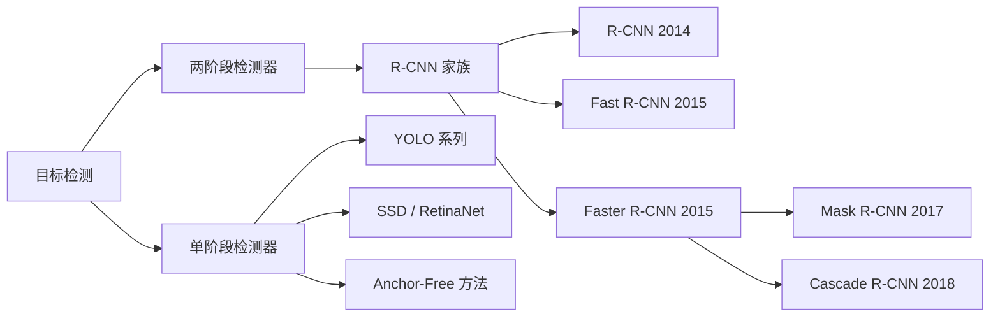
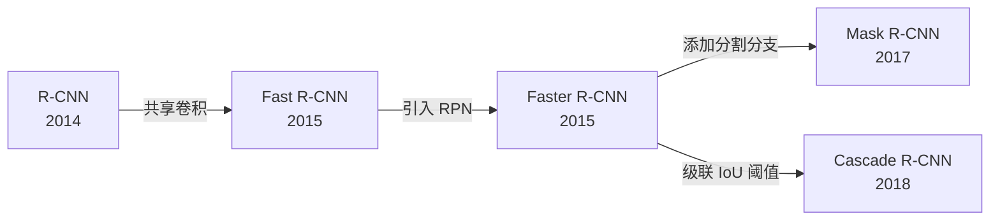
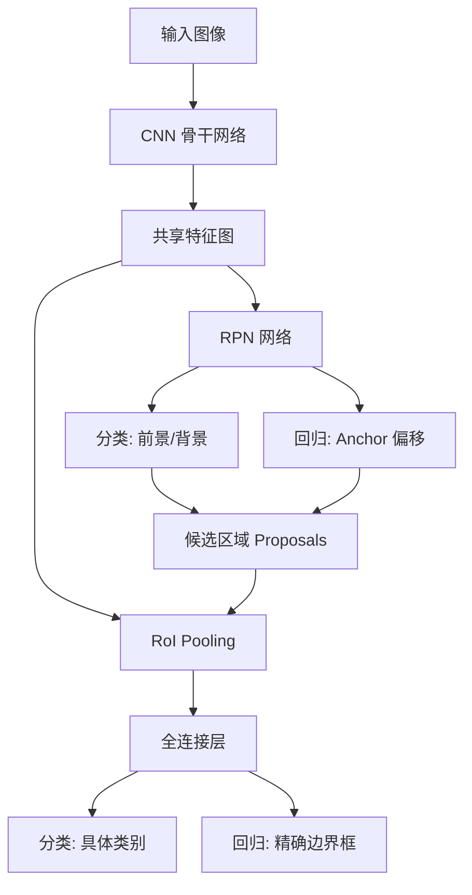
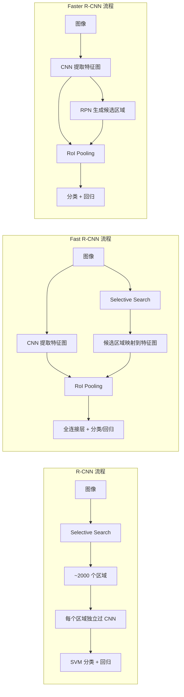

# R-CNN / Fast R-CNN / Faster R-CNN

## 知识地图



## 前置知识

- 卷积神经网络 (CNN) 的基本原理：卷积、池化、全连接层
- 图像分类任务与经典分类网络 (AlexNet, VGG, ResNet)
- IoU (Intersection over Union) 的定义与计算
- 边界框回归的基本概念
- 非极大值抑制 (NMS) 的作用

## 模型演化路线



| 模型 | 年份 | 关键创新 |
|------|------|----------|
| R-CNN | 2014 | CNN 提取特征替代手工特征，Selective Search 生成候选区域 |
| Fast R-CNN | 2015 | 共享卷积 + RoI Pooling + 多任务损失，端到端训练 |
| Faster R-CNN | 2015 | RPN 替代 Selective Search，真正全神经网络检测 |
| Mask R-CNN | 2017 | RoIAlign + 分割分支，实现实例分割 |
| Cascade R-CNN | 2018 | 级联多个检测头，逐步提高 IoU 阈值 |

## 为什么会出现 (Why)

在 R-CNN 出现之前，目标检测主要依赖**滑动窗口 + 手工特征（HOG, SIFT）+ 分类器（SVM）**的组合。这种方法存在三个致命缺陷：

1. **特征表达能力弱**：手工设计的特征无法捕捉高层语义信息
2. **计算效率极低**：滑动窗口产生海量候选，每个都要独立提取特征
3. **无法端到端训练**：特征提取和分类器各自独立优化，无法协同提升

深度学习在图像分类上取得突破后，自然的问题是：**能否用 CNN 提取的特征来做检测？** R-CNN 家族就是这一思路的逐步深化。

## 解决什么问题 (Problem)

R-CNN 家族要解决的核心问题是：**如何在图像中同时定位并识别多个物体？** 具体挑战包括：

- 物体的位置未知，需要生成候选区域
- 物体大小不一，需要处理多尺度问题
- 同一图像中存在多个物体，需要逐一处理
- 训练和推理速度需要满足实际应用要求

## 核心思想 (Core Idea)

**用 CNN 提取图像特征，先生成候选区域再分类回归，逐步将检测流程全神经网络化。**

---

## R-CNN (2014)

### 流程

1. **Selective Search** 生成约 2000 个候选区域
2. 每个区域 warp 到固定大小，送入 CNN 提取特征
3. SVM 分类 + 边界框回归

### 问题

- 每个候选区域独立跑 CNN → ~2000 次前向传播
- 训练多阶段、不端到端
- 推理极慢（~47s/图）

---

## Fast R-CNN (2015)

### 核心改进

1. **共享卷积**：整张图只过一遍 CNN 得到特征图
2. **RoI Pooling**：将任意大小的候选区域映射为固定大小的特征
3. **多任务损失**：分类 + BBox 回归联合训练

### RoI Pooling

将候选区域划分成 $H \times W$ 网格，对每个格子做 Max Pooling。

**通俗解释：** 不管候选框多大，都把它切成固定数量的小格子（比如 7x7），每个格子取最大值，最终得到一个固定大小的特征向量。就像把一张大小不一的照片缩放到固定尺寸，但保留了关键信息。

### 损失函数

$$L = L_{cls}(p, u) + \lambda [u \geq 1] \cdot L_{loc}(t^u, v)$$

- $L_{cls}$：交叉熵
- $L_{loc}$：Smooth L1 Loss
- $[u \geq 1]$：仅对非背景类计算回归损失

**通俗解释：** 损失由两部分组成：分类对不对（交叉熵）+ 框的位置准不准（Smooth L1）。如果这个区域是背景（u=0），就不需要回归框的位置了，因为没有物体。

速度：~3s/图（vs R-CNN 的 47s）。

---

## Faster R-CNN (2015)

### 核心创新：RPN (Region Proposal Network)

不再依赖外部的 Selective Search，用神经网络自己生成候选区域！

### RPN 结构

```
特征图 → 3×3 Conv → 两个分支:
  ├─ 1×1 Conv → 2K 个分数 (K 个锚框各两个：前景/背景)
  └─ 1×1 Conv → 4K 个坐标偏移
```

**通俗解释：** RPN 就像一个"注意力机制"，它在特征图的每个位置问两个问题：(1) 这里有物体吗？(2) 如果有，框大概在哪里？它不用看整张图，而是基于特征图上的每个点做判断。

### Anchor 机制

每个位置预设 $K$ 个锚框（3 种尺度 × 3 种长宽比 = 9 个锚框），RPN 学习预测偏移。

**Anchor 大小**：$128^2, 256^2, 512^2$
**长宽比**：1:1, 1:2, 2:1

**通俗解释：** Anchor 就像"参考模板"。网络不是凭空猜框的位置，而是在预设的参考框基础上做微调。比如参考框是 256x256 的方形，网络预测的是"比参考框宽一点、高一点"这样的偏移量。这比直接预测绝对坐标容易得多。

### 端到端训练

整个网络（RPN + Fast R-CNN）可以端到端联合训练。速度：~0.2s/图（实时！）

---

## 数学模型/公式

### Smooth L1 Loss

$$\text{smooth}_{L1}(x) = \begin{cases} 0.5x^2 & \text{if } |x| < 1 \\ |x| - 0.5 & \text{otherwise} \end{cases}$$

**通俗解释：** Smooth L1 是 L1 和 L2 损失的折中。当预测误差小的时候（|x|<1），用平方损失让梯度逐渐变小更好收敛；当误差大的时候，用线性损失避免离群点产生过大的梯度。这样训练更稳定。

### RPN 的 Anchor 回归

$$t_x = (x - x_a)/w_a, \quad t_y = (y - y_a)/h_a$$
$$t_w = \log(w/w_a), \quad t_h = \log(h/h_a)$$

**通俗解释：** 网络预测的不是绝对坐标，而是相对于 Anchor 的缩放和偏移。tx, ty 是中心点偏移量（相对于 Anchor 宽高做了归一化），tw, th 是对数空间的宽高缩放比。取对数是为了让缩放对称——放大 2 倍和缩小 2 倍在数值上是对称的（log2 = -log(0.5)）。

---

## 模型结构图



## 可视化展示

### R-CNN 家族技术演进

| 方法 | 候选区域 | 特征提取 | 分类器 | 速度 |
|------|----------|----------|--------|------|
| R-CNN | SS | 每区域独立 | SVM | 极慢 (~47s/img) |
| Fast R-CNN | SS | 共享卷积 | Softmax | 慢 (~3s/img) |
| Faster R-CNN | RPN | 共享卷积 | Softmax | 快 (~0.2s/img) |



## 最小可运行代码

```python
import torchvision.models.detection as detection

model = detection.fasterrcnn_resnet50_fpn(pretrained=True)
model.eval()
predictions = model(images)
```

## 工业界应用

| 应用场景 | 为什么选择 Faster R-CNN | 实际案例 |
|----------|----------------------|----------|
| 自动驾驶 | 高精度、小物体检测好 | Waymo, Cruise 早期感知系统 |
| 卫星/航拍图像 | 对密集小目标检测效果好 | 遥感图像分析、城市规划 |
| 工业缺陷检测 | 需要精确定位缺陷位置 | PCB 板检测、纺织品瑕疵检测 |
| 医疗影像 | 高精度病灶检测 | 肺结节检测、乳腺钼靶分析 |
| 安防监控 | 行人/车辆精确检测 | 智能交通系统 |

## 对比表格

| 维度 | R-CNN | Fast R-CNN | Faster R-CNN | YOLOv1 | SSD |
|------|-------|------------|--------------|--------|-----|
| 检测阶段 | 两阶段 | 两阶段 | 两阶段 | 单阶段 | 单阶段 |
| 候选区域 | SS | SS | RPN | 网格 | 默认框 |
| 速度 | ~47s | ~3s | ~0.2s | ~0.02s | ~0.06s |
| 精度 (VOC) | 66% | 70% | 73% | 63% | 74% |
| 小物体 | 差 | 中 | 好 | 差 | 中 |
| 端到端 | 否 | 是 | 是 | 是 | 是 |

## 学完后建议继续学习

1. **Mask R-CNN**：在 Faster R-CNN 基础上增加分割分支，理解实例分割
2. **FPN (Feature Pyramid Network)**：多尺度特征融合，显著提升小物体检测
3. **YOLO 系列**：对比单阶段检测器的设计哲学
4. **Cascade R-CNN**：通过级联 IoU 阈值逐步提升检测质量
5. **Anchor-Free 方法 (FCOS, CenterNet)**：探索无锚框的检测范式

## 高频面试题

### Q1: R-CNN、Fast R-CNN、Faster R-CNN 的核心区别是什么？

**答：** 三者的核心区别在于候选区域的生成方式和特征提取的共享程度。
- **R-CNN**：用 Selective Search 生成候选区域，每个区域独立过 CNN 提取特征，SVM 分类。速度极慢（~47s/图），训练分多阶段。
- **Fast R-CNN**：仍然用 Selective Search，但整张图只过一遍 CNN，通过 RoI Pooling 将候选区域映射为固定大小特征，分类和回归联合训练。速度提升到 ~3s/图。
- **Faster R-CNN**：用 RPN 网络替代 Selective Search，候选区域生成也由神经网络完成。整个流程全神经网络化、端到端可训练。速度达到实时（~0.2s/图）。

一句话总结：**R-CNN 把 CNN 带进检测，Fast R-CNN 让 CNN 共享，Faster R-CNN 让 CNN 生成候选区域。**

### Q2: RoI Pooling 和 RoIAlign 有什么区别？

**答：**
- **RoI Pooling**：在将 RoI 映射到特征图时，坐标直接取整（量化），然后划分网格时再次取整。两次量化导致像素级的 misalignment，对小物体和分割任务影响尤其严重。
- **RoIAlign**：不做量化取整，而是在每个采样点上使用双线性插值获取精确的特征值。这保留了空间精度，对分割任务提升显著（Mask R-CNN 中从 10% 提升到 50% mAP mask）。

### Q3: RPN 中 Anchor 的作用是什么？如何选择 Anchor 的尺度和比例？

**答：** Anchor 是预设的参考框，作用是降低网络预测难度——网络不需要预测绝对坐标，只需预测相对于参考框的偏移。

选择原则：
- **尺度 (Scale)**：根据数据集中物体的典型大小选择。常用 {128, 256, 512} 覆盖小、中、大物体。
- **长宽比 (Aspect Ratio)**：常用 {1:1, 1:2, 2:1} 覆盖方形、竖长、横长的物体。
- 对于特殊场景（如行人检测），可以调整为高大的 Anchor（如 1:3）；对于车辆检测，可以增加宽 Anchor 比例。
- 实践中可以使用 K-Means 聚类分析数据集中的标注框尺寸来定制 Anchor。

### Q4: Smooth L1 Loss 为什么比 L1 和 L2 Loss 更适合边界框回归？

**答：**
- **L2 Loss**：对离群点（误差大的预测）惩罚过重，梯度会随误差线性增大，可能造成训练不稳定，梯度爆炸。
- **L1 Loss**：在零点处不可导（梯度不连续），训练后期在最优解附近振荡，难以精细收敛。
- **Smooth L1 Loss**：融合两者优点。误差小（|x| < 1）时用 L2 形式（平方），梯度逐渐减小，利于精细收敛；误差大时用 L1 形式（线性），梯度恒定，不会被离群点主导。在零点处可导，训练全程光滑稳定。

### Q5: Faster R-CNN 的训练策略是什么？RPN 和检测网络如何联合训练？

**答：** 主要有两种训练策略：
1. **交替训练 (Alternating Training)**：先训练 RPN，用 RPN 生成的 proposals 训练 Fast R-CNN，再用 Fast R-CNN 的骨干微调 RPN，如此交替迭代。这是原始论文采用的方法。
2. **近似联合训练 (Approximate Joint Training)**：将 RPN 和 Fast R-CNN 视为一个网络，前向时 RPN 生成 proposals 直接送入 RoI Pooling；反向时忽略 proposals 对 RPN 的梯度（因为 proposals 的坐标是离散的，梯度不可导）。这种方法速度更快，实践中更常用。
3. **非近似联合训练**：需要 RoI Warping 层可导，理论上更优但实现复杂。

现代实现（如 PyTorch torchvision）通常采用近似联合训练，简单高效。
