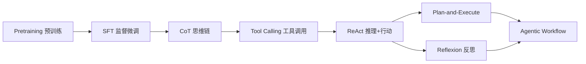
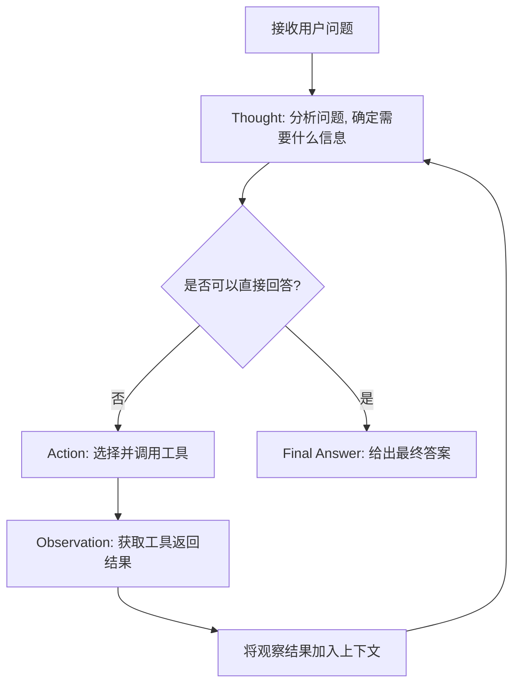
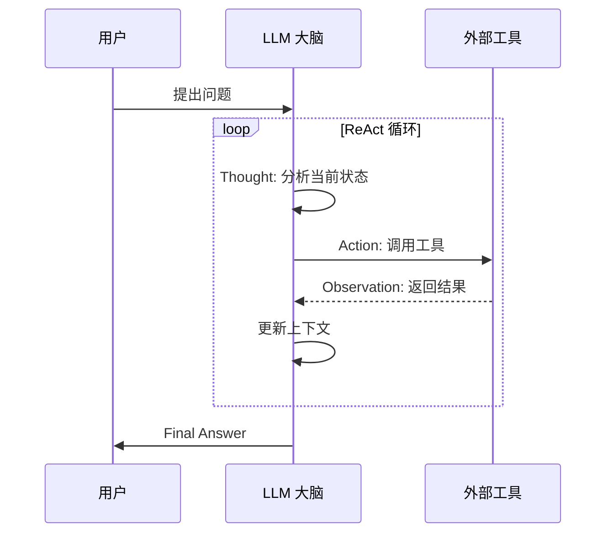

# ReAct (Reasoning + Acting)

## 知识地图



## 前置知识

- **CoT (Chain-of-Thought)**：理解让模型逐步推理的基本方法
- **Few-Shot Prompting**：理解在 prompt 中提供示例的模式
- **Function Calling**：理解 LLM 调用外部工具的基本机制
- **LLM 的幻觉问题**：理解模型在缺乏外部信息时可能编造事实

## 为什么会出现 (Why)

CoT 让模型可以一步步推理，但它无法获取外部信息——推理过程中的"事实"完全依赖模型内部知识，而这可能是：
- **过时的**：训练数据截止日期后的信息无法获取
- **错误的**：模型可能编造看似合理但实际不存在的事实（幻觉）
- **不完整的**：无法访问实时数据、私有数据库或精确计算结果

单纯的工具调用则缺乏推理能力——无法将多步工具调用串联成有逻辑的推理链。

## 解决什么问题 (Problem)

将**推理能力**和**行动能力**结合在一起：用推理指导何时调用什么工具，用工具返回的事实信息校正推理方向。解决的是"需要多步推理 + 外部信息获取"的复合问题（如：多跳问答、事实核查、需要计算的推理题）。

## 核心思想

ReAct 将**推理 (Reasoning)** 和**行动 (Acting)** 交织在一起，让 LLM 可以调用工具获取外部信息，根据反馈调整推理方向。

## 算法流程



### 循环流程

```
Thought → Action → Observation → Thought → Action → ... → Final Answer
```

### 示例

```
Question: 苹果公司的 CEO 是谁，他多大了？

Thought: 我需要知道苹果公司的 CEO 是谁。
Action: Search[苹果公司 CEO]
Observation: 蒂姆·库克 (Tim Cook)，2011 年起担任 CEO

Thought: 现在我需要知道蒂姆·库克的年龄。
Action: Search[蒂姆·库克 出生日期]
Observation: 蒂姆·库克出生于 1960 年 11 月 1 日

Thought: 我可以计算年龄了。
现在 2024 年，2024-1960=64。

Final Answer: 苹果公司的 CEO 是蒂姆·库克，他今年 64 岁（2024年）。
```

## 为什么需要 ReAct？

单纯的推理（如 CoT）存在**幻觉**问题——模型可能编造事实。

单纯的动作（如直接搜索）缺乏**推理能力**——无法处理需要多步推理的复杂问题。

ReAct 结合两者：推理指导行动，行动验证推理。

## 数学模型/公式

### ReAct 轨迹概率

给定问题 $q$，ReAct 生成一个交替的 Thought-Action-Observation 序列：

$$P(\text{trajectory}|q) = \prod_{t=1}^{T} P(\text{Thought}_t | q, \text{History}_{<t}) \cdot P(\text{Action}_t | q, \text{History}_{<t}, \text{Thought}_t)$$

**通俗解释：** ReAct 的每一步都像一个"迷你决策"：先根据已有的所有信息思考（Thought），然后根据思考结果决定做什么（Action）。整个过程是条件概率的累积——每一步都依赖于之前的所有步骤。

### 最终答案的生成

$$\text{Answer} = \arg\max_{a} P(a | q, \text{Thought}_{1:T}, \text{Action}_{1:T}, \text{Observation}_{1:T})$$

**通俗解释：** 在所有思考、行动和观察完成后，模型基于完整的推理轨迹生成最终答案。因为有 Observation 的参与，答案比纯 CoT 更可靠。

## 常用工具 (Actions)

| 工具 | 功能 |
|------|------|
| Search | 搜索网络获取信息 |
| Lookup | 精确查找关键词 |
| Calculator | 数学计算 |
| Finish | 给出最终答案 |

## Prompt 模板

```
Solve a question answering task with interleaving
Thought, Action, Observation steps.

你可以使用以下工具:
- Search[query]: 搜索互联网
- Lookup[keyword]: 在搜索结果中精确定位
- Finish[answer]: 返回最终答案

{examples}

Question: {question}
```

实际实现中，根据模型的输出格式解析 Thought / Action / Observation 标签。

## 可视化展示



## 最小可运行代码

```python
def react_loop(question, max_steps=10):
    context = ""
    for step in range(max_steps):
        prompt = build_prompt(question, context)
        response = llm(prompt)
        thought, action = parse(response)

        if action.startswith("Finish"):
            return extract_answer(action)

        observation = execute_action(action)
        context += f"Thought: {thought}\n"
        context += f"Action: {action}\n"
        context += f"Observation: {observation}\n"
```

### 完整的 ReAct 实现 (基于 OpenAI)

```python
import openai
import re

TOOLS = {
    "Search": lambda q: f"搜索结果: 关于'{q}'的信息...",
    "Calculator": lambda expr: str(eval(expr)),
}

def parse_react_output(text):
    """解析 LLM 输出的 Thought/Action/Observation"""
    thought = re.search(r"Thought:\s*(.+?)(?=Action:|$)", text, re.DOTALL)
    action = re.search(r"Action:\s*(\w+)\[(.+?)\]", text)
    finish = re.search(r"Finish\[(.+?)\]", text)
    return thought, action, finish

def react_agent(question, max_steps=10):
    history = [f"Question: {question}"]
    for step in range(max_steps):
        prompt = "\n".join(history) + "\n"
        response = openai.chat.completions.create(
            model="gpt-4",
            messages=[{"role": "user", "content": prompt}],
        )
        text = response.choices[0].message.content
        thought, action, finish = parse_react_output(text)

        if finish:
            return finish.group(1)

        if action:
            tool_name = action.group(1)
            tool_input = action.group(2)
            result = TOOLS.get(tool_name, lambda x: "Unknown tool")(tool_input)
            history.append(f"Thought: {thought.group(1)}")
            history.append(f"Action: {tool_name}[{tool_input}]")
            history.append(f"Observation: {result}")

    return "达到最大步数限制"
```

## 工业界应用

| 产品/系统              | ReAct 应用场景             | 说明                                   |
| ---------------------- | -------------------------- | -------------------------------------- |
| ChatGPT (OpenAI)       | 搜索 + 推理                | 用户提问 → 搜索网络 → 整合回答         |
| Claude (Anthropic)     | Tool Use + 推理            | 文件读取、代码执行、搜索               |
| LangChain Agents       | 通用 ReAct Agent           | 内置 ReAct 模式的 Agent 框架           |
| WebGPT                 | 网页浏览 + QA              | 搜索网页并利用 ReAct 回答复杂问题      |
| Gemini (Google)        | Grounding + 推理           | Google Search 作为工具，增强事实性     |

## 对比表格

|                      | CoT             | ReAct              | Agentic Workflow       |
| -------------------- | --------------- | ------------------ | ---------------------- |
| 与外界交互           | 无              | 有 (工具)          | 有 (多工具 + 记忆)     |
| 推理方式             | 线性链          | 循环               | 复杂工作流 / DAG       |
| 错误恢复             | 差              | 中                 | 好 (Reflexion)         |
| Token 消耗           | 低              | 中                 | 高                     |
| 适用场景             | 数学/逻辑推理   | QA / 事实核查      | 复杂任务自动化         |
| 实现复杂度           | 低              | 中                 | 高                     |

## 学完后建议继续学习

- **Agentic Workflows**：更复杂的 Agent 设计模式（Plan-and-Execute、Reflexion、Multi-Agent）
- **Function Calling 深入**：OpenAI / Anthropic 的工具调用 API 细节
- **LangGraph**：基于图状态机的 Agent 编排框架
- **RAG (检索增强生成)**：与 ReAct 配合使用的知识检索方案
- **Prompt Engineering 进阶**：Few-Shot 示例的选择和排列策略

## 高频面试题

### Q1: ReAct 和 CoT 的核心区别是什么？

**标准答案：** CoT (Chain-of-Thought) 只做推理，不获取外部信息，所有推理依赖模型内部知识；ReAct 将推理和行动交织在一起，在推理过程中可以调用外部工具获取实时信息，然后基于观察结果继续推理。CoT 适合纯逻辑/数学推理任务，ReAct 适合需要外部知识或事实核查的任务。ReAct 包含 CoT 的推理能力，同时增加了与外部世界交互的能力。

### Q2: ReAct 循环中的 Thought / Action / Observation 分别是什么？

**标准答案：** Thought（推理）是 LLM 分析当前状态、判断需要什么信息或操作的思考过程；Action（行动）是 LLM 调用具体工具执行的操作，如 Search[keyword]；Observation（观察）是工具返回的结果，作为新上下文输入 LLM。三者构成一个闭环：Thought 决定 Action，Action 产生 Observation，Observation 影响下一轮 Thought。

### Q3: ReAct 如何缓解 LLM 的幻觉问题？

**标准答案：** ReAct 通过"外部事实校验"机制缓解幻觉：当模型需要事实信息时，它不依赖内部知识编造，而是通过 Action 调用搜索工具获取真实数据作为 Observation。Observation 是外部系统返回的真实信息（而非模型生成的），因此可以作为"事实锚点"纠正模型的错误认知。此外，多步循环允许模型在发现矛盾时进行自我纠正。

### Q4: ReAct 在实际应用中可能遇到哪些问题？

**标准答案：** (1) 工具选择错误：模型可能选错工具或传错参数，需要清晰的工具描述和 Few-Shot 示例来缓解；(2) 无限循环：模型陷入 Thought-Action 循环无法停止，需要设置 max_steps 上限；(3) 上下文膨胀：每步循环都累积到上下文中，长任务可能超窗口，需要摘要压缩；(4) 解析错误：模型的输出格式可能不符合 Thought/Action 的解析规则，需要 robust 的解析逻辑或结构化输出 API。

### Q5: ReAct 和 Agentic Workflow 的关系是什么？

**标准答案：** ReAct 是 Agentic Workflow 的核心执行单元和最基础的循环模式。Agentic Workflow 在 ReAct 的基础上增加了更多设计模式：(1) Plan-and-Execute（先规划再执行，而非边想边做）；(2) Reflexion（执行后反思并重试）；(3) Multi-Agent（多角色协作）。可以把 ReAct 理解为 Agent 系统的"原子操作"，而 Agentic Workflow 是这些原子操作组成的复杂工作流。
