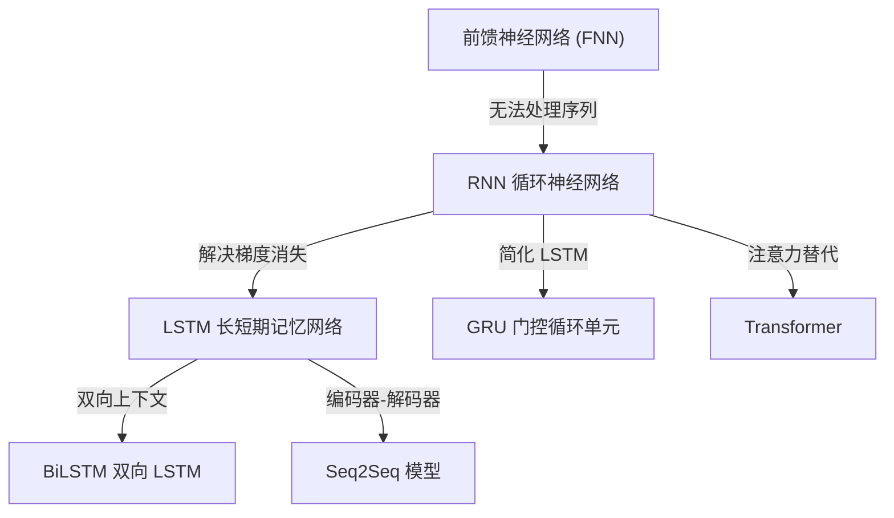
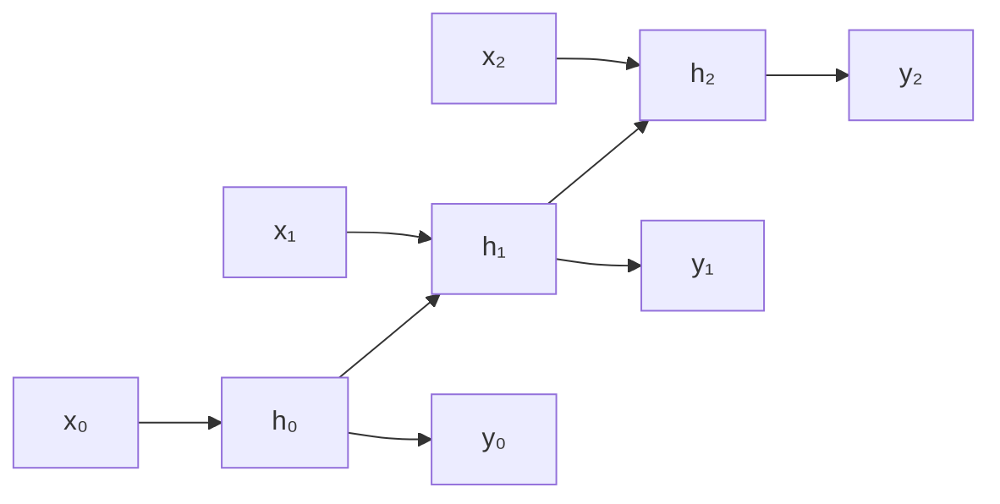
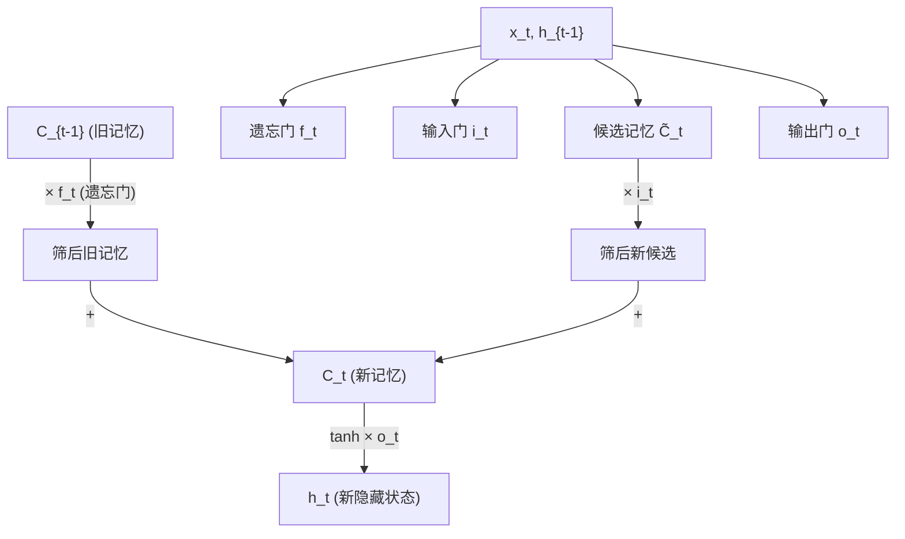

# RNN / LSTM / GRU / BiLSTM

## 知识地图



## 前置知识

- 前馈神经网络（全连接层、激活函数）
- 反向传播（链式法则求导）
- 矩阵乘法和逐元素操作
- 序列数据的基本概念（时间步、序列长度）

## 为什么会出现 (Why)

前馈神经网络假设所有输入是独立的，无法建模序列中的时序依赖关系。例如，在语言建模中，下一个词取决于前面所有词；在视频分析中，当前帧与历史帧密切相关。循环神经网络通过引入**隐藏状态**在时间步之间传递信息，使得网络拥有了"记忆"。

## 解决什么问题 (Problem)

对序列数据进行建模——自然语言处理（机器翻译、文本生成）、语音识别、时间序列预测、视频理解等。RNN 家族让网络能够利用历史信息来影响当前输出，解决了传统前馈网络"看过就忘"的根本缺陷。

## 核心思想 (Core Idea)

**RNN 通过隐藏状态 h_t 在时间步之间传递信息，LSTM 和 GRU 分别用门控机制和记忆单元解决了长序列训练中的梯度消失问题。**

---

## RNN (循环神经网络)

### 数学模型

$$h_t = \tanh(W_{hh} h_{t-1} + W_{xh} x_t + b)$$

$$y_t = W_{hy} h_t + b_y$$

**通俗解释：** 当前时刻的隐藏状态 $h_t$ 由两部分构成——上一时刻的记忆 $h_{t-1}$ 和当前输入 $x_t$，两者分别乘以权重矩阵后相加，再通过 $\tanh$ 压缩到 $(-1, 1)$ 之间。输出 $y_t$ 则是从 $h_t$ 再做一次线性变换。

### 梯度消失/爆炸

BPTT (Backpropagation Through Time) 中对隐藏状态的梯度包含连乘：

$$\frac{\partial L}{\partial h_0} \sim \prod_{t=1}^{T} W_{hh}^T \cdot \text{diag}(\tanh')$$

- $\lambda_{\max} < 1$：梯度指数衰减（梯度消失）
- $\lambda_{\max} > 1$：梯度指数增长（梯度爆炸）

**通俗解释：** 反向传播时，梯度要穿越所有时间步一路乘回去。如果每一步乘的因子都小于 1（$\tanh$ 的导数最大为 1，再加上权重通常较小），乘到第 100 步时梯度几乎为零，前面的时间步学不到任何东西。反之，若因子大于 1，梯度爆炸使更新过猛，模型震荡不收敛。

梯度爆炸用**梯度裁剪**解决；梯度消失催生了 LSTM 和 GRU。

---

## LSTM (长短期记忆网络)

### 三个门控制信息流

**遗忘门**：$f_t = \sigma(W_f \cdot [h_{t-1}, x_t] + b_f)$

**通俗解释：** 决定从记忆单元 $C_{t-1}$ 中"遗忘"哪些旧信息。Sigmoid 输出 0~1，0 表示完全遗忘，1 表示完全保留。

**输入门**：$i_t = \sigma(W_i \cdot [h_{t-1}, x_t] + b_i)$

**通俗解释：** 决定将多少新信息写入记忆单元，相当于"信息闸门"。

**候选记忆**：$\tilde{C}_t = \tanh(W_C \cdot [h_{t-1}, x_t] + b_C)$

**通俗解释：** 基于当前输入和上一隐藏状态计算"候选的新记忆"，$\tanh$ 压缩到 $(-1, 1)$。

**更新记忆**：$C_t = f_t \odot C_{t-1} + i_t \odot \tilde{C}_t$

**通俗解释：** 新记忆 = 遗忘门筛过的旧记忆 + 输入门筛过的新候选记忆。这是 LSTM 的核心——记忆单元 $C_t$ 像一条"高速公路"，梯度可以通过 $f_t$ 的逐元素乘法直接回传（无需经过 $\tanh$ 或多次矩阵乘法），从而解决了梯度消失问题。

**输出门**：$o_t = \sigma(W_o \cdot [h_{t-1}, x_t] + b_o)$

**通俗解释：** 决定记忆单元中的哪些信息需要输出为当前隐藏状态。

**隐藏状态**：$h_t = o_t \odot \tanh(C_t)$

**通俗解释：** 输出门选中的那部分记忆，经过 $\tanh$ 压缩后作为当前时刻的隐藏状态输出。

---

## GRU (门控循环单元)

### LSTM 的简化版 -- 两个门

**更新门**：$z_t = \sigma(W_z \cdot [h_{t-1}, x_t])$

**通俗解释：** 控制多少旧信息保留、多少新信息写入。$z_t$ 同时承担了 LSTM 中遗忘门和输入门的功能。

**重置门**：$r_t = \sigma(W_r \cdot [h_{t-1}, x_t])$

**通俗解释：** 决定在计算候选状态时"忽略"多少旧信息。$r_t \approx 0$ 时相当于"重置"记忆，让模型像在读新序列的第一个词。

**候选隐藏状态**：$\tilde{h}_t = \tanh(W \cdot [r_t \odot h_{t-1}, x_t])$

**通俗解释：** 用重置门"筛选"过的旧记忆加上当前输入，计算出候选的新状态。

**新隐藏状态**：$h_t = (1 - z_t) \odot h_{t-1} + z_t \odot \tilde{h}_t$

**通俗解释：** 插值融合——$z_t$ 决定取多少新候选，$1-z_t$ 决定留多少旧状态。这与 LSTM 的 $C_t$ 更新思路一致，但没有独立的记忆单元，更简洁。

GRU 比 LSTM 参数少约 25%，在很多任务上效果相当。

---

## BiLSTM (双向 LSTM)

同时从前向和后向处理序列，将两个方向的隐藏状态拼接：

$$h_t^{\text{bi}} = [\overrightarrow{h_t}; \overleftarrow{h_t}]$$

**通俗解释：** 同时看一句话的"前文"和"后文"。比如"我_苹果"这个位置的词，前向 LSTM 知道前面是"我"，后向 LSTM 知道后面是"苹果"——两者结合就能推断出这里可能是"吃"。

这在 NLP 任务中非常有效，因为一个词的上下文同时包含前文和后文。

---

## 可视化展示

### RNN 时间步展开



### LSTM 门控机制示意



---

## 最小可运行代码

### PyTorch 实现

```python
import torch
import torch.nn as nn

lstm = nn.LSTM(input_size=128, hidden_size=256,
               num_layers=2, batch_first=True, bidirectional=True)

gru = nn.GRU(input_size=128, hidden_size=256,
             num_layers=2, batch_first=True)

# 手写 LSTM 前向传播 (用于理解)
def lstm_step(x, h_prev, c_prev, W_f, W_i, W_C, W_o):
    """单步 LSTM 计算 (仅作教学用途)"""
    combined = torch.cat([h_prev, x], dim=-1)
    f = torch.sigmoid(W_f @ combined)       # 遗忘门
    i = torch.sigmoid(W_i @ combined)       # 输入门
    c_tilde = torch.tanh(W_C @ combined)     # 候选记忆
    c = f * c_prev + i * c_tilde            # 更新记忆
    o = torch.sigmoid(W_o @ combined)       # 输出门
    h = o * torch.tanh(c)                   # 隐藏状态
    return h, c
```

---

## 工业界应用

| 模型 | 应用场景 | 典型项目/产品 |
|------|----------|-------------|
| RNN | 短序列分类、简单时间序列 | 早期股票预测模型 |
| LSTM | 机器翻译、语音识别、文本生成 | Google NMT、Siri 语音识别、DeepSpeech |
| GRU | 计算资源受限的序列建模 | 移动端语音助手、嵌入式设备 |
| BiLSTM | 命名实体识别、词性标注、阅读理解 | spaCy、ELMo 嵌入 |
| Stacked LSTM | 复杂序列到序列任务 | 早期 Seq2Seq 翻译模型 |

---

## 对比表格

| | RNN | LSTM | GRU | BiLSTM |
|------|-----|------|-----|--------|
| 门数量 | 0 | 3 (遗忘/输入/输出) | 2 (更新/重置) | 同 LSTM × 2 |
| 记忆单元 | 无 (仅有 h) | 有 (C_t + h_t) | 无 (仅有 h_t) | 有 |
| 长期依赖 | 差 | 好 | 好 | 好 |
| 参数量 | 少 | 多 | 中等 (~75% LSTM) | LSTM 的两倍 |
| 训练速度 | 快 | 慢 | 较快 | 最慢 |
| 上下文方向 | 单向 | 单向 | 单向 | 双向 |
| 典型场景 | 教学演示 | 序列生成/翻译 | 移动端部署 | NER/词性标注 |

---

## 学完后建议继续学习

1. **Transformer / Attention** -- RNN 的替代方案，解决了长距离依赖和并行化问题
2. **Seq2Seq with Attention** -- LSTM 编码器-解码器 + 注意力机制
3. **状态空间模型 (Mamba / S4)** -- 新一代序列建模架构，兼具 RNN 的效率与 Transformer 的效果
4. **Layer Normalization** -- RNN 训练中常用的归一化技巧

---

## 高频面试题

### Q1: RNN 为什么会出现梯度消失？LSTM 如何解决？

**答：** RNN 的梯度消失源于 BPTT 中隐藏状态梯度的连乘效应。梯度表达式为 $\frac{\partial L}{\partial h_0} \sim \prod_{t=1}^{T} W_{hh}^T \cdot \text{diag}(\tanh')$，其中 $\tanh'$ 最大值为 1，$W_{hh}$ 的特征值通常小于 1，因而 $T$ 步连乘后梯度指数衰减至零。

LSTM 通过**记忆单元 $C_t$ 的线性传递**解决此问题：$C_t = f_t \odot C_{t-1} + i_t \odot \tilde{C}_t$。梯度回传时 $C_t$ 到 $C_{t-1}$ 只需经过 $f_t$ 的逐元素乘法，无需多次矩阵乘法和非线性激活，形成了"梯度高速公路"（gradient highway）。遗忘门 $f_t$ 可以学习接近 1 的值，让梯度几乎无损地穿越数百个时间步。

### Q2: LSTM 和 GRU 的核心区别是什么？如何选择？

**答：** LSTM 有三个门（遗忘门、输入门、输出门）和一个独立的记忆单元 $C_t$；GRU 将遗忘门和输入门合并为**更新门**，取消了独立的记忆单元，隐藏状态 $h_t$ 同时承担记忆和输出的角色。GRU 参数比 LSTM 少约 25%。

选择建议：数据量大、任务复杂时优先 LSTM（更强的表达能力）；计算资源受限或在中小数据集上时优先 GRU（更快的训练速度，效果接近）。实际工程中两者通常都可以，差异不大，更关键的是正则化和超参调优。

### Q3: BiLSTM 为什么比单向 LSTM 效果好？有什么局限？

**答：** BiLSTM 同时从前向和后向处理序列，将两个方向的隐藏状态拼接 $h_t^{\text{bi}} = [\overrightarrow{h_t}; \overleftarrow{h_t}]$。在 NLP 任务中，一个词的语义往往同时依赖前文和后文（例如，命名实体识别中"苹果很好吃"vs"苹果发布了新手机"，需要后文判断"苹果"是指水果还是公司）。

局限：必须看到完整序列才能计算（不适合实时流式处理）；训练时必须将整个序列送入，无法做因果语言模型的自回归生成（GPT 类模型只用单向）；推理延迟翻倍。

### Q4: 什么时候用 RNN/LSTM，什么时候用 Transformer？

**答：** Transformer 是当前主流选择——并行训练、长距离依赖建模强、规模可扩展性好。RNN/LSTM 仍有适用场景：(1) 推理延迟极其敏感的实时应用（Transformer 自回归每步需计算全部历史 K/V）；(2) 极长序列在线流处理（状态空间模型出现后也在减少）；(3) 资源极受限的嵌入式设备。总体趋势是 Transformer 主导，RNN 退居特定领域（如小型时间序列预测）。

### Q5: 解释 LSTM 中"遗忘门"为什么设计成接近 1 的初始化？

**答：** 许多 LSTM 实现将遗忘门的偏置 $b_f$ 初始化为 1（而非 0），使得 $\sigma(1) \approx 0.73$，即默认"倾向于记住"。原因：训练初期模型还不懂得何时该遗忘，如果遗忘门默认接近 0，记忆单元刚写入的信息会立刻被洗掉，模型难以学习长距离依赖。给遗忘门一个"先记住再说"的初始偏向，让模型先学会建立长程连接，再逐步学会何时遗忘。这是 LSTM 调优中的一个重要实践技巧（最早由 Jozefowicz et al., 2015 系统研究并推荐）。
