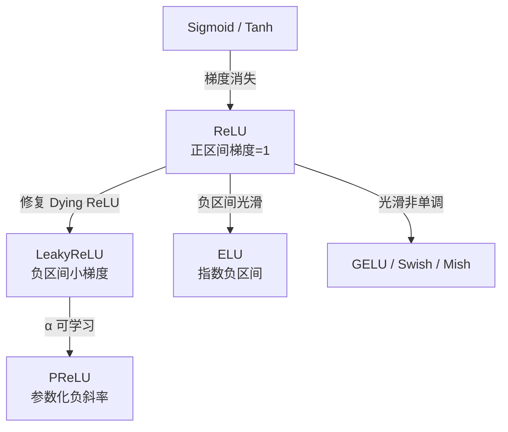

# ReLU / LeakyReLU / PReLU / ELU

## 知识地图



## 前置知识

- 神经网络中激活函数的作用（引入非线性）
- Sigmoid 和 Tanh 的饱和区与梯度消失问题
- 反向传播中梯度的链式法则
- 神经网络训练的基本流程

## 为什么会出现 (Why)

在 ReLU 出现之前，Sigmoid 和 Tanh 是主流的激活函数。但它们有致命缺陷：当输入绝对值较大时，函数进入饱和区，梯度趋近于零，导致深层网络几乎无法训练（梯度消失）。ReLU 用"一刀切"的方式解决了这个问题——正区间梯度恒为 1，计算仅需一次 `max(0, x)`。但它也引入了新问题：**Dying ReLU**（神经元永久失活）。

## 解决什么问题 (Problem)

寻找一种激活函数，同时满足：(1) 正区间梯度不消失；(2) 负区间不完全为零以保持梯度流动；(3) 计算高效。LeakyReLU、PReLU、ELU 都是 ReLU 基础上的"修补"，核心目标是保持 ReLU 优点的同时，让负区间也有一线生机。

## 核心思想 (Core Idea)

**ReLU 用"一刀切"解决 Sigmoid/Tanh 的梯度消失——正区间梯度恒为 1；LeakyReLU/PReLU/ELU 在此基础上为负区间引入非零梯度，修复 Dying ReLU 问题。**

---

## 数学定义与原理解析

### ReLU (Rectified Linear Unit)

$$
\text{ReLU}(x) = \max(0, x)
$$

$$
\text{ReLU}'(x) = \begin{cases} 1 & x > 0 \\ 0 & x \leq 0 \end{cases}
$$

**通俗解释：** 大于 0 就原样输出（梯度为 1，畅通无阻），小于等于 0 就一刀切断输出 0（梯度为 0，断路）。计算就是简单的比较操作，极其高效。

**优势**：正区间梯度恒为 1，消除梯度消失；计算极其简单；产生稀疏激活（约 50% 神经元输出为零）。

**Dying ReLU 问题**：若某个神经元对所有样本都输出负值 → 梯度为 0 → 权重永不更新 → 该神经元"死亡"。常见诱因：学习率过大使权重跳入"全负区域"、负偏置过大。

### LeakyReLU

$$
\text{LeakyReLU}(x) = \begin{cases} x & x > 0 \\ \alpha x & x \leq 0 \end{cases}, \quad \alpha = 0.01
$$

**通俗解释：** 正区间和 ReLU 一样（原样输出），负区间不再是死路一条，而是"放一条窄缝"——保留一个微小的斜率 $\alpha = 0.01$，让"濒死"神经元有机会通过这个窄缝接收梯度并复活。

### PReLU (Parametric ReLU)

$$
\text{PReLU}(x) = \begin{cases} x & x > 0 \\ \alpha x & x \leq 0 \end{cases}
$$

**通俗解释：** 和 LeakyReLU 公式完全一样，但 $\alpha$ 不再是人工设定的固定值，而是变为**可学习参数**（每个通道独立），由反向传播自动调整。不需要人工调参——数据自己决定负区间该有多大的"缝隙"。

### ELU (Exponential Linear Unit)

$$
\text{ELU}(x) = \begin{cases} x & x > 0 \\ \alpha(e^x - 1) & x \leq 0 \end{cases}
$$

**通俗解释：** 正区间同上。负区间不再用线性（$x < 0$ 时线性会造成负输出向 $-\infty$ 发散），而是用指数的"软着陆"——$x$ 越负，输出趋近于 $-\alpha$（下界），不会无限发散。这使得负区间输出的均值趋近于零，加速训练收敛（因为网络每层的输入均值为 0 是最理想的状态）。

- 负区间输出均值趋近于零（**加速收敛**）
- 处处可导（在 $x=0$ 处也是光滑的，不像 ReLU 在 0 处有拐角）
- 代价：涉及指数运算，计算稍慢

---

## 可视化展示

### 五种激活函数对比

```echarts
return {
  xAxis: { type: 'value', min: -5, max: 5, name: 'x' },
  yAxis: { type: 'value', min: -1.5, max: 5, name: 'f(x)' },
  legend: { top: 28,  data: ['ReLU', 'LeakyReLU', 'PReLU(alpha=0.1)', 'ELU', 'GELU'] },
  series: [
    {
      name: 'ReLU', type: 'line', smooth: false,
      lineStyle: { color: '#2c3e50', width: 2.5 },
      data: (function() {
        const d = [];
        for (let i = -5; i <= 5; i += 0.05) d.push([i, Math.max(0, i)]);
        return d;
      })()
    },
    {
      name: 'LeakyReLU', type: 'line', smooth: false,
      lineStyle: { color: '#d35400', width: 2 },
      data: (function() {
        const d = [];
        for (let i = -5; i <= 5; i += 0.05) d.push([i, i > 0 ? i : 0.01 * i]);
        return d;
      })()
    },
    {
      name: 'PReLU(alpha=0.1)', type: 'line', smooth: false,
      lineStyle: { color: '#16a085', width: 1.5, type: 'dashed' },
      data: (function() {
        const d = [];
        for (let i = -5; i <= 5; i += 0.05) d.push([i, i > 0 ? i : 0.1 * i]);
        return d;
      })()
    },
    {
      name: 'ELU', type: 'line', smooth: true,
      lineStyle: { color: '#8e44ad', width: 2 },
      data: (function() {
        const d = [];
        for (let i = -5; i <= 5; i += 0.05) d.push([i, i > 0 ? i : Math.exp(i) - 1]);
        return d;
      })()
    },
    {
      name: 'GELU', type: 'line', smooth: true,
      lineStyle: { color: '#2980b9', width: 2 },
      data: (function() {
        const d = [];
        for (let i = -5; i <= 5; i += 0.05) {
          const x = i;
          const gelu = 0.5 * x * (1 + Math.tanh(Math.sqrt(2 / Math.PI) * (x + 0.044715 * x * x * x)));
          d.push([i, gelu]);
        }
        return d;
      })()
    }
  ],
  tooltip: { trigger: 'axis' },
  grid: { left: 60, right: 20, top: 40, bottom: 60 }
}
```

### Dying ReLU 现象可视化

当偏置 $b$ 为较大负值时，神经元对所有输入输出均为负 → 梯度为零 → 权重冻结。

```echarts
return {
  xAxis: { type: 'value', min: -5, max: 5, name: '输入 x' },
  yAxis: { type: 'value', min: -4, max: 4, name: '输出' },
  legend: { top: 28,  data: ['健康神经元 (b=0)', '死亡神经元 (b=-2)'] },
  series: [
    {
      name: '健康神经元 (b=0)', type: 'line',
      lineStyle: { color: '#16a085', width: 2 },
      data: (function() { const d = []; for (let i = -5; i <= 5; i += 0.05) d.push([i, Math.max(0, i)]); return d; })()
    },
    {
      name: '死亡神经元 (b=-2)', type: 'line',
      lineStyle: { color: '#c0392b', width: 2 },
      data: (function() { const d = []; for (let i = -5; i <= 5; i += 0.05) d.push([i, Math.max(0, i - 2)]); return d; })()
    }
  ],
  tooltip: { trigger: 'axis' },
  grid: { left: 60, right: 20, top: 40, bottom: 60 }
}
```

---

## 最小可运行代码

### PyTorch 使用

```python
import torch
import torch.nn as nn

# ReLU -- 默认首选
nn.ReLU(inplace=True)  # inplace 节省显存

# LeakyReLU
nn.LeakyReLU(negative_slope=0.01)

# PReLU -- 可学习的负斜率
nn.PReLU(num_parameters=1)  # 所有通道共享一个 alpha

# ELU
nn.ELU(alpha=1.0)
```

### NumPy 手写

```python
import numpy as np

def relu(x):
    return np.maximum(0, x)

def leaky_relu(x, alpha=0.01):
    return np.where(x > 0, x, alpha * x)

def elu(x, alpha=1.0):
    return np.where(x > 0, x, alpha * (np.exp(x) - 1))

def relu_derivative(x):
    return (x > 0).astype(float)
```

---

## 工业界应用

| 激活函数 | 代表模型/场景 | 说明 |
|----------|-------------|------|
| ReLU | ResNet / VGG / 多数 CNN | 隐藏层默认首选，久经考验 |
| LeakyReLU | GAN 判别器 | 避免判别器中神经元死亡导致梯度断流 |
| PReLU | ResNet 变体 (He et al., 2015) | 大规模数据集上超越 ReLU |
| ELU | 部分 CNN 训练加速方案 | 收敛快但推理稍慢，训练加速场景 |

---

## 对比表格

| | ReLU | LeakyReLU | PReLU | ELU |
|------|------|-----------|-------|-----|
| 公式 | $\max(0, x)$ | $\max(\alpha x, x)$ | $\max(\alpha x, x)$ | $x>0: x$, else $\alpha(e^x-1)$ |
| 负区间 | 0 | $\alpha x$ (线性) | $\alpha x$ (线性) | $\alpha(e^x-1)$ (指数) |
| 可学习参数 | 无 | 无 ($\alpha$ 固定) | $\alpha$ 可学 | 无 ($\alpha$ 固定) |
| 原点光滑 | 否 | 否 | 否 | 是 |
| 输出均值 | > 0 (有偏) | > 0 | > 0 | ≈ 0 (无偏) |
| 计算速度 | 最快 | 快 | 快 | 慢 (指数运算) |
| Dying ReLU | 存在 | 缓解 | 缓解 | 不存在 |
| 推荐场景 | CNN 隐藏层默认 | 轻微缓解 Dead | 大数据集极致精度 | 追求训练速度 |

---

## 学完后建议继续学习

1. **GELU / Swish / Mish** -- Transformer 时代的光滑非单调激活函数，ReLU 家族的自然进阶
2. **Batch Normalization** -- 与激活函数配合使用，减轻对初始化和激活函数选择的敏感度
3. **Kaiming 初始化 (He Initialization)** -- 专为 ReLU 家族设计的权重初始化，防止梯度消失/爆炸
4. **SELU (Scaled ELU)** -- ELU 的自归一化扩展版本

---

## 高频面试题

### Q1: 什么是 Dying ReLU？如何诊断和解决？

**答：** Dying ReLU 指神经元对所有训练样本输出都小于等于 0，导致梯度恒为 0，权重永不更新，相当于该神经元"死亡"。常见诱因：学习率过大使权重跳入全负区域、负偏置初始化过大。

诊断方法：训练过程中监控每层输出为 0 的比例，如果某层超过 50-60% 且持续增长，可能存在大量死亡神经元。

解决方案：(1) 使用 LeakyReLU/PReLU/ELU 替代；(2) 降低学习率；(3) 使用 Kaiming 初始化（考虑 ReLU 特性设计的初始化方案）；(4) 使用 Batch Normalization 使输入分布更稳定。

### Q2: ReLU 为什么比 Sigmoid/Tanh 更好？

**答：** 三个核心原因：(1) **梯度不消失**：正区间梯度恒为 1，Sigmoid 饱和区梯度趋近于 0；(2) **计算简单**：`max(0, x)` 只需一次比较，Sigmoid/Tanh 需要指数和除法；(3) **稀疏激活**：约 50% 神经元输出为 0，类似隐式的正则化和特征选择。Tanh 虽然输出零中心（比 Sigmoid 好），但同样存在饱和区梯度消失问题。

### Q3: LeakyReLU 的负斜率 $\alpha$ 一般设为多少？为什么不设大一点？

**答：** 通常设为 0.01。设太大的问题：(1) 负区间变成近似线性 $y = \alpha x$，失去了激活函数引入非线性的意义；(2) 负区间输出均值会大幅偏离 0，等效于给下一层加了一个偏置。PReLU 通过数据驱动学习 $\alpha$，是一种更优雅的方案，但需要足够大的数据集来学好这个参数。

### Q4: ELU 为什么能加速训练收敛？代价是什么？

**答：** ELU 加速收敛的核心是**输出均值趋近于零**。当 $x \to -\infty$ 时 ELU 输出趋近于 $-\alpha$，而 ReLU 负区间输出恒为 0。这使得 ELU 的输出以 0 为中心分布（zero-centered），减少了内部协变量偏移（Internal Covariate Shift），让梯度更新更稳定高效，类似 Batch Normalization 但机制不同。

代价：(1) 指数运算 `exp(x)` 比 `max(0,x)` 慢；(2) 推理延迟敏感的场景（如移动端）不适用；(3) 对梯度爆炸仍然没有保护（正区间无界）。

### Q5: 实践中如何选择 ReLU 家族的激活函数？

**答：** 一个实用决策流程：
- 快速原型 / 对延迟不敏感的标准 CNN：直接 **ReLU**
- 训练过程中发现大量死亡神经元：换 **LeakyReLU (0.01)**
- 大规模数据集、追求 SOTA 精度：可以尝试 **PReLU**
- 追求训练速度、推理延迟不敏感：**ELU**
- Transformer 架构：跳过 ReLU 家族，直接用 **GELU**
