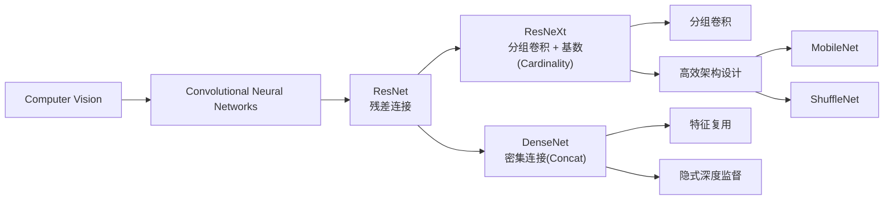
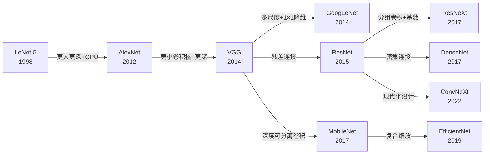
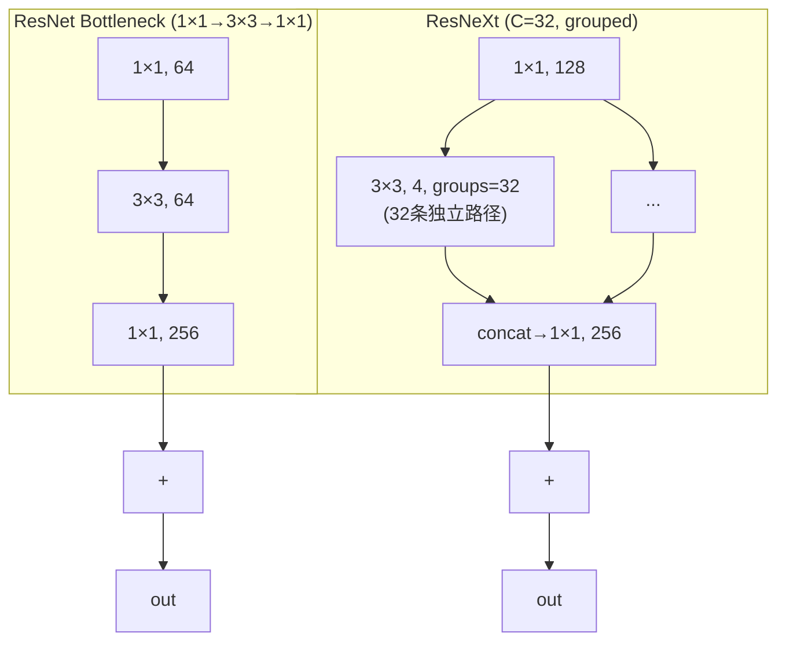
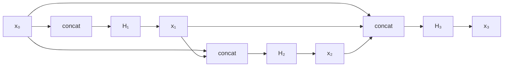

# ResNeXt / DenseNet

## 知识地图



## 前置知识

- ResNet 残差连接和 Bottleneck 结构
- 标准卷积 vs 分组卷积（Grouped Convolution）的区别
- 通道拼接（Concat）和逐元素相加（Add）的区别
- 参数量和 FLOPs 的计算方法
- Batch Normalization 的原理
- ImageNet 图像分类任务

## 模型演化路线



| 模型 | 年份 | 关键创新 | 解决的问题 |
|------|------|---------|-----------|
| ResNet-50 | 2015 | 残差连接 | 深层网络退化 |
| ResNeXt-50 | 2017 | 分组卷积（基数 Cardinality） | 提升宽度效率——比加深/加宽更有效 |
| DenseNet | 2017 | 密集连接（拼接而非相加） | 特征复用和梯度传播效率最大化 |

---

## 核心思想

ResNet 解决的是"深度增加→梯度消失"的问题，但宽度和基数的维度也被证明同样重要。ResNeXt 提出**基数（cardinality）**比深度和宽度更有效——通过分组卷积把一层的计算拆成多个并行分支。DenseNet 走得更极端：每一层都直接连接到前面所有层——不是加和（ResNet）而是拼接（concat），实现特征重用和梯度高速公路。Wide ResNet 则证明有时候"宽而浅"比"窄而深"更好。

---

## ResNeXt — 分组残差

### 为什么会出现

ResNet 解决了训练更深网络的问题，但进一步提升模型容量有三条路：
1. **加深**（更多层）——但 ResNet-100+ 的收益递减
2. **加宽**（更多通道）——但计算量增长迅速（Wide ResNet 证明了有效性但成本高）
3. **加基数**（更多并行分支）——ResNeXt 提出第三条路

Saining Xie 等人受 Inception 模块的"多分支"思想启发，但指出 Inception 需要为每个分支**手工设计不同**的卷积核大小和通道数，这引入了超参数。ResNeXt 的策略是：**所有分支使用相同结构**，只需调一个超参数——组数 C（基数）。

### 解决什么问题

如何在不增加参数量和计算量的前提下，通过改变网络结构的"拓扑"来提升精度。ResNeXt 证明了：**增加基数比增加深度或宽度更有效。**

### 核心思想

**把 ResNet 瓶颈层拆成 C 个并行的小组（每组独立做卷积），用"拆分-变换-聚合"的模式统一了 Inception 和 ResNet 的设计。**

### 数学定义

将 ResNet 瓶颈层的中间 $3 \times 3$ 卷积替换为 $C$ 个并行的分组卷积（$C$ = cardinality）：

每个组的变换 $\mathcal{T}_i(\mathbf{x})$（$1 \times 1$ → $3 \times 3$ → $1 \times 1$ 瓶颈），最终输出为：

$$
\mathbf{y} = \mathbf{x} + \sum_{i=1}^{C} \mathcal{T}_i(\mathbf{x})
$$

等效于分组卷积：中间 $3 \times 3$ 卷积的 groups=32。ResNeXt-50（32×4d）的中间通道宽度 = $C \times 4 = 128$。

**通俗解释：** 传统 ResNet 像一个专家独自处理所有信息。ResNeXt 像把任务分给 C=32 个小组，每组独立分析同一输入，然后把各组的发现汇总。每个小组只处理输入的一小部分（分组卷积），所以总计算量跟一个 ResNet 瓶颈块差不多，但"多视角"的分析带来了更高的精度。

### ResNeXt vs ResNet Block 可视化



---

## DenseNet — 密集连接

### 为什么会出现

ResNet 的 skip connection 是"一层跳一层"（l → l+2），但作者 Gao Huang 等人认为这还不够——**前面的所有层都对后面的所有层有帮助**。ResNet 用的是加法（逐元素相加），这隐含假设了"前面层的特征和当前层的特征在同一个语义空间里"。DenseNet 改用拼接（concat），让后面的层可以直接"看到"前面所有层未经过变换的原始特征。

### 解决什么问题

最大化**特征复用**——不是让后面的层重新学习前面层已经学会的特征，而是直接让后面的层访问前面所有层的输出。这也带来了**隐式的深度监督**——每个层都直接接收最终的梯度信号（因为每层都与最终分类器相连）。

### 核心思想

**每一层的输入是前面所有层输出的拼接（concat），不是相加。增长率 k 控制每层添加多少新信息——即使 k 很小（12-32），网络也能表现很好，因为旧特征被不断复用而不是重新计算。**

### 数学定义

每一层的输入是**前面所有层输出的拼接**：

$$\mathbf{x}_l = H_l([\mathbf{x}_0, \mathbf{x}_1, \ldots, \mathbf{x}_{l-1}])$$

每层输出 $k$ 个特征图（**growth rate**）。第 $l$ 层的输入通道数为：

$$
C_{in}^{(l)} = C_0 + k \times (l-1)
$$

即使 $k$ 很小（如 12），深层也会有很多输入通道——这是特征重用的代价。

**通俗解释（增长率 k）：** 想象一个团队讨论问题。在 ResNet 中，每个人只跟前一个人交流（加法，信息混合）。在 DenseNet 中，每个人都能看到前面所有人的原始发言（拼接，信息不混合），然后基于全部历史信息补充一点新内容（k 个通道）。即使每人只补充很少（k=12），累积的信息也会迅速增长——就像头脑风暴中的知识积累。

### 优势

- 梯度流通更顺畅
- 参数效率更高（特征复用）
- 隐式的深度监督

### 劣势

- 通道数增长快，显存占用大
- 实现需要频繁的内存拼接操作

### DenseNet 连接模式可视化



### 参数效率对比图表

```echarts
return {
  tooltip: { trigger: "axis", confine: true },
  title: { top: 5,  text: 'ImageNet Top-1 Accuracy vs Params', left: 'center', textStyle: { fontSize: 12 } },
  xAxis: { type: 'value', name: '参数量 (M)' },
  yAxis: { type: 'value', name: 'Top-1 Accuracy (%)', min: 75, max: 82 },
  series: [
    { name: 'ResNet', type: 'scatter', symbolSize: 14,
      data: [[25.6, 76.1], [44.5, 77.4], [60.2, 78.3]],
      itemStyle: { color: '#2980b9' } },
    { name: 'ResNeXt', type: 'scatter', symbolSize: 14,
      data: [[25.0, 77.8], [44.2, 78.8]],
      itemStyle: { color: '#16a085' } },
    { name: 'DenseNet', type: 'scatter', symbolSize: 14,
      data: [[8.0, 74.9], [20.0, 77.6], [28.4, 78.2]],
      itemStyle: { color: '#d35400' } }
  ],
  grid: { left: 60, right: 20, top: 55, bottom: 60 }
}
```

---

## 参数量对比

| 网络 | 核心思路 | 参数效率 |
|------|---------|---------|
| ResNet-50 | 残差连接 | 25.6M |
| ResNeXt-50 (32×4d) | 分组卷积（基数=32） | 25.0M |
| DenseNet-121 | 密集连接（k=32） | 8.0M |
| Wide ResNet-50-2 | 加倍宽度 | 68.9M |

---

## 最小可运行代码

### ResNeXt Bottleneck

```python
import torch
import torch.nn as nn

class ResNeXtBottleneck(nn.Module):
    expansion = 4

    def __init__(self, in_planes, planes, cardinality=32, stride=1):
        super().__init__()
        mid_planes = cardinality * planes // cardinality  # 每个组的宽度
        self.conv1 = nn.Conv2d(in_planes, mid_planes, 1, bias=False)
        self.bn1 = nn.BatchNorm2d(mid_planes)
        # 分组卷积（cardinality 个组）
        self.conv2 = nn.Conv2d(mid_planes, mid_planes, 3,
                               stride=stride, padding=1,
                               groups=cardinality, bias=False)
        self.bn2 = nn.BatchNorm2d(mid_planes)
        self.conv3 = nn.Conv2d(mid_planes, planes * self.expansion, 1, bias=False)
        self.bn3 = nn.BatchNorm2d(planes * self.expansion)

        self.shortcut = nn.Sequential()
        if stride != 1 or in_planes != planes * self.expansion:
            self.shortcut = nn.Sequential(
                nn.Conv2d(in_planes, planes * self.expansion, 1, stride=stride, bias=False),
                nn.BatchNorm2d(planes * self.expansion))

    def forward(self, x):
        out = nn.functional.relu(self.bn1(self.conv1(x)))
        out = nn.functional.relu(self.bn2(self.conv2(out)))
        out = self.bn3(self.conv3(out))
        out += self.shortcut(x)
        return nn.functional.relu(out)


# torchvision 内置
import torchvision.models as models

resnext50 = models.resnext50_32x4d(weights=None)
resnext101 = models.resnext101_32x8d(weights=None)
print(f"ResNeXt-50 params: {sum(p.numel() for p in resnext50.parameters()) / 1e6:.1f}M")
```

### DenseNet DenseBlock

```python
import torch
import torch.nn as nn

class DenseBlock(nn.Module):
    def __init__(self, num_layers, in_channels, growth_rate):
        super().__init__()
        self.layers = nn.ModuleList()
        for i in range(num_layers):
            self.layers.append(self._make_layer(in_channels + i * growth_rate, growth_rate))

    def _make_layer(self, in_c, growth_rate):
        return nn.Sequential(
            nn.BatchNorm2d(in_c),
            nn.ReLU(inplace=True),
            nn.Conv2d(in_c, 4 * growth_rate, 1, bias=False),   # bottleneck
            nn.BatchNorm2d(4 * growth_rate),
            nn.ReLU(inplace=True),
            nn.Conv2d(4 * growth_rate, growth_rate, 3, padding=1, bias=False))

    def forward(self, x):
        features = [x]
        for layer in self.layers:
            out = layer(torch.cat(features, dim=1))
            features.append(out)
        return torch.cat(features, dim=1)


# torchvision 内置
densenet121 = models.densenet121(weights=None)
densenet201 = models.densenet201(weights=None)
print(f"DenseNet-121 params: {sum(p.numel() for p in densenet121.parameters()) / 1e6:.1f}M")
```

---

## 工业界应用

| 模型 | 应用场景 | 原因 |
|------|---------|------|
| ResNeXt-101 | 大规模图像分类基准 | 同等参数下精度显著高于 ResNet-101 |
| ResNeXt | 目标检测 backbone (mmdetection) | 分组卷积在速度和精度间取得平衡 |
| DenseNet-121 | 医学影像分割（如肺结节检测） | 参数效率极高，适合小数据集训练 |
| DenseNet | 超分辨率重建 | 密集连接保留了高分辨率细节 |
| DenseNet-201 | 细粒度分类（鸟类、车型识别） | 特征复用适合捕捉类间细微差异 |

---

## 对比表格

| 维度 | ResNet-50 | ResNeXt-50 (32×4d) | DenseNet-121 |
|------|-----------|-------------------|--------------|
| 年份 | 2015 | 2017 | 2017 |
| 参数量 | 25.6M | 25.0M | 8.0M |
| FLOPs | 4.1G | 4.2G | 2.9G |
| ImageNet Top-1 | 76.1% | 77.8% | 75.0% |
| 连接方式 | 加法 (Add) | 加法 (Add) | 拼接 (Concat) |
| 核心参数 | 深度 | 基数 C=32 | 增长率 k=32 |
| 显存占用 | 中等 | 中等 | 高（拼接导致通道数膨胀） |
| 训练速度 | 快 | 快 | 慢（频繁内存拼接） |

---

## 学完后建议继续学习

- [GoogLeNet / ResNet](/learn/googlenet-resnet) — 回顾 ResNet 的残差连接基础，对比理解演变
- [MobileNet / EfficientNet](/learn/mobilenet-efficientnet) — 了解如何从分组卷积演进到深度可分离卷积
- [SENet / ShuffleNet](/learn/senet-shufflenet) — 了解通道注意力机制和 ShuffleNet 如何优化分组卷积的信息流

---

## 高频面试题

### Q1: ResNeXt 和 ResNet 的核心区别是什么？为什么 ResNeXt 能用更少参数达到更高精度？

**答案：** 核心区别在于 ResNeXt 引入了**基数（Cardinality）**维度，将 ResNet 瓶颈层中间的单一路径 3×3 卷积替换为 C 个并行的分组卷积。

ResNeXt-50 (32×4d) 的参数比 ResNet-50 略少（25.0M vs 25.6M），但 ImageNet Top-1 从 76.1% 提升到 77.8%。原因：
- **拆分-变换-聚合（Split-Transform-Merge）**：C 个并行分支对输入做不同的变换（每个分支看到的输入子空间不同），然后聚合。这等价于多个弱学习器集成。
- **结构化稀疏性**：分组卷积相当于每个输出通道只看一部分输入通道，形成了结构化稀疏连接，是一种隐式正则化。

### Q2: DenseNet 中 growth rate（增长率 k）是什么？为什么通常取很小的值（如 32）？

**答案：** Growth rate k 是 DenseNet 中每个层输出的**新特征图数量**。每个层接收前面所有层的输出（拼接起来），然后添加 k 个新的特征图。

k 通常取 32 或 12，原因是：
- **特征复用**：后面的层不需要重新学习前面的特征，只需补充少量新信息。所有旧特征通过拼接直接可用。
- **通道数控制**：第 l 层的输入通道数是 $C_0 + k \times (l-1)$。如果 k=32，层数 40，输入通道数就是 $C_0 + 1248$——增长很快。k 取小值可以控制参数总量。

### Q3: DenseNet 的拼接（Concat）和 ResNet 的相加（Add）有什么区别？为什么 DenseNet 用 Concat？

**答案：**

| 特性 | 相加（ResNet） | 拼接（DenseNet） |
|------|---------------|-----------------|
| 通道数 | 不变 | 累积增加 |
| 语义假设 | 新旧特征在同一个语义空间 | 新旧特征可以是不同语义 |
| 信息保留 | 混合后难以分离 | 原始特征被完整保留 |
| 实现成本 | 简单，O(1) | 需要内存拼接，O(n) |

DenseNet 用拼接的核心原因是：**保留未混合的原始特征**，让后面每一层都能"看到"所有历史——不像 ResNet 加和后特征被混合在一起，后面的层无法单独访问某一层的原始输出。

### Q4: 什么是分组卷积（Grouped Convolution）？为什么 ResNeXt 中用它？

**答案：** 分组卷积将输入通道和输出通道都分为 g 组，每组独立做卷积，组间没有信息交流。计算量是标准卷积的 1/g。

ResNeXt 用分组卷积实现"基数"概念：groups=C 等价于 C 个并行的变换路径。每个 3×3 卷积只在组内进行，之后 1×1 卷积混合所有组的信息。好处是：
- 计算量（FLOPs）与标准 ResNet 瓶颈块等效（因为虽然分了 32 组，但每组通道数也减少到 1/32）
- 但每个输出通道学习了不同的"视角"（针对不同的输入子空间），提升了多样性

### Q5: DenseNet 的最大缺点是什么？实际工程中为什么使用较少？

**答案：** 最大缺点是**显存占用大**和**推理速度慢**：

1. **显存问题**：拼接导致通道数线性增长，第 l 层的输入是 $k \times l$ 个通道。对于 DenseNet-201（约 200 层），中间层输入可达数千通道，需要存所有中间激活值用于反向传播，显存消耗远超 ResNet。
2. **速度问题**：频繁的 Concat 操作涉及内存分配和拷贝，不像加法（element-wise）那么高效。GPU 上 Concat 的延迟不可忽略。
3. **不友好的硬件加速**：密集连接导致特征图大小不统一（不同层输出不同通道数），难以用标准的 tensor 操作加速。

这些原因导致 DenseNet 在学术论文中表现优异，但在工业界部署时不如 ResNet/MobileNet 系列受欢迎。
