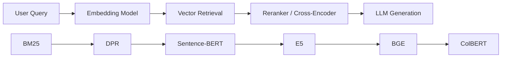
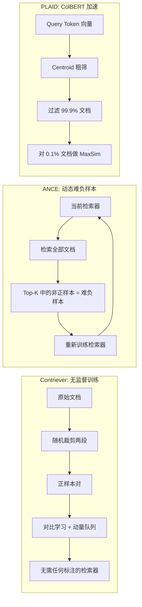
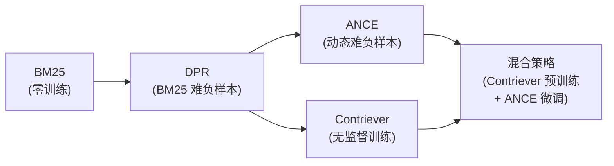

# Dense Retrieval Advanced (Contriever / ANCE / PLAID)

## 知识地图



## 前置知识

- **DPR 基础**：双塔架构、对比学习、InfoNCE 损失（见 bm25-dpr.md）
- **对比学习**：正负样本对、动量编码器、MoCo 机制
- **ColBERT**：Late Interaction、MaxSim 相似度计算（见 sbert-colbert.md）
- **向量索引**：FAISS、IVF、HNSW（见 faiss-vector-index.md）

## 为什么会出现 (Why)

DPR 在 2020 年首次证明了稠密检索可以超越 BM25。但它有三个关键局限：

1. **依赖 BM25 产生训练数据**：DPR 需要 BM25 来产生 Hard Negatives——这隐含假设 BM25 能找到"接近但不相关"的文档。但如果 BM25 找不到呢？对于那些 BM25 本身也检索不到的语义改写，DPR 就缺乏足够好的负样本。
2. **负样本不够"难"**：In-batch negatives 和 BM25 负样本对模型来说挑战不够。模型很快就能学会区分，训练饱和后精度不再提升。
3. **ColBERT 太慢**：ColBERT 的 Late Interaction 效果好但推理慢——每个 query token 都要和每个 doc token 算相似度，无法直接应用大规模检索。

Contriever（无监督训练）、ANCE（动态难负样本挖掘）和 PLAID（ColBERT 加速）正是针对这三个局限的解决方案。

## 解决什么问题 (Problem)

- **Contriever**：如何在没有任何标注数据的情况下，仅用无监督语料训练出高质量的稠密检索器？
- **ANCE**：如何让模型在训练过程中不断遇到"越来越难"的负样本，实现持续提升？
- **PLAID**：如何在保持 ColBERT 检索精度的同时，将推理速度提升 100 倍以上？

## 核心思想

DPR 用 BM25 产生的负样本训练密集检索器，但 BM25 的负样本不够"难"——模型很快就能区分，这限制了检索精度的进一步提升。三个方向突破：Contriever 完全无监督训练（连 BM25 都不用）、ANCE 在训练中动态生成最难的负样本、PLAID 在 ColBERT 基础上大幅加速推理。核心命题：**更好的负样本 → 更好的检索器**。

---

## 数学定义与原理解析

### Contriever — 无监督对比检索

完全不需要人工标注或 BM25，只用无监督数据通过对比学习训练。关键技巧是 **MoCo 风格的动量编码器** + **随机裁剪正样本对**：

学习目标（InfoNCE）：

$$
\mathcal{L} = -\log \frac{\exp(\text{sim}(q, k_+) / \tau)}{\sum_j \exp(\text{sim}(q, k_j) / \tau)}
$$

正样本 $k_+$ 来自同一文档的**不同片段**（随机裁剪），负样本来自 batch 内其他文档或动量队列。这与 SimCLR 一样，但用于文本检索场景。

**通俗解释：** Contriever 不需要任何标注——它自己创造训练数据。方法是：从同一篇文章中随机裁两段（比如第一段和第二段），这两段天然相关，构成正样本对。所有其他文章（或历史缓存中存的其他片段）都是负样本。动量编码器的作用是维护一个"负样本队列"——记录过去见过的文档片段，而不必在当前 batch 中全部重新计算。这样即使不用任何人工标注，模型也能学到很好的语义检索能力。

### ANCE — 难负样本挖掘

DPR 的问题：用 BM25 或 in-batch negatives 训练，这些负样本对模型来说太简单了。ANCE 的核心思想是**异步难负样本挖掘**：

1. 用当前模型对所有候选文档编码
2. 对每个 query，检索 Top-K —— 其中排在高位但不是正样本的就是"难的负样本"
3. 用这些难负样本重新训练模型
4. 重复 1-3

```
每轮训练: 编码所有文档 → 检索 → 选难负样本 → 更新模型
```

$$
\mathcal{L}_{ANCE} = -\log \frac{\exp(q \cdot d_+ / \tau)}{\exp(q \cdot d_+ / \tau) + \sum_{d_- \in H(q)} \exp(q \cdot d_- / \tau)}
$$

$H(q)$ 是从当前 Top-K 检索结果中选出的难负样本集合。

**通俗解释：** ANCE 的核心理念是"让模型自己为难自己"。训练开始时的负样本：随机文档（太容易区分）。训练几轮后的负样本：BM25 高分但实际不相关的文档（难一点）。ANCE 更进一步——每轮训练完后，用模型自身去检索一遍所有文档，找到那些模型"差一点就判断错了"的文档（被模型排到高位但实际不相关），把它们作为下一轮训练的负样本。这就像学生反复做错题本上的题，不断提升。

这个过程中最关键的是"异步"——不能每次梯度更新都重新检索全部文档（太慢），而是每训练几轮才更新一次难负样本池。

### PLAID — 高效 ColBERT 检索

ColBERT 的 Late Interaction（每个 token 单独编码然后做 MaxSim）虽然效果好但推理慢。PLAID 通过两阶段候选生成大幅加速：

1. **Candidate Generation**：用 centroid 近似（所有 token embedding 的聚类中心），快速过滤掉 99.9% 的文档
2. **Late Interaction**：只对剩下的候选文档做精确 MaxSim 计算

速度提升 100× 以上，同时保持几乎相同的精度。

**通俗解释：** ColBERT 效果好但慢——因为要对每个文档的每个 token 做计算。PLAID 的 trick 是：先对所有文档的 token 向量做聚类，用聚类中心（centroids）作为"粗筛器"。Query 来了，先用 query token 和聚类中心快速判断"这个文档大概率无关，跳过"——这步过滤掉 99.9% 的文档。对剩下 0.1% 的候选，再做完整的 MaxSim 精确计算。就像面试筛简历——先用关键词快速过滤 1000 份简历，只对 10 份进入面试的做详细评估。

---

## 可视化展示

### 难负样本的影响

```echarts
return {
  tooltip: { trigger: "axis", confine: true },
  title: { top: 5,  text: '负样本类型对检索性能的影响', left: 'center', textStyle: { fontSize: 12 } },
  xAxis: { type: 'category', data: ['随机负样本', 'BM25 负样本', 'In-Batch 负样本', '难负样本 (ANCE)'] },
  yAxis: { type: 'value', min: 60, max: 90, name: 'MRR@10' },
  series: [{
    type: 'bar',
    data: [65, 72, 78, 87],
    itemStyle: { color: '#2c3e50' },
    label: { show: true, position: 'top' }
  }],
  grid: { left: 60, right: 20, top: 55, bottom: 55 }
}
```

### 三种方法的定位与关系



### 检索器训练技术演进



---

## 核心代码实现

### PyTorch — Contriever 训练循环

```python
import torch
import torch.nn.functional as F

def contriever_loss(q_emb, k_emb, temperature=0.05, queue=None):
    """
    q_emb: [B, D] — query 编码
    k_emb: [B, D] — key 编码 (正样本, 来自同一文档的另一段)
    queue: [Q, D] — 动量队列 (来自其他文档的历史 key)
    """
    B = q_emb.shape[0]

    # 正样本相似度
    pos_sim = torch.sum(q_emb * k_emb, dim=-1).unsqueeze(1)  # [B, 1]

    # 负样本相似度: batch 内其他 key
    neg_sim = q_emb @ k_emb.T  # [B, B]
    diag_mask = torch.eye(B, device=q_emb.device).bool()
    neg_sim = neg_sim.masked_fill(diag_mask, float('-inf'))

    # 如果有队列，拼接
    if queue is not None:
        queue_sim = q_emb @ queue.T  # [B, Q]
        logits = torch.cat([pos_sim, neg_sim, queue_sim], dim=1)
    else:
        logits = torch.cat([pos_sim, neg_sim], dim=1)

    labels = torch.zeros(B, dtype=torch.long, device=q_emb.device)
    return F.cross_entropy(logits / temperature, labels)


# 动量编码器更新
@torch.no_grad()
def momentum_update(student, teacher, m=0.999):
    for s_param, t_param in zip(student.parameters(), teacher.parameters()):
        t_param.data = m * t_param.data + (1 - m) * s_param.data
```

**通俗解释（动量更新）：** 教师编码器的参数不是通过梯度下降更新的，而是缓慢地朝学生编码器的方向"移动"（m=0.999 意味着每次只更新 0.1%）。这保证了教师编码器产生的负样本向量是稳定的——如果教师编码器变化太快，上一轮的负样本和这一轮的正样本就不可比了。队列越大（如 65536），模型能看到的负样本越多，训练效果越好。

### PyTorch — MaxSim (ColBERT Late Interaction)

```python
def colbert_score(q_embs, d_embs, doc_mask=None):
    """
    q_embs: [B, T_q, D] — query 的 token 级编码
    d_embs: [B, T_d, D] — doc 的 token 级编码
    """
    # [B, T_q, T_d] — 每个 query token 与每个 doc token 的相似度
    sim = q_embs @ d_embs.transpose(-1, -2)
    if doc_mask is not None:
        sim = sim.masked_fill(doc_mask.unsqueeze(1) == 0, float('-inf'))
    # MaxSim: 每个 query token 取其最相似的 doc token
    max_per_query = sim.max(dim=-1)[0]  # [B, T_q]
    return max_per_query.sum(dim=-1)    # [B]
```

**通俗解释（MaxSim）：** 对于 query 中的每个 token（如"机器学习"的"机器"和"学习"），在 doc 的所有 token 中找到相似度最高的那个（"机器"可能匹配到"计算机"，"学习"匹配到"训练"），累加这些最高相似度。这与 SBERT 的区别是：SBERT 是把整个 query 和整个 doc 各压成一个向量再算相似度，ColBERT 是保留每个 token 做精细匹配。

---

## 工业界应用

| 方法 | 应用场景 | 原因 |
|------|---------|------|
| Contriever | 零标注数据的业务冷启动 | 不需要人工标注，开箱即用 |
| ANCE | 有充足计算资源的场景 | 动态难负样本挖掘需要周期性重新索引 |
| PLAID | 大规模 ColBERT 检索 | 加速 100x，使 ColBERT 可用于百万级文档 |
| Contriever + ANCE | 追求极致精度的场景 | 无监督预训练 + 动态难负样本微调 |
| DPR (Baseline) | 有标注数据且 BM25 足够好 | 简单可靠，工程成熟 |

---

## 对比表格

| 维度 | DPR | Contriever | ANCE | PLAID |
|------|-----|------------|------|-------|
| 训练数据需求 | 标注 (q, d+, d-) | 无监督语料 | 标注 (q, d+) | 无需额外训练 |
| 负样本质量 | 中等 (BM25) | 低 (随机/队列) | 最高 (动态挖掘) | N/A |
| 创新点 | 双塔 + Hard Negatives | MoCo + 随机裁剪 | 异步难负样本挖掘 | Centroid 粗筛 |
| 优势 | 工程简单，成熟 | 零标注成本 | 精度最高 | 加速 ColBERT |
| 劣势 | 依赖 BM25 | 精度略低于有监督 | 计算成本高（需反复索引） | 精度略低于原始 ColBERT |

---

## 学完后建议继续学习

1. **RAG 基础** — 将检索模型集成到完整的 RAG Pipeline
2. **BM25 与 DPR** — 回顾稀疏检索和稠密检索的基础
3. **Sentence-BERT / ColBERT** — 理解 PLAID 加速对象的核心原理
4. **FAISS 向量索引** — ANCE 的反复索引依赖高效的向量索引
5. **BGE / E5 模型** — 了解基于 Contriever/ANCE 思路训练的最新模型

---

## 高频面试题

**Q1: DPR、Contriever 和 ANCE 的核心区别是什么？**

A: 核心区别在于"如何获取负样本"。DPR 依赖 BM25 静态生成 Hard Negatives——负样本质量受限于 BM25 的能力。Contriever 完全放弃人工标注，用无监督数据（同一文档的不同片段构成正样本对）+ 动量队列存储负样本。ANCE 是动态难负样本挖掘：每训练几轮就用当前模型检索全部文档，将模型自己排在高位但实际不相关的文档作为下一轮训练的负样本——这是"让模型越来越难"的自举式训练。

**Q2: Contriever 的动量编码器为什么关键？**

A: 动量编码器维护一个"负样本队列"——过去见过的文档片段的向量表示。不用动量编码器的话，要么只能使用当前 batch 内的负样本（数量有限，通常 64-256 个），要么需要对全部文档重新编码（计算成本太高）。动量更新的作用是保证队列中历史样本的向量表示保持稳定——如果教师编码器随训练剧烈变化，上周存的负样本向量和这周的正样本向量就不在同一空间中了。动量 m=0.999 意味着每次只更新 0.1%，保证了表示的稳定性。

**Q3: ANCE 的 "异步" 意味着什么？为什么不每步都更新？**

A: "异步"指难负样本的挖掘和模型更新不是同步进行的。ANCE 每训练几轮（如一个 epoch）才重新编码全部文档、重新检索、重新选出难负样本。原因很简单：如果每次梯度更新后都重新索引和检索全部文档，计算成本过高（N 个文档 x d 维向量 x 全部重新编码）。异步更新是精度和效率之间的平衡——牺牲一点难负样本的"时效性"，换取可接受的计算成本。

**Q4: PLAID 如何实现 ColBERT 的 100x 加速？精度损失多少？**

A: PLAID 两阶段加速：1) 对文档所有 token 向量做 K-Means 聚类（centroids），query token 先和 centroids 算相似度——快速过滤掉 99.9% 的文档（因为大部分文档没有任何 token 与 query 相关）；2) 仅对剩余的 0.1% 做完整 MaxSim 计算。精度损失通常 < 1% MRR，因为在 centroid 阶段被过滤的文档大概率真的不相关（它们的 token 和 query token 在粗粒度上都对不上）。

**Q5: 在实际工程中，如何选择训练检索器的方法？**

A: 决策路径：1) 是否有标注数据？没有 → Contriever（无监督）；有少量 → Contriever 预训练 + DPR 微调；有大量 → ANCE。2) 计算资源是否充足？充足 → 考虑 ANCE（需要反复索引）；有限 → DPR 或 Contriever。3) 业务精度要求如何？极致精度 → Contriever 预训练 + ANCE 微调；一般要求 → BGE/E5 等开箱即用的 SOTA 模型即可。大多数工业场景推荐直接使用 BGE-M3 或 E5 ——它们已经融合了这些论文的思想并做了全面优化。
